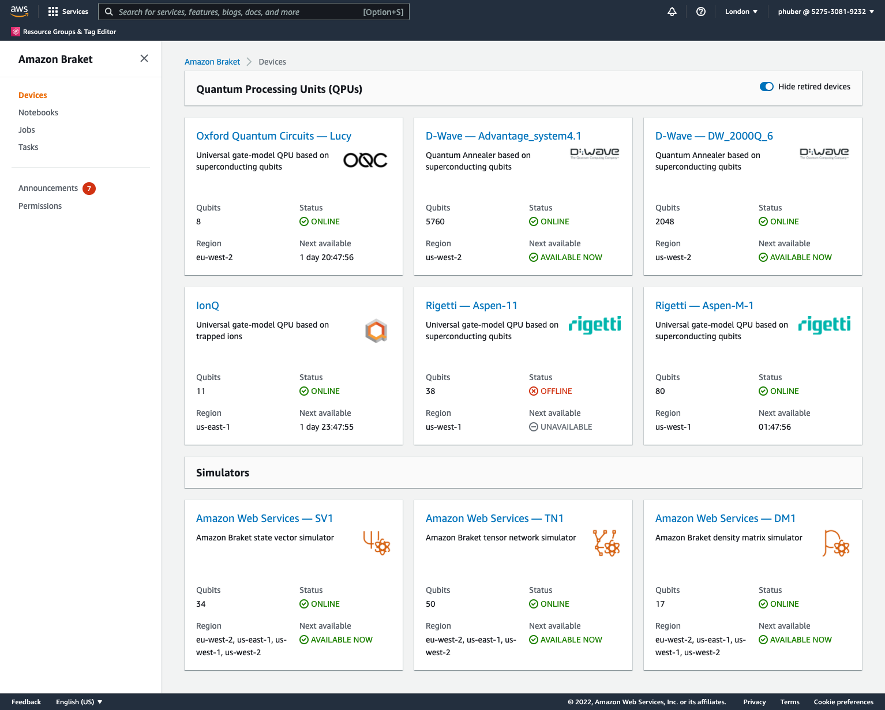

- [PennyLane Plugin](#pennylane-plugin)
- [Amazon Braket](#amazon-braket)
- [Region](#region)
  - [Region availability of Amazon Braket](#region-availability-of-amazon-braket)
- [Pricing](#pricing)
  - [Hardware](#hardware)
    - [Example ~100 Dollar Rigetti M-1](#example-100-dollar-rigetti-m-1)
  - [Simulators: AWS Free Tier](#simulators-aws-free-tier)

# PennyLane Plugin
[PennyLane-Braket Plugin](https://amazon-braket-pennylane-plugin-python.readthedocs.io/en/latest/)

# Amazon Braket
- [Amazon Braket (General)](https://aws.amazon.com/braket/)
- [Supported Braket Devices](https://docs.aws.amazon.com/braket/latest/developerguide/braket-devices.html)

Examples:
- https://github.com/aws/amazon-braket-examples
  - [Getting Started](https://github.com/aws/amazon-braket-examples/blob/main/examples/pennylane/0_Getting_started.ipynb)
- Pennylane example on AWS Docs: https://docs.aws.amazon.com/braket/latest/developerguide/hybrid.html
- How to use the Pennylane `qml` Amazon Braket device: [braket.pennylane_plugin.BraketAwsQubitDevice](https://amazon-braket-pennylane-plugin-python.readthedocs.io/en/latest/code/api/braket.pennylane_plugin.BraketAwsQubitDevice.html)

## AWS Console Screenshot (London)

# Region

## Region availability of Amazon Braket
|       Region Name       |  Region   |        Braket Endpoint         |     QPU     |
| :---------------------: | :-------: | :----------------------------: | :---------: |
|  US East (N. Virginia)  | us-east-1 | braket.us-east-1.amazonaws.com |  **IonQ**   |
| US West (N. California) | us-west-1 | braket.us-west-1.amazonaws.com | **Rigetti** |
|    US West (Oregon)     | us-west-2 | braket.us-west-2.amazonaws.com | **D-Wave**  |
|   EU West 2 (London)    | eu-west-2 | braket.eu-west-2.amazonaws.com |   **OQC**   |

# Pricing

Official pricing page: https://aws.amazon.com/de/braket/pricing/

## Hardware
Quantum Computers

| Hardware Provider | QPU family  | Per-task price | Per-shot price |
| :---------------: | :---------: | :------------: | :------------: |
|      D-Wave       |    2000Q    |    $0.30000    |    $0.00019    |
|      D-Wave       |  Advantage  |    $0.30000    |    $0.00019    |
|       IonQ        | IonQ device |    $0.30000    |    $0.01000    |
|        OQC        |    Lucy     |    $0.30000    |    $0.00035    |
|      Rigetti      |  Aspen-11   |    $0.30000    |    $0.00035    |
|      Rigetti      |     M-1     |    $0.30000    |    $0.00035    |

### Example ~100 Dollar Rigetti M-1

**Rigetti M-1 quantum computer in the AWS US West (N. California) Region**

Use Calculator page: https://calculator.aws/#/createCalculator/Braket

## Simulators: AWS Free Tier
Amazon Braket is part of the AWS Free Tier. The AWS Free Tier gives you one free hour of **quantum circuit simulation** time per month during the first twelve months of use. This applies to simulation time on SV1, DM1, TN1, or any combination of those three managed quantum circuit simulators, or use of simulators through the Hybrid Jobs feature. Standard rates for incremental usage apply after the free hour has been used. Use of other Amazon Braket resources such as managed notebooks, hybrid job instances, and quantum computers will incur costs.
