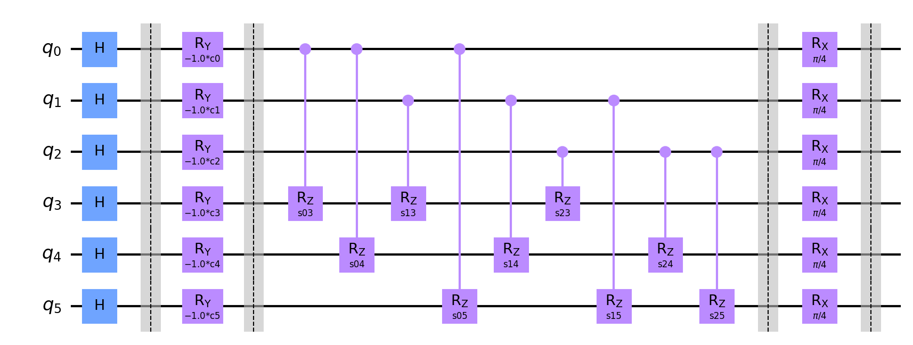

# Information for this data run

Amount of queries: 2

Amount of plans per query: [3, 3]

Amount of problems: 5000

Amount of shots: 10000

<hr>

## Circuit:



<hr>

## Percentile results:

```

75.08% percentile reached a distance of 0 to the best solution

15.74% percentile reached a distance of 1 to the best solution

5.84% percentile reached a distance of 2 to the best solution

2.32% percentile reached a distance of 3 to the best solution

0.68% percentile reached a distance of 4 to the best solution

0.26% percentile reached a distance of 5 to the best solution

0.08% percentile reached a distance of 6 to the best solution

```

<hr>

## Data:

[Problem Data](problems.csv)

[Measurements Data](measurements.csv)

