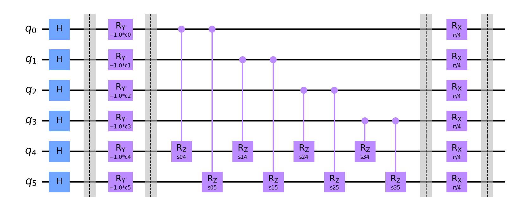

# Information for this data run

Amount of queries: 2

Amount of plans per query: [4, 2]

Amount of problems: 5000

Amount of shots: 10000

<hr>

## Circuit:



<hr>

## Percentile results:

```

74.24% percentile reached a distance of 0 to the best solution

17.68% percentile reached a distance of 1 to the best solution

5.70% percentile reached a distance of 2 to the best solution

1.64% percentile reached a distance of 3 to the best solution

0.56% percentile reached a distance of 4 to the best solution

0.10% percentile reached a distance of 5 to the best solution

0.08% percentile reached a distance of 6 to the best solution

```

<hr>

## Data:

[Problem Data](problems.csv)

[Measurements Data](measurements.csv)

