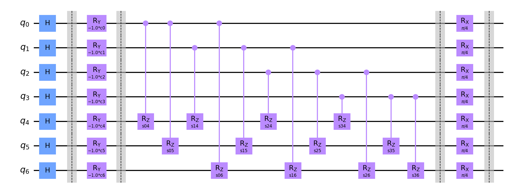

# Information for this data run

Amount of queries: 2

Amount of plans per query: [4, 3]

Amount of problems: 5000

Amount of shots: 10000

<hr>

## Circuit:



<hr>

## Percentile results:

```

70.80% percentile reached a distance of 0 to the best solution

17.14% percentile reached a distance of 1 to the best solution

7.04% percentile reached a distance of 2 to the best solution

2.86% percentile reached a distance of 3 to the best solution

1.32% percentile reached a distance of 4 to the best solution

0.28% percentile reached a distance of 5 to the best solution

0.32% percentile reached a distance of 6 to the best solution

0.16% percentile reached a distance of 7 to the best solution

0.06% percentile reached a distance of 8 to the best solution

0.02% percentile reached a distance of 9 to the best solution

```

<hr>

## Data:

[Problem Data](problems.csv)

[Measurements Data](measurements.csv)

