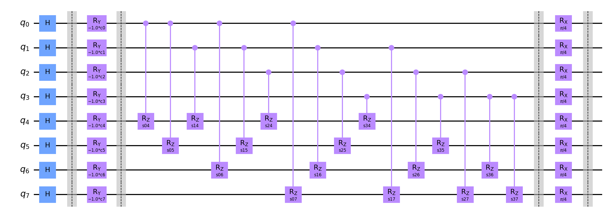

# Information for this data run

Amount of queries: 4

Amount of plans per query: [3, 4, 3, 5]

Amount of problems: 5000

Amount of shots: 10000

<hr>

## Circuit:



<hr>

## Percentile results:

```

2.12% percentile reached a distance of 0 to the best solution

2.24% percentile reached a distance of 1 to the best solution

1.76% percentile reached a distance of 2 to the best solution

1.84% percentile reached a distance of 3 to the best solution

1.70% percentile reached a distance of 4 to the best solution

1.96% percentile reached a distance of 5 to the best solution

1.80% percentile reached a distance of 6 to the best solution

1.66% percentile reached a distance of 7 to the best solution

1.90% percentile reached a distance of 8 to the best solution

1.80% percentile reached a distance of 9 to the best solution

2.10% percentile reached a distance of 10 to the best solution

1.76% percentile reached a distance of 11 to the best solution

1.60% percentile reached a distance of 12 to the best solution

1.44% percentile reached a distance of 13 to the best solution

1.76% percentile reached a distance of 14 to the best solution

1.42% percentile reached a distance of 15 to the best solution

1.38% percentile reached a distance of 16 to the best solution

1.46% percentile reached a distance of 17 to the best solution

1.52% percentile reached a distance of 18 to the best solution

1.38% percentile reached a distance of 19 to the best solution

1.48% percentile reached a distance of 20 to the best solution

1.58% percentile reached a distance of 21 to the best solution

1.52% percentile reached a distance of 22 to the best solution

1.62% percentile reached a distance of 23 to the best solution

1.24% percentile reached a distance of 24 to the best solution

1.40% percentile reached a distance of 25 to the best solution

1.86% percentile reached a distance of 26 to the best solution

1.40% percentile reached a distance of 27 to the best solution

1.34% percentile reached a distance of 28 to the best solution

1.74% percentile reached a distance of 29 to the best solution

1.06% percentile reached a distance of 30 to the best solution

1.24% percentile reached a distance of 31 to the best solution

1.12% percentile reached a distance of 32 to the best solution

1.22% percentile reached a distance of 33 to the best solution

1.36% percentile reached a distance of 34 to the best solution

1.32% percentile reached a distance of 35 to the best solution

1.24% percentile reached a distance of 36 to the best solution

0.98% percentile reached a distance of 37 to the best solution

1.12% percentile reached a distance of 38 to the best solution

1.36% percentile reached a distance of 39 to the best solution

1.30% percentile reached a distance of 40 to the best solution

1.00% percentile reached a distance of 41 to the best solution

1.14% percentile reached a distance of 42 to the best solution

0.68% percentile reached a distance of 43 to the best solution

1.18% percentile reached a distance of 44 to the best solution

1.00% percentile reached a distance of 45 to the best solution

1.22% percentile reached a distance of 46 to the best solution

1.22% percentile reached a distance of 47 to the best solution

1.10% percentile reached a distance of 48 to the best solution

1.10% percentile reached a distance of 49 to the best solution

1.30% percentile reached a distance of 50 to the best solution

0.92% percentile reached a distance of 51 to the best solution

1.08% percentile reached a distance of 52 to the best solution

0.90% percentile reached a distance of 53 to the best solution

1.06% percentile reached a distance of 54 to the best solution

1.26% percentile reached a distance of 55 to the best solution

0.84% percentile reached a distance of 56 to the best solution

0.94% percentile reached a distance of 57 to the best solution

0.98% percentile reached a distance of 58 to the best solution

0.76% percentile reached a distance of 59 to the best solution

0.84% percentile reached a distance of 60 to the best solution

0.74% percentile reached a distance of 61 to the best solution

1.02% percentile reached a distance of 62 to the best solution

1.00% percentile reached a distance of 63 to the best solution

0.62% percentile reached a distance of 64 to the best solution

0.90% percentile reached a distance of 65 to the best solution

0.92% percentile reached a distance of 66 to the best solution

0.98% percentile reached a distance of 67 to the best solution

0.86% percentile reached a distance of 68 to the best solution

0.70% percentile reached a distance of 69 to the best solution

0.64% percentile reached a distance of 70 to the best solution

0.82% percentile reached a distance of 71 to the best solution

0.72% percentile reached a distance of 72 to the best solution

0.88% percentile reached a distance of 73 to the best solution

0.54% percentile reached a distance of 74 to the best solution

0.62% percentile reached a distance of 75 to the best solution

0.60% percentile reached a distance of 76 to the best solution

0.58% percentile reached a distance of 77 to the best solution

0.58% percentile reached a distance of 78 to the best solution

0.86% percentile reached a distance of 79 to the best solution

0.68% percentile reached a distance of 80 to the best solution

0.68% percentile reached a distance of 81 to the best solution

0.44% percentile reached a distance of 82 to the best solution

```

<hr>

## Data:

[Problem Data](problems.csv)

[Measurements Data](measurements.csv)

