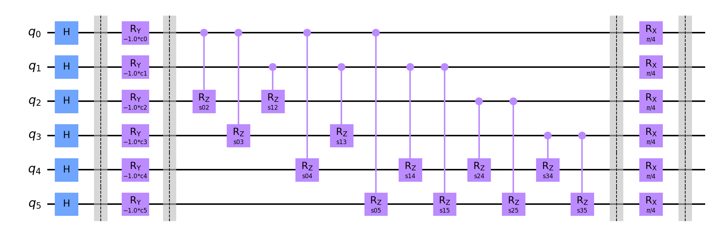

# Information for this data run

Amount of queries: 4

Amount of plans per query: [2, 2, 2, 2]

Amount of problems: 5000

Amount of shots: 10000

<hr>

## Circuit:



<hr>

## Percentile results:

```

52.78% percentile reached a distance of 0 to the best solution

21.66% percentile reached a distance of 1 to the best solution

10.78% percentile reached a distance of 2 to the best solution

5.40% percentile reached a distance of 3 to the best solution

3.64% percentile reached a distance of 4 to the best solution

1.70% percentile reached a distance of 5 to the best solution

1.34% percentile reached a distance of 6 to the best solution

1.00% percentile reached a distance of 7 to the best solution

0.62% percentile reached a distance of 8 to the best solution

0.46% percentile reached a distance of 9 to the best solution

0.22% percentile reached a distance of 10 to the best solution

0.16% percentile reached a distance of 11 to the best solution

0.06% percentile reached a distance of 12 to the best solution

0.12% percentile reached a distance of 13 to the best solution

0.02% percentile reached a distance of 14 to the best solution

0.04% percentile reached a distance of 15 to the best solution

```

<hr>

## Data:

[Problem Data](problems.csv)

[Measurements Data](measurements.csv)

