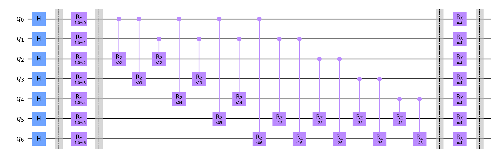

# Information for this data run

Amount of queries: 3

Amount of plans per query: [2, 3, 2]

Amount of problems: 5000

Amount of shots: 10000

<hr>

## Circuit:



<hr>

## Percentile results:

```

61.60% percentile reached a distance of 0 to the best solution

20.16% percentile reached a distance of 1 to the best solution

9.04% percentile reached a distance of 2 to the best solution

4.66% percentile reached a distance of 3 to the best solution

2.46% percentile reached a distance of 4 to the best solution

1.18% percentile reached a distance of 5 to the best solution

0.58% percentile reached a distance of 6 to the best solution

0.16% percentile reached a distance of 7 to the best solution

0.16% percentile reached a distance of 8 to the best solution

```

<hr>

## Data:

[Problem Data](problems.csv)

[Measurements Data](measurements.csv)

