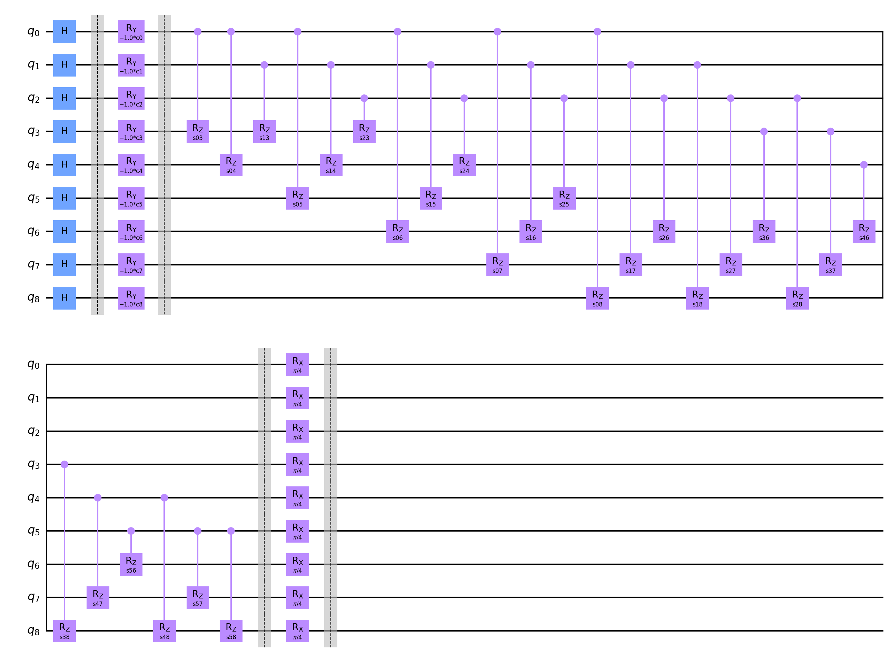

# Information for this data run

Amount of queries: 3

Amount of plans per query: [3, 3, 3]

Amount of problems: 5000

Amount of shots: 10000

<hr>

## Circuit:



<hr>

## Percentile results:

```

25.28% percentile reached a distance of 0 to the best solution

15.78% percentile reached a distance of 1 to the best solution

13.62% percentile reached a distance of 2 to the best solution

10.74% percentile reached a distance of 3 to the best solution

7.86% percentile reached a distance of 4 to the best solution

6.24% percentile reached a distance of 5 to the best solution

4.34% percentile reached a distance of 6 to the best solution

3.20% percentile reached a distance of 7 to the best solution

3.22% percentile reached a distance of 8 to the best solution

2.08% percentile reached a distance of 9 to the best solution

1.66% percentile reached a distance of 10 to the best solution

1.36% percentile reached a distance of 11 to the best solution

1.22% percentile reached a distance of 12 to the best solution

0.96% percentile reached a distance of 13 to the best solution

0.72% percentile reached a distance of 14 to the best solution

0.48% percentile reached a distance of 15 to the best solution

0.38% percentile reached a distance of 16 to the best solution

0.28% percentile reached a distance of 17 to the best solution

0.20% percentile reached a distance of 18 to the best solution

0.18% percentile reached a distance of 19 to the best solution

0.08% percentile reached a distance of 20 to the best solution

0.04% percentile reached a distance of 21 to the best solution

0.06% percentile reached a distance of 22 to the best solution

0.02% percentile reached a distance of 23 to the best solution

```

<hr>

## Data:

[Problem Data](problems.csv)

[Measurements Data](measurements.csv)

