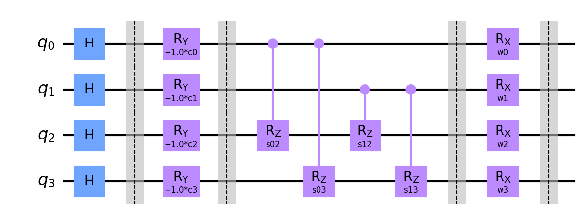
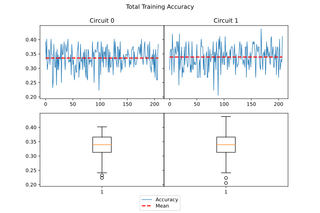
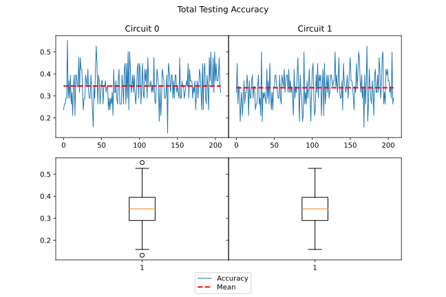

# Results for hyperparameter check for optimizer AMSGRAD

Amount of queries: 2

Amount of plans per query: 2

Amount of problems: 150

Amount of shots: 1024

Amount of runs per parameters and circuit: 13



## Circuits:

#### Circuit 0



#### Circuit 1





## Result overview:

#### Mean Score Training C0 vs C1: 0.36 - 0.35



#### Mean Score Testing C0 vs C1: 0.39 - 0.38



### Sorted for best Testing Accuracy:

|maxiter|tol|lr|beta_1|beta_2|noise_factor|eps|amsgrad|snapshot_dir|circuit | Testing Accuracy Mean | Training Accuracy Mean |
|:-:|:-:|:-:|:-:|:-:|:-:|:-:|:-:|:-:|:-:|:-:|:-:|
|50|1e-06|0.005|0.9|0.85|5e-08|1e-10|True|None|0 | 0.39 | 0.33 |
|50|1e-06|0.005|0.9|0.85|1e-08|1e-10|True|None|1 | 0.38 | 0.35 |
|50|1e-06|0.001|0.99|0.9|5e-08|1e-10|True|None|0 | 0.37 | 0.31 |
|50|1e-06|0.001|0.9|0.85|1e-08|1e-10|True|None|0 | 0.37 | 0.33 |
|50|1e-06|0.005|0.99|0.9|1e-08|1e-10|True|None|0 | 0.37 | 0.34 |
|50|1e-06|0.005|0.99|0.85|1e-08|1e-10|True|None|1 | 0.36 | 0.34 |
|50|1e-06|0.005|0.9|0.9|1e-08|1e-10|True|None|1 | 0.36 | 0.35 |
|50|1e-06|0.005|0.9|0.85|1e-08|1e-10|True|None|0 | 0.36 | 0.34 |
|50|1e-06|0.001|0.9|0.85|5e-08|1e-10|True|None|0 | 0.36 | 0.35 |
|50|1e-06|0.005|0.9|0.9|1e-08|1e-10|True|None|0 | 0.35 | 0.34 |
|50|1e-06|0.005|0.9|0.85|5e-08|1e-10|True|None|1 | 0.35 | 0.34 |
|50|1e-06|0.005|0.99|0.85|1e-08|1e-10|True|None|0 | 0.35 | 0.33 |
|50|1e-06|0.001|0.99|0.85|5e-08|1e-10|True|None|0 | 0.35 | 0.34 |
|50|1e-06|0.005|0.99|0.9|5e-08|1e-10|True|None|1 | 0.35 | 0.33 |
|50|1e-06|0.005|0.99|0.85|5e-08|1e-10|True|None|1 | 0.35 | 0.35 |
|50|1e-06|0.005|0.99|0.9|1e-08|1e-10|True|None|1 | 0.34 | 0.35 |
|50|1e-06|0.005|0.99|0.85|5e-08|1e-10|True|None|0 | 0.34 | 0.34 |
|50|1e-06|0.001|0.9|0.9|5e-08|1e-10|True|None|1 | 0.34 | 0.32 |
|50|1e-06|0.001|0.9|0.9|1e-08|1e-10|True|None|1 | 0.34 | 0.33 |
|50|1e-06|0.005|0.9|0.9|5e-08|1e-10|True|None|0 | 0.34 | 0.36 |
|50|1e-06|0.001|0.99|0.85|5e-08|1e-10|True|None|1 | 0.33 | 0.32 |
|50|1e-06|0.005|0.9|0.9|5e-08|1e-10|True|None|1 | 0.32 | 0.34 |
|50|1e-06|0.001|0.99|0.85|1e-08|1e-10|True|None|0 | 0.32 | 0.35 |
|50|1e-06|0.001|0.99|0.9|5e-08|1e-10|True|None|1 | 0.32 | 0.34 |
|50|1e-06|0.001|0.9|0.85|1e-08|1e-10|True|None|1 | 0.32 | 0.33 |
|50|1e-06|0.005|0.99|0.9|5e-08|1e-10|True|None|0 | 0.32 | 0.33 |
|50|1e-06|0.001|0.9|0.85|5e-08|1e-10|True|None|1 | 0.32 | 0.35 |
|50|1e-06|0.001|0.9|0.9|5e-08|1e-10|True|None|0 | 0.32 | 0.32 |
|50|1e-06|0.001|0.99|0.9|1e-08|1e-10|True|None|0 | 0.31 | 0.35 |
|50|1e-06|0.001|0.9|0.9|1e-08|1e-10|True|None|0 | 0.3 | 0.32 |
|50|1e-06|0.001|0.99|0.9|1e-08|1e-10|True|None|1 | 0.3 | 0.35 |
|50|1e-06|0.001|0.99|0.85|1e-08|1e-10|True|None|1 | 0.3 | 0.34 |
### Sorted for best Training Accuracy:

|maxiter|tol|lr|beta_1|beta_2|noise_factor|eps|amsgrad|snapshot_dir|circuit | Testing Accuracy Mean | Training Accuracy Mean |
|:-:|:-:|:-:|:-:|:-:|:-:|:-:|:-:|:-:|:-:|:-:|:-:|
|50|1e-06|0.005|0.9|0.9|5e-08|1e-10|True|None|0 | 0.34 | 0.36 |
|50|1e-06|0.005|0.9|0.9|1e-08|1e-10|True|None|1 | 0.36 | 0.35 |
|50|1e-06|0.001|0.99|0.9|1e-08|1e-10|True|None|0 | 0.31 | 0.35 |
|50|1e-06|0.001|0.9|0.85|5e-08|1e-10|True|None|1 | 0.32 | 0.35 |
|50|1e-06|0.005|0.99|0.85|5e-08|1e-10|True|None|1 | 0.35 | 0.35 |
|50|1e-06|0.001|0.99|0.9|1e-08|1e-10|True|None|1 | 0.3 | 0.35 |
|50|1e-06|0.001|0.9|0.85|5e-08|1e-10|True|None|0 | 0.36 | 0.35 |
|50|1e-06|0.005|0.99|0.9|1e-08|1e-10|True|None|1 | 0.34 | 0.35 |
|50|1e-06|0.001|0.99|0.85|1e-08|1e-10|True|None|0 | 0.32 | 0.35 |
|50|1e-06|0.005|0.9|0.85|1e-08|1e-10|True|None|1 | 0.38 | 0.35 |
|50|1e-06|0.005|0.99|0.9|1e-08|1e-10|True|None|0 | 0.37 | 0.34 |
|50|1e-06|0.005|0.9|0.9|5e-08|1e-10|True|None|1 | 0.32 | 0.34 |
|50|1e-06|0.005|0.99|0.85|1e-08|1e-10|True|None|1 | 0.36 | 0.34 |
|50|1e-06|0.001|0.99|0.85|5e-08|1e-10|True|None|0 | 0.35 | 0.34 |
|50|1e-06|0.005|0.9|0.85|1e-08|1e-10|True|None|0 | 0.36 | 0.34 |
|50|1e-06|0.005|0.9|0.85|5e-08|1e-10|True|None|1 | 0.35 | 0.34 |
|50|1e-06|0.005|0.99|0.85|5e-08|1e-10|True|None|0 | 0.34 | 0.34 |
|50|1e-06|0.005|0.9|0.9|1e-08|1e-10|True|None|0 | 0.35 | 0.34 |
|50|1e-06|0.001|0.99|0.9|5e-08|1e-10|True|None|1 | 0.32 | 0.34 |
|50|1e-06|0.001|0.99|0.85|1e-08|1e-10|True|None|1 | 0.3 | 0.34 |
|50|1e-06|0.001|0.9|0.85|1e-08|1e-10|True|None|0 | 0.37 | 0.33 |
|50|1e-06|0.005|0.99|0.9|5e-08|1e-10|True|None|1 | 0.35 | 0.33 |
|50|1e-06|0.001|0.9|0.85|1e-08|1e-10|True|None|1 | 0.32 | 0.33 |
|50|1e-06|0.005|0.99|0.9|5e-08|1e-10|True|None|0 | 0.32 | 0.33 |
|50|1e-06|0.005|0.99|0.85|1e-08|1e-10|True|None|0 | 0.35 | 0.33 |
|50|1e-06|0.001|0.9|0.9|1e-08|1e-10|True|None|1 | 0.34 | 0.33 |
|50|1e-06|0.005|0.9|0.85|5e-08|1e-10|True|None|0 | 0.39 | 0.33 |
|50|1e-06|0.001|0.9|0.9|5e-08|1e-10|True|None|1 | 0.34 | 0.32 |
|50|1e-06|0.001|0.99|0.85|5e-08|1e-10|True|None|1 | 0.33 | 0.32 |
|50|1e-06|0.001|0.9|0.9|5e-08|1e-10|True|None|0 | 0.32 | 0.32 |
|50|1e-06|0.001|0.9|0.9|1e-08|1e-10|True|None|0 | 0.3 | 0.32 |
|50|1e-06|0.001|0.99|0.9|5e-08|1e-10|True|None|0 | 0.37 | 0.31 |
### Comparison best Training and Testing:

|maxiter|tol|lr|beta_1|beta_2|noise_factor|eps|amsgrad|snapshot_dir|circuit | Testing Accuracy Mean | Training Accuracy Mean |
|:-:|:-:|:-:|:-:|:-:|:-:|:-:|:-:|:-:|:-:|:-:|:-:|
|50|1e-06|0.005|0.9|0.9|5e-08|1e-10|True|None|0 | 0.34 | 0.36 |
|50|1e-06|0.005|0.9|0.85|5e-08|1e-10|True|None|0 | 0.39 | 0.33 |


## Run 1:

#### Optimizer settings:

|maxiter|tol|lr|beta_1|beta_2|noise_factor|eps|amsgrad|snapshot_dir|
|:-:|:-:|:-:|:-:|:-:|:-:|:-:|:-:|:-:|
|50|1e-06|0.001|0.99|0.9|1e-08|1e-10|True|None|

### Average accuracy per circuit:

### Circuit 0:

Training Accuracy Average: 0.35%

#### Boxplot of results:



Testing Accuracy Average: 0.31%



### Circuit 1:

Training Accuracy Average: 0.35%

#### Boxplot of results:



Testing Accuracy Average: 0.3%





## Run 2:

#### Optimizer settings:

|maxiter|tol|lr|beta_1|beta_2|noise_factor|eps|amsgrad|snapshot_dir|
|:-:|:-:|:-:|:-:|:-:|:-:|:-:|:-:|:-:|
|50|1e-06|0.001|0.99|0.9|5e-08|1e-10|True|None|

### Average accuracy per circuit:

### Circuit 0:

Training Accuracy Average: 0.31%

#### Boxplot of results:



Testing Accuracy Average: 0.37%



### Circuit 1:

Training Accuracy Average: 0.34%

#### Boxplot of results:



Testing Accuracy Average: 0.32%





## Run 3:

#### Optimizer settings:

|maxiter|tol|lr|beta_1|beta_2|noise_factor|eps|amsgrad|snapshot_dir|
|:-:|:-:|:-:|:-:|:-:|:-:|:-:|:-:|:-:|
|50|1e-06|0.001|0.99|0.85|1e-08|1e-10|True|None|

### Average accuracy per circuit:

### Circuit 0:

Training Accuracy Average: 0.35%

#### Boxplot of results:



Testing Accuracy Average: 0.32%



### Circuit 1:

Training Accuracy Average: 0.34%

#### Boxplot of results:



Testing Accuracy Average: 0.3%





## Run 4:

#### Optimizer settings:

|maxiter|tol|lr|beta_1|beta_2|noise_factor|eps|amsgrad|snapshot_dir|
|:-:|:-:|:-:|:-:|:-:|:-:|:-:|:-:|:-:|
|50|1e-06|0.001|0.99|0.85|5e-08|1e-10|True|None|

### Average accuracy per circuit:

### Circuit 0:

Training Accuracy Average: 0.34%

#### Boxplot of results:



Testing Accuracy Average: 0.35%



### Circuit 1:

Training Accuracy Average: 0.32%

#### Boxplot of results:



Testing Accuracy Average: 0.33%





## Run 5:

#### Optimizer settings:

|maxiter|tol|lr|beta_1|beta_2|noise_factor|eps|amsgrad|snapshot_dir|
|:-:|:-:|:-:|:-:|:-:|:-:|:-:|:-:|:-:|
|50|1e-06|0.001|0.9|0.9|1e-08|1e-10|True|None|

### Average accuracy per circuit:

### Circuit 0:

Training Accuracy Average: 0.32%

#### Boxplot of results:



Testing Accuracy Average: 0.3%



### Circuit 1:

Training Accuracy Average: 0.33%

#### Boxplot of results:



Testing Accuracy Average: 0.34%





## Run 6:

#### Optimizer settings:

|maxiter|tol|lr|beta_1|beta_2|noise_factor|eps|amsgrad|snapshot_dir|
|:-:|:-:|:-:|:-:|:-:|:-:|:-:|:-:|:-:|
|50|1e-06|0.001|0.9|0.9|5e-08|1e-10|True|None|

### Average accuracy per circuit:

### Circuit 0:

Training Accuracy Average: 0.32%

#### Boxplot of results:



Testing Accuracy Average: 0.32%



### Circuit 1:

Training Accuracy Average: 0.32%

#### Boxplot of results:



Testing Accuracy Average: 0.34%





## Run 7:

#### Optimizer settings:

|maxiter|tol|lr|beta_1|beta_2|noise_factor|eps|amsgrad|snapshot_dir|
|:-:|:-:|:-:|:-:|:-:|:-:|:-:|:-:|:-:|
|50|1e-06|0.001|0.9|0.85|1e-08|1e-10|True|None|

### Average accuracy per circuit:

### Circuit 0:

Training Accuracy Average: 0.33%

#### Boxplot of results:



Testing Accuracy Average: 0.37%



### Circuit 1:

Training Accuracy Average: 0.33%

#### Boxplot of results:



Testing Accuracy Average: 0.32%





## Run 8:

#### Optimizer settings:

|maxiter|tol|lr|beta_1|beta_2|noise_factor|eps|amsgrad|snapshot_dir|
|:-:|:-:|:-:|:-:|:-:|:-:|:-:|:-:|:-:|
|50|1e-06|0.001|0.9|0.85|5e-08|1e-10|True|None|

### Average accuracy per circuit:

### Circuit 0:

Training Accuracy Average: 0.35%

#### Boxplot of results:



Testing Accuracy Average: 0.36%



### Circuit 1:

Training Accuracy Average: 0.35%

#### Boxplot of results:



Testing Accuracy Average: 0.32%





## Run 9:

#### Optimizer settings:

|maxiter|tol|lr|beta_1|beta_2|noise_factor|eps|amsgrad|snapshot_dir|
|:-:|:-:|:-:|:-:|:-:|:-:|:-:|:-:|:-:|
|50|1e-06|0.005|0.99|0.9|1e-08|1e-10|True|None|

### Average accuracy per circuit:

### Circuit 0:

Training Accuracy Average: 0.34%

#### Boxplot of results:



Testing Accuracy Average: 0.37%



### Circuit 1:

Training Accuracy Average: 0.35%

#### Boxplot of results:



Testing Accuracy Average: 0.34%





## Run 10:

#### Optimizer settings:

|maxiter|tol|lr|beta_1|beta_2|noise_factor|eps|amsgrad|snapshot_dir|
|:-:|:-:|:-:|:-:|:-:|:-:|:-:|:-:|:-:|
|50|1e-06|0.005|0.99|0.9|5e-08|1e-10|True|None|

### Average accuracy per circuit:

### Circuit 0:

Training Accuracy Average: 0.33%

#### Boxplot of results:



Testing Accuracy Average: 0.32%



### Circuit 1:

Training Accuracy Average: 0.33%

#### Boxplot of results:



Testing Accuracy Average: 0.35%





## Run 11:

#### Optimizer settings:

|maxiter|tol|lr|beta_1|beta_2|noise_factor|eps|amsgrad|snapshot_dir|
|:-:|:-:|:-:|:-:|:-:|:-:|:-:|:-:|:-:|
|50|1e-06|0.005|0.99|0.85|1e-08|1e-10|True|None|

### Average accuracy per circuit:

### Circuit 0:

Training Accuracy Average: 0.33%

#### Boxplot of results:



Testing Accuracy Average: 0.35%



### Circuit 1:

Training Accuracy Average: 0.34%

#### Boxplot of results:



Testing Accuracy Average: 0.36%





## Run 12:

#### Optimizer settings:

|maxiter|tol|lr|beta_1|beta_2|noise_factor|eps|amsgrad|snapshot_dir|
|:-:|:-:|:-:|:-:|:-:|:-:|:-:|:-:|:-:|
|50|1e-06|0.005|0.99|0.85|5e-08|1e-10|True|None|

### Average accuracy per circuit:

### Circuit 0:

Training Accuracy Average: 0.34%

#### Boxplot of results:



Testing Accuracy Average: 0.34%



### Circuit 1:

Training Accuracy Average: 0.35%

#### Boxplot of results:



Testing Accuracy Average: 0.35%





## Run 13:

#### Optimizer settings:

|maxiter|tol|lr|beta_1|beta_2|noise_factor|eps|amsgrad|snapshot_dir|
|:-:|:-:|:-:|:-:|:-:|:-:|:-:|:-:|:-:|
|50|1e-06|0.005|0.9|0.9|1e-08|1e-10|True|None|

### Average accuracy per circuit:

### Circuit 0:

Training Accuracy Average: 0.34%

#### Boxplot of results:



Testing Accuracy Average: 0.35%



### Circuit 1:

Training Accuracy Average: 0.35%

#### Boxplot of results:



Testing Accuracy Average: 0.36%





## Run 14:

#### Optimizer settings:

|maxiter|tol|lr|beta_1|beta_2|noise_factor|eps|amsgrad|snapshot_dir|
|:-:|:-:|:-:|:-:|:-:|:-:|:-:|:-:|:-:|
|50|1e-06|0.005|0.9|0.9|5e-08|1e-10|True|None|

### Average accuracy per circuit:

### Circuit 0:

Training Accuracy Average: 0.36%

#### Boxplot of results:



Testing Accuracy Average: 0.34%



### Circuit 1:

Training Accuracy Average: 0.34%

#### Boxplot of results:



Testing Accuracy Average: 0.32%





## Run 15:

#### Optimizer settings:

|maxiter|tol|lr|beta_1|beta_2|noise_factor|eps|amsgrad|snapshot_dir|
|:-:|:-:|:-:|:-:|:-:|:-:|:-:|:-:|:-:|
|50|1e-06|0.005|0.9|0.85|1e-08|1e-10|True|None|

### Average accuracy per circuit:

### Circuit 0:

Training Accuracy Average: 0.34%

#### Boxplot of results:



Testing Accuracy Average: 0.36%



### Circuit 1:

Training Accuracy Average: 0.35%

#### Boxplot of results:



Testing Accuracy Average: 0.38%





## Run 16:

#### Optimizer settings:

|maxiter|tol|lr|beta_1|beta_2|noise_factor|eps|amsgrad|snapshot_dir|
|:-:|:-:|:-:|:-:|:-:|:-:|:-:|:-:|:-:|
|50|1e-06|0.005|0.9|0.85|5e-08|1e-10|True|None|

### Average accuracy per circuit:

### Circuit 0:

Training Accuracy Average: 0.33%

#### Boxplot of results:



Testing Accuracy Average: 0.39%



### Circuit 1:

Training Accuracy Average: 0.34%

#### Boxplot of results:



Testing Accuracy Average: 0.35%





