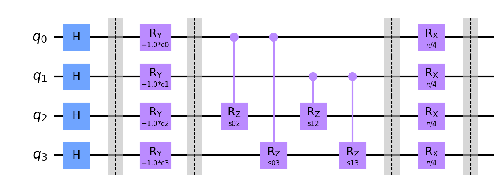

# Information for this data run

Amount of queries: 2

Amount of plans per query: 2

Amount of problems: 5000

Amount of shots: 1

<hr>

## Circuit:



<hr>

## Percentile results:

```

29.94% percentile reached a distance of 0 to the best solution

25.32% percentile reached a distance of 1 to the best solution

23.22% percentile reached a distance of 2 to the best solution

21.52% percentile reached a distance of 3 to the best solution

```

<hr>

## Data:

[Problem Data](problems.csv)

[Measurements Data](measurements.csv)

