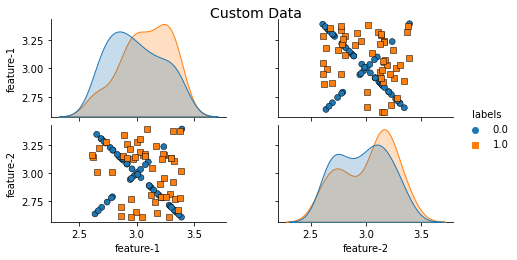
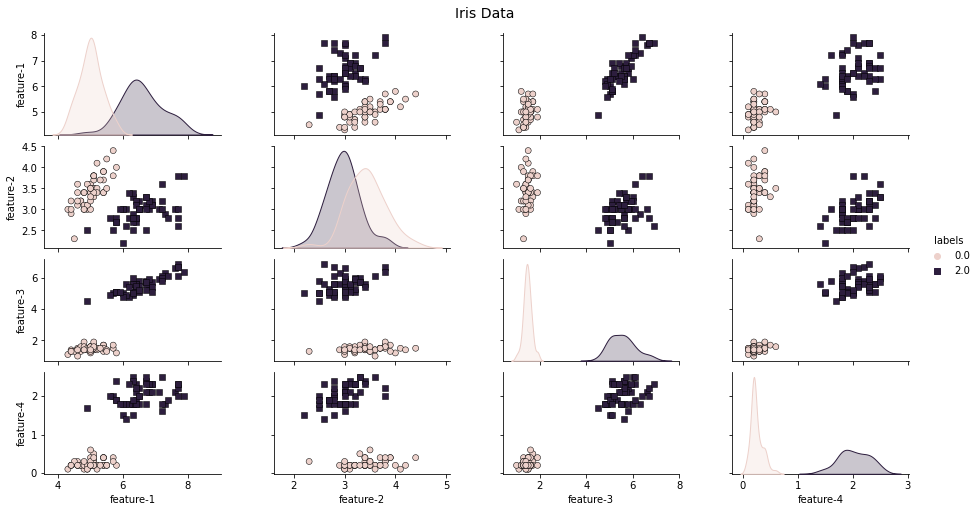
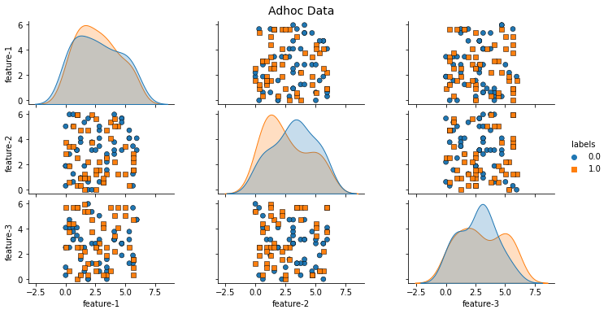
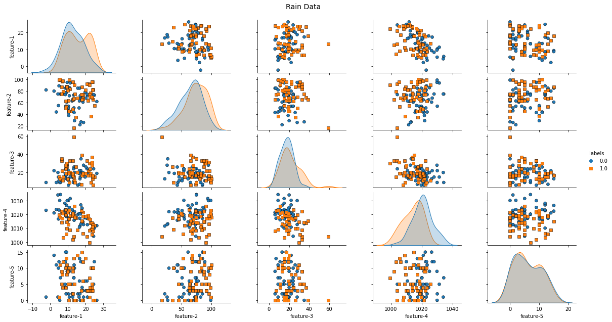
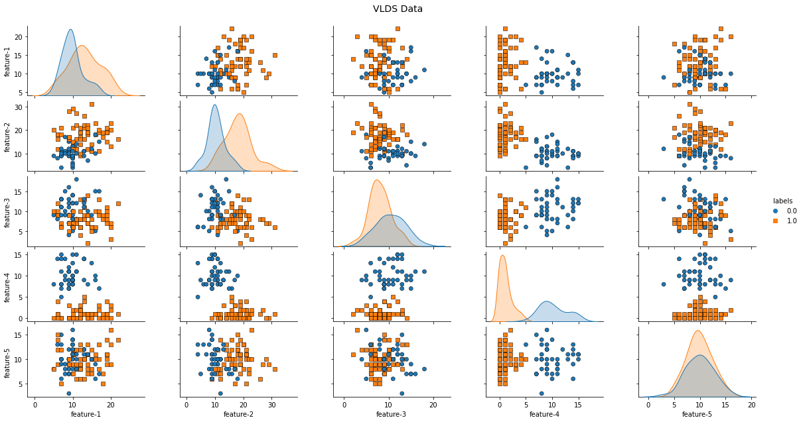

# Datasets (SVM)

- [Datasets (SVM)](#datasets-svm)
- [Dateils datasets (and example plots)](#dateils-datasets-and-example-plots)
  - [Custom](#custom)
  - [Iris](#iris)
  - [Adhoc](#adhoc)
  - [Rain](#rain)
  - [Vlds](#vlds)

# Dateils datasets (and example plots)

## Custom

Feature count: 2
  |

## Iris

Feature count: 4
    |

## Adhoc

Feature count: 3
   |

## Rain

Feature count: 5
    |

## Vlds

Feature count: 5
    |

