# Quantum Neural Network Classifier run

**Settings:**
Used Optimizer for Neural Network Classifier: `SPSA`
Layer count: `2`

## Quantum Circuits
Quantum Circuits plots for each dataset
| dataset | circuit | plot |
| :-----: | :-----: | :--: |
| custom | qml_circuit_qiskit_01 | 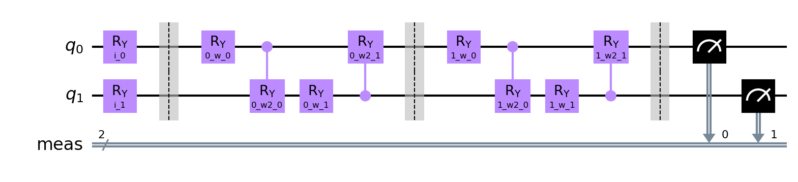 |
| custom | qml_circuit_qiskit_02 | 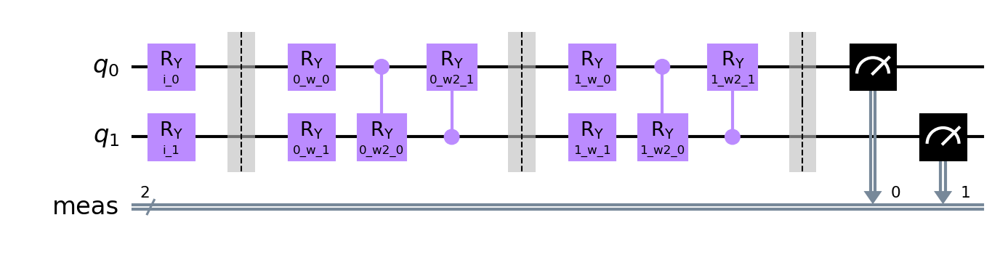 |
| custom | qml_circuit_qiskit_03 | 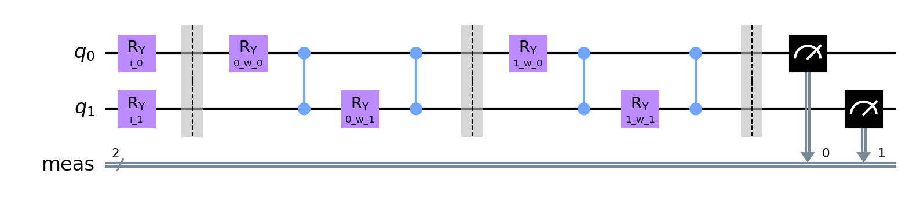 |
| custom | qml_circuit_qiskit_04 | 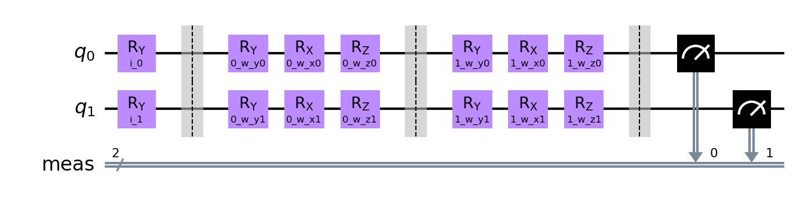 |
| custom | qml_circuit_qiskit_05 | 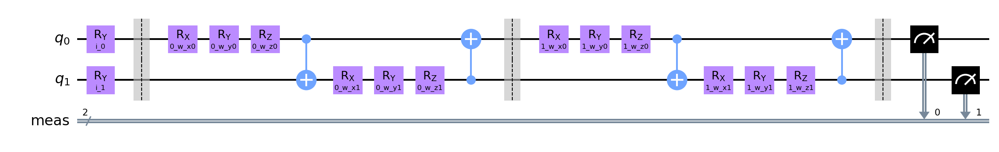 |
| iris | qml_circuit_qiskit_01 | 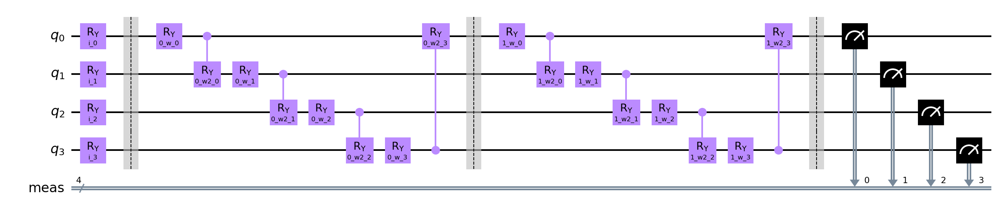 |
| iris | qml_circuit_qiskit_02 | 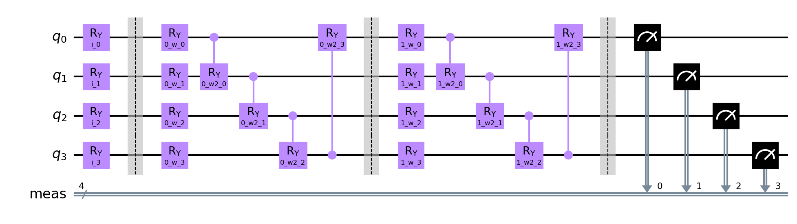 |
| iris | qml_circuit_qiskit_03 | 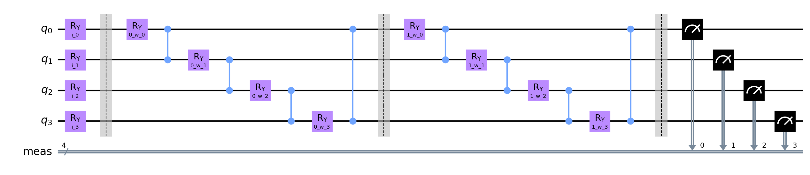 |
| iris | qml_circuit_qiskit_04 | 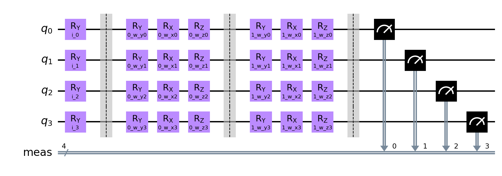 |
| iris | qml_circuit_qiskit_05 | 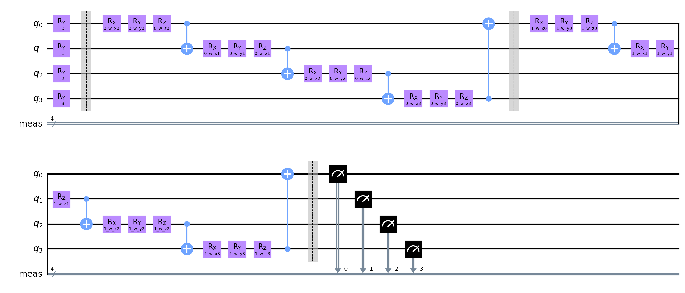 |
| rain | qml_circuit_qiskit_01 | 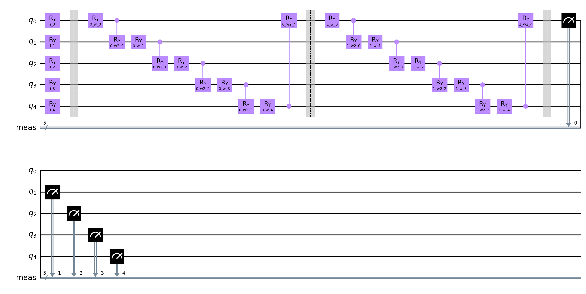 |
| rain | qml_circuit_qiskit_02 | 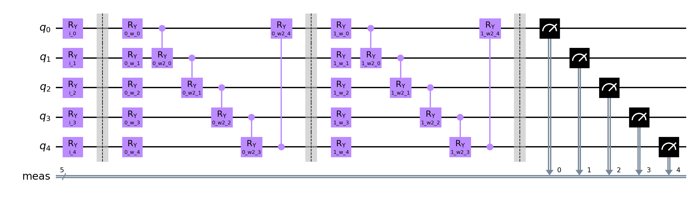 |
| rain | qml_circuit_qiskit_03 | 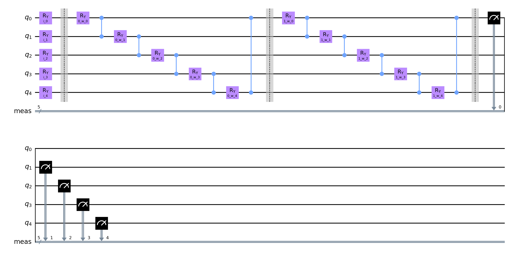 |
| rain | qml_circuit_qiskit_04 | 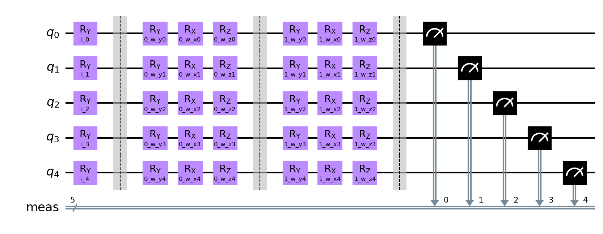 |
| rain | qml_circuit_qiskit_05 | 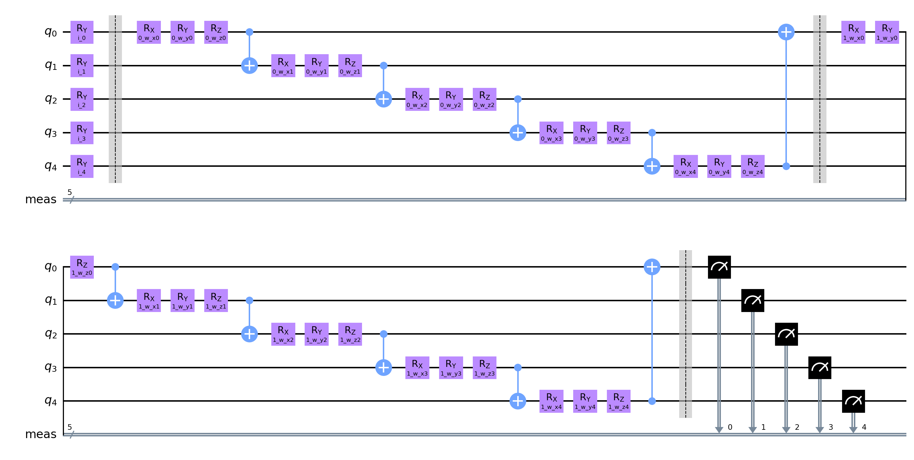 |

## custom
#### Average
| circuit | ø score train | ø score test | ø weights |
| ------: | :-----------: | :----------: | :-------: |
| circuit-00 | `0.5057499999999999` | `0.48649999999999993` | `[0.55294962,0.55832678,-0.19717343,-0.19338183,0.01917537,0.2847183,-0.04481361,0.23778333]` |
| circuit-01 | `0.49662500000000004` | `0.491` | `[0.65308473,0.35489892,0.14478988,-0.28634891,-0.14145857,0.02344297,0.50255049,-0.19187241]` |
| circuit-02 | `0.5029999999999999` | `0.4885` | `[-1.11036821,0.71014974,-0.78548243,-1.14648902]` |
| circuit-03 | `0.5026250000000001` | `0.48950000000000005` | `[0.17317438,0.08664149,0.38139646,0.00492795,0.68029723,0.66054134,0.38039034,-0.02868944,0.02349906,0.20824465,1.00463515,0.56478133]` |
| circuit-04 | `0.5035` | `0.5035` | `[-0.02204375,0.55247874,0.1275028,0.66990935,0.75104757,0.4580406,0.24312835,0.12309232,0.33184695,0.15668249,0.71334281,0.26127578]` |

#### Per run data
| dataset name and run | circuit-00: score (train, test) and weights  | circuit-01: score (train, test) and weights  | circuit-02: score (train, test) and weights  | circuit-03: score (train, test) and weights  | circuit-04: score (train, test) and weights  |
| :----------: | :--------: | :--------: | :--------: | :--------: | :--------: |
| `custom_10` | `[0.53,0.5]`, `[1.77848875,1.3286273,-0.10545731,0.36078577,2.05724134,0.07684618,-0.03883168,1.19449932]` | `[0.50125,0.495]`, `[1.05658869,2.43883981,-1.41094192,0.1954713,-1.40876716,-1.78370036,2.65583279,-2.34936489]` | `[0.48375,0.49]`, `[-0.30729495,0.60601947,-0.17631382,-0.07421237]` | `[0.49875,0.505]`, `[-0.52549689,0.77735536,1.62393211,-0.39866299,1.76977134,1.70624099,1.75765144,-0.40728181,-0.53559239,-0.82482371,2.16464503,1.25184351]` | `[0.5,0.495]`, `[0.09073558,-0.14279069,0.81681274,-0.32549597,0.98991287,0.55495175,-0.2331209,0.83974235,0.7682253,-0.26391663,0.97995395,-0.80617017]` |
| `custom_11` | `[0.50375,0.485]`, `[-0.60291308,-0.72955341,-1.74260899,-0.55883557,-1.23907483,-2.20747127,-1.07533635,1.02239968]` | `[0.5225,0.505]`, `[-0.02691345,-2.72706262,1.37111072,0.18053699,-0.34063211,-1.46027585,2.98649396,0.2596812]` | `[0.49625,0.515]`, `[-2.71623032,6.35664768,-3.81440555,-6.15357747]` | `[0.49625,0.515]`, `[-0.65559833,-0.57205461,0.27550154,0.13409093,-0.28414126,1.96740299,0.52617671,-0.39872473,-0.58607978,0.77040818,0.51613802,0.83044499]` | `[0.50375,0.485]`, `[-0.92328351,-2.078007,-1.28368933,-1.14833883,2.64653392,-0.55871557,1.15416031,-1.72482941,0.13293714,0.03342659,-0.18551611,-0.09171881]` |
| `custom_12` | `[0.485,0.515]`, `[0.85619056,2.62513312,-1.21480331,-0.59231253,-0.58990562,2.61016576,2.11668704,-0.39015162]` | `[0.465,0.465]`, `[2.91779527,0.97878368,0.71171635,-0.54940028,1.01766574,1.62288179,-0.19385902,0.36495015]` | `[0.4975,0.51]`, `[-0.07147088,0.07577467,-0.09537008,-0.03070416]` | `[0.4975,0.51]`, `[-0.21772528,-0.67143574,-0.70287855,-0.03152616,0.86694105,0.06654171,0.19323023,0.62998375,1.09974953,0.10535926,0.70135321,2.05406572]` | `[0.52,0.53]`, `[-0.96559177,0.82331881,1.3521198,0.9561963,-0.20836396,0.47422401,2.19485162,1.18270909,1.37720187,-0.39247683,1.6835636,-0.34245574]` |
| `custom_13` | `[0.4975,0.5]`, `[0.16540471,0.57156403,-0.39930309,-0.16586114,0.03916187,0.28913647,0.24450909,0.85520014]` | `[0.49,0.485]`, `[-1.54875875,-0.29210695,0.0092284,-0.71143519,0.60254141,-0.33475867,0.02847812,1.18352097]` | `[0.51875,0.525]`, `[-2.34643837,1.29716325,-1.93281745,-0.36963152]` | `[0.49875,0.505]`, `[-0.21347429,1.1826216,1.52720185,0.09843889,1.71316059,1.89069915,1.43506292,0.47861039,1.51275227,-0.78473924,0.31875264,0.37844865]` | `[0.52625,0.515]`, `[0.57050352,0.8797425,0.13382235,1.70197643,0.74586186,0.06385593,-0.23448899,0.44780874,1.18004613,0.7413869,-0.10465655,-0.21574559]` |
| `custom_14` | `[0.505,0.49]`, `[0.94262911,0.0210242,0.14840745,-0.22082819,-0.19951786,0.23125474,-0.29868709,-0.25274535]` | `[0.50375,0.485]`, `[0.38049164,0.70109898,0.2267617,-0.50731176,0.49467101,-0.05374745,-0.13391987,0.61607003]` | `[0.50375,0.485]`, `[-0.19780085,0.43786769,0.10854801,-0.39027561]` | `[0.50375,0.485]`, `[-0.41125497,-1.02913242,-0.06662346,-0.08062678,-0.90507167,0.698845,0.30143202,0.59515538,-0.28445314,1.01675235,1.32667162,-0.87809061]` | `[0.4975,0.55]`, `[0.8147497,0.31828516,-0.23239712,2.1266553,1.40275018,1.15526225,-0.47383174,-0.32645496,0.68316686,0.37511029,0.66308869,0.03096657]` |
| `custom_15` | `[0.50875,0.42]`, `[-4.34754635e-01,2.84140568e-01,-4.17100869e-01,5.67948383e-01,-7.05804431e-02,-3.35110994e-01,3.52466349e-01,3.59419345e-04]` | `[0.48125,0.485]`, `[-0.47365922,1.74869352,1.63625659,-0.0184895,0.23231814,1.97806522,0.27723212,-0.29201697]` | `[0.5175,0.43]`, `[-3.43080306,-3.32785926,-3.26653917,-3.21300748]` | `[0.5175,0.43]`, `[0.70158122,0.57237213,0.4408093,-0.70571715,1.58398287,1.94453982,0.54193285,-0.53257863,-0.75841781,-0.78838873,0.154373,1.08489381]` | `[0.49375,0.455]`, `[0.40926845,1.25611334,-0.74394734,-0.26820784,-0.75195054,-0.03125379,1.51964216,0.38754025,-0.26691734,1.38724105,1.32800503,0.31399788]` |
| `custom_16` | `[0.47375,0.435]`, `[-0.34801863,-0.20576969,0.14638525,0.17232266,0.82604729,-0.10672142,0.10896336,-0.56056057]` | `[0.46625,0.495]`, `[2.17343793,-1.14518163,-0.45582862,-1.27507522,-0.97448988,2.02064965,-1.11726275,-0.49904338]` | `[0.51,0.46]`, `[-1.38253622,0.06717527,1.28394099,-0.07159152]` | `[0.51,0.46]`, `[0.03602144,0.91574337,0.09071642,0.12191503,1.06983372,-1.65000872,0.17208711,-0.12656077,-0.29058425,0.94813111,1.76530095,-0.47871965]` | `[0.5025,0.495]`, `[0.50794357,-0.61483991,0.87219085,1.81433637,0.56703198,0.51191826,0.20492877,0.09244175,0.62926376,-0.21337081,0.65836758,-1.16154428]` |
| `custom_17` | `[0.50875,0.49]`, `[1.75668388,0.04034704,1.33918541,-0.19383992,-0.23962006,1.89154182,-0.17505916,-0.42068833]` | `[0.52625,0.55]`, `[1.07982388,-0.25763476,-0.59439824,0.50062473,-1.56274497,-1.29399441,1.21667324,-1.66401491]` | `[0.4925,0.51]`, `[-0.36932775,0.94197489,0.00601277,-0.64197615]` | `[0.49375,0.525]`, `[0.63448571,-1.45556331,0.02514281,0.04237618,0.40381843,0.97774451,-0.54226982,0.61526217,-0.39364091,1.6079713,1.800822,0.0276871]` | `[0.50625,0.475]`, `[0.75978368,1.10986388,1.45356187,1.86298511,-0.45960178,1.20970158,-1.29750483,0.2690708,0.02402985,-0.76595341,0.54219188,2.38243127]` |
| `custom_18` | `[0.52625,0.48]`, `[0.42316563,1.05430098,0.40153968,-0.32357512,0.51502647,-0.44902354,-0.73645757,-0.30592139]` | `[0.4925,0.455]`, `[0.27301781,0.5991427,-0.13537723,-0.30375075,-0.3784323,0.40686539,-0.32860688,0.85115281]` | `[0.5075,0.47]`, `[-0.24561909,0.64020494,0.07935725,-0.54519101]` | `[0.5075,0.47]`, `[1.04781747,0.81135861,1.14552255,0.40924985,0.68401339,-0.86844419,0.36936925,-0.7830619,-0.76314362,0.40262764,0.35607396,0.1488691]` | `[0.4875,0.52]`, `[-0.65576378,1.48438758,-0.32779321,-0.52555212,0.67929036,-0.71887762,0.13309151,0.09726817,-1.14017597,1.23631487,1.13295547,1.67454939]` |
| `custom_19` | `[0.51875,0.55]`, `[0.99261994,0.59345362,-0.12797849,-0.97962262,-0.9070245,0.84656527,-0.9463901,1.235442]` | `[0.5175,0.49]`, `[0.69902352,1.50441646,0.08937102,-0.37465947,0.90328445,-0.86755563,-0.36555678,-0.38965908]` | `[0.5025,0.49]`, `[-0.03616056,0.00652882,-0.04723727,0.0252771]` | `[0.5025,0.49]`, `[1.33538768,0.33514989,-0.54536,0.4597417,-0.09933613,-0.12814791,-0.95076927,-0.35769829,1.23440067,-0.37085166,0.94222105,1.22837068]` | `[0.4975,0.515]`, `[-0.82878296,2.48871377,-0.76565259,0.50453873,1.89901077,1.91933917,-0.53644436,-0.03437355,-0.06930805,-0.57093713,0.43547461,0.82844727]` |

## iris
#### Average
| circuit | ø score train | ø score test | ø weights |
| ------: | :-----------: | :----------: | :-------: |
| circuit-00 | `0.7270833333333334` | `0.7166666666666667` | `[0.47242225,-0.17529323,-0.34906214,-0.26865884,-0.44359542,0.37014403,1.39865234,0.92942689,-0.07630515,0.2883444,-0.35490446,0.40278226,0.32887142,-0.40236101,0.1542896,-0.07048367]` |
| circuit-01 | `0.6135416666666667` | `0.5791666666666667` | `[0.92981535,-0.22315766,0.71858614,0.20152443,0.29020172,0.07506855,0.58867193,0.76689569,0.08081044,-0.26434366,1.48497,0.29405186,0.28662731,-0.4033937,0.31690193,0.20917516]` |
| circuit-02 | `0.6333333333333333` | `0.625` | `[1.4270417,-1.10008138,-1.24311716,-1.57806241,-0.10829211,2.1435677,0.15013967,3.51129682]` |
| circuit-03 | `0.80625` | `0.7875000000000001` | `[0.59724892,-0.47694649,-0.04731324,-0.52025214,0.23472711,0.62261313,0.43708468,1.03738484,-0.19160383,0.31013012,-0.27587478,0.370619,0.36946743,0.58368089,0.03003829,-0.08067301,0.07735412,0.22118761,-0.10437272,0.01944001,0.27632833,-0.19768071,0.36201082,0.57909236]` |
| circuit-04 | `0.5083333333333333` | `0.5083333333333333` | `[1.42846154,0.19871371,0.77659899,0.76117278,0.94403437,1.14425658,1.84749039,1.11534276,1.15223169,1.065898,-0.73143141,1.74515467,0.75085756,-0.44898303,0.91384134,0.41696451,0.37570353,0.7919434,-0.79727465,0.68656547,0.7243212,0.38501764,0.88695057,0.53007095]` |

#### Per run data
| dataset name and run | circuit-00: score (train, test) and weights  | circuit-01: score (train, test) and weights  | circuit-02: score (train, test) and weights  | circuit-03: score (train, test) and weights  | circuit-04: score (train, test) and weights  |
| :----------: | :--------: | :--------: | :--------: | :--------: | :--------: |
| `iris_20` | `[0.8166666666666667,0.9333333333333333]`, `[-1.32543283,-0.98525348,-0.04396851,-3.07571505,1.56780895,0.43910946,2.20348496,3.9854683,1.42255266,-0.63314244,-0.46480764,0.09511497,3.0380639,-1.12026978,-0.92490692,-3.14807473]` | `[0.375,0.2]`, `[3.25828769,-1.60258549,3.15613979,-1.6487428,-2.2698006,-1.98009457,-0.44229687,-2.86601714,-1.44478577,-1.52569065,3.03913849,-0.97872227,-2.20731278,-0.81881717,-2.03091474,-0.23937797]` | `[0.625,0.5]`, `[3.79450421,-2.96710176,2.44568362,-3.75639254,3.09096135,9.46241532,1.53295705,2.92674383]` | `[0.8583333333333333,0.7666666666666667]`, `[1.65753405,-1.99456448,0.13695602,-1.89065903,-0.00790345,0.86750502,-0.82052501,1.13797667,0.22498488,1.32489241,-1.37387841,1.3302752,-1.38775691,2.07018249,0.28762082,0.43514569,1.46035478,-0.9343045,-3.00994372,1.92296227,2.05788185,0.59191837,1.41742059,-0.20931411]` | `[0.45,0.4666666666666667]`, `[0.70403795,1.68651758,-1.65408597,0.33132354,1.76444623,1.50116008,-0.56951663,0.12800572,0.60350883,1.80826835,2.03620272,2.83722954,1.94050279,0.02055725,2.33556805,0.60875207,1.51216208,0.27210292,1.15667463,1.30206446,1.18067597,1.84864483,0.75661831,0.96007462]` |
| `iris_21` | `[0.775,0.7666666666666667]`, `[2.65028914,0.18013419,-0.05530776,-0.49260532,0.34234611,0.85715114,1.99979388,1.05641579,1.46820501,4.95542059,0.67734126,0.36692012,-0.00620622,-0.49302762,-0.26357685,0.02414208]` | `[0.9,0.9]`, `[-0.57851954,0.27274393,1.24800412,-0.6488015,1.59152429,0.29362942,1.6199846,-0.21851786,1.23408588,0.12977998,-0.64940335,-0.47150721,-0.15154153,-0.70327951,-0.03171314,0.38639094]` | `[0.6916666666666667,0.7666666666666667]`, `[3.58445663,6.44436319,-11.44700952,-2.44678988,2.58501305,6.50125394,0.60535567,8.92744901]` | `[0.7416666666666667,0.7666666666666667]`, `[1.51688985,-0.93869703,1.72245505,-1.12337572,-1.00871599,1.80286985,0.55812561,2.93017752,0.95430085,1.8596392,-0.05442372,-1.44089724,-0.74992002,1.70615009,-1.93203932,-0.88372877,2.15101137,-0.45439235,-0.61748225,-1.43242941,-2.08134688,-0.18467011,1.80304405,1.69751764]` | `[0.48333333333333334,0.5333333333333333]`, `[1.27960041,-1.05143226,-0.526439,0.38241318,1.93130514,1.23774134,1.31764429,-0.20980233,1.51786108,-0.95283383,1.70679251,2.66059079,0.87617467,0.11844066,1.10664472,0.62272101,1.51456622,0.25250034,0.09583557,1.24372261,2.00012192,-0.0191015,-0.79093621,0.99091682]` |
| `iris_22` | `[0.7083333333333334,0.6666666666666666]`, `[0.64502016,0.65574203,-1.85314866,1.054815,0.45990674,0.27418554,1.04666769,1.21829099,0.05027266,1.80179229,-0.10113338,-1.02854049,0.29795585,-0.34952117,0.90541124,0.09161351]` | `[0.425,0.3333333333333333]`, `[-0.07107047,1.99866044,-0.95298885,0.80884228,0.393284,-0.2289312,-0.07789249,1.18212163,-0.05265418,-0.39889303,2.33414915,-0.12634468,0.37555454,0.28424862,1.80300468,2.69407607]` | `[0.425,0.36666666666666664]`, `[0.53422429,-1.6786069,-0.07495862,-2.95854159,-0.0917408,5.39142444,0.13805437,3.89474658]` | `[0.8416666666666667,0.8333333333333334]`, `[-0.5679499,-0.00744833,-0.55241806,-0.22182709,0.56638666,-0.04819958,1.63730321,0.4702666,-0.12152968,0.19576955,0.59069465,0.39416261,0.69820025,0.14040205,0.42778438,0.02851871,0.18681101,0.14910448,0.38551924,0.48619053,0.15278422,-0.94263509,-0.56180062,1.88830876]` | `[0.43333333333333335,0.4]`, `[1.45902309,1.70543075,0.23072662,0.29960198,2.16577877,1.10562924,1.07637386,-0.246424,0.88741189,0.69643305,-0.0647872,2.80358062,0.61156417,0.26168887,-0.99618727,-0.12157383,1.33122273,0.27058933,-1.01527207,1.55404716,2.00697625,0.20561267,1.00964796,-0.24296035]` |
| `iris_23` | `[0.5166666666666667,0.5]`, `[-0.87283667,-0.43759935,0.43786484,2.60445417,-1.83835732,-1.09758823,-0.57470098,-1.93712486,0.69926528,-1.95668383,-0.81384459,1.8881615,-2.29369662,1.24943951,1.79934929,0.68681465]` | `[0.9083333333333333,0.8666666666666667]`, `[0.33186468,-0.16422736,0.20439226,-0.42482083,0.00220313,0.39576574,0.55814059,0.76538177,0.64963908,-0.57712935,-0.39919204,-0.42390514,0.72698958,-0.62854266,1.26547976,0.52603462]` | `[0.7,0.7333333333333333]`, `[0.61366294,-9.64102127,-4.21879563,-6.96451027,-5.85886957,-3.41135744,-3.49306321,5.71231352]` | `[0.7833333333333333,0.8333333333333334]`, `[0.33218247,1.02099521,0.73811091,-0.26302311,0.75668537,-0.54144724,-0.54222258,0.10830285,0.22451642,-0.49553008,0.85928744,-0.45139514,-0.29955552,-0.49950453,-0.82612727,0.73810662,0.09562619,1.05820507,1.30114397,1.49456746,0.42025536,-1.47144491,0.41256503,0.45730317]` | `[0.39166666666666666,0.3333333333333333]`, `[3.18560776,1.54105622,2.02424059,0.96390661,-3.45901232,1.47710088,3.05677576,1.28623751,3.38053685,4.61866553,-5.02835262,3.57584462,3.16672505,-1.73526504,1.74447406,3.12058326,-3.11236368,-1.336114,-0.0532195,-0.02451703,0.14158429,1.64347526,-0.18496282,2.59438382]` |
| `iris_24` | `[0.4666666666666667,0.3]`, `[-0.62392572,-0.37611762,0.18938924,0.00846389,0.24793267,-0.50716764,0.10497863,-0.2463411,-1.73163222,-2.04267898,-0.36562785,0.1910535,0.22914904,1.41459892,2.43034583,1.18666358]` | `[0.625,0.5]`, `[3.52263918,0.22515614,-0.13227347,4.67190246,-0.59919033,-1.52773846,1.63397854,0.73724677,-0.14238346,-0.99448717,0.27566572,2.8382237,4.37756432,0.63849602,-0.48328997,-0.10531333]` | `[0.8083333333333333,0.8666666666666667]`, `[0.55024463,-0.46952006,0.60047865,-1.15761329,-0.17066948,-0.47005236,0.57806216,2.56420208]` | `[0.7916666666666666,0.7666666666666667]`, `[0.23659751,-0.35805242,0.30670088,0.02695276,0.51546353,0.0664238,0.2156857,0.18007505,0.07167226,0.88639672,1.2833288,0.75580085,-0.27561314,1.20019838,-0.44905948,-0.52431185,-0.04361768,2.00978091,-0.05783939,0.8547122,1.81975352,1.20549366,0.71878777,1.35918064]` | `[0.9,0.9]`, `[0.36039556,-1.35962637,1.33024093,1.67312724,0.70765699,-0.13429772,2.2874656,1.39319192,0.03232704,-1.25577827,-0.67972942,-0.62564868,-0.06183411,0.16963549,0.67514865,0.0778156,-0.22833464,1.0114088,0.33075759,0.1540828,0.73275214,0.7780446,0.76718374,-0.75604693]` |
| `iris_25` | `[0.85,0.9666666666666667]`, `[0.31248397,0.92735327,0.13046677,-0.89088838,-4.4078398,2.77875535,5.27365762,0.86460951,-2.85045521,-1.45793349,-0.47640809,-0.21478062,-1.29118882,-3.11754105,-4.2504616,0.57688293]` | `[0.8333333333333334,0.9333333333333333]`, `[0.13919226,0.18270388,-0.28463716,-0.78224311,-0.17047022,-1.07501037,1.1740135,0.77343931,0.3569284,-0.13701128,-0.32215885,0.15166619,0.71878845,1.02272243,0.41251137,0.82683124]` | `[0.6916666666666667,0.8]`, `[0.45459579,-0.21525559,0.84763408,0.988587,0.35439553,-0.11910327,1.10550585,0.08923566]` | `[0.8166666666666667,0.9]`, `[-0.64309237,-0.88628174,-1.13229032,-1.00885081,-0.95295728,-1.38925037,-0.35017316,0.1867368,-0.90036821,2.03042545,-0.85411814,-1.94870286,2.14712303,-1.87555317,3.1071952,0.37133862,-1.61484455,1.81578953,-1.13208911,-1.06493484,1.94750327,-0.6971807,-1.65207098,-1.18706223]` | `[0.35833333333333334,0.26666666666666666]`, `[-0.38391822,0.18347259,0.03585705,1.11913356,1.15207893,1.3554943,0.28811378,2.90095097,-0.69627305,0.78332061,0.38780486,0.74994165,-0.52229076,0.73148568,1.32881311,2.01311321,1.38379021,0.95440096,-1.00853753,2.35691947,0.44482646,-0.73747817,0.62112277,0.40652412]` |
| `iris_26` | `[0.95,0.9333333333333333]`, `[2.70260972,-0.96968733,-0.5982887,-1.28628054,0.80505087,-0.43701348,0.32342988,0.64933528,-0.18901761,1.04822382,-0.73877257,2.39752568,1.1054912,0.0429355,0.5982235,0.42119787]` | `[0.4666666666666667,0.43333333333333335]`, `[-0.83270909,-2.57874441,4.65175011,0.89674904,2.77976326,3.06737976,0.16440598,5.46420475,-0.67284198,1.61631026,5.14129224,0.60709738,-3.23125538,-0.58888298,1.4422328,-2.96254839]` | `[0.425,0.4]`, `[1.42299768,-0.08146928,0.8116917,2.85160291,-1.12017087,-0.05991353,0.15240802,3.43085124]` | `[0.8416666666666667,0.7333333333333333]`, `[0.13110318,0.3520645,0.2106875,0.91951181,1.26174544,1.65600314,0.0710209,2.27267143,0.096002,-0.63264391,-1.04919146,1.60492909,0.00694003,-0.50224609,1.13231955,1.22108077,-0.58844874,-1.65171178,1.36029117,-0.54683387,-0.88661981,1.11905733,0.41834657,0.64059241]` | `[0.4666666666666667,0.5333333333333333]`, `[2.14905633,-1.77066405,4.72834666,0.87167857,4.16330724,3.13262617,6.60379679,3.13660876,2.38825257,3.35994087,-4.24054197,0.06090602,0.47240236,-3.23455591,0.30123745,-3.60214241,-1.49952744,3.07317714,-4.86862323,-1.1978062,-0.55590518,-0.01008118,3.1313102,-0.57190228]` |
| `iris_29` | `[0.7333333333333333,0.6666666666666666]`, `[0.29117026,-0.39691756,-0.99950436,-0.07151446,-0.72561161,0.65372006,0.81190702,1.84476124,0.52036822,0.59175725,-0.55598286,-0.47319655,1.55140301,-0.84550238,0.93993231,-0.40310929]` | `[0.375,0.4666666666666667]`, `[1.66883807,-0.11896839,-2.14169765,-1.2606901,0.59430023,1.65554808,0.07904156,0.29730627,0.71849555,-0.22762806,2.46026864,0.7559069,1.6842313,-2.43309436,0.15790467,0.54730811]` | `[0.7,0.5666666666666667]`, `[0.46164742,-0.19203938,1.09033848,0.81915835,0.34474388,-0.14612546,0.58183741,0.54483261]` | `[0.775,0.7]`, `[2.11472653,-1.00358766,-1.80870789,-0.60074595,0.74711257,2.56700042,2.72746272,1.01287181,-2.08240916,-2.68790841,-1.60869738,2.72077948,2.81632171,2.42981787,-1.50738756,-2.03153383,-1.02805945,-0.22297043,0.93541832,-1.55871424,-1.21958489,-1.20198419,0.33979411,-0.0137874]` | `[0.5833333333333334,0.6333333333333333]`, `[2.67388945,0.65495523,0.04390501,0.44819757,-0.873286,-0.52140163,0.7192697,0.53397353,1.1042283,-0.5308323,0.03115983,1.89879277,-0.47638371,0.07614877,0.81503199,0.61644719,2.10411273,1.8374817,-1.01581265,0.1040105,-0.15646226,-0.62897537,1.78562057,0.85957776]` |

## rain
#### Average
| circuit | ø score train | ø score test | ø weights |
| ------: | :-----------: | :----------: | :-------: |
| circuit-00 | `0.472375` | `0.48900000000000005` | `[-0.23621717,-0.19691514,0.70722616,0.44985874,0.66146827,0.2589857,-0.19459777,-0.07027268,0.13913117,-0.29615586,0.10527011,0.70989829,0.17321623,-0.00772332,-0.59506933,0.30432102,-0.62435623,-0.37494808,0.14765351,-1.12488772]` |
| circuit-01 | `0.50375` | `0.501` | `[0.52173216,0.09350618,0.20411244,0.37837036,0.19217479,0.46876702,0.67557766,-0.37558797,-0.0385197,0.04106964,0.52437456,0.25369363,0.22413631,-0.02781198,0.4443547,0.06507911,0.28849524,0.23415301,-0.10218108,-0.18429965]` |
| circuit-02 | `0.6282500000000001` | `0.6295` | `[-0.04287267,0.56708742,0.29518703,-0.3595104,-0.03913526,0.10126386,1.20796771,-0.42549944,0.27830025,-0.04628087]` |
| circuit-03 | `0.5978749999999999` | `0.5965` | `[0.20891464,0.05522514,-0.66734066,-0.01022068,-0.2781134,1.45112723,0.27814248,0.1707224,0.30210457,0.04807706,0.63789772,0.39960824,0.41613895,0.41465171,0.80609632,0.84909082,-0.01244039,0.72099601,0.26222423,0.27037535,-0.08518159,0.62616095,0.05953986,-0.2912091,0.01866218,0.88388754,0.0889113,0.80490982,0.96194078,0.59328756]` |
| circuit-04 | `0.09437499999999999` | `0.09599999999999999` | `[0.50574962,-0.01868349,0.57364978,1.11417463,0.01590846,0.65791466,0.30542232,0.44316996,0.51337952,0.11092119,0.2500514,0.77254729,0.26184437,-0.22094038,0.37990151,0.70833084,0.37194988,0.85530285,0.59884986,0.15127711,0.09592987,0.61521316,0.55003609,0.27176678,0.74097626,0.07248541,0.94583027,0.44678072,0.81847346,0.67056866]` |

#### Per run data
| dataset name and run | circuit-00: score (train, test) and weights  | circuit-01: score (train, test) and weights  | circuit-02: score (train, test) and weights  | circuit-03: score (train, test) and weights  | circuit-04: score (train, test) and weights  |
| :----------: | :--------: | :--------: | :--------: | :--------: | :--------: |
| `rain_0` | `[0.6375,0.625]`, `[-0.59753823,0.38984163,-0.28648835,-0.80460742,-1.31503439,-0.32714739,0.87709979,-0.43681315,-0.47704908,0.2883594,0.62949432,1.783512,-0.01564543,1.17324398,1.4925055,0.43479343,-0.94256735,-0.24393547,0.52440725,-0.29566851]` | `[0.635,0.66]`, `[1.73464493,-0.77824552,-0.16886394,0.01263505,1.39197308,0.5415262,-0.35767633,0.19935198,0.87265109,0.00798568,-0.54503854,1.36287271,0.5172351,0.23975554,2.45645713,0.79317101,-0.01626538,-0.44737921,-0.87298365,-0.16685742]` | `[0.66375,0.64]`, `[-3.13549150e+00,-4.96802576e-03,5.41983782e-01,-3.13712682e+00,-1.13315411e-02,-2.83998998e+00,6.37922255e+00,-6.35338822e-01,3.14543094e+00,7.32855943e-03]` | `[0.63,0.59]`, `[-0.15699262,1.528201,1.14310908,-0.07133998,-0.43723943,-0.40959098,0.66415716,-0.054227,0.07706817,-0.09592943,0.32721463,-1.07251488,0.17051285,-0.72090621,0.66029287,-0.35680818,-1.0774322,-1.15937926,0.09403628,0.28521053,1.61552154,1.11048536,0.18797661,-0.07679052,0.42957608,1.22697159,1.18574646,0.5106117,1.16434281,-0.10132946]` | `[0.015,0.005]`, `[0.83886681,1.08251716,1.54431059,-1.78115123,0.12468096,-1.10533765,-1.92748257,-1.15044027,1.7647016,0.11416538,1.45451475,1.21377604,0.93572792,0.8558826,-1.39213945,2.86833076,1.01252822,2.5678831,3.16608069,-0.11424751,-0.58451086,0.61880031,0.14069917,-0.11070511,0.16063694,-1.41179393,3.80267573,-0.04396114,-1.07480708,-2.46537103]` |
| `rain_1` | `[0.39,0.34]`, `[-0.57415833,-0.60797896,1.46342318,-0.36515287,1.61046033,0.31035608,1.06942266,-0.42295678,2.02557439,0.08240995,0.34811133,2.08736212,2.1601084,0.91558352,-0.96185174,-0.4619615,-0.82520448,0.06114216,2.42225226,-0.53954527]` | `[0.505,0.47]`, `[0.93729313,-0.3352518,-1.11942732,1.45015242,-1.63296962,1.1929863,3.21834125,0.56088834,0.2028303,-0.85450457,-0.33822826,0.19258363,1.45275878,-0.42928626,-2.5716975,-1.44030095,2.79557922,-0.30695521,-0.41619136,0.56483115]` | `[0.6575,0.68]`, `[-0.33981075,-0.06448728,-0.10298851,-0.21939715,-0.09540198,0.42036944,-0.08289064,0.0144181,0.02258416,-0.11778381]` | `[0.63125,0.655]`, `[2.00435503,-1.46945129,-1.00044296,-0.44484831,-0.06187558,1.89606327,-0.1678546,0.83521847,0.38764457,-0.35999936,-0.04386256,-0.25307935,1.1483925,0.13353599,1.18935375,0.11598022,1.68658844,1.26425374,0.5617827,-0.35351154,-1.19746377,2.2169834,0.66932058,-0.49156286,0.23758338,-0.41500594,-0.73721655,-0.76112513,0.43585275,0.66733161]` | `[0.04375,0.055]`, `[0.79046527,-0.29525023,1.3366936,-0.00799031,1.51997687,1.38343668,-1.70058098,1.95108035,-0.2098471,0.98062646,0.73255613,0.99334478,1.10723464,-0.45937089,2.08607094,0.98102444,-0.03273629,1.15967087,1.55420147,0.05022018,-1.65676874,0.03815587,-0.12393674,0.0701577,-0.02104531,-0.84298468,1.02424821,0.5993552,1.44043803,1.82183809]` |
| `rain_2` | `[0.6025,0.61]`, `[1.57440891e-01,3.55778779e-01,7.57469688e-02,3.74024536e-01,5.17693326e-01,1.05101391e+00,4.08877069e-02,8.98936927e-01,-1.34729794e+00,6.18731308e-01,1.85713183e-01,5.33226337e-01,1.55612130e-03,-1.60775195e+00,-4.70409533e-01,-1.15894787e+00,-2.24741281e-01,-1.38824302e+00,1.20116013e+00,-4.72258269e-01]` | `[0.4175,0.405]`, `[1.31463443e-01,1.68501962e+00,2.68324960e-02,1.03478735e+00,-3.90102125e-01,-5.83439298e-01,-3.37367739e-02,-6.20032543e-01,-7.60809833e-02,1.05400224e+00,1.25245774e+00,4.37836611e-01,2.71027057e-01,9.43981093e-02,8.71643444e-01,7.16188866e-01,7.95344915e-01,-1.56267307e-01,-7.07475696e-04,-1.14732455e+00]` | `[0.36875,0.37]`, `[-0.93119811,-0.07749195,3.1434872,0.03698887,-0.09830812,-0.57854934,-0.08309629,-3.1604842,-0.05995276,0.00773635]` | `[0.6375,0.665]`, `[0.86719013,0.47219589,-0.26453241,1.57385167,-0.11033451,0.92322686,1.5586577,-1.25364719,1.84549143,0.11485756,1.49363818,1.59089606,0.21550941,0.82088641,-0.27837596,0.77974797,1.51492933,-0.04547852,1.15218177,0.06488701,-0.80061458,0.39033241,1.30437194,-0.84363917,0.07404461,0.6914379,0.5634131,0.61758237,1.11383634,0.90061495]` | `[0.01625,0.02]`, `[2.06535645,-1.56291001,-0.74798791,1.99753823,-1.83373868,1.78317688,2.61462153,1.19100279,2.65150634,-0.25236228,-1.15180159,1.76530668,-1.08751859,-0.92725419,-0.93223649,2.71038387,-1.03720721,0.0982414,-2.6041809,1.63210033,1.53103692,3.06184249,0.08400608,1.06531753,3.29299086,-0.40600793,2.58063963,2.63370773,2.17868936,1.48521326]` |
| `rain_3` | `[0.30375,0.31]`, `[-2.33511505,-2.70408963,-1.50898746,-0.14125543,1.70475817,2.84947049,-0.81549058,3.71586756,-1.40909772,-3.1286056,1.93876635,3.76318412,-1.27510019,-0.7387176,-0.77881134,1.59895843,-3.30014919,-0.55823944,-2.94825149,-2.66080416]` | `[0.66125,0.655]`, `[-0.13408608,-0.09443476,0.52428622,0.50580009,-0.11895458,0.41292986,-0.18116768,0.22096479,-0.33289698,-0.58126992,0.49592377,-0.16548232,-0.63249484,0.58542121,-0.25778156,0.07821687,-0.04469359,-0.11519693,0.39298401,0.39351107]` | `[0.675,0.66]`, `[3.54670172e+00,9.00446373e-02,-4.90861056e-02,-3.05323645e-03,2.78462164e-02,3.06064454e+00,1.44397919e-01,-5.23797926e-02,-1.51349978e-01,2.57740769e-02]` | `[0.67375,0.66]`, `[-1.33077826,-0.85628406,-1.50867429,-0.91019151,-1.34922507,1.71543699,-1.50188591,-1.58328294,1.9433056,-1.59030457,3.39107007,1.74368853,-1.11322422,2.41478357,1.75603003,-0.49574763,-1.54783048,1.91651845,2.15559298,-1.41604219,1.67397069,3.2793857,-1.57969765,-1.06235177,-1.20515053,1.97399623,-1.79540491,2.42250219,2.68685071,-1.34302211]` | `[0.2125,0.23]`, `[1.45771482,-0.29950807,-0.02754785,2.54692109,1.92454442,1.15989005,1.43062085,-0.24507576,0.95208623,0.15857699,1.37859543,-1.08794734,1.028554,-1.17987436,0.10331185,0.51819712,-0.15923397,-0.11229624,-0.0225912,-1.20443645,1.50756632,-0.11277329,2.9866494,-0.11729094,0.00329618,0.6967211,-0.8788901,-0.80551431,2.06317055,1.78459219]` |
| `rain_4` | `[0.60625,0.69]`, `[-0.35216563,0.285661,0.14918683,0.58511709,0.11441286,-0.34025229,-1.49345637,-0.08925404,-0.57156143,-2.81815222,0.03153941,-1.07590283,0.10737047,2.65462923,-0.5969596,0.72333055,1.54074068,0.00369869,0.46322938,-3.29132411]` | `[0.3425,0.345]`, `[0.88952281,-0.04231979,-0.64005638,2.13003,2.05375553,-0.50932376,0.92323727,-2.59634228,0.24665323,-0.07066697,0.07859753,-0.03405244,-0.73103655,-2.19616626,2.26801297,-2.0658953,-1.14479369,2.74305693,0.32026923,-0.31312978]` | `[0.68625,0.735]`, `[0.16411836,2.98671275,0.09481121,-0.0129218,-0.04169274,0.22280165,3.05116092,0.06221335,-0.05709185,-0.02374078]` | `[0.6325,0.64]`, `[0.16521055,0.29601705,-0.31847097,0.52679152,-0.2893812,0.33578491,0.39123003,-0.58857364,-0.73958897,-0.16401079,1.71309661,1.29909865,0.33233723,-0.8933278,-0.88074382,0.33613473,0.27041739,0.11985819,0.23636941,0.29972006,-0.08150056,-0.25210638,0.52219712,0.85313788,-0.14927834,0.6180256,-0.80574717,1.32165082,0.99528378,1.17057619]` | `[0.21125,0.235]`, `[-1.69914502,-0.86857062,0.40001185,-0.27739806,0.35454764,-0.10423128,1.59336821,2.31727754,-0.3040645,1.94387474,-1.49472427,2.14468062,0.29430359,-0.8123898,-0.19200011,0.24652593,0.04042782,0.63560901,0.90708,-1.15026494,1.69141958,0.14819452,0.25511455,0.13440835,-0.47519516,2.53326424,1.44624421,0.16184856,2.29084047,0.39975337]` |
| `rain_5` | `[0.5125,0.53]`, `[-0.42282739,0.95319545,0.22123325,0.93854549,0.18821002,2.85873911,-0.7272453,-0.30794289,-0.34297108,1.28018386,0.81612108,0.41483826,-0.14249827,-1.80563206,1.16703649,2.98914554,0.7378574,-0.39206848,0.31402905,-1.01511283]` | `[0.54,0.59]`, `[-0.19873207,-1.9240285,1.02611109,0.46470971,-1.16204337,2.94804564,-0.0349297,-0.02001545,-0.88257842,-0.10267968,0.87920182,1.28783839,1.07380614,0.31017848,2.05113358,3.07391804,-0.63478628,-0.03319393,-0.06175102,-0.24561566]` | `[0.67625,0.655]`, `[0.01625379,-0.10770617,-0.12214919,-0.00377771,-0.0293963,0.20380935,-0.1009497,-0.06850944,-0.09550937,-0.04688469]` | `[0.6375,0.595]`, `[-0.13487054,-0.25754619,-0.19044491,0.43895982,0.91374435,-0.02128183,-0.58870188,-0.2064652,-0.26337235,0.97454067,1.5190551,0.26794662,0.67489483,1.37455507,2.12635463,0.01507846,0.0280519,0.028508,-0.25347839,1.21970606,0.34113835,0.48604592,0.23041056,-0.2807549,0.57541184,1.02299445,1.6232136,-0.1794924,1.67331952,1.11484838]` | `[0.08125,0.095]`, `[0.92346876,-1.09548355,-1.26557631,2.73557097,-0.51954671,1.08617343,1.55443985,-0.48123846,0.6392448,-0.0480958,0.96415619,1.83673401,0.6628051,-0.65899863,1.84005107,1.91810181,0.05379288,1.87768904,1.86099589,1.43986922,1.70140497,0.01677187,-0.18261446,-0.39229374,-0.04517989,-0.51721953,-0.748729,1.25022511,-0.49171934,2.12301763]` |
| `rain_6` | `[0.39375,0.49]`, `[-0.757719,-0.67512401,2.44471637,-0.49992398,-0.4505448,-1.33045811,-0.46673139,0.06016852,1.40366421,1.88366036,-2.95228424,0.70130795,2.40504731,-0.18645159,-1.36061996,-1.66096063,-2.47382922,-0.32121907,-1.02313733,-1.42590037]` | `[0.37,0.39]`, `[1.38313315,-0.14307576,0.39440703,-0.62799591,0.06250693,0.14826676,1.92746037,0.23676711,-0.05517002,0.91550832,1.50923102,-0.51954761,0.174873,0.0137072,-0.553487,-0.13392062,0.21405104,0.21164239,-0.05602557,-0.82820426]` | `[0.64625,0.68]`, `[-0.03526106,2.85014701,0.15259206,-0.03418681,0.00586608,0.12087253,2.92513096,0.05322014,-0.03863175,-0.0698484]` | `[0.52625,0.565]`, `[-0.21618557,-0.19219724,-1.09696048,-0.5030307,-0.15537003,3.49528944,0.72373259,0.80169483,-1.26130845,0.73428343,-1.88077139,-0.79363261,0.93426429,1.74676996,1.59457311,2.38056753,-0.18573123,1.49770003,-1.55495787,0.78901807,0.07804603,-0.37516568,0.49629801,0.14568857,-0.01501128,0.51702412,0.17917353,0.43230572,-0.600033,0.66230116]` | `[0.085,0.065]`, `[-1.29552177,2.16160066,1.32260412,2.81516501,-1.96035687,2.02783559,1.70216367,-0.8643486,2.61695196,-2.97522035,-1.30539486,-1.71592383,3.06440407,-1.24576585,1.86141313,-1.11103116,-0.04760355,0.2029911,3.22591104,2.33986439,-1.54930046,3.078469,2.62361853,-0.1552075,2.05759116,-0.37619366,-0.27281519,-1.52662455,-1.12457423,3.20415143]` |
| `rain_7` | `[0.44875,0.465]`, `[2.26782142,0.4541518,0.859681,1.07212722,0.24908608,0.93840884,-0.89915517,-0.5971247,-0.90373715,-0.35054384,0.05579544,0.97255799,-0.44427445,0.37720404,-0.89367105,0.45965432,-1.01285299,-0.2305827,0.99841413,0.11387337]` | `[0.5875,0.54]`, `[-0.44107904,1.36260777,0.76057273,0.09815638,-0.34872623,0.63507852,0.5271778,-0.6428983,0.14615732,-0.20324336,-0.52463562,-0.92381244,-0.37044062,0.36828162,0.24745856,-0.27669907,0.19163692,0.61036265,-0.29937517,0.05840185]` | `[0.64125,0.605]`, `[0.12354873,0.08795763,-0.06117496,-0.069928,-0.12860527,-0.01259797,0.09618706,0.03403038,-0.04083037,-0.16380708]` | `[0.65875,0.625]`, `[1.28455182,0.29489035,-0.92371488,-0.55749263,-0.72008531,2.20898695,0.28862781,0.7047542,0.01260702,0.91335254,0.51298634,-0.16747069,0.79323614,-0.0961925,0.8502737,0.99173279,-0.35975966,1.16509651,0.54882393,1.04281042,-0.69753153,-0.22017675,-0.19379004,-0.15514991,-0.39017008,1.00653521,-0.29697877,1.8620152,0.19462994,1.26702401]` | `[0.08,0.1]`, `[2.73946328e+00,-6.36910912e-02,2.53717638e-01,7.39662521e-01,-4.99922857e+00,-1.20851392e+00,-4.93042065e+00,1.04234385e+00,-2.96976901e+00,-6.41536580e-01,4.12868863e-01,6.76657046e-01,-1.20700657e+00,1.91219200e+00,-1.20560098e+00,-8.19631558e-02,3.10807294e+00,-1.07129089e+00,-1.55329654e+00,-4.10015720e+00,-1.77532266e+00,1.34720936e-03,-1.42031452e-01,-1.22922819e-01,4.46878334e-01,-1.05693078e+00,1.80668856e+00,2.75392040e+00,-2.46630425e+00,-1.09522083e+00]` |
| `rain_8` | `[0.19625,0.16]`, `[-1.01602944,-1.19004196,4.08854376,2.77475624,2.88386032,-2.14631195,1.27014154,-2.20278705,2.27250258,-0.65759501,-1.30696823,-1.58745258,-1.06444318,-0.94206989,-2.40111786,-1.45812385,0.71386874,-1.90362691,-0.03876156,-1.5234491]` | `[0.36125,0.33]`, `[0.44268299,1.41571518,0.83138724,-0.60460887,1.43298966,-0.47156526,0.57676246,-0.52140301,-0.49660055,0.01741626,2.41257675,1.10962229,0.60951115,0.39773506,-0.46985579,0.10810489,1.03596194,-0.97456041,-0.04707387,-0.00868454]` | `[0.7,0.675]`, `[0.23676608,-0.09478086,-0.1252894,-0.0403642,-0.05193577,0.25751371,-0.10012008,-0.00243809,-0.05733344,-0.08396278]` | `[0.2925,0.3]`, `[-0.99047584,-0.57446854,-2.38024522,-0.23798971,0.07428552,2.68729377,0.34648561,2.21303257,1.54490555,-0.62648233,-1.69726183,1.73972388,-1.00946489,-0.39984713,0.16470067,3.5610859,0.29991937,1.75545724,-0.43262555,-0.11012671,-1.25370866,0.61107039,-1.57784693,-1.51103724,0.55831653,0.97102379,1.70913745,-0.502343,1.39388067,0.64345973]` | `[0.00625,0.0]`, `[-0.69818848,-0.76416277,1.95668417,2.32388662,2.28806283,0.19398996,1.19719981,-1.65655905,-0.73844024,2.02962906,1.72744796,2.24449985,-1.38581737,0.30832696,1.12306651,-1.026566,0.75165996,-0.23879544,-0.34823164,2.42229381,-1.41110411,-0.75832179,-2.944826,2.26954688,2.18054729,1.68636245,-0.62014384,-0.51058305,2.91407611,-1.31445209]` |
| `rain_9` | `[0.6325,0.67]`, `[1.26811908e+00,7.69454524e-01,-4.34793978e-01,5.64956534e-01,1.11178082e+00,-1.27396172e+00,-8.01450639e-01,-1.32082120e+00,7.41284902e-01,-1.60006770e-01,1.30641241e+00,-4.93650445e-01,4.15289435e-05,8.27291245e-02,-1.14679423e+00,1.57732173e+00,-4.56684641e-01,1.22359344e+00,-4.36806708e-01,-1.38687954e-01]` | `[0.6175,0.625]`, `[0.47247837,-0.21092461,0.40587519,-0.67996266,0.63331866,0.37316522,0.1903079,-0.57316033,-0.01016204,0.22814843,0.02365937,-0.21092256,-0.12387611,0.3378555,0.40166317,-0.20199264,-0.30708268,0.81002114,0.01904406,-0.14992438]` | `[0.5675,0.595]`, `[-0.07435393,0.00544646,-0.52031579,-0.11133719,0.0316068,0.15776463,-0.14936562,-0.49972606,0.11568688,0.00237984]` | `[0.65875,0.67]`, `[0.59714171,1.31089449,-0.1330296,0.08308303,-0.64565276,1.68006295,1.06697633,0.83871991,-0.52570691,0.58046283,1.043812,-0.35857379,2.0149314,-0.23374026,0.87850426,1.16313644,-0.75355677,0.66742569,0.1145171,0.88208179,-0.52967341,-0.9852449,0.53615836,0.51036888,0.07129964,1.22587247,-0.73622375,2.32539072,0.56144431,0.95107114]` | `[0.1925,0.155]`, `[-6.49839288e-02,1.51862365e+00,9.63587882e-01,4.95414195e-02,3.26014269e+00,1.36272688e+00,1.52029348e+00,2.32765723e+00,7.31425085e-01,-2.00445763e-01,-2.17704580e-01,-3.45654999e-01,-7.94243131e-01,-2.15168060e-03,5.07078634e-01,6.03048094e-02,2.97980187e-02,3.43332652e+00,-1.97470213e-01,1.97529235e-01,1.50487776e+00,5.96454300e-02,2.80368185e+00,7.66574733e-02,-1.90757759e-01,4.19636805e-01,1.31838450e+00,-4.45666916e-02,2.45492494e+00,7.62164547e-01]` |

