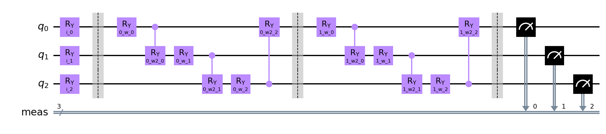
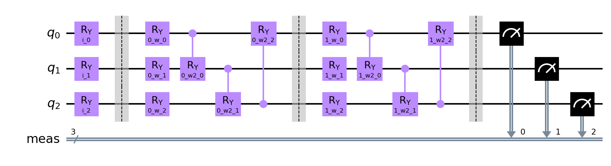
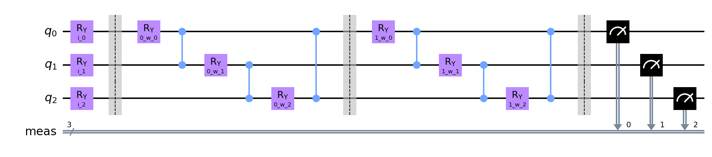
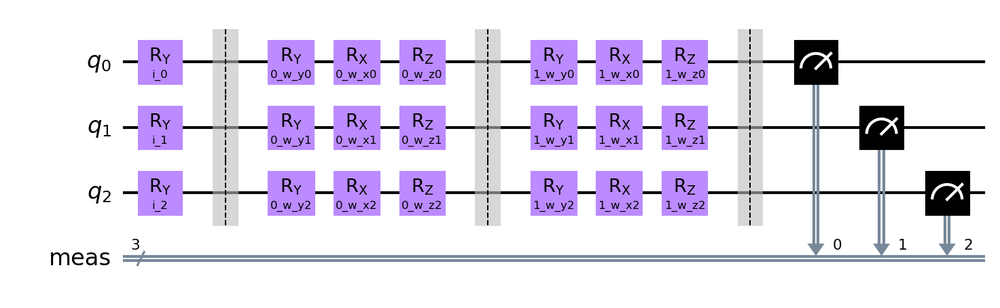
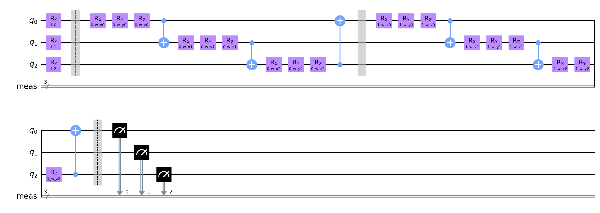
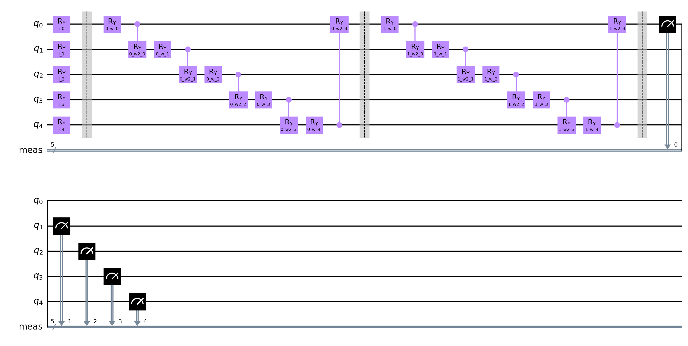
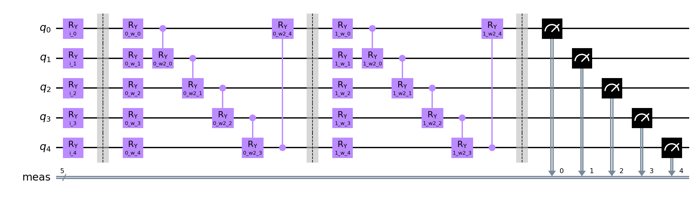
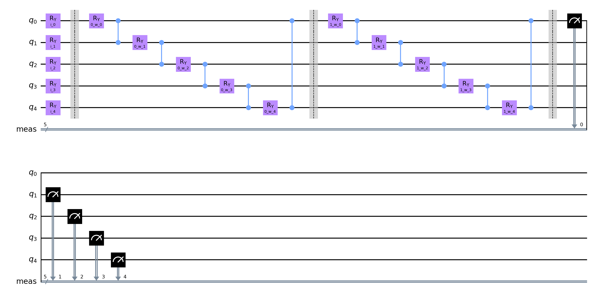
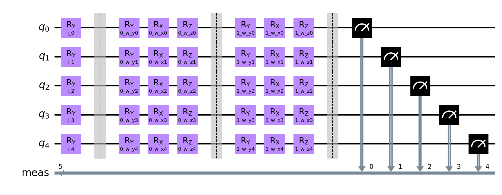
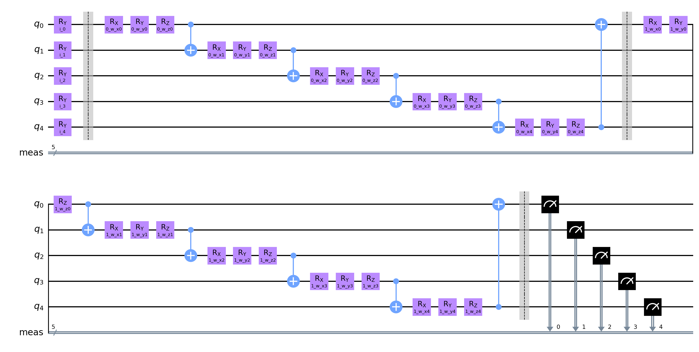

# Quantum Neural Network Classifier run

**Settings:**
Used Optimizer for Neural Network Classifier: `SPSA`
Layer count: `2`

## Quantum Circuits
Quantum Circuits plots for each dataset
| dataset | circuit | plot |
| :-----: | :-----: | :--: |
| adhoc | qml_circuit_qiskit_01 |  |
| adhoc | qml_circuit_qiskit_02 |  |
| adhoc | qml_circuit_qiskit_03 |  |
| adhoc | qml_circuit_qiskit_04 |  |
| adhoc | qml_circuit_qiskit_05 |  |
| vlds | qml_circuit_qiskit_01 |  |
| vlds | qml_circuit_qiskit_02 |  |
| vlds | qml_circuit_qiskit_03 |  |
| vlds | qml_circuit_qiskit_04 |  |
| vlds | qml_circuit_qiskit_05 |  |

## adhoc
#### Average
| circuit | ø score train | ø score test | ø weights |
| ------: | :-----------: | :----------: | :-------: |
| circuit-00 | `0.49799999999999994` | `0.49449999999999994` | `[-0.00582872,1.24789856,0.21106704,-0.70602762,-0.17772474,-0.1696185,0.02556233,0.1903926,-0.0498266,0.18784437,-0.41253643,0.15968641]` |
| circuit-01 | `0.497` | `0.49400000000000005` | `[0.28987445,0.00059162,-0.00629255,-0.07576175,-0.09959007,-0.07065424,0.39050086,-0.18556219,0.35934193,0.01311873,0.28228467,-0.28189537]` |
| circuit-02 | `0.5046250000000001` | `0.512` | `[-1.16492899,3.57912935,-0.45058982,2.77986819,0.43344477,-2.6636385]` |
| circuit-03 | `0.49812500000000004` | `0.49450000000000005` | `[0.2103571,-0.70417312,-0.31764839,-0.60429057,0.29722065,0.22167087,0.32961412,0.97353156,0.56622561,-0.19857562,0.34658989,0.05987308,-0.23019929,0.19207,-0.09564794,-0.18832684,-0.01751494,0.48828268]` |
| circuit-04 | `0.5006250000000001` | `0.503` | `[0.73174687,0.21821738,0.39639718,0.70754537,1.41481239,-0.66253586,0.40857453,-0.62720188,0.78615151,0.27514863,0.02201113,0.32704307,0.5350301,-0.39876776,0.12244541,-0.22172182,0.55892074,0.8184141]` |

#### Per run data
| dataset name and run | circuit-00: score (train, test) and weights  | circuit-01: score (train, test) and weights  | circuit-02: score (train, test) and weights  | circuit-03: score (train, test) and weights  | circuit-04: score (train, test) and weights  |
| :----------: | :--------: | :--------: | :--------: | :--------: | :--------: |
| `adhoc_30` | `[0.4725,0.45]`, `[-0.69280534,-2.47981668,-0.10929283,-3.09550113,-0.16929907,0.90652629,0.69381784,0.97475805,-0.17809234,-3.01806464,-0.45239229,-0.06242304]` | `[0.50875,0.545]`, `[-0.48628242,0.84534009,-0.92000718,-0.35210878,0.18045309,-0.2997911,-0.32244289,-0.39383163,1.38177147,-0.10491177,0.49932572,0.19853071]` | `[0.49875,0.53]`, `[6.06082415,3.3216066,3.10277678,6.45745396,3.30891141,-3.17799898]` | `[0.49875,0.505]`, `[4.46328358,-0.88614053,-2.11727983,-4.35372378,4.30474616,0.13139207,-1.07706317,2.17555537,-2.71833085,-1.52259443,-2.58613974,-2.1573652,-1.09373593,1.25989127,0.36806868,-4.21617576,-2.05209258,4.84479976]` | `[0.49,0.465]`, `[1.75030692,-0.51035949,-1.19831152,3.59604413,1.88633673,0.59601382,-1.04408962,-1.22656437,1.56454751,0.48824463,-1.6204281,1.68893861,0.00677657,-2.9125567,2.22667807,0.12367747,1.06214528,1.3668184]` |
| `adhoc_31` | `[0.47125,0.52]`, `[-0.17533721,1.97922076,-0.26579329,-0.9202923,0.56854265,0.42527974,-0.51222965,1.96861114,-0.14274586,1.11264736,-0.19918873,0.83922092]` | `[0.51,0.51]`, `[-0.35000517,0.36245829,-0.37004254,-0.39559957,0.45837893,-0.38513363,0.70196791,-0.03422431,0.12396792,0.45383026,-0.62812153,0.17143698]` | `[0.51,0.525]`, `[-6.43416728,6.50674616,-0.23321473,-0.11929189,-6.0770112,-0.20795227]` | `[0.5025,0.485]`, `[-0.47774393,-1.05324146,-0.91817768,0.31668445,1.09557558,-0.40225039,0.14607248,0.72111319,1.45057308,0.54755885,1.96528088,-0.15235822,-0.43603587,2.12650617,0.94118519,0.78090343,1.36312348,0.2009583]` | `[0.53,0.485]`, `[-1.4868575,-1.01971539,-0.74977208,0.83437579,1.98842235,-1.20767482,-0.84789863,-2.7059216,0.12946166,-0.47192029,-1.60913283,1.64541453,-0.01523845,0.36725775,-0.92830257,0.00712583,2.59168591,1.50507422]` |
| `adhoc_32` | `[0.5275,0.48]`, `[-0.74488983,3.28157832,2.23092449,-1.17503196,-2.47121864,-0.90634807,-0.42962008,-1.73326011,1.74342762,-0.74572945,-3.09654528,2.96344583]` | `[0.49125,0.485]`, `[1.78563506,-0.40706099,1.27777554,0.88219818,-0.20397165,0.10898272,2.41743584,-0.01123073,1.1893045,-0.54370718,1.62199512,-0.23879262]` | `[0.54375,0.545]`, `[-7.09770016,0.1379342,-6.3753666,5.51633875,6.42325733,-0.02620586]` | `[0.47375,0.465]`, `[-1.55334031,-1.2532967,-1.53261416,-3.83399251,-0.72121509,-0.79918842,-2.24878443,0.5061879,1.55791606,-2.52912063,2.74384547,-2.4442087,-1.67084496,-1.80055634,-1.79060015,-1.32497659,-1.36138992,2.01532575]` | `[0.51375,0.495]`, `[1.05312148,2.59668046,0.85165416,1.16822221,1.40529051,-1.74537624,0.98326577,0.01396727,0.79754847,0.44919222,-0.00819399,1.62214941,1.57871415,0.01779774,0.07805904,0.47045221,0.34570605,0.94591805]` |
| `adhoc_33` | `[0.505,0.475]`, `[3.32127356e-01,1.14638872e+00,2.05109135e-01,-2.88272143e-01,-9.12720453e-02,-9.65984943e-01,3.95785930e-01,5.32805625e-05,2.99849183e-01,-2.84878622e-01,-3.84459297e-01,4.33142121e-01]` | `[0.4875,0.495]`, `[-0.07995151,-0.32149359,1.44163249,-0.10087825,-0.44662819,1.08479758,0.50362962,-1.45911658,-1.09319433,0.05725374,0.02231946,0.60663229]` | `[0.515,0.495]`, `[-6.59546289,9.58436329,0.15011081,6.01550332,-2.99882961,-6.16904159]` | `[0.49625,0.515]`, `[0.13626398,-0.9326557,-0.58993595,-0.56283828,0.42176404,-0.77169578,1.60713363,0.96952862,0.26500524,-0.43163492,0.79374359,0.1777924,-0.02237684,0.66689353,0.8556549,1.0189779,1.28422328,-0.27381589]` | `[0.435,0.495]`, `[1.70868662,-0.35102525,0.1067388,1.573251,-0.65027216,-0.18896559,1.13228344,0.48117676,1.00655957,-0.14863207,0.0582596,-0.1269001,-0.735975,0.04115013,0.01462172,-0.92520346,1.59284504,0.88286913]` |
| `adhoc_34` | `[0.48125,0.525]`, `[1.21096083,0.55771084,0.71166418,0.92417089,-0.3043202,-0.19376801,0.27311397,0.00345589,-0.13823056,1.60673532,-0.34775185,0.02434873]` | `[0.4875,0.435]`, `[0.72770285,-0.1891647,-1.44279774,-0.23562642,-0.71300898,-0.05841441,-0.34418529,0.58925639,1.20999097,0.77314783,0.83379439,-0.17291959]` | `[0.5225,0.485]`, `[-0.19170402,0.23084367,-0.20150769,-0.1672733,0.21573845,-0.16882889]` | `[0.5075,0.47]`, `[-0.20607075,0.6686777,-0.46254338,-0.81107095,-0.44721249,-0.31770438,0.01869006,0.46840815,0.26503204,0.1257995,-0.78602254,0.38733343,0.71964099,0.31862129,0.42641422,-0.73201062,-0.47665656,0.19930043]` | `[0.5125,0.505]`, `[0.78062238,-0.0386763,0.1008287,1.47362899,1.47782105,-0.49810456,0.30877332,-0.05256499,1.17011336,1.29362792,-0.24039384,0.52048378,1.02021813,0.04850076,-0.04094391,0.59975753,0.13341176,-0.889237]` |
| `adhoc_35` | `[0.5,0.5]`, `[-5.45782444e-01,3.18119961e+00,-2.63443877e+00,-1.57423173e+00,4.58719596e-01,-4.82497961e-01,-5.17636388e-02,-3.62877836e-01,-9.53528433e-01,2.73166830e+00,-1.87351745e-03,-2.43188351e+00]` | `[0.4975,0.515]`, `[1.31573866,0.27690734,-0.50772595,0.29780729,1.85888935,-0.30060031,0.29847119,-0.063496,0.49112944,-0.49883576,-1.38807534,0.00554934]` | `[0.5,0.5]`, `[-3.2445993,6.03235421,4.82887866,3.1515475,-0.22219952,-4.79769963]` | `[0.49875,0.5]`, `[0.18817281,0.08281653,-0.35327158,0.20614312,-0.47733064,0.93615118,0.95858972,0.65839149,1.19105828,0.15930311,-0.32937928,1.18880123,-0.35424018,0.33003262,0.42940418,0.77782345,1.23333572,0.32104443]` | `[0.49125,0.575]`, `[1.94459671e+00,2.66901936e-01,-2.80997148e-03,5.44720362e-01,2.54535479e-01,-4.69377749e-02,-6.23143960e-02,-7.85206217e-01,-3.85723318e-01,3.39518304e-01,-1.04606153e-02,-6.81967625e-03,2.43619697e-01,7.63968716e-03,1.89857324e-03,7.96978503e-01,1.04243900e+00,2.24289382e+00]` |
| `adhoc_36` | `[0.505,0.49]`, `[-0.19168883,1.78167029,0.58426584,0.24489778,0.10463851,0.42321303,0.59486076,1.16462896,-0.28360762,-0.43346814,-0.2366842,0.04984295]` | `[0.48,0.44]`, `[1.52600914,-0.78963343,0.27626391,-0.1843352,-0.97057401,1.71716519,1.30253654,-0.31696649,-0.54436251,0.177476,-0.21190088,-0.85745487]` | `[0.5,0.545]`, `[-0.15162003,3.0729789,0.18820038,-0.12437625,3.06804626,0.16585647]` | `[0.505,0.515]`, `[-0.46075185,-1.0372311,-0.36733042,1.06824737,-1.11785489,0.33578312,2.54888089,-0.13366223,-0.67980072,0.35302608,0.71704628,0.07408375,1.05514879,0.78905295,-0.45841718,0.57954116,-1.38110821,-0.54466739]` | `[0.5,0.52]`, `[0.76368558,0.83156247,1.12517224,1.65002623,0.69898798,1.27804536,-1.26894429,-1.08877726,-0.90465119,2.52564302,-1.53206745,1.23904323,-0.02098701,-0.12647299,0.89724249,-0.30638014,-0.55648742,-1.1781169]` |
| `adhoc_37` | `[0.5075,0.505]`, `[-0.04965617,0.93382584,-0.03480807,-0.91648282,0.73602034,-0.71448054,-0.10299583,-0.44392429,-0.22755356,0.96041565,-0.26626754,0.16788893]` | `[0.49875,0.51]`, `[0.98796273,0.31345304,0.09595144,-0.23910624,-0.51094495,-0.23203047,-0.33693885,-0.15751646,0.51131391,-0.09316726,0.4283982,0.07075548]` | `[0.49,0.49]`, `[-0.39989052,12.68557207,-3.22312144,0.35353362,0.11816556,-9.50088346]` | `[0.49625,0.515]`, `[0.44325613,-0.11246519,1.81835316,0.28986964,0.85026116,1.99715547,0.86592215,1.81237414,0.90576417,0.14471038,0.83362011,1.36930906,-0.38930665,0.43414385,-0.70556323,-0.09041628,0.37731276,-0.75865483]` | `[0.505,0.48]`, `[-1.61893272,-0.4770163,-1.32934951,-2.97263511,3.98719587,-2.37813419,2.08008201,0.28635466,0.65948338,-1.32331957,5.24197812,-0.59368884,0.0806397,-1.39168906,-1.76586297,-0.69787129,-1.04971069,3.51642181]` |
| `adhoc_38` | `[0.50375,0.485]`, `[-0.18422973,1.64486406,0.73368434,0.01641181,0.04247188,-0.28081125,-0.07042808,0.30062126,-0.83510799,0.17350979,0.155464,0.08673224]` | `[0.49875,0.495]`, `[-3.16184586,-1.21664819,0.16687163,-0.12706625,0.06917063,-2.34760146,0.24881405,-0.69286479,0.46401392,-0.5174597,0.27583437,-2.14506102]` | `[0.49875,0.51]`, `[0.29948113,0.81516303,-0.09100093,0.33698306,0.80395865,-0.0767507]` | `[0.50375,0.475]`, `[-1.05459051,-1.66358463,1.73935605,0.05081872,-1.14289499,0.69322779,-1.12720357,2.8911977,2.24494577,0.23894885,-0.66064702,1.53685779,-1.01588038,-1.79355768,-1.08930632,0.18155581,0.28871175,-1.93638489]` | `[0.5075,0.525]`, `[0.9636459,-1.65246391,2.24706385,1.62360667,1.43203109,-0.20078435,1.08700107,0.80824753,2.80502422,0.20232225,-0.01178967,-2.22812061,1.56943014,0.01998221,0.06444625,-1.61265973,0.86129412,-0.71057045]` |
| `adhoc_39` | `[0.50625,0.515]`, `[0.98301417,0.45234383,0.68935535,-0.27594462,-0.65153044,0.09268671,-0.53491797,0.03185967,0.21732355,-0.22439183,0.70433442,-0.47345108]` | `[0.51,0.51]`, `[0.63378105,1.13175836,-0.08084711,-0.30290229,-0.71766497,0.00608344,-0.56427951,0.68436872,-0.14051596,0.42756109,1.36927722,-0.45763039]` | `[0.4675,0.495]`, `[6.10554904,-6.59626867,-2.65165346,6.37826316,-0.30558962,-2.67688008]` | `[0.49875,0.5]`, `[0.62509189,-0.85461008,-0.39304011,1.58695648,0.20636771,0.41383803,1.60390347,-0.33377874,1.18009304,0.92824701,0.77455112,0.61848522,0.9056381,-0.41032766,0.06668028,1.14150905,0.54939085,0.8149211]` | `[0.52125,0.485]`, `[1.45859335,2.5362856,2.81275713,-2.41578653,1.66777496,-2.23344032,1.71758666,-2.0027306,1.01915142,-0.60319014,-0.0476599,-0.49006964,1.62310308,-0.05928708,0.67661743,-0.67309515,-0.43412168,0.50206994]` |

## vlds
#### Average
| circuit | ø score train | ø score test | ø weights |
| ------: | :-----------: | :----------: | :-------: |
| circuit-00 | `0.501375` | `0.497` | `[0.60283435,0.63888794,-0.14535544,0.60228028,0.03476556,-0.10108625,0.17366425,-0.16462373,0.05424685,0.85455343,0.85086859,0.11919047,0.43891748,0.4034812,0.39460888,0.01356133,-0.24605881,-0.08206309,0.1553151,-0.03096218]` |
| circuit-01 | `0.5356250000000001` | `0.518` | `[0.68583364,-0.15671274,0.27446,0.65086027,-0.07356887,0.05140184,0.18265044,0.12168418,-0.23387404,-0.01013944,0.20879981,0.56989293,-0.16150094,0.24700351,0.65373069,0.02517908,-0.11531282,0.14260782,0.3122847,0.02106208]` |
| circuit-02 | `0.6423750000000001` | `0.6405` | `[0.74188591,1.05401199,-0.42815908,-1.30690127,2.33878176,-1.90091908,-1.67541138,-3.00370083,-0.53952322,-2.61311623]` |
| circuit-03 | `0.5051249999999999` | `0.519` | `[0.87570328,0.40215631,-0.22229392,0.35664683,0.73809861,0.04545149,0.76951505,-0.12619747,0.2895416,0.71417861,0.66281575,0.96473828,0.1987229,-0.04023013,1.11882198,-0.39701702,1.29922083,-0.06804992,0.22183102,0.69264616,0.19500924,-0.53329862,0.38215365,-0.13816051,0.62421281,0.51629638,0.39943338,0.36058768,0.16297322,0.04892368]` |
| circuit-04 | `0.112375` | `0.11300000000000002` | `[0.6595923,0.97652621,0.98086559,1.02557317,-0.15626076,0.67245556,1.14271912,0.12466836,0.61158307,-0.10955215,0.54188565,-0.28230005,0.24027121,-0.00506325,0.01565759,-0.29989578,0.50577307,-0.10806667,0.9832943,0.98537314,0.896304,0.50333066,0.1205419,0.64852245,-0.15432574,0.62121963,0.26966343,0.47479051,0.27970052,0.44397553]` |

#### Per run data
| dataset name and run | circuit-00: score (train, test) and weights  | circuit-01: score (train, test) and weights  | circuit-02: score (train, test) and weights  | circuit-03: score (train, test) and weights  | circuit-04: score (train, test) and weights  |
| :----------: | :--------: | :--------: | :--------: | :--------: | :--------: |
| `vlds_40` | `[0.51125,0.455]`, `[2.10272851,1.77849764,-1.12266521,-0.22131672,0.95906722,-0.1250151,-0.50399088,-0.8017458,1.76823347,1.94497436,1.47184409,-0.55205573,-1.20536149,-0.46383879,-1.221003,-0.46355601,0.02612252,-1.74577305,-0.30259545,-1.39448338]` | `[0.58125,0.455]`, `[0.09550102,0.05987214,0.9982388,0.19136088,-0.03735643,0.6592556,-0.55751509,0.20565977,2.12874195,-0.01469058,-1.05348452,0.46814884,0.80335584,0.03797489,-0.11426925,-0.58696523,0.66573288,-0.07887609,2.48497942,-0.09618254]` | `[0.77375,0.77]`, `[0.24810783,0.04375896,0.74749045,-0.01794966,0.02187464,-0.19656837,0.00614962,0.38594503,-0.01410104,0.02855376]` | `[0.4925,0.56]`, `[0.71618585,1.36544504,-1.0354566,-0.0323945,0.87102298,0.5693498,0.34395456,0.50900227,-0.10020825,-0.5425326,-0.96076964,1.33179083,0.11258875,0.27240824,-0.66248032,-0.77555526,0.17652163,1.00239673,-0.16110802,-0.23860177,0.32028543,-1.25861595,0.34538334,0.08254215,1.28439745,1.4431526,0.91061052,0.30903024,-1.02201384,0.67506104]` | `[0.03375,0.045]`, `[1.23741794,1.85702539,1.14170914,1.43977752,-0.38534902,-1.27648349,1.47766121,-0.46940713,0.55165833,-0.08540621,1.74254959,-0.62114536,-0.2563575,0.4246858,-0.88309653,-0.08766694,-0.0573072,0.71549603,2.15436973,0.90158037,1.56772567,-0.11048402,2.08440526,-0.28366924,-0.18637731,0.936668,-0.02901294,0.21073729,-0.10827613,1.31098232]` |
| `vlds_41` | `[0.51125,0.455]`, `[1.58384026,-1.61042689,-0.45590057,-1.36704418,-1.95924397,0.17053497,2.09087098,-0.5492182,0.327058,-0.11975038,-0.57880483,-0.53984026,0.15974328,2.02429067,1.47826648,0.02337204,-2.36246468,-0.4840154,-0.11292435,-0.03067077]` | `[0.475,0.54]`, `[1.72570364,-1.2061071,-0.44131924,1.84045854,-0.68756521,-1.62104046,-0.78012522,0.26942915,0.05647261,-0.66198192,1.48293589,2.27299302,-0.29424034,-0.33296765,1.47558405,2.41875015,-0.2420587,-0.17015688,-0.30138182,0.78937659]` | `[0.48875,0.545]`, `[0.07939234,1.14060729,-0.02403843,0.25495344,-0.12374572,-0.00673458,-1.05150005,0.34236121,0.06401294,-0.08338728]` | `[0.4925,0.565]`, `[1.53305539,0.81849989,1.49304288,1.06100439,1.21051202,-0.22396943,0.40578617,-0.92353546,0.70568243,1.05344571,-0.00344706,0.89764779,-0.60903121,-1.5936991,2.08524417,-1.36194629,-0.08982061,0.51153601,-0.59164933,1.54055309,0.80625441,-0.87921353,1.05862963,0.96744784,-0.35884513,1.59069113,-0.39877665,-0.06608024,0.73010087,0.4816539]` | `[0.00125,0.0]`, `[2.58624036,2.67273647,2.86760917,3.09119617,-0.86594786,3.03227386,1.758836,-1.32297743,-3.02977585,-1.89501818,3.65630051,-0.40978985,-2.1960226,-1.79570542,1.91190103,-2.95661612,1.95772281,3.13595064,2.93552334,4.07881579,4.2323403,2.0264994,-3.03607322,-0.25391591,-2.14909103,-1.16959066,2.69147689,-1.33406038,-0.1983751,-2.21685183]` |
| `vlds_42` | `[0.50625,0.53]`, `[-2.40959757e-01,5.27004856e-01,-1.28979340e+00,-3.93761091e-01,1.46677061e+00,-1.01108264e+00,-5.95132681e-01,-1.48577050e-01,-1.54895967e-01,3.17685417e+00,1.41318264e+00,-2.16747233e-01,9.28927702e-02,2.47963424e+00,-1.43053495e-03,-5.02972787e-01,2.50311631e-01,2.55795082e-01,-1.41345401e-01,1.76072655e+00]` | `[0.67375,0.68]`, `[0.7575911,0.18690081,0.55793431,-0.35986827,-0.22653279,0.20536795,-0.37958331,0.9920072,-0.5415426,0.35340794,-0.39336929,1.00264781,-0.60742735,0.20944543,0.4286496,0.05474495,0.31583697,0.05478755,0.65019116,-0.24452015]` | `[0.50375,0.485]`, `[1.45404283e-01,8.01281342e-02,-3.16061797e+00,2.92387280e+00,4.40133380e+00,1.37013633e-03,-8.13436184e-02,-2.91668331e+00,-2.86313050e+00,-1.39235547e+00]` | `[0.50375,0.515]`, `[0.43085707,-1.90843954,0.11522816,-0.49814052,-0.95467542,1.91948433,-2.52257569,-0.59090423,-1.67783023,0.204467,-2.1930275,2.96012613,0.71956765,-0.4967694,1.5353931,-0.9601162,0.65840709,-1.11875072,0.47622191,0.10067416,1.72066382,-1.00205236,0.68438863,1.81360995,0.84812993,1.47154431,-0.23455562,-1.52954713,-0.47282616,2.20628595]` | `[0.30125,0.32]`, `[-1.34269913,2.40892404,2.67609736,2.53807108,-4.29758575,0.1389622,2.66907796,1.5034955,2.32147659,-0.17512176,-2.18112425,-1.27523714,2.19840558,-2.43301126,-2.92319155,-2.36919362,1.46231674,-3.26572248,3.32456389,1.97268698,-1.68149735,0.12155686,0.24643097,3.20356789,-0.29805695,-0.04366358,-2.11363354,0.10070984,1.80593666,-1.58905513]` |
| `vlds_43` | `[0.5175,0.525]`, `[-0.2845592,0.12940887,0.62631183,0.23971763,0.15493701,-0.09352333,-0.53358875,0.02663076,-0.72161707,-0.4240424,0.82679672,-0.51782869,0.38802482,0.70943876,1.16291525,0.25578717,0.21408904,0.72176472,0.61312233,0.36087519]` | `[0.505,0.525]`, `[0.13515445,1.45183852,0.81860715,-0.19041776,0.19478268,-0.24640777,-0.08266791,0.3644124,-0.56069788,0.49899715,-0.45217154,0.62106461,0.1608859,-0.05494939,0.70352304,0.05899144,0.13422318,0.18586733,0.26497607,-0.2854451]` | `[0.71375,0.675]`, `[0.20218238,-0.04404601,0.31737535,-0.01127278,-0.06734081,-0.1230084,0.03162448,0.71679836,-0.06258033,0.14875679]` | `[0.51,0.515]`, `[-0.60441904,1.14262489,-0.8436007,0.71633664,-0.75671837,0.96921293,1.87245267,-0.23258289,0.48738534,-0.99425453,1.10569399,1.29248471,1.42619147,-0.32367463,-0.06310167,1.14301674,1.60880814,-0.56614278,-0.49593137,1.13038792,0.34608356,0.17262945,0.78284826,-0.38525983,0.86739651,0.79045397,-0.63164459,0.11365653,1.39082241,-0.65252337]` | `[0.01125,0.01]`, `[-0.47950041,-0.26104191,-1.64203919,1.77411762,-0.52999559,-0.87378415,2.12164693,-0.09360095,0.56507014,1.93046641,0.42405588,-0.35341791,0.88793003,1.7367315,0.94906378,2.80550359,-0.03013833,-1.78382603,-0.06715258,-1.45579978,-1.63338699,-0.18526363,1.35441882,-0.15417641,0.02227925,1.57511982,-1.33857321,1.88255874,1.36945507,0.96109617]` |
| `vlds_44` | `[0.49625,0.535]`, `[0.79380451,-0.04836638,-0.21010617,-0.06395297,0.16777932,-0.1703994,-0.48691591,-0.01836393,-0.33315392,-0.27573365,1.54838226,0.40033288,-0.09451476,0.01371036,0.86177265,0.28633798,0.29815943,0.59411449,0.59194236,0.28157277]` | `[0.50875,0.465]`, `[-0.10845764,-0.8322344,-2.18687002,0.90540341,-1.27786973,1.20898243,1.54384905,-0.39098665,-2.01811327,-0.82246235,-0.4455962,1.46525058,-1.3613051,-0.14720595,0.58017065,-1.0545503,-1.54067707,-0.8389914,-1.4482611,0.23233667]` | `[0.7225,0.715]`, `[0.11272443,-0.02522694,0.5415599,-0.05129187,0.08398947,-0.00749372,-0.00996145,0.52342427,0.03397471,-0.03650778]` | `[0.5025,0.545]`, `[-0.66475372,-0.89451375,0.47809229,1.15184508,1.41363717,-0.5451727,-0.1804492,-1.49787255,1.22089704,1.89172078,0.62729729,1.53438724,1.88652999,1.89481636,1.1143593,0.10464417,-0.09661926,-1.90068517,0.7376298,1.66324081,0.67576596,0.7900558,0.85826125,-1.81844513,0.20139645,0.87517106,0.84923409,-0.64950591,0.63141332,1.22090888]` | `[0.50875,0.465]`, `[-0.66129984,0.29756829,-0.35952493,-0.02995614,2.03911878,1.64194161,1.5391168,0.41279242,3.03050651,-0.44285433,-0.6564261,0.85649461,-2.38119571,-0.46220874,-1.42022374,-0.8650657,-0.02183638,0.16680178,0.32800685,-0.19055955,1.57168741,-0.02251083,-3.09864086,-0.0093006,0.99730819,4.08984566,2.83799715,0.62608694,-2.32252594,0.94112422]` |
| `vlds_45` | `[0.47875,0.475]`, `[0.65496297,1.18665883,-0.5224281,0.6656779,0.09692748,0.37731864,1.39332026,0.53378554,-0.54981847,-0.96762957,1.02002652,0.56200178,0.19506609,-0.57407802,0.18770563,-0.39488839,-0.70351586,-1.34170823,0.69078716,0.74185321]` | `[0.5,0.5]`, `[-0.34332798,0.21876065,0.66816835,0.83051446,0.31037008,-0.05446025,-0.4840184,0.42101561,-0.57054396,-0.34473462,0.18331408,0.77179571,0.86074347,0.63903335,0.62679347,-0.08271484,0.54888944,-0.18385254,0.60776012,0.37451348]` | `[0.7,0.75]`, `[0.08964216,6.28683893,-2.53929718,0.08958452,6.3085358,6.3152779,-6.33976158,-2.70962983,-6.23179586,-6.25257891]` | `[0.5,0.495]`, `[0.50791512,0.63584021,0.2684988,0.74573735,0.90221145,-0.72389785,0.34659216,-0.40264868,0.86421689,1.87169648,1.06423596,2.25743198,-1.30571667,2.41898635,2.06868967,-1.14563236,0.72934049,0.47622005,1.65248267,0.20564571,-0.04991299,-0.40691828,0.45811877,-0.81358274,1.04880964,-0.49293195,-0.71338531,1.89052857,1.10447461,-1.14692041]` | `[0.0,0.0]`, `[-0.46793236,1.52966156,1.46581643,0.19694191,-0.57851683,1.12684765,-0.0192913,0.15777257,0.5184084,0.40960915,1.39551661,-0.32605626,-0.19629543,0.85951429,0.94140557,-0.36762955,1.45466981,1.04777873,-1.20530816,1.26725771,-0.22311879,0.13609724,0.50444995,-0.45106605,1.57106013,-1.01757196,0.96556364,1.80879654,1.27891915,0.72977732]` |
| `vlds_46` | `[0.485,0.515]`, `[0.24265972,1.11574998,-0.08431395,1.39144198,-0.47087739,-0.37542848,0.2274307,-0.2124178,0.0734513,1.06811102,0.9795718,0.4320642,1.53359565,0.07667112,-0.13464865,1.00368512,-0.55234828,0.32299234,-0.58048686,-0.68000029]` | `[0.5225,0.545]`, `[2.50657632,0.24720061,0.43467888,0.99525088,1.36829508,0.27134101,1.069747,-0.33087024,0.22573147,-0.11709986,0.8065204,-0.52615943,0.74150027,0.84246056,0.11263329,-0.39106541,-0.7627899,0.8412619,-0.4640862,0.68656634]` | `[0.7175,0.78]`, `[-0.13835962,-0.00194082,1.26005921,-0.01428553,0.00537693,0.22604437,-0.04197863,-0.15799963,0.02365186,0.06014628]` | `[0.515,0.55]`, `[2.9394718,0.64302268,-2.07804232,1.03258882,4.03921745,-2.7088017,5.21979868,-0.20809209,-0.69793159,4.34372348,3.86180664,-3.0061341,-3.9145889,-5.44195122,0.9503986,-3.23566996,6.6044527,-1.32735551,-2.07582287,4.03030108,-3.51904927,-0.93564799,-2.48912972,-3.28577982,3.86662895,-3.80804842,1.95659601,5.10109689,-1.56135083,-3.29172482]` | `[0.0275,0.03]`, `[2.8627909,0.90899288,-0.87785757,0.31881497,-1.5023487,0.81539837,0.80687128,-0.18739206,1.47332861,-1.30611463,-1.34432863,-0.23280217,0.21296863,1.51205941,-1.08714503,1.40167689,-0.0380451,0.06083651,1.16417428,1.3863973,0.94963257,2.30095692,0.58797861,0.87086453,-0.06648851,1.69279425,-0.54129404,-0.50968378,-1.7711015,2.60806515]` |
| `vlds_47` | `[0.5,0.515]`, `[-0.07168769,2.04971715,2.00415839,1.99142098,-0.71703681,-0.2332404,-0.02886233,0.2837481,0.34170253,2.11645198,0.32472964,0.95288197,1.62723259,1.59885109,0.70607886,0.4249814,-0.06402503,-0.09734225,0.12937437,-0.01287972]` | `[0.50875,0.465]`, `[2.61529719,-0.50240351,0.60927491,0.4642737,-0.13243244,0.09739375,0.56762147,0.17414167,-0.52747953,0.03926907,1.69564301,1.18821861,-0.59158045,-0.20463319,0.90044013,-0.00780567,-0.28901593,0.11532503,0.67879674,-0.02392944]` | `[0.64375,0.625]`, `[0.60739975,-3.16049862,2.56251214,2.98728284,6.29095764,-0.45985449,-3.12488534,-3.52316867,3.08897505,-0.03467236]` | `[0.5175,0.48]`, `[3.61221937,2.73842054,-1.03522018,0.70288627,0.09379636,-1.96645956,0.91385842,1.40837278,2.14549121,-1.26406992,0.79622229,1.67039764,0.0531759,0.91024581,0.83544471,-0.88135692,2.03580746,2.48643373,2.03693421,-2.32122293,1.6200992,-0.56678463,1.76727496,0.60427237,-2.32533688,2.58260792,-0.5538882,-2.2195213,1.13512149,-1.71009979]` | `[0.04625,0.07]`, `[-0.38486792,0.54646789,2.15353891,1.48418747,2.42807075,0.84431062,1.1727435,0.25251079,0.54907316,-0.77088878,-0.36628162,-0.3093538,0.47121375,0.09754611,1.16800338,-1.39101788,0.4547722,0.39235979,-0.9509643,-1.67179038,1.0487544,0.73939944,0.15399891,0.69971662,-0.33495254,-0.90671684,-0.47637088,-0.03857132,0.44464786,1.04309317]` |
| `vlds_48` | `[0.5075,0.49]`, `[0.97772381,0.47299617,-0.12477849,2.79783429,0.04808225,0.11200862,-0.45585328,-0.42389439,0.03292587,1.719883,0.44258216,0.60189113,1.33670889,-1.50205828,0.35372729,-0.19386228,0.36308741,0.65244015,-0.21946985,-1.15328229]` | `[0.57375,0.525]`, `[0.23415071,0.20567593,0.40456335,2.11713378,0.5377327,0.23807033,0.78148657,-0.54428471,-0.07319811,0.25239321,0.37827891,-0.31209522,-0.51107357,-0.53291184,0.51499719,-0.32308271,0.28903391,0.98414015,0.07896113,-0.46723672]` | `[0.655,0.58]`, `[5.96251044,9.36427969,-3.81862682,-18.88146247,6.25425956,-24.75597985,-9.27113229,-22.28609015,-0.04649058,-18.70383405]` | `[0.50625,0.48]`, `[0.86578381,0.44385694,0.29289682,-0.68851284,1.20014872,1.86012333,1.05681365,0.86107828,-0.04690174,0.98792914,1.23078922,0.87541042,2.22116466,0.47820225,1.93301317,1.92253131,0.56340473,0.49643263,0.73951041,1.21693252,0.93443898,-0.72705165,0.34234868,0.69882601,-0.07011704,0.84214939,1.421815,1.03783608,0.6048292,0.24995131]` | `[0.1925,0.19]`, `[1.58198132,1.3815196,-0.01362987,0.2394061,1.48665604,0.71063477,-0.29571874,1.65974859,-0.31782631,0.40915989,-0.28788494,0.23186805,1.51825927,0.28824723,0.86232184,0.4294201,-0.06189943,-0.86910494,1.07369683,-0.12822352,1.53384519,0.05054707,-0.02296257,0.26790541,-0.17797664,1.18032788,0.16849604,1.88474068,0.83883633,0.64732361]` |
| `vlds_49` | `[0.5,0.475]`, `[0.26983035,0.78763916,-0.27403877,0.98278497,0.6012499,0.33796465,0.62936436,-0.33618451,-0.24141726,0.30641581,1.06037487,0.06920466,0.355787,-0.32780919,0.5527048,-0.30327094,0.0699957,0.30110128,0.88474667,-0.1833331]` | `[0.5075,0.48]`, `[-0.75985243,-1.39663102,0.88132351,-0.28550697,-0.78511261,-0.24448419,0.14771028,0.0563176,-0.45811104,0.71550753,-0.11407261,-1.25293526,-0.81586808,2.01378886,1.30878472,0.16548845,-0.27230303,0.51657316,0.57091151,-0.7548583]` | `[0.505,0.48]`, `[1.09855058e-01,-3.14378068e+00,-1.68007475e-01,-3.48443991e-01,2.12576293e-01,-2.24376943e-03,3.12867502e+00,-4.11965574e-01,6.12251514e-01,1.34716757e-01]` | `[0.51125,0.485]`, `[-0.57928282,-0.9631938,0.12162164,-0.62488235,-0.63816619,1.30464579,0.23891906,-0.18479208,-0.00538506,-0.41033943,1.09935633,-0.16615985,1.39734739,1.47913408,1.39125909,1.21991453,0.80190591,-0.74058416,-0.09995719,-0.401449,-0.90453675,-0.51938703,0.01341274,0.75476414,0.87966824,-0.13182626,1.38832859,-0.38161696,-0.91083889,2.45664413]` | `[0.00125,0.0]`, `[1.6637921,-1.57659206,2.39693645,-0.79682503,0.64329055,0.56445416,0.19624754,-0.66625877,0.45391115,0.83064689,3.03647947,-0.38356063,2.14380611,-0.27849138,0.63753716,0.4016314,-0.06252446,-0.68123673,1.0760331,3.69336648,1.59705759,-0.02349188,2.43141311,2.59529821,-0.92096198,-0.12501623,0.53198515,0.11659057,1.45948881,0.00420035]` |

