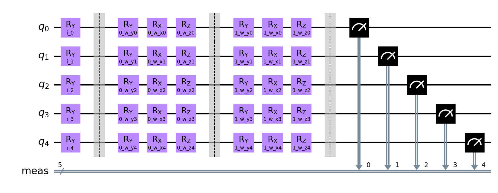
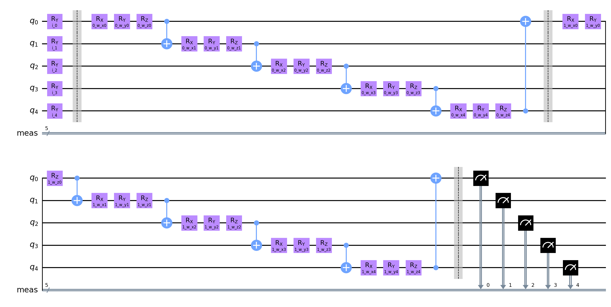

# Extended QNN Classifier run

**Settings:**
Used Optimizer for Neural Network Classifier: `COBYLA`
Layer count: `2`

## Quantum Circuits
Quantum Circuits plots for each dataset
| dataset | circuit | plot |
| :-----: | :-----: | :--: |
| adhoc | qml_circuit_qiskit_01 |  |
| adhoc | qml_circuit_qiskit_02 |  |
| adhoc | qml_circuit_qiskit_03 |  |
| adhoc | qml_circuit_qiskit_04 |  |
| adhoc | qml_circuit_qiskit_05 |  |
| custom | qml_circuit_qiskit_01 |  |
| custom | qml_circuit_qiskit_02 |  |
| custom | qml_circuit_qiskit_03 |  |
| custom | qml_circuit_qiskit_04 |  |
| custom | qml_circuit_qiskit_05 |  |
| iris | qml_circuit_qiskit_01 |  |
| iris | qml_circuit_qiskit_02 |  |
| iris | qml_circuit_qiskit_03 |  |
| iris | qml_circuit_qiskit_04 |  |
| iris | qml_circuit_qiskit_05 |  |
| rain | qml_circuit_qiskit_01 |  |
| rain | qml_circuit_qiskit_02 |  |
| rain | qml_circuit_qiskit_03 |  |
| rain | qml_circuit_qiskit_04 |  |
| rain | qml_circuit_qiskit_05 |  |
| vlds | qml_circuit_qiskit_01 |  |
| vlds | qml_circuit_qiskit_02 |  |
| vlds | qml_circuit_qiskit_03 |  |
| vlds | qml_circuit_qiskit_04 |  |
| vlds | qml_circuit_qiskit_05 |  |

## adhoc
#### Average
| circuit | ø score train | ø score test | ø weights |
| ------: | :-----------: | :----------: | :-------: |
| circuit-00 | `0.5043749999999999` | `0.5045000000000001` | `[0.55676532,0.67546566,0.03372533,-0.24825307,0.01913698,-0.09136148,0.49589184,0.64125937,0.21354631,0.01178014,0.13636285,-0.00492113]` |
| circuit-01 | `0.5065` | `0.5155` | `[0.31802832,0.491445,0.05634764,0.19275342,0.12165859,0.23250622,0.3468681,0.5902164,0.32204981,0.09655826,0.01737245,-0.0045032]` |
| circuit-02 | `0.5050000000000001` | `0.5045` | `[0.01372858,0.58073413,-0.06224116,0.02313272,0.57329394,-0.03664406]` |
| circuit-03 | `0.499` | `0.49849999999999994` | `[0.3333303,0.27200626,0.20161066,0.7465861,0.47340294,1.09851361,1.82720653,1.67841465,1.7439344,0.82345772,0.88378499,1.24958962,0.39173941,0.58611548,0.63486931,1.01739802,0.58626995,0.57412215]` |
| circuit-04 | `0.5036249999999999` | `0.49750000000000005` | `[0.91005099,1.39028693,0.52895131,0.93723188,1.21958392,0.67511182,0.42612045,0.60269631,0.18528978,0.73284458,0.42499417,0.59807499,0.83875813,0.03944476,0.3571224,1.38184634,0.76215106,0.85702853]` |

#### Per run data
| dataset name and run | circuit-00: score (train, test) and weights  | circuit-01: score (train, test) and weights  | circuit-02: score (train, test) and weights  | circuit-03: score (train, test) and weights  | circuit-04: score (train, test) and weights  |
| :----------: | :--------: | :--------: | :--------: | :--------: | :--------: |
| `adhoc_30` | `[0.4925,0.51]`, `[0.1076247,-0.0443433,0.05112252,0.21188802,0.29779818,-0.48055087,-0.40848193,0.5275441,0.08377416,-0.28151444,-0.00207388,0.12632244]` | `[0.525,0.545]`, `[2.42245441,0.13446598,0.0449979,-0.09783189,-0.32027803,0.58536811,2.60280932,0.09891642,-0.00281943,-0.02462923,1.17363793,-0.64203053]` | `[0.505,0.5]`, `[0.23609159,0.71978765,0.0562963,0.1906378,0.68370943,0.05003905]` | `[0.49875,0.505]`, `[0.01320042,0.05417669,1.23244843,0.32308693,0.58556086,1.15166156,1.28237667,1.06003799,1.97267228,0.44864777,0.38193378,1.41759671,-0.15526643,-0.36690763,0.12038746,1.91230735,0.53809683,2.2288543]` | `[0.5125,0.52]`, `[0.33941386,1.7071434,0.79282631,1.59805851,1.90297018,-0.05222546,0.60907341,1.01771758,0.01289784,1.56227927,0.04853621,0.84305463,1.59327748,-0.01228499,-0.00199063,1.01186843,1.93609312,1.0616204]` |
| `adhoc_31` | `[0.5025,0.5]`, `[-0.35641048,-0.04910898,-0.05610008,-0.14350714,0.23557692,-0.10173962,0.50327704,0.26791153,0.45991205,-0.17748441,-0.29582214,-0.09017525]` | `[0.505,0.51]`, `[0.06215698,-0.01190134,-0.12741597,0.17369631,0.46343586,-0.01424174,0.15880701,0.53938216,0.48342405,-0.51115585,-0.47402117,-0.33042821]` | `[0.5075,0.515]`, `[-0.02109411,0.2082037,-0.27948772,0.09524582,0.14160142,-0.25918946]` | `[0.5025,0.485]`, `[1.27638593,1.13864237,-0.04207334,0.81109425,1.25029245,1.59314526,2.14863602,1.75337045,0.88196708,1.42539505,1.88121128,2.351615,-0.12664689,2.30762428,1.54030187,1.5613204,0.55893591,0.2468059]` | `[0.50375,0.54]`, `[-0.04693081,0.26458311,1.51648875,1.51713736,1.55733711,1.76777446,-0.03338667,1.59840963,-0.06552733,0.07467329,-0.04056804,1.61079274,1.50400408,0.00626067,0.03861724,1.6550648,0.65157952,1.12576646]` |
| `adhoc_32` | `[0.50125,0.525]`, `[2.68509416,0.510519,0.06856284,-0.10842608,0.55871518,-0.29753124,3.07443802,-0.53979817,0.145255,0.01528405,-0.1526253,0.15865976]` | `[0.5025,0.51]`, `[-0.49659675,0.57350164,-0.09222744,-0.0066671,0.00360103,-0.16558144,0.40734692,-0.16913368,0.31832469,-0.21808535,-0.01473834,-0.13272131]` | `[0.50375,0.505]`, `[-0.14038376,1.18886632,-0.30860563,-0.12636167,1.24604733,-0.3241851]` | `[0.495,0.51]`, `[0.24100976,-0.15263523,-0.31957056,-0.00682092,0.38317814,0.41648045,2.25465083,1.66108417,1.82872054,0.25592909,0.17829426,0.49794092,-0.09987115,0.25510008,0.43794898,0.61391596,0.36906839,-0.52681082]` | `[0.505,0.515]`, `[1.41243868e+00,1.22292073e+00,-5.06492509e-02,4.14360269e-01,5.53028729e-01,1.18998813e-01,3.48484783e-01,3.40629442e-01,3.45466285e-01,3.15769941e-01,2.26697401e-02,-1.89054586e-01,1.13633240e+00,-5.41813097e-02,1.68208159e-01,1.57579991e+00,-7.06975645e-04,1.88665714e-01]` |
| `adhoc_33` | `[0.5,0.535]`, `[-0.38612387,3.05525276,-0.17944086,-0.23799735,0.284513,-0.78578391,0.04205883,2.72058025,-0.26714031,0.40662069,-0.07035709,1.05613948]` | `[0.5,0.5]`, `[0.09664058,0.03315575,0.33012366,0.13264323,-0.25492208,-0.10963747,-0.08043427,0.36258589,-0.00140631,-0.40738756,0.27745041,-0.2053921]` | `[0.48625,0.49]`, `[0.11252506,1.19061106,0.0748848,0.15890648,1.17692684,0.13784056]` | `[0.495,0.51]`, `[1.0191556,-0.23387729,-0.30692932,1.44966606,2.14905857,0.33831798,1.56056358,1.91589756,2.40369305,1.58194732,2.10984665,0.09297365,0.70492553,-0.20947548,0.6091626,-0.15377674,0.8820586,1.03682172]` | `[0.51625,0.495]`, `[1.53761586,1.5496889,0.00879177,-0.72455711,1.56240277,0.13274286,0.43115847,0.6713566,0.42091505,1.51850476,0.05111505,0.1798236,0.4187388,0.15007067,0.0477351,1.7510847,0.3162728,0.4428855]` |
| `adhoc_34` | `[0.5125,0.48]`, `[0.85057029,0.22360076,0.19501598,-0.54813492,0.35320036,-0.02521717,-1.10199561,0.18677721,0.41477549,0.10164184,-0.20335065,-0.32335398]` | `[0.49875,0.55]`, `[0.20467362,2.63834839,0.22175381,0.12431823,-0.11006674,-0.10349278,-0.03626498,2.39275706,0.31708962,-0.56539795,-0.01204076,0.93112863]` | `[0.545,0.5]`, `[-0.05444838,0.53945551,-0.39443353,-0.07162406,0.45690195,-0.38702867]` | `[0.50375,0.47]`, `[-1.16642909,-0.67352792,-0.16975785,2.27389661,0.17906157,1.49766312,2.8726738,1.43151606,1.54661662,0.97842667,0.19071969,1.63257942,2.18291911,0.65271787,-0.17630964,1.79314169,0.54814789,1.55864183]` | `[0.51125,0.5]`, `[1.211748,1.53828148,0.73712998,1.88653177,1.18791982,-0.25800302,0.67682575,-0.59321991,0.12844399,1.67290758,0.15799574,0.69007587,1.27175734,-0.07096453,0.01028422,0.63255519,0.60727521,1.08508242]` |
| `adhoc_35` | `[0.5125,0.51]`, `[-0.25964212,-0.0636357,0.28605398,-0.41397066,0.58729051,0.60949164,0.1029111,0.40483887,0.33975954,-0.1217926,-0.50068948,-0.90407083]` | `[0.5,0.5]`, `[1.12726439,1.4810804,-0.34117402,0.22982683,0.23925127,1.46052809,-0.02002194,2.13772393,0.09889765,-0.18699364,0.0959752,1.36748674]` | `[0.47625,0.525]`, `[0.04376492,0.84757029,0.24213293,0.03994613,0.86567891,0.25466686]` | `[0.5,0.5]`, `[0.84189579,1.3690138,0.20473863,1.02363723,1.03002311,0.53576372,2.09190183,2.2104917,2.41812704,1.20559819,1.38832704,0.47043134,0.82996081,0.56928304,0.31329255,0.95929133,-0.38643983,0.09421236]` | `[0.5125,0.55]`, `[1.34391782,1.59197901,0.37507065,0.95771505,1.52945814,1.5937727,1.04803344,0.07502096,0.68740529,-0.01157245,1.5072313,0.35411808,0.01902578,0.05003104,1.61825509,0.76575372,0.23137109,2.43971835]` |
| `adhoc_36` | `[0.49375,0.49]`, `[0.07601488,2.79584185,-0.01089326,-0.63937431,-0.09882663,-0.27694418,-0.11575041,2.37729007,0.26575192,0.38555249,0.0230827,0.96885369]` | `[0.4975,0.525]`, `[0.00577479,0.16078646,-0.0387983,-0.37370394,0.03686867,0.39038118,-0.20336678,-0.01392245,0.28624824,0.1254186,0.17069269,-0.50023513]` | `[0.50625,0.52]`, `[-0.10545463,0.4517115,0.3387074,-0.044596,0.48454588,0.29739992]` | `[0.49625,0.515]`, `[0.05156303,0.14791167,0.34318758,0.53800155,-0.33427605,1.01574162,1.51745844,2.13345487,1.9645162,0.61597735,-0.25063639,1.06089233,0.00470636,-0.30053896,0.07304725,1.85248695,0.70928228,0.28392333]` | `[0.5075,0.435]`, `[0.77804832,1.80944425,-0.09899931,0.32671415,1.65350257,0.86101607,0.55013334,0.31275674,0.2519382,0.44798158,0.74916093,0.27871758,0.34005594,0.15882628,0.3612234,2.57237477,0.8185835,0.7019477]` |
| `adhoc_37` | `[0.50875,0.5]`, `[-0.303763,0.12894218,-0.11752929,-0.18287851,-0.1451037,0.08791133,0.29551414,0.27992425,0.3425083,-0.16310031,0.16056488,-0.46045029]` | `[0.52875,0.54]`, `[0.22609235,-0.16817673,0.68308,2.69723798,-0.51501238,-0.00580167,0.15684823,0.21868791,0.91696402,2.36362965,0.32392871,-0.02550986]` | `[0.505,0.525]`, `[-0.08380193,0.25133049,-0.05951762,-0.09626372,0.27776987,-0.03412527]` | `[0.495,0.515]`, `[1.32618875,0.02993202,0.66284144,1.28642477,0.28654032,1.45024915,1.69608165,2.32974837,1.24876224,1.63572563,0.30398566,1.8426637,0.19486475,0.1105313,2.24270232,0.818365,1.80338127,0.76736525]` | `[0.45875,0.475]`, `[1.60207164,1.11242538,1.12278974,0.39029849,-0.06336108,1.45556977,0.24231597,0.65613197,-0.56605468,0.82458814,1.10825709,1.43069313,0.45283073,-0.04031039,0.39428634,0.5418167,0.69941221,0.87757556]` |
| `adhoc_38` | `[0.51,0.465]`, `[-0.23590846,0.05262303,0.05646667,-0.31701796,-0.93288432,0.33631708,0.43944089,-0.29239936,0.34049295,-0.0444666,0.86080265,-0.25824183]` | `[0.51125,0.47]`, `[-0.14449051,0.02676576,-0.10032646,-0.53332339,0.9106329,-0.16514476,0.0072972,0.2461115,0.39747308,0.31161459,-0.70308276,0.02881051]` | `[0.50375,0.475]`, `[0.06873174,0.11051695,-0.0549876,-0.00125872,0.09434722,-0.02718905]` | `[0.50375,0.475]`, `[-0.0699374,0.92775784,0.09838191,-0.05697077,-0.22421934,1.33501751,1.40209516,2.37825901,1.74389243,0.0732257,2.73975792,1.45271957,0.18389036,2.08034585,1.22222999,0.99309263,0.1241864,0.0453403]` | `[0.48625,0.5]`, `[0.51109645,0.18061272,0.31473156,1.81729236,0.87911262,0.17228773,0.31812158,0.75525499,-0.1298439,0.19965255,-0.14139691,0.29693278,0.96480323,-0.12200666,0.11854181,1.07024631,1.19245142,0.03319293]` |
| `adhoc_39` | `[0.51,0.53]`, `[3.39019711e+00,1.44964970e-01,4.39947804e-02,-1.03111821e-01,-9.48909686e-01,2.04321045e-02,2.12750637e+00,4.79924958e-01,1.03740123e-02,-2.93928901e-03,1.54409680e+00,-3.22894512e-01]` | `[0.49625,0.505]`, `[-0.32368669,0.04642368,-0.01653677,-0.41866209,0.76307537,0.45268469,0.47566027,0.08905534,0.40630249,0.07856931,-0.66407741,-0.53614074]` | `[0.51125,0.49]`, `[0.08135534,0.29928779,-0.23740092,0.0866951,0.30541055,-0.07466943]` | `[0.5,0.5]`, `[-0.19972977,0.11266861,0.31283974,-0.17615471,-0.57119026,1.65109571,1.44562729,-0.08971367,1.43037651,0.01370444,-0.08559003,1.67648355,0.19791162,0.7624744,-0.03407026,-0.17616441,0.71598172,0.00606735]` | `[0.5225,0.445]`, `[0.41109013,2.92579028,0.57133291,1.18876799,1.43346829,0.95918431,0.07044442,1.19290508,0.76725704,0.72366116,0.78694058,0.48559601,0.68675555,0.32900684,0.81606325,2.24189893,1.16917868,0.61383023]` |

## custom
#### Average
| circuit | ø score train | ø score test | ø weights |
| ------: | :-----------: | :----------: | :-------: |
| circuit-00 | `0.50925` | `0.4959999999999999` | `[0.35574083,0.31582465,0.09150961,0.11896286,0.33236865,0.31259885,-0.07953101,-0.00374012]` |
| circuit-01 | `0.505375` | `0.49000000000000005` | `[0.61777465,0.79316228,0.33529557,0.88269453,0.40806423,1.08272597,0.60590957,0.63145006]` |
| circuit-02 | `0.5008750000000001` | `0.4885` | `[-0.27736838,0.3912998,0.08878881,-0.04470651]` |
| circuit-03 | `0.5026250000000001` | `0.48950000000000005` | `[0.09473923,-0.03925374,0.79250379,0.67070082,1.83269156,1.41673568,0.84570807,0.63321461,0.4230154,0.194552,1.01026282,0.44688323]` |
| circuit-04 | `0.5073749999999999` | `0.5065` | `[0.605805,1.605503,1.05236436,1.84832137,1.37265658,0.33495979,0.78991703,0.17341698,0.63314692,0.60580016,1.27725756,1.0657114]` |

#### Per run data
| dataset name and run | circuit-00: score (train, test) and weights  | circuit-01: score (train, test) and weights  | circuit-02: score (train, test) and weights  | circuit-03: score (train, test) and weights  | circuit-04: score (train, test) and weights  |
| :----------: | :--------: | :--------: | :--------: | :--------: | :--------: |
| `custom_10` | `[0.49875,0.505]`, `[0.43170029,-0.57954379,0.36960254,0.16911937,-0.2483717,0.35539936,-0.38806923,-0.28935447]` | `[0.55,0.565]`, `[-0.56383763,1.14678396,-0.76349689,-0.05129182,0.33393406,-0.03386664,-0.54609171,0.04800648]` | `[0.4975,0.5]`, `[0.09515394,-0.06977643,-0.2212582,0.29374168]` | `[0.49875,0.505]`, `[0.71035607,0.19049936,1.06121194,0.04715818,1.88774017,1.1229686,1.43371811,-0.10748858,0.45678686,-0.17281307,0.31022183,-0.08353858]` | `[0.50125,0.495]`, `[0.32940726,1.59757572,1.65916087,1.79045701,1.50226167,-0.0682213,1.56001136,0.57154948,0.04702333,1.36129156,0.60609492,1.35309231]` |
| `custom_11` | `[0.4775,0.5]`, `[0.26704969,-0.46600511,0.63301511,0.0861769,-0.16105125,-0.08787635,-0.22970907,-0.0376918]` | `[0.50875,0.485]`, `[0.4558087,0.72331918,-1.16429204,0.6172949,-0.52353809,0.08280788,0.43327173,-0.24514244]` | `[0.49625,0.515]`, `[-0.28817381,0.23659735,0.16611616,-0.20431914]` | `[0.49625,0.515]`, `[-0.52779292,-0.42329864,-0.25326671,1.05162595,1.66336503,1.49401088,-0.31315217,0.82742267,0.58055472,0.41883901,1.64212559,-0.2202985]` | `[0.51375,0.515]`, `[0.73078833,1.00038272,0.82385894,2.31902579,0.75688311,0.02389955,-0.01512297,-0.14098998,0.79750475,0.67634786,1.43789645,0.49360132]` |
| `custom_12` | `[0.5025,0.49]`, `[-0.24539273,1.16605149,-0.00750612,0.68903918,0.81030144,2.49535901,2.55646158,-0.55811024]` | `[0.4975,0.51]`, `[0.00739505,-0.67654105,-0.14799177,-0.0694324,0.03857069,0.54603554,0.09779332,0.12519687]` | `[0.49625,0.51]`, `[-0.54246933,0.45756281,0.16456712,-0.46763262]` | `[0.4975,0.51]`, `[-0.75873734,0.11441346,0.41057095,1.02028197,1.32644512,1.82267828,0.68740984,0.99610864,0.65970632,0.50836339,-0.09217709,-0.30387913]` | `[0.4925,0.48]`, `[-0.04049266,1.68026416,1.11061971,1.08047815,2.21296593,0.35441641,1.17217595,0.70986036,0.0690708,1.40983935,1.04081413,0.81179813]` |
| `custom_13` | `[0.50125,0.495]`, `[1.55308356,0.49145609,0.00645675,1.14348222,2.00755218,0.03135153,-0.02434151,1.67957578]` | `[0.50625,0.505]`, `[0.23426674,0.0581766,0.36640292,-0.31375094,0.104692,0.32044319,-0.84048054,0.10334922]` | `[0.50125,0.495]`, `[0.0471194,2.08311053,0.02203256,0.8503737]` | `[0.49875,0.505]`, `[1.44321563e-01,-3.24006511e-04,7.23725890e-01,1.79712765e+00,1.94726671e+00,1.18777164e+00,8.67161584e-01,1.94435009e+00,3.94581087e-01,9.35268414e-01,1.38043530e+00,1.02798251e+00]` | `[0.50125,0.495]`, `[1.99976408,1.73509661,1.27611188,2.12567216,2.93126105,0.63058147,1.76179718,-0.64829225,0.23696768,1.06222588,1.65124496,1.17940436]` |
| `custom_14` | `[0.49375,0.465]`, `[-0.03981186,0.16810259,0.46291293,-0.23125051,0.53401834,-0.22352779,-0.25767533,-0.01688926]` | `[0.5075,0.47]`, `[0.02360615,2.62254869,0.58084118,-0.0596525,0.2498633,2.70421454,0.33272276,-0.06497028]` | `[0.50375,0.485]`, `[-0.33639884,0.6741539,0.09195779,-0.63418392]` | `[0.50375,0.485]`, `[0.4956356,-0.08197483,0.95824855,-0.06691747,2.3991427,1.20670095,0.88549496,-0.05119624,0.79049058,0.29685618,1.68300264,0.81044004]` | `[0.505,0.495]`, `[1.07352931,2.03504677,0.67687072,2.02836066,1.5399059,1.17677684,0.88994974,0.0756087,1.5926543,0.17703558,0.32375418,0.78523726]` |
| `custom_15` | `[0.53875,0.47]`, `[0.54287889,0.84580319,-0.03135191,-0.14158281,0.20708902,-0.26451859,-0.51298558,-0.32945085]` | `[0.5175,0.46]`, `[-0.31769581,0.06203856,-0.17821215,0.74759766,-0.16461955,0.42671723,-0.38665334,-0.14277964]` | `[0.5175,0.43]`, `[-0.15304286,-0.33923985,-0.03502821,0.46925423]` | `[0.5175,0.43]`, `[-0.11172564,0.05965999,0.5596494,-0.10959208,1.88739121,1.93600901,0.57344065,-0.06982473,0.28675505,-0.13050275,1.46801084,0.27611791]` | `[0.51,0.49]`, `[-0.0753485,1.39875205,0.50345419,1.50734421,0.6701383,1.06922308,0.29735712,0.15144048,0.42595527,0.02217175,1.90297747,1.82880113]` |
| `custom_16` | `[0.49375,0.44]`, `[0.45759335,0.06034931,0.20059025,-0.41025085,-0.25519486,-0.43712216,0.02380901,0.12897644]` | `[0.4975,0.47]`, `[2.03692765,2.07042462,1.7790681,2.37031827,1.54407568,2.35735638,2.05650882,2.14677223]` | `[0.49875,0.465]`, `[-0.33950012,-0.13893134,-0.03060572,0.29362037]` | `[0.51,0.46]`, `[-0.28409657,-0.39133855,0.3019511,0.82410143,2.30699419,1.83958604,0.1460848,0.65904911,0.62651958,0.64743508,0.25841692,0.33026461]` | `[0.5075,0.51]`, `[0.68067749,1.03164159,0.11761767,2.00942631,1.48526053,0.21725723,-0.05280469,-0.0141805,0.63304689,0.14757723,1.57788458,0.72517053]` |
| `custom_17` | `[0.56,0.56]`, `[0.57750835,0.6408067,0.24454175,-0.93550066,0.28127451,0.09510245,-1.03201509,-0.00169481]` | `[0.485,0.485]`, `[1.94390983,0.38473252,1.37255471,2.87265529,1.74708883,2.03399349,2.73553735,1.96509949]` | `[0.4875,0.53]`, `[-0.80812484,0.25465456,0.51413398,-0.44970941]` | `[0.49375,0.525]`, `[0.93944311,-0.21589523,1.43648656,0.45570748,1.67152493,0.8079731,1.41121179,0.5101731,0.35659193,-0.25759191,1.42706438,0.41836385]` | `[0.49875,0.53]`, `[0.61415404,1.26199067,1.49420166,1.76242163,0.57481583,-0.11064229,0.14005534,0.04003525,1.46879842,0.20911538,1.46600862,1.73261779]` |
| `custom_18` | `[0.5,0.475]`, `[-0.08999166,0.09512628,-0.416059,0.21072832,-0.06118261,0.56138324,-0.23788358,0.07046695]` | `[0.49125,0.47]`, `[2.58636922e-01,-2.67077869e-01,-4.32290188e-01,2.03807616e-01,-7.25551633e-01,4.03618304e-01,-5.49789257e-04,1.93511246e-01]` | `[0.5075,0.47]`, `[-0.14475739,0.22258197,0.11937037,-0.21347446]` | `[0.5075,0.47]`, `[-0.01466703,0.48288446,1.48393212,1.26566954,1.62220134,1.60072508,1.5383472,1.24487832,0.07004771,-0.36509744,1.6423801,0.52872693]` | `[0.525,0.555]`, `[0.23840857,2.39757316,2.06576836,2.00699123,1.49000122,0.10057187,1.98611423,0.83394669,0.13332542,0.664282,1.3962579,1.2888212]` |
| `custom_19` | `[0.52625,0.56]`, `[0.10279047,0.7360997,-0.54710617,0.60966738,0.20925147,0.60043784,-0.6929013,-0.68322889]` | `[0.4925,0.48]`, `[2.09872886,1.80721758,1.94037183,2.50939924,1.47612701,1.98593983,2.17703706,2.18545738]` | `[0.5025,0.485]`, `[-0.30348996,0.5322845,0.09660224,-0.38473557]` | `[0.5025,0.49]`, `[0.35465544,-0.12716346,1.24252812,0.42184552,1.61484423,1.14893323,1.2273639,0.37867378,0.00812014,0.06476307,0.38314767,1.68465265]` | `[0.51875,0.5]`, `[0.50716211,1.91670659,0.79597964,1.85303653,0.56307227,-0.04426498,0.15963708,0.15519158,0.92712232,0.32811498,1.36964238,0.45856995]` |

## iris
#### Average
| circuit | ø score train | ø score test | ø weights |
| ------: | :-----------: | :----------: | :-------: |
| circuit-00 | `0.6966666666666668` | `0.6599999999999999` | `[0.26763825,0.16699936,-0.12961961,0.26192474,0.5093928,-0.27869663,0.72672128,0.93151691,0.17013576,-0.04595503,0.0700571,0.19259767,0.45252544,0.03179559,0.59558304,0.4634003]` |
| circuit-01 | `0.7591666666666667` | `0.7633333333333333` | `[0.47535255,0.00877969,0.38518416,0.32788117,0.37176042,0.04587516,0.96134811,0.63994937,0.5953088,-0.27416508,0.59686153,0.13351685,0.07996408,-0.03547959,0.37569568,0.71246256]` |
| circuit-02 | `0.6699999999999999` | `0.6733333333333335` | `[0.71746861,-0.14730304,1.10138025,0.60648489,0.28718514,0.04589533,0.56733642,0.42440453]` |
| circuit-03 | `0.8466666666666665` | `0.8433333333333334` | `[0.08077689,0.46112548,0.58245663,-0.12739819,0.55927555,1.08370554,1.1370125,0.80033991,0.70344549,1.63409419,1.10502339,0.79083037,0.12874208,1.19142409,0.40910447,-0.10770373,0.31772391,0.56274744,1.00542214,0.39909097,0.96259611,0.55839987,0.13330683,0.51768246]` |
| circuit-04 | `0.5733333333333334` | `0.6166666666666666` | `[0.81953523,1.18595059,1.2353182,0.72618213,1.02305504,0.47086261,1.35176635,1.16909459,0.45789839,0.79382255,0.85133446,0.40804137,0.32534416,0.88963604,0.36033393,0.13388385,0.51555964,0.61966153,0.07584723,0.08428921,0.99240673,0.67989622,0.52222135,0.83594556]` |

#### Per run data
| dataset name and run | circuit-00: score (train, test) and weights  | circuit-01: score (train, test) and weights  | circuit-02: score (train, test) and weights  | circuit-03: score (train, test) and weights  | circuit-04: score (train, test) and weights  |
| :----------: | :--------: | :--------: | :--------: | :--------: | :--------: |
| `iris_20` | `[0.43333333333333335,0.23333333333333334]`, `[0.4722136,-0.1150138,0.61768563,2.5331044,0.9753826,-0.12862319,0.80765104,0.43677948,0.40917585,-0.07621286,0.4687827,1.78077886,1.51056995,-0.40713571,0.03651059,-0.11313716]` | `[0.7583333333333333,0.7]`, `[0.18303806,-0.0507389,2.05836512,0.33888081,0.32685717,-0.29249223,1.25847395,1.18562624,0.19184419,0.51330214,2.29860419,-0.2248182,0.44332166,0.14493496,-0.27163607,0.78441848]` | `[0.7083333333333334,0.6333333333333333]`, `[0.40027427,-0.21877845,1.28288104,0.59725746,0.3828423,-0.14664293,0.75249524,0.51094932]` | `[0.8166666666666667,0.7]`, `[0.12688628,0.40917309,0.56243086,0.54141741,0.31851508,0.40653606,2.85916905,0.93090309,0.63822528,1.31200321,2.50644222,0.46911838,-0.16727484,0.30143593,0.83683195,-0.41528489,-0.01905238,-0.50127401,0.24482324,-0.38051407,0.90158734,2.43999535,-0.04767771,-0.49526414]` | `[0.5166666666666667,0.8333333333333334]`, `[0.58957857,0.9010684,1.8930639,0.59232586,1.24176498,0.51702157,1.50287486,1.21241456,0.14141455,0.92810767,0.04768582,-0.64122542,-0.16219389,0.12358767,0.59032352,0.11946545,0.70991683,0.64330595,-0.19542986,0.16884228,0.58049483,0.3181593,1.33107992,0.77727692]` |
| `iris_21` | `[0.6416666666666667,0.7]`, `[0.41052349,0.13844866,0.41427079,0.11285334,0.54800809,0.12713452,0.24826864,1.37895851,0.32545705,0.27891109,1.5964259,0.35320626,-0.28756774,-0.28820943,0.44880227,0.87311156]` | `[0.7583333333333333,0.8]`, `[0.29600129,-0.60492817,-0.34922288,-0.4373668,0.30789474,-0.35517,1.17073845,0.03281052,1.25245209,-1.10714679,-0.61543137,0.03157533,0.33185776,-0.63437915,0.63467765,1.17368194]` | `[0.675,0.7333333333333333]`, `[0.55704873,-0.20840082,1.35542212,0.5820999,0.121651,-0.11700916,0.64791224,0.56997503]` | `[0.8083333333333333,0.7666666666666667]`, `[0.49740919,-0.01105023,-0.52371522,-1.09958974,0.0340509,1.41052212,1.33764869,0.89937617,0.25147703,1.63283971,0.78501423,2.24090799,-0.38431746,1.44317145,-0.3307077,-0.51734292,0.28749334,1.02044111,1.06330687,0.99568046,2.09756402,0.06310679,-0.00544916,2.18175668]` | `[0.5833333333333334,0.5666666666666667]`, `[0.78811755,1.13390448,1.21449364,1.76259893,1.37696648,0.91502195,1.51343133,1.65423442,0.30674018,1.20437676,1.66085838,0.2540967,0.05739489,0.05996122,0.06198238,0.69684499,1.10271585,0.79389088,0.37097396,0.22610711,0.44463943,-0.16835874,-0.10897111,1.98616451]` |
| `iris_22` | `[0.8333333333333334,0.8666666666666667]`, `[0.11418347,-0.09494027,-0.42108721,0.16254934,-0.47370137,-0.02992397,0.65029525,1.26035572,0.14585828,-0.97508943,-0.41369894,-0.79966815,1.2189158,-0.17460348,1.17788253,0.11614345]` | `[0.925,0.9666666666666667]`, `[-0.27504021,-0.14738353,0.22113924,-1.1676391,0.46113518,0.13323107,0.67461263,1.25531381,0.18093867,-0.55428842,-0.48519735,0.48508604,0.30615614,-0.10054477,1.02953818,0.36757454]` | `[0.6083333333333333,0.6]`, `[1.61915905,-0.13838886,0.84811968,0.47369339,0.60822084,-0.18330618,0.15187277,-0.00224796]` | `[0.8333333333333334,0.8666666666666667]`, `[-0.24701182,0.8090359,0.27645169,-0.31958181,0.34117138,0.90730606,1.79296684,0.16912047,0.55937159,1.84282164,0.4715197,-0.01927301,0.09131402,1.03025726,-0.43537066,0.23379705,0.25923973,-0.36205974,0.13441055,0.67758616,-0.20842326,0.06131783,0.10881271,0.09901139]` | `[0.675,0.7]`, `[0.32734935,0.469186,1.79414824,-0.15113203,0.14912068,-0.62519871,1.33556527,1.16461663,0.22044906,1.60422531,0.37534326,0.15129421,-0.0117762,0.2550874,0.74739064,0.03853362,0.29018871,0.36299151,-0.06371738,0.13403056,0.98474198,1.36729472,0.43163953,0.59668276]` |
| `iris_23` | `[0.7166666666666667,0.7333333333333333]`, `[0.75199301,-0.06632152,-0.60104592,-0.2657634,0.45362631,-1.5347313,0.43849284,1.34237652,0.028474,-0.31211118,-0.98362718,-0.36474484,0.45564398,1.15927224,1.05505771,0.25129254]` | `[0.6333333333333333,0.6]`, `[1.75526431,0.22855544,-0.05057397,-0.26159675,-1.12159951,1.56483416,-0.08950619,0.12992488,2.62338461,-0.16808084,-0.47680786,0.26588234,-1.60353756,1.27228171,0.69432537,0.63110047]` | `[0.7,0.7333333333333333]`, `[0.63583323,-0.21821408,1.06146687,0.70166003,0.28312841,-0.05181541,0.79404545,0.37158693]` | `[0.825,0.8333333333333334]`, `[0.32355676,0.30772213,0.26086153,-1.1687998,1.81748675,2.20962843,0.13304628,0.09902102,1.49095557,0.97268579,-0.13229184,-0.01470598,1.75557298,2.15622151,0.23848174,0.62284825,2.15237494,0.4811704,2.13382416,1.15441171,0.89432433,1.65436063,0.52390879,0.58113926]` | `[0.6333333333333333,0.5666666666666667]`, `[1.76696149,1.94132933,-0.22045132,-0.01390736,0.24142497,-0.02064239,1.33234872,0.8867501,-0.11548917,-0.23314305,0.88084524,1.16166354,-0.09075692,1.67476695,0.25606464,0.31294988,0.42327581,0.1335051,0.01476655,0.08579069,0.65669112,1.84923984,-0.07347833,1.27798932]` |
| `iris_24` | `[0.475,0.26666666666666666]`, `[0.4076925,0.12467413,0.27422206,0.9441359,1.7088034,-0.07872647,0.33539179,0.12352796,0.14821829,0.14361104,-0.15088434,1.68793913,0.97526162,-0.23955685,0.58166036,0.30899535]` | `[0.7333333333333333,0.7]`, `[-0.40646791,0.08704208,-0.58373042,-0.06042335,0.47627362,0.45375579,0.94850516,1.05505325,0.93870106,-0.58778296,-0.33770729,-0.44389212,0.10438159,-0.62062377,0.9521335,0.22967598]` | `[0.725,0.7]`, `[0.57144199,-0.18741257,1.35450924,0.28445527,-0.00495631,-0.04647595,0.33742327,1.13934436]` | `[0.9583333333333334,0.9666666666666667]`, `[-0.28576404,0.46198947,0.65406177,0.16495364,0.95034519,1.73776765,0.27732945,0.91223511,-0.12330869,1.52382816,-0.31737082,0.08515593,0.07524084,1.54524873,0.0283728,-0.23845377,-0.68443555,1.85889847,1.17337151,0.82952496,1.1193291,0.13256935,1.59083876,-0.31660171]` | `[0.4583333333333333,0.5]`, `[1.84009133,1.6631479,0.52089229,2.04955044,2.08944139,-0.07367823,0.64686801,1.32868096,0.85712428,1.11345049,1.82842199,1.74630648,0.95001945,1.49190498,0.72707974,0.11296562,1.02299428,0.65209434,0.13972277,0.03995403,0.65797427,0.04192878,0.23657249,1.87090697]` |
| `iris_25` | `[0.8583333333333333,0.9333333333333333]`, `[-0.05537674,2.2126556,0.04030343,-0.51796335,0.01738003,-0.76081762,1.71026929,0.65043509,0.28947398,1.877893,-0.15720936,-0.11179037,0.51594613,0.25786061,0.31283495,0.35649209]` | `[0.45,0.5333333333333333]`, `[0.58275358,0.01697486,-0.10675206,2.50242831,0.81500333,-0.22505426,0.55091525,0.79750004,0.1974192,0.15404747,0.97001002,2.12945592,1.67080212,-0.10204453,0.32146133,-0.21777668]` | `[0.4166666666666667,0.5333333333333333]`, `[0.70812138,0.40197124,0.79592786,0.8551393,0.25459077,1.36533002,0.43995395,0.20391029]` | `[0.725,0.8666666666666667]`, `[0.22391931,0.90748673,0.2825026,0.10778104,0.02638275,1.11052545,1.3067794,1.78753974,0.46546934,2.05762887,1.70016057,0.63606891,-0.42001652,1.28548371,0.49500651,-0.25578918,0.33344744,0.4016591,-0.10103448,0.26915522,1.42379975,0.63319948,0.02886155,0.67800501]` | `[0.49166666666666664,0.4666666666666667]`, `[0.88537058,0.94232395,1.20476345,1.34931292,1.5748167,1.04391851,1.95820637,1.46200914,1.24860141,0.58258751,0.0293855,0.82506973,0.21652644,1.21261057,0.22537164,-0.42747799,0.50128362,0.67430629,0.40327801,0.14639304,1.37914765,2.11158154,0.59271739,0.09540158]` |
| `iris_26` | `[0.7416666666666667,0.7333333333333333]`, `[0.05174384,-1.09149636,-0.86418014,-0.19981756,0.8728787,-0.19903021,0.88207627,0.74102986,0.47135833,-0.262024,-0.3883457,-0.751979,0.00324053,-0.26439631,0.85524202,0.58243163]` | `[0.8083333333333333,0.8]`, `[2.07696956,-0.20895691,1.88959051,0.80773722,0.48509802,0.06587668,1.38414245,1.09368085,0.06854735,0.02253496,2.45558178,-0.12011486,0.0339761,-0.77065165,-0.45796763,0.42058433]` | `[0.725,0.6666666666666666]`, `[0.98583951,-0.1636475,0.80474876,0.56236485,0.65962565,-0.10289898,0.24835138,0.47188981]` | `[0.8666666666666667,0.8333333333333334]`, `[-0.08516676,0.85183144,1.60203245,-0.39878831,1.03592789,1.21503964,1.24499673,0.50437924,1.53737374,1.86059395,2.6907479,0.02967777,0.54409072,1.68664821,1.87392696,0.07924249,0.07668413,2.62655631,1.28795707,1.40753623,1.77161903,1.71509893,-1.39378044,1.0728908]` | `[0.6416666666666667,0.7333333333333333]`, `[0.42022018,1.40390325,1.64470064,0.47384797,0.5798939,0.53559345,1.12280134,0.89504622,0.59997365,1.1884775,1.90588261,0.20591715,1.13688916,1.27159526,0.30398503,0.1545292,0.55495142,1.21741881,0.1652326,-0.38643374,1.80097504,0.11608,0.42520727,0.61640695]` |
| `iris_27` | `[0.7583333333333333,0.8333333333333334]`, `[0.16503225,0.21075123,-0.50513268,0.01456673,0.87105628,-0.15586708,0.64882166,0.7911039,-0.28821097,-0.2851891,-0.39329882,-0.03509508,-0.4716021,0.1971894,0.63652597,1.23336863]` | `[0.9,0.9333333333333333]`, `[-0.01924241,0.21548521,-0.50509529,0.28902925,1.07360707,-1.40284776,1.81515047,-0.55153968,0.40519655,-1.55604815,0.25989239,-0.17857803,-0.64979374,1.08908177,-0.27166411,2.08750351]` | `[0.6833333333333333,0.7666666666666667]`, `[0.58074669,-0.19691314,1.37843139,0.43232157,0.07001313,0.04492007,0.62774727,0.62545145]` | `[0.925,0.9666666666666667]`, `[-0.2905122,-0.50004067,0.99964986,0.3868376,0.70138911,0.17464087,0.07672021,0.67849352,1.79278237,0.5138091,1.06143958,1.25530688,0.35360497,0.43678924,-0.89667248,-0.63220366,0.41321301,0.18182518,1.87910046,-0.11063193,2.33639969,-0.40284566,-0.11712156,0.048762]` | `[0.6583333333333333,0.7]`, `[0.02331449,0.80772536,2.25467757,0.53436834,0.624527,0.89826661,1.11781015,1.16123824,0.17356172,0.49839379,0.53518847,-0.21193745,0.10386056,0.30026143,0.50624739,0.18915859,-0.02974535,1.09530936,-0.24504628,0.18305682,0.3997755,0.39334023,0.82150615,0.5183217]` |
| `iris_28` | `[0.775,0.7]`, `[0.17175219,0.37102512,-0.28313386,-0.29315793,-0.10704853,-0.47532415,0.63195772,0.93749548,0.20450075,-0.77882665,-0.57216223,-0.12892734,0.64930297,0.46455992,1.00707096,0.59839541]` | `[0.775,0.8]`, `[0.2459186,-0.01812681,1.49585113,1.08908644,0.71270523,0.58042421,1.17114927,0.943746,0.23795073,0.28999181,1.74052257,0.06920069,-0.21521675,-0.72852382,-0.31321612,1.35084125]` | `[0.7166666666666667,0.6666666666666666]`, `[0.5335429,-0.21485246,1.36263978,0.48364503,0.23054982,-0.04901304,0.73088492,0.46123506]` | `[0.8916666666666667,0.8666666666666667]`, `[0.06156905,0.14987581,1.58870411,-0.25026339,0.10710757,0.80946455,1.80459344,1.06219217,0.17058854,2.48154296,2.37872488,0.65791096,-0.10627073,0.61932925,2.37396485,0.19543476,0.28402866,0.66535604,1.81024861,0.26030847,-0.64241935,0.13232718,-0.56678807,1.45521296]` | `[0.425,0.5333333333333333]`, `[0.47870107,1.45274133,1.83158255,0.44094508,1.86772067,0.86333429,1.37415474,1.07517873,0.04124428,0.83852577,1.03076956,0.34313445,0.63920429,0.9135522,0.1739164,-0.08209173,0.90401773,0.29853234,0.05943536,-0.06755937,1.17972941,0.2749264,0.55530394,0.10609572]` |
| `iris_29` | `[0.7333333333333333,0.6]`, `[0.18662492,-0.01978921,0.03190184,0.12873995,0.22754254,0.44894312,0.91398828,1.65310659,-0.03294794,-0.07051227,1.69458895,0.29625726,-0.04445679,-0.38702451,-0.155757,0.4269095]` | `[0.85,0.8]`, `[0.31433058,0.56987368,-0.21772979,0.17867569,0.18062932,-0.06380602,0.72929969,0.45737774,-0.14334647,0.25181999,0.15914824,-0.67862861,0.37769348,0.09567335,1.43930468,0.29702178]` | `[0.7416666666666667,0.7]`, `[0.58267831,-0.3283938,0.76965573,1.09221207,0.26618575,-0.25413511,0.94267771,-0.10804895]` | `[0.8166666666666667,0.7666666666666667]`, `[0.48288311,1.22523116,0.12158665,0.76205148,0.26037889,0.85562455,0.53687494,0.96013854,0.25152013,2.14318854,-0.09415256,2.56813589,-0.45452319,1.40965556,-0.09278928,-0.14928542,0.0742458,-0.74509848,0.42821341,-1.11214747,-0.06781954,-0.84513118,1.21146341,-0.12808762]` | `[0.65,0.5666666666666667]`, `[1.07564773,1.14417588,0.21531102,0.22391116,0.48487358,0.65498907,1.61360268,0.85077688,1.10536398,0.21322375,0.21896378,0.24609429,0.41427381,1.59303276,0.0109779,0.22396085,-0.32400245,0.32526071,0.10925654,0.31271067,1.83989803,0.49477014,1.01063628,0.51420919]` |

## rain
#### Average
| circuit | ø score train | ø score test | ø weights |
| ------: | :-----------: | :----------: | :-------: |
| circuit-00 | `0.6689999999999999` | `0.6725` | `[0.38347923,0.66803672,0.34559907,0.24428729,0.70877345,-0.10980586,-0.2402277,-0.16606081,0.20314951,0.00364846,0.50661292,0.78368542,0.424994,-0.11819537,0.79676493,0.33560513,0.08590473,-0.03329604,0.3275239,-0.02686692]` |
| circuit-01 | `0.663625` | `0.6719999999999999` | `[0.02761525,1.1170654,0.78049091,0.07913207,0.94776164,0.173502,-0.00507328,-0.10770761,0.10335957,0.5838684,0.15034283,0.87376761,0.63377759,0.09417414,1.09995515,0.9853061,-0.13003859,-0.05611022,0.4163963,0.6297651]` |
| circuit-02 | `0.685375` | `0.6890000000000001` | `[0.12164597,-0.0715753,-0.12094974,-0.05666449,-0.00310841,0.23780485,-0.06725181,-0.05993429,-0.03066003,-0.0497324]` |
| circuit-03 | `0.6573749999999999` | `0.6575000000000001` | `[0.32693331,-0.09725921,0.02906163,-0.14070282,0.17218779,0.45221313,0.86375851,0.66810491,0.79457659,0.4559418,1.74313145,1.49127608,1.56055587,1.71982142,1.47042314,0.55783936,0.81239314,0.85242334,0.82847983,0.74193805,0.12215633,0.46711329,0.43522122,0.5384738,0.35005968,0.71355538,1.34413154,0.95359165,0.72223882,0.32092316]` |
| circuit-04 | `0.20099999999999998` | `0.21199999999999997` | `[1.29839269,1.51490565,0.68239323,1.16185121,0.81708266,1.34973094,0.94775574,0.76033102,0.35968976,0.76271079,0.8845508,1.03198893,0.33635241,1.46537496,0.90173796,0.55686642,0.10134093,0.57457117,0.7411211,0.08771248,1.03657066,0.01353013,0.03162518,0.12910722,-0.03254014,1.08981529,0.88246985,0.70249814,0.80975921,0.5311419]` |

#### Per run data
| dataset name and run | circuit-00: score (train, test) and weights  | circuit-01: score (train, test) and weights  | circuit-02: score (train, test) and weights  | circuit-03: score (train, test) and weights  | circuit-04: score (train, test) and weights  |
| :----------: | :--------: | :--------: | :--------: | :--------: | :--------: |
| `rain_0` | `[0.655,0.64]`, `[2.21290210e+00,1.01352410e-01,-2.59345341e-01,3.01164535e-01,-1.57514414e-01,1.07943723e-01,-3.41766927e-01,-7.28929507e-02,-1.61578540e-01,1.67116939e-01,3.91557167e+00,2.37479994e-01,3.44133595e-01,-2.38713469e-01,5.96026748e-02,6.51760949e-03,4.81838178e-01,-1.64990383e-01,-1.26706843e-03,-1.56580512e-01]` | `[0.66125,0.66]`, `[-0.15476054,3.11676992,0.32364246,0.1396996,0.16034691,-0.15898688,0.15317105,-0.26252552,2.58679986,-0.43296173,0.04730066,3.44756539,0.34813768,0.20015775,-0.35110347,0.39364388,-0.05239568,0.04834405,3.28258948,0.28116313]` | `[0.69125,0.665]`, `[0.13751166,-0.08372449,-0.15360241,-0.1205992,0.00833268,0.22896744,-0.10089925,-0.11034654,-0.01991902,-0.04232442]` | `[0.6725,0.64]`, `[1.21907619,-0.21344703,-0.1521954,-0.25803457,-0.7199984,1.61739477,0.35657276,0.18145657,0.97253351,-0.0305887,1.68832884,1.46989337,1.81719404,1.47706506,1.37738288,1.52115456,0.36026368,0.26245462,1.03481153,0.07393732,0.31818821,0.17434358,0.2088621,0.11516625,0.68438547,1.44983208,-0.45855709,-0.25552309,0.97642243,0.99402506]` | `[0.1525,0.16]`, `[1.21158077e+00,1.44078805e+00,1.70107269e+00,1.51737190e+00,7.39149523e-01,8.25257002e-01,1.50065764e+00,7.56958641e-01,1.36153751e-01,2.05838099e+00,1.13407686e+00,1.86895174e+00,3.81073588e-01,1.64756492e+00,1.81175266e+00,2.06312393e+00,-2.25268319e-02,1.30535026e+00,1.39544916e+00,-3.86859337e-01,1.58696893e+00,3.34565342e-02,8.36877927e-02,-2.04305435e-03,-1.73900684e-01,7.81483966e-01,3.42936354e-01,3.86588500e-01,1.61952510e-01,1.59855637e-01]` |
| `rain_1` | `[0.66875,0.69]`, `[0.29990239,2.86296866,0.55819735,-0.13628588,2.78412691,0.16222994,-0.15387249,-0.0982394,2.21634106,0.1335026,-0.03700734,3.60870486,0.33305094,-0.0297176,2.84453912,0.05482232,0.01554812,-0.07382067,3.6045074,0.01637701]` | `[0.6675,0.69]`, `[-0.02266557,0.40233553,-0.01646669,0.5270101,2.6984781,1.60885628,-0.16250441,0.69233125,-0.22234543,2.97387938,0.28658715,-0.18371334,0.18926721,0.21598849,1.80680596,2.23738021,-0.0593007,-0.85425978,0.1402556,3.05996201]` | `[0.6725,0.675]`, `[0.02437805,-0.02535566,-0.17914538,-0.09898383,-0.03934528,0.16902521,-0.14014702,-0.03649025,0.01074938,-0.08364918]` | `[0.6525,0.685]`, `[0.2892759,-0.60643379,0.51772596,-0.70607757,-0.04328123,-0.18657168,0.43410762,1.40579932,0.86594478,0.04518719,1.84622312,1.69689096,1.35617278,1.42817595,1.53668697,-0.21264023,0.39405913,1.81615358,1.0496905,-0.02636297,-0.33915595,0.70243891,1.76698617,0.52772592,0.00444705,-0.37584427,0.51393608,1.3764185,1.13623382,-0.17002674]` | `[0.14125,0.15]`, `[1.04546578e+00,1.87940179e+00,1.59821451e+00,5.89966336e-01,1.97099213e+00,1.23512641e+00,1.45615480e+00,1.54325408e-01,1.93511311e-01,9.46650351e-01,8.49813962e-01,1.46157211e+00,6.63984600e-01,8.09619272e-01,1.17373939e+00,1.04031626e+00,4.90629103e-02,1.53030935e+00,1.34645770e+00,2.62637009e-01,1.51701196e+00,3.84900176e-02,8.40019944e-02,-4.43103308e-02,-6.22517106e-02,8.53051969e-01,-1.48711459e-03,6.46516129e-01,3.63754765e-01,8.64237268e-01]` |
| `rain_2` | `[0.685,0.675]`, `[0.0665605,0.12438943,-0.23714367,0.34125377,-0.28203432,0.36756679,-0.13060457,-0.24942186,0.18624202,0.41278572,0.11624343,-0.13058644,0.37225445,0.12025774,-0.2853408,-0.02361711,0.01885528,0.08411382,-0.21514191,-0.51716361]` | `[0.6775,0.685]`, `[-0.10387727,2.92429414,0.11458653,-0.02745512,1.42180097,-0.86756241,0.00448119,0.2310344,-0.16032795,0.16465453,-0.05403697,3.40625064,-0.16810016,0.15797189,2.48759748,1.24491947,0.02211227,-0.36934154,0.15669408,-0.15223921]` | `[0.6875,0.685]`, `[0.1371135,-0.02055149,-0.12445206,-0.05876753,-0.02600366,0.20231972,-0.02818072,-0.10748956,-0.0724617,-0.12609486]` | `[0.66125,0.66]`, `[0.75977602,-0.47490037,-0.62563628,0.7031159,0.394015,0.10624361,0.79490778,-0.03055206,0.15555801,0.20360876,2.0594438,1.49425227,1.07626039,1.63675333,2.51627339,0.2350913,0.84202297,0.35070129,0.15169677,0.44063339,-0.67153577,0.35476733,0.48837778,-0.64872049,-0.03695886,0.21518217,2.0523678,0.33543702,-0.25346053,0.51555042]` | `[0.16,0.185]`, `[8.27163669e-01,1.71612158e+00,8.40829127e-05,5.55781876e-01,-1.57748370e-02,9.93092258e-01,1.27554236e+00,4.33042938e-01,9.78419784e-01,2.59004985e-01,6.69084291e-01,1.06154826e+00,-1.44512005e-01,2.87161115e+00,-4.82464186e-02,9.28044724e-02,1.78429090e-01,2.25785853e-02,-4.64603051e-02,1.18226785e-01,1.18927645e+00,7.69995539e-02,-1.45627471e-04,-2.14533779e-02,-1.44163010e-01,3.04050030e+00,1.95214971e+00,4.59331685e-01,-4.20636354e-01,1.94967342e-01]` |
| `rain_3` | `[0.65625,0.685]`, `[-0.35403375,0.1178821,0.28502756,0.15496865,0.06616997,-0.06190439,0.39138917,-0.47824783,-0.38861268,-0.4953379,0.49389563,0.36741571,-0.15718958,-0.14887162,0.43162614,0.17959807,-0.48894431,0.1846722,0.30320706,0.48264119]` | `[0.6725,0.675]`, `[0.76548922,0.42823259,0.11560983,-0.0605049,-0.01828938,0.09729128,-0.7146798,0.04944855,0.49587259,-0.53362474,-0.35106243,-0.31838605,-0.00171862,0.16100805,-0.3039082,0.13473318,0.43549938,-0.25263585,-0.53432804,0.50966236]` | `[0.6875,0.685]`, `[0.09720911,-0.12698758,-0.14339561,-0.09780357,0.0255654,0.20875375,-0.02701735,0.00215647,-0.01210825,0.04022748]` | `[0.64375,0.65]`, `[1.15909097,1.37391377,0.6320628,-0.30091971,0.63815635,0.31276769,2.011792,0.27523461,0.2466296,1.57224556,2.87642429,1.00999582,2.13600339,1.54244808,1.54497534,1.13311337,1.67487959,0.67365687,0.33336682,1.5224473,-0.07909391,0.57204423,-0.27578563,0.25876341,0.63686073,1.2176327,2.73312536,0.33606963,0.42597178,0.99018569]` | `[0.1525,0.195]`, `[1.59753507,2.00616447,-0.01084318,1.25126323,1.35147485,0.19988776,1.50923023,1.00957832,0.89158042,1.04338719,1.33172527,2.00772167,0.8403516,0.3030994,0.62571455,0.41283986,0.01043269,0.36485354,0.966312,0.89654671,1.67748337,-0.00426214,0.07542452,0.03469114,0.31133234,1.67349342,0.25855437,0.9160558,1.99601722,0.25159888]` |
| `rain_4` | `[0.66625,0.69]`, `[0.18847249,-0.13878619,0.14538662,0.2191026,2.44264697,-1.07188544,-0.84179488,-0.19269552,-0.35020008,-0.05834769,0.52126333,0.35047949,-0.08406927,-0.03390838,2.71265406,1.36814983,0.46357635,-0.01960609,0.36296288,0.03635191]` | `[0.67375,0.685]`, `[0.07690918,0.0389209,0.22260399,0.02330484,2.46099552,-0.39725934,0.81150107,-0.56223668,0.05949603,-0.05488137,0.09425864,0.0255226,-0.06393003,-0.02624681,2.80757244,0.63472938,-0.94035245,0.36172183,-0.14050249,0.01382063]` | `[0.675,0.685]`, `[0.04183758,-0.095721,-0.08327241,-0.04138042,-0.05964872,0.17993631,-0.05323503,-0.12649616,-0.07164572,-0.04860431]` | `[0.65875,0.66]`, `[0.06632907,-0.1681738,0.0793913,-0.7314943,0.31888995,0.4384705,-0.10509356,0.26655287,0.73436975,0.34281346,1.32375478,1.2379267,0.87198644,2.5207375,1.67480898,0.31547961,-0.08842336,0.38060563,0.1089704,0.3775865,-0.1521651,0.23043921,-0.33319867,1.01905093,-0.24306828,0.74412743,1.86182671,2.5027113,0.14534164,0.82823653]` | `[0.27125,0.23]`, `[1.58604375e+00,-2.64383837e-02,-6.25279145e-02,-2.13455109e-02,4.67327897e-03,1.64487651e+00,2.52002535e-02,-8.60028408e-03,8.46497718e-03,-3.83190451e-02,-5.07760353e-03,6.25023401e-01,1.10514543e+00,8.81671993e-01,2.93625248e-01,-1.22381370e-02,3.36837769e-02,-5.70767130e-02,1.97543786e-03,-1.90093443e-02,-2.81085514e-02,7.47029723e-03,-9.19510865e-03,3.36873020e-02,2.71574138e-02,6.44794911e-01,2.20101470e+00,1.41339444e-01,1.76545791e+00,1.61026021e-01]` |
| `rain_5` | `[0.665,0.665]`, `[0.61926087,-0.37284018,0.5595857,0.500551,-0.03935522,0.03650114,-0.65754185,0.16940946,-0.19282267,0.32024333,-0.09309099,0.52895277,-0.67514201,-0.20970401,-0.10273761,0.12669864,0.34059735,-0.26410524,0.12896157,-0.43860659]` | `[0.665,0.68]`, `[1.79398580e-01,3.47604936e+00,1.48667744e-01,-3.39604346e-02,1.22577450e-01,-1.80661455e-01,-1.10755371e-01,-9.05775984e-01,-1.94624363e-01,7.29689123e-01,-2.38728482e-02,2.74475410e+00,1.51140146e-01,1.93408661e-01,-2.81668834e-01,3.22407372e-01,-3.94416232e-03,8.31075849e-01,2.01416303e-03,-7.31597855e-01]` | `[0.6875,0.705]`, `[0.11749733,0.00310844,-0.13024362,-0.02727441,-0.04094179,0.3047995,-0.00601401,-0.01636996,-0.05377665,-0.05523796]` | `[0.66375,0.635]`, `[-0.52073623,-0.31063517,0.33099755,0.23901669,-0.38533483,0.45913421,1.32049796,1.27143916,0.43074831,0.06384365,1.30506066,1.44310106,2.23615792,0.95885271,0.73658254,0.47280108,1.32959294,0.94454209,0.20347524,0.33194977,0.43467227,-0.093925,1.29686883,-0.43144776,0.21390951,0.21176299,1.24283781,1.92538899,-0.1503841,0.3395451]` | `[0.11375,0.16]`, `[1.06837855,0.07124077,1.57620445,1.00081568,1.47681556,0.94923515,1.65389463,1.47913158,0.17514029,1.6148063,1.08555869,0.6987109,0.18873982,1.37609869,0.95822415,-0.14696609,0.02321123,1.35312195,1.51245471,-0.12427317,1.25996656,0.00421568,0.01065248,-0.07161733,-0.12946988,2.08448297,0.33593176,0.9923878,0.24592736,0.69563318]` |
| `rain_6` | `[0.67,0.705]`, `[0.15431554,-0.2752421,-0.05854388,0.43314508,2.00812801,-0.8535586,-0.24699567,0.76163289,0.09103835,-0.11622995,0.28511653,0.37959699,-0.04404921,-0.28799092,3.48130986,1.1451743,-0.07162009,-0.94476651,-0.05909636,0.07778689]` | `[0.66125,0.705]`, `[-5.09302455e-01,1.65426853e-01,2.77535308e+00,-1.94451702e-02,3.34304348e-01,3.00718850e-01,5.56215942e-01,-2.42619561e-01,-3.03821157e-01,3.13562405e+00,6.16500690e-01,-4.89874289e-04,3.59457369e+00,3.42552803e-01,2.90387460e-01,-4.99624583e-01,-6.40613681e-01,-9.43802100e-03,2.22315411e-01,3.09305803e+00]` | `[0.67625,0.7]`, `[0.13540632,-0.12508281,-0.11739573,-0.0303968,0.07321565,0.21031177,-0.00851018,-0.07780124,0.0282162,-0.09572204]` | `[0.64875,0.695]`, `[-0.2106518,-0.37692959,0.22077282,-0.48436677,1.5550602,-0.23933358,1.1359331,0.47095115,2.29754072,1.04094104,1.17379318,1.58566572,1.82996026,1.64940427,2.16784052,-0.27821726,1.15038766,0.68688914,2.26427724,1.47044578,0.34460712,0.46120286,-0.03765423,0.47262832,0.63949071,0.44342405,2.33032561,0.98482495,1.58927602,-0.3942225]` | `[0.41125,0.465]`, `[1.10659313,3.16528741,0.05558599,3.15064991,-0.0600045,1.45812463,0.00971226,0.14577073,-0.10423356,0.05861616,0.84481832,-0.56188649,0.82421219,1.2631292,1.83102797,-0.07090538,0.0146216,0.00763,0.01656753,0.04868361,0.01507487,-0.02007562,-0.01073882,-0.02802629,-0.02779261,0.69601576,0.50339075,-0.03000868,0.61190623,0.89903497]` |
| `rain_7` | `[0.6775,0.63]`, `[0.51223379,0.56442754,2.36065199,-0.0056941,-0.03143642,0.1429506,-0.17273141,-0.37940882,-0.45099253,0.58963424,-0.27410941,-0.1763272,3.78638164,0.08813192,-0.14308661,0.11307757,0.04781381,0.05119261,0.44515478,-0.60933363]` | `[0.67,0.63]`, `[-0.16661815,0.48169511,0.06927353,0.08666395,-0.22604814,-0.09067077,0.11513387,0.30981484,-0.62239728,0.33139631,0.2650399,-0.46104881,0.09559688,-0.24537366,0.58447267,0.23016498,-0.17751211,-0.41697508,0.52092543,-0.22333914]` | `[0.69375,0.675]`, `[0.19592225,-0.03772183,-0.11997819,-0.08238478,0.02571704,0.24548534,-0.08850022,0.00604452,-0.01902156,-0.02039059]` | `[0.66875,0.63]`, `[1.80208178,-0.48039903,-0.01900679,0.8916067,-0.05965608,0.79842578,-0.3421886,-0.65997436,0.70638892,1.45479542,2.29181135,1.43084318,1.42390631,1.91858486,1.60995622,1.86636825,-0.2579745,-0.45755909,2.07573901,1.47760024,0.48820202,0.52193519,0.06221016,2.59915,0.39555364,0.77546204,1.40174173,0.64465583,1.23639851,0.39713964]` | `[0.43,0.41]`, `[2.69422738e+00,3.13072643e+00,6.30350614e-02,3.17150252e+00,-9.93880601e-02,2.51205619e+00,8.75794651e-03,7.83444572e-03,5.52839193e-02,-7.73206254e-02,1.40342976e+00,5.00546595e-01,6.78608406e-02,2.54417943e+00,9.04003835e-01,1.48976501e-02,3.96700556e-02,6.61583380e-04,4.10004533e-02,5.86619944e-03,1.48903498e-02,1.11095889e-03,-5.17654549e-02,-1.77427197e-02,2.40032939e-02,1.05654895e-02,1.40806100e+00,1.90811646e+00,1.37226917e+00,4.50729609e-01]` |
| `rain_8` | `[0.69,0.67]`, `[0.26380298,0.50939393,0.08617281,0.5393416,0.19089234,-0.28477192,-0.37123139,-0.04314189,-0.00866692,-0.54416544,0.12464101,-0.5013914,0.32401228,-0.37639237,-0.65011245,0.58392867,0.10352326,-0.10380069,-0.17459401,0.51206457]` | `[0.61875,0.595]`, `[0.0801601,0.02562674,3.35591593,0.15646237,-0.05484471,2.42178578,-0.34977457,-0.11373542,-0.68782922,-0.48500607,0.14676566,0.03128136,2.74322955,-0.03245855,0.90672136,3.89294623,0.1486732,0.00994573,0.67641799,0.39709228]` | `[0.69125,0.685]`, `[0.16416905,-0.09616429,-0.05110726,-0.01382889,-0.00321157,0.3015577,-0.07612306,-0.10317626,-0.02191471,-0.02740118]` | `[0.6525,0.66]`, `[-1.16054362,-0.20126097,0.25683338,-0.76733752,-0.73718425,0.50688679,1.40188453,1.86184606,0.8406775,-1.29508518,1.97456376,2.01975057,1.54136387,2.04904936,-0.28915542,-0.02504441,1.07745319,1.93201923,0.49179846,0.50753922,1.14027172,1.28411236,-0.10150192,1.04765931,1.40375887,0.78265178,0.70932999,1.57771577,1.83888925,-0.19933846]` | `[0.055,0.055]`, `[0.37960657,0.38105593,0.72362766,-0.01159576,0.95270892,1.40446679,0.85034256,1.75076663,1.20144713,0.98438338,0.32547316,1.73066125,-0.32976131,2.1846038,0.54202561,0.52112568,0.6877916,-0.16182437,0.54925542,-0.18981352,1.5106945,0.03697315,0.16787268,1.36673612,-0.05735279,1.06838438,0.37993158,0.59449097,1.65202993,1.23506011]` |
| `rain_9` | `[0.65625,0.675]`, `[-0.12862457,3.18682164,0.01600155,0.09532566,0.10611061,0.35686956,0.12287302,-1.07760214,1.09074715,-0.37271729,0.01360532,3.17252941,0.05055713,-0.06504498,-0.38080509,-0.19829859,-0.05214069,0.91815054,-1.11945531,0.32779354]` | `[0.66875,0.715]`, `[1.31419423e-01,1.11302823e-01,6.95722726e-01,-4.54570898e-04,2.57829531e+00,-9.98491302e-01,-3.53521771e-01,-2.72811969e-01,8.27726395e-02,9.91449959e-03,4.75947877e-01,4.59401126e-02,-5.50420429e-01,-2.52672766e-02,3.05267461e+00,1.26176093e+00,-3.25519730e-02,9.04606541e-02,-1.62418669e-01,5.00687807e-02]` | `[0.69125,0.73]`, `[0.16541485,-0.1075523,-0.10690473,0.00477448,0.00523611,0.32689179,-0.14389131,-0.02937387,-0.07471826,-0.03812691]` | `[0.65125,0.66]`, `[-0.13436522,0.4856739,-0.95032905,0.00746296,0.7612112,0.70871318,1.62917149,1.63829578,0.69537476,1.1616568,0.89191076,1.52444114,1.31655325,2.0171431,1.82888001,0.55028732,1.64167008,1.93477002,0.57097228,1.24360394,-0.26242728,0.46377421,1.27704763,0.42476206,-0.19778206,1.67132288,1.05438134,0.10821765,0.27769932,-0.09186317]` | `[0.1225,0.11]`, `[1.46733222e+00,1.38470846e+00,1.17947891e+00,4.14101936e-01,1.85017975e+00,2.27518670e+00,1.18806468e+00,1.87450180e+00,6.11295974e-02,7.77518254e-01,1.20660533e+00,9.27039854e-01,-2.33570612e-01,7.72171786e-01,9.25512608e-01,1.65366590e+00,-9.66816819e-04,1.38010754e+00,1.62819885e+00,2.65119886e-01,1.62244816e+00,-3.90771565e-02,-3.35426140e-02,4.11507843e-02,-9.29638100e-02,4.53797475e-02,1.44421539e+00,1.01016333e+00,3.48913390e-01,3.99275954e-01]` |

## vlds
#### Average
| circuit | ø score train | ø score test | ø weights |
| ------: | :-----------: | :----------: | :-------: |
| circuit-00 | `0.7135` | `0.7044999999999999` | `[1.16494508,0.30225441,0.54934921,0.69816895,0.32488472,-0.03016075,0.14127811,0.29116945,0.11785374,0.27382651,0.72633474,0.4549797,0.71049783,0.44487205,0.33045806,0.09544912,0.42279415,0.66451895,-0.07291805,0.63708059]` |
| circuit-01 | `0.7307500000000001` | `0.7365` | `[0.34181422,0.05232524,0.31705157,0.45105405,0.34949137,0.10983608,-0.1411612,0.57967397,-0.01689923,-0.19744733,-0.1383832,0.4067806,0.28252364,0.40565903,-0.05811677,-0.0862651,0.08033421,0.4904513,0.00540493,0.25248613]` |
| circuit-02 | `0.867625` | `0.869` | `[0.05888375,-0.0089731,0.66991218,-0.01986517,0.01509278,0.03741365,0.01170796,0.55934442,-0.02409737,0.00491623]` |
| circuit-03 | `0.6923750000000001` | `0.6895` | `[]` |
| circuit-04 | `0.28875` | `0.2665` | `[0.78079898,1.10383643,0.66839992,0.36339109,0.44215433,0.93791798,1.03988423,0.60323961,0.17820178,0.48436531,0.7243775,0.5856274,0.66531363,0.61476243,0.86832365,0.30972377,0.29623675,0.42906396,0.38052384,0.86464836,1.13757349,0.05191775,0.01261274,0.01897672,0.3788984,1.25781509,0.68903752,0.80947165,0.58819596,0.42824471]` |

#### Per run data
| dataset name and run | circuit-00: score (train, test) and weights  | circuit-01: score (train, test) and weights  | circuit-02: score (train, test) and weights  | circuit-03: score (train, test) and weights  | circuit-04: score (train, test) and weights  |
| :----------: | :--------: | :--------: | :--------: | :--------: | :--------: |
| `vlds_40` | `[0.86,0.85]`, `[1.03122747e+00,-8.06788881e-01,8.29541199e-02,1.79137331e+00,-5.27835225e-02,2.32354283e-02,-3.06365438e-01,2.80567537e-01,-1.32548824e-03,7.33380314e-02,-4.74930729e-01,1.99780361e-02,2.29154130e-01,-1.01808703e+00,6.02850464e-02,-1.60534821e-02,6.31188608e-02,9.36981075e-01,-1.73374819e-01,-1.02494980e-01]` | `[0.73625,0.74]`, `[0.0575216,-0.14562691,-0.22870394,-0.04291797,0.39015061,0.00332346,0.10194015,1.00844997,-0.14878281,0.0342102,0.10209728,-0.30151708,0.3331177,-0.01376228,-0.09992556,-0.01708258,-0.15322006,0.08530518,0.0460737,-0.01731376]` | `[0.86875,0.885]`, `[4.77268430e-04,4.77867023e-02,4.98423629e-01,-5.14924321e-02,1.11764716e-03,9.00915251e-02,4.64431974e-02,7.26190395e-01,-6.38580648e-02,4.27946324e-02]` | `[0.665,0.655]`, `[0.08539111,-0.4370537,-0.0700504,0.73894351,0.64472824,1.77491432,0.30831884,0.97477183,0.39765447,1.77130143,1.11724711,2.0518418,2.47581265,2.56577722,1.45104712,1.99915255,0.12120183,-0.10469403,0.82423529,1.65144895,1.15044952,0.52370379,0.03716873,0.0546363,-0.05203811,1.26359592,0.09767435,1.85128522,0.66948613,0.04349151]` | `[0.2275,0.265]`, `[1.61962393,1.55861464,-0.0525729,-0.00615196,0.31950393,0.59687287,1.06323154,0.49269767,-0.04184299,0.03188186,1.21239272,-0.31842676,0.36912445,0.10125449,1.31024192,0.73217026,-0.03309089,-0.0573214,0.00189513,0.50266336,1.68660066,0.03007649,0.02609258,-0.0319378,0.39550146,1.58817291,1.36358326,0.41535627,0.01477951,0.2587363]` |
| `vlds_41` | `[0.92125,0.905]`, `[2.24166408e-01,1.94620952e+00,2.00866596e-01,-2.99446196e-01,1.58599349e-01,-2.81527338e-01,-2.07230804e-01,-6.86282765e-01,-3.58912235e-02,2.57792477e-01,-6.20492746e-02,2.41384507e+00,2.87666915e-01,2.69937846e-01,-1.20895084e-03,3.12338783e-01,9.02881432e-02,1.98690444e+00,-1.94238269e-01,-2.21282281e-01]` | `[0.69875,0.695]`, `[-0.1151373,-0.29935053,0.34135099,-0.08105325,0.14255398,-0.39198583,-0.25883002,0.41318411,0.82523066,0.24392324,0.09921986,0.32288601,0.00387644,0.30320691,0.08474956,0.37329958,0.20712533,0.64026209,-0.93882511,-0.24072917]` | `[0.895,0.88]`, `[0.08473394,0.00472889,0.73239403,0.01025275,-0.05665703,0.07673927,-0.09827082,0.52610899,-0.05600815,0.03375769]` | `[0.7275,0.73]`, `[-1.03737896,0.81622045,-0.50844184,0.58614095,1.04568132,0.8371367,-0.10473752,1.5480985,0.48521481,-0.08776582,1.26275443,-0.13910235,1.59670272,2.45316428,2.0194469,0.95454014,-0.80348043,0.4435582,0.72194098,2.83220949,0.91414671,0.28138763,0.53503972,0.10046258,2.11168444,0.81626514,1.85810819,-1.22790842,0.20532014,0.27820039]` | `[0.16125,0.155]`, `[0.18397042,1.39925568,0.97935352,0.6589515,-0.63234015,1.65330796,1.40343903,1.69188511,0.48914408,0.80523538,0.04655671,0.96181285,1.51357781,0.90392067,-0.00694463,0.37392974,-0.00316425,0.52242165,1.03863466,1.03507403,1.57870059,-0.02528653,0.08094506,0.03908309,-0.03346829,1.1785694,2.03965746,-0.20567207,0.27268617,-0.57119183]` |
| `vlds_42` | `[0.68,0.695]`, `[-5.73744440e-02,-3.90480577e-01,-6.79081858e-02,-3.85097449e-05,1.01818639e-02,-6.38268656e-01,-5.38307005e-01,5.49815748e-01,-3.92125096e-02,-1.75439675e-01,1.33434520e-01,3.69718498e-01,1.50505974e-01,2.23359495e-01,-8.27377214e-02,7.67390667e-01,4.54609095e-01,4.98947501e-01,-6.04685866e-02,1.63103529e-01]` | `[0.60375,0.57]`, `[2.30273327e-01,-5.13189423e-02,7.05059532e-03,2.02403486e+00,-6.59262478e-02,2.04632063e-01,1.41320633e-01,-2.30891077e-01,1.26892031e-02,2.08890823e-02,-4.99933218e-04,2.32575188e-01,-9.36140580e-02,3.00582047e+00,1.58770296e-01,-9.43636593e-02,-1.62190799e-01,1.16701738e+00,1.40586023e-02,1.05074450e-01]` | `[0.895,0.885]`, `[0.18917925,0.05690978,0.6798555,0.06804142,-0.06041508,-0.06208005,0.0519341,0.58266658,0.0138111,0.06703968]` | `[0.735,0.755]`, `[1.5992438,0.70952406,0.93458907,0.1627455,-0.09735901,2.48829327,1.07864306,1.791306,1.73170272,0.36206588,0.72803218,1.75069445,1.96503365,1.46317228,1.7371043,1.62789791,1.90369626,2.19911136,1.72110305,0.28683834,0.63446921,2.65839321,2.58558431,0.73388057,0.12143659,2.26042916,-0.05298927,2.44284318,0.03239701,1.66807683]` | `[0.25625,0.2]`, `[5.67082412e-01,7.95072958e-01,6.20141254e-02,4.63401498e-02,4.21679494e-01,1.67680677e+00,1.55095141e+00,3.99600692e-01,3.72627101e-02,5.17451222e-01,5.53426121e-01,1.46509214e+00,2.41383816e-01,9.22154878e-01,9.82166991e-01,5.47111888e-02,-8.76896381e-03,3.39433969e-02,-2.04254157e-02,2.85610802e+00,1.58782433e+00,-3.27829546e-02,-4.82809339e-02,1.14376938e-03,2.28375111e+00,1.04343075e+00,-5.41210438e-02,1.10484661e-01,6.43791651e-01,9.89189492e-01]` |
| `vlds_43` | `[0.6875,0.675]`, `[-0.03998879,0.11351733,0.48462315,0.22683627,-0.05025818,0.61653033,-0.02763534,0.19512957,-0.25105699,-0.13856534,0.0762916,-0.31341914,0.10861518,0.25649865,0.17349675,-0.53143612,-0.02790122,0.85158207,0.09544792,0.15594749]` | `[0.66625,0.665]`, `[0.04862905,-0.41194218,3.7465483,0.08241673,1.68719479,-0.1063178,-0.22468678,0.96176239,0.05985079,0.01731922,-0.10486654,0.09144227,2.09138077,0.07961731,-0.67584483,0.09812588,0.16504092,-0.11562851,0.14998926,0.01946269]` | `[0.85,0.835]`, `[0.0234387,-0.0402111,0.69895902,-0.07926323,-0.0235412,0.12594197,0.08205208,0.49675598,-0.07644858,0.09278666]` | `[0.715,0.7]`, `[-0.35501635,-0.23420718,0.38027833,-0.06941667,0.20051907,-0.36484552,0.31169234,2.01133285,1.66001984,1.36766998,1.40409162,0.46959364,1.91383036,1.63643029,1.68182752,-0.3944766,0.39004154,0.94909333,1.67928429,1.31466759,0.30913386,-0.20823977,0.19357519,-0.06257008,0.47392074,-0.43130978,1.84390693,0.46586351,0.81737291,0.34117719]` | `[0.45375,0.43]`, `[0.92158456,1.20917836,0.4367717,1.70623496,0.3799464,-0.09156663,1.1149359,0.1216276,0.95242877,-0.10092685,2.56159522,0.62260607,0.65390221,0.22290755,-0.72511011,0.25472409,1.37111144,1.44962418,0.24747273,0.11874366,0.25880092,0.51730063,0.01403947,-0.01528495,0.03725249,0.36808784,-0.31927836,2.00817158,0.04521037,0.48681362]` |
| `vlds_44` | `[0.50875,0.465]`, `[3.24925998,-0.60804812,2.44252941,2.93725082,0.03157284,0.06169463,0.0317725,0.42303951,0.67179861,0.97078909,2.77131197,0.17707851,2.24704309,2.05297013,0.00944653,-0.01298366,-0.05979592,-0.0139904,0.61429863,1.66100635]` | `[0.76625,0.785]`, `[0.06741697,-0.03115987,-0.02225521,0.31992204,-0.10766205,0.27458879,-0.66848387,0.2882803,0.05724987,-0.45378031,-0.00681065,-0.51839417,0.03349761,-0.20689014,0.44446577,-0.20012825,0.57031691,0.85860859,-0.04682259,0.47992398]` | `[0.8225,0.85]`, `[0.20458016,-0.00631856,0.65115082,-0.04640342,0.00961412,-0.03893779,0.02657822,0.5420935,0.03244019,-0.02985035]` | `[0.71625,0.725]`, `[0.35043392,0.6295828,0.24086644,0.61942712,0.2315068,0.48519124,1.27569343,0.60498141,1.34720557,0.59379018,2.06246626,1.86087431,0.34770552,1.75270735,-0.20395076,0.513472,1.31392177,-0.35492691,1.38851646,-0.29891425,0.01099383,0.51999095,0.39770717,0.48155646,-0.52394336,2.08860524,0.11787338,0.33526519,-0.15911756,-0.69172058]` | `[0.50875,0.465]`, `[6.24812637e-02,4.77202166e-01,1.53257730e+00,2.78610180e-01,2.79028416e-03,-3.48199038e-02,1.51313020e+00,1.06855218e+00,1.92425327e-01,3.13291399e+00,7.95442058e-01,1.55562688e+00,7.32460423e-01,1.11452834e+00,1.70544907e+00,-9.99871840e-03,1.59738254e+00,2.24061093e-02,-3.06531635e-02,1.48574240e-02,6.61241962e-03,4.96871436e-02,4.15508517e-02,5.96883832e-02,-1.30130183e-02,1.95073133e+00,8.57604772e-01,1.83925310e+00,5.83943318e-01,5.11230165e-01]` |
| `vlds_45` | `[0.855,0.885]`, `[0.03034536,2.77341697,-0.01181571,-0.11902313,-0.05501107,0.35306631,-0.03696536,-0.60587941,0.18291275,-0.0119705,-0.18720106,1.95409987,0.05033236,-0.16203582,0.39205556,-0.30114313,0.05471185,1.83695977,-0.24196874,0.04259945]` | `[0.81,0.83]`, `[1.40659881,-0.57877243,-0.01082225,0.08747179,0.28408726,0.11326897,0.13400338,0.83711913,-0.18636544,0.01915395,-0.87644726,-0.01707101,-0.02634448,-0.08184418,-0.1274196,-0.02463041,-0.20738728,0.35355685,0.17405339,-0.06565192]` | `[0.85,0.875]`, `[-0.00211089,-0.0312884,0.54763258,-0.01086079,0.11267653,0.09561665,0.00707983,0.66251524,-0.02004725,-0.10286546]` | `[0.6675,0.69]`, `[0.0533702,1.51889384,-0.03130225,-0.79173187,0.16415921,-0.42203891,1.503151,1.18128957,0.30335342,0.80829995,0.89813702,1.5928389,2.05529317,2.08895765,1.74134072,-0.38511178,1.6034229,0.12986445,-0.07113095,0.84140935,0.29049989,0.37287521,0.08883487,0.85523999,-0.0593639,0.6331419,0.33098534,2.27847206,0.32766707,1.82042393]` | `[0.25875,0.25]`, `[1.26142596,1.5261843,1.73741855,0.35242555,1.74565244,1.56200019,0.56302669,0.70834639,-0.36945482,0.51385352,0.29257042,0.40647462,0.33183364,0.59464827,1.74707933,0.62472389,0.0084845,0.79385154,1.02073935,0.62216886,1.5246101,0.00739869,-0.17979153,0.01463391,-0.00365228,1.40326522,1.23382448,1.02464816,1.43796494,0.77454319]` |
| `vlds_46` | `[0.61625,0.675]`, `[0.9910576,0.57514906,0.01093111,1.27868931,0.16324749,0.05985597,2.55594452,-0.24520343,0.17160953,-0.07346776,-0.31021843,0.3327615,-0.02020271,2.51973531,0.42361644,-0.08985408,3.51542188,0.64558426,-0.16303396,0.15793068]` | `[0.57875,0.64]`, `[0.07630972,0.70098454,-0.28463234,2.06644984,0.12609303,0.00750857,0.14067045,0.24805781,-0.03345155,-0.09809824,0.06771578,2.48512335,0.10362276,1.55002171,0.60988193,-0.23598044,-0.17961268,0.635037,0.00922796,0.24847118]` | `[0.88375,0.92]`, `[-0.07746622,-0.07628466,0.78567966,-0.00836927,0.0175255,0.09317275,-0.04661507,0.48760881,0.02128402,-0.01102599]` | `[0.67875,0.76]`, `[1.28776851,0.97996461,-0.63673449,0.1664161,0.13217015,1.2391878,0.88943081,1.24786575,1.38345756,1.37069751,2.01261252,2.25499196,1.5603022,1.14412005,1.82313295,1.40615658,1.17253826,0.20033849,2.06771505,1.21991288,0.76960917,0.41367855,0.65495865,1.92237352,0.76069468,2.13304937,0.41231118,2.22282751,1.25359857,0.14158492]` | `[0.08,0.06]`, `[1.65037767,1.60558676,1.60147985,0.43227472,0.06951027,0.68488299,0.4165634,0.53676761,0.69439292,-0.1607004,0.49355464,-0.06574832,1.81801591,0.70652811,0.77394173,0.47936701,-0.00525545,0.97120073,1.10626464,1.89470325,1.5513905,0.00904333,0.17431788,0.02317049,-0.11402252,1.0004265,0.12657482,0.26785229,0.46665378,0.72062621]` |
| `vlds_47` | `[0.7325,0.73]`, `[3.44424003,-0.39209039,2.79998202,0.00511276,0.06663733,0.03404107,-0.0936854,1.08913006,0.0454117,-0.20733904,2.52697072,0.16770272,3.09260608,-0.21166936,0.08048625,-0.00997492,0.07689071,-0.08314244,0.13101497,0.25214524]` | `[0.77375,0.75]`, `[-0.12698026,0.15892058,-0.11361038,0.15769847,-0.05696115,-0.15589194,-0.63433323,1.39722127,-0.32427823,-1.95109546,0.11622899,-0.65359113,0.22764216,-0.18187457,-0.29964519,0.27953994,0.65821405,-0.2781723,0.25024061,2.04594536]` | `[0.8875,0.855]`, `[0.0403513,-0.05364222,0.69254211,-0.07847016,0.04848729,0.00879526,-0.0084606,0.53543061,-0.1076196,-0.05013174]` | `[0.6325,0.615]`, `[-0.94666203,0.11272286,0.43619088,0.73450524,0.07991107,1.90412571,0.63336146,1.16734134,-0.1116785,1.11250767,1.81765757,1.95474004,2.97766649,2.18121483,1.04044325,1.62192065,0.6728992,0.38059316,0.30818812,2.34120195,0.19882847,0.22567314,0.15672725,-0.72084989,2.21306959,1.23733131,0.58516173,-0.81016447,1.94063481,1.20336886]` | `[0.50875,0.465]`, `[3.88754137e-02,5.68182458e-02,-2.64369291e-02,-1.44897626e-02,-2.31853002e-02,1.03036356e-01,5.21043909e-02,1.70988104e-01,5.79013209e-03,1.08604052e-02,1.61567147e-01,-1.53545955e-01,1.90332881e-01,6.69516027e-01,1.12093828e+00,-1.41791084e-02,1.64554920e-02,-2.13999994e-02,9.57820879e-03,6.06540595e-02,3.21994137e-02,7.87900462e-03,1.25507216e-03,-5.83750934e-02,-5.61841620e-02,1.90428830e+00,5.83930542e-02,7.15409714e-01,1.01261962e+00,5.76131723e-02]` |
| `vlds_48` | `[0.6525,0.59]`, `[2.85170577,-0.22737819,-0.23992796,1.25581548,0.04227754,0.10981591,-0.09063372,1.29143361,0.16981312,2.02039594,3.07672266,-0.19894177,0.66373068,0.58987256,-0.02988262,-0.03282469,0.09920812,-0.32530996,-0.30571732,4.25051245]` | `[0.77,0.77]`, `[1.81485953,-0.62779223,-0.3308647,-0.19460613,0.18751512,0.04020435,-0.20236154,0.65938648,-0.14415594,0.13116409,-0.76697145,-0.03215821,0.20741874,-0.15780994,-0.05625015,0.01492447,-0.02812944,0.47959875,0.13591149,-0.05122141]` | `[0.88125,0.875]`, `[0.1211793,-0.00722044,0.68874587,-0.05161171,0.02553144,-0.06896409,-0.02422284,0.5492385,-0.02027088,0.0439527]` | `[0.68625,0.62]`, `[1.14680296,0.70374056,-0.72707961,-0.00271085,0.82990982,1.36215324,1.23742982,0.21068563,0.22228735,1.29806388,1.52432603,1.76761496,0.62590648,0.74136115,1.79570167,1.89229995,1.37884265,-0.05654469,0.08891051,1.43098463,2.01366061,0.11065251,1.03799739,-0.16625338,-0.13505216,-0.4845701,-0.39249966,0.02988141,0.28448828,0.05253252]` | `[0.1825,0.175]`, `[6.49008639e-01,7.79631498e-01,5.01256047e-01,1.85674644e-01,1.35584048e+00,1.64249988e+00,1.58160479e+00,5.06802934e-01,-2.26975655e-01,-7.54335024e-02,6.77414433e-01,3.76159853e-01,-3.45242763e-01,3.63290910e-01,1.49204076e+00,8.01129347e-01,1.48139938e-03,5.96613708e-01,4.06892633e-01,7.77472046e-01,1.57797728e+00,-2.01638373e-02,4.10486308e-02,9.12092002e-02,9.62984032e-01,7.53516527e-01,8.39701140e-01,1.27088499e+00,7.64395886e-01,2.28323902e-01]` |
| `vlds_49` | `[0.62125,0.575]`, `[-0.07518863,0.03903741,-0.20874242,-0.09488061,2.9343836,-0.64005117,0.12588715,0.61994407,0.26447787,0.02273184,-0.28698455,-0.37302632,0.29552656,-0.07186132,2.27902336,0.86903181,-0.03861003,0.31067315,-0.43114034,0.01133799]` | `[0.90375,0.92]`, `[-4.13492262e-02,1.80931040e+00,6.64546703e-02,9.11240981e-02,9.07868357e-01,1.10903016e+00,5.91488013e-02,2.14169286e-01,-2.86978845e-01,6.18409130e-02,-1.34980287e-02,2.45851080e+00,-5.53612935e-02,-2.39894940e-01,-6.19949908e-01,-1.05635558e+00,-6.68148458e-02,1.07892792e+00,2.60141957e-01,8.99914460e-04]` | `[0.8425,0.83]`, `[0.00447473,0.01580903,0.72373854,0.04952515,0.07658854,0.05376104,0.0805615,0.48483558,0.03574356,-0.03729548]` | `[0.7,0.645]`, `[0.61686202,-0.01349755,-0.0313215,-0.371481,0.54408982,1.54456318,0.80314096,0.03204557,0.14128819,1.48499654,1.47919193,2.05125388,0.06129319,0.98688789,1.4435622,1.6759341,0.70010536,-0.06249921,0.36252649,1.78530673,2.60389236,0.46799356,1.01419961,0.24443062,1.997578,0.44163215,1.00020144,1.42794356,-0.08612004,0.2035193]` | `[0.25,0.2]`, `[0.85355953,1.63081967,-0.08786209,-0.00595912,0.78214541,1.58615933,1.13985496,0.33512781,0.04884728,0.16851744,0.44925549,1.00622259,1.14774789,0.54887501,0.28343315,-0.19934004,0.01773171,-0.02070029,0.02483966,0.76403892,1.57101866,-0.02397449,-0.02504972,0.06643615,0.32983517,1.38766212,0.74443561,0.64832778,0.63991432,0.82656293]` |

