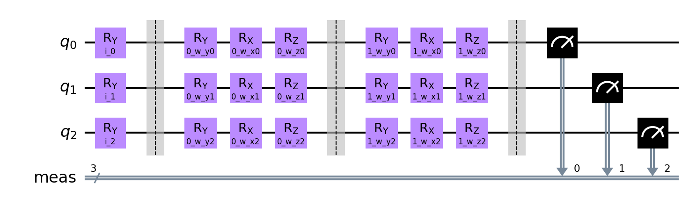
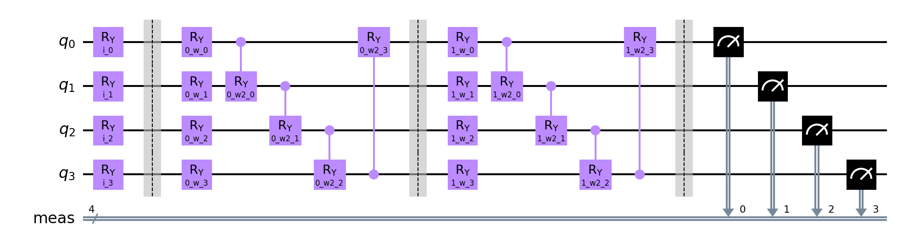
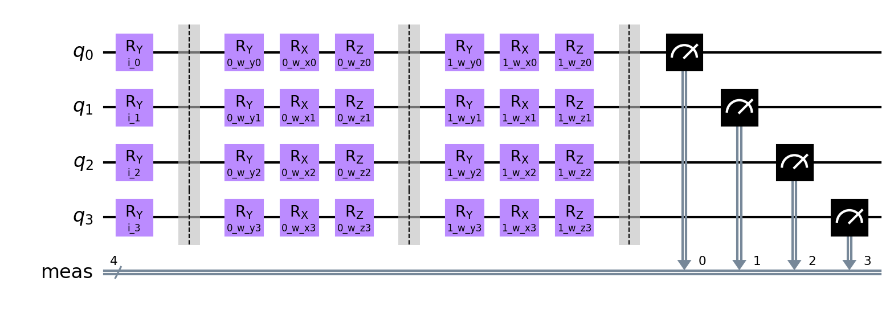

# Extended QNN Classifier run

**Settings:**
Used Optimizer for Neural Network Classifier: `BFGS`
Layer count: `2`

## Quantum Circuits
Quantum Circuits plots for each dataset
| dataset | circuit | plot |
| :-----: | :-----: | :--: |
| adhoc | qml_circuit_qiskit_01 |  |
| adhoc | qml_circuit_qiskit_02 |  |
| adhoc | qml_circuit_qiskit_03 |  |
| adhoc | qml_circuit_qiskit_04 |  |
| adhoc | qml_circuit_qiskit_05 |  |
| custom | qml_circuit_qiskit_01 |  |
| custom | qml_circuit_qiskit_02 |  |
| custom | qml_circuit_qiskit_03 |  |
| custom | qml_circuit_qiskit_04 |  |
| custom | qml_circuit_qiskit_05 |  |
| iris | qml_circuit_qiskit_01 |  |
| iris | qml_circuit_qiskit_02 |  |
| iris | qml_circuit_qiskit_03 |  |
| iris | qml_circuit_qiskit_04 |  |
| iris | qml_circuit_qiskit_05 |  |
| rain | qml_circuit_qiskit_01 |  |
| rain | qml_circuit_qiskit_02 |  |
| rain | qml_circuit_qiskit_03 |  |
| rain | qml_circuit_qiskit_04 |  |
| rain | qml_circuit_qiskit_05 |  |
| vlds | qml_circuit_qiskit_01 |  |
| vlds | qml_circuit_qiskit_02 |  |
| vlds | qml_circuit_qiskit_03 |  |
| vlds | qml_circuit_qiskit_04 |  |
| vlds | qml_circuit_qiskit_05 |  |

## adhoc
#### Average
| circuit | ø score train | ø score test | ø weights |
| ------: | :-----------: | :----------: | :-------: |
| circuit-00 | `0.5037499999999999` | `0.502` | `[-0.10877806,0.08090891,0.18063984,-0.23837234,-0.06099988,-0.16045482,-0.02920314,0.08418643,0.04315957,-0.02881694,0.21561386,0.02468928]` |
| circuit-01 | `0.500625` | `0.497` | `[0.08590742,0.21249224,0.08469451,-0.08981221,0.02192327,-0.10466472,-0.16527575,-0.06668757,0.14361503,-0.17671155,0.08002559,-0.02911471]` |
| circuit-02 | `0.5250000000000001` | `0.5085` | `[-0.20748018,0.29028694,-0.2082725,-0.13456059,0.27968289,-0.19778061]` |
| circuit-03 | `0.49949999999999994` | `0.499` | `[-0.06324668,0.01522653,0.06737478,0.07435709,0.26258716,0.30499546,0.60241868,0.54422247,0.73649524,0.18836259,0.18182923,0.29570582,-0.03991798,-0.04495885,-0.10951982,0.43221303,0.43080579,0.50849163]` |
| circuit-04 | `0.513625` | `0.5090000000000001` | `[1.19950901,0.61967434,0.02689373,0.96713123,1.01799695,0.11725504,0.68612074,0.51307298,0.36570229,0.51567299,0.14409373,-0.05782139,0.77828976,0.00507874,0.16236044,0.34997907,0.33615371,0.51590167]` |

#### Per run data
| dataset name and run | circuit-00: score (train, test) and weights  | circuit-01: score (train, test) and weights  | circuit-02: score (train, test) and weights  | circuit-03: score (train, test) and weights  | circuit-04: score (train, test) and weights  |
| :----------: | :--------: | :--------: | :--------: | :--------: | :--------: |
| `adhoc_30` | `[0.50125,0.515]`, `[-0.00467844,0.10893792,0.28846818,-0.03700311,0.21788208,-0.18841933,-0.15569837,0.06756622,-0.13245274,-0.18159319,-0.06173384,0.07035619]` | `[0.49625,0.505]`, `[0.13794278,-0.09565693,0.65850899,-0.05315499,0.00501068,-0.02776646,-0.25509996,0.16036413,-0.30878907,-0.24299338,0.1364945,0.00176926]` | `[0.515,0.535]`, `[-0.39153855,0.25479226,-0.12824853,-0.33689173,0.21161785,-0.0747663]` | `[0.5,0.5]`, `[-0.52378405,0.112831,0.07832901,0.27542864,-0.19734041,0.22010129,0.90895654,0.48332398,0.09254781,0.64375927,-0.22860215,-0.05199,0.15382648,0.19626532,-0.23281149,0.34681905,0.18341851,0.53679005]` | `[0.5025,0.51]`, `[1.60717984,0.2574528,0.01881268,0.85558919,1.25212586,-0.02502999,0.5514287,-0.12144633,-0.44314178,1.2252342,0.02002381,0.03533916,0.58685498,0.02174028,-0.00165797,0.05948582,0.37151082,0.78817942]` |
| `adhoc_31` | `[0.50125,0.49]`, `[0.04768148,-0.0987502,0.34586234,-0.15610876,-0.17164871,-0.25548157,-0.20104568,0.33056397,-0.27474959,0.00082245,0.33736558,0.01650815]` | `[0.505,0.49]`, `[0.15875949,0.42202552,-0.05581586,0.06561754,0.05480666,-0.3045922,-0.24819581,-0.22570668,0.20591323,-0.23353854,0.077632,0.09558298]` | `[0.52625,0.51]`, `[-0.18103586,0.24801036,-0.33433372,-0.13559113,0.25339266,-0.32570324]` | `[0.50375,0.485]`, `[-0.1495521,-0.2273756,0.29670855,-0.08879087,0.31386196,1.12286914,0.40610217,0.67487836,1.67064682,0.14051322,0.32198355,1.21940099,0.06155459,-0.04826826,-0.04379963,0.71230629,0.17779392,0.43793236]` | `[0.51,0.485]`, `[0.73495176,0.65032703,-0.02967575,1.55534288,1.13995967,-0.10083154,0.30258331,0.98050042,0.79858883,0.48072903,-0.01073917,-0.00832293,1.17491226,0.01096793,-0.03589717,0.94420102,0.49339016,0.73088584]` |
| `adhoc_32` | `[0.495,0.51]`, `[-0.35228908,0.11964806,0.22293923,-0.03203255,-0.11080468,-0.23841155,0.26088784,0.07279137,-0.06171942,-0.16921268,0.19394764,0.09698894]` | `[0.495,0.505]`, `[0.17306816,0.07531962,0.06327028,-0.01907911,0.27888152,-0.36267486,-0.2744219,0.16298028,0.09892984,-0.204597,-0.13854473,0.1712351]` | `[0.5275,0.53]`, `[-0.16831115,0.20058145,-0.39560006,-0.09548062,0.17836137,-0.37252034]` | `[0.49625,0.51]`, `[0.01861598,0.25395659,0.03006106,0.21790081,0.29550713,-0.00233165,0.95566105,0.08220221,0.06667564,0.26553944,-0.2237453,-0.02705597,-0.21447833,-0.26656059,-0.08274165,0.37598614,0.82820946,0.9474494]` | `[0.5075,0.525]`, `[0.56699972,1.05901997,-0.14370664,1.56515818,1.4430957,0.00738839,0.4389888,0.11441419,0.6387702,0.34341044,0.00224954,-0.15663743,1.49655602,0.0102211,-0.01767979,0.39261963,0.2826919,0.26283394]` |
| `adhoc_33` | `[0.50125,0.51]`, `[-0.16277145,0.18954597,0.02386482,-0.26076329,-0.06845891,0.0868081,-0.00140619,-0.02332526,0.20002831,-0.02579375,0.23492343,-0.22908946]` | `[0.5,0.505]`, `[0.13904991,0.08383235,0.00727388,-0.23491464,0.07497046,0.1206072,-0.26156092,0.14182712,0.23666747,-0.0385821,0.07249082,-0.30504542]` | `[0.515,0.505]`, `[-0.28343943,0.18772902,-0.22806053,-0.24215906,0.16579022,-0.18713391]` | `[0.495,0.515]`, `[0.10924521,-0.04309568,-0.20097926,0.14821042,0.4042888,0.72478145,0.32887299,0.49269396,1.35745308,-0.01009039,0.18357402,0.82725397,-0.32208882,-0.27740903,-0.03117,0.45131452,0.22639564,0.67326737]` | `[0.54625,0.5]`, `[2.00655533e+00,-7.26522979e-03,7.82648235e-03,-1.28502576e+00,-1.72291140e-01,1.13011881e-03,7.64195090e-01,3.07018947e-01,4.68661611e-01,-5.84928568e-02,2.12762289e-03,3.53789901e-03,-1.52883789e-01,-8.47052318e-04,3.94659362e-03,4.13547390e-02,3.40666516e-01,7.89772874e-01]` |
| `adhoc_34` | `[0.5075,0.485]`, `[0.24911468,-0.08398213,0.45609129,-0.14406539,-0.27396329,-0.12472246,-0.3854338,0.26779608,-0.21223932,-0.12853713,0.45810263,-0.06817299]` | `[0.50375,0.475]`, `[-0.05298168,0.44852865,0.16186216,0.0619084,0.04321743,-0.16240403,0.00761976,-0.30707216,0.15992765,-0.33160518,0.06145205,0.05692582]` | `[0.5375,0.47]`, `[-0.31617134,0.19237768,-0.18331099,-0.28036434,0.19503543,-0.17814868]` | `[0.50625,0.47]`, `[0.11910832,-0.11228283,0.16369383,-0.00659805,0.0971085,0.48155739,0.65985542,0.28766027,0.96888151,-0.06606758,0.15718846,0.35548987,-0.25601565,0.03365665,-0.41834849,0.1766306,0.53731501,0.1200962]` | `[0.515,0.52]`, `[1.20102774,-0.01808477,0.01510096,0.24414547,0.25834491,-0.07124068,0.50655497,0.56715034,0.81571258,0.18311121,-0.04894575,0.06126173,0.12207753,-0.00340944,0.01612272,0.04012254,0.02483508,0.56403315]` |
| `adhoc_35` | `[0.51375,0.515]`, `[-0.09036957,0.36520811,0.23494167,-0.42635724,0.0906524,-0.11780418,0.02135239,-0.23786084,0.33658614,-0.10000176,-0.05779378,0.03945693]` | `[0.49625,0.5]`, `[-0.1163127,0.53141392,0.02815794,-0.06887717,0.01931469,-0.37487053,0.0250108,-0.4716335,0.25575511,-0.2746007,0.01029252,0.23935735]` | `[0.5325,0.5]`, `[-0.57875365,0.09057087,-0.01741841,-0.52968468,0.06666542,-0.05223228]` | `[0.49875,0.5]`, `[0.17879063,-0.18837258,-0.41852922,-0.14210539,0.38192531,0.41398862,0.0457841,0.90677012,1.16903958,-0.2079134,0.38814332,0.60412278,-0.07166335,-0.10745145,0.23526879,0.12608972,0.43314104,0.53740339]` | `[0.505,0.545]`, `[0.76723692,1.82757115,0.46119638,1.51145879,1.4401381,0.00839699,0.69829498,0.4367755,-0.09164764,1.33776881,-0.01726824,0.46476175,1.61389319,0.00246734,0.01511495,0.21603041,0.45958991,0.25382214]` |
| `adhoc_36` | `[0.495,0.515]`, `[-0.03120696,0.04286431,0.09666462,-0.31525575,-0.03703084,0.06949866,-0.16136726,-0.01524909,0.06619119,0.12895143,0.22428628,-0.04338887]` | `[0.49875,0.515]`, `[-0.01138465,0.36002186,0.03402444,0.05463159,-0.12911004,-0.31213203,-0.05238947,-0.3805265,0.20104617,-0.3476284,0.20315625,0.33901702]` | `[0.51875,0.55]`, `[-0.37336153,0.29211136,-0.12508506,-0.20210956,0.25441093,-0.14432376]` | `[0.49625,0.515]`, `[-0.16230161,0.08223786,-0.01971387,0.71706785,0.7744954,0.18807107,1.59273271,1.24177171,0.19475585,0.80125989,0.62050877,0.04836066,0.17955921,-0.32863574,-0.14579556,0.40913576,0.52741562,0.63075515]` | `[0.50875,0.505]`, `[1.02976241,0.43251158,-0.08521815,1.61102246,1.14489874,-0.05257849,0.54379529,1.04317176,0.08978209,0.64352258,0.01525026,-0.0616598,1.05719503,0.02056613,-0.0170033,0.11745688,0.49026393,0.66348028]` |
| `adhoc_37` | `[0.50375,0.505]`, `[-0.34061859,0.10658837,-0.0078064,-0.44456971,-0.19274164,-0.4441875,0.22498488,0.12725514,0.22951471,0.14475932,0.35295953,0.26084511]` | `[0.5075,0.505]`, `[-0.00670005,0.16840648,0.13415986,-0.01059338,0.0562525,0.08775304,-0.1950964,0.04741286,0.12208105,-0.30264373,0.09311874,-0.29918061]` | `[0.5025,0.505]`, `[0.72179821,0.86656548,-0.03000266,0.76869176,0.85837667,-0.03434594]` | `[0.495,0.515]`, `[-0.08262946,-0.03153817,0.2772957,-0.21543874,0.88473001,0.19601245,0.10604951,1.36445462,1.14905623,0.07710408,0.78930671,0.16438193,0.04519081,-0.1762907,-0.37553934,0.34349889,0.4147005,0.11702643]` | `[0.50125,0.49]`, `[1.5092039,0.09138472,-0.02189099,0.78340228,0.75104777,-0.10133855,0.75265888,1.00416667,0.69912751,0.48578911,0.00821442,-0.01887823,0.55484105,0.02420339,-0.01461674,0.90307712,0.24206005,0.45106757]` |
| `adhoc_38` | `[0.51,0.47]`, `[-0.13848822,0.04857941,0.08692058,-0.23109265,-0.06058054,-0.25024147,0.01917928,0.08264785,0.08343308,0.00212211,0.2340671,0.12200568]` | `[0.50625,0.47]`, `[0.1408856,0.1648498,-0.04456227,-0.4345382,-0.03191941,0.2069679,-0.18701367,-0.06289513,0.24641257,0.1455474,0.09214952,-0.29589978]` | `[0.52875,0.465]`, `[-0.18265081,0.17594972,-0.23480732,-0.1189157,0.17070113,-0.19116119]` | `[0.50625,0.475]`, `[-0.08339424,0.13674697,0.32891001,-0.26878655,-0.407944,0.04798441,0.3247827,-0.19407853,0.88320715,0.03735956,-0.01637031,-0.1088627,0.18363656,0.51150012,-0.29601185,0.41282222,0.0325198,0.88387834]` | `[0.50625,0.525]`, `[1.16935364,0.14307386,0.0165662,1.50677061,1.28382907,-0.05695557,0.96493491,0.61575465,0.55527665,0.49788462,-0.00391717,0.01666223,1.23351491,-0.00354353,0.01729762,0.6539014,0.6201125,0.57485572]` |
| `adhoc_39` | `[0.50875,0.505]`, `[-0.2641545,0.0104493,0.05845204,-0.33647498,-0.00330469,-0.14158692,0.08651547,0.1696789,0.19700338,0.04031378,0.24001398,-0.01861691]` | `[0.4975,0.5]`, `[0.29674735,-0.03381887,-0.1399343,-0.25912215,-0.15219178,0.08246481,-0.21160988,0.2683739,0.21820632,0.06352612,0.19201419,-0.2949088]` | `[0.54625,0.515]`, `[-0.32133774,0.3941812,-0.40585778,-0.17310081,0.44247727,-0.41747046]` | `[0.4975,0.505]`, `[-0.05656544,0.16915779,0.13797198,0.10668278,0.07923892,-0.34307961,0.69538961,0.10254801,-0.1873113,0.20216185,-0.17369481,-0.0740433,-0.15870132,0.0136052,0.29575106,0.96752705,0.94714845,0.20031766]` | `[0.53375,0.485]`, `[1.40281883,1.76075229,0.02992617,1.3234482,1.63882085,1.56360975,1.33777248,0.1832237,0.12589289,0.01777279,1.47394201,-0.9142783,0.09593638,-0.03157876,1.65797747,0.1315411,0.03641624,0.08008581]` |

## custom
#### Average
| circuit | ø score train | ø score test | ø weights |
| ------: | :-----------: | :----------: | :-------: |
| circuit-00 | `0.5130000000000001` | `0.496` | `[-0.2451083,0.5131579,-0.46209948,0.26292133,0.05723354,0.48362082,-0.47751633,0.3604646]` |
| circuit-01 | `0.508625` | `0.481` | `[-0.25337821,0.38679363,-0.29680821,0.20017117,-0.31392643,0.46239217,-0.62567614,0.46000604]` |
| circuit-02 | `0.5012500000000001` | `0.4875` | `[-0.26272855,0.18442919,0.06384225,-0.08483527]` |
| circuit-03 | `0.5026250000000001` | `0.48950000000000005` | `[-0.09658033,-0.22259139,0.17424538,0.38879745,0.82812732,0.74646436,0.30070859,0.42058451,-0.05334608,-0.04600634,0.62855817,0.54195023]` |
| circuit-04 | `0.5173749999999999` | `0.5035000000000001` | `[0.57603239,1.54566602,0.42888705,1.23748761,0.33708195,0.72637049,-0.28539936,0.2129029,0.3184167,-0.02406845,0.47681671,0.45881948]` |

#### Per run data
| dataset name and run | circuit-00: score (train, test) and weights  | circuit-01: score (train, test) and weights  | circuit-02: score (train, test) and weights  | circuit-03: score (train, test) and weights  | circuit-04: score (train, test) and weights  |
| :----------: | :--------: | :--------: | :--------: | :--------: | :--------: |
| `custom_10` | `[0.4975,0.47]`, `[-0.80991927,0.44663882,-0.35068873,0.70404886,0.02312129,0.70820031,-0.85850915,0.31554829]` | `[0.48,0.46]`, `[-0.55372815,0.87327749,-0.74742104,0.27754192,-0.20610482,0.54722868,-0.7025542,0.58863122]` | `[0.4975,0.51]`, `[-0.2837227,0.24657575,0.04721273,-0.14574072]` | `[0.49875,0.505]`, `[0.18225332,-0.3803883,-0.11354711,0.51996313,0.00179955,1.11681881,-0.18969925,0.53915589,-0.00767528,0.14193295,0.88671575,0.72435926]` | `[0.50625,0.485]`, `[-0.09765015,0.49944443,1.82358816,1.39934709,-0.14398152,1.15625655,0.24229286,0.22386376,1.67574773,-0.18209899,1.01216446,0.3813864]` |
| `custom_11` | `[0.54,0.515]`, `[-0.42105551,0.69858257,-0.7950458,0.36736972,-0.05092118,0.68466043,-0.69956862,0.299906]` | `[0.5,0.505]`, `[-0.34826477,0.89569772,-0.55642919,0.25821048,-0.43856456,0.29842263,-0.74718947,0.6505999]` | `[0.49625,0.51]`, `[-0.49943745,0.16935187,0.2678845,-0.06706678]` | `[0.49625,0.515]`, `[-0.24470332,-0.19850547,0.13595952,0.59658381,0.71750808,1.03415306,0.38210056,0.49171037,-0.08446264,-0.11623712,0.78024702,0.35981836]` | `[0.49125,0.505]`, `[-1.07997451,1.34286007,1.11079265,2.91126058,-0.88468327,0.9368134,1.34096599,-1.50825307,0.12375257,0.61683528,0.80302036,0.1365622]` |
| `custom_12` | `[0.4975,0.505]`, `[1.05716387,1.16146731,-1.11906818,0.57733734,1.05622413,1.3179028,-0.26016957,0.78493783]` | `[0.55375,0.535]`, `[-0.38504194,0.28468596,-0.23195013,-0.07552733,-0.27532117,0.97145239,-1.09443134,0.80431347]` | `[0.49125,0.515]`, `[-0.39758864,0.19308161,0.13012634,-0.04984331]` | `[0.4975,0.51]`, `[-0.04498655,-0.08978327,0.37502888,0.13065095,1.36745132,0.79030342,0.57775739,0.13031375,-0.090883,-0.05825617,0.75455508,0.52938727]` | `[0.54,0.535]`, `[1.70634334,1.3509335,0.17523194,0.81700824,0.79469854,1.53692081,-1.75780133,1.27719657,0.20912635,0.15556679,0.36523959,0.48947603]` |
| `custom_13` | `[0.55125,0.525]`, `[-0.58282155,0.47875083,-0.96392689,-0.0701078,0.01699089,0.92916345,-0.44421655,0.76865501]` | `[0.5375,0.505]`, `[-0.30224681,0.65850841,-0.21897195,0.38120997,-0.3530166,0.56827961,-1.06824734,0.48960426]` | `[0.49375,0.48]`, `[-0.29086476,0.16410841,0.0196071,-0.00512715]` | `[0.49875,0.505]`, `[0.15928405,0.04284743,0.17419865,0.73857992,0.83185619,1.2505509,0.14816172,0.6486895,-0.34578683,-0.30320014,0.1421763,0.2069086]` | `[0.5275,0.5]`, `[1.20818935,2.26249338,-0.78684221,0.72563948,1.01297928,1.22404757,-1.02155333,1.17996276,0.13575533,-0.87878334,0.37817801,0.26413951]` |
| `custom_14` | `[0.49875,0.47]`, `[0.03750577,0.61052063,0.10225523,0.24171159,-0.46169605,-0.04823506,-0.70402928,0.24221199]` | `[0.485,0.475]`, `[-0.22586794,0.36174623,-0.50679145,0.53749046,0.0930458,0.1135173,-0.00498617,-0.25898608]` | `[0.50375,0.485]`, `[0.26022074,-0.11621962,-0.40237368,0.1690975]` | `[0.50375,0.485]`, `[-0.01089991,-0.13226062,0.20334564,0.35178363,0.686763,0.49694099,0.16451057,0.26998076,-0.26734765,-0.22920388,0.79005127,0.35585969]` | `[0.5075,0.51]`, `[-0.10068209,1.38013239,0.5473592,1.48328706,0.06940616,0.37076864,-0.06644147,-0.03544007,0.28035213,-0.3534323,0.23741078,0.22392416]` |
| `custom_15` | `[0.5175,0.43]`, `[-0.4140082,0.34426057,-0.05300468,-0.06916813,0.5883648,-0.43328152,0.07693923,-0.08112875]` | `[0.5075,0.415]`, `[0.32549783,-0.03390262,-0.10108559,-0.13472726,-0.44660711,0.30042932,-0.23015125,0.30177859]` | `[0.51625,0.43]`, `[-0.03779445,0.01755551,-0.17623588,0.08989895]` | `[0.5175,0.43]`, `[-0.3416163,-0.3442315,0.44659014,0.15766964,1.27834158,0.27964584,0.65872427,0.38612421,0.11124609,0.00905471,0.19392144,0.3559091]` | `[0.52625,0.455]`, `[0.25124343,1.01476265,-0.0336653,0.39695247,-0.36147411,0.06536409,0.36089464,0.0680978,0.50115331,0.46446108,0.03484685,0.19487343]` |
| `custom_16` | `[0.4975,0.505]`, `[-0.41903351,0.48891617,-0.75998953,0.17235899,0.26665927,0.21108757,0.08794687,0.01857151]` | `[0.49375,0.455]`, `[0.24712708,-0.1178561,-0.28951926,-0.13087876,-0.38673237,0.59841841,-0.24267621,0.34769056]` | `[0.51,0.46]`, `[-0.31680104,0.34103489,0.21671145,-0.32083174]` | `[0.51,0.46]`, `[-0.22306239,-0.70262862,0.69280535,0.21153617,1.38009237,0.62961137,0.8406595,0.6855285,0.0127019,0.26849097,0.53850299,0.09384189]` | `[0.51,0.46]`, `[0.57241568,1.47647464,1.39949244,3.28421025,0.4566911,0.0686538,1.47040901,-0.80189661,0.03091504,1.57095454,0.37892506,0.91149446]` |
| `custom_17` | `[0.48375,0.525]`, `[-0.63914244,0.77924935,-0.63757905,0.30758403,-0.22305745,0.46778466,-0.69361295,0.59812858]` | `[0.5125,0.48]`, `[-0.8428005,0.87117315,-0.21715551,0.62355156,-0.48128075,0.52901832,-1.24948529,0.71554598]` | `[0.49375,0.525]`, `[-0.30182622,0.1731863,0.093595,-0.07102579]` | `[0.49375,0.525]`, `[0.09141497,-0.21979954,0.23608025,0.24070365,0.58588813,0.36342374,0.14485474,0.28186781,-0.39017232,-0.14056828,0.62876466,0.96281972]` | `[0.555,0.58]`, `[1.55106066,1.23574958,0.59315241,0.68635426,0.8589475,1.08056338,-1.81005369,1.37672194,0.16152071,-0.25158786,0.55612662,0.72301435]` |
| `custom_18` | `[0.51125,0.5]`, `[0.02070873,-0.04820873,-0.18722923,-0.2928403,-0.24382498,0.66087443,-0.52770001,0.64867922]` | `[0.49625,0.465]`, `[-0.24231069,0.22580007,-0.36475496,0.24765407,-0.18161747,0.29534992,-0.22433345,0.20870242]` | `[0.5075,0.47]`, `[-0.48848612,0.16599806,0.32026837,-0.09135156]` | `[0.5075,0.47]`, `[-0.42622906,-0.00846149,-0.06258544,0.12165288,0.79683456,0.06927277,0.35550098,0.02372957,0.24979732,-0.10281163,0.59221049,0.84300883]` | `[0.5125,0.495]`, `[1.57788101,1.67680009,-0.17420922,0.4186457,1.20483416,0.16721552,-1.50886068,0.7481276,0.15642804,-1.39661934,0.95469132,0.49191343]` |
| `custom_19` | `[0.535,0.515]`, `[-0.28048089,0.17140149,0.14328204,0.69091894,-0.39952526,0.33805116,-0.75224331,0.00913629]` | `[0.52,0.515]`, `[-0.20614626,-0.15119396,0.26599701,0.01718661,-0.46306524,0.4018051,-0.69270664,0.75218003]` | `[0.5025,0.49]`, `[-0.2709849,0.48961909,0.12162652,-0.35636214]` | `[0.5025,0.49]`, `[-0.1072581,-0.19270253,-0.3454221,0.81885072,0.63473838,1.43392275,-0.07548459,0.7487447,0.27912163,0.07073513,0.97843671,0.9875896]` | `[0.4975,0.51]`, `[0.17149718,3.2170095,-0.36602954,0.25217098,0.36340164,0.65710108,-0.10384558,-0.39935166,-0.0905842,0.01401962,0.04756407,0.77141087]` |

## iris
#### Average
| circuit | ø score train | ø score test | ø weights |
| ------: | :-----------: | :----------: | :-------: |
| circuit-00 | `0.8133333333333335` | `0.7933333333333334` | `[0.09911226,-0.34655293,-0.69820584,-0.65180273,0.397169,-0.23318369,0.94449547,0.65312932,0.10458469,-0.98151689,-0.29229965,-0.45769628,0.38624005,-0.00727231,0.8813471,0.78273729]` |
| circuit-01 | `0.7908333333333333` | `0.7833333333333332` | `[0.09129801,-0.39130374,-0.50144351,-0.74750304,0.50004869,-0.10644734,0.97173246,0.72782528,0.1744106,-0.79285115,-0.37058272,-0.39594072,0.33669164,-0.11986346,0.69354358,0.79597782]` |
| circuit-02 | `0.7091666666666666` | `0.6966666666666667` | `[0.46468683,-0.16968217,1.44682539,0.48059755,0.25197569,-0.09194718,0.57441297,0.62732426]` |
| circuit-03 | `0.8574999999999999` | `0.8633333333333335` | `[0.02311918,0.00162449,0.05804299,0.08587997,0.44018802,0.4247011,0.82068616,0.75307343,0.35821501,0.87721987,0.18599873,0.43970908,0.13733702,0.37789786,-0.06653082,-0.23320923,0.1847021,-0.14795133,0.64344412,0.60709677,0.58459935,0.48936621,0.54767155,0.44845282]` |
| circuit-04 | `0.7316666666666667` | `0.7566666666666667` | `[]` |

#### Per run data
| dataset name and run | circuit-00: score (train, test) and weights  | circuit-01: score (train, test) and weights  | circuit-02: score (train, test) and weights  | circuit-03: score (train, test) and weights  | circuit-04: score (train, test) and weights  |
| :----------: | :--------: | :--------: | :--------: | :--------: | :--------: |
| `iris_20` | `[0.775,0.7]`, `[0.05944499,-0.61194121,-0.94627448,-0.58242779,0.39446272,-0.17652175,1.11147254,0.86154957,0.09100071,-1.01259873,-0.16091301,-0.27424745,0.34298258,-0.161069,0.8117662,0.45567111]` | `[0.7666666666666667,0.6666666666666666]`, `[0.08132381,-0.33112928,-0.68842785,-0.71464603,0.53196687,0.08760374,0.6884834,0.68717431,0.09067409,-0.8053619,-0.66528526,-0.35495013,0.26544213,-0.24516353,1.04114044,0.87171622]` | `[0.7333333333333333,0.6333333333333333]`, `[0.50550545,-0.10748191,1.6919998,0.27816757,0.11100026,-0.07837167,0.43497534,0.73164671]` | `[0.95,0.9666666666666667]`, `[0.22570268,0.39373317,0.21044244,0.295288,0.10457663,0.59157478,1.05120622,1.04121547,0.39218911,0.94822082,-0.19545515,0.74122332,-0.28537614,0.20837295,-0.15347311,-0.58770457,0.09583234,-0.65200234,0.56310227,0.12168861,0.89017455,0.73883315,0.53874533,0.43689517]` | `[0.8,0.9]`, `[0.05733975,1.04739408,2.203076,0.19329493,0.72034665,-0.86530192,0.83945666,1.40359846,0.56105784,0.87337092,1.11514034,0.55075499,-0.09475539,0.86596356,1.01729052,0.1358492,0.04747434,0.46076933,-0.07259315,0.03283566,0.36936315,0.72526758,0.72689192,0.88413079]` |
| `iris_21` | `[0.825,0.8333333333333334]`, `[-0.06680987,-0.71292008,-0.64051143,-1.00105139,0.25441962,-0.03785902,0.84229972,0.73648101,0.07253286,-0.3693329,-0.40716142,-0.35007684,0.56042272,-0.03994743,0.88874155,0.85311726]` | `[0.8583333333333333,0.8666666666666667]`, `[0.18122606,-0.25936503,-0.58883885,-0.75550279,0.51230055,-0.42647861,0.95026154,0.73863427,0.04276383,-1.13932359,-0.27441709,-0.40862058,0.31447284,0.1731781,0.99684877,0.62875247]` | `[0.7083333333333334,0.7666666666666667]`, `[0.5655791,-0.13566283,1.77264619,0.22944147,0.09673222,-0.03909702,0.45403311,0.7039864]` | `[0.5833333333333334,0.5333333333333333]`, `[5.21616224e-01,4.16753446e-01,1.24018302e-03,2.04537467e-01,9.77731806e-01,1.19164405e+00,8.09590771e-01,-4.76941384e-02,-4.28130999e-01,1.71633822e+00,9.67675778e-01,9.21810992e-02,3.28395826e-01,1.24661045e+00,1.54518202e-01,-1.87036907e-01,1.45051316e+00,7.40263164e-02,-1.14139028e-01,8.23061529e-01,5.12437588e-01,1.19052009e-01,2.71173127e-01,8.35753051e-01]` | `[0.7333333333333333,0.7333333333333333]`, `[0.02952677,1.52863086,0.01848967,-0.04280296,0.55235427,0.52849244,1.59263824,2.14639691,0.84150488,1.53614016,0.96162253,0.73146527,0.01226557,1.58268022,-0.02158634,-0.0158659,-0.07545548,1.63359323,0.03226955,-0.0380753,0.91908768,-0.00862959,0.08736616,0.79307095]` |
| `iris_22` | `[0.7833333333333333,0.7666666666666667]`, `[0.13372756,-0.36281243,-0.81994615,-0.69987522,0.39246284,-0.04388937,1.10509735,0.7818448,0.11200158,-1.05531489,-0.17013872,-0.41029078,0.37457146,-0.1847825,0.75859958,0.60043942]` | `[0.7916666666666666,0.7666666666666667]`, `[0.00703581,-0.83523581,-0.71882776,-0.70958253,0.60247825,-0.18369877,1.06004258,0.76031041,0.18942672,-0.61670069,-0.31124973,-0.4080763,0.22221983,-0.07883901,0.75340023,0.67628928]` | `[0.7,0.6333333333333333]`, `[0.41011832,-0.22166989,1.04417963,0.78969669,0.35994502,-0.16576995,0.88441367,0.32493359]` | `[0.8416666666666667,0.8666666666666667]`, `[-0.06435448,0.11564458,0.26876389,0.11054085,-0.02148063,0.1546024,1.06588877,1.07027294,0.10111153,0.62243703,0.35316538,1.16658521,0.01518252,-0.01779757,-0.42232642,0.072638,0.43242855,-0.1785023,0.99834827,-0.13977777,0.29410398,0.95936996,0.24789232,0.33334896]` | `[0.8333333333333334,0.8333333333333334]`, `[0.00574204,0.1052788,1.55344708,0.67751438,0.61641562,1.53184583,1.62630951,2.01019085,0.63572433,0.12510396,1.43927773,0.56061535,0.01932617,1.45372105,-0.06450877,0.05025884,-0.09139622,1.61648734,-0.01597114,-0.02766957,0.19452652,0.37090588,0.58588072,-0.00429749]` |
| `iris_23` | `[0.8416666666666667,0.8333333333333334]`, `[0.19112383,-0.18174117,-0.54170094,-0.67590235,0.53026402,-0.53908113,0.95842749,0.78351095,-0.03098734,-1.14885363,-0.3888876,-0.32483914,0.20078837,0.27143601,0.84347926,0.71282915]` | `[0.75,0.7666666666666667]`, `[0.07088121,-0.39195401,-0.54175507,-0.64145382,0.27887813,-0.32309949,0.60990987,0.52673157,0.06328641,-0.17352947,-0.75969525,-0.56725995,0.60123084,0.17794633,1.04137217,1.06859048]` | `[0.7166666666666667,0.7333333333333333]`, `[0.5090955,-0.13824966,1.74469128,0.24011372,0.15907028,-0.10065909,0.44593587,0.74416378]` | `[0.9083333333333333,0.8666666666666667]`, `[-0.04372491,-0.33717922,-0.08394371,0.09485778,0.310775,0.11401784,0.41730918,1.01910986,0.89677566,0.31427329,0.59979234,0.21224723,-0.00286829,0.37107905,-0.41478545,-0.22309441,0.03956494,-0.0192641,0.68913134,0.7866811,0.65945877,0.60708403,0.35096505,0.32937747]` | `[0.675,0.6333333333333333]`, `[-0.01592638,0.69721133,-0.5015962,0.11826305,0.61284721,0.99812735,1.94651565,1.29366708,0.38980442,0.48526866,1.1068934,0.3865888,-0.07462137,0.37999243,-0.48621516,-0.11355141,0.02738005,1.1669643,0.07490718,-0.05499156,0.51781449,0.7905309,0.97528085,0.8935782]` |
| `iris_24` | `[0.8333333333333334,0.8]`, `[0.14638506,-0.58943679,-0.6506041,-0.53986131,0.20871165,-0.10007296,0.96463193,0.68001114,0.17657986,-1.24370944,-0.21196418,-0.47333841,0.50793525,-0.24347011,0.99524266,0.61178013]` | `[0.775,0.7666666666666667]`, `[0.05656436,-0.17512197,-0.72970077,-0.98051054,0.37682039,0.09348431,0.86367721,0.68409131,0.27924638,-1.0164458,-0.40572767,-0.36123231,0.39493369,-0.30785306,0.92303817,0.82014488]` | `[0.6916666666666667,0.6666666666666666]`, `[0.34265856,-0.18631773,1.23197758,0.65160996,0.42561705,-0.1969593,0.69970296,0.53608412]` | `[0.8833333333333333,0.9333333333333333]`, `[-0.18295287,-0.01558911,-0.05246251,0.23710009,0.1095402,0.45349041,0.76665698,1.1464473,0.10964044,0.8165389,0.0597311,0.62267276,0.18506414,0.28467438,0.02344441,-0.5598871,0.19143776,-0.2598453,0.42520129,0.55825726,0.489,0.390874,0.83746925,0.88959568]` | `[0.7333333333333333,0.7666666666666667]`, `[0.79667389,1.32671675,1.12020936,0.1074128,0.61267762,0.40080251,1.14006525,1.21033048,0.78053953,0.90233019,0.36621008,0.90521521,0.5864749,0.87117631,0.36750479,0.18036372,0.42223623,0.75176255,-0.13139245,-0.17246189,0.95927327,0.93331575,0.04348422,0.02974304]` |
| `iris_25` | `[0.8416666666666667,0.9333333333333333]`, `[0.09720091,-0.14258517,-0.32437601,-0.57580837,0.58556917,-0.541049,0.52079736,0.35170595,0.04522364,-1.08775061,-0.6134527,-0.60029693,0.27153155,0.34823277,1.25292275,1.23930591]` | `[0.7083333333333334,0.8]`, `[0.03542519,-0.11804276,0.9531409,-0.60760051,0.7579766,0.04468769,1.37474217,0.94186043,0.09779089,-0.56910882,0.2121895,-0.44511313,0.29704212,-0.25995394,-0.62809536,0.84283844]` | `[0.6833333333333333,0.8]`, `[0.4967994,-0.2286168,1.32390126,0.53986672,0.30355247,0.09654148,0.76218567,0.41519104]` | `[0.875,0.9666666666666667]`, `[0.20336505,0.31502545,-0.09351546,-0.14098625,0.28170519,0.01444461,0.82107559,0.74501895,-0.1486976,0.46454223,0.46320561,0.01037194,-0.21174833,-0.2747645,-0.05904198,0.02963013,0.13034464,-0.16201605,0.30291098,1.25329317,0.24366375,0.52221912,0.73809381,0.46965042]` | `[0.6583333333333333,0.8]`, `[-0.0140888,1.52047729,2.05336503,0.11415904,0.60201086,0.79497056,1.46794273,2.16234804,0.29903576,1.46360429,1.34041885,0.86624859,0.0078993,1.11038442,0.02147033,0.02507709,-0.05885697,1.63169607,-0.03035124,-0.02765211,0.94615999,0.88256193,0.39214913,0.5571076]` |
| `iris_26` | `[0.825,0.7666666666666667]`, `[0.15719036,-0.08324292,-0.67051992,-0.7835154,0.47697857,-0.31450307,0.92606797,0.77075223,0.07580286,-1.18889269,-0.34803648,-0.34034905,0.34012907,0.11762949,0.85297253,0.71132646]` | `[0.8083333333333333,0.7666666666666667]`, `[-0.04340818,-0.34063154,-0.69024171,-0.94671299,0.54588551,-0.11619066,0.94366138,0.81549166,0.36347956,-1.19003824,-0.27832661,-0.30756922,0.24925973,-0.20717927,0.78890347,0.6310367]` | `[0.725,0.6666666666666666]`, `[0.44514841,-0.12935241,1.46748821,0.46602775,0.21666349,-0.09693733,0.42866786,0.85095733]` | `[0.9416666666666667,0.9]`, `[-0.09383341,-0.47756545,0.04883358,0.35682673,0.94836717,0.21033238,0.46117859,0.72122788,1.11242916,0.99013913,-0.45799368,0.37434255,0.56809404,0.4307482,0.2787946,-0.50109914,-0.22013694,0.28111201,0.77426373,1.00837596,0.98687457,0.07887303,0.95380279,0.146709]` | `[0.6416666666666667,0.6]`, `[0.76932477,0.90876548,0.93137264,0.12662452,1.07955581,0.8680463,1.49288141,0.92934107,0.89831006,0.3883517,0.73697754,0.16430251,0.5241051,1.09180583,0.11035863,0.0191473,0.32435266,0.66107067,0.11246092,-0.0913797,0.35918255,0.81043536,0.83032382,0.16018801]` |
| `iris_27` | `[0.8583333333333333,0.9]`, `[0.0827601,-0.1602448,-0.90034657,-0.41962015,0.49095156,0.20872251,1.33792748,0.31023857,0.15611696,-1.10651844,0.19801791,-0.97885606,0.38444936,-0.38923347,0.57718774,0.98560868]` | `[0.8666666666666667,0.9333333333333333]`, `[-0.00420353,-0.374399,-0.48873756,-0.79846746,0.57439902,0.03146352,1.23638586,0.58019372,0.19449422,-0.92451115,-0.31165707,-0.54901889,0.26036608,-0.19344285,0.55824307,0.9824787]` | `[0.6916666666666667,0.7666666666666667]`, `[0.42167307,-0.17474015,1.45884416,0.51898524,0.28838403,-0.08033607,0.50664582,0.73964305]` | `[0.825,0.9]`, `[0.05473345,-0.21303284,0.28140458,-0.31547103,0.79991082,0.26901271,1.06581789,0.21514663,1.18642047,0.65870028,-0.26091947,0.02059542,0.36948533,0.33122223,0.11834931,0.2193222,-0.22190752,-0.09295472,1.17197356,0.74556082,0.3158529,0.16343835,0.96175003,0.21596642]` | `[0.7,0.7666666666666667]`, `[0.00757155,0.64376385,-0.43402895,0.04149159,0.88737344,-0.71223561,2.10183136,1.265191,0.68815775,0.46314389,1.12343011,0.88953113,0.01800291,0.6755673,-1.05372828,0.07452177,-0.05822426,-0.00944249,0.12805298,0.0030791,0.31558905,0.60330063,0.84086232,0.30464579]` |
| `iris_28` | `[0.775,0.7]`, `[0.10499558,-0.41502136,-0.72290525,-0.67836392,0.22270162,-0.28860013,0.72636629,0.58164117,0.1335649,-0.75764062,-0.5219832,-0.44582548,0.54555011,-0.00392541,0.99695118,0.9372128]` | `[0.8583333333333333,0.8666666666666667]`, `[0.07233868,-0.74388564,-0.48875083,-0.79522247,0.30456669,-0.13376495,1.19383212,0.62230035,0.18561373,-0.74755262,-0.37730916,-0.46017166,0.53982,-0.08410175,0.54781723,0.88199799]` | `[0.7083333333333334,0.6666666666666666]`, `[0.43556336,-0.21146829,1.19245916,0.70413892,0.38036246,-0.1644845,0.70448,0.43626409]` | `[0.8583333333333333,0.8333333333333334]`, `[-0.09755394,0.02531808,-0.01592561,-0.09603722,0.39940849,0.63518954,0.84563706,0.31417353,0.07307099,1.2232041,0.06471174,0.62409159,0.09822735,0.59218465,-0.07357546,-0.30165391,-0.0201844,-0.26911751,1.25005772,0.61517978,0.87981257,0.50481304,0.26530483,0.4217872]` | `[0.7916666666666666,0.8666666666666667]`, `[0.03034517,1.10506407,1.97052912,0.06618616,0.64662445,-0.37758749,0.96991741,1.42933493,0.62436984,1.01384063,0.81606167,0.17165538,-0.06648503,0.51545714,0.83847996,0.06246194,-0.03314492,0.76396871,-0.11361961,-0.09675182,0.51762858,0.20985552,0.43279317,0.09623282]` |
| `iris_29` | `[0.775,0.7]`, `[0.08510409,-0.20558338,-0.76487356,-0.56160137,0.4151682,-0.49898302,0.95186659,0.67355785,0.21401085,-0.84455696,-0.29847715,-0.37884267,0.33404,0.21240651,0.8356075,0.72008202]` | `[0.725,0.6333333333333333]`, `[0.45579673,-0.34327232,-1.03229562,-0.52533121,0.51521493,-0.13848012,0.79632849,0.92146478,0.23733012,-0.74593917,-0.53434888,-0.09739498,0.22212911,-0.17322565,0.91276756,0.55593303]` | `[0.7333333333333333,0.6333333333333333]`, `[0.51472717,-0.16326202,1.54006665,0.38792751,0.17842963,-0.09339832,0.42308937,0.79037245]` | `[0.9083333333333333,0.8666666666666667]`, `[-0.29180604,-0.20686315,0.01559257,0.11214327,0.49134556,0.61270227,0.90250054,1.30581588,0.28734131,1.01780467,0.26607367,0.53277971,0.30891373,0.60664875,-0.11721229,-0.29320658,-0.03087149,-0.20094934,0.37359108,0.29864725,0.57461478,0.80910539,0.311519,0.40544487]` | `[0.75,0.6666666666666666]`, `[7.17690434e-04,1.45478958e+00,9.43062298e-01,1.13849048e-01,5.82043408e-01,9.05611442e-01,1.58497349e+00,2.11515553e+00,8.10983141e-01,1.46624756e+00,9.87096234e-01,9.83611900e-01,3.57042252e-02,1.35964692e+00,-4.73598535e-02,-6.94501942e-03,-1.71082790e-02,1.64592719e+00,1.96762389e-02,6.03169802e-03,2.95938419e-01,1.56113733e-01,4.33095378e-01,9.83655710e-01]` |

## rain
#### Average
| circuit | ø score train | ø score test | ø weights |
| ------: | :-----------: | :----------: | :-------: |
| circuit-00 | `0.6657499999999998` | `0.6605` | `[0.08440057,0.07855162,0.09903995,0.06879452,-0.04286061,0.04753585,-0.09711563,-0.09016664,-0.03651718,-0.00514288,0.08276513,0.06690409,0.00777075,-0.04534897,-0.06107319,0.11388038,-0.0237627,-0.08879551,-0.03659569,-0.00085156]` |
| circuit-01 | `0.6647500000000001` | `0.6599999999999999` | `[]` |
| circuit-02 | `0.68825` | `0.6910000000000001` | `[0.12135056,-0.09349864,-0.12275481,-0.05513894,-0.01821265,0.24056508,-0.08418341,-0.04873158,-0.04204707,-0.04138637]` |
| circuit-03 | `0.658375` | `0.6565` | `[-0.03399904,-0.08229329,0.07147113,-0.04790152,-0.02126471,0.47037191,0.28026356,0.21321801,0.13255384,0.29823846,0.8763018,0.46119259,0.64415971,0.63471011,0.63391028,0.28532824,0.2356127,0.18797742,0.18019763,0.20952978,-0.1600646,-0.24942316,-0.15494539,-0.07597074,-0.21409541,0.64431126,0.66223305,0.51633116,0.51177567,0.56869751]` |
| circuit-04 | `0.30275` | `0.31399999999999995` | `[0.28822059,0.42842598,0.46620343,0.19174793,0.08195959,0.94497677,0.59237911,0.60115876,0.07407652,0.20733692,0.42131504,0.60869421,0.54910418,0.8322815,0.43347785,0.17543298,0.00431676,0.26206448,0.299073,0.27086809,0.55241064,0.01261388,-0.02053609,-0.02664589,-0.01877506,0.36130592,0.59134866,0.37631359,0.35375147,0.512781]` |

#### Per run data
| dataset name and run | circuit-00: score (train, test) and weights  | circuit-01: score (train, test) and weights  | circuit-02: score (train, test) and weights  | circuit-03: score (train, test) and weights  | circuit-04: score (train, test) and weights  |
| :----------: | :--------: | :--------: | :--------: | :--------: | :--------: |
| `rain_0` | `[0.66125,0.6]`, `[-0.03529745,0.48082366,-0.1128795,-0.01351185,0.32867367,-0.15308849,0.02765617,0.00651728,0.02695068,-0.05337622,0.24226572,-0.38911883,0.1499146,-0.04330859,-0.25809336,0.26580674,-0.12348039,-0.13245815,-0.08516693,0.07718022]` | `[0.6675,0.635]`, `[-0.00385058,-0.17753305,0.01122841,0.37836316,0.10210528,-0.39678247,-0.01174305,0.2206629,0.02239952,-0.13661597,0.16686073,0.34878958,0.10300843,-0.32824583,-0.20716783,0.56559909,-0.07639501,-0.39053767,-0.10302647,0.13268213]` | `[0.69,0.665]`, `[0.113833,-0.08609284,-0.10889581,-0.05235862,-0.01936758,0.24792549,-0.08064592,-0.03344305,-0.06192674,-0.02457847]` | `[0.66875,0.615]`, `[0.03472818,0.28123095,0.26008438,-0.30067879,-0.12693875,0.76122442,0.23670811,-0.04498763,0.06326533,0.13645215,1.00851975,1.04772742,0.55915349,0.47763068,0.85104195,0.50248628,0.07489009,-0.18645481,0.32358293,0.1802756,-0.38152109,-0.36421894,-0.19163063,0.02937945,0.01024608,0.51466939,0.77114943,0.93343187,0.35891273,0.49908448]` | `[0.33,0.32]`, `[3.60660397e-01,5.54653106e-01,1.18501712e-02,-1.81793452e-02,-8.38770123e-01,1.41528713e+00,1.57981209e+00,3.04715342e+00,-7.68720735e-02,-5.00127043e-01,3.70422896e-01,1.40115020e-01,8.46321784e-01,6.25121038e-01,-4.47102311e-01,7.47022094e-01,-2.46481725e-03,-5.96106103e-03,9.28785364e-03,2.16927408e+00,1.62609198e+00,6.12199038e-03,-6.66331419e-03,-6.63580821e-03,-2.23237234e-02,5.70328262e-01,2.95368209e-01,2.50320425e-01,1.04632806e-02,5.67928595e-01]` |
| `rain_1` | `[0.66375,0.685]`, `[0.04605218,0.09178628,0.03858712,0.22081116,0.03772009,-0.30886938,-0.23557809,-0.32944934,0.01111256,-0.03183352,0.09082503,0.06609993,0.11744504,-0.13609601,-0.25360011,0.49619596,0.07658924,0.16484786,-0.13816965,0.03283799]` | `[0.65375,0.68]`, `[-0.09198842,0.10927343,-0.23943357,-0.08732809,-0.02308994,0.02812566,0.02678967,-0.08427569,-0.23049545,-0.1567545,0.23599579,0.04087848,0.27764352,0.10683851,0.0581162,0.10065078,-0.12249239,-0.07501446,0.16396171,0.13683902]` | `[0.68625,0.715]`, `[0.1246122,-0.08615227,-0.12197107,-0.07872673,-0.02701618,0.21031549,-0.07920696,-0.03589944,-0.05951593,-0.03750393]` | `[0.65375,0.66]`, `[0.05540707,-0.30869785,0.04545979,-0.03351895,0.23917624,0.24044882,0.44469679,0.06657845,-0.24562856,0.59152682,1.03018941,0.42234758,0.46687318,0.31696843,0.58228846,0.05964351,0.43660347,0.04525271,-0.02713262,0.14534232,-0.08252504,-0.34606297,-0.19918322,0.1784917,-0.61819435,0.94080141,0.32803841,0.1507091,0.4930751,0.81058471]` | `[0.37375,0.385]`, `[0.14444034,-0.00916692,0.00492562,0.00121921,0.00615206,0.72463507,-0.06900117,-0.02188235,0.0866209,0.00390007,0.20099546,0.06280579,0.53683467,1.04930438,0.76952915,0.00627068,0.00203015,-0.00619555,0.00395968,-0.00760586,-0.04792467,0.00480817,-0.0331762,-0.01306459,-0.0059507,0.43149526,0.8513573,0.29782868,0.34216883,0.63947513]` |
| `rain_2` | `[0.67125,0.655]`, `[-0.02093307,-0.25134915,0.30312611,0.21579053,-0.18485649,0.0130356,-0.22137212,-0.08703475,-0.09076119,0.03745673,0.17936169,0.42941862,-0.16132444,-0.17166528,-0.1103046,0.21605,0.12075939,-0.11209329,0.0252224,-0.06273628]` | `[0.67125,0.655]`, `[-0.08765923,0.16763132,0.07065997,0.01353582,0.25882139,0.32855096,-0.05507463,-0.26488322,-0.06120502,-0.05740426,0.26407663,-0.03222124,0.07152403,0.00763313,-0.41112396,-0.12552839,-0.062426,0.06959763,0.01324711,0.05575499]` | `[0.6975,0.67]`, `[0.12643151,-0.07970057,-0.1315615,-0.04602878,-0.01597819,0.2329719,-0.08415439,-0.06805744,-0.0249217,-0.04466796]` | `[0.65625,0.65]`, `[0.13184333,0.19945068,0.05918043,-0.31133678,-0.00644871,0.51177273,0.28534881,0.44979499,0.54376159,0.17773388,0.60794425,0.03557669,1.0788037,1.10395492,0.0494007,0.08935317,-0.18285061,0.49331528,0.61924236,0.01872858,-0.3371047,-0.32817791,-0.36387071,-0.01133005,-0.18268228,0.72953959,0.49399792,0.45638533,0.52104104,0.35109954]` | `[0.3675,0.4]`, `[-3.36496396e-02,-2.48794185e-04,-8.58381591e-03,-4.69451419e-03,5.82019354e-03,7.20770205e-01,-4.65950822e-02,-5.68380420e-03,1.09195885e-01,7.99974334e-03,-2.62405488e-02,4.82733493e-01,2.28942496e-01,7.00922227e-01,4.34819506e-01,-2.46411708e-03,-2.99957453e-03,-4.72964138e-03,3.27481793e-03,-6.21065831e-03,-2.77928466e-02,6.71320619e-03,-4.64280799e-02,-2.23585198e-02,-1.32022659e-02,5.91027346e-01,7.73532648e-01,9.63651728e-01,3.71838271e-01,4.40200807e-01]` |
| `rain_3` | `[0.675,0.65]`, `[-0.03935486,0.41880669,0.13399915,-0.0430579,-0.1643703,0.41312867,0.12250379,-0.00587324,-0.1922825,0.02185839,0.2341868,-0.270611,-0.04142155,0.10709423,0.03146548,-0.23884904,-0.26609827,-0.1536441,0.11762059,-0.04312012]` | `[0.67125,0.665]`, `[0.32385112,0.16308906,0.23108484,0.21929273,-0.08333536,0.13117403,-0.24755473,-0.14666337,-0.14936868,0.08324148,-0.09583867,-0.01239157,-0.05824145,-0.16990522,-0.10920326,0.04841099,0.0830511,-0.01961473,0.04020253,-0.10295807]` | `[0.6875,0.68]`, `[0.10664197,-0.10602374,-0.11150725,-0.06483108,-0.02806312,0.2464323,-0.09814057,-0.03278773,-0.04391916,-0.02696311]` | `[0.6675,0.66]`, `[0.26109997,-0.12561427,0.43414773,-0.12971234,-0.15492418,0.33712886,-0.06369988,-0.09686755,-0.22025357,0.19360916,1.16325301,0.1995857,-0.07940685,0.92960306,0.86005003,0.06942399,0.11459827,-0.44663516,-0.06143984,0.2556081,-0.31818028,0.05327045,0.00819212,0.19371909,-0.02794768,0.48004521,0.92373454,0.30737417,0.62724397,0.50173713]` | `[0.3725,0.38]`, `[-8.81656638e-02,3.35456854e-02,-7.42864636e-03,4.32191442e-03,-2.48520411e-03,7.45327777e-01,-9.84105065e-02,-4.50528358e-03,8.57911564e-02,6.10953327e-03,9.46407552e-02,1.39922543e-02,4.93705542e-01,9.27386288e-01,8.72611110e-03,9.75551259e-04,3.94610047e-04,-9.32167880e-03,8.93495429e-03,-3.22768174e-03,-7.64906209e-02,1.77001716e-02,-4.61909596e-02,-1.87515013e-02,-1.18181944e-02,3.55629203e-01,6.62165604e-02,6.04061250e-02,1.09898089e-01,8.47006078e-01]` |
| `rain_4` | `[0.66625,0.675]`, `[-0.02085259,-0.26650358,0.43528355,-0.02117973,-0.21090987,0.32144826,-0.11845975,-0.10362737,0.31972354,-0.04672913,0.11431838,0.29620648,-0.31904204,0.02520803,0.1050463,-0.15699618,0.05579438,-0.04213286,-0.38092149,0.04528109]` | `[0.66,0.665]`, `[0.01004898,-0.05143831,0.22201341,0.41077338,0.14687419,0.04502599,-0.03307185,-0.27902629,-0.04999553,0.05414496,0.19236339,0.19280979,-0.16416648,-0.36726472,-0.28601123,0.11876111,-0.08893161,0.07771991,-0.00123232,-0.05601426]` | `[0.68625,0.705]`, `[0.1138846,-0.09671052,-0.13188713,-0.04537262,-0.01439996,0.24802924,-0.0838447,-0.05907378,-0.05856665,-0.04970872]` | `[0.65375,0.665]`, `[0.07553403,-0.38480643,0.15026522,-0.09479482,-0.15403661,0.16733429,0.23813012,0.06780408,0.28401437,0.54468723,0.30705653,0.54036808,0.28344919,0.65233541,0.79860761,-0.05389405,0.46308569,-0.08484113,0.27118132,0.47801068,-0.04231976,-0.0503465,-0.26070539,-0.21950798,-0.32233755,0.65828315,0.76991445,0.57457101,0.64009095,0.90856724]` | `[0.145,0.18]`, `[0.71728139,1.53778985,2.18190193,0.9306859,1.24197966,1.24330081,1.56768383,1.24407568,-0.027749,1.63931934,0.70220001,0.86248855,0.64395817,1.49732947,0.81630995,0.25271067,0.01614502,1.3206716,1.47001077,-0.08026815,1.37059229,0.03031998,0.01369708,-0.06263919,-0.04051676,0.16343094,0.70120902,0.40764935,0.96531487,0.85227949]` |
| `rain_5` | `[0.6675,0.695]`, `[0.28678465,0.14433704,0.04298832,-0.01601313,-0.20120602,0.11385418,-0.30997485,-0.14876871,-0.16197786,0.15910639,-0.05245376,0.02912868,0.05544095,0.02377168,-0.00301807,0.07445739,0.14995917,-0.04618472,0.09852834,-0.16583264]` | `[0.65625,0.62]`, `[0.13905618,0.03950211,-0.14906452,0.0559653,-0.27194036,-0.29086108,0.10177852,-0.17886647,0.12995065,-0.27755967,0.00654896,0.04660058,0.19713493,-0.03505753,0.32515839,0.41078884,-0.24095995,0.0274495,-0.13481708,0.2465304]` | `[0.68875,0.67]`, `[0.10178131,-0.10781347,-0.13872689,-0.0548277,-0.00671729,0.23140177,-0.09052618,-0.05841438,-0.03088001,-0.06153025]` | `[0.6575,0.675]`, `[-0.40146756,-0.13696959,-0.00487359,-0.08370729,-0.30199743,0.60346672,0.06923292,0.54837011,0.09830953,0.05261881,0.92258528,0.20104195,0.91825131,0.29707143,0.38835318,0.6020803,0.15291869,0.52489677,0.11619751,0.30434314,0.01150459,-0.08334222,-0.45691042,-0.11352358,0.06332485,0.74460892,0.69461503,0.40669877,0.51507876,0.92302964]` | `[0.13625,0.19]`, `[1.10424790e+00,4.69325142e-01,2.44809777e+00,9.18950324e-01,3.80453875e-01,1.15375000e+00,1.64672598e+00,1.33418082e+00,-2.80398088e-02,9.83899833e-01,1.06557315e+00,1.23375151e+00,9.00506441e-01,1.49604337e+00,1.67367154e+00,5.13264518e-01,-3.18513160e-02,1.30101860e+00,1.48197914e+00,6.14097881e-01,1.46905285e+00,2.91941980e-02,1.05109255e-03,-7.29292273e-02,-4.89186139e-02,7.97714242e-01,5.01774823e-02,2.03476328e-01,5.66593990e-01,8.37989792e-02]` |
| `rain_6` | `[0.62875,0.69]`, `[0.10628676,0.09378977,-0.07214882,0.37153942,0.09776802,0.25859994,0.40595392,0.24387328,-0.0953095,-0.41828824,0.05908464,0.07522582,0.17629186,-0.37244271,0.12979925,-0.22132913,-0.53670799,-0.47167546,0.00344064,0.41770823]` | `[0.65375,0.71]`, `[-0.05806164,0.19608212,-0.11383801,0.22433648,-0.3147627,-0.23063359,-0.18122564,0.08236058,-0.12350757,0.19797048,0.27052197,-0.03272731,0.24710416,-0.17693411,0.20885786,0.42895732,0.047435,-0.30331482,0.07478585,-0.19657808]` | `[0.67,0.73]`, `[0.12024154,-0.10066185,-0.13007191,-0.05100274,-0.01748789,0.23055275,-0.09000602,-0.05409799,-0.02766909,-0.03798971]` | `[0.65625,0.685]`, `[0.09930154,-0.10275156,0.29287532,-0.13552311,0.15629054,0.80582433,0.41650366,-0.09926849,0.4865807,-0.00762555,1.15896181,0.48881554,0.42658482,0.56782003,0.36985975,0.51323176,0.31927304,-0.21552822,0.36845993,-0.13562558,-0.35437811,-0.36762096,-0.14901681,-0.39806071,-0.03493228,0.83312802,0.1227823,0.37031285,0.56825931,0.40631651]` | `[0.38625,0.365]`, `[2.94280577e-02,5.92688083e-03,-6.33191139e-03,2.51701706e-04,-1.52173104e-03,6.83219825e-01,-6.32183764e-02,-2.90444205e-02,1.00397584e-01,6.27337211e-03,1.74912067e-01,7.48100450e-01,3.49988476e-01,3.00544677e-01,2.20740145e-01,4.24236234e-03,-1.31878800e-03,-7.33448234e-03,-2.54808505e-03,-8.20576897e-04,-4.66536538e-02,1.57805788e-02,-3.37379308e-02,-2.65709665e-02,-1.80746510e-02,9.92521756e-02,9.88413605e-01,6.62893251e-01,4.50178945e-01,6.53250180e-01]` |
| `rain_7` | `[0.68375,0.645]`, `[0.21144536,0.03653993,0.16898523,-0.10483151,0.00169547,-0.12485898,-0.12640417,-0.04286514,-0.35138898,0.01303003,-0.05768897,0.13547669,-0.06032554,0.09528961,-0.15350603,0.33181869,0.03903444,-0.14555042,0.26807448,-0.00336994]` | `[0.68,0.64]`, `[0.31133424,0.28536942,0.02612508,-0.07109811,0.03687134,0.0578061,-0.21247067,-0.03470397,-0.03545935,-0.06890947,-0.17613518,-0.16712298,0.05163572,0.10509834,-0.3467599,0.18882506,0.10999832,-0.14069547,-0.05349862,0.09985122]` | `[0.69625,0.665]`, `[0.16444472,-0.0789651,-0.1182511,-0.0496185,-0.00882334,0.25433723,-0.07251021,-0.05068587,-0.05545095,-0.05351974]` | `[0.6725,0.635]`, `[0.04104508,-0.20980004,-0.22917272,0.32606396,-0.02104657,0.53273538,0.14894492,-0.12069144,0.59467869,0.40617936,1.27598936,0.25610888,0.60499676,1.25869494,0.87076456,0.31997639,0.24329506,0.19340135,0.52820691,0.32251858,-0.13574297,-0.1069925,0.12147272,-0.52135104,-0.26044054,0.9142512,0.97617329,0.60682353,0.26730425,0.24175074]` | `[0.38875,0.35]`, `[-4.11935736e-02,7.68317983e-03,4.78908033e-03,5.76023372e-03,4.39124220e-03,6.93602796e-01,-5.29057568e-02,1.39009972e-02,7.95579992e-02,-4.56037476e-04,7.12524151e-01,9.09592581e-01,4.11771009e-01,9.21691139e-01,3.63456503e-01,4.07410047e-03,5.41821096e-03,-1.62385024e-02,-7.43210381e-03,-1.91649034e-02,-1.63434910e-02,-1.02031211e-03,-2.85338314e-02,-6.04622187e-03,-6.45630935e-03,1.29510188e-01,4.92941345e-01,1.58894820e-01,1.49811337e-01,1.01239655e-01]` |
| `rain_8` | `[0.6725,0.645]`, `[0.2372306,0.10361661,0.09736817,-0.08135708,-0.40626699,0.07598994,-0.17586435,-0.08224796,0.17418204,0.15756307,-0.09592404,0.07574385,0.06234763,0.12299872,0.28095535,0.11216909,0.03475517,-0.11393927,-0.25559343,-0.16373579]` | `[0.6725,0.655]`, `[0.13419216,0.48789663,-0.04460041,0.19451827,-0.27776335,-0.27463696,-0.06826167,0.11964689,-0.06383189,0.0033461,0.07265969,-0.38104161,0.11980555,-0.14715488,0.13958511,0.46432136,-0.05044115,-0.31455561,0.01620373,-0.04618563]` | `[0.69875,0.7]`, `[0.13646205,-0.10095812,-0.11045255,-0.06091109,-0.01626188,0.27000834,-0.09555502,-0.05064336,-0.03781339,-0.05033077]` | `[0.65875,0.65]`, `[-0.45290818,-0.18366699,-0.16046763,0.06141027,0.26386966,0.29822762,0.48330615,1.12144933,-0.09882301,0.39944245,0.69027967,0.72353698,1.5804341,0.46134905,0.77960912,0.43066508,0.4784408,1.24631805,-0.07994733,0.10700776,0.20237545,-0.35971624,0.17913767,0.00587035,-0.46840217,0.2556944,0.58047826,0.63371119,0.90726133,0.85031888]` | `[0.14625,0.21]`, `[5.23562761e-01,1.69672272e+00,2.56438360e-02,8.55648865e-02,2.02756597e-02,1.30565399e+00,1.56397265e+00,4.37999097e-01,3.11765428e-01,-6.29926533e-02,5.01067614e-01,7.64818486e-01,9.77345423e-01,7.15974581e-01,5.12964997e-01,2.02632601e-01,5.52599582e-02,5.12243206e-02,2.19969493e-02,4.82277354e-02,1.33982513e+00,1.18149931e-02,6.76385335e-03,-1.53416826e-02,3.15668733e-04,2.83449479e-03,6.99389153e-01,7.01297257e-02,5.11560208e-01,1.67462711e-01]` |
| `rain_9` | `[0.6675,0.665]`, `[0.07264411,-0.06633101,-0.04490978,0.15975529,0.27314635,-0.13388124,-0.33961687,-0.3521904,-0.0054206,0.10978369,0.11367585,0.22147063,0.09838099,-0.1043394,-0.3794761,0.25948026,0.2117679,0.16487525,-0.01899187,-0.14272836]` | `[0.66125,0.675]`, `[0.1030101,0.10471567,-0.01572507,-0.07549902,-0.1268264,0.16035848,-0.15351938,-0.06736991,-0.41214688,-0.09941646,0.10823235,0.05762366,0.14229409,0.1863214,-0.08707173,0.03421682,0.0369456,-0.12088827,0.35590552,0.07261071]` | `[0.68125,0.71]`, `[0.10517271,-0.09190794,-0.12422286,-0.04771152,-0.02801104,0.23367633,-0.06724412,-0.04421282,-0.01980702,-0.02707101]` | `[0.63875,0.67]`, `[-0.18457382,0.14869216,-0.13278764,0.22278268,-0.10659126,0.44555595,0.54346405,0.23999822,-0.18036665,0.48776026,0.59823896,0.69681705,0.60245739,0.28167312,0.78912739,0.32031596,0.25587249,0.31004936,-0.25637491,0.41908864,-0.16275404,-0.54102377,-0.23693927,0.09660542,-0.29958815,0.3720913,0.96144688,0.72329375,0.21948923,0.19448627]` | `[0.38125,0.36]`, `[0.16559397,-0.01197109,0.00717025,-0.00640103,0.00330027,0.76422013,-0.10427253,-0.00460656,0.10009718,-0.01055697,0.41705485,0.86854395,0.10166782,0.08849786,-0.01833705,0.02560136,0.0025542,-0.00248879,0.00126601,-0.005621,-0.06625057,0.00470587,-0.03214262,-0.02212115,-0.02080503,0.47183706,0.99488128,0.68788546,0.05968684,0.7751684]` |

## vlds
#### Average
| circuit | ø score train | ø score test | ø weights |
| ------: | :-----------: | :----------: | :-------: |
| circuit-00 | `0.7845000000000002` | `0.7875` | `[0.03373067,-0.37520075,0.01896659,0.02523748,0.01957643,-0.03613241,-0.04356016,0.48114337,-0.01400245,-0.03025855,-0.05414099,-0.53810221,0.04980923,-0.06716682,-0.11296626,0.12124733,0.02026787,0.66951798,-0.03057473,0.05750263]` |
| circuit-01 | `0.775125` | `0.7745000000000001` | `[0.0283296,-0.48852933,0.02927855,0.03629295,0.04474289,0.06120617,-0.04076446,0.62671121,-0.03191362,0.05363088,-0.06886025,-0.45050609,0.02712449,-0.08946878,-0.08949023,0.02504788,0.01614733,0.51135648,-0.00415001,-0.03007466]` |
| circuit-02 | `0.8790000000000002` | `0.8815` | `[0.06914189,-0.02592081,0.61436085,-0.0299576,0.02647212,0.0096212,-0.00726786,0.63387384,-0.02756572,0.00232322]` |
| circuit-03 | `0.695875` | `0.693` | `[-0.14189975,-0.12081996,-0.08838629,-0.17586556,0.06384469,0.28811583,0.34441955,0.78690076,0.29324319,0.15972532,0.61462481,0.82321724,0.56246866,0.77391156,0.5706208,0.27580676,0.3552705,-0.01830732,0.33259842,0.12122972,-0.02324067,-0.14798135,0.33332835,-0.04229476,0.07893175,0.59156636,0.47756306,0.4708857,0.669841,0.57889378]` |
| circuit-04 | `0.41537499999999994` | `0.441` | `[]` |

#### Per run data
| dataset name and run | circuit-00: score (train, test) and weights  | circuit-01: score (train, test) and weights  | circuit-02: score (train, test) and weights  | circuit-03: score (train, test) and weights  | circuit-04: score (train, test) and weights  |
| :----------: | :--------: | :--------: | :--------: | :--------: | :--------: |
| `vlds_40` | `[0.77875,0.775]`, `[0.08536992,-0.37552347,-0.02999301,0.06180395,-0.04682723,0.12303196,0.15747434,0.57757027,-0.08487888,-0.05922982,-0.1806372,-0.43218207,0.0942369,-0.10748764,-0.15951199,-0.03217596,-0.15508078,0.57255318,0.00590423,0.08472612]` | `[0.79375,0.805]`, `[-0.26319274,-0.26267897,0.09509306,0.00103176,-0.04050055,0.15629479,-0.09865496,0.53488378,0.03073497,-0.17715037,0.24923743,-0.81707146,0.0124394,-0.03769405,-0.00982904,-0.08634909,0.05414208,0.63130078,-0.08904915,0.20831198]` | `[0.90125,0.905]`, `[0.02823043,-0.03753433,0.64726,-0.04731393,0.03498343,0.04849518,-0.00967272,0.62738192,-0.03588581,0.00755449]` | `[0.6875,0.71]`, `[-0.1825277,0.39019512,0.34433314,-0.57419741,0.45917477,0.58813095,0.69939902,0.54770016,0.61448517,-0.32893355,0.86132729,1.02883429,0.30583925,1.25400052,-0.25947575,0.51187922,0.44640966,-0.44344863,0.79114887,-0.31112687,-0.22833533,-0.69920264,0.42216194,0.35329315,0.49521832,0.09399294,0.33082858,0.83134417,0.56537863,0.18344822]` | `[0.23125,0.29]`, `[2.07304548e+00,1.69923847e+00,-1.35014719e-03,1.68971505e-02,2.11651055e-01,1.51537728e+00,1.53127622e+00,3.41666064e-01,1.09449729e-03,-3.86603587e-01,2.04564773e+00,3.29277076e-01,5.52716960e-01,5.05661268e-02,1.09202484e+00,2.86918746e-01,7.98647513e-03,5.52823774e-03,6.85000814e-03,4.79585699e-01,1.55155705e+00,-6.23864309e-03,6.96800184e-03,-5.72924159e-03,-1.73334087e-02,5.09569167e-01,7.00084754e-01,5.22255732e-01,-6.01355918e-03,8.24487644e-01]` |
| `vlds_41` | `[0.84875,0.845]`, `[-0.19818421,-0.46617925,0.12074849,0.03090869,0.04238028,-0.24617191,-0.26987034,0.53847419,0.07033197,0.07728992,0.19310487,-0.53549376,0.00813059,-0.12462653,-0.15915193,0.32935275,0.18769797,0.68123699,-0.12275385,-0.03892484]` | `[0.81125,0.805]`, `[0.09227593,-0.56124133,0.040582,0.16801191,-0.03152283,-0.10102526,0.10668434,0.53093031,0.11888729,0.34250597,-0.24963991,-0.37589591,-0.00317909,-0.33204455,-0.01102014,0.17176986,-0.03659296,0.64989898,-0.10750222,-0.31919855]` | `[0.915,0.88]`, `[0.0680986,-0.02148482,0.63513383,-0.01527779,0.02012014,0.0024352,-0.00818012,0.64956756,-0.0018865,0.00801984]` | `[0.72625,0.73]`, `[-0.03436303,-0.29816409,-0.64243123,0.02723194,-0.50940471,0.61421329,0.19288177,0.94094717,0.39386103,0.88610281,0.81032778,1.04576276,0.50439979,0.80065877,1.49008525,0.405734,0.35135162,0.45878441,0.26146827,0.89702652,-0.37200684,0.13840183,0.48852255,-0.30283142,0.42761941,0.85296601,0.30742485,0.38367588,0.48622651,0.17764496]` | `[0.22375,0.285]`, `[5.37652751e-01,1.06860296e+00,-4.00966738e-03,1.92231961e-02,1.07870464e-01,1.63957566e+00,1.46743511e+00,3.15228566e-01,-9.43225700e-03,3.88102947e-02,4.41867525e-01,1.51849579e-01,1.68184158e-01,8.29311418e-01,5.24458694e-01,1.48851522e-01,3.68252420e-03,-1.58250711e-03,7.15659202e-03,6.29967329e-02,1.51157694e+00,-7.09546335e-03,6.51328746e-04,7.97262507e-03,2.84442187e-02,8.59287749e-01,8.79051124e-01,9.75411000e-01,6.16297314e-01,2.18738119e-01]` |
| `vlds_42` | `[0.8,0.79]`, `[-0.07322126,-0.12477196,0.0332796,0.03126986,-0.20845812,0.07839235,-0.23501856,0.41508032,-0.22451777,0.0535605,0.14384666,-0.78384835,0.0156178,-0.02572465,0.1571587,0.00745666,0.19060149,0.74641501,0.21277028,-0.02921408]` | `[0.78125,0.78]`, `[-0.08788914,-0.26852094,0.01104823,-0.03195422,0.24079401,-0.08107959,-0.0069449,0.4286916,-0.05613045,0.00719476,0.04746111,-0.70026924,0.01944228,-0.03309505,-0.31639097,0.17116886,0.00967024,0.71509624,0.03757993,-0.0021029]` | `[0.86375,0.86]`, `[0.06516605,0.01141526,0.57274246,0.00450989,0.01470274,0.04272434,-0.01190694,0.65584595,-0.0091404,0.00962485]` | `[0.70375,0.715]`, `[-0.075177,0.06530385,0.13993309,-0.13989962,-0.26482378,-0.25366985,0.52231888,0.71978437,0.36203628,0.16627909,0.16199902,0.54400372,0.78815781,0.81213423,0.58445926,0.01759885,0.22470036,-0.34749043,0.35219148,0.29795991,0.35170483,-0.51013816,0.15292085,-0.15768515,0.02513225,0.2193274,0.38026209,0.34203794,0.97804758,0.77520871]` | `[0.49625,0.515]`, `[5.05566010e-02,2.07701931e-03,1.34795622e-03,-2.74019480e-03,-5.99478732e-04,8.41728633e-02,-2.26822296e-02,1.83335366e-01,1.13933406e-02,2.33890631e-02,8.99778680e-01,7.70675064e-01,2.62249228e-01,6.31323120e-01,-8.55397327e-02,-2.60801987e-05,5.01635422e-03,1.34638524e-03,-2.58073260e-03,-6.73059872e-03,-1.72595835e-03,4.09327960e-03,1.98692883e-03,5.23452100e-04,1.03367017e-02,9.12928142e-01,-9.64213403e-03,3.21482664e-01,5.77014604e-01,1.78437800e-01]` |
| `vlds_43` | `[0.77875,0.78]`, `[-0.02344758,-0.53639391,0.05280132,-0.24652882,-0.12816311,-0.04629498,-0.07876377,0.53214827,-0.01830375,-0.17036324,0.05925987,-0.41741476,0.04068586,0.2400281,0.1143084,0.13211132,0.03354179,0.60842389,-0.03814503,0.207538]` | `[0.78125,0.745]`, `[0.02504976,-0.31303276,-0.01917669,-0.04891966,0.23245039,-0.006905,-0.2320764,0.65284845,-0.20637888,0.03913871,-0.15266879,-0.34430765,-0.00135657,0.0767731,-0.29974624,0.10541919,0.19751499,0.48829872,0.16114896,0.02942406]` | `[0.89875,0.87]`, `[0.12657104,-0.04172067,0.64856874,-0.0729033,0.02933107,-0.04993118,-0.01057098,0.61708338,-0.06680713,-0.01851355]` | `[0.705,0.68]`, `[0.20593799,-0.22170976,-0.39036314,-0.1991769,0.27020418,-0.11099355,0.35139569,0.52372356,0.2726153,-0.07602953,0.13655812,0.47495797,0.24951742,0.93137132,0.17852623,-0.22742327,0.35968355,0.19223173,0.3492031,-0.28686254,0.16724106,-0.26274636,0.6213236,-0.01939494,0.06977279,0.10068646,0.07292527,0.01941157,0.34414781,0.9033618]` | `[0.50125,0.495]`, `[1.00803132e+00,2.06805065e+00,3.12742132e+00,-1.01420365e-02,-2.62159273e-01,1.70226738e+00,1.56715593e+00,2.66484867e-02,2.37473221e-02,6.80698155e-01,1.00213360e+00,5.99334906e-01,1.28941070e+00,8.86684311e-01,1.17894488e+00,6.49042798e-01,-3.71054696e-03,1.86219519e-04,-1.16944068e-03,2.39712258e+00,1.57384356e+00,3.39078281e-03,1.67951868e-03,2.54322867e-03,4.79327657e-03,6.06972056e-03,1.17075221e-01,9.36426054e-01,3.24526191e-01,4.65163692e-01]` |
| `vlds_44` | `[0.8175,0.855]`, `[0.21029785,-0.21085909,0.00132721,-0.05558718,0.36369162,0.12271294,0.1053352,0.28205396,0.06281035,-0.0097319,-0.22222805,-0.77329597,0.05045812,0.06997182,-0.45308729,-0.03980669,-0.11497727,0.91146973,-0.09194671,0.02769738]` | `[0.79625,0.815]`, `[-2.13359056e-02,-5.68411356e-01,1.53150224e-01,-2.08543779e-01,-4.34414952e-07,2.77304523e-01,-6.79809643e-02,9.83460327e-01,-1.03111160e-01,2.46299762e-01,5.32837914e-02,-4.48382645e-01,-6.72213551e-02,1.72543243e-01,-1.97442159e-02,-2.03173540e-01,9.55918267e-03,1.87358191e-01,5.07115678e-02,-2.13520806e-01]` | `[0.89125,0.91]`, `[0.05022327,-0.02868264,0.56731265,-0.03561062,0.03644877,0.02413239,-0.01363908,0.68730365,-0.03010131,0.02529081]` | `[0.71625,0.72]`, `[0.2128941,-0.31384056,0.38330216,-0.14532486,-0.04476799,0.2710544,0.68118543,0.45840039,0.31178412,0.24482102,1.15597076,1.15609482,0.24894123,0.63305067,0.78805049,0.09681188,0.77800965,-0.45498431,0.30271559,0.17994997,-0.27441387,-0.08065933,0.57189132,-0.18439466,-0.11936204,0.91532414,0.44962261,0.78858553,0.9922911,0.85467306]` | `[0.2225,0.275]`, `[1.57451441e+00,1.80799535e+00,5.33399882e-03,-1.29094099e-02,-5.08157674e-02,6.95656013e-02,1.54841522e+00,3.29786154e-01,-1.99695927e-02,-4.35841977e-01,1.61213887e+00,6.46291598e-01,9.19691334e-01,4.24398731e-01,1.42582676e+00,-4.23674691e-02,1.35926553e-03,-6.29253854e-03,2.03245992e-03,4.31478028e-01,1.58253365e+00,-1.64564134e-03,-1.79710610e-03,2.67520720e-03,-9.77291297e-02,4.02791612e-01,4.92252987e-01,3.10890686e-01,8.24360597e-01,3.93896302e-01]` |
| `vlds_45` | `[0.74375,0.77]`, `[0.16744678,-0.36803819,-0.07507072,0.24418285,-0.27210513,0.04330231,-0.10758774,0.71832182,-0.02878949,-0.13079759,-0.23047522,-0.48324014,0.09420177,-0.29896264,0.22103664,0.02781035,0.09169169,0.39612172,-0.05036974,0.14993439]` | `[0.73,0.775]`, `[0.37670809,-0.62210868,0.05186828,-0.32331581,-0.00310406,0.19652396,-0.18348231,0.50943531,-0.12639665,0.23946891,-0.45471416,-0.2234788,0.02954289,0.25899599,-0.05806504,-0.0991159,0.11232453,0.58051903,0.08635204,-0.21520761]` | `[0.855,0.895]`, `[0.06918781,-0.02739817,0.61242368,-0.03274916,0.01429855,0.01333806,-0.01817449,0.62109154,-0.03067167,0.00494831]` | `[0.6875,0.705]`, `[-0.57248849,-0.26779261,-0.02476283,-0.25681698,0.07662215,0.47608668,0.28258536,1.28543305,0.01575752,0.11967783,0.92424878,1.13575568,0.99340247,0.30568826,0.80168284,0.65318249,0.41024187,0.21705536,0.25973419,0.02314674,0.22140501,0.10289281,-0.11306926,0.04261855,-0.12853956,0.85389224,0.99709537,0.30990934,0.59378107,0.18016151]` | `[0.5,0.5]`, `[1.19416498e+00,1.63982368e+00,1.13045379e-02,-1.52983226e-02,-3.82318427e-01,1.69801686e+00,1.59121842e+00,3.11795381e+00,1.42156480e-02,1.43234946e+00,1.20571214e+00,1.01646912e+00,8.30793233e-01,5.83846260e-01,1.16387117e+00,3.26207253e-01,4.88045731e-03,-4.62219598e-04,-4.87046483e-03,1.68441802e+00,1.57473190e+00,-1.02109660e-02,2.98233615e-03,-1.56725024e-03,-2.27215140e-02,9.29236634e-01,2.13921764e-01,7.74435996e-01,2.42311030e-01,9.36774961e-01]` |
| `vlds_46` | `[0.78625,0.83]`, `[0.10216912,-0.3993578,0.08851182,-0.04994173,0.15913449,0.13631178,0.16902378,0.31059066,-0.09687959,0.11174501,-0.19112281,-0.42942307,0.08831765,-0.0677544,-0.30160303,-0.05341817,-0.15093051,0.84404305,0.01779385,-0.0766397]` | `[0.81125,0.825]`, `[0.17334773,-0.7046343,0.01537427,0.34709756,0.00177104,0.04655366,-0.00791732,0.60538502,-0.02567824,0.2104666,-0.14785016,-0.39968697,0.02817373,-0.3565756,0.00811825,0.02337454,-0.01048775,0.57739096,0.00263528,-0.18660432]` | `[0.89125,0.92]`, `[0.09972664,-0.03467638,0.64305684,-0.02133031,0.0204905,-0.04057203,-0.00423946,0.63254637,-0.01889261,-0.01012555]` | `[0.6975,0.77]`, `[2.34725514e-01,2.69590878e-02,-3.04791856e-01,-1.15003904e-01,1.31455658e-01,8.54548041e-02,-5.82360802e-02,1.07270745e+00,3.41127704e-01,4.77440854e-01,7.94206296e-02,5.10240347e-01,1.08070003e+00,1.26497424e+00,9.57134073e-01,-2.32663250e-01,-3.04920642e-02,1.39910305e-01,3.60347058e-01,2.98263436e-01,-3.46379193e-02,1.01901422e-03,2.70146678e-01,1.51363106e-03,-3.73434304e-01,6.48205520e-01,9.24438493e-01,4.11468366e-01,5.06797846e-01,9.60099843e-01]` | `[0.4875,0.515]`, `[-1.81206305e-02,1.32889952e+00,3.63345976e-02,-5.13599691e-03,-3.25494230e-03,6.32229289e-02,3.92491429e-01,1.22970576e+00,2.93645815e-02,6.97796266e-04,2.55927679e-02,-1.45558976e-01,5.48835802e-01,5.51562749e-02,2.05323471e-02,-5.79899660e-04,1.12816155e+00,-2.11366307e-03,2.60396193e-03,1.33479913e-02,-1.56683201e-02,-3.29507978e-03,6.54187769e-03,-9.53149548e-03,-3.93402077e-02,7.66823968e-01,1.83798678e-01,8.23865639e-01,9.39912594e-01,7.69820097e-02]` |
| `vlds_47` | `[0.7625,0.74]`, `[-0.01762116,-0.7804016,0.03686078,-0.09923488,0.2045274,-0.36121128,-0.01728613,0.63166933,0.00697872,0.04761667,0.01293367,-0.17222337,-0.01529149,0.03930077,-0.26382123,0.45248582,-0.00169191,0.49425028,-0.02403105,-0.03018926]` | `[0.72875,0.725]`, `[-0.32185893,-0.55073069,0.11204198,0.26093478,-0.02944013,0.16869132,0.06266913,0.56877864,-0.05521332,-0.20816018,0.2402467,-0.40014439,-0.01429267,-0.31307167,-0.04468521,-0.04252675,-0.08226476,0.50995489,0.00665635,0.19704637]` | `[0.86375,0.87]`, `[0.01157963,-0.02746088,0.60936018,-0.01959367,0.01287594,0.06229173,-0.0116837,0.61218733,-0.02059564,0.00797539]` | `[0.6775,0.655]`, `[-0.35216321,-0.34031788,-0.55151751,-0.42462802,0.08234404,0.58528325,0.41909658,1.00017347,0.4061288,-0.01100127,0.61769789,0.98171966,0.46417922,0.873625,0.0941199,0.5575853,0.55972527,0.47484532,0.58340022,-0.08559508,-0.26688149,0.00278479,0.29377299,0.03510442,0.02303856,0.97800531,0.8351973,0.72418916,0.9530816,0.4478985]` | `[0.49125,0.535]`, `[1.61947646e+00,2.18500140e+00,-2.94560852e-02,-1.69129803e-02,-4.62399691e-01,7.25125763e-01,1.57115844e+00,3.10533903e+00,1.28399797e-02,1.99775193e+00,1.63136954e+00,6.59874462e-01,4.74898915e-01,5.46464635e-01,1.05052559e+00,8.84810646e-02,1.42082971e-02,-3.42234161e-03,5.88008046e-04,1.18182164e+00,1.56251147e+00,3.25699311e-03,6.37206622e-03,8.85023833e-04,-2.87549090e-02,9.58581935e-01,7.33931649e-01,1.56690576e-01,6.06005450e-01,1.90195741e-01]` |
| `vlds_48` | `[0.76625,0.76]`, `[0.01323659,-0.25743502,-0.0486519,0.25469888,0.06171869,-0.20613906,0.00853505,0.56956474,0.05217042,-0.01911964,0.02979337,-0.69801276,0.0719716,-0.3258945,-0.14215232,0.29058453,-0.05123276,0.56166062,-0.07084424,0.05057199]` | `[0.7525,0.73]`, `[-8.50178206e-02,-3.83457858e-01,8.23952771e-02,1.66868586e-01,2.51723691e-01,-8.88111754e-02,5.62244994e-02,5.17278054e-01,-4.65912050e-02,1.53054136e-02,7.16697993e-02,-5.24303988e-01,6.04509132e-03,-2.30842631e-01,-3.16491627e-01,1.66663663e-01,-9.40456570e-02,5.91748025e-01,5.80811075e-03,5.41721582e-04]` | `[0.86875,0.88]`, `[0.11755043,-0.03337244,0.58977291,-0.037158,0.05040042,-0.03455791,0.01613135,0.64745589,-0.04743406,-0.01731257]` | `[0.6825,0.62]`, `[-4.95120757e-01,-4.01884940e-01,-3.34935393e-02,-3.51528792e-04,4.09865272e-01,1.97554081e-01,1.88353496e-01,7.18863888e-01,1.88742537e-01,-3.91522072e-01,5.98302743e-01,7.07521671e-01,9.47824590e-01,7.07055684e-01,-2.50573702e-01,4.80249130e-01,4.58603197e-01,-2.21318222e-01,1.25652858e-01,-2.52643191e-01,2.01161292e-01,7.64505142e-02,2.07536906e-01,-1.47480070e-01,5.23428179e-01,5.26302435e-01,1.02328782e-01,3.40241865e-01,4.39785022e-01,8.70630639e-01]` | `[0.495,0.52]`, `[1.60298539e+00,1.85959568e+00,4.40160751e-03,-2.33335140e-02,-4.37517188e-01,1.72206531e+00,1.60330217e+00,3.13488279e+00,-7.27744832e-03,2.63487083e-01,1.62448726e+00,3.75468228e-01,7.97974515e-01,1.03199277e-01,5.56585548e-01,1.91783931e-01,-2.45845568e-03,6.46909971e-03,6.81349109e-03,2.61796290e+00,1.61270293e+00,-5.28377109e-03,4.39604436e-03,2.78193908e-03,-6.56934913e-03,9.06769402e-01,4.67544926e-02,4.64717872e-01,7.22242950e-01,3.10349336e-01]` |
| `vlds_49` | `[0.7625,0.73]`, `[0.07126067,-0.2330472,0.00985235,0.08080318,0.01986535,-0.00525823,-0.1674434,0.23596014,0.12105351,-0.20355546,-0.1558851,-0.65588791,0.04976347,-0.07051848,-0.1428385,0.0980727,0.17305902,0.87900529,-0.14412501,0.22952626]` | `[0.765,0.74]`, `[0.395209,-0.65047644,-0.24959117,0.03171837,-0.17474227,0.04451449,-0.03616575,0.93542061,0.15074149,-0.1787608,-0.34562827,-0.27151989,0.26165123,-0.09967661,0.17295195,0.04324796,0.00165344,0.18199903,-0.19584101,0.20056343]` | `[0.84125,0.825]`, `[0.05508505,-0.01829299,0.61797722,-0.0221491,0.03106962,0.02785625,-0.00074249,0.58827484,-0.01424203,0.00577019]` | `[0.675,0.625]`, `[-0.36071494,0.15305224,0.19592887,0.06951165,0.02777734,0.42804423,0.16521533,0.6012741,0.02589346,0.51041798,0.80039503,0.64728145,0.04172482,0.15655688,1.32219944,0.49511323,-0.00552815,-0.19865873,-0.05987741,0.45217832,0.00235656,-0.24861596,0.41807595,-0.04369114,-0.15355609,0.72696118,0.37550725,0.55799316,0.83887279,0.43581056]` | `[0.505,0.48]`, `[3.58249488e-03,-3.60316374e-03,-3.79022721e-03,-6.75594464e-04,-2.68680220e-03,8.16711203e-02,-2.09819298e-02,1.85497271e-01,5.73313314e-03,2.67084710e-02,7.99598972e-01,3.95405100e-01,2.20857313e-01,6.81146147e-01,8.69381751e-01,-2.40121861e-03,-2.02036025e-03,-5.31169840e-04,1.70448650e-04,-9.34380802e-03,7.17026511e-04,3.24562265e-04,1.17805152e-03,-9.25733703e-04,-1.45586736e-02,1.20018810e-01,8.14609817e-01,3.76773733e-01,5.60368984e-01,1.71569159e-01]` |

