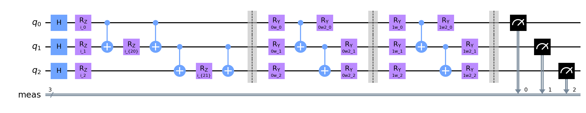
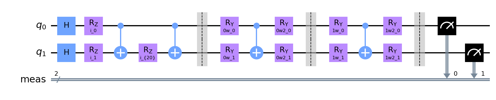
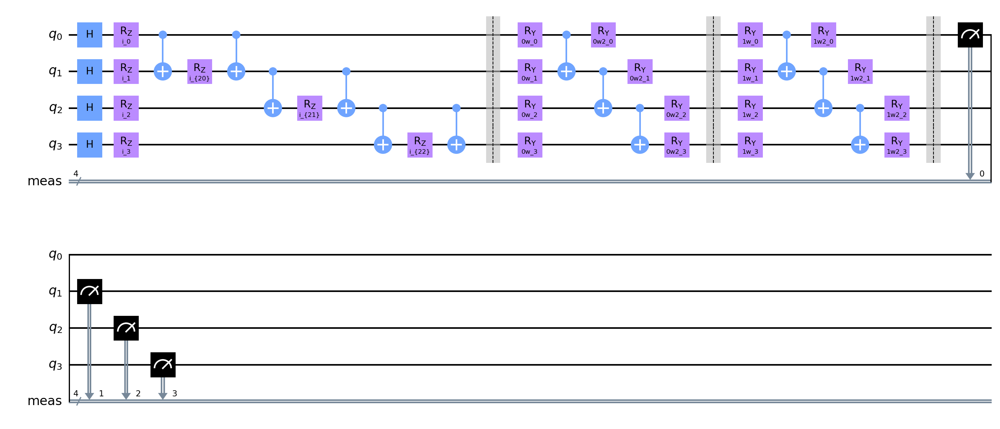
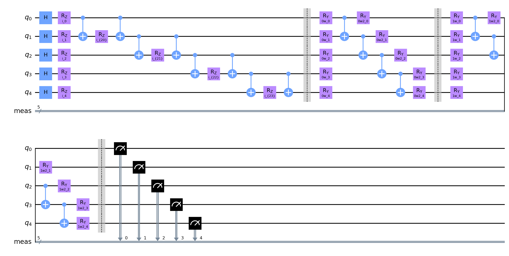

# Quantum Neural Network Classifier run

**Settings:**
Used Optimizer for Neural Network Classifier: `COBYLA`
Layer count: `2`

## Quantum Circuits
Quantum Circuits plots for each dataset
| dataset | circuit | plot |
| :-----: | :-----: | :--: |
| adhoc | qml_circuit_qiskit_power |  |
| custom | qml_circuit_qiskit_power |  |
| iris | qml_circuit_qiskit_power |  |
| rain | qml_circuit_qiskit_power |  |
| vlds | qml_circuit_qiskit_power |  |

## adhoc
#### Average
| circuit | ø score train | ø score test | ø weights |
| ------: | :-----------: | :----------: | :-------: |
| circuit-00 | `0.6437499999999999` | `0.53` | `[1.47002493,0.35327047,0.68147126,0.6855725,0.91632115,0.68449631,1.01166264,1.29436441,0.93571659,0.79635776,-0.13487088,0.59290484]` |

#### Per run data
| dataset name and run | circuit-00: score (train, test) and weights  |
| :----------: | :--------: |
| `adhoc_20` | `[0.65,0.65]`, `[-0.41023539,-0.76066642,0.8366898,1.73576404,0.03250465,-0.94802646,1.14426414,2.93192531,1.30434285,-0.92897931,0.61376386,0.50209785]` |
| `adhoc_21` | `[0.6875,0.55]`, `[1.27164878,1.2925711,0.15145398,1.06107548,1.26966251,0.30628142,1.39159742,2.70543166,0.40117847,0.22589527,-2.39348863,1.38198409]` |
| `adhoc_22` | `[0.6625,0.45]`, `[2.0233278,0.26098085,-0.01445403,-0.30826271,2.38448844,2.03013717,0.32283239,1.26912675,-0.66431851,1.55611414,0.06844141,0.36288051]` |
| `adhoc_23` | `[0.65,0.5]`, `[1.55416559,-0.004316,3.04269994,-0.27669091,-0.36994306,-1.40856094,1.05743883,0.24360605,1.80332305,1.73505072,0.32211356,1.59405149]` |
| `adhoc_24` | `[0.6375,0.55]`, `[1.54893133,0.21096162,0.15171839,-0.19748921,0.72275169,0.61307167,1.28566764,1.39878762,1.04269423,1.38929853,0.03324928,-0.22781136]` |
| `adhoc_25` | `[0.5625,0.55]`, `[2.3248095,1.30138139,0.52839806,2.57170178,1.70926594,1.35858177,0.56842378,-0.17220309,1.91241571,-0.01315821,-1.50287854,-0.41309519]` |
| `adhoc_26` | `[0.6375,0.5]`, `[1.07955182,-0.42739811,0.67267687,0.42858706,0.7852102,1.45983241,2.15634789,2.94294173,1.46979649,1.67009213,0.65293151,0.90649264]` |
| `adhoc_27` | `[0.6625,0.5]`, `[1.14827159,1.64063561,0.39269987,1.22818102,-0.34172604,0.22635343,1.714073,0.11401884,-0.6369091,-0.59332383,0.52406333,0.0821447]` |
| `adhoc_28` | `[0.625,0.5]`, `[1.76455959,-0.07238842,0.94062686,0.34001449,1.23659976,1.14572138,1.12566846,1.46024897,0.71381817,1.73337517,0.34888805,-0.03548979]` |
| `adhoc_29` | `[0.6625,0.55]`, `[2.39521869,0.09094311,0.11220291,0.27284396,1.73439739,2.06157127,-0.64968719,0.04976023,2.01082451,1.189213,-0.01579261,1.77579346]` |

## custom
#### Average
| circuit | ø score train | ø score test | ø weights |
| ------: | :-----------: | :----------: | :-------: |
| circuit-00 | `0.6412500000000001` | `0.635` | `[1.5268717,1.5420416,1.13234023,0.31614386,0.41853818,0.63526246,0.55773244,0.489395]` |

#### Per run data
| dataset name and run | circuit-00: score (train, test) and weights  |
| :----------: | :--------: |
| `custom_0` | `[0.6125,0.6]`, `[2.30636509,1.9605017,1.05646985,0.31547229,0.3621928,0.67788616,-0.24645167,-0.10725658]` |
| `custom_1` | `[0.65,0.65]`, `[1.43489044,1.75407708,0.06518207,-0.08785652,-0.1086299,0.01106221,1.3132847,-0.14687823]` |
| `custom_2` | `[0.6625,0.75]`, `[1.85564609,1.16833783,1.43867656,0.27998737,-0.03472498,0.2432852,0.79125163,0.86885347]` |
| `custom_3` | `[0.625,0.55]`, `[1.53979597,1.77364238,0.90126732,0.06569709,0.29916029,0.48102256,0.19579375,0.28285638]` |
| `custom_4` | `[0.6625,0.6]`, `[1.07197734,1.29255755,0.9466105,0.95962259,0.57327162,1.01145222,0.89105059,1.17507945]` |
| `custom_5` | `[0.5875,0.75]`, `[1.7515564,1.68460107,0.93521674,0.94884295,0.52534731,0.99260772,0.24818939,0.60570212]` |
| `custom_6` | `[0.6625,0.5]`, `[0.19449448,0.69779859,1.17727233,0.22850287,0.46042486,0.75268723,1.39740938,1.32181834]` |
| `custom_7` | `[0.65,0.75]`, `[1.1738305,1.57426041,1.43679812,0.04362597,1.45015101,1.47494452,0.1130147,0.70633901]` |
| `custom_8` | `[0.65,0.5]`, `[1.57156644,1.61926964,1.3310084,0.55786724,0.77506082,1.02408347,0.37745159,0.27731928]` |
| `custom_9` | `[0.65,0.7]`, `[2.36859428,1.89536976,2.03490039,-0.15032328,-0.11687199,-0.31640665,0.49633037,-0.08988326]` |

## iris
#### Average
| circuit | ø score train | ø score test | ø weights |
| ------: | :-----------: | :----------: | :-------: |
| circuit-00 | `0.9325000000000001` | `0.9399999999999998` | `[0.607491,0.6962633,0.96964846,0.38407415,0.04789493,0.42044436,0.23837548,0.57073342,0.48411267,0.54219041,0.11577631,1.11980428,0.99366538,1.03742219,0.71076107,0.35596565]` |

#### Per run data
| dataset name and run | circuit-00: score (train, test) and weights  |
| :----------: | :--------: |
| `iris_10` | `[0.95,0.95]`, `[0.83568075,-0.73135506,-0.23949429,-0.11802257,-0.02764261,0.39115748,-0.26064073,-0.25913877,-0.14502986,0.05507895,-0.23074029,1.16878435,0.86585744,2.43017219,1.86588476,0.22180789]` |
| `iris_11` | `[0.95,0.9]`, `[0.16834441,0.28705212,1.66814973,0.3115562,-0.22979947,0.1036975,-0.04855218,0.07382314,-0.29585459,0.10411948,-0.04025465,1.35877271,1.45588351,1.29915595,-0.29654145,-0.26643643]` |
| `iris_12` | `[0.9625,1.0]`, `[1.28680111,1.05905796,1.7728345,0.13719161,0.1953298,0.28757037,0.0401248,0.47262535,-0.1482123,-0.03574254,-0.03312061,1.60108334,0.27392859,1.66978475,-0.24761823,-0.149836]` |
| `iris_13` | `[0.8125,0.75]`, `[1.55771773,0.57133598,0.96866187,0.8169343,0.19029046,0.42658853,1.40534834,1.48675914,0.741912,-1.05006513,0.41760976,0.9708081,1.36692463,-0.30358096,0.6133113,-0.76908899]` |
| `iris_14` | `[0.9625,1.0]`, `[1.0822638,-0.20159479,1.55710332,-0.49515055,-0.28384114,0.2497216,-0.21042386,1.30961501,1.32557588,1.53964411,-0.16466369,0.27573937,2.20837677,0.88314934,1.55673059,2.09260648]` |
| `iris_15` | `[0.8875,0.85]`, `[0.34049404,1.40696796,-0.03866519,0.04240061,0.40311944,0.02558114,0.35604953,-0.03686402,1.14887844,1.79926644,0.96730293,1.08696202,-0.28690381,1.62828882,0.4207254,1.02098684]` |
| `iris_16` | `[0.9375,1.0]`, `[0.35535758,0.99495161,0.79621792,0.83382164,0.0384696,0.32541467,0.01752725,0.24800978,-0.26095552,0.0258566,-0.10988973,1.30931609,1.18721554,0.68502169,0.63053131,-0.72762704]` |
| `iris_17` | `[0.9625,1.0]`, `[-0.06560077,0.75082774,2.07167839,1.10883601,-0.01079962,1.87980269,1.32335394,1.24037831,1.26088886,1.25850593,0.0386066,1.56393214,1.75027671,1.02108366,2.24093607,1.80780038]` |
| `iris_18` | `[0.975,0.95]`, `[0.8752643,1.31402779,1.48490735,0.1700813,0.09570045,0.35828695,-0.22509302,0.60698972,-0.1918768,0.14907115,-0.02152086,1.52828095,0.73203835,-0.11726946,0.08888893,-0.08315671]` |
| `iris_19` | `[0.925,1.0]`, `[-0.36141293,1.51136167,-0.344909,1.03309292,0.10812236,0.15662273,-0.01393925,0.5651365,1.40580061,1.57616909,0.33443366,0.33436368,0.38305612,1.17841596,0.23476201,0.41260011]` |

## rain
#### Average
| circuit | ø score train | ø score test | ø weights |
| ------: | :-----------: | :----------: | :-------: |
| circuit-00 | `0.6399999999999999` | `0.5399999999999999` | `[0.92133354,1.34629081,0.46606083,1.0692564,0.42262808,0.27180435,0.50612455,0.76270953,0.49184089,0.91191663,0.1547073,0.53771067,0.59250998,0.4296743,0.74639893,0.68085143,0.45039061,0.38800842,0.58077011,0.29800215]` |

#### Per run data
| dataset name and run | circuit-00: score (train, test) and weights  |
| :----------: | :--------: |
| `rain_30` | `[0.6625,0.5]`, `[0.81135819,1.22311514,0.62001955,1.41095645,0.27858572,0.45528578,0.2901202,0.29811453,0.42878514,0.14942974,0.39255534,0.0493166,0.47519611,0.27582115,1.378845,0.45878995,0.18759447,0.17684628,0.09369585,-0.19545385]` |
| `rain_31` | `[0.6625,0.5]`, `[1.10288038,2.44727024,-0.49107804,1.06914573,-0.18797917,-0.3862718,0.15195503,1.42609146,0.75245873,0.44934997,-0.67442067,1.38709968,0.28542753,0.73161777,0.33227103,0.84925219,0.02520181,0.36486009,-0.15142046,0.58942485]` |
| `rain_32` | `[0.675,0.5]`, `[1.64897154,1.13552556,0.08233864,0.94839341,0.16759476,0.35619628,0.77448751,1.27876683,0.41282301,-0.15059468,-0.09638298,0.22854306,0.25572912,0.19402807,0.45448764,1.18435142,0.36170608,0.48813332,0.12986974,0.48873605]` |
| `rain_33` | `[0.625,0.6]`, `[1.09397499,1.62290628,0.25293998,0.72439205,-0.0780492,0.16372967,0.44508741,1.43571757,0.91280575,1.03579666,0.06980952,0.52021312,0.88597666,1.50495951,0.62105843,0.12782399,-0.18745979,0.13244393,0.83211132,1.40881432]` |
| `rain_34` | `[0.5625,0.5]`, `[2.1106971,1.46085421,0.70402889,1.52553964,1.19576367,0.36579552,0.66164767,1.50092489,-0.00873192,0.26001529,0.45359688,1.41838985,1.31931079,-0.2590952,-1.02456137,-0.0220055,0.72349259,1.68589295,1.59022532,0.4169622]` |
| `rain_35` | `[0.65,0.6]`, `[-0.1098029,1.24197515,0.05212729,0.84341543,0.39638345,0.40205318,0.20074675,0.38849294,0.28980102,1.84465349,0.56322163,0.28142271,1.15186656,0.44113685,0.29609475,2.01016502,1.06074631,0.01292689,-0.15680582,-0.09886611]` |
| `rain_36` | `[0.65,0.55]`, `[-0.54800417,1.71668775,0.26062111,0.76259498,0.60772518,0.2756793,0.05943607,0.08071728,0.13982315,1.30538758,0.03763262,0.19494265,0.20031139,0.20782084,2.14973962,0.86535185,-0.09863569,1.33353045,0.65783333,-0.61451476]` |
| `rain_37` | `[0.6125,0.55]`, `[1.86194305,0.50631252,1.9831336,1.04793231,0.43964874,0.36786679,0.03973413,0.3123771,0.47479793,1.89497254,-0.01337198,0.10522925,0.25566391,-0.00886868,1.51224931,1.12265843,1.06159591,-0.14619638,1.41821597,0.56811217]` |
| `rain_38` | `[0.6,0.55]`, `[0.1227276,1.13564417,0.32839977,0.71369235,1.1878501,0.86192621,2.08479817,0.71822071,0.80304904,1.47869356,0.5320167,0.89747066,0.32438498,1.05092275,0.36287765,0.10455244,0.27454964,-0.12685569,1.44031956,0.75292481]` |
| `rain_39` | `[0.7,0.55]`, `[1.11858961,0.97261712,0.86807749,1.64650163,0.21875754,-0.14421746,0.35323254,0.18767197,0.71279704,0.85146217,0.28241594,0.2944791,0.77123274,0.15839992,1.38092728,0.10757451,1.09511477,-0.04149765,-0.04634366,-0.33611813]` |

## vlds
#### Average
| circuit | ø score train | ø score test | ø weights |
| ------: | :-----------: | :----------: | :-------: |
| circuit-00 | `0.72375` | `0.6050000000000001` | `[1.0861484,1.36705311,0.81078375,0.7981962,0.9877484,0.32234391,0.52532291,0.51921099,1.10381253,0.1441706,0.38618613,0.42902998,0.57033704,0.07528789,0.31645045,0.98385319,0.24223085,0.28765395,0.46825532,0.19876357]` |

#### Per run data
| dataset name and run | circuit-00: score (train, test) and weights  |
| :----------: | :--------: |
| `vlds_40` | `[0.6875,0.5]`, `[1.25108028,1.02000254,0.34465974,1.78418346,0.41594683,0.91049961,0.55389125,1.55200196,1.52508677,0.6722018,0.59022623,1.35273196,0.71735847,0.59703176,0.37402451,0.96612547,0.12860263,1.1637526,-0.08607466,0.53171707]` |
| `vlds_41` | `[0.6375,0.6]`, `[0.44541383,1.27712915,1.05458251,-0.23676391,1.62356357,0.42749279,0.42939651,0.05661733,0.21372401,-0.02741206,-0.08195685,0.26089237,0.55240201,0.03797649,0.03196659,0.82639964,1.33554,0.35174982,0.52464489,-0.06926498]` |
| `vlds_42` | `[0.7875,0.7]`, `[2.01241577,2.34884423,0.88869344,0.65244094,1.40223812,0.82249781,0.10404515,-0.07604928,2.69374515,0.14969558,1.77255054,0.17925564,0.12287322,-0.02246285,-0.16988747,-0.16853482,-1.01723184,0.62916902,1.27563725,0.02771031]` |
| `vlds_43` | `[0.75,0.7]`, `[1.50090376,1.85399945,1.40830717,0.6081524,1.37461196,-0.07922793,0.02903592,0.05744475,-0.38929554,0.32041577,-0.17511983,-0.1361752,0.98796865,-0.1664309,0.69988113,0.2746092,0.31629509,-0.50463675,-0.01747594,-0.44541586]` |
| `vlds_44` | `[0.7625,0.7]`, `[1.66870664,0.98835041,1.05823032,1.4434882,1.64394418,0.54303625,1.29314798,0.9780134,2.44165118,0.11235392,0.71671365,1.04378593,0.69953466,0.13673532,0.11423258,2.1975958,0.205027,-0.15365283,-0.05602047,-0.29720712]` |
| `vlds_45` | `[0.7,0.6]`, `[0.58462042,1.8483757,0.63870625,0.20139887,0.54886484,-0.26973054,0.58772936,0.41512064,0.3958649,-0.41586551,-0.24377301,0.14880959,0.90863509,-0.32537261,0.19115518,2.10009254,-0.13975924,0.38061033,0.55450967,0.37475301]` |
| `vlds_46` | `[0.6625,0.55]`, `[1.00668107,1.0032044,0.69815988,1.25675207,1.78173705,0.1032525,0.35718923,0.55897665,1.76524826,0.68705429,0.49185043,0.24308514,0.27354652,0.67301517,0.41773697,0.9049699,0.23775128,0.2077884,0.13076927,-0.12930007]` |
| `vlds_47` | `[0.8,0.7]`, `[0.72411279,0.98062084,0.34303958,0.17747673,0.25505214,0.07461321,1.34375227,0.12326273,1.50151032,-0.01099809,0.741881,0.01217315,1.45583358,-0.11491193,-0.08291712,1.62344672,0.38942777,0.65896487,1.08650025,1.25432544]` |
| `vlds_48` | `[0.6875,0.35]`, `[0.58109368,1.11173606,1.42986675,0.86406422,0.90820969,0.44674653,0.18252022,-0.00569876,0.00571724,-0.03030218,-0.42006246,-0.0989796,0.19352311,-0.1359633,0.23326292,0.85678403,1.18742354,0.00273521,0.31920032,0.67525006]` |
| `vlds_49` | `[0.7625,0.65]`, `[1.08645576,1.23826837,0.24359192,1.23076902,-0.07668443,0.24425888,0.37252124,1.53242047,0.88487296,-0.01543749,0.46955163,1.28472078,-0.20830492,0.07326178,1.35504923,0.25704338,-0.22076769,0.14005882,0.95086259,0.06506783]` |

