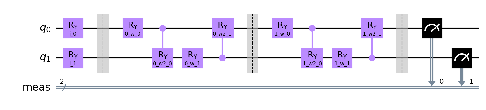
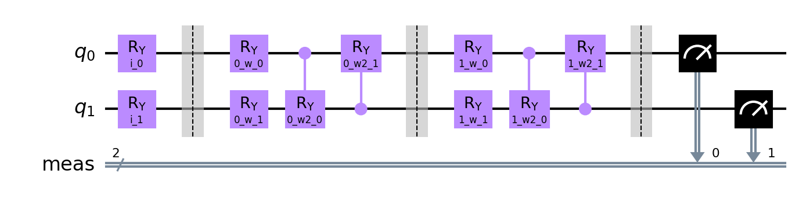
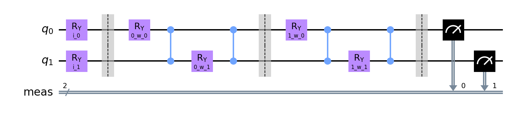

# Quantum Neural Network Classifier run

**Settings:**
Used Optimizer for Neural Network Classifier: `BFGS`
Layer count: `2`

## Quantum Circuits
Quantum Circuits plots for each dataset
| dataset | circuit | plot |
| :-----: | :-----: | :--: |
| custom | qml_circuit_qiskit_01 |  |
| custom | qml_circuit_qiskit_02 |  |
| custom | qml_circuit_qiskit_03 |  |
| custom | qml_circuit_qiskit_04 |  |
| custom | qml_circuit_qiskit_05 |  |

## custom
#### Average
| circuit | ø score train | ø score test | ø weights |
| ------: | :-----------: | :----------: | :-------: |
| circuit-00 | `0.5475000000000001` | `0.41500000000000004` | `[0.34607778,1.0436565,1.82717783,0.47864529,-0.52938936,0.00775474,1.9371886,1.16852633]` |
| circuit-01 | `0.5387500000000001` | `0.425` | `[0.80207494,0.62247236,1.0332042,0.02451684,1.04727364,-0.00512607,1.49101021,0.825898]` |
| circuit-02 | `0.5499999999999999` | `0.4700000000000001` | `[-0.58358035,-1.10989698,0.94398099,-3.3229617]` |
| circuit-03 | `0.5375` | `0.4749999999999999` | `[0.70396475,0.55528012,0.79513039,0.03867265,0.24790695,0.23483555,0.4127233,0.10834892,0.78526247,0.52193091,0.55935823,0.65928375]` |
| circuit-04 | `0.5475000000000001` | `0.43999999999999995` | `[-0.61382455,1.51130506,-0.21348494,-5.18469293,1.31502351,0.42566553,1.52681587,0.58778927,-0.33928536,0.63918092,0.34391584,0.49816904]` |

#### Per run data
| dataset name and run | circuit-00: score (train, test) and weights  | circuit-01: score (train, test) and weights  | circuit-02: score (train, test) and weights  | circuit-03: score (train, test) and weights  | circuit-04: score (train, test) and weights  |
| :----------: | :--------: | :--------: | :--------: | :--------: | :--------: |
| `custom_0` | `[0.6125,0.65]`, `[-0.28961589,0.19412776,0.24351081,-0.59174951,-0.01155586,0.96160197,-0.23392438,-0.99123038]` | `[0.575,0.6]`, `[1.00983105,-0.19946962,2.23656885,-0.14028907,0.77757411,-0.50717001,2.07455164,0.43085269]` | `[0.5875,0.7]`, `[-13.60511058,-11.58102802,-12.75580839,-20.79628212]` | `[0.5125,0.5]`, `[-0.07204485,1.21399265,0.78240499,0.24734292,0.10356542,1.29821931,-0.0384019,1.89745186,0.39098803,0.09338268,0.80647296,0.1807432]` | `[0.5875,0.65]`, `[0.0055735,-0.60855208,-0.06949284,-0.89478624,0.25556376,0.18606759,0.4699539,0.09509044,0.83572015,0.26297069,0.6278199,0.07078532]` |
| `custom_1` | `[0.5125,0.45]`, `[2.7316821,2.50448422,2.34389753,0.64954021,2.70696034,2.7987283,0.99250184,0.83174362]` | `[0.525,0.5]`, `[2.09562982,1.11080198,-2.837507,-2.08470677,3.60525865,0.24259988,-1.57025498,-0.99833865]` | `[0.525,0.5]`, `[-0.44344982,0.08172817,-0.02706152,-0.5286024]` | `[0.5625,0.55]`, `[1.71154669,-0.11640996,0.03542429,0.91385276,0.79153899,0.24789563,1.3534154,-0.03131654,0.61941901,0.93748214,0.6804073,0.68581969]` | `[0.525,0.5]`, `[0.47856401,-0.05799364,-0.20030889,-0.13675812,-0.2786417,0.04592766,0.31093806,0.75389806,0.71692824,0.38377295,0.44266879,0.67274935]` |
| `custom_2` | `[0.6,0.4]`, `[0.06218793,1.14577492,1.41726931,0.38545241,0.5112109,0.38496693,0.86952756,1.15307482]` | `[0.6125,0.5]`, `[1.84163741,1.394908,0.7008819,0.23307666,-0.27353796,0.71959849,1.99291109,1.976156]` | `[0.6,0.5]`, `[-1.68775715,-3.35227379,4.49159768,-4.18831188]` | `[0.5875,0.5]`, `[-0.29769678,0.4487205,-0.1185617,-0.18878344,-0.05453472,0.17563978,0.20640832,-0.21560378,0.13733633,-0.89368902,0.91634255,0.21855818]` | `[0.5875,0.5]`, `[-14.12723959,-2.07745563,1.23018349,-6.44053181,10.97518151,0.74263057,-1.2079799,0.31187484,-2.15457214,1.87358949,-0.36408664,0.20386584]` |
| `custom_3` | `[0.525,0.45]`, `[-0.4400884,1.15825518,1.69441657,1.16866442,-1.6067032,-1.62420918,2.07719728,1.82585327]` | `[0.5375,0.45]`, `[0.70758062,1.27610996,1.77831645,0.008762,-0.02657653,0.8760506,1.83066838,1.08959178]` | `[0.4125,0.5]`, `[-0.1132626,-2.36037618,2.14197344,-3.45558656]` | `[0.5625,0.5]`, `[0.00384736,0.97996672,0.71607631,-0.20968851,0.65637646,1.43328018,0.06298017,1.62464642,-0.05912078,-0.03727427,-0.01162757,0.59103462]` | `[0.5,0.4]`, `[-0.20467697,0.46167168,-5.9934118,-2.22706648,-0.57802001,0.59112784,-0.06423487,0.58898047,6.38643133,0.49387332,-0.44502124,0.75017551]` |
| `custom_4` | `[0.575,0.3]`, `[1.01078356,-1.18835264,5.03463992,0.6904911,0.07825617,-1.02527273,4.68527338,0.27319603]` | `[0.575,0.2]`, `[1.12224655,0.10129447,1.07102547,2.97624614,0.20346564,-1.77228944,2.58031449,3.62802154]` | `[0.6125,0.35]`, `[6.90648366,8.51840566,9.02302327,1.55924953]` | `[0.475,0.55]`, `[0.68612485,0.91490584,1.1193259,0.73076092,0.23855894,0.74831043,0.27174522,0.41674767,0.60078472,0.65766273,0.94463709,0.01094553]` | `[0.5375,0.4]`, `[-0.9163321,-0.03658145,-1.47523213,-3.28949834,0.84486803,-0.2136795,3.03555723,0.78380129,2.45673808,0.93012454,0.66735961,0.73068045]` |
| `custom_5` | `[0.425,0.5]`, `[-1.87019577,2.25780398,2.69306765,1.24328708,-6.84778569,-0.48072471,4.46141778,3.41321413]` | `[0.4875,0.5]`, `[-0.4051131,0.77701502,1.60023235,-1.18846347,1.26444447,-0.56758002,1.65228048,1.50320629]` | `[0.5375,0.55]`, `[1.72527919,-2.0003325,3.3314658,-3.43125918]` | `[0.5375,0.5]`, `[1.39623018,0.06628185,1.74149822,0.44496084,-0.45110428,0.43831538,0.5407754,-0.44441226,1.863538,0.65406189,0.66689312,1.1225901]` | `[0.475,0.5]`, `[0.82714463,1.80508516,0.49242823,-1.57522026,0.97423502,0.68648557,0.72979236,1.1759059,-0.68417901,0.73888242,0.34184836,0.2911727]` |
| `custom_6` | `[0.55,0.35]`, `[0.64707473,0.47911888,1.67727777,-0.05329286,0.37240659,0.33896948,1.9147378,0.76814008]` | `[0.525,0.4]`, `[0.42362121,0.19078151,1.76066084,0.13123246,0.99177052,-0.05066589,1.79448355,-0.17647737]` | `[0.525,0.5]`, `[0.78305325,-1.0959277,0.27369248,-0.81464208]` | `[0.4875,0.4]`, `[1.48685546,0.53831513,0.4212555,0.82387196,0.60461944,-0.17800178,1.55432956,-0.03207158,0.23132912,0.53915617,0.07159038,0.47913974]` | `[0.5625,0.35]`, `[-1.74458143,11.67045198,-2.628193,-19.79981189,2.39430348,-0.33569211,14.80637188,0.87363541,0.97500398,2.01769706,-0.396776,0.8520168]` |
| `custom_7` | `[0.575,0.35]`, `[0.9278948,0.24598592,1.55507079,0.10960402,0.83886635,0.31354367,1.46372175,0.10159142]` | `[0.525,0.4]`, `[-0.00853839,-0.23570901,1.68701561,-0.46369314,2.08502977,-0.03386052,2.02489191,-0.33585448]` | `[0.6,0.35]`, `[0.68326448,1.44022382,3.01289686,-0.18469598]` | `[0.5875,0.35]`, `[5.60153977e-02,8.89693025e-01,2.48982590e-01,9.24738772e-02,2.30966346e-01,1.39856099e+00,-5.24381973e-02,1.70306365e+00,-1.38109883e-03,4.45500537e-01,3.45793430e-01,7.50067035e-01]` | `[0.5625,0.35]`, `[4.59859815e+00,4.59159408e+00,6.51214596e+00,-1.51077279e+01,1.27470583e+00,1.95009029e+00,1.00100157e+00,-2.16881204e-01,-1.10060724e+01,-3.66789399e-01,7.17034200e-03,4.68278473e-01]` |
| `custom_8` | `[0.575,0.3]`, `[0.8968736,1.37464784,1.77011934,-0.90003877,1.87729422,-0.96902192,2.13392459,1.41665644]` | `[0.5,0.3]`, `[0.2914946,1.03457433,0.34501322,0.84389241,1.22042355,0.73281649,0.98606376,0.90139143]` | `[0.5625,0.3]`, `[-0.34420888,-0.09369263,-0.12521559,-0.27245001]` | `[0.5375,0.3]`, `[0.27858518,0.1628886,1.02319727,-0.18723906,1.63610019,-0.39520621,1.47347069,-0.16652651,0.38152878,0.15667868,0.5919375,1.05779894]` | `[0.575,0.3]`, `[0.57801624,0.14031299,0.69604473,-1.2644556,-0.96383345,0.1963463,-1.01717775,0.610638,0.1353691,-0.03813132,0.61671943,0.44117551]` |
| `custom_9` | `[0.525,0.4]`, `[-0.21581883,2.26471894,-0.1574914,2.08449475,-3.21284346,-0.62103444,1.00750836,2.89302386]` | `[0.525,0.4]`, `[0.94235961,0.77441695,1.98983434,-0.07088882,0.62488421,0.30923969,1.54419177,0.24043076]` | `[0.5375,0.45]`, `[0.25990494,-0.6556966,0.07324585,-1.11703634]` | `[0.525,0.6]`, `[1.79018399,0.45444681,1.9817005,-2.2808258,-1.27701733,-2.81865822,-1.24505164,-3.66848971,3.68820263,2.66634756,0.58113549,1.49614045]` | `[0.5625,0.45]`, `[4.36668804,-0.77548244,-0.69901313,-1.11107264,-1.74812736,0.40735108,-2.79606373,0.9009495,-1.05422093,0.09581942,1.94145586,0.50079045]` |

