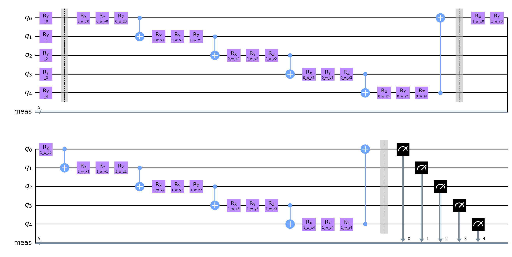

# Quantum Neural Network Classifier run

**Settings:**
Used Optimizer for Neural Network Classifier: `BFGS`
Layer count: `2`

## Quantum Circuits
Quantum Circuits plots for each dataset
| dataset | circuit | plot |
| :-----: | :-----: | :--: |
| rain | qml_circuit_qiskit_01 |  |
| rain | qml_circuit_qiskit_02 |  |
| rain | qml_circuit_qiskit_03 |  |
| rain | qml_circuit_qiskit_04 |  |
| rain | qml_circuit_qiskit_05 |  |

## rain
#### Average
| circuit | ø score train | ø score test | ø weights |
| ------: | :-----------: | :----------: | :-------: |
| circuit-00 | `0.61375` | `0.605` | `[1.24597854,0.06390075,0.4860491,0.5877713,0.90143287,0.17778829,0.45413731,0.6438153,0.00737423,0.70778045,0.86202546,0.05873366,1.06572194,1.02092437,1.44227291,0.19328417,0.50530806,0.38704132,0.1152265,0.49013888]` |
| circuit-01 | `0.6024999999999999` | `0.6` | `[1.15606732,0.12502271,0.74958084,0.87326692,0.93975144,0.54325552,0.35281018,0.7058905,0.41065241,0.68396554,1.034896,0.17771063,1.15043184,1.03673322,1.4160551,0.19886955,0.30348758,0.66682117,0.23307808,0.43661468]` |
| circuit-02 | `0.595` | `0.62` | `[0.07078166,0.81566393,0.53486068,0.05123658,-0.14950914,-0.01169299,0.79167462,0.56509877,0.29388043,0.51461308]` |
| circuit-03 | `0.5175` | `0.49000000000000005` | `[0.51094285,0.49826546,0.20037446,0.64408395,0.53409575,0.49914914,0.55444317,0.46079029,0.59719471,0.60372543,0.29287413,0.58376344,0.1599062,0.69500883,0.85441527,0.59391721,0.41262118,0.38768239,0.45821382,0.42925834,0.63641864,0.44935586,0.44518378,0.00523469,0.62063389,0.43049146,0.56142614,0.43941283,0.47491998,0.48793741]` |
| circuit-04 | `0.6312499999999999` | `0.63` | `[0.15481584,0.47575454,0.7224088,0.00842186,0.23338642,0.33036081,-0.11727306,1.42329469,-0.11389585,0.57009028,0.57420106,1.31395206,0.68763909,0.36437242,0.41082583,0.30445519,1.23120661,0.01401567,-0.02931114,0.63086981,0.36020582,0.16002561,1.18625884,0.2430657,0.505827,0.42355067,0.57777719,0.6366376,0.38096592,0.44463463]` |

#### Per run data
| dataset name and run | circuit-00: score (train, test) and weights  | circuit-01: score (train, test) and weights  | circuit-02: score (train, test) and weights  | circuit-03: score (train, test) and weights  | circuit-04: score (train, test) and weights  |
| :----------: | :--------: | :--------: | :--------: | :--------: | :--------: |
| `rain_30` | `[0.7,0.75]`, `[1.55417196,-1.23706499,0.02763303,0.64377829,0.27227394,-0.92164316,0.19297474,0.7095176,0.03088641,0.39354578,1.42885028,-0.33297673,0.11013958,0.66484712,1.68616666,-0.15389132,0.94654208,0.35024441,0.10876789,0.1425935]` | `[0.5375,0.45]`, `[0.4957326,0.47084628,0.81688431,0.22996317,1.14493087,0.6036392,-0.31816386,0.4131666,-0.40548382,0.48943726,0.4031741,0.43418285,0.69957378,0.34457646,1.16749116,0.05996713,0.57562184,0.14428703,-0.27042819,0.17533702]` | `[0.6375,0.7]`, `[-0.12124917,0.40201746,0.46618654,-0.17962605,-0.97860142,0.00311348,0.99374504,0.65739326,0.62943358,1.32329597]` | `[0.5625,0.45]`, `[0.36368488,0.66700551,0.50700523,1.01538062,0.54643126,0.63690201,1.18081035,0.63076009,0.43864824,0.26596877,0.18603606,0.72373273,0.02940896,0.1370844,-0.23739053,0.3761604,0.81744287,0.79053127,0.33331022,0.40822074,0.40604661,0.00606515,0.60258392,-0.07759343,0.26962646,0.42069004,0.83084554,0.64600066,0.82428196,0.39000503]` | `[0.6375,0.65]`, `[-0.21830046,1.33363257,0.14071569,0.04069388,0.16419065,0.68305881,-0.08162309,1.49948789,-0.03206993,0.18845904,0.97635095,1.16742932,0.3250629,0.58406466,0.04192513,0.32517463,1.42283444,-0.06234621,-0.00932731,0.89946457,-0.06982705,0.37123203,0.9243252,0.15638477,0.48910131,0.30358098,0.934726,0.4071373,0.22837118,0.02421214]` |
| `rain_31` | `[0.5875,0.4]`, `[0.59050522,0.63958848,1.5171537,0.18486118,1.00794216,-0.04226785,1.46243708,0.52041588,0.23344608,1.55097068,0.01381946,0.58872563,1.99142387,0.50629492,2.12316044,0.1168762,0.23827676,-0.29561934,0.06646629,0.40332522]` | `[0.5875,0.45]`, `[-0.42083641,0.8929219,-0.24010401,1.72787656,-0.00284077,1.69121063,0.4263475,1.23834823,0.09319506,-0.03228745,1.4137631,-0.63427967,-0.23835188,1.4203003,-0.12380579,1.48235652,0.47197227,1.94287796,-0.03459349,0.33770957]` | `[0.575,0.5]`, `[-0.2239975,0.43075566,0.29195842,-0.50199872,-1.09959436,-0.06864758,1.39801556,0.45516534,0.89433681,1.39680316]` | `[0.6125,0.55]`, `[0.3959578,0.49812495,-0.85619491,1.40478061,0.38932707,0.63887017,-0.13801192,0.25977211,2.00905791,0.36003215,-0.12165311,0.40815143,-1.13156112,2.2922052,2.94763034,0.25484821,-1.49663862,-0.2898233,-0.90942915,-0.69014464,2.09348454,1.25080187,0.83463686,-1.37702406,3.58038497,-1.54012856,1.79595327,-0.36271399,-0.15124199,-0.93889984]` | `[0.575,0.4]`, `[0.86598932,0.13229352,1.68987415,0.03083984,0.21213826,-0.01629392,0.11308453,1.0194583,-0.02748227,0.6130886,0.29816419,1.01106415,0.92666247,0.33535239,0.57837731,0.94077453,1.41185487,0.24515985,-0.01257803,0.86546408,0.84663323,0.01922063,0.74361861,0.01548446,0.68427598,0.10717908,0.85383008,0.62163613,1.03231416,1.08742428]` |
| `rain_32` | `[0.675,0.65]`, `[2.64056686,-0.35194097,0.62869717,0.21256759,1.32414956,-0.77301223,0.54519471,0.75372248,-0.15106162,1.32777482,-0.31517235,-0.29352156,0.53017117,1.20116607,1.031689,-0.11774414,0.5509646,0.04889479,-0.10292151,-0.19948926]` | `[0.625,0.55]`, `[1.50464088,0.0737698,1.31055534,0.9420076,1.32858792,0.20486105,0.46013348,0.09373733,-0.04272078,-1.04691741,1.61110325,-0.18861951,1.89260659,0.79920276,2.2163586,-0.79063968,0.2188494,-0.09445659,-0.1062451,0.04947548]` | `[0.6125,0.8]`, `[2.02270331e-02,5.23026193e-01,6.56651266e-01,4.00499472e-01,2.92752755e-04,1.28368416e-01,4.49192969e-01,6.19058098e-01,-3.02487967e-01,3.99384828e-01]` | `[0.5125,0.45]`, `[0.83517306,0.78631932,0.02374374,0.19418796,0.23763444,0.46619166,0.48829697,0.59852523,0.64191974,0.50256961,0.04908177,1.25899256,0.65771907,0.99342732,-0.08809299,0.24869377,0.8526502,0.76738131,0.56919436,0.2249256,0.77001634,0.66132411,0.47729085,0.72915605,0.250667,1.05156262,0.68593925,0.62522638,0.22965663,1.17652349]` | `[0.6875,0.55]`, `[0.06149281,0.6544102,0.20291484,-0.04938924,0.66002384,0.368533,-0.39393517,1.3040934,-0.0424476,1.77207862,-0.30077258,1.03233389,0.63761578,0.221999,0.44750484,0.27618776,1.07424066,-0.09092234,-0.01602355,-0.13262359,0.23323204,0.02101835,0.81528607,0.36775746,0.52135174,0.73590635,0.95583358,0.94299223,0.543205,0.80356302]` |
| `rain_33` | `[0.575,0.7]`, `[-0.08263766,2.2221008,-0.0104151,0.8561843,0.51302615,1.0459007,0.05403828,1.2674878,-0.74521445,0.49447437,2.1475159,-0.10528636,-0.19798106,2.09437472,0.37724718,1.40150893,0.29519428,1.03600254,-0.42470649,0.21664975]` | `[0.575,0.55]`, `[1.13914151,0.55424975,0.54000765,0.8199369,0.70203749,0.97750582,0.57617228,1.44045136,1.0295212,1.19588697,1.62010359,-0.07596035,0.99369788,1.467048,1.03592116,0.78926966,0.255626,1.06881596,0.86542653,0.54582169]` | `[0.5625,0.5]`, `[-0.11903265,0.71345055,0.77769903,0.32275735,0.40488685,-0.07804954,0.93375008,0.77961768,-0.07538411,-0.01945046]` | `[0.5125,0.45]`, `[0.81521179,0.66904112,0.02872495,0.94878728,0.74455721,0.33730616,0.90961976,0.19790831,0.6546258,0.67644933,0.67492365,0.1527543,0.3573612,0.18913393,0.49895601,0.98778581,0.7023088,0.37422261,0.03221214,0.78915478,0.19864674,0.87362954,0.0236661,0.89699465,0.57911092,0.18639706,0.45104055,0.00165668,0.46088389,0.02049334]` | `[0.625,0.8]`, `[0.04211687,1.20488668,0.14903957,-0.03410479,0.15198254,0.31927535,-0.01493207,1.63218155,-0.02393857,0.06566052,1.26834463,1.46316973,0.7112912,0.57145157,0.54676583,0.05332136,1.34284511,0.87222156,-0.02628797,0.60569012,0.00170951,0.49341217,1.47390054,0.35674009,0.04420207,0.24060607,0.69877816,0.26189248,0.19800605,0.65966414]` |
| `rain_34` | `[0.6375,0.8]`, `[1.49332489,0.15169767,1.44885865,0.54457327,1.12645198,0.19887098,1.17842348,0.37518084,0.14991986,-0.63291942,1.07454387,1.02585167,2.24519774,0.06413764,2.17860753,-0.22436047,-0.03875978,-0.44016993,0.08312475,-0.11781965]` | `[0.675,0.7]`, `[1.57293277,-0.26371796,0.93538709,1.18512181,2.10537915,1.35374817,0.96851358,0.93511425,0.05856465,1.17667888,1.41716757,0.93608442,2.93786556,0.65569688,2.59765476,-0.25562405,0.16918343,0.69839644,0.22019095,0.88642868]` | `[0.6125,0.6]`, `[0.14808882,1.12844804,0.62142889,0.16938766,0.22004068,0.0163861,0.55109141,0.62943927,0.01573234,0.37378765]` | `[0.525,0.45]`, `[0.5473384,0.14250793,0.35775546,0.86922779,0.84418781,0.2095383,0.33540947,0.17122935,-0.2166309,0.94208449,-0.11422134,0.03585385,0.48169874,0.42139237,0.6390663,0.65910045,0.3252255,0.92741966,0.49586074,0.57664271,0.54563135,0.34734637,-0.13779371,0.28821814,0.70758216,0.63896621,0.22470371,0.0325634,1.28786828,0.66021264]` | `[0.5625,0.6]`, `[0.13155922,0.16293831,0.80404949,-0.01787809,0.28218144,0.33120178,-0.12185987,1.56612189,-0.04244386,-0.08415157,1.49299532,1.5181793,0.48734321,0.51848099,0.33337214,0.62549445,1.12339626,0.16550719,0.02436931,0.49704945,0.9235994,0.03342775,1.90413237,0.20102321,0.98847215,0.356123,-0.00232034,1.04186297,0.03852312,0.16141336]` |
| `rain_35` | `[0.6,0.7]`, `[0.98088579,0.27856132,0.33780664,0.241558,0.66489946,1.30810304,0.14330743,0.95870756,0.69263509,1.51023598,1.40942102,0.53789635,1.67231587,1.56347342,0.73511613,0.59810092,0.64757589,1.02391353,1.20755451,0.61893196]` | `[0.6125,0.8]`, `[1.78809581,0.17993664,1.75285081,0.97122935,0.05653338,0.06374533,0.39713296,-0.12369827,0.49029129,1.63126227,1.19629354,0.44917355,1.45134409,0.67030977,2.52564498,0.20921753,0.90438199,-0.29036039,-0.10097856,1.70704367]` | `[0.5375,0.65]`, `[0.01096557,0.86663591,0.78165148,0.24736353,0.25929504,0.10345434,0.86977844,0.69000887,0.26524287,0.10387933]` | `[0.4875,0.6]`, `[0.54526333,0.94500584,0.51867171,0.30559865,0.57287479,0.05617088,0.33884339,0.56694355,0.51449641,0.77214375,0.00916866,0.59774147,0.61389347,0.69320837,0.69662608,0.72783421,0.76711934,0.3199015,0.37884511,0.60111242,0.93072907,0.20529187,0.44264853,0.28403049,0.08995844,0.96706691,0.63703986,0.64889848,0.1810667,0.11100234]` | `[0.6625,0.75]`, `[0.32341814,-1.19266708,1.95418827,0.00692942,-0.65000792,0.67646802,-0.104367,1.54714893,-0.10560769,1.56281451,-0.24099634,2.03189214,0.31723494,-0.06557045,0.58565385,-0.14305935,1.43613394,-0.89064321,-0.16076895,0.87261592,0.26186464,-0.12848639,0.98057189,0.54351924,1.03854867,0.38478587,0.22767086,0.58974258,0.22608294,0.12134383]` |
| `rain_36` | `[0.6125,0.6]`, `[1.93770141,-0.32204282,0.36272172,0.7297834,1.08406195,0.06065788,-0.44183918,1.31569192,-0.37477356,-1.5086384,0.84792708,-1.03713333,0.43378156,0.29503489,2.04920229,-0.26579109,0.7380252,0.02120305,0.05350519,0.38930221]` | `[0.6125,0.75]`, `[1.70893369,-0.56689774,1.25983549,0.75531795,1.29641055,-0.59496067,0.33599034,0.64685614,-0.10320351,0.95621134,0.11624135,-0.80807868,1.16648341,1.55182248,1.7133087,0.01223562,0.6352098,0.18998776,-0.09486688,-0.22562643]` | `[0.65,0.75]`, `[0.7522658,2.22933552,0.173639,0.43620963,0.27398741,-0.11358711,0.00996875,-0.23352897,0.47455174,0.05179885]` | `[0.5125,0.55]`, `[0.33900703,0.57370653,0.3163608,0.44951155,0.88274004,0.23491051,0.88294926,0.29948822,0.4854972,1.07923939,0.42320456,0.61894116,0.00614382,0.44510771,0.69511542,0.67003553,0.81268673,0.79028576,0.80153735,0.57961046,0.32811054,0.36301804,0.77309044,0.39293876,0.42307887,0.29004029,0.27902591,1.15617793,0.90271349,0.86654063]` | `[0.6,0.7]`, `[0.05942328,0.32075619,0.17805297,0.04984124,0.58232037,0.38065429,-0.52538321,1.37577537,-0.43175963,1.52387283,0.27753246,1.32674515,0.41798606,0.23412157,0.24154728,0.54048961,0.77455236,-0.65577181,-0.02105702,0.84688174,0.77647082,0.0089251,1.39814158,0.32345659,0.32551701,1.01227408,0.58966264,0.84457407,0.19939353,0.60791127]` |
| `rain_37` | `[0.675,0.65]`, `[1.92079213,-0.8725949,-0.20024929,1.25260417,1.83626297,0.85812546,0.1393643,-0.06865963,0.24152258,1.7397472,0.88325664,-0.25438866,0.90715797,2.95898916,1.52659277,-0.18512021,0.22022826,0.85495791,-0.43881939,0.77678541]` | `[0.6625,0.6]`, `[0.87053778,-0.75984558,0.01808105,0.72106781,1.41462497,0.03888502,0.64359366,0.30449173,0.25269162,0.71016294,0.85734521,-0.11199122,0.74738058,0.24878242,1.75073454,-0.12487092,0.28504678,0.44527558,-0.11586063,-0.06416889]` | `[0.5875,0.6]`, `[-0.12306005,0.39659683,0.4634491,-0.41983135,0.22718916,0.03903914,0.85033859,0.67594204,0.70590407,0.01838791]` | `[0.425,0.55]`, `[0.50457877,0.34553451,0.65736615,0.74743565,0.21701799,0.74523152,0.51261057,0.95228967,0.72314026,0.04108124,0.98728564,0.77395861,0.43809797,0.18951825,0.93955864,0.62072247,0.44957563,0.00425875,0.99775396,0.36894965,0.61137986,0.69217969,0.88644389,0.24755621,0.25274195,0.63404663,0.21206022,0.79193708,0.33717752,0.94995045]` | `[0.6875,0.6]`, `[-0.28045788,1.52964807,0.3137056,0.03733385,0.10476669,0.16293762,0.04645444,1.53589101,-0.13461467,-0.38123033,0.54277083,1.14433758,0.69799143,0.75248894,0.42433252,-0.1333828,1.45230072,0.19126003,0.00360374,0.51219642,0.33091414,0.46103429,1.30045337,0.22817319,0.82894813,0.46698334,0.69841471,0.41937438,0.44024196,0.46782712]` |
| `rain_38` | `[0.5125,0.25]`, `[0.62007203,0.54893546,0.56530423,0.11620799,0.26631021,0.17619444,0.52346517,0.62373505,-0.25312358,0.67134061,0.02742662,0.4600164,0.75527801,0.66223235,0.57312228,0.1890325,0.7169448,0.90077083,0.50963045,1.13651388]` | `[0.5875,0.65]`, `[1.7296854,0.19673796,0.06557722,0.91326142,0.92850953,0.08014392,-0.50075589,1.31741601,2.06113217,0.39098855,0.72256865,1.42491329,0.56011008,2.24632984,0.35681413,-0.38685037,-1.17274479,1.59655349,1.07558187,0.14108973]` | `[0.6,0.65]`, `[0.56528328,0.34893271,0.55073126,-0.21002579,-0.89373752,-0.04859696,1.09790198,0.81397633,0.21531375,1.32507696]` | `[0.5125,0.4]`, `[1.08072286,0.28340492,0.18900331,0.19769806,0.64622918,0.59531336,0.96088649,0.49214467,0.56827506,0.74986367,0.66433502,0.12506988,1.27336256,0.38231455,0.9515297,1.14314795,0.5929403,0.3711651,0.53184458,0.53366068,0.39396301,0.37069107,0.30049846,0.01652496,0.65767824,0.43986724,0.24298084,0.2023644,0.73313803,0.79975852]` | `[0.725,0.8]`, `[1.58152766e-02,6.87398960e-01,2.29266598e-01,1.84161706e-02,2.13088835e-01,1.59059470e-01,-2.24762043e-01,1.61789850e+00,-2.82424748e-01,1.30668394e-01,2.47032330e-01,1.38113010e+00,1.26622902e+00,-9.10787699e-02,1.83642961e-01,-3.55207818e-02,9.56369236e-01,2.22730012e-01,-3.48928064e-02,1.06473335e+00,2.09247679e-01,3.63953707e-01,1.63487043e+00,2.01627586e-01,-2.10278876e-01,1.69713661e-01,6.37172707e-01,7.37128896e-01,1.90406196e-01,-1.42589828e-03]` |
| `rain_39` | `[0.5625,0.55]`, `[8.04402729e-01,-4.18232520e-01,1.82980266e-01,1.09559480e+00,9.18950278e-01,-1.33046321e-01,7.44007060e-01,-1.76465184e-02,2.49505448e-01,1.53127285e+00,1.10266611e+00,-1.84681901e-03,2.20973468e+00,1.98693426e-01,2.14182479e+00,5.74230370e-01,7.38088502e-01,3.70215417e-01,8.96632630e-02,1.53459578e+00]` | `[0.55,0.5]`, `[1.1718092,0.47222607,1.0367334,0.46688664,0.42334134,1.01377677,0.53913778,0.79302164,0.67253624,1.3682321,0.99119968,0.35168163,1.29360828,0.96326327,0.92042877,0.99363404,0.69172903,0.96683446,0.89255427,0.81303627]` | `[0.575,0.45]`, `[-0.20167453,1.11744047,0.56521179,0.24763003,0.09115001,-0.0984102,0.76296334,0.56391576,0.11616123,0.1731666]` | `[0.5125,0.45]`, `[-0.31750939,0.07200397,0.26130815,0.3082313,0.25995766,1.07105678,0.07301735,0.4388417,0.15291738,0.64782185,0.17058036,1.14243844,-1.12706265,1.20669623,1.50115369,0.2508433,0.30290111,-0.17851879,1.35100887,0.90045104,0.08617834,-0.27678906,0.24877242,-1.34845488,-0.60449008,1.21640618,0.25467224,0.65201727,-0.05634466,0.84378747]` | `[0.55,0.45]`, `[5.47101847e-01,-7.57519692e-02,1.56228082e+00,1.53636335e-03,6.13179505e-01,2.38713686e-01,1.34592891e-01,1.13489006e+00,-1.61695447e-02,3.09642164e-01,1.18058881e+00,1.06323925e+00,1.08897385e+00,5.82414261e-01,7.25136443e-01,5.95072453e-01,1.31753855e+00,1.42961640e-01,-4.01487618e-02,2.77226003e-01,8.82137800e-02,-4.34815408e-02,6.87288308e-01,3.64903813e-02,3.48131810e-01,4.58354267e-01,1.84003484e-01,5.00034943e-01,7.13115045e-01,5.14413062e-01]` |

