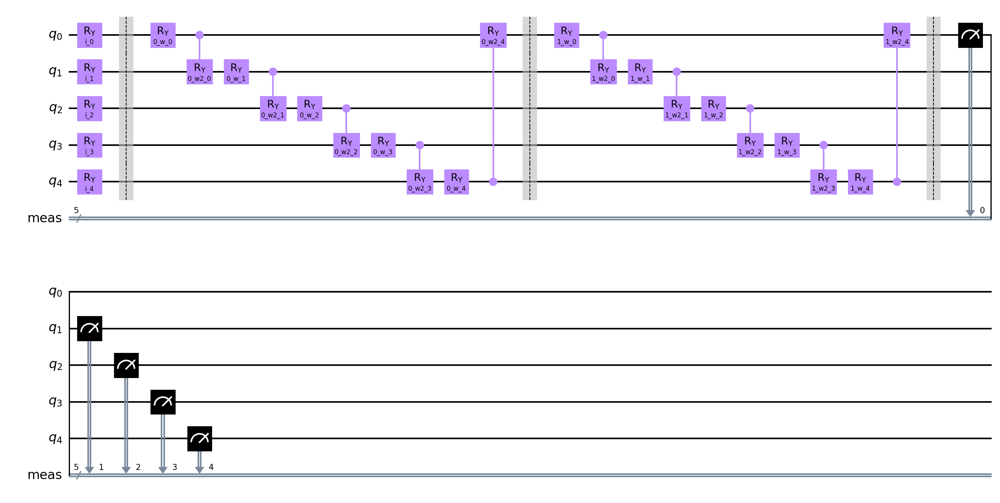
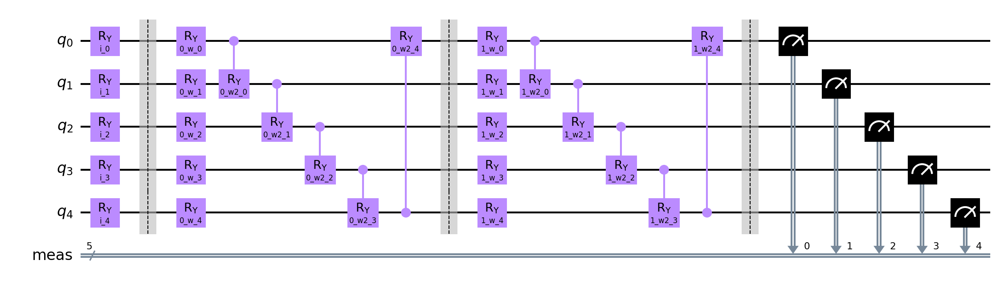

# Quantum Neural Network Classifier run

**Settings:**
Used Optimizer for Neural Network Classifier: `BFGS`
Layer count: `2`

## Quantum Circuits
Quantum Circuits plots for each dataset
| dataset | circuit | plot |
| :-----: | :-----: | :--: |
| vlds | qml_circuit_qiskit_01 |  |
| vlds | qml_circuit_qiskit_02 |  |
| vlds | qml_circuit_qiskit_03 |  |
| vlds | qml_circuit_qiskit_04 |  |
| vlds | qml_circuit_qiskit_05 |  |

## vlds
#### Average
| circuit | ø score train | ø score test | ø weights |
| ------: | :-----------: | :----------: | :-------: |
| circuit-00 | `0.70125` | `0.64` | `[1.15474288,0.29672271,0.49659811,0.56572279,0.75441978,0.35818792,0.72628067,0.47636337,0.48645104,1.08993633,0.90970113,0.10702592,0.94898967,0.37237021,1.00309392,0.38352805,0.91965694,0.54834636,0.56753173,1.17021681]` |
| circuit-01 | `0.70125` | `0.6050000000000001` | `[1.11144036,0.12931515,0.57580457,0.58377768,0.63279199,0.89077497,0.43101548,0.87786925,0.61225855,0.75696409,1.59027161,0.04450957,0.91652302,0.69375337,0.98370749,0.48939363,0.6576991,0.84648317,0.49013005,0.70865442]` |
| circuit-02 | `0.6725000000000001` | `0.6000000000000001` | `[0.5079432,1.16766221,0.13236392,0.10915604,0.00194819,0.23135173,1.37345737,0.33585356,0.50448277,0.017109]` |
| circuit-03 | `0.605` | `0.5650000000000001` | `[0.21668559,0.84706984,0.57353469,0.58305124,0.48923133,0.38560684,0.72189819,0.58531481,0.37660223,0.50117277,0.4841236,0.33544105,0.5727015,0.80362444,0.52977682,0.27855872,0.37005492,0.30469348,0.70621374,0.52632868,0.49987797,0.89437147,0.36298588,0.39414878,0.27978911,0.58993046,0.43893416,0.57460186,0.51292781,0.63754126]` |
| circuit-04 | `0.69625` | `0.615` | `[0.87800164,0.34899451,0.69810232,0.70718051,0.20621704,0.35595315,0.39646872,0.73583644,-0.00644485,0.88258779,0.39785607,1.23740354,0.2755878,0.28475242,0.58714489,0.23292849,1.59268078,0.50823349,1.32000881,0.53349705,0.36671419,0.46827617,0.69705789,0.85322271,0.56294655,0.38226942,0.49784183,0.56613612,0.37037619,0.50346441]` |

#### Per run data
| dataset name and run | circuit-00: score (train, test) and weights  | circuit-01: score (train, test) and weights  | circuit-02: score (train, test) and weights  | circuit-03: score (train, test) and weights  | circuit-04: score (train, test) and weights  |
| :----------: | :--------: | :--------: | :--------: | :--------: | :--------: |
| `vlds_40` | `[0.725,0.8]`, `[0.79156351,-0.01832138,0.33585856,1.39471514,1.33979035,0.51725805,1.09636576,0.1850349,1.12757209,0.41660908,1.3546261,-0.00291323,1.19305258,1.30825681,1.62737501,0.22437225,1.70526864,0.12650293,-0.04966773,0.00622383]` | `[0.625,0.7]`, `[0.48945716,0.19659443,0.1865768,0.73357853,0.12624342,0.35411582,-0.19683948,0.18946074,0.62287852,1.8824436,1.24185601,0.29424838,0.2183862,0.87557912,-0.12391207,0.31119075,-0.13779782,0.02428964,0.24243771,1.21541403]` | `[0.6125,0.8]`, `[0.68686182,-1.24853362,0.19478837,-0.88245256,0.05477702,-0.09156873,0.93341245,-0.0788358,-1.31934077,0.10570258]` | `[0.675,0.9]`, `[-3.01428071e-02,5.02133869e-01,8.63056141e-01,1.20550064e+00,3.24473112e-01,7.34932118e-01,-1.91306326e-01,-4.00769855e-01,1.04393496e+00,1.08063181e+00,3.44936642e-01,1.06313790e+00,3.91943450e-01,8.23945026e-01,9.95288336e-01,1.06092592e+00,3.03744519e-01,6.95254737e-02,1.11815583e+00,6.48190282e-01,4.92992523e-01,-2.17067351e-01,3.65459724e-01,5.88933663e-01,-5.61339050e-04,9.50058172e-01,6.70104259e-01,3.08395196e-01,5.53791576e-01,2.88038853e-01]` | `[0.7125,0.7]`, `[1.52046828,-0.08322686,0.70716567,-0.00666442,0.88375061,0.599009,0.51763824,1.74254671,0.14323792,1.16976783,0.78789005,1.63792856,1.04934159,0.92546203,0.87565546,0.33884687,1.38252186,0.64597502,-0.00403349,0.89304174,1.53855246,0.6683927,1.62091968,0.07685538,0.40805472,1.01557775,0.07154555,0.3831617,0.34079802,0.77185398]` |
| `vlds_41` | `[0.7625,0.65]`, `[0.16043987,1.15514265,0.3150071,0.15355884,0.91858596,-0.19301201,0.82397591,-0.28808945,0.6153726,1.57328341,-0.08361921,2.30367391,-0.66314392,0.42756754,0.77854449,-0.73878578,0.30035394,0.52052025,0.60993718,1.29058347]` | `[0.7625,0.65]`, `[0.26277446,-0.20009076,1.16437167,-0.02709778,0.60388233,1.65264628,0.47497037,1.47234276,-0.53713102,0.0552018,1.46483314,-0.95231865,1.41146999,-0.47812398,1.15759001,1.71229885,0.8584123,1.89079181,-0.66082421,0.24135417]` | `[0.6875,0.6]`, `[0.04112916,1.51694041,0.24518542,0.05739204,-0.04764035,0.3635389,1.55643464,0.62186583,0.91923449,0.04147695]` | `[0.675,0.5]`, `[0.12210888,-0.46432791,0.86965815,1.21149157,1.45670385,0.41466962,1.15694898,-0.24493975,0.34745224,0.37919743,0.73531736,0.86860462,1.11627958,0.05021817,0.37402687,0.58278078,0.62185177,-0.05185224,0.06185002,1.49860187,0.22557146,0.35897273,0.01993914,0.29845879,0.44436173,0.62075049,0.48854138,0.20938667,0.97599485,1.53724511]` | `[0.6875,0.6]`, `[-0.00954322,0.05112443,1.10405926,0.12968599,0.12889618,0.39346203,0.08045635,1.26068146,-0.90366147,1.56559558,0.62216455,1.40663307,-0.23553368,-0.24974041,0.20615808,0.03180881,0.39401299,0.65791421,0.00688615,0.98472514,-0.03373099,0.00873757,0.04220745,0.7994954,0.39844812,0.17273577,0.72110964,0.65562143,0.05948462,0.83659003]` |
| `vlds_42` | `[0.675,0.6]`, `[0.75350957,0.66837213,0.01792895,0.89269004,0.54449351,-0.19746265,-0.06452885,0.04904458,-0.00740311,0.93608308,0.3911613,0.54170605,-0.12640548,0.52288551,-0.23195971,0.65369322,-0.14882753,0.16778495,0.88028697,2.06205503]` | `[0.675,0.55]`, `[1.52070115,0.3384219,0.07704924,-0.11655596,0.90958586,0.37686077,-0.50188753,1.81922379,-0.29963969,0.45401032,1.68155643,0.19062645,1.52820434,0.06087112,2.00704618,0.06766677,0.26076482,1.3869553,-0.35313365,-0.11612005]` | `[0.7,0.55]`, `[0.2938356,1.32610884,0.21272312,-0.19210059,-0.06713734,-0.01546209,1.67273977,0.64121876,1.14464702,0.01980776]` | `[0.4375,0.5]`, `[0.35175764,0.68205439,0.44268079,0.67839994,0.42933579,0.15962763,1.08724129,1.02942392,-0.12059609,0.29835539,1.02567023,0.71696186,0.4541998,1.1268633,0.32592743,0.70175582,-0.03265344,0.59974242,0.59226357,0.43868378,0.91916797,0.34736074,0.58898887,0.31986917,0.96192713,0.45321207,0.26174307,0.54158505,0.02363888,0.65937682]` | `[0.65,0.6]`, `[0.12496746,1.25989484,1.20294703,-0.02662713,-0.89280935,0.49745388,0.48403176,-0.03693269,-0.00559408,1.0093717,0.73896674,0.8526933,0.27864641,0.04465277,0.9408779,1.06295262,1.88373167,0.96752544,-0.0251613,0.32154391,0.87029575,0.11404184,1.21602544,0.02934541,0.75448625,0.47254017,0.95642894,0.51872423,0.2975396,0.82600294]` |
| `vlds_43` | `[0.65,0.65]`, `[1.37248159,-0.5727823,0.60343688,0.23183736,1.58409271,0.0633115,1.88732144,1.01115702,0.74989758,0.17838431,1.54409186,-0.52080151,1.07726917,0.10593297,1.78934423,0.1714295,0.92389135,0.32303649,0.17347935,0.02484285]` | `[0.7625,0.7]`, `[1.68379187,-0.71907848,0.18078589,1.55837858,0.75539582,1.30016341,0.87943571,0.3029028,1.05328001,0.3326402,1.28334772,-0.40038995,-0.16024711,1.12814266,1.81453402,0.05525445,1.96855918,0.57533197,0.00591868,0.00407186]` | `[0.6625,0.65]`, `[0.45326176,1.54063957,0.13133444,-0.42890307,0.05066449,-0.00340847,1.43736985,0.66646749,1.32363993,-0.06577232]` | `[0.6,0.6]`, `[0.70250609,0.69462544,1.10202153,1.06335993,0.08803315,0.66954766,0.72977252,0.35985315,0.6429278,0.75926331,0.79917921,0.20227673,0.90424402,0.60825857,0.44881266,0.37453768,0.2161155,0.63949272,0.29539934,0.21046521,0.67475036,0.75751761,0.68619003,0.28307744,0.14509494,0.08913763,0.45930769,0.17357054,0.93500761,0.94218739]` | `[0.6875,0.6]`, `[0.41570113,-0.17253838,1.40664284,-0.03783652,0.50044396,0.17929005,0.8306006,1.67579321,0.27447968,0.46476104,1.15303901,1.53439148,0.47718052,0.58284075,0.10036618,0.60325438,1.49264598,0.80903649,0.00527374,0.44077267,1.36309474,0.51025471,0.98828291,0.00593563,0.88465797,0.37294156,0.77655476,0.59944154,0.17215962,0.16599457]` |
| `vlds_44` | `[0.6875,0.6]`, `[2.54731672,0.09751009,0.34695618,-0.04794153,0.02113307,0.01662992,1.12616896,1.97742378,-0.07767708,2.14414539,0.52309542,-1.17429589,2.42334359,-0.88951671,2.93097532,0.2048585,1.78285149,1.46704243,1.37541103,1.46595864]` | `[0.675,0.65]`, `[1.46451310e+00,-4.33187711e-02,1.49667750e+00,9.99506726e-01,8.66992027e-01,4.88947538e-01,1.77432048e+00,1.39213332e-01,9.65133432e-01,5.13781694e-01,1.88617591e+00,-1.18145689e-01,2.47102972e+00,5.51560446e-01,2.38956288e+00,1.83021328e-01,1.08550225e+00,3.13465698e-01,-2.05985642e-03,2.31015032e-01]` | `[0.6625,0.6]`, `[0.09721681,1.33826674,0.14787497,-0.27116013,0.02280525,0.30146102,1.6449582,0.43558281,1.14822716,-0.05655244]` | `[0.675,0.55]`, `[-0.0876623,2.42507255,1.74259542,-0.13422743,-0.26714131,0.62939598,0.80162981,1.63160757,-0.01035516,0.79348502,0.15336641,-0.1015331,1.52271698,0.51486075,0.08737443,0.10046663,0.44730536,1.38848595,-0.33598085,0.23536469,-0.19879052,1.09805785,-1.47483859,0.90623269,-0.76732493,0.57332639,0.36985471,0.97091274,1.0473105,-1.02551878]` | `[0.7,0.65]`, `[0.0749384,-0.00524392,0.05545336,-0.11291933,-0.47081049,0.12776997,-0.0903099,0.55597754,0.1843641,1.53974039,-0.19062703,1.1519585,1.54093984,0.09906696,0.38555312,0.02467891,2.78230668,-0.5021681,3.17472975,0.95682956,0.01440118,-0.04659359,-0.01875377,2.23890774,0.3281998,0.67657858,0.01498743,0.29469896,0.40942086,0.21134145]` |
| `vlds_45` | `[0.65,0.6]`, `[1.11005149,0.90837689,0.10443116,0.2349789,0.08544601,0.643908,-0.02819645,-0.29740904,0.35486815,1.32136882,1.72681635,0.28781903,-0.11961528,-0.21987736,-0.069239,0.02340011,-0.1801746,0.54430425,0.58914272,1.86992763]` | `[0.6625,0.6]`, `[0.97869683,-0.51632249,0.1385613,1.1984651,-0.01700761,1.18942429,1.63465189,0.45254421,1.87395906,1.11540637,2.22344319,-0.28951209,0.47117245,0.70214908,-0.13629949,0.17395425,1.2696371,0.27581768,2.13602422,1.21094466]` | `[0.6625,0.6]`, `[0.14050423,1.70217449,0.09971345,0.60211956,0.07927651,0.31311543,1.31849336,0.21581218,0.37159417,0.00800536]` | `[0.65,0.6]`, `[0.02221592,2.27109547,1.0813801,0.61367537,1.58573948,-0.16657965,1.54432379,1.60365837,0.01126773,0.46335511,0.64041679,-0.88597401,-0.34382953,0.05321899,-0.32524831,-0.36797376,0.78588406,0.51152771,-0.40460983,1.55756925,0.51046792,1.70124342,1.66835622,0.99296495,0.89337532,0.54592089,0.84302495,1.42251709,0.13500914,0.90210679]` | `[0.6375,0.6]`, `[0.25931611,0.7076874,1.21069855,0.99319856,1.51431552,-0.24908171,1.29169333,1.35451954,-0.01993401,-1.53631126,0.88718994,2.16637953,-0.33789414,-0.02312567,0.84762072,-0.34641662,1.68502944,2.21838609,1.18486216,0.3105715,-0.02325412,1.54889078,1.1764706,1.61230651,0.69206055,0.05726488,0.71230498,0.88532088,0.62627308,0.23106987]` |
| `vlds_46` | `[0.6875,0.65]`, `[0.7839697,0.85746189,1.31522386,0.60463475,0.41708717,-0.27901781,-0.0335464,1.10208906,0.43145478,1.10641876,1.06858095,0.6977172,2.11099327,0.31239811,0.44394788,-0.23540114,-0.20365643,1.01729444,0.94299592,1.75370461]` | `[0.725,0.55]`, `[1.81773526,0.78801079,1.61208223,-0.22774694,0.56924379,-0.03692543,-0.3792498,0.99282562,0.41315267,0.69047095,1.29298498,1.00261717,1.5981147,0.27661633,-0.60644864,0.83048688,-0.06342114,0.27332159,0.68130226,2.47122606]` | `[0.6875,0.55]`, `[0.21834581,1.40606986,0.1269166,-0.18804279,-0.04167318,-0.1000947,1.61373316,0.48915418,1.10228175,0.02054164]` | `[0.575,0.35]`, `[0.05971034,0.49437095,0.23094869,0.44409805,0.80027655,0.74349943,0.64249653,0.4011605,0.59215626,0.91785014,0.04457409,0.61355575,0.46279483,0.29461843,0.28947287,0.10673823,0.10411584,0.98508726,0.71259396,0.70495697,0.90558019,0.66723973,0.06757643,0.43431534,0.19822456,0.70879026,0.17283456,0.98315405,0.73870088,0.38416955]` | `[0.7,0.55]`, `[3.16880679e+00,3.26791276e-02,-1.63098196e-01,3.11067194e+00,-2.26927300e+00,-2.81750554e-01,2.68213605e-03,-4.49548522e-01,1.08424233e-01,1.60998523e+00,-3.32937050e-01,1.08551090e+00,-9.00919553e-01,4.21054353e-03,4.16178988e-01,-4.14816865e-02,3.81638747e-01,-3.47526380e-01,3.13505310e+00,2.50497120e-01,-1.12336615e-02,-1.64936948e-02,-8.51235911e-03,2.20034965e+00,9.33646406e-01,1.89939756e-02,8.05956061e-01,1.12421006e+00,9.06043468e-01,2.29577010e-01]` |
| `vlds_47` | `[0.7625,0.75]`, `[1.62533819,-0.01487079,0.67507002,1.01735317,1.02194643,1.11435327,1.38313147,0.16487349,1.06848749,0.33265159,1.32387091,-0.08258243,1.91851582,1.40562378,1.83194537,0.0174071,1.41106511,0.3933984,0.0375706,0.17373875]` | `[0.7,0.65]`, `[0.44758068,1.18773375,-0.04746428,0.07695193,1.30062349,0.11700951,-0.13800255,1.35797571,0.43169123,1.054215,0.63265321,0.90908864,-0.37698974,1.13851669,1.78684924,0.55374748,-0.26611203,2.07007194,0.94829507,0.26435375]` | `[0.675,0.65]`, `[2.01539818,0.86546899,0.17831266,0.41126946,-0.07926606,1.3603412,0.83333815,-0.09292684,0.65616597,0.14160617]` | `[0.6375,0.65]`, `[0.48056886,-0.26793034,-1.23445846,0.49523861,-0.48128378,-0.06535679,0.55307417,-0.09433598,0.51859726,0.18514842,0.22175962,-0.18940954,0.18273159,3.4308056,2.16799673,-0.47334463,-0.06962255,-2.18213139,3.71380844,-0.13602315,0.48191042,2.26734558,0.95270214,-0.18688106,0.47029701,0.81110709,0.06491731,0.34401979,-0.15757839,1.43972171]` | `[0.7,0.7]`, `[0.46285761,0.04406184,0.17042402,0.57703719,0.08460075,0.79123086,-0.05477928,0.2372924,-0.4237217,1.57332403,0.38712886,1.33260096,0.30895266,-0.24860482,0.37197248,-0.09959078,2.30514845,0.14305092,0.88703632,0.14667898,-0.05112974,-0.14469033,0.06364551,1.51607654,0.52403589,0.30256476,0.24983381,0.60445395,0.15697401,0.88637863]` |
| `vlds_48` | `[0.7125,0.5]`, `[0.44175029,0.15443425,-0.04542491,1.00315465,0.56641067,1.14456195,0.30913247,0.26235818,0.19520282,1.43774074,1.4677256,-0.28358496,0.44308318,0.40340225,0.56285976,1.29455502,1.24125055,0.2388861,0.57910504,1.47050477]` | `[0.7125,0.45]`, `[1.05701317,0.31879407,0.03660314,1.23664412,0.042868,2.46026267,-0.37762141,1.89575752,0.90367543,0.68132853,2.6340813,-0.12974077,1.42785355,0.91503743,-0.55178875,0.98586347,-0.08307449,1.40367331,1.64427421,1.58429743]` | `[0.7,0.45]`, `[-0.09802031,1.41887439,0.12256359,-0.5060095,0.04965741,0.52632968,1.59067211,0.57773194,1.31937078,-0.07578242]` | `[0.4625,0.45]`, `[0.58513312,0.64324604,0.81592899,0.50402969,0.88263076,0.71863024,0.54401691,0.94007767,-0.12288214,0.20536429,0.88273483,0.51044903,0.2603711,0.47302659,0.65172244,0.69521357,0.85367434,0.71192731,1.13916257,0.21960277,0.55174799,0.33046443,0.91041767,0.12226266,0.37686577,0.5787507,0.31114769,0.18563366,0.16765779,0.43397727]` | `[0.6875,0.4]`, `[0.76463775,1.77872452,1.43307298,2.08581601,1.57914347,2.79900605,0.49497077,1.02467159,0.05231966,-0.12619267,0.01837081,-0.14976989,-0.03602343,1.48408565,0.82022087,0.25425751,1.22656755,0.65187842,2.23511656,0.36645282,-0.00839149,1.55048974,1.77800951,-1.65212405,-0.0863882,0.24784445,0.73140239,0.13088989,0.32676686,0.70169586]` |
| `vlds_49` | `[0.7,0.6]`, `[1.96100782,-0.26809635,1.29749335,0.17224661,1.04521196,0.75134899,0.7629824,0.59715122,0.40673508,1.45267817,-0.21933802,-0.69647891,1.23280377,0.34702914,0.36714589,2.21975175,2.36454692,0.68469334,0.5370562,1.58462853]` | `[0.7125,0.55]`, `[1.3921399,-0.05759294,0.91280218,0.40565252,1.17009273,1.00524485,1.14037708,0.15644602,0.69558584,0.79014247,1.56178416,-0.06137778,0.57623606,1.76718482,2.09994149,0.02045209,1.68452085,0.25111271,0.25906609,-0.02001279]` | `[0.675,0.55]`, `[1.23089890e+00,1.81061245e+00,-1.35773420e-01,2.48944794e+00,-1.98184838e-03,-3.40734969e-01,1.13342199e+00,-1.17534960e-01,-1.62099280e+00,3.20567253e-02]` | `[0.6625,0.55]`, `[-0.0393399,1.49035798,-0.1784644,-0.25105402,0.07354566,0.01770211,0.35078419,0.62741253,0.86351941,-0.07092321,-0.00671916,0.55634131,0.77556318,0.66042902,0.28239472,0.00448698,0.47013384,0.37512962,0.16949439,-0.11412482,0.43538139,1.63257994,-0.15493281,0.18225414,0.07563091,0.56825093,0.74786602,0.60684379,0.70974529,0.81410791]` | `[0.8,0.75]`, `[1.99786609,-0.12321793,-0.14634229,0.35944286,1.00391277,-1.29685805,0.40770322,-0.00663679,0.52563722,1.55583609,-0.09262518,1.35570891,0.61118777,0.2286764,0.90684511,0.50097489,2.39320443,-0.16173721,2.60032507,0.66385704,0.00853777,0.48973201,0.1122839,1.70507887,0.79226394,0.48565232,-0.06170531,0.4648386,0.40830173,0.17413972]` |

