# Quantum Neural Network Classifier run

**Settings:**
Used Optimizer for Neural Network Classifier: `COBYLA`
Layer count: `2`

## Quantum Circuits
Quantum Circuits plots for each dataset
| dataset | circuit | plot |
| :-----: | :-----: | :--: |
| adhoc | qml_circuit_qiskit_01 | 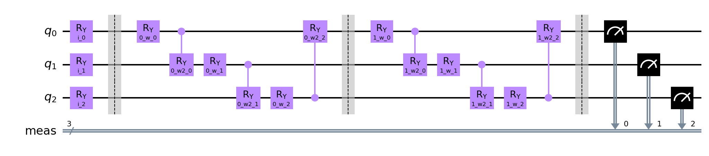 |
| adhoc | qml_circuit_qiskit_02 | 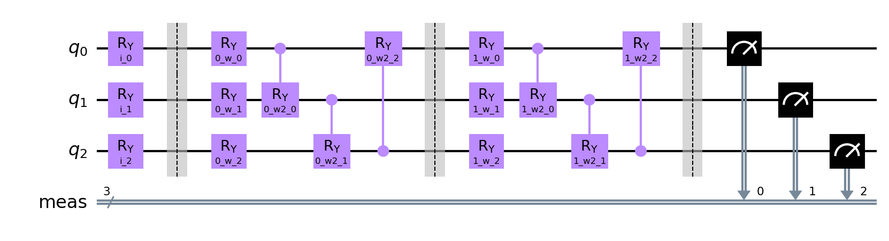 |
| adhoc | qml_circuit_qiskit_03 | 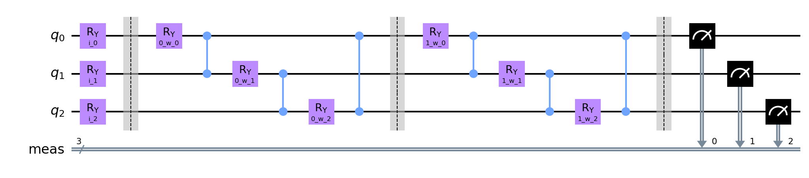 |
| adhoc | qml_circuit_qiskit_04 | 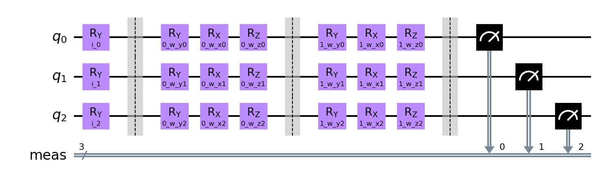 |
| adhoc | qml_circuit_qiskit_05 | 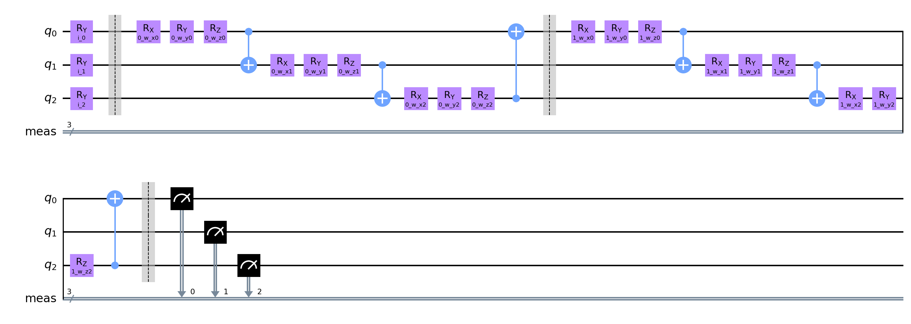 |
| custom | qml_circuit_qiskit_01 | 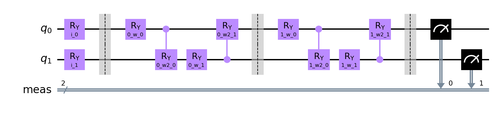 |
| custom | qml_circuit_qiskit_02 | 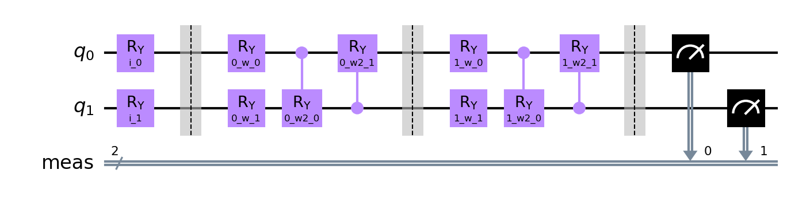 |
| custom | qml_circuit_qiskit_03 | 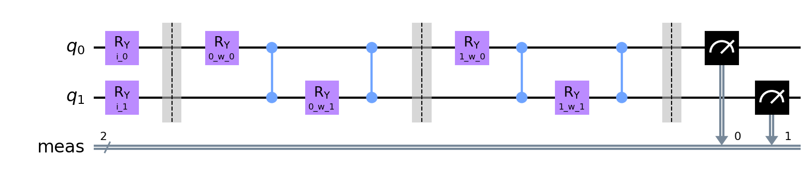 |
| custom | qml_circuit_qiskit_04 | 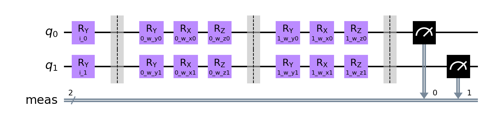 |
| custom | qml_circuit_qiskit_05 | 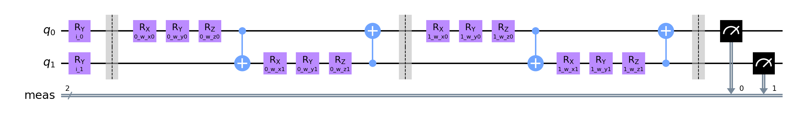 |
| iris | qml_circuit_qiskit_01 | 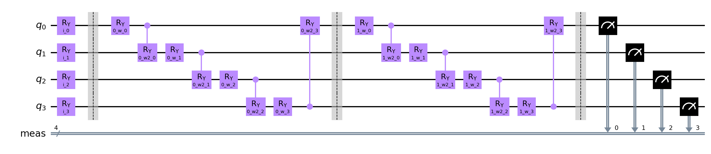 |
| iris | qml_circuit_qiskit_02 | 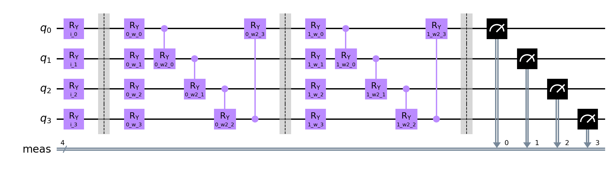 |
| iris | qml_circuit_qiskit_03 | 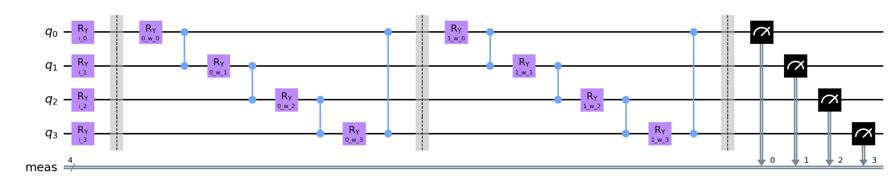 |
| iris | qml_circuit_qiskit_04 | 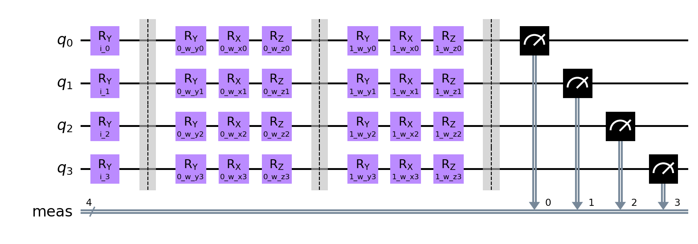 |
| iris | qml_circuit_qiskit_05 | 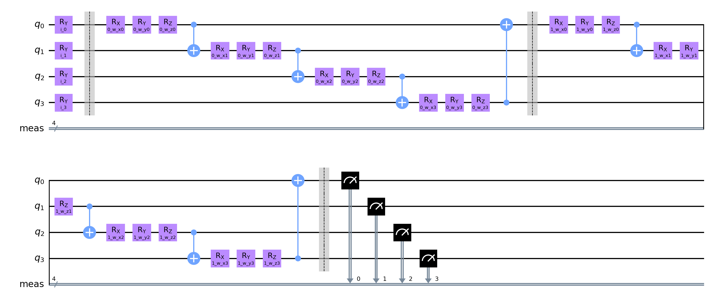 |
| rain | qml_circuit_qiskit_01 | 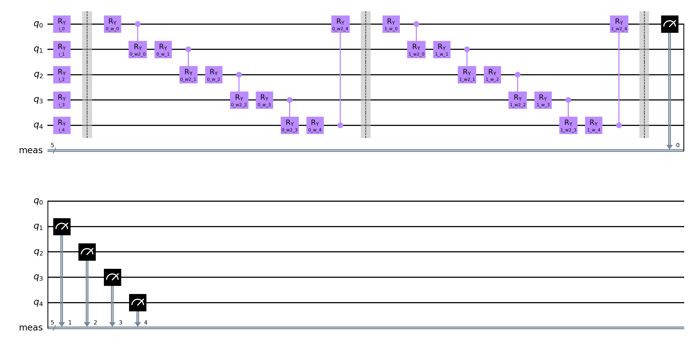 |
| rain | qml_circuit_qiskit_02 | 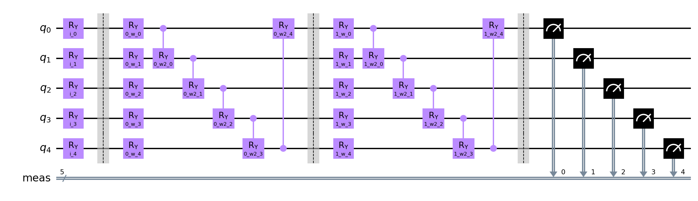 |
| rain | qml_circuit_qiskit_03 | 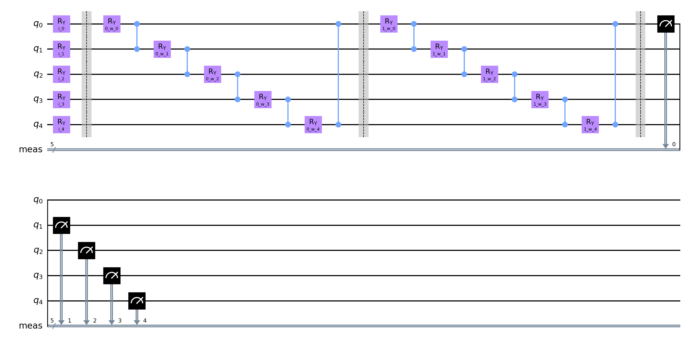 |
| rain | qml_circuit_qiskit_04 | 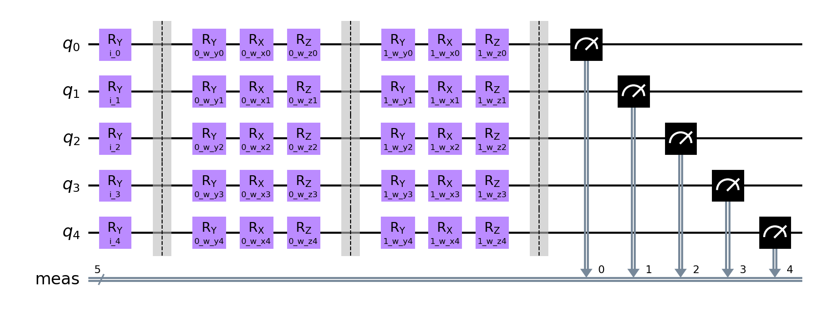 |
| rain | qml_circuit_qiskit_05 | 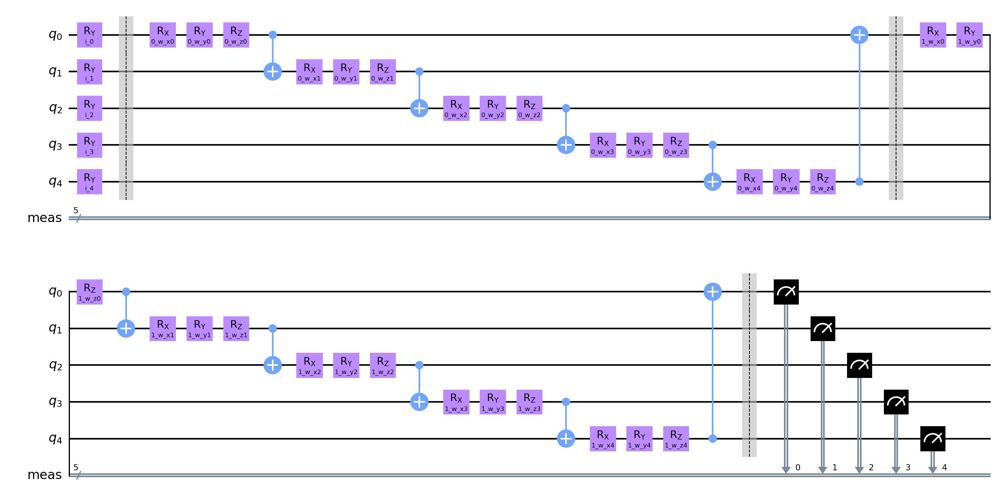 |
| vlds | qml_circuit_qiskit_01 |  |
| vlds | qml_circuit_qiskit_02 |  |
| vlds | qml_circuit_qiskit_03 |  |
| vlds | qml_circuit_qiskit_04 |  |
| vlds | qml_circuit_qiskit_05 |  |

## adhoc
#### Average
| circuit | ø score train | ø score test | ø weights |
| ------: | :-----------: | :----------: | :-------: |
| circuit-00 | `0.6375` | `0.35` | `[0.31287867,0.3753655,1.18029994,0.3197091,0.04675177,0.01560496,0.06382292,0.36185981,0.97157101,0.3190148,0.09587847,0.09818089]` |
| circuit-01 | `0.6875` | `0.5` | `[0.11460505,0.1485225,0.338855,0.33814804,-0.15682346,0.24978069,0.32488834,0.39934841,0.49456065,0.30413453,0.01867967,0.2142172]` |
| circuit-02 | `0.6875` | `0.5` | `[0.19706133,0.21005252,0.22688175,0.12231722,0.14932955,0.14772533]` |
| circuit-03 | `0.6875` | `0.4` | `[0.28114146,0.12742171,0.08546371,0.60839301,0.89317017,0.49910847,1.31025687,1.51060221,1.22835636,0.5777475,0.69659876,0.61473729,0.23636458,0.26813636,0.25359665,1.5001093,0.75803156,0.57836385]` |
| circuit-04 | `0.4625` | `0.3` | `[1.1596606,1.19550916,0.31879675,1.17652494,0.70386133,0.61251066,0.25752373,0.30405638,0.37881402,0.60709945,0.37380501,0.47363495,0.54919375,0.25389988,0.30680872,0.67673584,0.46739769,0.94596652]` |

#### Per run data
| dataset name and run | circuit-00: score (train, test) and weights  | circuit-01: score (train, test) and weights  | circuit-02: score (train, test) and weights  | circuit-03: score (train, test) and weights  | circuit-04: score (train, test) and weights  |
| :----------: | :--------: | :--------: | :--------: | :--------: | :--------: |
| `adhoc_30` | `[0.875,0.0]`, `[0.61263313,0.38773978,2.01589032,0.37949431,0.73240058,-0.34689181,-0.7299514,-0.143387,1.07076251,1.87634691,0.35898882,0.19282297]` | `[0.875,0.0]`, `[0.29184443,1.10248635,0.06524496,0.84773249,-1.35019229,-0.63920097,2.55824818,1.4524902,-0.19337225,-0.71258215,-1.14966783,-1.34229313]` | `[0.875,0.0]`, `[0.63576436,0.09618226,1.8866374,0.09067222,0.47337067,1.20938628]` | `[0.875,0.0]`, `[1.23561538,0.40207427,0.12515937,0.72403895,0.85158472,0.14028762,0.35576535,0.95233628,1.42326544,0.05878205,0.2078194,0.17347543,1.26330022,-0.44801143,-0.05796502,1.52468802,1.10971319,1.96434271]` | `[0.5,0.0]`, `[1.57394588,0.74822723,0.50084894,1.66315721,0.37529015,0.03478071,0.67931828,0.57712621,1.71008816,0.40154175,0.15949303,0.0813433,0.52006181,0.00893839,0.14696922,1.95080464,1.13002356,0.39597848]` |
| `adhoc_31` | `[0.375,0.5]`, `[0.21374908,2.21392329,2.19940806,0.64882124,-0.21456102,-0.05900937,-0.12836726,0.58746727,1.8395663,1.49987447,0.21392934,0.17197267]` | `[0.5,0.5]`, `[-0.43150079,-0.3118813,2.14188383,0.91686117,-0.09325556,0.02868338,0.5828791,0.27054988,2.48064839,-0.11947393,-0.01525722,-0.09966242]` | `[0.625,0.5]`, `[0.15844815,0.05947986,0.3448396,0.1513302,-0.33856032,-0.40811271]` | `[0.75,0.5]`, `[0.13512426,0.30595111,-0.40837964,0.24627408,1.89620765,0.21510599,1.32277381,1.14923037,1.1226391,0.33862615,1.9989056,0.31025515,-0.33225322,0.49074901,0.04486085,0.48762182,0.28637946,0.30517568]` | `[0.5,0.5]`, `[2.1192986,1.5495876,0.25098753,2.16271983,-0.22787126,0.79064372,-0.74613264,0.54116155,0.15158168,1.09404499,1.16160436,1.22340987,0.38927335,0.6260229,0.08516335,0.48804749,0.87710952,1.72247526]` |
| `adhoc_32` | `[0.5,0.5]`, `[0.36237818,0.25904103,2.38554054,0.67258234,0.28998891,0.57188101,0.08237496,0.01986279,2.50820534,0.13826338,-0.17773194,-0.23243815]` | `[0.625,0.5]`, `[-0.04428475,-0.42759958,0.13890221,0.72807775,0.21317988,0.33897855,0.183797,-0.02261268,-0.11374223,-0.21730145,0.02202489,0.22961815]` | `[0.625,0.5]`, `[0.3490813,0.12476868,0.30550727,0.06931756,0.24562534,0.03488496]` | `[0.625,0.5]`, `[0.9744164,-0.04141286,0.8621735,1.88327175,2.05910804,1.64309697,1.61778746,1.72498672,1.95354036,1.49758114,1.40903106,1.33955486,0.0858989,0.95636953,1.20917533,2.81609957,-0.93561779,-0.41318141]` | `[0.625,0.5]`, `[-0.14089893,0.09600265,0.16017076,0.51629326,0.52058989,0.25273978,0.08445596,0.42686523,0.38026361,-0.0336989,-0.05321322,0.19722268,0.03032371,-0.05752327,-0.14449708,0.53782423,-0.19735685,1.36272381]` |
| `adhoc_33` | `[0.375,0.5]`, `[0.94954927,-0.15456306,0.68369468,0.48007943,-0.15456686,0.43860606,0.15566352,0.43351314,1.7135378,0.23085492,0.34125159,-0.15545841]` | `[0.875,0.5]`, `[-0.37391639,0.01554985,0.67263671,-0.29003367,-0.40598875,1.24902942,0.14401646,-0.63173155,0.15686297,-0.14123656,0.89282571,0.45607011]` | `[0.875,0.5]`, `[-0.35216912,1.04019333,0.62628545,0.01175812,0.95829388,0.71369394]` | `[0.625,0.5]`, `[-0.18306506,-0.05835365,1.05104191,0.52345852,0.39223854,0.74112404,1.95334917,2.52202242,1.98260034,0.42590168,-0.24159231,0.07332545,0.51848813,-0.12559417,-0.96992093,1.25265939,0.645281,0.3040631]` | `[0.5,0.5]`, `[1.42133509,0.59226501,0.01517916,-0.15985034,0.50609345,0.21801308,0.21024823,0.15771513,-0.02573168,0.38806289,0.12388378,-0.0031924,0.49408958,0.04941827,-0.22236947,0.55212519,1.78808577,1.72941917]` |
| `adhoc_34` | `[0.75,0.0]`, `[0.2757595,-0.15872974,0.07175784,0.27142172,0.25498468,-0.60509033,-0.27397297,0.50119316,-0.23434621,-0.65387217,0.01505936,-0.60685123]` | `[0.75,1.0]`, `[0.00133411,1.1254683,0.15320486,-0.75541949,0.11211228,-0.51182155,-0.2127946,0.56279501,-0.17439573,0.36929999,-0.17031427,-0.2292546]` | `[0.75,1.0]`, `[-0.21734846,-0.49264279,-0.13436365,0.06295815,-0.68994013,-0.08449038]` | `[0.625,0.0]`, `[0.57144618,-0.0651965,-0.14652205,0.05423073,-0.01138857,-0.28213859,2.32559246,0.30566343,0.24876502,1.06003891,0.44252416,0.17674407,0.26789737,-0.00679862,0.19962458,1.9216388,3.16322087,0.83189693]` | `[0.125,0.0]`, `[1.45722838,2.30381237,0.56713988,0.77384931,1.19709936,0.85205667,1.01683148,0.12459382,0.83526012,0.96340475,0.46070633,1.314966,0.97983991,0.54129676,1.7583515,0.75955168,0.63442505,0.08670639]` |
| `adhoc_35` | `[0.75,1.0]`, `[-0.34880488,-0.2091835,0.33285553,0.53929794,-0.46333803,-1.28381194,0.50165231,0.74094863,-0.18411087,-0.52590298,0.32770592,-0.14126938]` | `[0.5,1.0]`, `[0.78822727,-0.5577061,-0.11217354,0.06844501,-0.08646709,-0.54048971,0.69529061,0.1581549,0.38853985,-0.19808371,0.45994775,-0.41906881]` | `[0.5,1.0]`, `[1.00947568,0.33878721,0.20640309,0.42603881,0.22310499,0.11067942]` | `[0.75,1.0]`, `[0.3665045,-0.26136033,-0.59951126,-0.2027588,-0.091355,-0.08046253,1.40743709,2.16903783,1.73729062,-0.19256952,-0.35949804,1.31581077,-0.36748409,0.33347791,0.8316696,2.02888773,0.29364834,0.89274881]` | `[0.375,0.0]`, `[0.56296357,2.48971164,-0.50977869,0.6103277,1.16118489,1.39625911,-0.18854852,0.97523445,0.29408643,1.10442664,0.78910076,-0.13083439,0.4873829,0.43067817,0.47784103,0.20290615,0.48763677,0.75754942]` |
| `adhoc_36` | `[0.75,0.5]`, `[-0.17068546,0.82213296,-0.11650567,-0.44882649,-0.02947102,0.33549532,0.51919149,-0.09805187,1.31554743,0.01698858,0.19288141,-0.72656696]` | `[0.75,0.5]`, `[-0.01784673,-0.15754831,-0.41201729,-0.43159165,-0.51572922,-0.46792151,-0.22803256,0.45172754,0.48417949,0.16496732,0.52987894,0.09773186]` | `[0.625,1.0]`, `[-0.29892324,0.25256599,-0.49447534,0.05003506,-0.03194387,-0.2484658]` | `[0.75,0.5]`, `[0.02155099,0.3492317,-0.33091913,1.63473102,-0.3035033,-0.43743255,1.03819466,1.22388122,1.50130852,2.14043363,-0.57829988,0.06533657,0.56069307,-0.23216819,0.40416189,1.89713444,0.90045092,0.29609043]` | `[0.625,1.0]`, `[0.1476851,1.43604844,0.51231332,1.28838401,1.86141279,0.61569615,0.37938895,-0.30901995,0.09356739,0.30278317,0.25727431,0.73318991,1.3366806,-0.01310765,0.66837545,0.34303716,-0.24959532,0.26627155]` |
| `adhoc_37` | `[0.75,0.0]`, `[0.15779533,-0.21752315,0.661406,0.80547144,-0.21079413,0.72553921,-0.15049567,-0.48435052,-0.16790334,-0.01480407,0.15454451,0.5148201]` | `[0.625,0.5]`, `[0.2521252,-0.42000802,0.01030151,0.16407463,-0.20275217,0.57343775,0.23198208,0.12288152,0.68383585,0.45767593,-0.04820004,0.11938968]` | `[0.625,0.0]`, `[0.47880976,-0.14409655,0.23762677,0.12379557,-0.07422305,0.42327528]` | `[0.625,0.5]`, `[-0.01451569,-0.39917972,-0.40508137,0.86380243,0.44185729,-0.08858156,1.93826399,1.85410673,-0.22610167,0.25359033,0.4595897,0.36486476,0.09600515,0.54374986,0.66979852,0.84666666,0.42227823,0.51049613]` | `[0.625,0.5]`, `[2.56562335,0.7320034,-0.22668325,1.23358019,0.58243575,0.0470276,0.35257656,0.41435465,-0.00419519,0.99966597,0.66538479,1.11700259,-0.22732831,0.75040846,0.12259697,1.56463438,0.50041384,1.35613386]` |
| `adhoc_38` | `[0.75,0.5]`, `[0.86496797,0.21624273,2.84869208,-0.5881758,0.69502261,-0.46917733,0.04738017,-0.12238938,2.43686082,0.20200813,-0.45478246,0.10148977]` | `[0.75,0.5]`, `[0.00682774,0.84919946,0.78646034,1.56414286,0.16167547,2.58855057,-0.65398961,1.85327837,1.46713992,2.81135666,0.16934831,2.81214955]` | `[0.75,0.5]`, `[-0.59907926,0.36202851,-0.4201838,-0.14010204,-0.07573997,-0.05681114]` | `[0.75,0.5]`, `[-0.35756434,0.07887188,0.04679288,-0.15202872,2.08031163,1.56378618,1.07212429,1.46999437,1.40320242,0.42954152,1.87916865,1.92216289,0.08808891,-0.10173363,0.43727229,0.72321313,0.97811276,0.65882236]` | `[0.125,0.0]`, `[1.4435427,0.32998411,1.99553777,1.48417933,-0.47020723,2.25255155,0.68523072,-0.01191029,-0.230378,-0.17966445,0.21577004,0.16218025,0.14674578,0.18316297,0.26908517,0.35602444,0.01540424,0.6133249]` |
| `adhoc_39` | `[0.5,0.0]`, `[0.21144453,0.59457466,0.72025998,0.43692482,-0.432148,0.84850875,0.61475408,2.1837919,-0.58240969,0.42039078,-0.01306188,1.86328751]` | `[0.625,0.0]`, `[0.6732404,0.26726439,-0.0558936,0.56919133,0.59918284,-0.121439,-0.0525133,-0.22404908,-0.23408974,0.62672321,-0.50378959,0.51749161]` | `[0.625,0.0]`, `[0.80655415,0.46325867,-0.28945929,0.37736852,0.80330797,-0.21678655]` | `[0.5,0.0]`, `[0.06190196,0.96359121,0.65988294,0.50891012,1.61664069,1.57629911,0.07128046,1.73476276,1.13705348,-0.2344509,1.74833924,0.40584291,0.18301134,1.27132327,-0.23271064,1.50248346,0.71684865,0.43318374]` | `[0.625,0.0]`, `[0.44588226,1.67744917,-0.07774788,2.19260887,1.53258548,-0.3346618,0.10186834,0.14444296,0.58359767,1.03042771,-0.04195409,0.04106166,1.33486816,0.01970376,-0.09342891,0.01240304,-0.31216973,1.16908241]` |

## custom
#### Average
| circuit | ø score train | ø score test | ø weights |
| ------: | :-----------: | :----------: | :-------: |
| circuit-00 | `0.6125` | `0.65` | `[0.94542097,0.58836954,0.52097231,0.45515678,0.94899644,0.37359874,0.29470876,0.44156362]` |
| circuit-01 | `0.725` | `0.65` | `[1.02980771,1.43642025,0.19200991,-0.23878286,1.13211222,1.08293435,0.02580046,0.16181772]` |
| circuit-02 | `0.6875` | `0.7` | `[-0.09566143,0.18213771,0.12845175,-0.2130159]` |
| circuit-03 | `0.7` | `0.7` | `[0.52576035,0.04981695,0.94463702,0.90031807,1.64556473,1.48908734,0.94282451,1.16322842,0.79177076,0.52407425,0.50698178,0.81811532]` |
| circuit-04 | `0.575` | `0.55` | `[0.22772968,1.60878846,0.44588067,1.03721875,1.2958289,0.59469096,0.900061,0.64604383,0.7077712,0.87150358,1.10824683,0.66100517]` |

#### Per run data
| dataset name and run | circuit-00: score (train, test) and weights  | circuit-01: score (train, test) and weights  | circuit-02: score (train, test) and weights  | circuit-03: score (train, test) and weights  | circuit-04: score (train, test) and weights  |
| :----------: | :--------: | :--------: | :--------: | :--------: | :--------: |
| `custom_10` | `[0.75,1.0]`, `[1.97508815,1.61220374,1.62316269,2.08744852,1.7805215,1.77393843,2.32203067,2.30600263]` | `[0.75,1.0]`, `[2.31750761,2.40185537,0.57424963,-0.38353165,1.57268603,1.52642286,-0.57605066,0.62576709]` | `[0.75,1.0]`, `[-0.9776144,0.4685213,0.34306863,-0.44344208]` | `[0.75,1.0]`, `[0.15427628,-0.20694415,-0.02732593,0.67300892,2.48551207,0.65249237,0.4388137,0.4891072,0.40723939,-0.56193721,-0.36612297,1.30809863]` | `[0.5,1.0]`, `[-0.55184473,1.85916123,-0.22271272,0.93281376,2.29946261,0.29587693,1.68829897,-0.11818637,0.2327726,1.97649368,1.89578174,0.60735818]` |
| `custom_11` | `[0.625,1.0]`, `[2.04122044,1.46508317,1.80449012,0.25000502,0.36057276,1.83861126,0.66052811,0.70997242]` | `[0.875,1.0]`, `[1.2192529,2.52320319,0.6804043,-0.07683819,1.08359105,1.94928068,0.54738673,0.09078384]` | `[0.875,1.0]`, `[0.09188142,-0.17400957,0.45033252,-0.31907392]` | `[0.75,1.0]`, `[0.00403197,-0.22540424,1.00948789,0.9850731,1.50812283,2.57661133,-0.43659179,0.21279881,0.27637328,0.77329067,2.06077974,0.80597209]` | `[0.625,0.5]`, `[0.21388246,1.26553664,0.62984794,0.26015587,1.2922188,0.92955416,0.95124573,0.23953103,0.03615565,0.5731464,0.43555639,0.84178458]` |
| `custom_12` | `[0.375,0.5]`, `[0.22767003,0.6407426,0.78734251,-0.06924124,0.20182383,0.68377736,0.76235906,0.03861032]` | `[0.5,1.0]`, `[1.9946516,1.69765558,0.17492159,0.0625633,1.9111213,0.67115891,-0.70226773,0.96508566]` | `[0.5,1.0]`, `[-0.55276161,0.58388631,-0.08985449,0.24631505]` | `[0.5,0.5]`, `[-0.13316221,-0.90083017,0.66974173,0.66949273,1.44551351,0.65585198,1.30700874,0.97448752,0.14834348,0.7012176,0.28106598,1.77604295]` | `[0.5,1.0]`, `[1.11395869,1.82255982,1.17723413,0.97722048,0.83356604,1.1022325,0.72626497,0.50987184,1.74939834,-0.13970825,1.42801123,0.75331858]` |
| `custom_13` | `[0.5,0.5]`, `[1.31290536,0.4477733,0.36013572,1.47128002,2.08099819,-0.20616695,-0.2349147,0.52826308]` | `[0.75,0.5]`, `[0.56902473,2.60454242,-0.1790014,-0.09848788,2.45930809,1.99192761,-0.6942279,0.3398876]` | `[0.75,0.5]`, `[-0.46674078,0.10394893,-0.49739759,-0.01609913]` | `[0.75,1.0]`, `[1.13884369,0.47431212,1.0779412,0.50842439,0.6617759,1.97145959,1.99540975,1.29356647,1.98271035,0.69046687,0.15118498,-0.17262317]` | `[0.5,0.5]`, `[0.16781004,1.56410502,0.58079476,0.27980362,1.71571153,0.65178934,0.28556016,1.83684716,0.69776523,0.80955694,0.42208619,1.26193724]` |
| `custom_14` | `[0.75,1.0]`, `[2.80304247,0.33154888,0.13135521,-0.26653712,1.93882045,-0.15904911,-0.05864709,-0.14197631]` | `[0.875,0.5]`, `[1.99761442,1.52413411,0.5793879,-1.07960802,2.40001456,1.95922054,0.15896691,0.48343137]` | `[0.75,1.0]`, `[-0.08354744,0.21890775,0.18513923,-0.77871896]` | `[0.75,1.0]`, `[0.24379988,-0.28228857,0.28830516,2.14407431,2.18884699,1.33660917,0.17500149,2.9205745,0.06615266,0.38450556,0.26218353,0.2714455]` | `[0.875,0.5]`, `[-1.36909364,2.09082732,0.39669151,0.78675296,1.7690149,0.9250572,1.694658,0.90382711,0.70823207,2.29294627,0.69086047,1.55394965]` |
| `custom_15` | `[0.5,0.0]`, `[-1.06830723,0.69261069,0.05573134,0.48208263,0.04622326,-0.56792386,0.45194452,0.83991863]` | `[0.75,0.0]`, `[0.71352116,-0.70426348,1.02386129,-0.79941291,0.85537778,-0.36747226,0.55523435,-1.06278982]` | `[0.75,0.0]`, `[0.79315365,-0.36860438,1.22510494,-0.27084349]` | `[0.75,0.0]`, `[-0.08389587,1.18408329,1.05129359,0.86164899,1.56282127,2.06680553,-0.57617541,1.53042427,0.35529816,2.17822691,-0.18324843,-0.33776175]` | `[0.5,0.0]`, `[0.62268331,1.67541036,0.95119377,0.99892445,0.20919693,0.0850137,0.55953324,-0.10031571,0.8040732,0.51824666,1.2022188,0.52773384]` |
| `custom_16` | `[0.625,0.5]`, `[0.06076096,0.22171617,0.27430092,-0.53928763,0.53864636,-0.14976329,0.23420995,0.30661605]` | `[0.75,0.5]`, `[-0.57344178,0.53209357,-0.49637404,-0.2620594,0.0748372,-0.44776251,0.32346404,0.00425303]` | `[0.625,0.5]`, `[0.61815808,-0.570566,-0.29308637,0.10404888]` | `[0.625,0.5]`, `[0.95450141,-0.04135864,1.41857356,0.87529155,1.6542321,1.59925919,1.77343371,1.42069601,1.75845432,0.3061159,0.88790311,1.82868222]` | `[0.25,0.5]`, `[0.28447142,1.03208096,0.11969121,1.56079639,2.17701371,1.35037025,1.86316627,1.17627804,1.45857621,1.96193518,1.92872458,0.25574895]` |
| `custom_17` | `[0.5,1.0]`, `[2.05708853,0.24746974,0.37756954,0.36035689,1.73613772,0.27040642,-0.23728667,0.61407515]` | `[0.5,1.0]`, `[-0.28755765,-0.48533966,0.25003724,0.20546724,-0.17271216,0.2772997,0.38784259,0.00828559]` | `[0.375,1.0]`, `[0.25919052,0.69020863,0.12105299,-0.1424848]` | `[0.625,1.0]`, `[1.4779581,1.07317996,1.88023074,1.18231663,1.66663914,1.88825824,1.51309916,1.50208366,0.74883098,0.49752948,0.41476735,1.98946286]` | `[0.75,1.0]`, `[0.20469017,2.23392606,0.17416174,1.32500214,0.25200737,0.40427283,0.06805858,0.19112122,0.07812983,0.05257567,0.51013335,0.57478619]` |
| `custom_18` | `[0.75,0.5]`, `[-0.02827424,0.55076091,-0.14118727,0.38207055,0.58939133,-0.20622272,-0.6500737,-0.14614858]` | `[0.75,0.5]`, `[0.30451599,2.76292372,-0.40091099,0.06761824,0.97809303,2.39821704,-0.01029086,0.09350786]` | `[0.75,0.5]`, `[-0.62892773,0.54879025,-0.01749536,-0.26060847]` | `[0.75,0.5]`, `[0.38234679,-0.50687612,0.92987896,0.47148079,1.53272487,0.60067393,1.63205686,0.53311931,1.20880001,0.36524513,0.62955779,0.37441072]` | `[0.625,0.0]`, `[0.86925637,0.28431759,0.34832905,1.20528914,1.89618541,0.15520318,0.10927343,0.97986057,1.01062607,-0.14805498,1.84106739,0.5251402]` |
| `custom_19` | `[0.75,0.5]`, `[0.07301521,-0.32621379,-0.06317772,0.39339017,0.21682903,0.45837991,-0.30306252,-0.63969715]` | `[0.75,0.5]`, `[2.04298815,1.50739772,-0.28647638,-0.02353936,0.15880528,0.87105094,0.26794711,0.06996499]` | `[0.75,0.5]`, `[-0.00940604,0.32029391,-0.14234697,-0.24925202]` | `[0.75,0.5]`, `[1.11890342,-0.06970397,1.1482433,0.6323693,1.74945862,1.54285205,1.60618886,0.75542643,0.965505,-0.09391845,0.93174673,0.33742315]` | `[0.625,0.5]`, `[0.72148272,2.25995955,0.30357535,2.04542866,0.51391171,0.04753947,1.05455066,0.84160339,0.30198282,0.81789822,0.72802818,-0.29170576]` |

## iris
#### Average
| circuit | ø score train | ø score test | ø weights |
| ------: | :-----------: | :----------: | :-------: |
| circuit-00 | `0.675` | `0.6` | `[0.31679922,0.06310736,0.39656558,0.34929014,0.43398135,-0.07244479,0.6488051,0.85382827,0.13047949,-0.00302047,0.8218097,0.31426395,0.30528711,-0.03121523,0.18231941,0.54909845]` |
| circuit-01 | `0.6833333333333333` | `0.7` | `[0.31806456,0.19139214,0.41206284,0.62777584,0.39714487,-0.31528185,0.6861706,0.91999365,0.30765783,0.22323099,0.4987239,0.63387397,0.71946517,0.16819713,0.28090304,0.64814898]` |
| circuit-02 | `0.7249999999999999` | `0.7333333333333333` | `[0.91753884,-0.0294624,1.03177177,0.66056038,0.39360266,0.07384853,0.38260893,0.58665801]` |
| circuit-03 | `0.825` | `0.8333333333333333` | `[0.13041035,0.58730932,0.2620204,0.34319431,1.02723153,0.73492805,0.70220753,1.04601198,1.70852052,1.1893808,0.58924287,1.1326243,0.6399419,1.2861146,0.01570715,0.45149766,0.12445202,0.60855061,0.71934111,0.58326575,0.80179688,0.83324765,0.98591356,0.96101348]` |
| circuit-04 | `0.5583333333333333` | `0.4666666666666667` | `[0.64124639,1.30061164,0.69668946,0.76416772,0.8560978,0.74549012,1.29325031,0.81076502,0.52026481,1.06608584,0.89795841,0.86850518,0.78227823,0.78887313,0.29130731,0.30009217,0.67314419,0.80781697,0.16658542,0.29303926,0.74095121,1.06724786,0.89840684,0.63646738]` |

#### Per run data
| dataset name and run | circuit-00: score (train, test) and weights  | circuit-01: score (train, test) and weights  | circuit-02: score (train, test) and weights  | circuit-03: score (train, test) and weights  | circuit-04: score (train, test) and weights  |
| :----------: | :--------: | :--------: | :--------: | :--------: | :--------: |
| `iris_20` | `[0.6666666666666666,0.3333333333333333]`, `[-0.08089988,0.64887231,0.72703028,0.27251157,0.16541377,0.14023172,0.83204477,1.79243251,-0.15092574,-0.33968297,2.13000081,0.21724494,0.49906844,0.06844262,-0.09803958,0.35910433]` | `[0.6666666666666666,0.3333333333333333]`, `[0.05277438,1.77734144,-0.68799418,1.73746646,-0.01571427,-0.16395546,0.45073406,0.4320784,-0.04539322,0.47120675,0.25652017,1.95842303,2.3630966,0.55336071,0.69547589,-0.0779163]` | `[0.75,0.3333333333333333]`, `[0.80917206,0.07510221,1.72164608,0.09671885,0.08877714,0.20062332,0.44303839,0.68920361]` | `[0.9166666666666666,1.0]`, `[0.38317706,0.18790251,0.34809204,-0.1042294,1.26206434,0.17368648,0.27965323,1.64677952,2.1366761,0.48514895,0.17657982,1.82419104,0.93964586,-0.02005975,0.10155825,0.31073573,0.7899216,-0.13466516,1.50719254,0.18458818,1.28099541,1.20018296,0.50373544,0.42809822]` | `[0.5833333333333334,0.6666666666666666]`, `[-0.02781165,1.16600643,0.31721295,2.11304142,1.27406852,1.06163474,1.33907482,0.36785165,0.46936799,1.22802367,1.73152667,1.91085618,0.7316581,1.17701011,0.15470241,0.82548015,1.17587542,1.03128439,0.25232702,0.65413564,0.62533389,1.62061568,0.01678624,1.43663518]` |
| `iris_21` | `[0.9166666666666666,0.6666666666666666]`, `[0.7668484,-0.2737782,-1.00333632,0.75214409,0.7233197,-0.39415474,0.90032317,1.37051849,0.539136,-0.31754112,-0.1251764,1.01140753,0.42269868,-0.18955803,0.90797142,-0.8310186]` | `[0.6666666666666666,0.6666666666666666]`, `[0.98298792,-0.67253444,-0.14196225,1.62697248,0.3905903,-0.31117263,0.73423817,1.90580252,0.28924505,0.11426063,0.10470392,2.09786845,2.16489272,-0.09320301,-0.18537691,-0.06367881]` | `[0.9166666666666666,0.6666666666666666]`, `[0.50865725,-0.29290267,1.72432926,0.49191073,0.06914975,0.03135541,0.61994355,0.53348003]` | `[0.75,0.6666666666666666]`, `[0.11468256,0.16506672,0.44228588,0.10304731,1.68416828,0.31489849,0.43102677,1.07923434,1.01773507,1.53678389,0.16171587,1.28232034,0.90170404,0.27725353,0.00585389,0.54142056,-0.88642004,-0.19601714,1.95367439,-0.19894337,1.53716237,2.15959446,0.56464675,-0.17693313]` | `[0.4166666666666667,0.3333333333333333]`, `[0.99118467,0.98204362,0.47824325,-0.03668378,0.32322226,0.41150298,1.71013068,0.30311489,0.95112406,0.90581229,0.64533751,0.83180727,-0.12102116,0.15300948,-0.22498096,-0.00179585,0.77129699,0.6996344,-0.05662282,0.0124275,0.00284722,0.17547862,0.67303063,0.96203729]` |
| `iris_22` | `[0.5833333333333334,0.6666666666666666]`, `[-0.22987336,-0.03381188,-0.2088999,0.03104428,0.79947437,0.667434,2.25924426,-0.13117579,-0.21139025,-0.99129237,0.20690108,-0.24108002,-0.32925227,-0.54717099,0.18574359,0.7820011]` | `[0.4166666666666667,0.3333333333333333]`, `[0.82420747,0.02567806,0.52955001,0.81491674,0.57901314,-0.77011915,0.21191711,0.85296765,1.25218085,0.14856869,0.08548838,1.99139727,1.83815092,-0.48967805,0.31539235,-0.2134553]` | `[0.6666666666666666,0.6666666666666666]`, `[0.51743953,-0.16345919,1.23211444,0.92722068,0.31311119,0.09990014,0.49277397,0.69116951]` | `[0.8333333333333334,1.0]`, `[0.43244211,1.1329906,0.58082221,0.07640675,1.42295624,1.12715927,0.79377314,0.15824128,2.27340754,2.18804471,-0.25944242,-0.34560298,0.89260245,1.42758323,0.19821912,0.19497732,0.51973994,0.59032022,1.48303086,0.70140075,1.68757325,0.18646646,2.39215503,2.97348768]` | `[0.5,0.3333333333333333]`, `[1.18118775,2.20735745,0.02672019,0.25602326,1.82249733,1.21174723,0.20448371,1.37817827,1.07123359,2.16608041,1.23284534,0.53841191,1.57453365,1.90028319,1.60984247,0.23501964,0.08988094,0.47856318,0.31531566,0.88340954,0.9645922,1.14296866,1.96377016,0.39730818]` |
| `iris_23` | `[0.4166666666666667,0.0]`, `[-0.16236151,-0.05880932,0.66675792,0.22708668,-0.07828029,-0.2784363,0.99423433,1.27370572,-0.12582581,0.54768996,1.65184878,0.69675415,-0.32533689,0.27761783,-0.34228485,1.12435659]` | `[0.8333333333333334,0.6666666666666666]`, `[0.36420361,2.34361687,-0.14691979,0.23423616,0.44789814,-0.61060509,1.4815562,0.06067617,-0.03574527,0.6896511,-0.71765928,0.05373765,-0.02078905,0.70013533,0.0480332,1.03327763]` | `[0.8333333333333334,0.6666666666666666]`, `[0.58661277,-0.23308853,1.05736419,0.71250139,-0.05312303,0.1528042,0.52439337,0.69804311]` | `[0.8333333333333334,1.0]`, `[0.04196904,0.1505315,-0.0114195,1.24879174,1.0444064,1.51385791,0.06396608,1.51296761,1.38815869,1.24083446,0.28271384,2.24027003,0.51522892,2.03256768,-0.11344129,2.20776339,-0.04343731,1.65978857,1.15234138,1.98683189,0.07887354,-0.24392126,0.40875615,0.35791463]` | `[0.5833333333333334,1.0]`, `[1.32515925,1.7697919,1.56721485,0.14544051,-0.06026975,0.11845726,1.14215387,1.23533245,0.12044541,0.19834943,0.7602567,0.21322428,0.67129237,0.96948054,0.32172319,0.07687967,0.4511379,0.19934345,-0.22772313,0.15175511,1.90515255,0.09434797,0.5124637,-0.12097178]` |
| `iris_24` | `[0.6666666666666666,0.3333333333333333]`, `[0.51336394,0.00745013,0.72966272,0.46572288,0.07483822,-0.42925014,0.43015449,0.10247473,0.19396714,0.35688151,1.11495726,0.17235515,-0.05794874,0.1100568,1.88526329,-0.17934023]` | `[0.75,1.0]`, `[0.13364607,0.17870639,1.09397568,1.04928902,0.6047846,-0.20199227,0.34986769,1.7893157,-0.02634755,0.7801232,1.45330491,0.30858716,-0.1021903,0.33732687,0.334907,0.45715106]` | `[0.5833333333333334,0.3333333333333333]`, `[1.75724002,0.01908041,1.21454274,0.24244903,0.84779221,-0.10105671,0.04690836,0.20804805]` | `[1.0,1.0]`, `[0.02613824,-0.08146077,0.43714414,0.78355797,0.85098751,1.25164356,1.29277009,0.18253321,1.65683095,1.61061792,1.49472349,-0.06609015,0.69413899,1.17837723,-0.28821795,-0.02610813,0.03033002,0.29003929,-0.46512496,1.68911123,0.21165343,1.9006317,2.7028788,1.5506089]` | `[0.5833333333333334,0.3333333333333333]`, `[0.70827439,0.96262529,0.10934367,2.48076832,0.52866031,0.806057,1.72041036,1.24954161,1.21111074,0.89233602,0.42885402,0.13994886,0.7598876,0.44237983,-0.2452292,0.20561909,0.72681242,1.16357676,0.31612289,0.0123614,0.10275077,1.56178208,2.38669567,0.37244576]` |
| `iris_25` | `[0.75,0.6666666666666666]`, `[-0.10306421,0.28447137,-0.61857531,0.20875638,0.54499815,-0.01759508,-2.16164557,0.65502184,0.97299472,0.60832584,-0.54792001,-0.16254485,-0.40798574,-0.04273225,-1.24206008,1.06075098]` | `[1.0,1.0]`, `[1.39529220e+00,-1.34946216e+00,-2.84834885e-02,-2.83890214e-01,2.47781604e-01,-5.26845828e-01,7.73297485e-01,2.47045659e-01,8.83728171e-01,4.51457276e-01,-6.67100077e-04,4.07490528e-01,-1.28188333e-01,-4.48491790e-02,9.42587270e-01,7.29379196e-01]` | `[0.5833333333333334,0.6666666666666666]`, `[0.94730698,0.16579654,0.0643676,1.22183201,0.08192468,0.01424278,-0.38113881,1.30037998]` | `[0.8333333333333334,0.6666666666666666]`, `[0.20387364,0.59526694,-0.17449578,0.00587264,0.03183784,-0.06247213,0.52461575,1.11779059,2.31712196,0.50708051,1.46142405,1.84081674,0.0989838,1.11712088,0.07701087,0.46460145,-0.23116931,2.81293437,0.03066374,0.0751849,1.12259407,0.15745204,1.04617443,1.35109082]` | `[0.6666666666666666,0.3333333333333333]`, `[2.40797842e-01,6.83507725e-01,1.94950977e+00,8.59611025e-01,1.33016940e+00,1.33444726e+00,1.51936019e+00,6.66741598e-01,6.60033833e-04,5.95113755e-01,6.78782950e-01,4.98833655e-01,1.57247589e-01,1.75681908e-01,5.38519166e-01,3.50138609e-01,9.98867105e-01,5.31424892e-01,3.02628984e-01,-9.26821109e-02,5.80053522e-01,1.43742938e+00,5.82723956e-01,8.96342623e-01]` |
| `iris_26` | `[0.5833333333333334,1.0]`, `[1.81789053,0.34130948,0.62078517,0.97908635,1.27235901,0.00508074,0.30452636,0.15740053,0.14688163,-0.15176176,-0.69896147,1.67905968,1.90406182,-0.54094231,0.25665422,0.20745063]` | `[0.5833333333333334,1.0]`, `[-0.27058674,0.01973226,2.30703441,0.85223972,-0.17994685,-0.57292367,0.36605089,0.5554595,0.1620229,-0.49070607,1.92580478,-0.04562852,0.63897537,0.59048254,0.1856431,2.38618136]` | `[0.5833333333333334,1.0]`, `[1.37813959,0.19061404,0.28712856,0.93522185,1.4407427,0.16151546,0.52760524,0.15558145]` | `[0.6666666666666666,1.0]`, `[-0.03814406,1.40185952,0.0995915,0.37000145,0.63817451,-0.32978311,0.50819276,1.35461959,1.61461376,0.682442,0.85281403,2.13990923,0.38795901,1.61327538,-0.04521984,0.87853837,-0.12508796,0.02510767,-0.10576496,0.38924453,-0.32649774,0.43908191,-0.4244373,0.28797287]` | `[0.5833333333333334,0.6666666666666666]`, `[0.74013969,1.31500382,0.91193321,1.05692991,1.24531352,0.39519021,1.52353619,0.64543746,-0.21764208,1.6583879,0.73490967,0.68936861,0.63865047,0.23840093,0.0447923,0.08359977,1.16716436,0.7006272,0.32054119,0.24993327,0.71553333,0.28235792,0.74326344,0.34369722]` |
| `iris_27` | `[0.75,1.0]`, `[0.48079162,0.15252242,1.79564198,0.65238484,0.07521977,-0.31515465,1.45099181,1.1947153,0.00668884,0.12477887,2.27073476,0.19472869,0.51678486,0.29921471,-0.23759207,0.84882391]` | `[0.75,1.0]`, `[-0.46183179,-0.26645979,-0.68562333,0.00271833,0.6693465,-0.67928196,0.57287428,0.72525654,0.35406925,-0.12874023,-0.78637058,-0.49268395,0.23998397,0.49575757,1.1218512,0.66311881]` | `[0.8333333333333334,1.0]`, `[1.30983353,-0.06322,1.24015792,0.50659103,0.08637969,0.05007927,0.43510866,0.32612448]` | `[1.0,1.0]`, `[0.55690353,0.63435186,0.42007739,0.23174496,1.62351786,1.35465523,1.27963562,1.13790212,2.10281311,1.79839891,0.11413626,0.58721518,1.21776405,1.32855856,-0.39175751,-0.36159723,0.74366599,0.19935883,0.0722953,0.42202537,1.62149492,2.14778611,2.09001396,1.75455601]` | `[0.5,0.3333333333333333]`, `[0.7455053,0.89650536,0.24241871,0.11064118,1.3117111,1.24868115,1.79361636,0.31933166,0.43818322,0.7767176,0.36245085,0.90727822,0.98388346,1.04884648,-0.21287237,0.1662468,0.26135626,0.96384282,0.28898235,0.57447733,0.64973055,0.00355757,0.47831664,0.53116435]` |
| `iris_28` | `[0.5,0.6666666666666666]`, `[0.06809194,-0.03826558,1.34331954,0.28057986,0.93111452,-0.34633024,0.97601273,1.56713425,0.07502302,0.23488273,2.42737076,-0.33622037,0.02418061,0.3271817,-0.23822769,0.96304154]` | `[0.4166666666666667,0.3333333333333333]`, `[-0.0518691,-0.19104661,0.47215365,0.20909865,0.10058473,-0.10893911,0.65490748,0.77953535,0.04583649,0.38691136,0.54642952,-0.12707043,0.38004349,0.40867378,-0.10327198,1.81714302]` | `[0.6666666666666666,1.0]`, `[0.5863412,0.07184738,0.72721804,1.60963291,0.42495793,0.19937021,0.94080148,0.12298693]` | `[0.5,0.3333333333333333]`, `[-0.01050628,0.88964315,0.11835337,0.34384388,0.55768465,0.0690809,1.21650374,0.57608026,1.03948753,0.46012194,1.66140417,-0.38192664,0.03285555,2.04996513,0.59930799,-0.40646883,-0.0405271,0.19291979,0.29100368,0.21792075,0.45295703,0.50940377,-0.0305141,0.46144297]` | `[0.4166666666666667,0.0]`, `[0.00852701,1.50962445,0.60813878,0.50966419,0.66596003,0.79653835,0.81932369,0.96325142,0.24372695,1.16934772,2.0498186,1.31169403,1.61919561,0.68438362,0.59526027,0.71058916,0.76109406,1.66911696,0.2802851,0.19930196,0.58046661,2.53011371,1.25672964,0.7560213]` |
| `iris_29` | `[0.9166666666666666,0.6666666666666666]`, `[0.09720476,-0.39888714,-0.08673025,-0.37641552,-0.16864373,0.24372679,0.50216465,0.55605515,-0.14175467,-0.10248536,-0.21165861,-0.08906541,0.80660037,-0.07426243,0.74576581,1.15581428]` | `[0.75,0.6666666666666666]`, `[0.21182161,0.04834943,1.40889773,0.03471108,1.12711083,0.79301671,1.26626269,1.85179904,0.19698164,-0.19042277,2.11968425,0.18661855,-0.17932369,-0.77603524,-0.54621074,-0.24971083]` | `[0.8333333333333334,1.0]`, `[0.77464542,-0.06439415,1.04884885,-0.13847464,0.63631435,-0.0703488,0.17665508,1.14156295]` | `[0.9166666666666666,0.6666666666666666]`, `[-0.40643229,0.79694122,0.35975273,0.37290583,1.15651763,1.93655389,0.63193809,1.69397126,1.53836046,1.38433469,-0.05364041,2.20514026,0.71853635,1.85650414,0.01375796,0.71111396,0.48750439,0.64571968,1.27409913,0.36529327,0.35116253,-0.12420163,0.60572643,0.62189584]` | `[0.75,0.6666666666666666]`, `[0.49949964,1.5136504,0.75615922,0.14624113,0.11964529,0.070645,1.16041321,0.9788692,0.91443816,1.07068958,0.3548018,1.64362875,0.80745465,1.09925516,0.33131583,0.34914463,0.32795645,0.6407557,-0.12600302,0.28527295,1.28305143,1.82382705,0.37028828,0.78999372]` |

## rain
#### Average
| circuit | ø score train | ø score test | ø weights |
| ------: | :-----------: | :----------: | :-------: |
| circuit-00 | `0.5625` | `0.6` | `[0.30461516,0.85675557,0.17762857,0.12672626,1.02061252,0.48858201,0.39265841,-0.0521925,-0.11724994,0.26600129,0.45002037,0.62570254,0.18467265,0.24224174,0.94409824,-0.17367501,0.27234283,0.20066455,0.10119828,0.37811484]` |
| circuit-01 | `0.6375` | `0.45` | `[0.55997965,0.31637258,0.30197966,0.36553926,0.32705253,0.43292345,0.44719501,0.27956697,-0.00384502,-0.07828586,0.24080119,0.63652766,0.62938215,0.10041155,0.44933046,0.34535385,0.20514108,0.10158961,0.33010331,-0.06157458]` |
| circuit-02 | `0.8125` | `0.6` | `[0.57422777,0.08886649,0.089772,-0.14501401,0.11013676,0.19126668,-0.03412716,0.08559678,-0.06052096,0.05812196]` |
| circuit-03 | `0.775` | `0.6` | `[0.11173689,0.17414933,-0.10320484,0.30002933,-0.04804803,0.75255847,0.70175766,0.93277845,0.68271547,1.00016517,1.60755634,1.4267663,1.68224155,1.59183793,1.40061418,0.77802528,0.90638455,0.78279699,0.90318732,1.00615394,0.55150853,0.6277524,0.20731914,0.25852477,0.66229109,0.98559357,0.64693656,0.66007062,0.56074671,0.6195858]` |
| circuit-04 | `0.0625` | `0.05` | `[0.5092854,0.68457229,1.0252734,1.0552637,0.46539413,0.70780254,0.79220519,0.57914278,0.49455362,1.26055233,0.68151975,1.03349849,0.73967976,0.48662508,0.86644307,0.57714654,0.5089607,0.9150665,0.7209827,0.32835282,0.52195854,0.67090549,0.40186324,0.51535738,0.14267996,0.79919227,0.79217645,0.8839455,0.69821972,0.72450301]` |

#### Per run data
| dataset name and run | circuit-00: score (train, test) and weights  | circuit-01: score (train, test) and weights  | circuit-02: score (train, test) and weights  | circuit-03: score (train, test) and weights  | circuit-04: score (train, test) and weights  |
| :----------: | :--------: | :--------: | :--------: | :--------: | :--------: |
| `rain_0` | `[0.5,1.0]`, `[0.04590045,-0.2859711,0.27706041,-0.2869485,-0.08666722,0.50615696,-0.44493531,-0.21840892,-0.65766953,-0.72629659,0.46175907,0.79381221,0.22633728,-0.15894708,-0.09959995,0.10265588,-0.00493629,0.05606806,0.02298491,0.64860794]` | `[0.5,0.0]`, `[0.53182407,0.98171553,-0.37368944,-0.01953127,1.25140581,0.54248507,0.15011388,1.56942167,0.25224817,0.07230546,-0.37646289,2.7454617,0.6410719,0.1204157,0.77619929,0.37681276,0.21175411,2.06505502,-0.76831375,-0.30644326]` | `[0.625,1.0]`, `[1.78128927,0.53928732,0.19952125,0.04516686,-0.12178147,0.42058482,0.12879564,0.37044881,0.35174607,-0.11182213]` | `[0.625,1.0]`, `[-5.28560041e-01,8.78646848e-01,1.76578804e-01,-3.92481812e-01,1.20960046e-01,2.29691619e-01,1.06938293e+00,9.83740914e-01,-5.92811544e-01,1.89002051e+00,7.66532896e-03,1.84781022e+00,1.86484121e+00,1.67118770e+00,1.10364768e+00,2.41783898e-01,1.38193978e+00,9.93566269e-01,-4.51344940e-02,2.25267005e+00,5.26194367e-01,3.62680671e-01,1.86323150e-03,4.82545958e-01,7.96664473e-01,1.60455413e+00,2.02710560e+00,1.31435015e+00,8.91105502e-01,2.12610160e-01]` | `[0.0,0.0]`, `[0.27283336,0.24700897,1.96199425,1.34114586,0.00658238,0.03386444,0.76260714,0.42931016,0.53426641,2.03988216,1.73213004,0.53139204,1.20392932,0.13938988,1.84775164,0.55455417,0.48691712,0.80921537,0.44682125,1.09726091,0.61532608,1.05948015,0.84488072,-0.02454721,0.80660594,1.68858171,-0.02152306,1.56180497,0.07264529,0.25147157]` |
| `rain_1` | `[0.625,0.5]`, `[-0.14702449,-0.30079386,-0.41831524,1.65763267,0.90475236,0.25631122,1.14606476,0.96119447,-0.44614305,2.90926428,0.08407981,0.3344156,0.16064162,2.05014417,0.74242331,-0.88377839,-1.01674657,-0.88449888,0.28717007,3.26408294]` | `[0.625,0.0]`, `[-0.28172887,-0.0186217,0.05730423,0.16895543,-0.35673206,0.8043682,0.56767027,-0.35117427,-0.53171337,-0.78346632,1.0544639,1.89665092,0.4041459,-0.0725952,0.42380375,-0.35376331,-0.90919773,0.30833301,-0.06095774,0.45481106]` | `[0.75,0.5]`, `[0.14307951,-0.25292577,0.28545475,-0.15767765,-0.08568016,0.0430736,-0.39050394,0.04294698,-0.18055751,0.10587046]` | `[0.75,0.5]`, `[0.76379118,-0.19528299,-0.40594509,-0.18396791,0.142974,0.94544168,0.08203014,0.31320765,1.1438597,1.86503717,1.68151366,2.20010865,1.93371982,1.0520257,1.12822924,0.97060555,0.17065431,0.04342911,2.03961185,2.13609032,-0.27160999,0.36701613,0.35227397,1.75639029,0.70603474,0.69131975,0.63157722,0.80389156,0.88876381,0.87552683]` | `[0.25,0.0]`, `[0.75194362,0.20679162,0.99919098,0.71077025,-0.4788021,0.10315957,1.41080483,1.27128093,0.45228151,1.07372505,0.94090433,0.41832892,0.72234903,0.45993678,0.97461023,0.6857116,0.30642775,0.95292889,0.92186174,0.53627646,1.37152477,0.56321731,0.41256345,1.00467675,0.15904435,1.86852289,1.43058741,0.20781511,0.69668687,0.71835709]` |
| `rain_2` | `[0.75,0.5]`, `[0.11542771,2.27429579,-0.11167544,0.01605724,2.11685635,0.80617728,0.09216307,-0.87547325,0.36838196,-0.0633259,-0.12393878,2.55174705,-0.08662513,0.33408257,2.81817385,-0.58519176,0.04421295,0.96442216,-0.53211971,-0.06336386]` | `[0.5,0.5]`, `[0.08578286,-0.54053678,0.12099266,0.76717239,-0.40657807,-0.34597952,-0.10343724,0.14463379,0.14814767,0.02065043,-0.38291677,0.36110716,0.16464115,-0.1211512,0.37056514,0.26165593,0.389731,-0.08898547,-0.44056339,-0.24722246]` | `[0.75,0.5]`, `[-0.05612724,-0.00054405,-0.00280161,0.05759936,-0.02737207,0.21600278,0.05810512,0.05937486,-0.3208752,-0.13598621]` | `[0.5,0.5]`, `[-0.24516697,-0.12963999,-0.36741024,0.36257095,-0.44199312,0.63261586,0.25057156,0.95206959,1.03346623,1.13960587,2.22307151,1.65755438,1.84849428,1.91493725,1.31456622,0.61813912,0.14361419,0.7222698,1.02574716,1.30816712,0.53520078,0.0808275,0.71280983,0.22297075,-0.04931047,0.34585138,0.68224216,0.21134218,0.10139063,0.00412719]` | `[0.0,0.0]`, `[0.9442889,0.51456504,1.87635551,1.26734133,-0.09334372,0.86504201,0.8759119,0.43214551,0.22650855,2.31057519,0.36088197,0.75644923,0.23560548,0.82802596,0.20595129,0.12320847,0.3385246,0.97796516,0.59475646,-0.01939342,0.73273781,0.23064325,0.45700455,-0.10229589,-0.0232434,0.16291728,0.62328678,0.70461463,0.03235596,1.0891779]` |
| `rain_3` | `[0.5,0.5]`, `[0.04708984,0.90144306,-0.24058473,-0.45954425,-0.04324631,-0.11462445,-0.01285746,-0.73367566,0.35732099,-0.43723897,0.29883837,0.35615223,-0.07777295,0.49542134,0.3678974,0.66002037,-0.1989273,0.30709019,-0.47376606,0.28936154]` | `[0.875,0.5]`, `[0.69781941,0.34992777,0.62272604,0.15349495,0.26671204,0.32038116,-0.647936,0.22394058,-0.44807592,0.1485104,-0.24362224,0.35358887,0.56944214,0.01672369,0.74282625,0.05035161,0.2657072,0.15125072,-0.21696442,-0.25924331]` | `[0.875,0.5]`, `[0.65138448,-0.12856767,0.19463234,-0.55830867,-0.07728172,-0.06933487,-0.19793063,0.04821403,-0.04755761,-0.06948111]` | `[0.875,0.5]`, `[0.39069276,0.11895,-0.00582125,0.06567935,0.38648984,0.41988936,1.24423906,0.32819002,-0.43279535,1.18366756,2.71107322,0.94058924,1.68049897,2.61906998,1.5616622,0.36908812,2.19877253,0.12685798,0.02985285,1.69923966,-0.18350867,1.74641241,-0.15212624,-0.09804803,2.29412927,1.6975079,0.25760677,0.30576804,0.4345844,1.77659838]` | `[0.0,0.0]`, `[0.70184398,1.45687738,1.47563993,1.10044908,0.36910997,1.10904415,0.22971696,0.61397693,0.18359094,1.56009507,-0.01837,0.59201848,0.47667345,0.29460798,0.89977058,1.69317472,1.40288104,0.11326465,1.36202176,-0.05530793,0.3368665,1.64888413,0.76158119,1.93847535,0.04943314,0.6412423,0.3229482,0.14609341,0.04583696,2.31436917]` |
| `rain_4` | `[0.625,0.5]`, `[1.32863375,0.35968723,-0.01662609,0.10422745,2.25771534,1.74511423,1.64356183,0.63813293,-0.01729506,-0.030718,0.36990442,-0.12373038,-0.1992044,0.15070769,1.5586775,-0.61862567,3.05207673,-0.39988978,-0.20262175,-0.05756909]` | `[0.625,0.5]`, `[1.69177817,0.3716564,-0.23609122,1.29872501,-0.34183699,-0.06899003,2.3713858,0.51509596,-0.46362514,-0.05254996,0.40941366,0.62866799,0.55874956,0.85388635,0.38647024,0.13468702,2.16123408,-0.70168866,0.62678229,-0.25959648]` | `[0.875,1.0]`, `[0.13719501,-0.24487883,0.07441315,0.01202515,0.0801525,0.71563445,0.06219043,0.13668549,0.02149045,-0.25528926]` | `[0.75,1.0]`, `[0.20220515,0.8019154,0.21679718,0.86549336,0.11922651,0.73410427,0.78636589,0.41241,0.82257426,1.74698699,1.92745247,1.93659771,1.39468194,2.4702428,1.29495378,0.56106648,1.1451431,-0.02821415,0.95202324,1.75401956,-0.19303625,0.14888395,-0.17776319,0.69802937,0.44178722,1.83414531,0.29600096,0.33495134,0.29742225,0.7197867]` | `[0.25,0.5]`, `[0.605406,-0.25058365,0.25598582,0.16047395,0.08983355,0.41716367,0.66416644,0.26605272,-0.035143,-0.20958752,0.58491357,0.77384326,0.81904121,0.67061218,0.08936805,-0.02365753,-0.13807351,-0.05698115,0.12446294,0.47634935,0.54000184,0.17760098,0.10460764,0.17571313,0.2035641,2.10723205,0.88051241,0.09310559,0.3121532,-0.17304534]` |
| `rain_5` | `[1.0,1.0]`, `[-0.09347746,0.47853403,0.16613327,0.20383293,2.37524389,0.80970975,0.27010718,0.24842426,-0.03493032,-0.20669428,0.07273492,-0.10766448,0.41531435,0.13411471,1.53315213,-0.13509559,0.01592175,-0.56395646,-0.53716721,0.01175442]` | `[1.0,1.0]`, `[0.30551909,-0.04945177,-0.02551771,-0.29510646,0.0364662,0.32691252,0.83572324,0.14514623,-0.66589493,-0.05325449,-0.88596424,0.00106659,-0.6075605,-0.24740238,-0.34832237,0.27346777,-0.50068969,-0.19325462,0.29729231,0.28197213]` | `[0.75,1.0]`, `[0.61085415,0.3034304,0.08376643,0.01193703,-0.07954175,0.06789908,0.4482351,-0.12446942,-0.28652324,0.03317584]` | `[1.0,1.0]`, `[5.24147393e-02,-1.25306106e-02,-5.59972092e-01,2.48510343e-01,-1.06024108e-01,-2.27292665e-04,4.85727061e-01,1.08727382e+00,1.30413104e+00,3.35025430e-01,-1.03138917e-01,1.39265152e+00,1.46967575e+00,1.40660517e+00,1.78783163e+00,-1.72297991e-01,1.37776857e-01,1.24834080e+00,1.36138687e+00,2.41980440e-01,5.25651916e-01,1.11378200e-01,-1.64919629e-02,-8.56285662e-01,2.98032312e-01,-7.75054649e-01,1.17038669e-01,-1.93472422e-01,9.03511838e-02,-7.15788351e-02]` | `[0.0,0.0]`, `[0.41349846,1.70535436,1.24607074,2.27412844,0.96943076,0.62286288,0.47240333,0.49077849,0.28369901,0.48996711,1.35564065,1.58748571,0.28979704,0.62613393,0.95198865,0.62525576,0.60038626,1.5560119,1.40260164,0.39031724,-0.10463436,0.09252306,0.05718425,0.11770291,-0.17246097,0.43828385,0.76089082,1.84355498,0.91361302,1.48232508]` |
| `rain_6` | `[0.25,0.5]`, `[-0.11800084,0.38283577,1.76202274,0.88094783,-0.18993082,-0.2947479,0.43374336,0.11237511,0.70738974,0.29077178,0.55730598,0.57705214,1.87380248,-0.32593483,0.33625127,0.34784169,-0.10464887,0.16977525,1.93758807,-0.43432392]` | `[1.0,1.0]`, `[0.17977993,0.56691988,-0.23752662,0.46947543,-0.14433177,0.13855648,0.28787303,0.10887261,-0.26240484,-0.45176777,0.06871507,0.34643982,0.80990188,-0.01206624,0.30162214,0.56818867,-0.08794225,-0.14696943,0.00884211,0.33703354]` | `[1.0,1.0]`, `[0.36381609,-0.03285069,0.10777899,-0.19273273,0.03545478,0.0806305,-0.06100313,-0.05851361,-0.0011417,-0.10292856]` | `[0.875,1.0]`, `[0.1354752,0.81408715,0.38573911,0.42902227,0.18761964,0.18502296,-0.26579929,1.38081844,0.82430228,1.63191984,1.81614447,-0.58042174,2.05142949,1.55493898,1.49068304,-0.03289182,-0.19377992,1.08775457,0.90666233,1.71998169,-0.17247154,0.93083041,0.50611281,-0.5393049,1.34654556,1.12023814,0.25109157,0.64199148,1.92782791,1.27986596]` | `[0.0,0.0]`, `[0.39089776,0.55374697,0.32865835,1.79255973,0.00258661,0.7899342,1.34785457,0.24614792,1.20622842,2.2173234,0.03615121,1.38118469,0.6265154,1.04775664,-0.07586079,0.58797327,-0.02716097,1.79207864,0.14393561,0.01200196,0.6262126,1.22645059,0.12507249,0.26675984,-0.25841292,0.41267397,1.15848204,1.53225324,1.47557161,-0.47500426]` |
| `rain_7` | `[0.625,1.0]`, `[0.2440964,1.22387142,0.70833693,-0.47131259,0.32750353,-0.33067141,-0.39819366,-0.34534995,0.02199836,0.53656071,0.22698718,-0.22837685,-0.44673241,-0.69308481,-0.05796175,-0.52115924,-0.27647443,0.19991368,-0.42374549,0.03521574]` | `[0.75,0.5]`, `[-0.30457884,0.86589901,-0.14802963,0.45851301,1.82996755,1.0008028,0.05713426,-0.12858732,-0.17454105,0.06432151,0.00513189,0.22779818,0.38102483,-0.56994565,1.24474752,1.84564785,-0.01288329,-0.16484744,0.2346995,0.09980908]` | `[1.0,0.0]`, `[0.37347817,0.26068827,-0.28435049,-0.15295757,1.08270822,0.80193836,-0.09272926,0.24437656,0.00956142,0.45917249]` | `[1.0,0.5]`, `[0.43258926,-0.04227926,0.11152856,0.73051407,-0.01484746,1.40657539,0.3759443,0.95104667,0.12671888,0.34669366,1.69624999,1.88006969,2.04943098,0.00744647,0.12829086,2.02323147,0.66908151,0.82006453,-0.40189016,-0.37947159,2.17461911,0.38447294,0.12793169,-0.22531082,-0.03581425,0.47520295,0.51847284,0.14755183,-0.15969272,0.24828392]` | `[0.0,0.0]`, `[1.28163647,0.23970288,0.83975412,0.05734172,1.67505654,0.79777606,0.65732857,0.53051695,0.90011441,0.93053433,0.71972607,2.06477453,2.02423867,0.604914,0.28343946,0.47096656,0.62652289,-0.07470392,0.49044104,0.15264331,0.59170453,0.38456444,1.15614468,0.57808029,-0.14282901,0.31730004,0.53718339,0.47373374,1.07693912,0.54771349]` |
| `rain_8` | `[0.5,0.5]`, `[0.61768553,1.28855927,0.00224483,-0.52615551,1.46040404,1.72997881,1.90814452,-0.79244763,-0.57839468,0.48072544,1.45222546,0.29397645,0.09115401,0.31550184,2.07001034,0.30382883,1.92215791,0.12032662,0.36360214,-0.15000121]` | `[0.25,0.0]`, `[0.33014036,0.42492891,0.7359349,0.88570386,0.71270546,0.24208825,-0.71218233,0.84990085,-0.46013105,-0.17273517,0.50319983,-0.30644975,0.20114332,0.5463742,-0.05087232,-0.01301493,0.12609381,-0.33146631,0.16825566,-0.42905599]` | `[0.625,0.5]`, `[1.99831472,0.63342354,0.43188576,-0.14712716,0.24910151,0.02967139,0.19979959,0.02987986,0.1293139,0.61116187]` | `[0.5,0.0]`, `[0.17730345,-0.1970634,-0.43779978,0.75552118,-0.86942764,1.65388964,1.56825593,2.38642742,1.3383977,0.00313447,2.23049436,1.24968105,1.15840583,1.26511531,2.36079323,1.55556416,1.99292486,2.25533985,1.75482167,-0.72271401,1.05698947,0.48455649,0.74042054,0.05806854,0.86155503,1.67579404,0.48498815,2.18939136,0.64587427,0.43796206]` | `[0.0,0.0]`, `[0.12946744,0.39023311,0.89171207,0.95517616,0.44147403,1.24841779,0.46430059,0.72241623,0.45898547,0.93595403,0.46879253,0.55210764,0.2740833,0.04414305,1.45829528,0.79897456,0.48981647,1.12888871,1.15122372,0.47970267,0.53835215,0.50007416,-0.02898065,0.85889138,0.72354921,0.09351576,1.29265527,1.75960136,1.85274208,0.60885941]` |
| `rain_9` | `[0.25,0.0]`, `[1.00582066,2.24509413,-0.35231096,0.14852529,1.08349403,-0.22758442,-0.71121419,0.48330365,-0.89315783,-0.09303556,1.10030732,1.80964142,-0.11018833,0.12041177,0.17195832,-0.40724621,-0.7092076,2.03739468,0.57005778,0.23738389]` | `[0.25,0.5]`, `[2.3634603,0.21128857,2.5036934,-0.23200978,0.42274714,1.36860958,1.66560514,-0.2815804,2.56754023,0.42512726,2.25605368,0.11094514,3.1712613,0.48987619,0.64626496,0.30950514,0.40760358,0.11846931,3.45196053,-0.28781013]` | `[0.875,0.0]`, `[-0.26100645,-0.18839762,-0.19258056,-0.36806469,0.04560771,-0.3934333,-0.49623055,0.10702425,-0.28066616,0.04734624]` | `[0.875,0.0]`, `[-0.26337584,-0.29530981,-0.14574364,0.11943152,-0.00545798,1.31858125,1.42085902,0.5326,1.25931154,-0.14043977,1.88503734,1.74302224,1.37123724,1.95680998,1.83548392,1.64596382,1.41771824,0.55856108,1.40879193,0.05157617,1.51705607,1.66046531,-0.02183922,1.08619215,-0.036713,1.18637676,1.20324162,0.84494066,0.48983987,0.71267564]` | `[0.125,0.0]`, `[-0.39896201,1.78202625,0.37737225,0.89325047,1.67201326,1.09076059,1.03695758,0.78880196,0.73500447,1.25705452,0.63442718,1.67740036,0.72456474,0.15073041,2.02911632,0.25530378,1.0033654,1.95199673,0.57170085,0.2136776,-0.02850649,0.82561685,0.1285741,0.34011719,0.08154919,0.26165281,0.93674122,0.51687797,0.50365307,0.880806]` |

## vlds
#### Average
| circuit | ø score train | ø score test | ø weights |
| ------: | :-----------: | :----------: | :-------: |
| circuit-00 | `0.675` | `0.5` | `[0.5639025,0.07208204,0.55933558,0.61732181,0.16843768,0.06889871,-0.17692138,0.33135348,-0.10646599,-0.07651631,0.65993717,-0.04004716,0.38045128,0.52847078,0.01465913,0.08926066,0.19017697,0.26874343,0.21602672,0.38192888]` |
| circuit-01 | `0.7` | `0.6` | `[0.33492031,0.41810624,0.50448196,0.44372894,0.20633304,0.11304334,-0.14777431,0.37232477,0.01501499,-0.14101312,0.29854332,0.17691913,0.30063717,0.15915788,0.15684399,0.23750347,-0.14787239,0.24397458,-0.03890435,0.22758145]` |
| circuit-02 | `0.8125` | `0.6` | `[0.278005,-0.20531145,0.5410382,0.128344,0.00598852,0.08872944,-0.0171947,0.44237214,-0.04496121,0.07264624]` |
| circuit-03 | `0.6875` | `0.55` | `[0.4058994,0.25539131,0.13306336,-0.07185983,0.29069577,0.79460058,0.68285556,1.2085833,0.82402441,0.94659913,1.8506916,1.40269725,1.68071846,1.67603877,1.34489671,0.68273144,1.16186734,0.51181926,0.98277547,1.15759183,0.42877515,0.88586338,0.1851135,0.8672692,0.4760781,0.86163638,0.51407661,0.76629414,0.62662422,0.80983949]` |
| circuit-04 | `0.225` | `0.2` | `[1.14096803,1.02453791,0.63366748,0.64705886,0.58629288,0.86753819,0.8151427,0.66966306,0.69859474,0.65873542,0.7467756,1.00097295,0.73910481,0.49667068,0.70900219,0.7075969,0.17471467,0.67016243,0.65891654,0.71594863,1.01727312,0.12388061,0.30660758,0.44226445,0.20809839,0.77344053,0.868001,0.77751432,0.76118479,0.76572354]` |

#### Per run data
| dataset name and run | circuit-00: score (train, test) and weights  | circuit-01: score (train, test) and weights  | circuit-02: score (train, test) and weights  | circuit-03: score (train, test) and weights  | circuit-04: score (train, test) and weights  |
| :----------: | :--------: | :--------: | :--------: | :--------: | :--------: |
| `vlds_40` | `[0.75,0.5]`, `[-0.55391961,0.59081535,-0.68326818,0.60282649,-0.40691851,0.30519562,-0.57778871,0.60745855,-0.06857507,0.19331239,0.84178071,0.10624247,-0.64867061,-0.01582423,0.19360998,0.00628082,0.38051738,1.51997071,1.00347723,-0.26539009]` | `[0.75,0.5]`, `[2.95504987e-01,1.96546482e-01,2.61255356e-01,-5.59820078e-02,2.63311448e-02,8.52381855e-01,-3.13855330e-01,4.48314286e-01,2.57541880e-01,-2.53860369e-01,8.33139780e-01,3.72266168e-01,4.44975596e-04,1.08988176e-01,-2.11959327e-01,1.37235654e+00,-6.30732554e-01,-6.12968375e-01,-1.61393610e-02,3.87964579e-01]` | `[0.75,0.5]`, `[0.87906395,-0.5916933,0.08237483,0.39980026,-0.16322992,1.13307631,-0.52688362,0.12039182,-0.16908238,0.07455478]` | `[0.25,0.5]`, `[0.62579432,0.7893435,0.43289652,0.31978845,0.43121289,0.48198103,0.9104468,0.29967568,0.74601339,1.47504727,1.71627923,1.70915766,1.43935829,1.71690548,1.82349804,0.01116819,1.46946923,0.12491737,0.69997066,1.93823158,0.44679194,1.51802613,0.00659816,0.07701139,0.20228863,0.72256198,0.79444807,0.13504837,0.6199034,0.60415045]` | `[0.25,0.5]`, `[0.36469113,1.52583852,0.34163296,0.84989543,0.06843417,0.41085516,0.19290942,0.75107266,0.59564512,0.07046283,0.36363476,-0.1963569,0.41814717,0.14941949,0.4578408,-0.11001283,0.78439039,0.15133534,0.10567881,0.45003355,0.16559534,0.01769357,0.1463915,0.09777703,0.09186545,0.94388759,1.79948899,0.88066048,1.21647758,1.9424166]` |
| `vlds_41` | `[0.75,0.0]`, `[2.53398662,0.06279487,2.64550751,0.09952772,-0.0552624,0.16477184,-0.03541017,0.1949997,-0.11784958,-0.92525366,1.68566506,-0.1078892,3.00169691,-0.03430714,0.28145974,-0.10567066,1.62113783,0.02001294,0.01706555,0.86863562]` | `[0.5,1.0]`, `[0.27160966,0.59158573,0.08046084,1.64006223,1.77437465,0.38163139,-0.3536787,0.25771258,-0.12033253,-0.41517491,0.22271266,0.17630415,0.03804517,0.62796429,0.52745194,0.26919094,0.23086746,0.37644456,0.09134702,0.69857793]` | `[0.875,0.5]`, `[0.16275449,-0.17230098,0.9753932,0.08223484,0.01057433,-0.11336106,-0.07600745,0.95379567,0.03989912,-0.02863304]` | `[1.0,0.5]`, `[-0.12359798,-0.57096839,-0.19511537,-0.42654911,0.5586331,-0.32309223,1.87001451,1.15585004,1.189435,1.45339663,2.0653409,1.80397155,0.76101712,1.76131142,1.64685239,-0.4766287,1.73114179,-0.39214099,0.93055588,1.38555891,-0.11532947,0.24176984,0.58476008,1.05294963,0.14977928,0.96210415,1.58525181,0.97344698,0.12299817,0.8600846]` | `[0.375,1.0]`, `[0.76051244,1.26088268,0.49055419,0.22798148,0.16249126,0.23768983,0.35753994,0.38693435,0.11030776,0.08535073,0.52986761,2.12786445,0.54133266,-0.02036615,0.73667139,-0.13798406,-0.39536276,-0.05493195,0.15045273,0.53693116,0.57941236,-0.05775262,0.08649433,0.11914877,0.40505653,0.36516647,1.57507114,1.08858482,1.25017991,0.75593319]` |
| `vlds_42` | `[0.375,0.5]`, `[-0.01593555,0.00315734,0.07217553,1.87679124,0.68611809,0.82138807,-0.21054293,0.16900604,-0.03004867,0.35578926,-0.03030753,0.01735545,-0.37985408,0.24531334,-0.78665715,-0.23619693,-0.01853125,0.37482899,-0.00643232,0.50508728]` | `[0.5,0.5]`, `[0.97441712,-0.18630548,-0.04109982,0.33507765,0.32163951,-0.37221875,-0.01383514,0.37877462,0.32324429,0.51644445,0.23802931,-0.0886985,0.23578187,-0.22274275,0.06762745,-0.27321364,-0.72759546,0.10399498,-0.01208055,-0.3080315]` | `[0.875,1.0]`, `[0.3216665,-0.08851779,1.38603843,0.31993646,0.17913935,-0.13063965,0.04635064,0.25415562,0.11347907,0.01021055]` | `[0.75,1.0]`, `[3.24180693e-01,6.98413244e-01,1.24570756e-01,8.30137577e-01,5.34074711e-01,6.83806101e-01,8.38270853e-01,1.54043501e+00,1.16923871e+00,1.35359049e+00,1.96721568e+00,1.43369354e+00,2.19183009e+00,9.61224292e-01,1.15648478e+00,6.55397178e-01,2.32177987e+00,1.58354046e-01,2.58149705e+00,2.48800623e+00,-1.80147970e-01,2.24823110e+00,-2.12461819e-03,1.96662660e+00,2.20880283e+00,3.13359448e-02,-3.56233598e-01,1.60269741e+00,2.11656913e-02,1.60576042e+00]` | `[0.25,0.0]`, `[1.68190128,1.74776854,0.21142112,1.37918452,1.81484005,0.36339553,0.83792284,0.38166257,1.28318696,0.63310594,0.8246965,2.08028644,0.76915372,0.45160753,0.52035897,1.20743241,0.31170964,2.01219022,0.9832463,0.04283647,1.58453119,0.08069381,0.58199738,1.43146019,0.26531187,0.79789211,1.24986714,0.27758181,0.85222874,0.35079004]` |
| `vlds_43` | `[0.75,0.0]`, `[-0.05085773,0.08058931,-0.16165074,0.14043557,0.15250505,-0.40816864,0.76543591,0.7640418,-0.27136449,-0.02651663,0.21386611,-0.19694412,0.16542046,0.18834933,0.17938134,0.2524701,-0.93032987,-0.2262788,0.1087732,-0.1151852]` | `[0.75,0.0]`, `[-0.09689258,0.79171572,0.94106616,0.59267844,-0.07603543,0.16545066,-0.23053423,0.5359811,-0.49387267,0.06131351,0.66538363,0.05748057,-0.14603516,-0.22864545,-0.16080543,-0.22851158,-0.27435445,0.09912176,0.08362627,0.1970381]` | `[0.75,0.0]`, `[0.59813148,-0.2679505,0.29299085,-0.09143594,-0.21284223,-0.56736673,0.09565114,0.44518641,-0.08539902,0.28503873]` | `[0.75,0.0]`, `[-0.07834442,-0.34457913,-0.04275855,-0.03923673,1.16848341,0.59042504,0.51644636,1.71726834,0.19237317,0.59088129,1.72605652,1.57892897,1.12919748,1.39404879,2.49927473,0.47657483,0.71855092,0.91919788,0.38765829,1.22426567,0.3230772,0.24561897,-0.19431939,-0.10831978,0.49449336,1.17134348,0.67344124,0.29397495,0.86319351,0.7889039]` | `[0.0,0.0]`, `[1.03415678,0.93437655,0.94271852,0.91373704,0.29607571,1.01774722,1.35117497,1.21695798,1.05124884,0.65273809,0.98356315,0.87353466,1.34505085,0.15419012,0.73572291,1.33666016,0.23161263,0.25933016,0.77539997,1.49398015,1.29672562,0.24852146,0.0244083,0.07367558,0.46610331,1.98260362,-0.02297212,1.6261388,0.20158453,0.40214448]` |
| `vlds_44` | `[0.625,1.0]`, `[0.06899805,0.12067571,1.50531856,0.20751232,0.40638777,-0.2156849,0.39518116,0.25025743,0.22798091,-0.44444403,0.00603134,0.10878759,2.73979315,-0.038845,0.05085165,0.42118387,-0.18722155,0.15868927,0.1944047,0.46691151]` | `[0.625,1.0]`, `[0.47929065,0.08060596,0.41077768,0.02954325,-0.23720213,0.33269869,-0.66905536,0.7578784,-0.1260669,-0.60728206,0.42250689,-0.5850892,-0.37095936,0.57617446,-0.0413596,0.0486684,0.51187693,-0.19503048,0.06632627,0.34927833]` | `[0.625,1.0]`, `[0.38929769,0.07400269,0.85750486,-0.10721231,0.01472593,0.00526487,0.31990646,-0.0482678,0.06314377,-0.07725039]` | `[0.625,1.0]`, `[-0.84026641,0.00501651,0.4911762,-0.2169715,-0.42193703,0.33077487,-0.21501647,1.1079214,1.13167649,0.42712321,1.17362007,-0.24301181,2.12375394,1.63586986,0.56597718,0.10655922,0.15086902,0.67141073,1.81891686,0.43872758,0.82356753,0.20963375,-0.08804839,2.46969597,-0.16180718,0.04887609,-0.32788455,1.39889029,0.87400043,0.50880823]` | `[0.125,0.0]`, `[1.6998736,1.68807251,0.13424092,-0.10819646,0.50143764,0.1611324,1.37663322,-0.3962388,1.57565901,0.64948953,1.72057168,0.28926426,0.49316962,0.53894041,0.87356842,1.84292068,0.20540256,1.64622704,1.73860484,1.33735329,1.48013163,-0.09006479,0.72040687,2.3821764,0.01462191,1.74729628,0.12039788,1.22539144,0.57903521,0.47689084]` |
| `vlds_45` | `[0.625,0.5]`, `[-0.12229584,0.05265854,0.46299369,1.78414702,-0.01517459,-0.96215084,-0.76167412,0.16209561,0.1214585,-0.48742151,0.91792618,-0.27828532,-0.5090309,2.02522814,0.91741809,0.48936534,-0.0554169,0.17520972,-0.04824674,0.77943811]` | `[1.0,1.0]`, `[-0.51140753,1.57365242,0.36101584,0.70046652,0.12370034,-0.34568171,-0.04588755,0.21473066,0.04581677,-0.43633319,0.49555602,1.89484764,0.07981091,0.2482972,1.01729612,0.35514769,-0.17856059,1.36528725,-0.13985546,0.58021513]` | `[0.875,1.0]`, `[-0.11346686,-0.38837982,0.72450371,0.22728073,0.09116032,0.14359631,-0.32024267,0.68988427,0.18921379,0.11203027]` | `[0.75,1.0]`, `[0.28356861,-0.29526661,-0.21716089,0.11619943,-0.15869763,0.34735314,-0.16994059,1.32484985,0.63552242,0.62829663,2.42973087,1.71319325,0.95035232,1.97713463,1.29034808,0.35817474,0.28706911,0.61025429,0.4250093,0.34816505,0.38213956,0.28197913,0.02696358,0.27339342,-0.06419115,0.48657156,0.74587262,0.28601009,1.65203484,0.94670141]` | `[0.375,0.0]`, `[1.80963496,1.33706724,0.14342553,0.54595634,0.162986,0.75247635,1.23027553,1.77162276,-0.11054105,0.25910934,1.55088418,0.55107205,-0.07307835,0.10894478,1.79296735,0.6412254,0.11682795,0.25748972,0.57506145,1.87126805,1.42527577,0.00695767,0.08073272,0.09747859,0.3855754,-0.11721512,1.25695416,0.68983468,0.83294284,1.7392059]` |
| `vlds_46` | `[0.625,0.5]`, `[0.20747743,0.01185847,0.15572715,-0.39799599,0.28249202,0.90705173,-0.45393168,0.55858308,-0.77483191,-0.0059833,0.21064743,-0.57644349,-0.11464145,0.84682579,-0.57261823,-0.62634895,0.46127036,0.13773229,0.5698074,0.22929787]` | `[0.625,0.5]`, `[0.64525765,1.17547401,0.22498631,0.26159526,0.14310566,0.77996267,0.08549121,0.12445165,-0.16577183,0.39884997,-0.17967722,-0.31137268,0.8328658,0.3259844,0.70950965,-0.42931268,0.07374316,0.47117839,-0.11783962,-0.206461]` | `[0.75,1.0]`, `[0.24727732,0.16354245,0.2372766,-0.09382999,0.13823533,0.2219216,0.02675226,0.68871296,0.04879211,0.15891323]` | `[0.625,0.5]`, `[0.76834653,0.71478039,0.13773962,0.17038253,0.41814351,1.77856082,1.33096134,0.67265948,1.41934124,1.64714961,1.62188715,1.26801652,2.04365143,1.50827129,1.85644714,1.67374824,2.22321055,0.17814589,1.61517837,1.31892212,0.95220897,2.01367516,-0.01396144,0.85616442,1.12946456,1.40660059,0.46687488,0.74179784,0.14232917,0.95242413]` | `[0.625,0.5]`, `[2.29477219e+00,2.01523760e-01,7.91779001e-01,8.02135828e-02,2.15389009e-01,2.15441101e+00,-1.77913471e-01,6.81527585e-01,-7.15434871e-02,2.90822333e-01,1.10913945e-01,4.00868696e-01,3.83460271e-01,7.17534842e-01,8.91392185e-01,1.67256404e-01,2.67699261e-01,-1.22093282e-01,-1.61213729e-02,4.73730642e-02,-7.16342262e-02,9.77883929e-02,-3.48765711e-02,-7.86597378e-02,2.02311737e-03,5.98489196e-01,1.31009630e-01,1.92151266e-01,7.37429355e-01,6.44061099e-02]` |
| `vlds_47` | `[0.625,0.5]`, `[0.71622455,-0.14512953,-0.00266893,0.01394638,0.6865967,0.18728618,-0.18756819,0.34444701,-0.16716647,-0.04876575,-0.09471258,0.29408569,-0.35091314,-0.21131894,-0.18472221,0.16698827,0.26327893,0.21272716,0.2694451,-0.14270709]` | `[0.625,0.5]`, `[-0.08446615,0.49727037,0.70724212,0.35452346,-0.20356096,-0.28204072,0.14457744,0.25526247,0.30075734,-0.63553427,0.32059939,-0.04746704,0.2230083,0.6081543,-0.04813586,0.77885433,-0.01937575,0.17180673,-0.30948826,0.34194538]` | `[0.75,0.5]`, `[0.10242886,-0.09573059,0.34127631,0.26312236,-0.16670558,0.12532709,0.23911968,0.48245125,-0.05065173,0.05684342]` | `[0.625,0.5]`, `[0.76744787,0.03290308,-0.24496058,-0.97152133,0.41880415,1.32219332,1.11647609,1.24672475,1.26703112,2.1673801,2.59607334,1.65085378,1.94136001,2.22033839,0.9753211,0.94302387,1.08775686,0.64651408,0.75631968,2.05555713,0.55519253,0.13153778,0.47910149,1.51475971,0.309227,2.02165198,0.40259168,1.53641729,0.97603524,1.10497602]` | `[0.125,0.0]`, `[1.17513056,1.39592258,1.67836427,1.63434525,1.76066113,1.15401271,0.66580957,-0.36703728,0.43555253,1.18128116,0.54139636,1.54827323,0.72410371,1.338831,0.04804193,0.62827865,0.02536957,1.6431758,1.207228,0.00431433,1.40432786,0.20018791,0.18718067,-0.15145585,0.1948017,0.35969647,1.06159177,1.19515217,0.68655749,0.5577628]` |
| `vlds_48` | `[1.0,0.5]`, `[0.40372829,-0.0469737,1.76923934,0.29510898,0.0954688,-0.30633933,0.21488284,0.29271591,-0.06295138,0.2898984,0.39841118,-0.07288893,0.24635538,0.01146357,0.00265193,0.39215401,-0.34191704,-0.00549412,0.05107419,-0.17766604]` | `[1.0,0.5]`, `[0.2521272,0.21228986,1.65648995,0.20558569,0.23898094,-0.32732867,0.190455,0.23856397,0.10889217,0.26076618,0.81278241,0.10498657,2.10327421,0.02067124,-0.03055129,0.30818375,-0.38952508,0.04681792,0.04667899,-0.24059673]` | `[1.0,0.5]`, `[0.04607982,-0.17448875,0.05321678,0.41064322,0.19726228,0.18867992,0.05208383,0.24094389,-0.51031435,0.02694149]` | `[1.0,0.5]`, `[0.97228473,1.56135164,0.73357785,-0.64884236,0.0717943,1.635169,1.01894983,1.32487906,0.27378066,0.31182302,1.36762404,1.97978572,2.15797719,1.30669225,1.74004745,1.72649287,1.5806145,1.24260761,0.45081607,0.27308701,1.17772839,2.17117616,0.54419482,0.45499692,-0.108684,0.17233287,1.20873196,0.5101559,0.47689524,0.33616626]` | `[0.125,0.0]`, `[0.17183122,0.03633039,0.47880132,0.42500907,0.63292094,1.68155233,1.73112002,1.20186372,0.57347693,1.8913016,0.06968697,1.91582458,1.8206411,0.8720187,0.11097464,1.33048294,-0.09992321,0.34192912,0.88860117,0.66254339,1.49755531,0.01126427,0.61318311,0.50176991,0.24074684,0.20223514,1.03518757,0.29267275,0.49202875,0.71770768]` |
| `vlds_49` | `[0.625,1.0]`, `[2.45161882e+00,-9.62596309e-03,-1.70018140e-01,1.55091840e+00,-1.47836092e-01,1.95637375e-01,-9.17797960e-01,-3.00703338e-02,7.86882539e-02,3.34221710e-01,2.45006376e+00,3.05508246e-01,-3.45642916e-01,2.26782295e+00,6.52162054e-02,1.32380757e-01,7.08981785e-01,3.20036184e-01,8.98939533e-04,1.67086683e+00]` | `[0.625,0.5]`, `[1.12376208,-0.75177269,0.44262521,0.37373886,-0.04800328,-0.05442205,-0.27142044,0.51157795,0.01994138,-0.2993205,-0.84559965,0.19593362,0.01013498,-0.47326708,-0.26063375,0.17367092,-0.07506756,0.61309301,-0.08161874,0.47588427]` | `[0.875,0.0]`, `[0.1468167,-0.5115979,0.45980646,-0.12709966,-0.0284346,-0.11920429,-0.02867723,0.59646735,-0.08869253,0.10781339]` | `[0.5,0.0]`, `[1.35958007,-0.03708115,0.11066802,0.14801478,-0.11355376,1.09883476,-0.38805315,1.69556943,0.21583195,-0.58869693,1.84308819,1.13238326,2.06868671,2.27859131,-0.10528377,1.35280397,0.04821153,0.95893171,0.16183258,0.10539706,-0.07747717,-0.20301425,0.50797076,0.11541369,0.60140768,1.59298519,-0.05232801,0.18450227,0.51768654,0.39041952]` | `[0.0,0.0]`, `[0.41717614,0.11759629,1.12373697,0.52246238,0.24769292,0.74210934,0.58595493,1.06826509,1.54295479,0.87369266,0.77254089,0.41909805,0.96906731,0.65558613,0.92248327,0.16970928,0.29942067,0.5669721,0.18101346,0.71285281,0.81081031,0.72351643,0.6601575,-0.05072635,0.01487778,0.85435357,0.4734138,0.30697503,0.76338352,0.6499778]` |

