# Quantum Neural Network Classifier run

**Settings:**
Used Optimizer for Neural Network Classifier: `COBYLA`
Layer count: `8`

## Quantum Circuits
Quantum Circuits plots for each dataset
| dataset | circuit | plot |
| :-----: | :-----: | :--: |
| adhoc | qml_circuit_qiskit_01 | 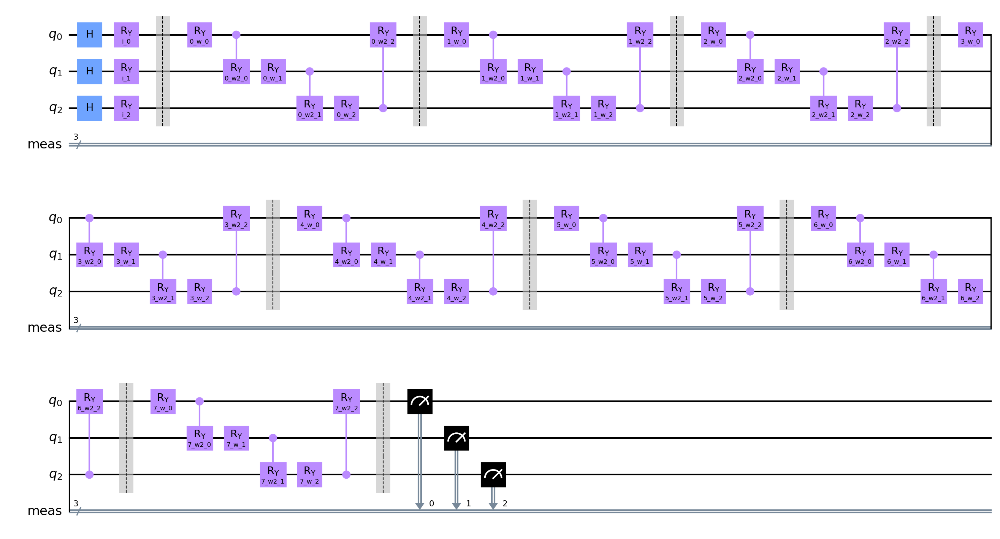 |
| adhoc | qml_circuit_qiskit_02 | 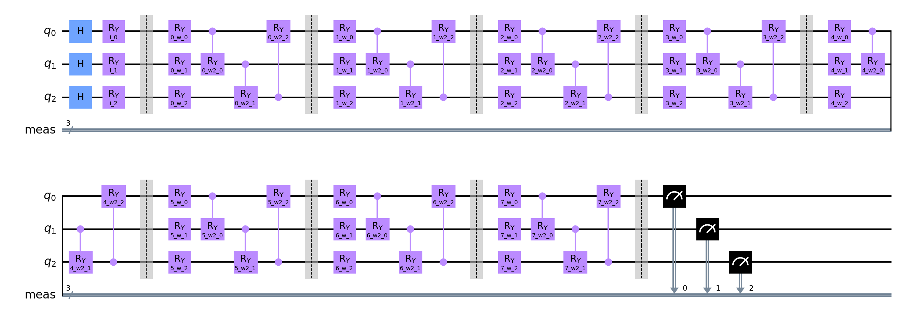 |
| adhoc | qml_circuit_qiskit_03 | 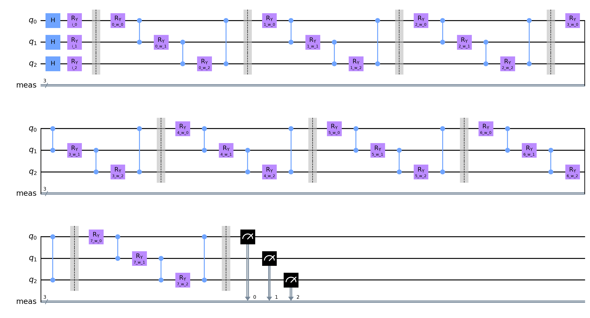 |
| adhoc | qml_circuit_qiskit_04 | 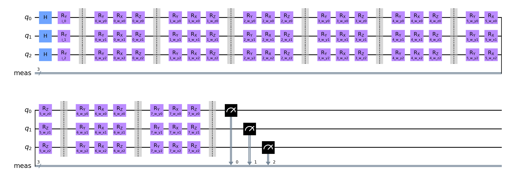 |
| adhoc | qml_circuit_qiskit_05 | 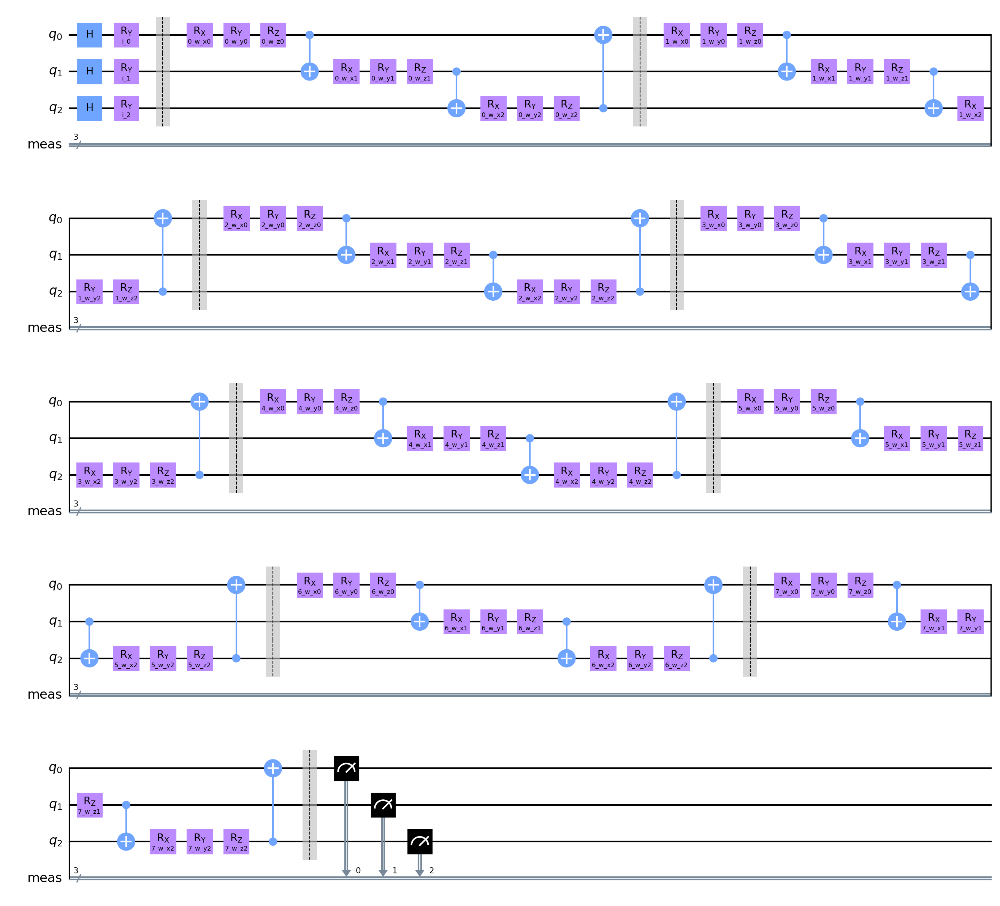 |
| custom | qml_circuit_qiskit_01 | 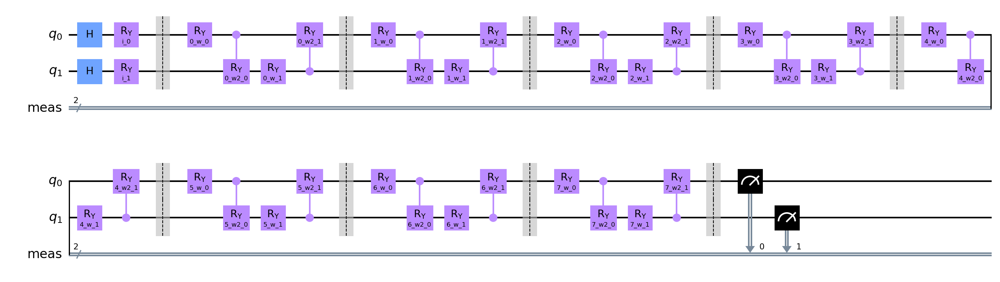 |
| custom | qml_circuit_qiskit_02 | 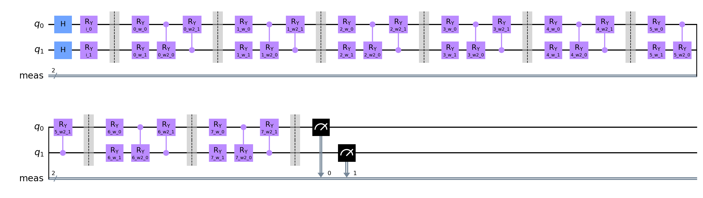 |
| custom | qml_circuit_qiskit_03 | 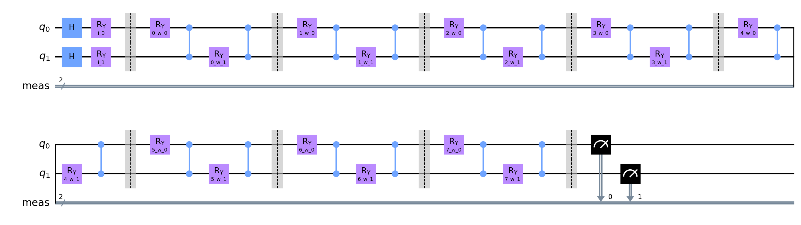 |
| custom | qml_circuit_qiskit_04 | 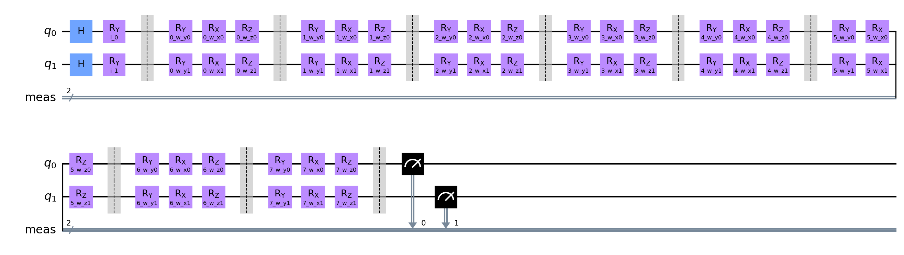 |
| custom | qml_circuit_qiskit_05 | 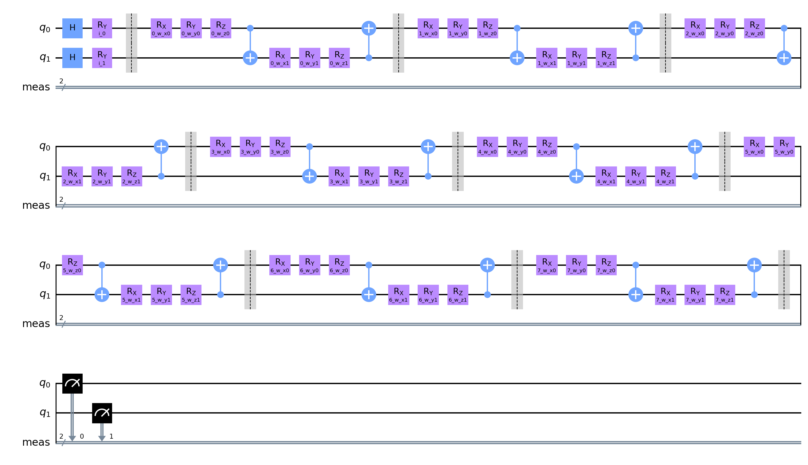 |
| iris | qml_circuit_qiskit_01 | 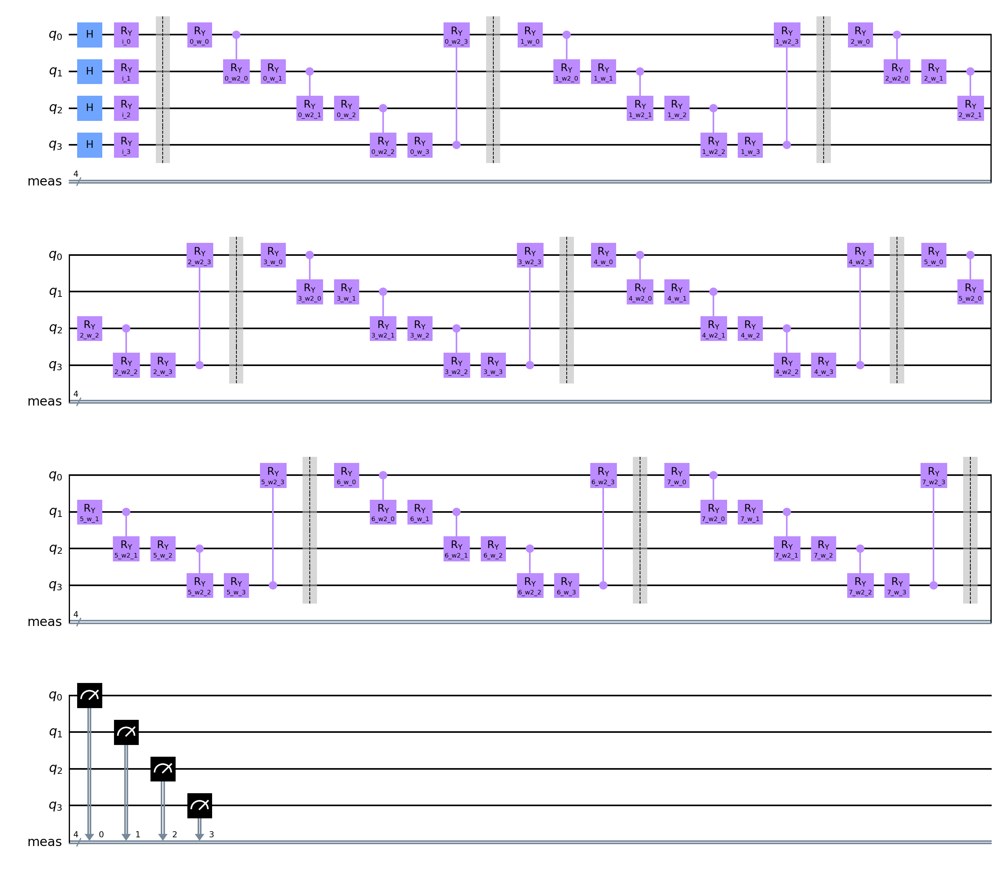 |
| iris | qml_circuit_qiskit_02 | 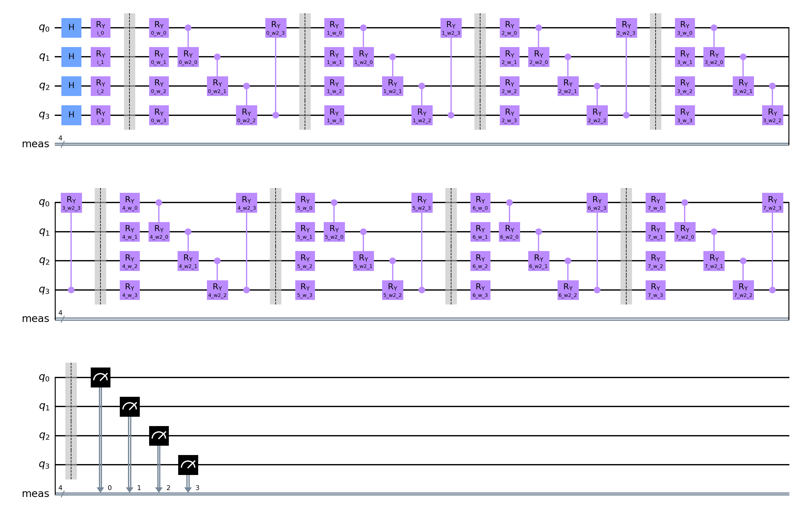 |
| iris | qml_circuit_qiskit_03 | 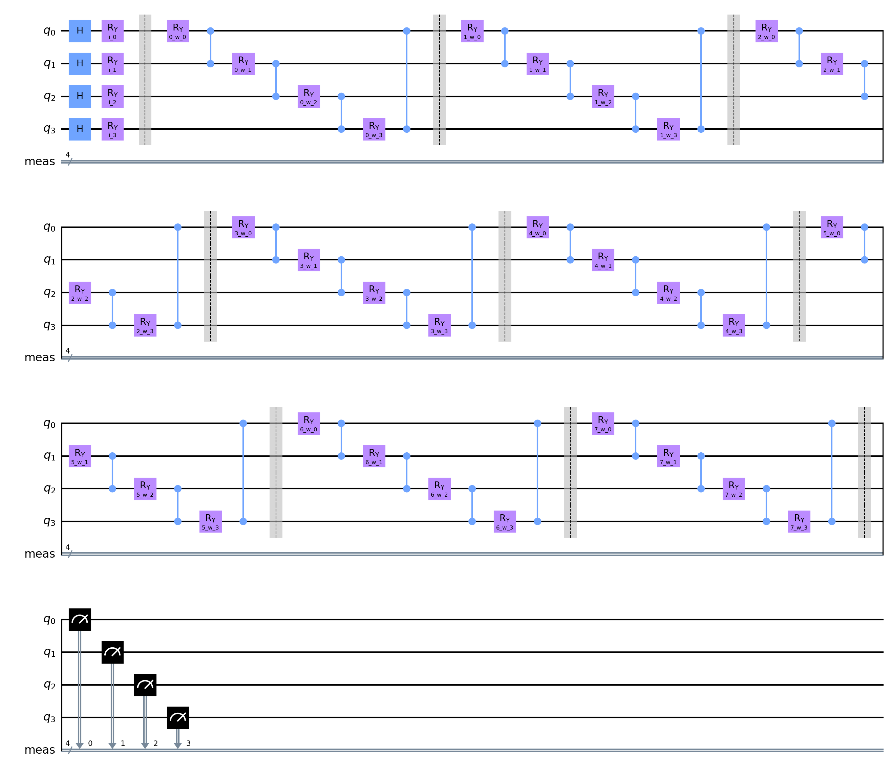 |
| iris | qml_circuit_qiskit_04 | 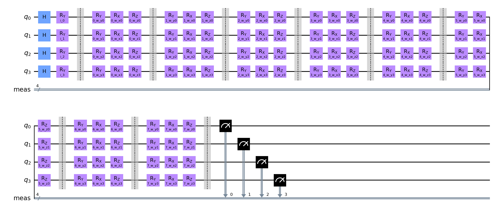 |
| iris | qml_circuit_qiskit_05 | 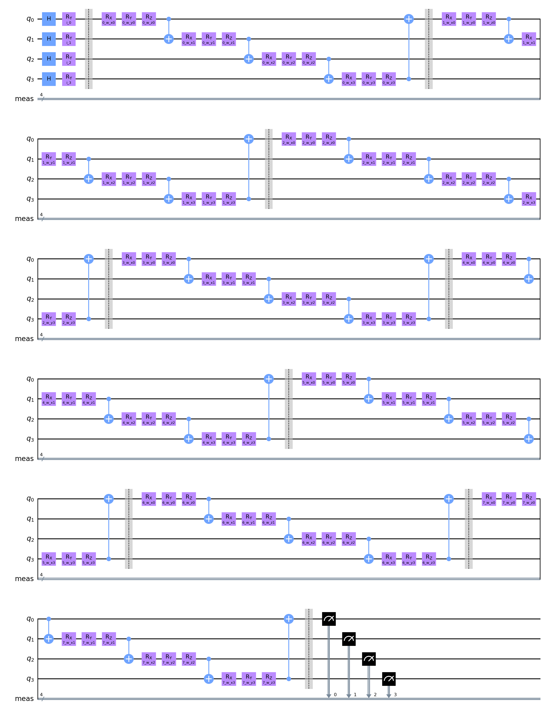 |

## adhoc
#### Average
| circuit | ø score train | ø score test | ø weights |
| ------: | :-----------: | :----------: | :-------: |
| circuit-00 | `0.5930555555555554` | `0.4444444444444444` | `[1.42325075,0.8404102,1.15774757,0.36289135,1.08395066,0.51992441,0.35642259,0.55828065,0.57244152,0.65013306,0.60187195,0.46828034,0.37922285,0.40189138,0.42916709,0.45328806,0.60532211,0.43866564,0.79772581,0.58826744,0.6410276,0.45328069,0.74402761,0.59645711,0.64953035,0.60202985,0.65446755,0.48330925,0.59884754,0.45929109,0.56585128,0.4118739,0.67323348,0.54266694,0.59223412,0.51004866,0.35996154,0.80454201,0.54021169,0.54203636,0.4741448,0.68939085,0.54176422,0.69038326,0.48990782,0.50624702,0.7046118,0.38783164]` |
| circuit-01 | `0.5902777777777778` | `0.4722222222222222` | `[1.00781028,0.94902871,0.98147896,0.72608731,0.81129184,0.68153411,0.76357935,0.80554456,0.53685635,0.62362233,0.51773469,0.52042844,0.67933749,0.62071742,0.83330989,0.47604574,0.37822305,0.63705449,0.72851373,0.67213963,0.68228841,0.782408,0.47831359,0.517122,0.53930247,0.76581881,0.5699601,0.73357977,0.43258033,0.54420724,0.41796071,0.50172336,0.39943923,0.28028789,0.51240254,0.7945548,0.5215354,0.48200377,0.69497105,0.39754778,0.57311228,0.50249791,0.59168997,0.47168825,0.52540847,0.56501243,0.48048666,0.5342936]` |
| circuit-02 | `0.5944444444444446` | `0.5111111111111112` | `[1.24771228,1.23780256,0.91967417,0.9273059,0.64177046,0.66517287,0.68685504,0.43728581,0.81958818,0.943043,0.55259691,0.60058832,0.6750079,0.44463399,0.2120575,0.68591309,0.51130619,0.67970233,0.42929649,0.43156341,0.46205333,0.40528896,0.54565451,0.55012361]` |
| circuit-03 | `0.5749999999999998` | `0.5111111111111111` | `[0.85614867,0.68852815,0.74058004,0.54279154,0.7481457,0.92476936,1.02194071,0.59961895,0.66240693,0.93550839,0.46495927,0.55329051,0.65299866,0.59631113,0.72014468,0.77350184,0.74515281,0.57115273,0.67670387,0.9637597,0.79803078,0.64949364,0.45181539,0.95449596,0.6242445,0.65254714,0.90598151,0.46228625,0.6982552,1.02308237,1.00261994,0.64503503,0.56294875,0.48982688,0.40991205,0.50340024,0.53631428,0.69374783,0.61751434,0.42182506,0.52837419,0.45889022,0.48128404,0.62883925,0.56399803,0.48690028,0.5441115,0.55379073,0.65515301,0.7607809,0.81412647,0.50840292,0.49955528,0.59532591,0.51748762,0.32225994,0.44669522,0.46705785,0.54756067,0.30165277,0.58386974,0.39030132,0.29638824,0.60012593,0.30476018,0.66509861,0.54090911,0.54552244,0.32401668,0.78949499,0.50687836,0.61095512]` |
| circuit-04 | `0.6013888888888889` | `0.4833333333333334` | `[0.99936109,0.80820466,0.8251242,0.64712714,1.51676374,0.60249464,1.19770788,1.04861634,0.69150411,0.82072721,0.67491015,0.69807375,0.6145611,0.96303301,0.78604416,0.60192964,1.09515571,0.61544077,1.07957727,0.43608468,0.55743609,0.34896308,0.86386124,0.64013086,0.42938385,0.54879236,0.71206445,0.70990929,0.67673972,0.41979772,0.29998877,0.40157957,0.50221096,0.41888794,0.460753,0.43709323,0.31317585,0.53659505,0.37606173,0.44005255,0.61839798,0.62727983,0.71894556,0.5631674,0.46668396,0.55044101,0.46157486,0.5270914,0.66315063,0.51455173,0.46145399,0.43506966,0.64377879,0.50852202,0.71382855,0.39470418,0.63826377,0.52629218,0.70934366,0.51105519,0.54637038,0.66780153,0.83316387,0.53575852,0.53180142,0.65235146,0.75663699,0.52219986,0.85600494,0.89605434,0.6205168,0.49067021]` |

#### Per run data
| dataset name and run | circuit-00: score (train, test) and weights  | circuit-01: score (train, test) and weights  | circuit-02: score (train, test) and weights  | circuit-03: score (train, test) and weights  | circuit-04: score (train, test) and weights  |
| :----------: | :--------: | :--------: | :--------: | :--------: | :--------: |
| `adhoc_20` | `[0.6625,0.35]`, `[1.55190009,0.66311924,1.79536115,0.15168799,1.22319479,-0.39217177,0.19394485,0.55503891,0.64709478,0.71625946,0.14124847,0.44287491,0.14510906,0.49961759,0.2527989,0.27685527,0.37283704,0.26500564,0.5155161,0.87513941,0.39037444,0.11002098,0.58277444,0.50101808,0.47769138,-0.44339193,-0.0500407,-0.01201156,1.06452209,0.30549182,0.64032623,0.29469534,0.69901807,0.5297487,0.49791882,0.6640836,0.00241844,0.51863971,0.65284579,-0.14553831,0.87261577,0.93357007,0.93654756,1.26436798,0.39616398,1.06883464,1.06707438,0.38136863]` | `[0.625,0.4]`, `[1.49713865,2.24629658,0.97333045,0.48877138,1.6058398,0.03382622,1.21936308,0.07523921,0.94682025,0.41825816,1.88577045,0.30236051,1.70931302,0.67137879,-0.092733,0.8722153,0.00815831,0.36128534,0.83569118,0.9254459,0.07763161,0.4808593,0.29861709,0.20461519,0.76171751,0.83727712,1.21488158,1.34893032,0.86510297,0.54547175,0.50586468,0.17169928,0.83936348,-0.00834609,0.80359084,0.77002994,0.24019486,0.60813525,0.61200116,-0.00917685,0.26500175,-0.21332268,0.61136558,0.59983658,0.64535313,0.69841749,0.56153105,-0.06415617]` | `[0.625,0.35]`, `[2.12139735,1.68903096,0.85755877,1.65956502,1.79664786,0.02238322,1.91650796,-0.09514249,0.8075696,0.28765434,0.60555959,-0.41742167,0.7923725,0.07436436,0.10013464,0.28242244,0.10561039,0.38813868,0.52223387,0.02083551,0.41996264,0.61814641,0.33624375,0.87364686]` | `[0.5875,0.35]`, `[0.31458776,0.44991003,0.48174508,0.17344593,0.93264236,1.53193435,1.45224375,1.43097414,0.82109755,0.7716557,0.00852887,-0.04816662,0.65615234,0.15253203,0.28516279,0.88119438,0.51392461,0.19333179,1.23134137,0.92322078,0.09855578,0.80323963,0.34370148,0.48333423,0.92375509,0.94304978,0.12702678,0.51530735,0.6850175,0.94692376,1.86432364,-0.0234077,0.31534015,0.31952004,0.20641114,0.55378279,0.32629535,0.447241,0.80581119,0.46360399,0.41109031,0.34361827,0.06296546,0.47030541,0.87782531,0.09180698,0.7434609,0.99681899,0.6214668,0.00435474,1.90212306,0.30977608,0.91179051,0.33206581,0.67183099,0.55343874,0.57622829,0.98766165,0.46477398,0.13275898,0.89217663,0.43003639,0.49097872,0.49658255,0.11867685,0.3109252,0.42542607,0.17435147,0.086508,1.05787744,0.70008567,0.64578271]` | `[0.6625,0.35]`, `[1.99853715,0.49724103,0.61275976,-0.06511163,1.88000221,0.68149111,1.21459392,1.37774743,0.31967711,1.12855427,2.04113584,0.72252723,0.29771877,0.979738,-0.2077577,0.8192863,2.03498363,1.23929062,2.4405337,1.04205796,0.00251549,0.50223754,0.14703987,0.45784198,0.07323352,0.78664415,1.48070462,0.25516965,1.15721478,0.7479837,0.45502884,0.10253091,1.22708886,0.78325383,0.49823205,0.68486164,0.86622464,1.16255493,0.27239943,0.12416194,0.90033541,-0.28123611,0.41640708,0.64890563,0.59965215,0.25095449,-0.11414218,0.76934399,0.51308846,0.63270737,0.49862165,-0.06106537,0.69840827,0.65900917,0.59820303,0.25918553,-0.03832157,0.03536764,0.19417617,0.76231655,0.0436396,0.80465254,0.3381906,0.53795753,1.7610062,0.12736408,0.07998077,0.74360841,1.23992655,1.69708178,1.07867547,1.07785895]` |
| `adhoc_21` | `[0.5375,0.65]`, `[0.8411503,0.47809346,0.09086647,0.83205593,0.0620313,1.1308377,0.89450109,0.7140397,0.82971246,0.4147108,0.80925212,0.55547391,0.20006702,0.03561321,0.64734823,0.79671553,0.69982598,0.87926275,0.82337389,0.549766,1.43593434,0.40128488,0.90014366,0.83324456,0.66924262,0.05335231,0.43094744,0.16687546,0.65516425,0.11701037,0.30097731,0.7457494,0.52454935,0.6817329,0.73609499,0.40644748,0.184285,0.53456552,0.81613619,0.19543477,0.47690123,0.36712059,0.01033002,0.89488642,0.29411819,0.86575312,1.22728145,0.01777414]` | `[0.5375,0.7]`, `[0.21451397,0.67184525,1.19794902,0.56800353,-0.19776102,0.21572416,0.5398864,1.55223798,1.12169988,1.56961538,0.51656145,0.04197133,0.32076213,0.78967328,0.41082881,0.22142193,-0.08499883,0.65395513,0.81194936,0.48135324,0.62077424,0.78490587,-0.29306113,-0.01437781,0.04126243,0.4927155,0.73547699,0.44416041,0.81499156,0.26312232,0.26175714,0.25879856,0.51663773,0.45660523,0.34317554,0.35407091,0.02133651,0.14773807,0.70303018,0.40435701,0.16970427,-0.06534548,0.25208859,0.50987417,0.89631973,-0.07472769,0.33410346,-0.08507908]` | `[0.575,0.65]`, `[2.20297854,1.18700406,1.2237007,1.61444957,0.60720897,1.22717017,0.28969871,0.63023122,2.02899953,0.89032401,0.67702433,1.91439721,0.71904247,0.41896213,0.71431683,0.33172796,0.51621267,0.85030754,-0.01939826,0.7189146,0.62041417,0.27057183,-0.02997409,0.80393407]` | `[0.525,0.55]`, `[1.15993542,1.67336681,0.81905567,0.73481341,0.67037464,0.46656779,0.92594928,1.75568542,1.0298971,0.91372344,0.74107455,0.81998551,1.97875848,0.65481018,1.32372973,0.31712247,0.26979262,0.18275528,0.54254507,1.40635883,0.94278824,0.51443126,0.05970635,1.93766822,0.7725379,0.74735178,0.38635989,0.05420024,0.41029874,1.82254367,0.51295108,1.7378776,0.1825741,0.61052802,0.60068342,0.11365127,0.18388413,0.49906691,0.84135853,0.23114831,0.48435199,0.05712474,0.85051141,0.37885006,0.97382679,0.74631357,0.56711395,0.44745561,0.83198497,0.25637026,0.32396492,0.41611915,0.23503799,0.8971616,0.33124992,0.03249193,0.74593713,0.23168098,0.15832443,0.08153,0.24935169,0.53020215,0.39604521,0.33430721,0.41510333,0.99062815,0.41958208,0.31482376,0.12786121,0.87102789,0.21897214,0.22589169]` | `[0.575,0.65]`, `[0.48614125,1.56761543,1.97095596,1.01896369,1.19453612,1.47900204,0.18454458,0.84105197,0.87561139,1.1517937,0.1840752,0.40938566,0.59291958,1.43178485,0.11118011,0.27248404,0.81819177,0.30563768,0.85842568,0.25795178,0.25602439,0.13931247,1.93881591,0.76013574,0.63881365,0.5889928,0.66465568,0.82677309,0.38536394,0.14301143,0.63293473,-0.1215031,0.0118474,0.54616708,-0.01001654,0.83546475,0.45037178,0.72834201,0.56656688,0.37620288,0.1623123,1.63166631,1.15216963,0.82053008,0.6888746,1.04174961,1.01928718,0.66870356,0.27939799,0.94031302,0.8981851,0.70911422,0.48517085,0.67642073,1.90949317,0.90262429,0.23993098,1.17346575,0.86413867,0.3188219,0.8473909,0.80952,1.07141709,0.62736361,0.348831,0.76297215,0.90480671,0.88005825,0.65455354,0.55440959,0.82355231,-0.00362438]` |
| `adhoc_22` | `[0.625,0.35]`, `[1.3117187,0.40693536,1.04684402,0.673031,1.34979979,0.15690701,0.40420336,0.77976402,0.13765225,-0.20936413,-0.02542723,0.44634406,0.32923137,0.09338595,0.25612497,-0.40659645,0.49501216,0.01489595,0.12367109,0.14064037,0.54940809,0.38315378,0.44593788,0.84270307,0.55766472,1.96635394,-0.13476583,0.45765901,1.22160757,0.21019479,0.55964222,-0.24690699,0.62478905,0.85899798,0.79808346,-0.18091943,1.62476359,1.78310956,0.60181405,0.72464177,0.28340766,1.80299819,0.1394203,0.66492,0.12192366,0.69972732,0.05230757,0.07851534]` | `[0.625,0.5]`, `[0.37862957,0.60782237,-0.0038237,0.88900631,0.46952085,0.33487457,1.65703909,1.88534397,0.61722816,0.29616943,0.9536669,0.92779702,0.85538163,0.09503715,0.88459883,0.15247335,0.51271718,0.20589723,0.8284916,0.03524245,1.71575413,1.3888094,0.10900612,-0.07666693,0.75142382,1.60393854,0.54338827,0.8984585,0.29305964,0.24091726,0.9443674,0.61329821,0.29077761,0.27885022,0.42831146,0.88755546,0.99934791,0.06892274,0.60218755,-0.25985643,0.77053886,0.44434266,0.85209624,0.49199038,0.71001171,0.74665487,0.48920556,0.22666256]` | `[0.5875,0.4]`, `[1.10722329,1.4981692,0.896145,-0.01590078,-0.01204463,0.24735098,0.45173492,0.39185571,0.40131563,0.50872099,0.76751168,0.78853151,0.70908155,0.43444163,0.50900484,1.2793992,0.77036071,0.05535217,0.28742374,0.08165096,0.50427059,0.49701454,0.7313222,0.61588137]` | `[0.625,0.55]`, `[-0.01456775,0.03764469,0.87724738,0.29221045,0.91070512,0.67274123,0.27679129,0.07294333,0.94266359,0.83229366,0.59633733,0.06195665,0.66774264,0.70255437,0.26297063,0.44034722,1.26908435,0.2238297,0.21927237,0.78628951,0.20204186,0.06049327,0.19651937,1.14387565,0.41983231,0.30885042,1.93302033,0.03283808,-0.15977171,1.72341527,0.84357397,0.10204529,0.57700717,0.46898669,0.07186401,0.69446674,0.50760042,1.79779336,0.26691639,0.47769707,0.82331696,1.19611647,0.42580101,0.28955684,0.32431639,0.94642213,0.69486523,0.16873301,0.03267991,0.66313967,0.91665828,0.11489103,0.91676754,0.26043697,0.07756148,0.67632957,0.82439663,0.93711215,0.23697413,0.5779757,1.00489007,0.14821735,0.19768462,0.91263541,0.53771644,0.91311906,0.92043068,0.51707939,0.01534007,1.37048513,0.67050497,0.64957703]` | `[0.5875,0.35]`, `[0.6533857,0.91974471,0.16864127,1.63280042,0.9367693,0.45154553,1.30728307,0.53574663,0.78356872,0.37462519,0.33389576,0.90922227,1.22972225,1.75954051,0.71164966,0.11339204,1.42823986,1.03580971,1.32297468,0.08192883,0.79271816,0.09553625,0.60784719,0.14014057,0.10342667,0.36615396,0.84157042,0.46274205,0.39154428,0.83261222,0.29962273,0.27867434,1.02612862,0.20840716,0.89634404,0.52058142,0.02199203,0.60280724,0.04242568,0.96577625,0.78901068,0.41071894,0.8851133,0.5765396,0.30115126,0.87405443,0.38857658,0.38566249,0.97829389,0.21396561,0.00269164,0.82931052,0.70263208,0.81909317,0.65194505,0.5297518,1.65308501,0.63315595,0.89071316,0.41296727,0.48880926,0.85420824,0.64410086,0.08608558,0.69823635,1.11469049,0.80401429,0.39500137,1.43448848,0.57047618,0.9706565,0.91334017]` |
| `adhoc_23` | `[0.5375,0.45]`, `[1.53131564,1.14441126,1.67954112,0.13164378,0.57252858,0.14818235,0.12173346,0.72869963,0.67923648,0.30894246,1.5610488,0.61915522,-0.00730784,0.59684252,0.50978549,0.87643542,0.51334855,0.10656902,0.3170417,0.68130464,0.62069653,0.12143075,0.6716474,0.66582206,0.73711551,0.48179573,0.8261436,0.03626621,-0.07709477,0.36958883,1.38479177,0.64448729,0.56789708,0.56529973,0.53669164,0.94189094,0.07784867,0.80914813,0.27585218,0.98428649,0.40823412,0.32321545,0.11583024,0.26340941,0.82204568,0.3772193,0.90299364,0.44224853]` | `[0.6,0.6]`, `[0.27973978,0.79115399,0.98802097,0.70856372,0.57724472,0.0308022,0.47789661,0.83552749,0.43735447,0.65350992,0.85718807,0.20734258,0.65829293,-0.5171442,1.70249668,-0.07403907,0.73089318,1.58116015,1.09404494,-0.10759315,0.89494909,1.93319228,0.13589668,1.86374751,1.36619972,0.50587303,0.42299203,0.95994126,0.61240538,0.7975865,0.50867141,0.19510019,0.89004957,0.08848034,0.36715971,0.83338584,0.62721398,0.60309194,1.01340541,0.68370333,0.93131916,0.38811859,0.0098844,0.82966764,1.02889919,0.20168318,0.44434361,0.89452167]` | `[0.525,0.65]`, `[0.63979142,0.43753201,0.10828546,1.49251637,0.78864748,0.45294628,0.30762669,0.01705675,0.0172045,1.51955491,0.37296169,0.10144928,0.39891968,0.86603034,0.01625367,0.73259062,1.66686787,1.70937763,0.92955508,0.83297992,0.41881468,0.04155201,0.41877828,0.73580819]` | `[0.55,0.55]`, `[1.35342648,0.54703258,0.20801692,0.18169826,0.24569336,0.81258999,0.75402007,0.60996213,0.76189737,1.07436901,0.30067703,0.59998799,0.8411201,0.50683118,0.43979458,0.36957238,0.86886824,0.89528626,0.74811664,0.6525306,0.72615633,0.250212,0.07195815,0.71884577,0.12267482,0.41706553,0.53392493,0.64837677,0.55983135,0.51880949,1.21496237,0.62123817,0.19511456,0.92599704,0.71088873,0.43516879,1.02710116,1.03427394,0.99168592,0.35250573,0.25653837,0.76799065,0.05383307,0.55760008,-0.01818992,0.1056312,0.34113907,0.9043333,0.80393442,1.44277514,1.28145928,1.95230834,0.61876277,0.71353753,0.11425994,-0.03097605,0.23815932,0.11636479,0.75994061,0.16383887,0.53206881,0.76162338,0.26893291,0.20106149,0.1443139,0.84884133,0.13417495,0.54074737,0.16656697,0.09898439,0.63293203,1.27344229]` | `[0.5875,0.45]`, `[1.2738798,1.72069914,0.37275447,0.50803738,1.29168763,0.1381402,0.73690516,1.32412091,0.4287135,0.81979479,0.46441778,0.99850575,1.21801782,1.61679625,0.74070828,0.69215707,0.56616175,0.92427744,0.13155863,0.90526225,0.83674722,0.51635866,0.7787985,0.44789188,1.57356689,0.6269838,0.93600648,0.97795471,0.40205119,0.37355372,0.14471442,0.12227677,0.55419518,1.26610234,0.89972994,0.23705687,0.34542067,0.08483682,0.91933461,0.50311216,0.35608972,0.57520089,0.29037377,0.52971687,0.13199676,0.07694655,0.44612154,0.24816788,0.22492528,0.40957276,0.0698885,0.19748849,0.92032435,0.69445084,0.23658562,0.56198502,0.23678149,0.86820554,0.15227321,0.01846597,0.57496411,0.47560626,0.41015801,0.54153544,0.8220904,0.50618025,0.24459721,0.20726845,0.38783539,0.20942422,0.06582836,0.41714057]` |
| `adhoc_24` | `[0.5625,0.45]`, `[1.00473046,-0.06671925,1.97823932,0.01577457,0.43966553,1.39415615,0.37306002,0.2753563,0.47982296,1.05189168,0.20912002,0.87899741,0.28953013,0.59860136,0.30531386,0.4853421,0.95874323,0.2956244,1.87669098,0.64933527,0.70493376,0.31244973,0.24035818,0.72548954,0.81825916,0.56765998,1.07499941,0.78658139,0.06364459,0.85600649,0.26063374,0.98861206,0.70709858,0.41431774,0.94646562,0.85966782,0.41822257,0.83061513,0.01307128,0.45283553,0.8478222,0.49245145,0.79876719,0.28845531,0.37307066,0.09573918,0.9268063,0.12212449]` | `[0.5375,0.45]`, `[1.17333034,1.57345921,1.125886,0.6746185,0.90144362,0.6779437,0.7014064,0.65330218,0.56462319,0.12507701,0.11406954,0.28818851,0.86195787,0.9433476,1.89983289,0.49831734,0.01643854,0.8052661,0.65209108,0.93022955,0.70210322,0.2037614,0.63728558,0.98794387,0.21963552,0.22464406,0.261321,0.51800336,0.36774315,0.02620442,0.06924517,0.61076352,0.08440479,0.72430471,0.67065223,0.89043122,0.77509418,0.29603558,0.51042053,0.6615068,0.59804102,0.60991719,0.83129868,0.6505542,0.87571109,0.33886356,0.27191111,0.62228103]` | `[0.575,0.6]`, `[0.15218443,1.3057038,-0.02675111,0.68094847,0.30373804,0.23598668,0.72302488,0.31786811,0.53352387,0.47195625,0.46780105,0.14813402,0.66411333,0.28928941,0.05480672,0.45689687,0.14968947,0.20063183,0.26771093,0.68170518,0.65490382,-0.18800323,0.37328296,0.28486052]` | `[0.525,0.55]`, `[0.91551008,0.89706606,0.42546699,0.9193174,1.02413408,0.36178302,0.3738607,-0.49245552,-0.38955636,0.89649416,0.24289762,0.73492685,0.3852955,0.28080441,0.30935379,0.15948656,0.52456276,1.08412359,0.68248083,0.27932759,1.57794302,1.76304733,0.52467329,0.73000888,0.1949584,1.49603208,0.3426131,0.14011052,1.97488568,0.28400286,1.91504979,0.82070182,1.74161634,0.08953196,0.01315282,0.18757481,1.18068028,0.38275918,0.43570386,0.16039693,0.47715825,0.66536145,0.39327089,0.49152283,0.53978757,0.21382803,0.81178845,0.48573537,0.79904657,1.81714899,0.81707616,0.5145818,0.89317696,0.70711595,0.29281784,0.36431445,-0.13751724,0.08865136,0.74993861,0.7089812,0.24687395,0.70741982,0.2234994,0.98823755,0.06470044,0.69543823,0.90992459,1.03571089,0.88335654,1.63051014,0.61415825,0.44461714]` | `[0.5625,0.6]`, `[0.98169204,0.12706321,1.23860058,0.10539583,1.96830888,0.6476252,1.88060639,1.47217408,0.76163948,0.2580507,0.69771297,1.41476326,0.14015532,0.50315589,1.67334921,0.83520375,1.48782945,0.32874308,0.91847176,0.93209443,0.65388188,0.2186256,1.8536459,0.4428276,0.13291355,0.8052762,0.93174226,1.12304794,1.7807746,0.31246495,0.33766246,0.12620407,0.1185397,0.54919155,0.52455731,0.14808604,0.13112158,0.26757714,0.56517689,0.94215558,0.91209332,0.98564746,0.39311334,0.34896258,0.05352526,1.57984972,0.08786941,0.11945162,0.81790389,0.602912,0.79709474,0.55227207,0.99168908,0.9553705,0.11680296,0.55452644,0.41611373,0.32148552,1.46486336,0.58280875,0.54533655,0.94822356,2.13174941,0.58756524,0.11331667,0.18314327,1.85679695,0.97079886,1.79185367,0.52471976,0.20914061,0.87336302]` |
| `adhoc_25` | `[0.575,0.45]`, `[1.96387911,1.60878426,1.69506948,0.51859505,1.70377053,1.62519097,0.44302285,0.59399263,0.14350457,1.39240675,0.28253329,-0.48152864,0.00671911,-0.01500108,-0.2522912,1.34611764,0.3823968,1.13808472,1.73446068,1.00958692,0.7438328,0.74221688,0.88013471,0.55883634,1.13481886,1.06590262,0.84733162,0.2114575,0.88322347,0.35440901,0.33582734,0.29267182,1.88681605,0.75532318,0.54277727,0.74203659,-0.05537676,0.5077939,0.80999782,0.42925206,0.13109214,1.05128591,0.58711625,0.59049371,0.6722053,0.59034365,0.40466605,1.17348332]` | `[0.6,0.4]`, `[2.13112433,1.1958823,1.63592759,1.24312689,0.57624199,1.9382448,-0.12630349,0.65149197,0.23261274,0.46298659,-0.18612405,0.54424944,-0.04344079,0.31552328,0.36050087,0.73532914,0.61084145,0.32275111,0.50131263,0.67374737,0.57637085,0.144316,0.73350632,0.55210459,0.47471005,0.58878119,0.70969239,0.30186216,-0.14762335,0.48862802,0.13761464,0.75466743,0.44608846,0.22754531,0.49914086,1.24282067,0.57953185,1.21074171,0.92302305,-0.27065291,0.5009329,0.80439005,0.7053817,0.10380198,0.14128653,1.29767625,0.01979326,1.2663229]` | `[0.625,0.6]`, `[1.1501661,0.95424864,1.39429199,-0.26547669,0.89628251,1.61806256,0.76593167,0.8566813,0.97981511,1.17010159,1.63544977,0.02540204,1.63329599,0.49110941,0.05280677,1.84675642,0.10729327,1.38980354,0.75988378,0.08727814,0.12620234,0.7501352,1.21289286,0.14046394]` | `[0.5875,0.65]`, `[0.25244209,0.22098735,1.26146237,1.23421145,0.74502227,1.41814857,1.79166146,0.05168346,0.05190706,1.92166197,0.07217587,0.29980918,0.72128466,0.15283897,0.96761453,0.25968423,0.73184684,0.97437946,0.53762596,0.80055641,-0.10444782,0.49480176,0.28874925,0.88528692,0.32646202,0.75866593,0.96708906,0.06060498,0.3200771,0.35252428,0.66671022,1.01121708,-0.08170777,0.61134874,0.93896774,0.72979103,0.85410189,0.60344992,0.09137561,0.57102878,0.79038533,0.11648302,0.44817373,0.81397865,0.14377024,0.25379382,0.9104664,0.56069529,0.70297451,0.5431567,0.78111533,0.30462128,0.07388733,0.64929043,0.89628801,0.4592788,0.48447832,0.14934112,0.84540731,0.05441027,0.20271012,0.13120145,0.08081192,0.45371149,0.47557038,0.40068289,0.93945103,0.85926307,0.92901828,0.40233558,0.36892665,0.86269252]` | `[0.6125,0.45]`, `[1.50780652,-0.04797173,0.13437252,0.8636979,1.11426414,0.25135256,1.66490423,1.66368537,1.43794792,1.87530918,0.13060316,0.1816952,0.57532742,0.48859113,0.5266589,0.3276285,1.74362095,0.40008697,1.11547452,0.20573158,1.98129612,0.82648226,0.48637693,0.79868871,1.04604172,0.27970439,0.03592538,0.07362796,0.90933851,0.10279124,-0.10098048,0.06679419,0.23928327,0.41224866,-0.00675725,0.4612383,0.31336316,0.15783748,0.1584537,0.33747108,0.4879009,0.83648024,0.17468538,0.68947102,0.34930377,0.67689219,0.45947167,0.7816078,0.70214558,0.11871667,0.25065139,0.15149213,0.71136702,0.4523746,0.62576592,0.12571973,-0.11692336,0.55670977,1.01130781,0.02494554,0.47036889,0.56975526,0.76791262,0.1317534,-0.0890124,0.61193387,0.94267396,0.0680266,0.87928796,1.11202486,0.61116483,0.25871175]` |
| `adhoc_26` | `[0.6,0.4]`, `[1.16854435,1.2094773,0.33072516,0.23525462,1.48763777,0.20852897,0.09266051,0.94888651,0.7521632,0.9002274,0.89774447,0.21744575,0.60159264,0.3897011,0.28621057,0.2286616,0.49144353,0.64022947,0.66184033,0.28934535,0.93840538,0.68761354,0.92222465,0.45351338,0.48139243,0.40399692,0.57839191,0.85942657,0.30917988,0.72035045,0.94115384,0.05073779,0.81312044,0.13827943,0.33142377,0.56304721,0.39297023,0.64413617,0.50194393,0.92702147,0.63381108,0.4017909,0.71783548,0.83610252,0.95086225,0.34918457,0.86426245,0.59152987]` | `[0.5625,0.3]`, `[0.1503728,0.7710714,1.25859141,0.73437844,0.86686374,0.71412776,0.83731769,0.26613154,0.32357519,0.43311862,0.14353809,0.89800332,0.69076577,0.93475941,0.76953668,0.7846499,0.74814306,0.50271736,0.23860945,0.42544788,0.33699696,0.41204882,0.99950633,0.64259638,0.76739087,0.6430231,0.50945527,0.5256026,0.50062417,0.92170749,0.17249871,0.60907108,0.25661862,0.1113468,0.1236113,0.4438597,0.92491136,0.31760135,0.3275487,0.92809711,0.24219436,0.86128794,0.72467179,0.40241716,0.45410379,0.61472862,0.82905129,0.76891322]` | `[0.575,0.4]`, `[1.98628741,1.87509318,1.61667428,0.90105685,0.48615846,0.19923601,0.48349887,0.83484372,0.87130988,1.80198925,0.23273475,1.23746189,-0.07552603,0.32218132,0.19584672,0.4946904,0.15495948,0.95569024,0.5383919,0.78769035,-0.02667438,0.27483738,0.85218321,0.6502869]` | `[0.575,0.55]`, `[2.00067891,0.63394765,1.17399943,-0.39515818,0.67347187,0.99576145,0.19080724,0.4385715,0.68159758,1.39069895,0.05000224,1.09686551,0.06834199,1.58119868,0.85757715,0.9209566,0.18258709,0.33257941,0.89412968,1.57209716,1.91009324,0.33664351,0.73961377,0.96174801,0.42558023,0.17242896,1.31206205,1.75264901,0.55000747,0.91496452,0.84366376,0.15178207,0.85318308,0.10211112,0.48578272,0.65203945,0.06677222,0.21788347,0.90572923,0.74267238,0.53868902,0.54872615,0.58989767,0.97365119,0.80372024,0.57872776,0.10167492,0.449142,0.95434299,0.22355543,0.78541135,0.08910154,0.16509395,0.84574621,0.89850184,0.28809579,0.00424414,0.32198819,0.41350454,0.15958741,0.61316918,0.13080191,0.23378645,0.8580343,0.11230488,0.02376249,0.77146543,0.93550028,-0.00205608,0.28284702,0.59908114,0.58180176]` | `[0.575,0.6]`, `[1.27920807,1.07334039,0.36114229,0.38998175,2.07281666,1.35562167,1.35411442,0.50457281,0.86590734,0.70908435,0.71579774,1.20503954,0.10044864,0.67534264,1.28185793,0.22442188,0.52229196,0.45373668,0.98891543,0.22364293,-0.30851983,0.78578847,0.65654242,0.49256768,-0.5621588,0.95260964,0.66412852,0.77167457,0.39769832,0.30019435,0.27075996,0.41028468,0.06819993,-0.06901948,0.53604581,0.37299445,0.45520274,0.62872268,0.17387677,0.27839,-0.13108114,0.6312977,0.91492748,0.72464706,0.33893453,-0.1320567,0.15488602,0.43030556,0.297353,0.4787146,0.69860228,0.23635511,0.25009307,-0.2692754,0.06462429,0.60673531,0.73289262,0.54545514,0.89565611,0.00654406,0.19099784,0.84401181,0.45699248,0.75299159,0.00983869,0.58441489,0.59780942,0.70449582,0.39182914,1.79814953,0.21299792,0.08809783]` |
| `adhoc_27` | `[0.6375,0.35]`, `[1.48997635,1.11971229,-0.00732679,0.66937212,1.81195682,0.37526863,0.13546781,-0.11218342,0.34175293,0.37540978,0.61195842,0.90608569,0.68827285,0.54507254,0.13355947,0.41238153,0.53873838,0.12770177,0.81166403,0.27411342,0.2056085,0.59426477,1.26348981,0.48484724,0.65840814,1.03618509,1.72377493,0.96899201,0.62784031,0.9781224,0.62857169,0.18211554,0.14953565,0.83513704,0.86011086,0.41388538,0.25452057,0.67466023,0.49841061,0.92946734,0.52594764,0.04960421,0.85836715,0.87451605,0.3770337,0.513135,0.13453562,0.42315332]` | `[0.6625,0.4]`, `[1.89786571,-0.4402113,0.75466685,0.86149165,1.75736496,0.74236615,1.20600526,0.33894254,-0.02775669,0.96542081,0.4622727,1.04085519,0.80646236,1.74677223,1.04109036,0.7981234,0.75585808,0.50325046,0.75152469,2.02245303,1.13748096,0.84615026,1.08798462,0.35378835,0.36261255,1.30901918,0.48148707,0.60284102,0.47965378,0.52364807,0.66123227,0.36589167,0.22277582,-0.11139947,1.25241547,0.78561817,0.30891973,0.49656299,1.3547682,0.89043793,1.28373652,0.9892239,0.58278167,0.23266938,0.14167461,0.39228394,0.64207931,0.31287112]` | `[0.6375,0.5]`, `[1.75957026,1.24625234,1.85230773,0.34028177,0.42565929,1.40750214,0.48279193,0.99092325,1.00082757,0.88618158,0.02274837,0.83126472,0.65272641,0.29925918,0.24296091,0.61101082,0.63714277,0.00984466,0.44102894,0.11500292,0.79635245,0.76373732,0.76317243,0.83984541]` | `[0.6,0.35]`, `[0.38021408,0.44588962,-0.09960103,0.3921672,1.0369747,1.8098463,1.32573712,0.68888858,1.5875695,0.38066221,0.22723685,0.32530732,0.15053822,0.83281396,0.30759273,1.82495477,1.05825432,0.84660374,0.49340856,0.69409821,0.76044281,0.83075397,0.04102716,0.49676998,0.69792887,0.71774185,0.14746867,-0.15317744,1.34141083,1.88597906,0.81409851,0.40862776,0.38025184,0.44341608,0.51104077,0.59264207,0.63873934,0.77743804,0.82577412,0.76911147,0.72840176,0.17662388,0.38066855,0.78865966,0.49153602,0.81156881,0.29357182,0.93940551,0.60197071,1.46244462,0.02604693,0.67327927,0.43179344,0.65957014,0.72481847,0.54866996,0.42637705,0.9195226,0.45664401,0.65868026,0.97552001,0.47385666,0.51008103,0.54705781,0.5261957,0.90002619,0.05558024,0.59581873,0.48376673,0.89101169,0.64816367,0.74276815]` | `[0.6625,0.35]`, `[0.44151663,-0.02393556,1.03856237,0.53843345,1.39389744,0.07216209,1.76641849,1.19518156,0.86724814,0.5044969,0.69251176,0.19585821,1.22861024,0.79539319,0.32814159,1.01871156,0.89742129,0.60554031,1.70688272,0.25510618,0.22076921,-0.13866279,0.79135341,1.97524745,0.74130468,0.04458524,0.17668455,0.47923696,0.57973072,0.8525809,0.33392838,0.68976985,0.64264707,0.06088558,0.27570644,0.6999136,0.24727394,0.41200302,0.50075305,0.04782347,0.05307184,0.81712036,1.63705788,0.05602424,-0.08301063,0.0327993,0.63848745,0.89183422,1.68005233,0.66397449,0.68829918,0.37065407,0.8495378,0.02302836,1.55621293,-0.09872023,1.10788901,0.4685608,0.48048334,1.71624297,0.9545506,0.00828767,-0.07979347,1.08657518,0.88357395,0.68731702,0.69093155,0.0720063,0.46748803,0.91934043,1.00756008,0.32121319]` |
| `adhoc_28` | `[0.6,0.55]`, `[1.94604174,0.99987792,1.81040819,0.03860708,1.10497079,0.03241968,0.54920941,0.54093154,1.14103405,0.90071333,0.92936916,0.62967476,1.15979126,0.87318927,1.72365353,0.06367992,0.99555328,0.48061703,0.31527352,0.82517561,0.18005451,0.72709089,0.78953771,0.30263968,0.3111803,0.28641403,0.59342561,0.87453665,0.64154044,0.22244567,0.04073734,0.75470285,0.08627706,0.1051658,0.08054064,0.18029831,0.34000153,0.93820974,0.69183336,0.38092609,0.08747135,0.78248093,0.7116638,0.53629791,0.40174697,-0.00371361,0.76157872,0.26028712]` | `[0.5625,0.5]`, `[1.34757739,1.12393857,0.90276204,0.36682534,0.74486795,1.44589746,0.35960311,0.99168417,0.61554995,0.68844502,-0.08733091,0.4330881,0.25454244,0.60710921,0.52363688,0.29592035,0.10595648,0.79720754,0.8429086,0.66293044,0.07853462,0.84762869,0.59608066,0.14034682,0.10876976,0.68709757,0.25094632,1.00241828,0.10726569,1.09057937,0.50039496,0.93622028,0.04823701,0.75520396,0.1235655,0.94322127,0.21726823,0.58920427,0.20835471,0.54951401,0.39654168,0.70386904,0.75564105,0.42438272,-0.16468355,0.86953165,0.73236131,0.86630518]` | `[0.625,0.45]`, `[0.10981171,0.94718881,0.35485475,1.93831251,0.48363616,0.57591782,0.76087971,-0.00874531,0.73572797,0.95090408,0.19158099,0.77607591,0.5810452,0.80606815,0.0223864,0.13772306,0.49361907,0.55817471,0.13683843,0.5580131,0.64423362,0.6196092,0.25298902,0.00638523]` | `[0.6,0.5]`, `[1.34311093,1.29090851,1.51782757,1.35241799,0.49429292,0.25355158,2.1063955,0.84031747,0.47458897,0.23801645,1.94570309,1.08894219,0.40775402,0.5024164,1.7275062,1.78819793,1.28745446,0.40748531,0.74141435,1.55935823,1.06870359,0.79181998,1.80038967,1.23292602,1.7344709,0.31173797,2.40426881,1.10966676,0.6025398,0.75857846,0.34824615,0.97523315,0.90315928,0.83700226,0.15041709,0.57148525,0.04165377,0.48382463,0.39327424,0.02826091,0.24543573,0.25796735,1.12643456,0.89542858,0.93938957,0.63401023,0.43292275,0.03179747,0.54797621,0.43408253,0.4932829,0.2009478,0.24968703,0.29300855,0.65006004,0.00869631,0.85795336,0.45119779,0.84253844,0.17711226,0.53806718,0.1993528,0.26567392,0.60950557,0.34825974,0.90246393,0.29214693,-0.06359299,0.22578844,0.50037565,0.10908067,0.07202275]` | `[0.5875,0.55]`, `[0.37208262,1.44004531,1.52832854,0.83194549,1.79859127,0.34551136,0.67000066,0.52326634,-0.11677666,0.56483578,0.81404114,0.24566659,0.14812982,0.41695464,1.90860948,1.11408158,0.3576607,0.24584444,0.23295835,0.02098618,0.58149216,0.19498927,0.51433105,0.2458361,0.11731278,0.48818108,0.67716215,1.41895673,0.08694115,0.11298694,0.32622791,1.93918436,0.63196858,0.01275471,0.53293522,-0.02635796,-0.01238791,0.78467417,0.18556854,0.38537954,2.03584878,0.03862266,0.60666218,0.67370954,1.81972796,0.55277952,1.07361604,0.4487455,0.47519527,0.570089,0.24905139,0.9300057,0.18478656,0.56622625,0.66482401,0.11052976,1.51292602,0.13422347,0.43048113,0.75638374,0.80127568,0.69594838,1.75774723,0.46999911,0.23833197,1.29314709,0.68812209,0.65853464,0.4567817,0.67886268,0.60507515,0.46993083]` |

## custom
#### Average
| circuit | ø score train | ø score test | ø weights |
| ------: | :-----------: | :----------: | :-------: |
| circuit-00 | `0.5425` | `0.45` | `[0.69734099,1.00171059,1.40195661,0.86862139,0.87897674,0.84736812,0.70120094,0.40770541,0.7027603,0.90896441,0.44776059,0.70706944,0.59015356,0.5179326,0.63427627,0.35557674,0.52537988,0.78281176,0.47759308,0.58005678,0.52336287,0.61589198,0.68310076,0.51436522,0.30198845,0.58889794,0.32198643,0.61579599,0.37804389,0.30054599,0.31801786,0.4548253]` |
| circuit-01 | `0.55625` | `0.4299999999999999` | `[1.08541854,1.24669882,1.37287859,0.61656508,0.58701777,1.11977974,1.15381274,0.51739666,0.8340456,0.67491614,0.62919795,0.39987681,0.39183237,0.55782257,0.45568128,0.22795671,0.52705972,0.47455863,0.48054418,0.35019778,0.63460345,0.58265335,0.46963769,0.48395741,0.53510462,0.55355408,0.45905088,0.42034729,0.71409582,0.52407314,0.457963,0.46393702]` |
| circuit-02 | `0.5549999999999999` | `0.45999999999999996` | `[1.28414271,0.95161458,1.01418707,0.68175289,0.82798929,0.86051246,0.44320953,0.73341997,0.52512268,0.7499847,0.43899139,0.5176626,0.63153946,0.40741041,0.41812582,0.52784998]` |
| circuit-03 | `0.53125` | `0.45` | `[1.12102263,1.05437547,1.05165616,1.07606624,1.09335154,0.73856195,0.6436403,0.72395123,0.67300598,0.82551901,0.36266852,0.47313234,0.68526591,0.56819466,0.57344327,0.69647262,0.52283364,0.57216984,0.56609226,0.68221692,0.64023652,0.41081863,0.49405279,0.53554629,0.50201886,0.43515771,0.64741955,0.57635698,0.6130075,0.39023909,0.32478776,0.43311314,0.85331391,0.48112638,0.70207398,0.61692826,0.57401039,0.33329444,0.59684084,0.66832785,0.84447133,0.61907522,0.53549167,0.43892076,0.47414297,0.48533885,0.82261934,0.71506754]` |
| circuit-04 | `0.545` | `0.41999999999999993` | `[0.61713404,1.12237932,1.01876068,0.96094368,0.73328022,1.10945533,0.74211367,1.23978895,0.84409244,0.83963833,0.59745133,0.58090821,0.78035566,0.62409103,0.89891024,0.48292828,0.52122245,0.42677597,0.83302173,0.61846613,0.48250154,0.72848828,0.71769259,0.54021771,0.84140723,0.44591913,0.51952173,0.73099323,0.46843975,0.60127563,0.51064602,0.55001674,0.66354975,0.53668001,0.43329222,0.4194603,0.65137609,0.2596746,0.4836729,0.57646574,0.56822199,0.85370397,0.56739481,0.54399644,0.54260393,0.5301062,0.72339706,0.58091183]` |

#### Per run data
| dataset name and run | circuit-00: score (train, test) and weights  | circuit-01: score (train, test) and weights  | circuit-02: score (train, test) and weights  | circuit-03: score (train, test) and weights  | circuit-04: score (train, test) and weights  |
| :----------: | :--------: | :--------: | :--------: | :--------: | :--------: |
| `custom_0` | `[0.5375,0.65]`, `[0.59256448,1.45356351,1.68634529,0.28549309,0.42442008,0.15184799,0.7234706,0.00634583,0.79859779,0.30680362,0.23233102,0.36473613,1.15100329,0.97583244,0.87178528,0.06134557,0.60161181,0.30578584,0.95368926,0.67137148,0.89136639,0.2631138,0.7191986,0.50591166,0.58945873,1.23524623,0.98630959,0.82035867,0.58728346,0.05380849,0.09537258,-0.00338326]` | `[0.6375,0.7]`, `[1.42041312,1.69494636,1.41611811,-0.08350867,0.5580488,2.20454302,2.17543826,-0.28810641,0.88235764,1.83890315,0.45210256,0.00499562,-0.48759168,-0.2107724,0.48258615,0.08288259,-0.05929434,0.08830523,0.05115555,0.66506179,0.30871029,-0.02564106,0.38820589,0.78721475,1.22037864,0.06897322,0.76901833,1.23007557,1.05850649,0.51221963,0.14755704,0.8313151]` | `[0.5875,0.65]`, `[1.82109695,0.50448288,1.61579932,0.74176287,0.2784557,0.64447402,0.39757196,0.72696852,0.76797697,0.20822807,0.80123517,0.38399453,0.95128253,0.0457722,0.78891937,0.4878598]` | `[0.475,0.5]`, `[1.48274928,0.37238391,0.89270206,-0.36096071,1.64621241,1.15385685,0.81391483,0.37032233,1.04631976,0.71417731,0.88721068,0.05227729,0.07747472,0.65407318,0.99000753,1.31029357,0.96638071,0.30606305,0.55966553,0.17650664,0.76762887,0.71033244,0.35540092,0.09156658,0.45373635,0.96543081,0.3503742,1.615877,0.71550575,0.43988706,0.00899801,0.03679245,0.82388077,0.29845585,0.18849034,0.66177038,0.37309768,0.52183496,0.44900141,0.3813989,0.37789627,0.88986337,0.37800121,0.53480266,0.85745272,0.09157644,0.45400555,0.78863068]` | `[0.575,0.55]`, `[0.78541207,2.00596733,0.0942132,1.06560662,0.58838838,0.89916285,2.3001396,1.67302006,1.87849604,0.94379719,0.94030333,-0.1392216,1.55347985,1.57254315,1.89910053,1.34481356,1.72504625,0.32272299,1.22319901,0.5405231,0.45476436,1.38503892,1.65466566,0.46200602,0.7256883,0.37152478,0.76362335,0.84540749,0.37049943,0.55035873,1.20650148,0.9117688,0.90862508,0.24066528,0.85178679,0.36250537,0.76359172,0.05982501,0.42202982,0.17527066,0.18013709,0.70792396,0.33765584,0.80643679,0.62473272,-0.05299179,0.09609762,-0.11391658]` |
| `custom_1` | `[0.5125,0.45]`, `[-0.11465945,1.08040066,1.48775037,0.8486663,0.80780924,0.52970168,0.47715256,0.94231769,0.64582587,1.12950014,0.88741994,0.63229328,0.47474902,0.92781585,1.11595999,0.14421415,0.13837066,0.76426006,-0.12878944,0.84855913,0.93472626,0.39258066,0.56969916,0.83078118,0.35482662,0.46573222,0.23285216,0.19565651,0.55085578,0.03748897,0.39457149,0.23096501]` | `[0.5875,0.6]`, `[1.3585984,1.36445197,1.29923474,0.86338083,-0.01264838,0.62066562,0.54338634,0.49154845,1.25817442,0.24743437,0.87134736,0.27252247,0.69617229,1.50231715,0.46785838,0.18174176,0.62984909,-0.04148368,0.85596641,0.09780819,0.23238013,0.58136915,0.48341914,0.37415805,0.81121461,0.57358535,0.78870081,0.08771353,0.70409296,0.08117889,0.16350819,0.23260337]` | `[0.525,0.5]`, `[1.10471717,0.16387344,1.4285012,0.85062976,0.18088486,0.2855729,0.39987025,0.44769872,0.43927417,0.7810474,-0.17912419,0.87807327,0.43966167,0.81379445,1.42886803,0.9325222]` | `[0.5,0.5]`, `[2.90885041e-01,5.11545317e-01,1.74890188e+00,1.58329997e+00,1.03270524e+00,1.03076632e+00,2.85947014e-01,8.57429807e-01,-7.38050819e-04,9.09191714e-01,4.83568230e-01,4.54183490e-01,5.17436914e-01,1.33981907e+00,5.71161481e-01,1.18939608e-02,4.60151547e-01,9.06814135e-01,7.60184489e-01,2.33003676e-01,8.81103294e-01,2.17213147e-02,3.25149081e-01,4.37324765e-01,1.08931415e-01,1.59009564e-01,4.99179829e-01,1.35761627e-01,8.82799496e-01,2.17552078e-01,1.09475729e+00,7.41743013e-01,5.17814810e-01,6.06256260e-01,1.91126712e+00,5.15061097e-01,3.67653856e-01,8.49492953e-02,1.93547435e-01,6.38982901e-01,4.23230755e-01,8.93552117e-01,4.52054543e-01,2.10984240e-02,1.37231111e-01,5.23060432e-01,9.59693343e-01,3.38715345e-01]` | `[0.525,0.5]`, `[0.15208467,1.14868068,0.6136838,0.08275387,0.3549154,0.47670293,0.73970777,0.97448482,0.97280449,0.48088887,0.28950135,1.73278687,0.3316091,0.84482476,0.69127254,0.9531247,1.07465387,0.62532009,1.88523236,1.48269361,0.3587229,0.81734175,0.07241376,0.34495115,1.55706011,0.00653261,0.09936732,0.14684377,0.14542949,0.8800741,0.08301344,0.26181648,0.17783248,0.50826043,0.11525859,0.61642618,0.43285875,0.07290641,0.20280443,0.75086818,0.07793752,0.59536068,0.39583427,0.18154367,0.48150998,0.98682228,0.06259873,0.55664685]` |
| `custom_2` | `[0.6375,0.45]`, `[0.18884839,1.96217614,1.23484445,-0.01104522,1.55689909,0.90850432,0.70304599,0.0214859,1.45282562,1.02738642,0.54970851,0.6731931,0.05122855,0.39615352,0.8432928,0.14066475,0.48775005,0.81133675,0.30952832,0.63099599,0.31287644,0.6334772,0.25061025,0.84309833,0.11821158,0.20612235,0.44815031,0.66003912,0.63412805,0.11686886,0.17522731,0.6864942]` | `[0.55,0.5]`, `[1.07780007,2.06855472,0.45800423,0.75319228,1.75634787,0.76214002,1.46535714,0.62592942,0.87924842,0.13236974,1.55296478,0.37851418,0.44927737,-0.37755444,0.57790419,0.37898792,0.65747838,0.46002858,0.73114728,0.23459873,0.19631906,0.9972829,1.25962726,0.84011012,1.74653696,1.76069976,0.08436085,0.76213816,1.50585103,1.47917857,0.9042469,0.68900082]` | `[0.625,0.6]`, `[1.32651527,0.23401072,0.75120761,0.81030393,1.23313353,0.95946231,0.12859343,0.87507869,0.46278315,0.81931572,0.59557067,0.50584551,0.39778468,0.4659071,0.3764557,0.27014596]` | `[0.5875,0.5]`, `[1.06834394,-0.19275764,1.04988897,0.30604963,1.47022016,0.20743401,0.20479986,1.11457008,0.30547166,0.47042517,1.13687488,1.05413356,0.179589,0.80634945,0.01145099,1.07625876,0.98616741,0.35794789,0.93894174,0.98515039,0.91552698,0.37452732,0.35927784,0.61036187,0.21507962,0.28598409,0.47299713,-0.21299879,0.9566905,0.57899277,0.39459459,0.47948242,1.7230415,0.18599817,0.34339788,0.05428555,0.35387854,0.15986303,0.47436849,0.03095558,1.41550019,0.01689065,0.86710751,0.52287349,0.88346237,0.75143154,0.78272049,0.40733069]` | `[0.5875,0.5]`, `[1.39004253,1.11318138,1.25197466,1.09807759,0.23417505,0.83634301,0.63403082,0.4584865,0.38320227,0.76295236,0.46461426,1.00965831,0.37305634,0.2722716,0.33417932,0.11661859,0.09538806,0.32499473,0.44229894,0.20696805,0.3074841,0.19548249,0.37727945,0.15685073,0.89171125,0.57815435,1.18563855,0.86431747,0.19161521,0.75074971,0.40368822,0.21693821,0.27317897,0.49909555,0.1036432,0.97646748,0.43308868,0.08427059,0.67628865,0.93878776,0.79026832,1.15694353,0.7675255,0.38280575,0.44028827,0.65052664,1.81541215,0.56210768]` |
| `custom_3` | `[0.425,0.5]`, `[1.08740876,0.21415658,1.97205204,1.17569291,1.54942281,0.97448424,0.82903639,0.88588947,0.00686229,0.82986745,0.17132147,0.5224215,0.470854,0.10868356,0.38460089,0.51088234,0.13122345,0.11768053,0.67951964,-0.18701755,0.1743192,0.15068185,0.33275366,0.71331921,-0.11320506,0.39382875,0.72586536,0.84971816,0.3873179,-0.01092445,0.05600318,0.72173161]` | `[0.55,0.4]`, `[0.44286395,1.18222044,1.78195779,0.61987607,-0.03410647,2.01302771,1.0765375,0.18414112,0.51190933,0.85886964,0.77254271,0.63539533,0.64693398,0.07038438,-0.03082135,0.07315413,0.52902629,1.28933717,0.25956156,0.48748238,0.79458817,0.28406502,0.58677924,0.93401956,0.69668882,0.50406083,0.65973147,0.02243916,1.77765019,0.84031337,0.52970894,0.9868635]` | `[0.5125,0.55]`, `[2.00500357,0.2280878,1.89812736,0.46960844,0.76258725,0.24419593,0.77768487,0.853965,0.71041314,0.38175778,0.24283756,0.11861688,0.77440401,0.21866453,0.10768136,0.89086215]` | `[0.55,0.6]`, `[0.67946061,1.46203996,1.67934198,1.73867351,1.21695254,0.08357086,0.8320028,0.77575567,0.55857958,0.57719315,0.03204494,0.0797532,0.54346839,0.06209252,0.58087743,0.07745788,0.59692356,0.85524809,0.37782619,1.24299667,1.6090692,0.25174822,0.48294558,1.68702051,0.53148602,1.0840751,0.43746926,0.73778867,1.05155236,0.20760543,0.38569364,0.89132064,0.77423168,0.19393659,0.19906672,0.39539932,0.96679037,0.38054038,0.5686564,1.54426933,0.88107897,1.43335621,0.59341424,0.49221546,0.14320607,0.11724043,1.93113,0.8956356]` | `[0.4125,0.5]`, `[1.47230754,1.84719565,1.98589902,1.51468635,0.80603882,0.15289545,0.05464453,0.13935038,1.81377029,0.13186288,1.18757793,0.12317913,0.31615397,0.48374255,1.50598901,0.48570061,0.31003888,0.08957758,0.30245467,0.53058345,0.85864272,0.64550288,0.75451459,0.86422024,0.48253558,0.34630003,0.67455298,0.54220874,0.68288509,0.86310904,0.87824111,0.72352061,0.69110709,0.56071709,0.37017309,0.0245974,0.57706804,0.29791665,0.41587591,0.44567753,0.84644135,0.89181877,0.42337336,0.36138219,0.91290676,0.18879733,1.38471593,0.35706496]` |
| `custom_4` | `[0.5875,0.35]`, `[0.97908791,0.30804167,1.68139572,0.09925884,0.80042421,1.05415734,0.56048795,0.51002503,1.81712016,0.71639986,0.56710379,0.41848627,0.27279732,0.10846788,0.13919936,0.31640827,0.18604429,0.74513426,0.79368616,0.31418181,0.08578067,0.71927759,0.81334719,-0.11692526,0.67985224,-0.15942954,-0.03028785,0.80130011,0.28023316,0.03550818,0.39004394,0.65309254]` | `[0.5375,0.3]`, `[1.41462901,-0.00947526,1.9065774,0.84948849,1.03953849,0.3177622,1.05411421,0.95584649,0.75549006,1.23021546,0.23012459,0.40391714,-0.2389701,1.20415145,0.63550448,0.24827824,0.86269754,0.51735968,0.26169157,-0.00346368,0.93476232,0.19743791,0.29425798,0.37647899,0.28155924,0.32038189,-0.10125394,0.68751672,0.54953941,0.15695936,0.35563635,0.6562893]` | `[0.5375,0.35]`, `[0.92092804,1.96616693,1.06781348,0.85008965,0.6048988,1.76176785,0.39741377,0.7853284,0.6294293,0.50977489,0.46396197,0.05931983,0.11214547,0.76499228,0.27820161,0.6281956]` | `[0.5625,0.4]`, `[1.60200439,2.37987875,1.63252817,1.11517013,2.20985118,0.85476192,1.1744496,0.5194568,0.35098413,0.81506915,0.03939418,0.05825735,1.64206098,0.83428361,0.44025597,0.71795485,0.01546215,0.50411718,0.97181318,0.37262903,0.3876401,0.33112842,0.51099126,0.21944999,0.62896825,0.14557191,0.06238929,0.39324394,0.5299662,0.04223177,-0.19109419,0.72541943,0.69029835,0.85194918,0.76396222,0.99125176,0.84521386,0.34106342,0.77296267,0.63115629,0.28464375,0.71897596,0.7156086,0.92188854,0.23788814,0.27450079,1.41184015,0.74364586]` | `[0.5625,0.25]`, `[5.68131742e-01,1.56697487e+00,5.06825640e-01,1.76093552e+00,3.18393066e-01,1.33043756e+00,4.58945998e-01,8.94001738e-01,1.91526287e+00,6.83092946e-01,5.30411765e-01,4.25503887e-01,1.86710585e+00,4.43422319e-01,1.89693140e+00,7.40828126e-01,6.12623557e-01,4.37723844e-01,6.93911631e-01,3.20169084e-01,1.70518641e-01,1.03544893e+00,6.15716792e-01,9.96496222e-01,8.84814122e-01,2.52266946e-01,4.11355082e-02,1.24469542e+00,5.34144258e-01,9.17520555e-01,3.54917713e-01,7.77370426e-01,8.15773990e-01,1.14445320e+00,9.05877485e-01,9.16855482e-04,8.96483480e-01,2.34021503e-01,3.38377085e-01,2.54862905e-01,8.89310095e-01,5.86074635e-01,8.78188356e-01,1.66819486e-01,5.93907173e-01,6.37798233e-01,3.90450269e-01,7.87066072e-01]` |
| `custom_5` | `[0.55,0.55]`, `[-0.08069565,1.29212658,1.88372421,1.33582718,0.39951616,0.8287318,0.25991492,0.50469235,0.54484095,0.69641396,0.84989134,0.53060833,0.05882918,0.40396258,0.22031363,0.4834644,0.82636782,0.25837599,0.36598465,0.76589219,0.47993955,0.33694492,1.79822238,0.50764604,0.12911393,0.20410912,0.06783928,0.27043493,0.15191575,0.4203695,0.14294093,0.40245588]` | `[0.5,0.45]`, `[1.69682555e-01,9.18310298e-01,1.72314543e+00,6.28103563e-01,-2.95770305e-02,9.94360785e-01,9.46066023e-01,8.94271915e-01,6.17986285e-01,8.19587203e-01,7.97549349e-01,4.65671230e-01,4.56828920e-01,5.71281241e-01,1.50739388e-01,3.18122528e-01,3.30709132e-01,4.43291669e-01,8.59377420e-01,2.91543682e-01,9.84343644e-01,8.75354279e-01,4.29681367e-04,3.00879673e-01,3.17299607e-01,9.87922894e-01,5.45452700e-01,2.77221523e-01,6.40416864e-01,9.71953444e-01,9.06371911e-03,8.19766074e-01]` | `[0.5125,0.4]`, `[1.90377094,1.57205025,1.28783001,1.12482516,1.06020728,0.77974742,0.50370117,0.13541273,-0.00267869,0.552864,0.58457303,1.08333714,0.71641915,0.05542624,0.11576374,0.16993062]` | `[0.525,0.5]`, `[1.2057288,1.16010536,0.64502187,1.21058498,0.58860962,0.99464242,0.15320691,0.36528607,-0.09215326,1.1887569,0.1818381,0.93054788,0.78343863,0.03901721,0.95539195,0.98050057,0.03898693,0.7236926,0.29443101,0.24405944,0.0751142,0.59337629,0.48639486,0.48040157,0.28161157,0.63312245,0.45972681,0.23810388,0.14522975,0.09341916,0.07100652,0.35370706,0.42638748,0.21699719,1.2782424,0.49157261,0.27999078,0.6340239,0.65062767,0.86544742,1.96439744,0.59122131,0.09710441,0.336327,0.36195542,0.8648902,0.15342202,0.02892915]` | `[0.55,0.5]`, `[0.08599519,1.07580323,1.76379125,1.18360404,2.09493456,2.01436481,0.55855662,1.45477777,0.24318749,2.1372767,0.6329101,0.44386466,0.28172219,0.90546574,0.12673165,0.51684569,0.0700226,0.74933972,0.32424885,1.14795354,0.87288805,0.56370628,0.44365923,0.75785661,0.89927031,0.5668267,0.71844496,0.22929002,-0.01587598,0.07470399,0.27820275,0.76965871,0.55103625,0.24469024,0.39053977,0.56116212,0.27117271,0.20479073,0.14709936,0.83301033,0.04636321,1.23189939,0.73371627,0.33774409,0.55894017,0.60015963,1.01476422,0.98257269]` |
| `custom_6` | `[0.5375,0.35]`, `[1.4266712,0.74891808,0.57828258,1.19011366,1.57677681,0.93553521,0.22015143,0.96198531,0.05894954,1.26058357,0.34527706,1.83569255,0.76168439,1.14554442,0.07628736,-0.10248701,0.85075402,1.88451048,0.19505954,0.60107169,0.31383032,0.16915833,0.45965504,0.71487046,0.64213263,1.85301932,0.07546581,0.22920659,0.93419154,0.09608369,-0.03822625,0.15686671]` | `[0.575,0.3]`, `[0.55143338,0.54939718,1.21107352,0.63489419,1.2636662,0.65591644,1.66497382,0.46560441,1.22576989,0.07706654,0.41151077,0.77187541,0.89141353,1.26581634,0.64768744,-0.09379166,0.99044438,0.27053433,0.32653221,0.03697992,0.79147907,0.72433423,0.89661495,0.25037836,0.0378088,0.56098206,0.16781737,0.83229082,-0.07011823,0.37290407,0.34728853,-0.00826758]` | `[0.5875,0.35]`, `[1.79513648,1.54209298,1.42144256,0.51833044,1.58935065,0.78638804,0.66370335,0.70377226,0.10501025,0.65196604,0.02903668,0.90272249,0.13924766,0.61172438,0.49761346,0.49845579]` | `[0.5,0.35]`, `[1.69725293e-01,1.58300356e+00,3.63726900e-01,9.74095719e-03,2.51683729e-01,1.11229359e+00,5.03968006e-01,2.78616898e-01,1.18825683e+00,1.97076000e+00,1.72966608e-01,1.90444972e-01,1.42924259e-02,3.75850085e-01,1.04699006e+00,1.24547098e+00,3.12476430e-01,8.56648857e-01,6.11615325e-01,1.15419109e+00,1.82471885e-01,3.71566746e-01,3.04282169e-01,2.73855067e-01,1.87739592e-02,1.79217536e-01,1.08734157e+00,1.83203797e+00,3.12751715e-01,4.48112189e-01,4.30041439e-01,1.71668540e-03,1.84333567e+00,7.61643534e-01,4.36737373e-01,6.92841329e-01,5.11987395e-01,3.87497445e-01,6.36289619e-01,5.01551008e-01,1.30478296e+00,7.04077143e-03,7.09345641e-01,6.10000473e-01,4.05508767e-01,9.56221674e-01,2.00017165e-01,6.45902608e-01]` | `[0.5625,0.3]`, `[-0.46875267,1.51324996,1.79156662,0.15586663,0.7268994,1.53054485,1.74799799,1.47969829,0.10846867,0.71855545,0.51351906,0.00766226,1.35824811,0.29548333,0.07472245,0.09573276,0.13508968,0.60024815,0.99765143,0.140356,0.87297768,0.96378944,0.76274044,0.48905336,0.08039236,0.78982048,0.26048411,0.91479104,0.18445497,1.30478802,0.22322307,0.57016477,0.75904324,0.20691357,0.21423936,0.83804284,0.60423984,0.52104847,1.19233046,0.35190558,0.82027822,0.20033329,0.89001108,1.69855849,0.14704453,0.51258313,0.6110597,0.3360245]` |
| `custom_7` | `[0.575,0.4]`, `[1.3728132,1.67186707,0.28320841,1.36951773,0.26439832,1.14296978,1.83595399,-0.42359607,0.63334558,1.003528,0.39102666,0.86855631,-0.09926247,0.0793551,0.23948018,-0.08661323,0.30816121,0.88448996,0.33939959,0.7100068,1.03898625,1.46340007,0.54039263,0.48120528,0.20051401,1.36760103,0.40074643,1.02620238,-0.60520779,-0.15897977,1.15784497,1.06584308]` | `[0.575,0.4]`, `[1.22958473,2.1846507,1.12008352,0.15461915,1.17573193,1.51677386,0.84001837,0.71824881,0.38846475,0.24944708,0.29340964,0.41385176,0.89334049,1.01921228,0.48888502,0.82369041,0.40419902,0.57733131,0.90420576,-0.09200708,0.70781284,0.55006235,0.00891926,0.35795989,0.14524205,0.21710751,0.51928161,0.19804413,0.07843186,0.20970091,0.37851374,0.09413285]` | `[0.55,0.4]`, `[0.13263965,0.57425906,0.10786586,0.66359752,1.28493253,0.28407894,0.98736027,0.33544723,2.04370317,1.48275305,0.80674428,0.35227865,1.33427835,0.85127263,0.01589643,0.71064092]` | `[0.5875,0.35]`, `[1.25921408,1.21629705,1.66170425,1.94312922,1.44529801,0.59419973,1.78115564,1.76029002,0.18461308,-0.24104047,0.37341832,0.31733986,1.76172341,0.26046153,0.40211823,0.15880977,0.02344653,0.39911177,0.54536743,2.21561217,0.17237691,0.77960002,0.71199879,0.64847785,0.15828117,0.75653812,1.20169326,0.06969487,0.48562016,0.96050759,0.04473466,0.02526882,0.63395216,0.61629248,0.14743979,0.92409851,0.77982738,0.31027051,0.32264421,0.53383646,0.90323462,0.37737641,0.30341498,0.45539549,0.71205702,0.54578423,0.0202659,0.98087135]` | `[0.5875,0.35]`, `[0.08867854,0.37396734,1.16535544,0.31960181,1.22719495,1.63481555,0.5281168,1.37082631,0.60897665,0.15625902,0.11506484,0.65539658,0.68774026,0.29798658,0.42042328,0.60427438,0.43631501,0.09740373,0.8652552,0.40015785,0.79036133,0.63349317,0.9889496,0.36678719,0.58169703,0.86211983,0.50470698,0.37765368,0.73560209,0.26553869,0.42840432,0.26675054,0.94930875,0.64710383,0.02826652,0.01734871,0.86492906,0.21911424,0.97533096,0.5775214,0.20807676,0.68085595,0.58853392,0.30911076,0.4959107,0.67981826,0.46133812,0.90274099]` |
| `custom_8` | `[0.55,0.3]`, `[1.21625447,1.00537109,1.75734242,1.99788888,0.51644259,0.32568752,0.24931638,0.05798929,0.77389599,1.25857749,-0.16552514,0.88606038,0.80246703,0.38163831,0.69776738,0.40081521,0.9611715,0.49339326,0.74506457,0.82659033,0.67368272,0.74154859,0.44661435,0.34303492,-0.17057043,0.11976082,0.0972966,0.52722497,0.35985437,0.88929473,0.16587725,0.06138839]` | `[0.575,0.3]`, `[1.59830523,1.5307203,1.91255373,1.57081935,-0.04998647,1.77301175,1.13060783,0.604978,0.94138357,0.38855527,0.37027695,0.63735616,0.17357236,0.01059033,0.21286803,0.00540772,0.6587626,0.72066378,0.4511163,0.81585703,0.46655115,0.79522155,0.06048408,0.55005959,0.08471792,0.02238991,0.34419191,0.03620922,0.30173383,0.10915769,0.96159115,0.14200044]` | `[0.55,0.3]`, `[-0.03141542,1.95725963,0.23116391,0.10570735,0.07461344,2.12123531,-0.54915234,1.57148253,-0.26440302,1.23716787,0.98466987,0.36215584,1.11923012,-0.37942682,0.08099101,0.11076136]` | `[0.525,0.3]`, `[2.38177339,1.23890472,0.75752828,1.97635466,0.6569206,1.03092691,0.36311571,0.94732106,1.57118825,1.48521694,0.38035143,0.62278825,0.85044683,0.27143936,-0.01550225,0.64502304,1.74225029,0.76111344,0.49688619,0.27535847,0.48195931,0.70223576,0.60412448,0.50794998,1.84289986,0.0456748,0.93280497,0.6149893,0.69430444,0.1543171,0.21133883,0.98652882,0.41943109,0.5067319,0.94023162,0.71365893,0.95185406,0.49718068,0.96309642,0.93832739,0.263295,0.05946465,0.96949684,0.24693214,0.67802607,0.73611001,1.82578208,0.56626662]` | `[0.55,0.3]`, `[1.99784392e+00,-4.14719185e-01,1.76274479e-02,7.74048631e-01,9.25464519e-01,8.44077110e-01,3.47742245e-01,1.98342127e+00,3.15726087e-02,1.69676260e+00,9.10086290e-01,1.02410825e+00,5.01246320e-01,1.12708310e+00,1.87050171e+00,-1.73226578e-03,-2.97675354e-01,3.22401683e-01,1.05316407e+00,4.60270464e-01,7.13564995e-04,4.93881415e-01,6.41968748e-01,4.61263484e-01,1.86876377e+00,2.41183488e-01,6.12350747e-01,8.14567274e-01,9.17023029e-01,2.48149757e-01,1.03507014e+00,7.62106795e-01,8.67687794e-01,9.00314080e-01,7.12582373e-01,4.76209002e-02,7.11204127e-01,8.09145317e-01,2.44300821e-01,5.19533243e-01,1.69833809e+00,9.05730779e-01,5.38853734e-01,5.23061881e-01,5.85097641e-01,3.63600582e-01,4.61249488e-01,1.06285587e+00]` |
| `custom_9` | `[0.5125,0.5]`, `[0.30511657,0.28048451,1.45462061,0.39480057,0.8936581,1.62206128,1.15347917,0.60991931,0.29533923,0.86058358,0.64905122,0.33864653,1.95718529,0.65187233,1.75407586,1.68707292,0.76234401,1.56315042,0.52278854,0.61891593,0.32812093,1.28873682,0.90051436,0.32071037,0.58955029,0.20298908,0.21562661,0.77781844,0.49986673,1.52594167,0.64052316,0.57279887]` | `[0.475,0.35]`, `[1.59087496,0.98321152,0.90003742,0.17478555,0.20316273,0.339596,0.64162792,0.52150436,0.87967165,0.90671289,0.54015081,0.01466879,0.43734655,0.52279933,0.92360109,0.26109351,0.26672506,0.42021827,0.10468771,0.96811683,0.92908778,0.84704718,0.71763944,0.06831515,0.00959955,0.51943739,0.81320765,0.06982403,0.59485384,0.50716552,0.78251548,0.19566629]` | `[0.5625,0.5]`, `[1.86303445,0.7738621,0.33211943,0.68267376,1.21082879,0.73820187,0.72534854,0.89904559,0.35971832,0.87497218,0.06040887,0.53028183,0.33094091,0.6259771,0.49086751,0.57912544]` | `[0.5,0.5]`, `[1.07034146,0.81235371,0.08521717,1.2386201,0.41506191,0.32316691,0.32384268,0.25046355,1.61753787,0.36544025,-0.06098214,0.97159752,0.48272784,1.03856056,0.75168133,0.74106284,0.08609086,0.05094136,0.10419151,-0.07733834,0.92947447,-0.0280502,0.79996294,0.39905468,0.78042035,0.0969527,0.9702192,0.33907134,0.35565465,0.75976575,0.79780685,0.08915206,0.68076558,0.5730027,0.81190437,0.72934309,0.30980993,0.01572074,0.93721403,0.61735318,0.62665336,1.20301075,0.26936867,0.24767391,0.32464197,-0.00742725,0.48731674,1.75474751]` | `[0.5375,0.45]`, `[9.95968346e-02,9.93491950e-01,9.96669722e-01,1.65425570e+00,5.63980346e-02,1.37520920e+00,5.12543542e-02,1.96982236e+00,4.85183035e-01,6.84935315e-01,3.90524381e-01,5.26143755e-01,5.33194568e-01,-1.91280424e-03,1.69250553e-01,-2.69233485e-02,1.05072199e+00,6.98027173e-01,5.42801123e-01,9.54986127e-01,1.37942048e-01,5.51197494e-01,8.65017594e-01,5.02692102e-01,4.42139443e-01,4.44462121e-01,3.34912831e-01,1.33015741e+00,9.38619911e-01,1.57763658e-01,2.15197929e-01,2.40072066e-01,6.41903905e-01,4.14586830e-01,6.40555029e-01,7.49515121e-01,9.59124478e-01,9.37070869e-02,2.22291564e-01,9.17219778e-01,1.25069284e-01,1.58009868e+00,1.20255782e-01,6.72501263e-01,5.85701402e-01,7.33947678e-01,9.36284363e-01,3.75955254e-01]` |

## iris
#### Average
| circuit | ø score train | ø score test | ø weights |
| ------: | :-----------: | :----------: | :-------: |
| circuit-00 | `1.0` | `1.0` | `[1.00771644,0.92311915,0.55970975,0.55014283,0.7327781,0.76876003,1.01286047,0.61750463,0.82278796,0.44494577,0.7856012,0.39686006,0.58271212,0.59734773,0.64926732,0.65300786,0.84131724,0.53847696,0.63524889,0.75042866,0.58303697,0.41005207,0.33759893,0.65384249,0.52986401,0.57263225,0.48512517,0.43410594,0.60481615,0.5902906,0.34538735,0.26941654,0.63274342,0.46502953,0.59501503,0.57519525,0.49366551,0.36938125,0.35063776,0.43865085,0.79087109,0.6452282,0.39086509,0.56396589,0.27479153,0.49727049,0.51546789,0.55267905,0.65106033,0.44049716,0.39281024,0.55732629,0.52529312,0.65648361,0.46492472,0.38529598,0.38404395,0.62738041,0.45756863,0.43093617,0.60514425,0.55483988,0.34731124,0.43476153]` |
| circuit-01 | `1.0` | `1.0` | `[1.0156808,0.70507194,0.61012873,0.97333633,0.61212086,0.66495887,0.91125675,0.61928598,0.38824764,0.83000068,0.44277305,0.46054826,0.68621619,0.46358411,0.54860813,0.42048469,0.61851688,0.88459596,0.6652292,0.55365919,0.70495545,0.5264781,0.61758285,0.58981866,0.79328925,0.82033695,0.79444977,0.68077908,0.3564362,0.50446097,0.46586517,0.86085375,0.71296889,1.0007506,0.57713823,0.51412546,0.42806134,0.39532407,0.46081223,0.38296377,0.52395412,0.4763883,0.42355052,0.16953069,0.52192081,0.30524121,0.48932961,0.52603167,0.52136553,0.54284405,0.39649143,0.42330177,0.3597443,0.44080379,0.28899454,0.48005874,0.45777286,0.5727303,0.52559955,0.46088479,0.51625796,0.4772168,0.45395183,0.52303317]` |
| circuit-02 | `1.0` | `1.0` | `[1.04296074,0.71881169,0.75871726,1.29293962,1.01894669,1.01102863,0.67345165,0.83658231,0.47716437,0.99971574,0.39339474,0.74768825,0.51805942,0.33005037,0.26495277,1.04571526,0.52595202,0.54556756,0.64176136,0.68913123,0.93016506,0.50210149,0.32930698,0.45066702,0.40550752,0.52838487,0.44041132,0.54454821,0.43566078,0.32924033,0.49005007,0.48065522]` |
| circuit-03 | `0.7775` | `0.785` | `[0.65993528,1.03476782,0.4600744,1.0130419,0.80634836,1.0228223,0.81691244,0.54204015,0.89383429,0.81715741,0.41097588,0.60258906,0.7339331,1.11221474,0.59933419,0.53043257,0.73743526,0.60295037,0.58769765,0.62840524,0.84429862,0.91037677,0.29356168,0.54956052,0.61291923,0.83707981,0.4861011,0.53806396,0.66614694,0.71754682,0.55813121,0.96693666,0.49140696,0.63038382,0.73298293,0.60077058,1.10349936,0.64114888,0.59747952,0.59308175,0.55228166,0.64247498,0.58693814,0.52182075,0.55168736,0.58281686,0.56722303,0.38093272,0.52646354,0.57788922,0.50955516,0.53211235,0.38263672,0.38135256,0.76169941,0.4804872,0.38583442,0.47259854,0.6318856,0.52274731,0.49875098,0.65955936,0.72451106,0.69003424,0.87920727,0.50339819,0.80469158,1.03762462,0.57228717,0.54191749,0.4323365,0.49983009,0.52415594,0.61867419,0.39736797,0.55943509,0.6037348,0.57300713,0.60154733,0.58453432,0.62440149,0.87338617,0.62398718,0.80907876,0.59918242,0.59104178,0.68807892,0.50321132,0.6440529,0.45501761,0.61775055,0.35079933,0.95084596,0.84014315,1.09837703,0.67552692]` |
| circuit-04 | `1.0` | `1.0` | `[1.20776084,1.43076746,1.50735108,0.63365542,0.55190133,0.70143218,1.19795879,1.28169558,1.02602426,0.50288045,0.98854138,0.7096122,0.84944509,0.89119649,0.68792731,0.73807587,0.58497695,0.76713254,0.69284858,0.64256702,0.78048964,0.43848208,0.6751424,0.85009018,0.54297464,0.4782693,0.6581056,0.71965886,1.00638501,0.57585259,0.63638863,0.42719419,0.65550341,0.616881,0.71795828,0.56965006,0.72298961,0.70757984,0.35123286,0.97613998,0.7101273,0.65071696,0.48344823,0.46854177,0.68474651,0.4367671,0.29800267,0.42537503,0.44826795,0.46004368,0.62055127,0.72440509,0.44473854,0.66446927,0.5901712,0.55505982,0.32919589,0.62915495,0.48192859,0.79400873,0.48134963,0.3929682,0.78127644,0.62009647,0.56185475,0.44235886,0.63377857,0.52104511,0.42990196,0.72166778,0.48562057,0.63696574,0.59032193,0.65937873,0.49495718,0.52896516,0.60188766,0.68925229,0.56752271,0.67014475,0.67734436,0.78707952,0.36654582,0.74275305,0.7281018,0.66714717,0.44553778,0.91754954,0.29705268,0.55389396,0.43553405,0.44727753,0.97115862,0.6698875,0.39229105,0.68115865]` |

#### Per run data
| dataset name and run | circuit-00: score (train, test) and weights  | circuit-01: score (train, test) and weights  | circuit-02: score (train, test) and weights  | circuit-03: score (train, test) and weights  | circuit-04: score (train, test) and weights  |
| :----------: | :--------: | :--------: | :--------: | :--------: | :--------: |
| `iris_10` | `[1.0,1.0]`, `[0.22736177,0.39047887,0.5290216,0.59167771,1.66587674,0.2700997,1.05623154,1.28682373,0.09651652,1.13935014,-0.02954334,0.02229636,0.64055951,0.40791304,0.27153481,0.50932899,-0.01255612,0.42339127,0.73178647,0.38691018,0.73080952,0.10299625,0.40147859,0.50967325,0.09646697,1.04203412,-0.16054801,-0.10409499,0.99831864,0.53809752,0.34423591,0.00893813,0.79643149,1.11312825,-0.47990616,0.57605645,0.29921768,0.22635234,0.59270239,-0.10817605,0.6268202,1.24207129,0.52237989,0.45337097,-0.08782516,0.82113134,0.5702764,0.49181708,0.97834803,0.18330715,0.92464891,0.91136146,1.09420652,0.13788744,1.21458811,0.58461629,0.11990687,0.73140915,0.10040462,-0.09840889,1.22029937,0.27207819,0.15432961,0.4454987]` | `[1.0,1.0]`, `[8.92607816e-01,1.55724740e+00,7.41233278e-01,1.03917938e+00,3.94808708e-01,1.12022421e+00,1.07049987e+00,1.62321266e+00,1.61502374e-02,1.18878716e+00,2.35319759e-01,8.28382792e-01,7.24167720e-01,1.17657025e+00,7.81823156e-01,4.93038560e-01,6.09285720e-02,1.91401096e+00,7.03603568e-01,1.79471118e-01,7.57437723e-01,3.21107456e-01,1.21987505e+00,3.45812843e-01,1.02922778e+00,-6.11334750e-02,6.77818765e-01,-2.62085556e-01,1.04904011e-01,3.32097839e-01,1.75950586e-01,8.65772667e-01,8.28833939e-01,6.55351487e-01,7.71485815e-01,3.44915690e-01,4.49094642e-01,8.69379421e-01,8.21014496e-01,4.66347310e-01,3.34366366e-01,7.72586549e-01,1.08572837e+00,6.47675378e-02,9.73974470e-01,1.32923170e-01,1.00590387e+00,7.67083459e-01,-1.49870832e-01,7.93782082e-01,2.16581730e-01,-1.33610970e-01,7.29383478e-01,1.09579738e+00,-1.29604128e-03,8.82208593e-01,-3.03414497e-01,4.10135590e-01,1.26394815e+00,1.10538111e+00,-6.09970716e-03,8.91262782e-01,7.10485322e-01,4.72861360e-01]` | `[1.0,1.0]`, `[0.39942684,1.37830982,1.2851166,1.78122804,0.51888574,2.07094393,-0.86989124,0.93849848,-0.01843045,0.47196109,-0.07666254,-0.06807187,0.71100932,0.0341542,-0.17503722,1.95425118,0.18696957,0.65641724,1.13578146,0.05897767,0.47558947,-0.18853961,0.22972354,0.58299614,0.47570038,1.04232708,-0.17007622,-0.04826689,0.41535271,1.09875751,0.67310466,-0.03666793]` | `[0.7125,0.75]`, `[1.84982069,0.50205256,0.02346631,1.8881964,1.37233343,0.63471311,-0.01993665,-0.0727541,0.79201636,1.1976911,0.10734977,0.7329589,1.49150759,1.80573545,0.19915291,1.30845351,0.94847278,0.40242373,0.37334014,1.42578182,1.51186779,1.30506039,1.08787065,0.73675949,1.01734915,0.6929777,0.32585823,0.46540687,0.83518106,0.66533157,0.47032778,1.60624058,0.26288232,0.25397055,-0.00763023,0.73181751,1.49801468,0.1667183,0.48050053,-0.05917938,0.14821242,0.53640799,0.35881619,0.34703284,-0.03596106,0.65656957,0.75112268,0.25364405,0.71410083,0.77726374,0.02502127,0.61818707,0.41970091,0.23674925,1.09507071,0.87222056,0.51785095,0.73923529,0.45343593,0.78371799,1.20169333,1.00346941,0.20814663,1.70458258,0.59868296,0.84320928,0.55618679,0.79839661,0.79542751,0.73837232,0.25974104,0.86458414,0.33404179,0.3578845,0.31288198,0.80486152,0.56247393,1.81090969,-0.09351402,0.50411005,0.50247096,0.91545912,0.38791548,0.74008451,0.32445123,0.76586099,0.91679871,0.89807007,0.92678195,0.79740477,0.82822597,0.1180319,1.94083393,0.77975264,1.08970307,0.85479981]` | `[1.0,1.0]`, `[1.59161861e+00,8.01058646e-01,2.88317073e-01,6.11167416e-01,6.75415019e-01,5.40131097e-01,1.86258553e+00,9.99584702e-01,1.05492191e+00,2.66110368e-01,1.65448794e+00,1.90176702e+00,1.15214960e+00,4.23412121e-01,1.85358091e-01,1.78161138e+00,8.39468983e-01,8.37018104e-01,7.92475536e-01,4.65008503e-01,1.94225710e+00,4.82863061e-01,5.77717328e-01,1.36706970e+00,2.46699782e-01,9.01769873e-01,1.81440088e+00,6.66672732e-01,6.96492129e-01,2.16810544e-01,1.24047439e+00,8.58566541e-02,1.21304711e+00,1.78949555e-01,3.06211473e-01,7.00262572e-01,7.36655368e-01,6.38957309e-01,8.20577419e-01,8.00903518e-01,1.81353693e-01,8.56662653e-01,4.60630681e-01,9.43484017e-01,3.49860352e-01,8.21316141e-01,-1.03356062e-01,5.35947549e-01,3.43360279e-01,2.79358389e-01,6.68260576e-01,9.32093809e-01,9.72794937e-01,2.85303134e-01,4.41148101e-01,8.99824947e-01,3.63201993e-03,1.03227831e+00,7.32552449e-01,7.18639155e-01,1.48076284e-01,6.64346213e-01,1.22844115e-01,9.94583323e-01,4.98926634e-01,2.71853394e-01,2.19406276e-01,-3.58412254e-02,2.48553421e-01,2.33559138e-01,7.46506807e-02,8.23608611e-02,9.37931374e-01,5.01299403e-01,1.42958020e-01,5.42581659e-01,4.83780169e-01,5.67406430e-02,3.13042519e-01,2.69822789e-01,4.10656926e-01,6.68175152e-02,9.64678734e-01,4.08124282e-01,2.72559548e-02,-3.02869270e-01,6.41759453e-01,6.96624482e-01,5.70316252e-01,7.36661027e-01,2.31043422e-01,5.92584794e-01,1.24156649e+00,6.60299510e-01,8.83266757e-01,-1.81759999e-03]` |
| `iris_11` | `[1.0,1.0]`, `[-0.05193706,0.5431592,0.03904418,-0.24324663,1.02817266,0.3605538,0.40414156,0.51284227,-0.37705891,0.25271403,1.23517209,0.13683252,0.66341449,-0.10846326,0.23226329,0.70156628,-0.12959513,0.72165148,1.13756085,0.88819924,0.64668712,0.21835991,0.31577898,0.47290808,1.29265299,0.30772121,-0.07751572,0.28109427,0.4824297,1.14177925,-0.13549349,-0.26766135,0.27220396,0.63698553,0.89895658,0.08977746,-0.0430153,0.14099579,0.17325929,0.27257911,0.35724831,0.79304331,0.3318528,0.77874684,0.1674166,0.35961088,0.8857912,0.40556573,0.76172244,0.51770256,-0.18752778,0.9160802,-0.07919322,1.32762457,0.05038408,0.39667839,-0.15847541,0.19802084,-0.43450995,0.1853418,0.60632956,0.47554914,0.85449574,0.52111128]` | `[1.0,1.0]`, `[0.16228027,0.53794152,0.75706437,0.92408601,0.08045051,-0.23109384,0.39570677,0.38075643,0.36659557,0.91077951,0.40061976,0.37674877,0.28358251,0.10899525,1.00616505,0.11185116,0.69673071,0.76093417,0.11700935,1.53728187,0.79450329,0.58504973,0.7601153,1.01652104,1.00033436,0.57340752,1.74737009,0.59483315,0.26197552,0.87148952,0.63566435,1.03697679,-0.33215756,2.04383388,1.20341623,-0.08376797,0.14915665,0.89951742,0.50968502,1.1490597,0.95141358,0.35767075,1.07574559,-0.03880439,0.16737403,1.43521975,0.41700231,0.13061521,0.79492496,2.34737075,0.15888577,-0.04182527,0.36366707,0.31093986,0.21985534,0.10773915,0.60206206,0.23801928,-0.02793181,0.55520048,0.89660527,0.75244354,0.06778181,0.40370077]` | `[1.0,1.0]`, `[0.37221831,0.55987209,1.03410896,0.91308206,1.39940596,0.70074896,1.09466493,1.89510535,0.53231841,1.19724631,0.46460554,0.41905334,0.43281508,0.44289915,-0.05807771,1.304229,0.60003114,1.07747376,-0.32306658,0.19762733,2.02250973,0.88025989,0.55097497,-0.25907948,0.05352849,0.1941851,0.78935327,0.31274476,0.27066452,0.519401,0.76966152,0.15467975]` | `[0.7375,0.8]`, `[0.07838543,1.92873548,0.27424128,0.48886534,1.30957623,0.11083564,0.28129157,1.06602599,0.3172562,0.76586193,1.00131984,0.73091206,0.67253302,1.83590491,-0.00431914,-0.05889406,0.73227219,0.78836585,0.48236655,0.51289834,0.86370147,0.62544398,0.14859759,0.91266693,0.44072698,0.59001201,0.53041484,0.33391635,0.94682893,-0.13096372,0.0113057,0.89169908,0.55315279,0.24890241,0.51669207,0.90653582,0.78259217,0.00709835,0.16586222,0.32029657,0.44828381,0.79282231,-0.01312999,0.21545694,-0.01250403,0.02739527,0.69178251,-0.2682798,1.16889897,0.838519,1.14192807,0.05398985,-0.34655728,-0.07059599,0.67038733,0.30924576,1.00973703,0.35481554,0.8732083,0.65643136,0.35067913,0.57011477,0.89060482,0.10160725,1.89465931,0.61794917,0.05805779,0.25800905,0.0591265,0.44381238,0.55398025,0.19770331,0.51330774,0.98841523,0.63080086,0.03365413,0.00625082,0.21150964,0.96438399,0.27401778,0.8287009,1.36147173,1.06135178,0.27753762,1.67702026,1.37377248,0.49082017,0.85820294,1.5839039,0.34866661,0.22009564,0.75995881,1.41448215,0.8824393,1.8745076,1.93358978]` | `[1.0,1.0]`, `[0.01148844,1.7039742,2.09998886,0.33012453,-0.01999081,-0.03798353,1.91976097,0.71087407,0.33242582,0.44666029,0.69712707,-0.4081331,1.66818672,0.4752387,0.84509417,-0.33281765,0.27882124,0.62220593,0.4636306,0.36292826,0.85050874,-0.12397102,0.41061932,0.95735205,-0.02601844,0.39704248,0.7850732,1.47052581,0.5794114,-0.20489923,-0.04049616,0.74183921,0.16275211,0.70982216,0.05530131,0.45868644,0.70369517,0.22403128,0.73857735,0.52579929,0.56761436,1.54808028,0.41950928,0.50610295,0.47665897,-0.27728513,-0.01998588,0.44325258,0.50862369,0.53346515,0.28407782,0.60669743,0.67079057,0.15420638,0.83207911,0.09734324,-0.10133377,0.53341732,0.70996799,1.32046547,-0.34515646,0.25820486,0.47655864,0.4304816,0.89907021,0.48859164,0.17327691,-0.12445027,-0.16728278,0.90533391,0.39435213,1.39021098,0.07831813,0.27353525,-0.12204444,0.33739174,0.77832359,0.78288513,-0.05258344,0.49543321,0.91703679,1.76297275,-0.07948275,0.49432035,0.67034007,-0.1611663,0.19882536,1.73706138,0.53446669,0.39546925,0.56793898,-0.09469987,0.62486144,1.66076231,0.42518757,0.81584423]` |
| `iris_12` | `[1.0,1.0]`, `[1.36735374,1.3129786,0.25939452,2.0467135,1.787415,0.62884761,0.86618403,-0.06157535,-0.03098047,0.48659132,0.2869964,0.39854452,0.39067538,-0.20959906,0.60247871,0.55782121,1.51346575,0.16447936,0.9821706,0.08731573,0.83257872,0.10519759,0.1678701,1.64521538,0.10072636,0.12525643,0.90650824,0.67881686,0.07930955,0.15749501,-0.03295628,0.61330637,1.81300864,0.48250812,0.92871838,0.86269911,0.28995769,0.66678177,0.30204342,1.15925111,1.08176998,0.75960476,0.40941749,0.97475823,0.34299923,-0.00459204,0.88846026,0.39031831,0.62672501,0.45415876,0.37913681,0.18630596,0.32691056,0.13867612,0.27370535,0.67531464,0.22041932,0.6416428,0.31615398,0.5558472,0.58770273,0.300686,0.05440112,0.76158389]` | `[1.0,1.0]`, `[1.66234655,0.39932736,0.44781578,1.69286426,0.91964058,0.02331622,0.88191883,0.38838652,-0.11707145,0.7142544,0.14040219,0.2881139,0.1135774,0.27478475,0.09195817,0.78981072,0.39272231,1.1252066,0.22846759,0.0776372,0.74819657,0.70918877,0.55147034,0.88708367,0.61877212,0.25405869,0.63189181,0.59332539,0.10644306,0.61827254,0.92875709,0.84835865,0.85380492,-0.02659356,0.57919001,1.58337901,0.84189868,0.31746984,0.32542239,0.19573158,0.69551142,0.08047709,0.06841935,-0.00519759,0.55478773,0.12823269,0.18350475,0.52857077,0.85150513,0.15862042,0.73663838,1.39468278,0.55113975,0.05104897,0.55060146,0.44273928,0.60068328,0.58506615,0.92536336,0.19471589,0.33056066,0.01366203,0.9407599,0.25345869]` | `[1.0,1.0]`, `[1.18645469,1.28066913,0.50525495,1.73690991,1.3632945,-0.1161241,-0.03919107,0.24722164,0.50029518,1.0781977,0.64371495,0.59551043,-0.17176242,0.42981968,0.66547536,2.29356532,0.51993004,0.67820005,1.30049435,0.42311433,1.11949498,1.20462719,-0.00747519,0.7762092,0.43336261,-0.2767198,-0.10841114,0.50980611,0.41360383,-0.39976272,-0.27464786,-0.09950086]` | `[0.8125,0.7]`, `[1.22694327,0.61745798,0.16974755,0.25404068,1.33619093,1.57191213,0.80099007,0.80897043,0.86876741,0.80732269,-0.33224011,0.38547252,0.2739348,0.34823107,0.34375223,-0.10200906,1.90848084,0.59873702,0.62610711,0.32627,0.3117749,1.84102717,-0.0043882,-0.39157489,0.69900571,1.7173569,0.28626117,0.45718548,0.48136849,0.92305282,0.63980004,0.886979,1.18395803,0.19424386,0.80938371,0.76767197,0.8194592,0.72968792,0.8304445,0.8735775,0.51411831,0.21567218,-0.21077732,0.91631076,0.89810329,0.42954018,0.35470156,0.39280231,0.60667395,0.73899827,0.78368021,0.61188693,0.87134511,0.35405321,0.4089578,0.57166342,0.24979865,0.43772801,1.3712698,0.72179121,-0.19602391,1.16963032,0.88441497,0.91896576,0.5949935,0.67831257,0.55864676,0.94531721,0.71906395,0.58982805,0.82056964,0.86416252,1.0941733,0.95264639,0.10994603,-0.01604784,0.46438535,0.33352134,0.86971449,0.68348189,0.44720771,1.49470012,1.53206295,2.05605787,0.76906573,0.79083158,0.45408284,0.36529354,0.79496299,0.83126334,0.67897499,0.41315224,1.35573886,1.40967684,0.2122003,0.27580854]` | `[1.0,1.0]`, `[1.67633498,0.01302737,1.86857684,0.85260413,0.09812685,0.20831461,0.82015517,1.80586962,1.7481777,0.27039956,0.70220569,0.71668503,0.57591328,0.78623264,1.37478753,1.12796686,0.65803129,0.76041646,1.0796791,0.08868588,0.55205578,0.25675569,0.56934039,0.52243828,0.28237447,-0.00732148,0.44721278,0.34304298,1.22345799,0.6094803,1.20688149,0.49472613,2.08613609,1.30977254,0.83995842,0.33670987,0.56494082,0.40821204,0.41670634,0.84447312,0.65170678,0.31285653,0.84732513,-0.31265371,0.50428784,0.8408383,0.58960848,0.86825628,0.88684903,-0.01454931,0.26070162,0.06732964,0.76972913,0.97052657,0.16022803,0.07037989,0.84949097,0.29292278,-0.0372366,1.26228468,1.59442388,0.28768814,1.24590331,1.04415184,0.70733438,0.73761102,0.70491443,0.83287785,0.36495108,1.15405021,0.39923788,0.81180925,0.67136557,0.45085587,1.47902989,0.92324653,0.88990902,0.54748049,1.38910843,1.2020562,0.70659433,-0.06409818,0.93319339,1.04288608,0.72932157,1.45726457,0.30664527,0.29030071,-0.33609219,0.83973024,0.66300846,1.10142377,1.42789287,1.08297282,0.43215989,2.13050757]` |
| `iris_13` | `[1.0,1.0]`, `[1.38921449,0.49975329,-0.20102137,0.1617208,-0.04119862,1.26428152,0.92166818,0.54809289,1.34823526,0.59670774,0.68239616,0.38017867,0.36684259,1.36851774,1.25380018,0.18841373,0.38886288,0.49108413,0.5880358,1.5418863,0.54982916,1.14155039,1.00478351,0.39506523,0.21280294,0.7984422,0.24715547,0.46077699,0.70818227,0.15512307,1.23614542,0.54310432,1.15817165,0.54274473,0.49620344,0.85279196,0.3430643,0.30035946,-0.09353508,0.08100164,1.31637207,0.9798355,0.45587196,0.66186318,0.05938473,0.21390189,0.39357757,0.8341013,0.59187003,0.55780276,0.75886175,2.19543722,0.216269,0.28213367,0.58782492,-0.30096033,0.50999063,0.35335943,0.57914495,0.10391811,0.70463197,0.58592851,1.0398844,-0.33630179]` | `[1.0,1.0]`, `[0.9221022,1.32131493,0.69646284,0.83529486,0.28660137,0.89530756,0.87132508,0.71508712,0.80154873,0.71988205,1.1995976,1.11177212,0.41669159,1.02867988,0.52382347,0.67125741,0.53920567,0.25038381,0.99047641,-0.0721447,1.29900669,0.98892919,0.32933906,0.28420431,0.49831646,1.11512481,0.14263538,0.44380682,0.0143752,0.47316845,-0.02928227,0.34432491,0.18939494,2.25917468,0.6845516,0.60288124,-0.18035513,0.44063959,-0.13565985,0.44023752,-0.04793703,0.22334772,0.45248037,0.59816362,-0.25184201,0.66604412,0.56435344,0.06295448,0.79961213,0.07274267,0.35205979,0.27519797,0.04932071,0.9916997,0.57024291,0.67988288,0.66425051,0.75309071,0.93887591,0.42839476,1.07557392,0.45363226,0.97070607,1.03389275]` | `[1.0,1.0]`, `[1.81333156,-0.14586573,1.32271599,0.82678359,0.6519707,1.01697309,0.90862682,1.36068141,0.97504122,1.77991753,-0.05896096,0.84804628,0.40553045,0.80626991,-0.11791163,0.7969377,0.36402881,0.19624509,0.58197339,0.91853369,0.62978663,0.06471604,0.16822279,0.58159369,0.04583924,0.39491435,0.49644355,0.78767484,-0.14087483,0.92690829,0.25096774,0.68671395]` | `[0.65,0.6]`, `[1.18826248,0.67114634,-0.52547903,0.73525476,0.59124371,0.10412536,0.57676377,1.03415331,0.50404994,0.32867676,0.12275698,0.12716499,0.12364536,0.62018454,0.64177641,0.28242837,0.49034801,0.38567177,0.25616267,0.37739438,0.58707021,0.45091666,0.8150366,0.35504077,0.76179278,0.26299486,0.98750332,0.11765588,0.30460958,0.24145563,-0.72866219,1.34550137,0.83227623,0.58515293,0.65591611,0.41131607,0.48073685,0.15638568,0.37778324,0.12014729,0.58511786,1.05008028,0.06740239,0.46821426,0.08864079,0.31509597,0.96264956,0.54952417,0.70914397,0.30746519,0.99972682,0.56605452,0.43263621,0.42604796,0.69308803,0.29368804,0.40897245,0.18834843,0.92487182,0.40167384,0.69353429,0.35916453,0.96177842,0.97630448,0.61081314,0.4153758,0.34594685,0.93183254,0.85496869,0.09850621,0.07988856,-0.0046973,0.02382447,0.5585713,0.68729013,0.48803301,0.32739928,0.98686796,0.7805297,0.58365798,0.01748826,2.13810757,0.91732156,0.17084192,0.02238755,0.31431248,0.10003745,0.25162652,0.80623878,0.51858454,0.71581734,0.5439073,1.83753912,1.52501627,1.95102735,-0.43016187]` | `[1.0,1.0]`, `[1.7464687,2.54356799,1.74462485,-0.12442341,0.38264844,0.97024218,1.97548094,0.50628427,1.8550344,0.04963363,1.50246065,0.71281907,0.6742953,2.31785035,-0.62097041,1.23242527,0.78163392,1.92605338,0.54443295,0.81821942,1.19391189,0.12501372,0.51534077,1.96004591,0.60625522,0.02200511,0.25625801,0.16191224,2.21273015,0.45793521,1.00200021,1.02184063,0.30305627,0.35765648,0.54212072,0.28684195,0.4858818,0.88128488,0.168847,1.62413027,0.09286579,1.46577698,0.75317671,0.38137192,0.5108741,0.20021083,0.25618849,0.39667058,-0.05464872,0.85076612,0.23336945,0.5951903,0.29266018,-0.15418429,0.73809154,0.63484174,0.18868329,0.23666572,0.16784318,0.78196315,0.1522227,-0.39309381,0.49956454,0.31168235,0.4912268,0.00994245,0.55000004,0.64261833,0.40159831,0.39561883,0.82431871,0.21949951,0.96945721,0.17098846,0.73908291,0.43457708,-0.12081416,0.85904293,0.4100777,0.61207303,0.92435503,0.56894131,0.72756452,0.24336716,1.48485449,0.74434154,-0.08663846,1.85282964,0.72900618,0.09233827,0.26138748,-0.32359101,1.88853643,-0.63238133,0.81052013,0.27172969]` |
| `iris_14` | `[1.0,1.0]`, `[1.87395829,0.38270026,1.79286975,0.30096446,0.95772845,1.21610487,1.2160354,0.71523081,2.27607322,-0.55906521,0.41477112,1.05611714,1.46798795,0.9050206,0.50989004,0.87393342,2.10304007,-0.2722641,0.68075117,2.09052116,0.23324697,0.05625746,0.16659274,0.34083771,0.12021462,0.37404017,0.58721781,0.40524974,0.78610414,0.98833625,0.4692466,0.61701391,0.91159765,0.46825141,0.36054192,0.34759704,0.91533342,-0.19624773,0.49754884,0.83535249,0.33758171,0.49819537,0.50526562,0.40353475,0.32672566,0.95741908,0.04571859,0.01283362,0.11323695,0.20127498,0.00251416,-0.10371853,0.66148155,0.67503524,0.63444444,1.27031794,0.79322301,1.39150796,1.0881058,0.38957411,0.13904194,0.86782888,-0.19208282,0.91230145]` | `[1.0,1.0]`, `[9.71146829e-01,1.89287490e-02,6.88400516e-01,1.33182873e+00,1.41704784e+00,7.13343190e-01,1.60602575e+00,6.72609754e-01,8.50047493e-01,4.78239979e-01,6.37307257e-01,1.46080340e+00,1.13284285e+00,1.58531061e-01,4.27241696e-01,5.37978418e-01,6.30336773e-03,9.18071904e-01,8.35815459e-01,3.87432234e-01,3.35990244e-01,2.45027869e-01,3.60853822e-01,3.51795096e-01,3.88082506e-01,7.50610381e-01,3.29816987e-01,7.14091327e-01,7.92686940e-01,8.14679405e-01,9.39892916e-01,9.39230890e-01,9.06372226e-01,1.14072370e+00,-4.54568124e-02,3.10286750e-01,4.53342240e-01,1.72655422e-01,2.58761919e-01,1.41314061e-01,6.61381668e-01,3.49617952e-01,5.48013623e-01,6.41996116e-02,3.41852861e-01,9.87579821e-03,5.60383269e-01,2.51590416e-01,5.56130769e-01,-3.01876248e-02,8.58669645e-02,1.39491380e+00,-1.85275288e-04,7.27948810e-01,9.97912239e-02,-5.24693132e-02,6.58707109e-01,-1.65167814e-01,3.29572688e-01,5.02298613e-01,2.19069912e-01,-1.00239999e-02,5.65152251e-01,4.19200088e-01]` | `[1.0,1.0]`, `[1.27898343,-0.09297483,0.20357956,1.98183916,0.43431075,0.22620547,0.51745845,1.04618266,0.72452905,0.87776817,0.24353507,0.14737994,0.50449109,-0.04348244,0.81890712,0.84207685,0.0240431,0.61827794,0.61665177,0.83030082,0.89669476,0.50912491,0.15435687,0.15993792,0.95076219,0.33708313,0.64933986,1.06235063,1.19914017,-0.07199311,0.67111917,0.84994485]` | `[0.825,0.9]`, `[-0.2877354,1.22168826,0.22209369,0.77769362,0.76148543,1.28081903,0.67173871,0.25802441,0.274558,0.52393636,-0.29208278,0.31394268,0.45626876,1.45629991,0.45065639,0.73087292,0.89744664,0.76579408,0.50603139,1.8882344,0.43100544,0.76065232,-0.15323845,0.07019362,0.53091487,0.91658196,0.15891837,0.50711525,0.82719098,1.90423741,0.71015333,0.37120013,0.12727058,1.28638507,0.78200283,1.14792697,0.49901912,1.18138278,0.86030186,1.5744346,0.6214617,1.41793341,0.3196412,0.20431839,1.02354538,0.17762847,0.02341451,0.43103921,0.43888146,0.45610906,0.58693785,0.31537825,0.1457172,0.94532351,0.6215819,0.19291893,0.52469689,0.88164264,0.60837798,0.60726393,0.82715232,0.26637988,0.93050887,0.24372891,1.06579347,0.90288718,0.72008525,2.2350618,0.28641793,0.90490927,0.08536922,0.94852068,0.40194173,0.58210389,0.19845037,0.67157732,1.70770033,0.40028635,0.23997129,0.95690042,1.98921779,0.08283133,0.11637616,1.74663179,0.60390253,0.49716024,1.5202285,0.05881799,0.84711787,0.00848695,1.43587497,0.87514835,0.46121153,1.60635501,0.70605131,0.66199176]` | `[1.0,1.0]`, `[1.17443955e+00,2.20780216e+00,1.78225156e+00,6.76843225e-01,1.43676294e+00,3.19038650e-01,1.11722353e+00,1.00137992e+00,1.24846029e+00,8.55983538e-01,5.06683811e-03,5.98757866e-01,1.14237057e+00,1.13009047e-02,4.22627106e-01,8.58235051e-01,8.35467043e-01,5.38861744e-01,5.77224090e-01,1.53694696e+00,4.97845324e-01,1.51202691e+00,1.05110667e+00,8.90886943e-01,7.49940877e-01,6.28521954e-01,5.82456505e-01,8.66255357e-01,1.00919358e+00,1.44584530e+00,-6.81863171e-02,3.91426483e-01,-6.49740727e-02,3.34867361e-02,4.41386698e-01,1.05107980e+00,7.52082019e-01,7.79735793e-01,6.34942153e-01,8.95642667e-01,1.66821511e+00,5.53485938e-01,3.99981017e-01,2.40210698e-01,1.30405622e-02,1.31316558e-02,5.50841403e-01,5.61206092e-01,8.16335618e-01,6.37482032e-01,8.68711757e-01,3.21056699e-01,6.68620675e-01,5.12448774e-01,2.34587192e-01,1.03167899e+00,7.32971462e-01,7.25657771e-01,4.70468959e-01,6.23789501e-01,-1.08182851e-02,6.70811418e-02,8.00010285e-01,2.40988045e-01,8.94557479e-01,5.81912049e-01,5.12784641e-01,6.10479038e-01,4.83812081e-01,2.52351641e-01,5.60799272e-02,5.85161719e-01,3.89502267e-01,5.17033355e-01,4.74549703e-01,1.55605070e-01,2.54148373e-01,1.27385705e+00,7.02953229e-01,1.22534789e+00,4.09906322e-01,8.81634077e-01,-3.68765967e-03,8.28211998e-01,8.48453471e-01,1.00876745e+00,2.92694670e-01,-1.60932172e-03,-2.26291964e-01,8.16937594e-01,3.90216996e-01,9.21356978e-01,2.96595845e-01,3.94385763e-02,3.43944157e-01,1.17856122e+00]` |
| `iris_15` | `[1.0,1.0]`, `[1.82753585,0.58631557,0.11832997,0.30570371,0.19012826,-0.00664812,0.46436758,0.89400731,1.86972723,0.02440987,2.0041322,0.10878187,0.55730847,0.72496235,0.4328725,0.81838584,1.52027703,0.36928695,0.82062939,0.24281486,0.43596314,1.178428,-0.06357445,0.86322538,1.48309478,0.20403378,0.99282664,0.8893336,0.80665597,0.63847933,0.33713298,0.01719947,0.63171034,0.49168984,1.03191209,0.70429411,0.72673201,0.49418389,0.86044099,0.9672264,1.21437964,0.43596898,0.00289475,0.6799787,0.31268503,0.74808859,0.63553523,0.67417861,0.49530406,0.69069011,0.149137,0.36864742,0.74761757,0.74921405,0.06272014,0.31259359,0.28521428,0.65660898,0.92189467,0.67613163,0.08414767,0.4931185,0.33559839,0.48682134]` | `[1.0,1.0]`, `[1.00384753,0.44402855,1.45373361,0.52713148,0.94679014,0.05453507,1.23035069,-0.3823069,0.24195197,0.80507491,0.65840457,-0.10712883,0.89899041,0.75110977,0.31239784,-0.15398035,0.6221892,0.38459826,1.03306704,0.53330628,0.87720935,0.95394495,0.17207527,0.73022143,0.67569966,1.767674,0.99599585,0.60786886,0.5057966,0.98486177,0.22621243,0.42575951,-0.11848666,0.61014901,0.28194147,0.61704276,0.80026249,0.19632076,-0.09555751,0.12972029,1.09001955,0.39531743,0.10157205,0.15568689,1.0536472,-0.03327267,0.16674416,0.15330366,0.45897814,0.18268534,0.97991136,-0.02176853,0.05069108,0.10676478,0.29817688,0.75847567,0.83216793,0.98735333,0.81295174,0.13224192,0.4377517,0.50278982,0.33241069,0.50737683]` | `[1.0,1.0]`, `[0.19058369,1.9308697,1.26982818,1.44405727,1.01798802,2.0738679,1.04477205,0.57134031,-0.04685077,-0.12918787,0.55646522,1.6285711,1.81524166,0.67852974,-0.5469215,1.36786136,0.27987647,0.75472654,0.84922516,1.3326676,0.62135735,0.68869376,-0.02453235,0.65028424,0.99032084,0.77927111,0.61416581,0.75368185,0.03535426,0.43762351,0.18056437,0.94768052]` | `[0.825,0.8]`, `[1.16789633,1.86739614,0.49420167,-0.20974785,0.13473681,1.65610828,1.61526183,0.76293213,1.8844108,0.39135239,0.27149476,1.43093504,0.83461967,0.28890151,1.32208682,1.48758791,0.83407503,-0.06751864,-0.06921208,0.03692075,1.82170257,1.77982953,0.26645647,0.63360783,-0.10284683,1.03817424,0.8142312,1.53571573,1.93154435,1.5269575,1.25538279,1.65644576,0.73372366,0.75641734,0.552036,0.55950539,1.14769633,0.58846263,0.29111499,0.28518856,0.19927709,0.05175388,1.57732668,0.40595938,1.27590535,0.88800906,0.5751027,0.48693399,0.44057535,1.0063783,0.10346163,0.61569218,0.53218233,0.46496993,1.64295698,-0.16749032,0.16573811,0.4596698,0.07580539,0.40140292,0.27870384,0.13875093,0.47537836,0.81144937,0.63485454,0.24808825,1.61518956,1.50602285,0.54777873,0.54512461,0.39277621,0.98364174,0.35613607,0.87388007,0.41205373,0.28725148,0.15977163,0.26564501,0.95254669,0.85813534,0.84548301,0.21300911,0.30690513,0.90124662,0.84996685,0.07810978,0.78987301,0.66428382,-0.00554505,0.48142077,0.25173939,0.00737662,0.24301962,0.05564345,0.28629065,0.20018609]` | `[1.0,1.0]`, `[1.59468284,1.24724157,1.13842995,1.86720512,0.20073736,2.08550469,0.11734952,2.06796391,0.36712191,1.06164197,1.48483035,1.91942888,1.12841246,0.60645119,1.32892783,0.61736344,0.78270112,1.34637075,0.84780253,1.54887302,0.59438565,0.08170709,1.0253705,0.73824983,0.58076836,0.39770479,0.92765084,1.11744638,0.40020299,0.67738885,0.20269363,0.05738973,1.16977828,0.12547075,0.87545827,0.38459378,0.19656577,0.17969081,0.04781913,0.6764595,0.85120384,-0.01538016,0.15574821,0.94262653,0.5794671,0.68231639,-0.05553269,-0.1035648,1.16561971,0.80411296,1.74129093,1.76407435,0.50284921,1.08474717,0.2623875,0.39533664,0.58308101,1.7047693,1.22462946,1.31621587,0.26021015,0.79989099,1.685521,0.71272764,0.47894058,0.81802536,1.05194575,0.63521915,1.98610302,0.99116143,0.68328664,0.51641771,0.34355128,0.9193003,0.27081948,-0.12433364,0.92840971,0.65324258,1.09792374,0.96369365,0.81089087,0.99089471,0.43019048,0.49946875,0.20059177,0.50914408,0.74528586,-0.35674148,0.11884106,0.67854917,0.16770326,0.29753071,1.27696631,0.28160014,0.48198539,1.04965606]` |
| `iris_16` | `[1.0,1.0]`, `[0.95883253,1.85990465,1.1863426,1.243566,1.4563412,0.95562495,1.39513278,0.33817857,0.65226746,0.52450067,1.54316682,0.75035025,0.36999782,0.82835752,1.14203428,1.27339722,1.7004482,1.64785935,0.91654533,0.00554551,1.13806731,0.30303206,0.53496029,0.98256166,0.13135898,1.79713673,0.55011059,0.55419681,0.62042101,0.24400952,-0.10631071,0.3026087,-0.03118605,-0.26368139,0.72591906,0.9051981,0.16140727,0.9719183,0.14495872,-0.1274797,0.90100766,0.46954584,0.88188181,0.08463497,-0.19865807,0.06107289,0.38898273,0.91940306,1.93630453,0.86321366,0.29289928,0.27980721,0.40351027,0.89629002,0.26197829,0.1857902,0.57105695,0.72032024,0.26501221,0.57240696,0.44653252,1.02289143,0.18273036,0.60141339]` | `[1.0,1.0]`, `[1.04080054,0.79324836,-0.25305833,0.67977839,0.27493381,0.76082937,0.98824444,1.2091725,0.58289606,0.63538837,0.30838021,-0.15936446,0.13781397,0.27823305,0.59925434,0.53809469,1.3829199,0.69526721,0.04644997,1.20051894,0.56136263,0.27926908,0.6963896,0.8379264,0.59191841,0.96031105,0.98294922,0.55209981,0.38510744,0.51498715,0.26342502,0.99610309,1.12509424,0.40861554,0.6611908,0.94832437,0.37739232,0.5581382,0.4295158,0.22469289,0.66238327,0.83832914,0.03787703,0.18980568,0.508295,0.43613099,0.90514113,1.22423136,0.30340996,0.44552507,-0.13177431,-0.05179827,0.05533711,0.39789528,0.26887073,0.66002349,0.00403463,0.68409105,0.12278698,-0.22203268,0.47150224,0.94018516,0.03244675,0.67726449]` | `[1.0,1.0]`, `[0.66041828,1.66708382,0.15934133,1.04259697,1.47977144,1.20690492,0.13864349,0.07465178,0.71843088,1.53574053,0.42497016,1.60759235,0.48483142,-0.04303179,1.23796738,0.6696846,1.64039229,0.13827118,0.73757115,1.89780114,0.60390711,0.92887179,0.39730709,0.37080152,0.23822778,1.19827901,0.60021708,0.91975902,1.49093165,0.38736772,0.93229445,0.86123004]` | `[0.9375,1.0]`, `[0.12037385,0.28646521,0.65437666,1.03377157,0.55714744,1.48751643,0.01647989,0.05381898,0.58790281,1.87958909,1.43370812,0.54195914,0.90639628,0.91241127,1.40439113,0.85187866,0.49226364,0.4600685,1.69113603,0.19362659,0.44464934,0.39539397,0.6991837,0.47964281,0.47340604,0.66181456,1.55126448,0.32370258,0.36927355,0.42589115,1.89545005,0.86895832,0.22043749,0.30214531,0.7728032,0.14339945,0.82012201,0.34803694,0.80405681,0.47410706,0.99941292,0.8027994,0.88187629,0.93809737,0.12307448,0.84596778,0.51361905,0.71044186,0.44602727,0.24750508,0.23546682,0.79617102,0.85862038,-0.04813075,0.94615791,0.83094706,0.5865256,0.03295288,0.5417852,0.95998358,0.19499238,0.75809607,0.68645471,0.50591922,0.83198195,0.72480648,1.96975144,0.58672282,0.81057112,0.43508485,0.60281627,0.32800215,0.48205952,0.69622784,0.42014906,0.78679157,0.8188709,0.40052368,0.78608972,0.26417117,0.66339913,0.24101185,0.17621912,0.33169129,0.57986269,0.34154465,0.34489226,0.89198882,0.74419517,0.48976732,0.14730443,0.15047366,0.8938708,1.53535758,0.20590781,0.64802037]` | `[1.0,1.0]`, `[0.73312983,2.23315811,2.06040865,0.075764,2.17096697,0.17510765,0.62114445,1.82196766,0.60554752,-0.01123106,1.63026109,1.30567789,0.63338826,0.55249507,0.77590881,0.88607983,0.3314592,0.91349249,0.64069818,0.20373917,0.68996278,0.72473382,0.9108643,0.59941565,0.54345077,0.32162651,0.01252724,-0.1354486,1.11307903,0.93657662,0.92925207,0.10989233,0.33395796,0.26724901,0.38465004,-0.24087917,0.15493647,0.61849134,-0.04739994,1.78076956,0.89399792,0.53826794,0.64927644,0.07241818,0.69201421,-0.31607199,0.80571993,0.28401192,0.53540728,0.01106998,0.6119904,0.70236241,0.05916956,0.76001038,2.04550652,0.15707545,0.24916799,0.13816645,0.23352572,0.63624953,0.11496845,0.81909585,0.27427397,1.64107436,0.04275569,0.65427447,1.11344058,0.62373545,0.05405837,0.97942612,0.82497645,0.87155685,0.48097305,0.75253108,0.65057738,1.9311444,0.81694345,1.03010113,0.33875646,0.71912263,1.07136669,0.91368094,0.17478593,0.73485115,0.84227851,0.22009076,0.70224187,1.32766543,0.06151028,0.98853152,0.85477931,-0.03535583,0.60946248,1.50542678,-0.22884937,0.41324514]` |
| `iris_17` | `[1.0,1.0]`, `[-0.08168721,1.70349276,0.83951431,0.08962568,-0.28455477,0.08305253,1.83019606,0.6782484,0.71876581,0.55512035,0.99573648,0.37333498,0.38994329,1.00586539,0.49967285,0.1764622,0.30720801,0.46660772,0.18756755,1.13008433,0.42251196,0.49705404,0.27572731,0.46673822,-0.07932678,0.10462965,0.82539623,0.48512636,0.06469834,0.76357857,0.16108029,-0.03587671,0.12404995,0.82112381,1.0918291,0.18106032,0.81089605,-0.16604665,-0.08008574,0.45468403,2.08004395,0.74943638,0.06885368,0.47611625,0.57829932,1.18762081,0.20017515,0.66093805,0.51840887,0.34925477,0.69657169,0.25699645,0.80692842,0.88572436,0.71604313,0.50075855,0.40514376,0.82569168,0.92996902,0.96098733,0.62503061,0.63273352,0.27796388,0.12301655]` | `[1.0,1.0]`, `[1.56647443,1.34846657,0.37984372,0.07299213,1.03483251,0.99233552,0.84522595,0.39722823,0.84491007,0.81774377,0.06856957,0.19022357,0.4288674,0.64944191,0.60983925,0.25510725,0.15087684,0.97103126,0.96345601,0.90300512,0.24483362,0.84288029,0.04854922,0.45684953,0.42321157,0.9740487,0.45979471,0.72983312,0.62810155,0.07170923,0.42088884,0.0995625,0.93436321,1.11238495,0.11909801,0.19072998,0.703201,0.34398323,-0.07433628,0.23700124,0.20510805,0.40061465,0.48820669,0.48308726,0.94145111,0.02772502,0.30852371,0.5920356,1.1360066,0.01846575,0.38236057,0.60384152,0.93635921,0.14839868,0.45825054,0.30591888,0.08294189,1.13811183,-0.23219372,0.35615281,0.67935595,0.6294242,0.74398906,0.78445025]` | `[1.0,1.0]`, `[0.9218074,0.00704544,0.14490074,1.38397229,1.59456374,0.02982141,1.57473703,-0.13183068,0.53234988,0.541103,0.93261329,0.47642993,0.26638816,0.07701049,0.52353416,0.24008649,0.25109347,0.24561598,0.14601988,0.30969007,0.52975792,0.11299215,0.77757766,0.53615185,0.19272291,0.30865024,0.17177917,-0.0344117,0.70146165,-0.14448425,0.76155033,0.50302778]` | `[0.725,0.65]`, `[0.63905468,0.34480555,1.99221495,1.08247163,-0.01500073,0.71917711,1.69224795,1.28608345,0.21941454,1.82695684,0.63769577,0.47362324,0.34211536,0.34234693,0.59732295,0.54543957,-0.1157466,1.27648394,1.14505442,-0.02056943,0.52132851,1.17771932,-0.24382895,0.99650725,0.58513144,0.70196609,0.34161086,0.60621535,0.43824224,0.95089923,0.59677409,1.01594736,0.48463189,1.73717628,1.51901803,0.07586388,0.61116737,2.15929019,0.96539392,1.01008522,1.04223532,0.52241267,0.83466675,0.17877816,0.68800038,0.42217882,0.71436848,0.2334752,0.2037615,0.1506111,0.94866417,0.20989125,0.22885309,0.10859833,0.96549559,1.10941195,0.29018749,0.69768955,0.31482417,0.00877244,0.34324463,1.0955441,0.74138964,0.25489662,0.04914981,-0.23682997,1.13714956,1.99896902,0.35219599,0.48228435,0.36930734,0.09496852,0.23285786,0.17863445,0.22602011,0.95332579,0.25907805,0.3654581,0.13411197,0.74662766,0.6033694,0.81208657,0.78054545,0.27657743,-0.03943618,0.89254254,0.86480222,0.55934797,0.08985423,-0.01946265,0.29442093,0.28798401,0.78787837,0.11059617,0.88324149,0.75651499]` | `[1.0,1.0]`, `[0.9164951,1.08892658,1.27689658,-0.06370108,0.14969962,1.53076509,1.33291042,1.83909593,0.6539172,0.37223969,1.90649005,0.26833736,0.23534298,1.55672051,0.48272133,0.45867811,0.21088173,0.71610723,1.76829219,0.23997076,0.52326413,0.42833096,0.06735889,0.42157016,0.83692319,0.46046718,0.14829719,0.68146942,0.90064364,1.10828036,0.87448751,0.37640963,0.14356486,0.15041648,1.14236134,0.28387529,1.89495675,1.2216696,0.45440248,1.05087533,0.87175184,0.83875494,0.37446502,0.24071121,0.85886933,0.6008138,0.1794002,0.1316058,0.09064267,0.36777325,0.41253876,0.44572123,0.35768259,0.9867282,0.61057849,0.95479706,0.27033304,0.69564875,0.09036753,0.26965502,1.12825361,0.56909636,0.89412185,0.27270189,0.94785495,0.06412962,0.21547312,0.46824422,0.26969504,0.94373984,0.54435788,0.51720873,1.09659735,0.73557599,0.87183412,0.98083909,0.51109645,1.12981261,0.30555071,0.20207199,0.31822032,0.69169355,0.42241847,0.87611661,0.94901103,0.31129173,1.02614394,0.46624514,0.78303194,0.62948547,0.62518186,0.35651577,2.38874651,1.90446791,0.14933473,0.93562744]` |
| `iris_18` | `[1.0,1.0]`, `[0.9174464,0.2711417,0.77340801,0.49378623,0.56112044,0.92651091,1.02052199,0.1869508,0.48465386,0.73499607,0.21165563,-0.06686812,0.80492563,0.8149862,0.54141052,0.62703163,0.57533203,0.84724368,0.10507886,0.82223467,0.75940142,0.05369866,0.09816536,0.90274636,1.0009502,0.48642578,0.84863591,0.87735407,0.79855116,0.91268282,0.24005684,-0.07875606,0.21789479,0.14800452,0.36804757,0.80504663,0.66300068,0.55183989,0.46564199,0.45311225,0.38808991,0.14254646,0.49321892,0.2436246,0.76610568,-0.118846,0.22028729,0.55307358,0.70454719,0.09580798,0.83165241,0.15825996,0.4419938,0.78375868,0.4635962,0.20584421,0.63864257,0.48269508,0.5245484,0.29147475,0.82991839,0.26481064,0.47727076,0.52883001]` | `[1.0,1.0]`, `[1.16291771,-0.11530656,0.83830509,1.22877465,0.39707951,1.41357709,0.25978338,0.70801709,0.19800692,1.1361237,0.99291114,0.1254282,1.87033778,-0.47429554,0.36205787,0.51308388,1.8242686,1.07960469,0.22756147,0.62473407,0.8059483,0.28423605,1.0018929,0.28024501,1.7308385,0.79231826,0.19237328,0.74977719,0.83031881,0.45450364,-0.48408315,0.69172288,2.20685018,0.33700668,0.26014762,0.36027305,0.3798132,0.04906274,1.00466798,0.45535264,0.78051912,1.21864476,0.24809358,0.12000533,0.46768649,0.40297852,0.0950401,0.48388753,0.09113563,0.85907584,0.94485882,0.13782038,1.06527069,1.08393937,0.14219289,0.3421093,0.75569493,0.64140601,0.67508074,1.31658892,0.53607761,0.55869542,0.35675826,0.07996267]` | `[1.0,1.0]`, `[2.17227025,0.28827356,0.38335491,-0.0221865,0.35303912,1.98249259,1.59315005,1.46753834,0.69508161,1.35672598,0.78562281,1.59935753,0.32846857,0.36380637,0.41930173,0.20185326,0.61253111,0.39834536,0.96133496,0.44975182,1.80623605,0.41581826,0.4760223,0.4383605,0.38527593,0.60453147,0.54647454,0.72752755,-0.18047359,0.42022939,0.19578799,0.64973584]` | `[0.875,0.9]`, `[-4.50649121e-01,1.39634781e+00,3.05487096e-01,2.33214564e+00,4.64959043e-01,8.37911452e-01,1.64064925e+00,3.04734406e-01,1.57649170e+00,7.24225640e-01,9.86562535e-01,5.04481140e-01,2.54410379e-01,1.73257665e+00,8.29824525e-02,1.55008034e-01,5.38727256e-01,6.43508750e-01,4.09691236e-01,1.29971591e-01,1.74336758e+00,7.46078303e-01,1.15054112e-01,1.26686548e+00,1.46135220e+00,8.56906860e-01,-2.95984177e-01,5.22910063e-01,2.03181303e-01,3.65851599e-01,5.90900232e-01,6.69489757e-01,3.72299213e-01,5.48326381e-01,6.02418639e-01,7.88763664e-01,2.28683398e+00,9.08952987e-01,4.35895898e-01,5.98792948e-01,7.62381735e-01,3.39600979e-01,1.91218047e+00,8.90918926e-01,9.40319591e-01,9.48308654e-01,7.31117281e-01,6.46128457e-01,2.25599677e-01,7.47138034e-01,2.21729621e-01,5.78453529e-01,2.47843594e-01,6.50280643e-01,1.10081087e-01,2.98688394e-01,1.79744227e-03,6.20902782e-01,8.44622747e-01,6.35985961e-01,4.18165972e-01,3.31512259e-01,7.18831608e-01,8.56511016e-01,1.81451543e+00,5.88631112e-01,1.18809158e-01,4.90238663e-01,9.41505607e-01,2.11021114e-01,8.33457979e-01,5.49793970e-01,8.64314941e-01,4.60950479e-01,9.05689346e-01,8.68628316e-01,7.33757536e-01,2.60590434e-01,9.83396368e-01,-1.28596780e-02,7.06329124e-02,6.57097402e-01,7.29088563e-01,9.47839823e-01,4.21228915e-01,7.57034459e-01,9.20057424e-01,4.80353857e-01,5.03952880e-01,7.81809437e-01,7.22833835e-01,1.44076510e-01,6.07200100e-01,6.07738375e-01,1.89964573e+00,6.59169633e-02]` | `[1.0,1.0]`, `[2.23907268e+00,8.58131658e-01,7.31486111e-01,1.46715980e+00,2.04172078e-01,4.50429689e-01,1.16424919e+00,1.50770713e+00,1.75546840e+00,1.03183167e+00,1.13619294e-01,2.29959556e-01,5.30538235e-01,8.83359575e-01,1.54863182e+00,6.34682553e-01,8.63291448e-01,6.36686852e-01,-4.74448867e-01,3.91732776e-01,6.69959083e-01,9.52718445e-02,5.24573536e-01,5.31077021e-01,5.99388374e-01,4.42835601e-01,1.30707986e+00,-1.87536155e-01,1.38739383e+00,2.79864990e-01,8.29172673e-01,2.63364305e-01,9.28304296e-01,2.22668170e+00,2.32184146e+00,8.75938639e-01,8.32713661e-01,1.80225604e+00,5.76539070e-02,7.82528349e-01,5.69598671e-01,2.45434885e-01,8.14348319e-01,8.18565766e-01,1.93166886e+00,8.55112350e-01,7.01827364e-01,9.38861013e-01,2.79578326e-01,1.98430888e-01,5.43509501e-01,1.07038327e+00,-6.08655241e-02,3.63328889e-01,4.03586220e-01,5.52474136e-01,5.18722225e-01,2.98849505e-01,6.44529278e-01,1.53432232e-01,1.19865710e+00,6.54799622e-01,8.81130025e-01,-1.10273497e-01,2.02470011e-01,8.75994216e-01,7.22508096e-01,7.80229860e-01,-4.12754406e-02,8.35169474e-01,6.24484170e-01,7.26339362e-01,2.51502259e-01,1.80022612e+00,-5.97746249e-03,-1.99184683e-01,7.39717330e-01,7.54422449e-01,6.45193312e-01,1.00569279e-01,8.86299051e-02,-6.38531839e-04,2.74176973e-01,7.40646026e-01,7.18790951e-01,1.60136525e+00,3.99258034e-01,2.45813792e+00,6.65367121e-01,2.45260771e-01,6.25861114e-01,4.37876678e-01,-4.97311728e-01,-4.93719365e-02,2.62223608e-01,1.33589763e-01]` |
| `iris_19` | `[1.0,1.0]`, `[1.64908558,1.68126656,0.26019392,0.51091688,0.00675162,1.98917254,0.95412562,1.07624682,1.18967961,0.69413269,0.51152844,0.80903239,0.17546603,0.23591683,1.00671608,0.80373807,0.44668972,0.52542972,0.20236293,0.30877465,0.08127443,0.4439463,0.47420687,-0.04054633,0.93969905,0.4866024,0.13146452,-0.18679429,0.70349073,0.36332468,0.94073596,0.97428862,0.43355173,0.20954052,0.52792837,0.42743127,0.77006133,0.7036754,0.64340275,0.39895721,-0.39460254,0.38203413,0.23701399,0.88303039,0.48078233,0.74729747,0.92587449,0.58456114,-0.21586384,0.4917589,0.08020813,0.40408558,0.63320671,0.68849196,0.38396249,0.02200636,0.45531749,0.27254797,0.28496255,0.67208865,0.80780773,0.63277396,0.28852098,0.30334054]` | `[1.0,1.0]`, `[0.77228414,0.74552251,0.35148639,1.40143342,0.36902364,0.90721429,0.96348676,0.4806964,0.09744083,0.89373293,-0.21378155,0.49050311,0.8552903,0.68379071,0.77152048,0.44860518,0.50902366,0.7468507,1.50638512,0.1653498,0.62506609,0.05514765,1.0352679,0.70752731,0.97649115,1.07694958,1.78385161,2.08424068,-0.06534718,-0.09115986,1.58122588,2.36072562,0.53561946,1.46685966,1.25581759,0.2671897,0.30680731,0.10607412,1.56460839,0.39018046,-0.09322483,0.12727694,0.12936853,0.06359293,0.46198118,-0.1534453,0.68669937,1.06604422,0.37182279,0.58036017,0.23952519,0.6755643,-0.20354081,-0.5063949,0.28325947,0.67395945,0.68060074,0.45519682,0.44754148,0.23990606,0.52218205,0.04009682,-0.18097179,0.59816385]` | `[1.0,1.0]`, `[1.43411295,0.31483395,1.27897141,1.84111342,1.37623697,0.91845212,0.771546,0.89643376,0.15887872,1.28768498,0.01804381,0.22301343,0.40358088,0.5545284,-0.11771002,0.7866068,0.78062417,0.69210249,0.41162804,0.47284782,0.59631658,0.40445052,0.57089213,0.66941463,0.28933481,0.70132703,0.81482724,0.45461595,0.15144742,0.11835592,0.74009836,0.28970829]` | `[0.675,0.75]`, `[1.06700056,1.51158291,0.99039381,1.74772718,1.55081129,1.82510443,0.89363803,-0.08158747,1.91347509,-0.27403874,0.17319395,0.78444088,1.9838998,1.77955519,0.95553973,0.10355989,0.64801283,0.77596871,0.45629902,1.413524,0.20651838,0.02164605,0.20487331,0.43589589,0.26236,0.93201297,0.16093267,0.51081603,0.32404894,0.30275506,0.1398803,0.35690521,0.14343737,0.39111808,1.12718898,0.47490506,2.08935184,0.16547302,0.76344127,0.73336711,0.20231545,0.69526667,0.14137876,0.65312046,0.52774943,1.11747482,0.35435194,0.3736177,0.31097242,0.5089044,0.04893513,0.95541887,0.43602567,0.74622953,0.46321674,0.49357821,0.10303954,0.31300048,0.31065468,0.05044983,0.87536782,0.90293137,0.7476026,0.52637716,0.69662862,0.25155203,0.96709261,0.62567559,0.3558157,0.97023174,0.32545853,0.1716212,0.93890198,0.53742774,0.07039809,0.7162756,0.99766021,0.69475913,0.39824304,0.98710058,0.27604482,0.81808692,0.23208562,0.64227877,0.78337461,0.09924865,0.47919667,0.00412765,0.14906627,0.31223505,0.882218,0.20788395,-0.03331485,-0.11114414,1.87519502,1.78860277]` | `[1.0,1.0]`, `[0.39387771,1.61078634,2.08253037,0.64381047,0.22047485,0.77277169,1.04872816,0.55622855,0.6391674,0.68553483,0.18886479,-0.14917751,0.75385347,1.29890385,0.53618682,0.11653383,0.26801353,-0.62588756,0.68869947,0.76956549,0.29074589,0.8020887,1.09913227,0.51279622,1.00996383,1.21804103,0.30009947,2.21224846,0.54124539,0.23124297,0.18760676,0.72919679,0.2794112,0.80930459,0.27029309,1.55939148,0.90746827,0.32146931,0.22020272,0.77981818,0.75296497,0.16322964,-0.03997856,0.85258011,0.93072382,0.94728868,0.07531551,0.19750328,-0.08908843,0.93252735,0.58106188,0.73914175,0.21395409,1.68157748,0.17351927,0.75684614,-0.00278931,0.63317361,0.58263788,0.85739274,0.57265889,0.20257267,0.93283668,0.66284715,0.45541081,-0.07874562,1.07403587,0.77733867,0.69880648,0.52626722,0.43046124,0.64909244,0.68402081,0.47244146,0.44874223,0.30778435,0.73736269,-0.1950621,0.52520443,0.91125682,1.11578644,2.05889707,-0.17837987,1.5595381,0.81012017,1.28324191,0.22916176,0.70498147,0.07037144,0.11597632,-0.03178036,1.2191333,0.45426957,0.24566022,0.36313765,-0.11535704]` |

