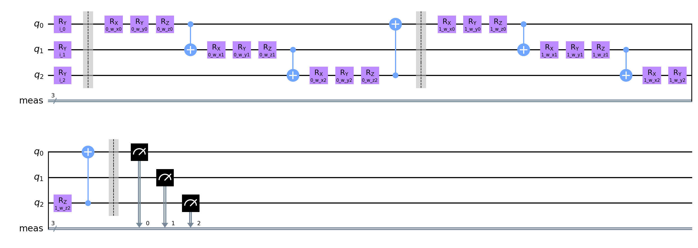
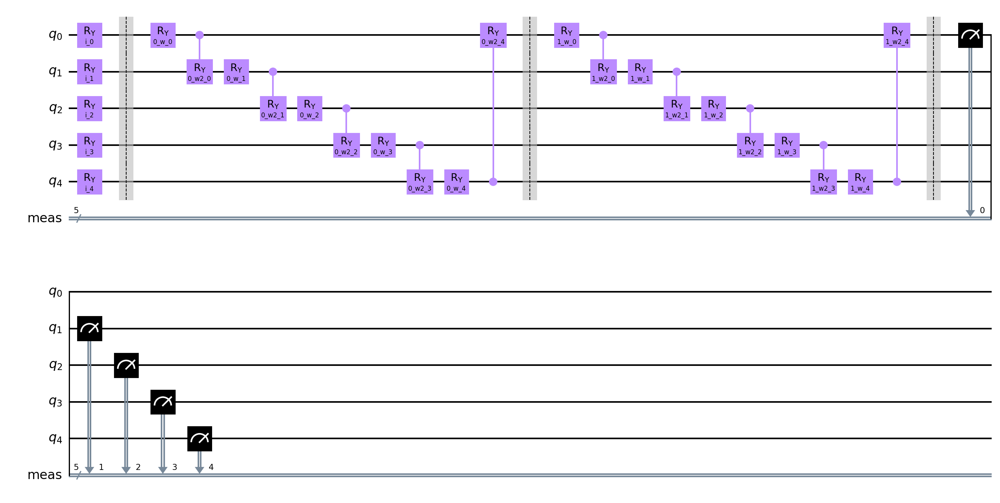

# Quantum Neural Network Classifier run

**Settings:**
Used Optimizer for Neural Network Classifier: `ADAM AMSGRAD`
Layer count: `2`

## Quantum Circuits
Quantum Circuits plots for each dataset
| dataset | circuit | plot |
| :-----: | :-----: | :--: |
| adhoc | qml_circuit_qiskit_01 |  |
| adhoc | qml_circuit_qiskit_02 |  |
| adhoc | qml_circuit_qiskit_03 |  |
| adhoc | qml_circuit_qiskit_04 |  |
| adhoc | qml_circuit_qiskit_05 |  |
| rain | qml_circuit_qiskit_01 |  |
| rain | qml_circuit_qiskit_02 |  |
| rain | qml_circuit_qiskit_03 |  |
| rain | qml_circuit_qiskit_04 |  |
| rain | qml_circuit_qiskit_05 |  |
| vlds | qml_circuit_qiskit_01 |  |
| vlds | qml_circuit_qiskit_02 |  |
| vlds | qml_circuit_qiskit_03 |  |
| vlds | qml_circuit_qiskit_04 |  |
| vlds | qml_circuit_qiskit_05 |  |

## adhoc
#### Average
| circuit | ø score train | ø score test | ø weights |
| ------: | :-----------: | :----------: | :-------: |
| circuit-00 | `0.5925` | `0.6` | `[0.23194334,0.75908875,0.46107423,0.68997736,0.6133991,0.29618265,-0.00863229,1.06296646,0.41559411,0.88468027,0.62814528,0.68811281]` |
| circuit-01 | `0.5800000000000001` | `0.55` | `[0.41594947,0.6558683,0.75034474,0.69450177,0.87158685,0.85755351,0.06219925,1.07353499,0.75257482,0.53236263,0.90907727,0.68409583]` |
| circuit-02 | `0.5975` | `0.53` | `[0.77698681,0.19349111,-0.10369333,0.98029824,0.29306571,-0.12856972]` |
| circuit-03 | `0.5650000000000001` | `0.51` | `[0.31136343,0.35923246,0.01678114,0.54463815,0.74742448,0.4875799,0.27446927,0.36924752,0.84438474,0.37953883,0.27142833,0.36674063,0.40723448,0.3840561,-0.1604631,0.2778155,0.55980308,0.41579545]` |
| circuit-04 | `0.5625` | `0.5900000000000001` | `[1.19027891,-0.0310812,0.62676461,1.25652192,0.31283821,0.19782957,0.12750561,1.21403005,0.61272295,0.26236595,0.38689398,0.64398316,0.90492816,0.36654244,0.77347954,0.42161136,0.62951023,0.41801374]` |

#### Per run data
| dataset name and run | circuit-00: score (train, test) and weights  | circuit-01: score (train, test) and weights  | circuit-02: score (train, test) and weights  | circuit-03: score (train, test) and weights  | circuit-04: score (train, test) and weights  |
| :----------: | :--------: | :--------: | :--------: | :--------: | :--------: |
| `adhoc_25` | `[0.5875,0.65]`, `[-0.35317706,0.80994004,-0.0736014,0.44055481,1.00596843,-0.24829461,-0.19330841,1.36634014,-0.03625876,0.9247251,0.38892336,0.04954814]` | `[0.55,0.5]`, `[-0.12761748,1.27440475,1.62179407,1.58474683,0.57166361,0.74094518,-0.18177646,1.57183405,0.98554501,0.68681653,0.19483069,0.44878415]` | `[0.6125,0.5]`, `[0.95772119,0.28039118,-0.29517352,0.8734679,0.44136612,-0.27501195]` | `[0.5625,0.6]`, `[0.11746491,0.35275507,-0.12881106,0.87846155,0.46479921,0.26540215,-0.4342976,0.59038351,0.74206115,0.23309043,-0.20030809,0.44476472,0.77720634,-0.32534964,-0.32008069,0.31742628,0.80741856,0.64841603]` | `[0.575,0.65]`, `[1.0727962,0.21363988,0.18928955,1.21034789,0.60082452,0.29328319,-0.03026857,1.54878186,0.44558856,1.06561875,0.56673868,0.8721301,1.47556167,0.32378409,0.62050765,0.45097864,0.90607557,0.93022558]` |
| `adhoc_26` | `[0.5875,0.5]`, `[0.95575698,0.01162256,-0.65005507,0.80071779,0.7538695,0.49794338,0.30317096,1.23582415,1.35103403,0.18441246,1.23412957,1.33441009]` | `[0.5875,0.6]`, `[0.51385325,0.53560405,0.14037165,0.48616788,0.90301022,1.05839197,0.51961642,0.62940581,1.07892612,0.69228449,1.14399941,1.08502282]` | `[0.5625,0.5]`, `[0.78554653,0.56221261,0.11311481,1.10787274,0.66739892,0.12324065]` | `[0.5125,0.45]`, `[0.21255383,-0.07271486,0.36649431,-0.14541308,1.25932955,0.31528924,0.43482057,-0.04632345,0.24891801,0.01355871,0.10175694,-0.31307741,-0.45694257,1.27547727,-0.15484312,0.00928756,0.44939839,0.48787714]` | `[0.55,0.7]`, `[1.4127925,-0.31967366,1.41532309,0.78974201,0.68970258,0.25109236,-0.06049677,1.1189099,0.32220999,-0.67809236,0.60079597,0.96625248,0.29021816,0.67404549,0.77599327,0.27243769,0.39130363,0.14097056]` |
| `adhoc_27` | `[0.6125,0.45]`, `[-0.1415059,0.80152582,1.30346408,1.10128244,-0.03440082,0.7780658,-0.24093187,0.84281858,1.45667057,0.72259732,0.30222782,0.39228346]` | `[0.6375,0.35]`, `[0.82610602,0.16581997,0.99417643,-0.4280468,1.24196412,1.45571657,0.29032297,0.3801424,1.03318862,-0.15447503,1.33723275,0.13984142]` | `[0.575,0.4]`, `[0.26403922,0.01310327,-0.44279643,1.19711385,0.1366751,0.11946914]` | `[0.6125,0.35]`, `[0.32550559,0.29951008,-0.24181476,0.05846803,0.73701264,-0.09235915,0.01009911,1.43466486,0.42082258,-0.05490512,0.61934154,0.25311314,1.33683544,-0.39296069,0.03546106,0.4651611,0.63728421,0.09184215]` | `[0.6375,0.3]`, `[1.49123815,-0.02394168,0.64697969,1.38362246,0.16372252,-0.62191858,0.55653197,1.13356905,0.66584165,1.18601249,0.24185155,0.36494694,1.07862983,0.36994336,0.80248026,0.68482668,0.59000305,0.27479984]` |
| `adhoc_28` | `[0.6,0.6]`, `[0.62233438,0.94265114,1.79070304,0.71549951,1.12290703,0.50361184,0.26824438,1.20057066,0.02180891,1.3554155,0.88348636,1.51264361]` | `[0.5625,0.55]`, `[1.05438076,0.5629104,1.85996869,0.97612383,0.81418254,0.72252492,0.42046458,1.24086149,0.49399242,0.68944716,1.00362684,1.61444892]` | `[0.6375,0.55]`, `[1.06426239,0.09215243,-0.11792913,0.78186272,0.05762668,-0.38924063]` | `[0.6,0.5]`, `[0.89541414,1.43936908,0.10995339,0.85422333,1.06118213,1.05616646,1.43684774,-0.27960086,1.30016142,1.66735614,0.60492426,0.65621378,-0.22613128,1.38938729,-0.32780613,0.09743623,0.65658296,0.7571831]` | `[0.5625,0.6]`, `[1.14598486,-0.00691838,0.09849336,1.55668298,0.10856597,0.40480074,0.04969026,0.94211898,0.70882019,0.14250517,0.16799324,0.26498507,0.77701991,0.21301403,0.71851807,0.25066891,0.81500291,0.33502543]` |
| `adhoc_29` | `[0.575,0.8]`, `[0.07630828,1.22970422,-0.0651395,0.39183226,0.21865134,-0.05041316,-0.18033653,0.66927878,-0.71528421,1.23625097,0.33195928,0.15167873]` | `[0.5625,0.75]`, `[-0.18697519,0.74060234,-0.86458712,0.85351712,0.82711374,0.31018892,-0.73763127,1.54543119,0.17122193,0.74773998,0.86569667,0.13238183]` | `[0.6,0.7]`, `[0.81336471,0.01959605,0.22431763,0.941174,0.16226172,-0.22130579]` | `[0.5375,0.65]`, `[0.00587867,-0.22275705,-0.02191617,1.07745094,0.21479886,0.8934008,-0.07512348,0.14711354,1.50996056,0.03859399,0.23142698,0.7926889,0.60520445,-0.02627371,-0.03504661,0.49976634,0.24833128,0.09365884]` | `[0.4875,0.7]`, `[0.82858284,-0.01851215,0.78373737,1.34221426,0.00137548,0.66189015,0.12207118,1.32677045,0.92115434,-0.40421433,0.35709047,0.75160119,0.90321122,0.25192526,0.94989844,0.44914488,0.44516599,0.40904729]` |

## rain
#### Average
| circuit | ø score train | ø score test | ø weights |
| ------: | :-----------: | :----------: | :-------: |
| circuit-00 | `0.6225` | `0.635` | `[1.17920246,-0.03541176,0.85966083,0.43322118,0.7634201,0.1523498,0.59013349,0.64739669,0.34240331,0.49056907,0.83935489,-0.12985498,0.92616163,0.72780761,1.03978248,0.12027326,0.69336758,0.58870785,0.17203472,0.53968684]` |
| circuit-01 | `0.645` | `0.635` | `[1.03848064,0.0792923,0.64483247,0.50857745,0.80144813,-0.11997037,0.54106231,0.66475957,0.02459987,0.23511356,0.68516241,0.08017577,0.63409283,0.81129176,1.13191563,0.2142094,0.71362339,0.30747315,0.16177377,0.26030236]` |
| circuit-02 | `0.5862499999999999` | `0.62` | `[-0.05822598,0.86989917,0.57894476,0.07524438,0.1061666,0.02950168,0.73343522,0.60156934,0.28996971,0.24752398]` |
| circuit-03 | `0.53625` | `0.535` | `[0.35260978,0.64438422,0.31647926,0.57862872,0.83450426,0.33721283,0.5506662,0.30247795,0.24557069,0.31084549,0.40588933,0.36026826,0.38546269,0.26764504,0.47522827,0.2677799,0.531041,0.31518526,0.61652426,0.64190065,0.17190835,0.94112676,0.5171793,0.58078146,0.60051545,0.44231937,0.44483097,0.47276092,0.58734178,0.50092631]` |
| circuit-04 | `0.6387500000000002` | `0.66` | `[]` |

#### Per run data
| dataset name and run | circuit-00: score (train, test) and weights  | circuit-01: score (train, test) and weights  | circuit-02: score (train, test) and weights  | circuit-03: score (train, test) and weights  | circuit-04: score (train, test) and weights  |
| :----------: | :--------: | :--------: | :--------: | :--------: | :--------: |
| `rain_30` | `[0.6125,0.65]`, `[1.40871175,0.42139092,1.28577129,0.39934359,0.57262938,0.8405726,0.22698286,1.51801634,0.86299406,1.10006892,0.65908505,-0.29884787,1.23494828,1.04730829,1.36752789,0.72755412,0.88369402,0.97999548,0.23434778,1.06610003]` | `[0.65,0.65]`, `[1.09319374,-0.71407331,0.37440353,0.33919699,1.10560473,-0.2144952,0.42451862,0.82984893,0.0916362,0.21556019,0.62150872,-0.27689358,-0.38835641,0.56646243,1.10937154,-0.04751444,0.73152306,0.09511436,-0.05179831,0.00468976]` | `[0.5625,0.65]`, `[-0.04575318,0.73552742,0.49008772,-0.24196069,-0.32638635,0.17678916,0.70023591,0.6408417,0.49039376,0.69944475]` | `[0.4375,0.35]`, `[0.47694732,0.7317557,0.38149784,0.65373118,0.70001031,0.45690493,0.99429581,0.83773226,0.11531552,0.85970089,0.57373305,0.8885474,0.83465929,0.3162841,0.16636131,0.77405821,0.97487298,0.4294156,0.82573061,0.88521642,0.6715978,0.61586233,0.41893451,0.29530119,0.17402096,0.53417409,0.63242409,0.72378858,0.4605817,0.49241021]` | `[0.6625,0.75]`, `[-0.05745135,0.70585338,0.41120301,0.02614122,0.59835441,0.42695853,-0.25199623,1.49240365,-0.11867431,0.39788691,0.34772795,1.23749981,0.85223657,0.42786363,0.83197192,0.13565459,1.18841347,0.091323,0.09543525,0.48039333,0.21436868,0.22299377,1.41042315,0.24352812,0.89453914,0.5759199,0.09451111,0.84148551,0.36498335,0.4428989]` |
| `rain_31` | `[0.6,0.5]`, `[0.65414847,0.20483938,0.96406012,0.77574415,0.72456463,1.22044585,0.66473288,1.29040798,0.50865216,1.15553368,1.36881145,-0.25566954,1.49050458,0.89479769,0.99714621,0.37915333,0.00402869,1.43331924,0.78137242,1.14056947]` | `[0.575,0.45]`, `[0.34983247,0.73772356,0.44889872,0.37767666,0.85734069,0.66429324,0.07748491,1.30804098,0.82498734,0.70262091,1.47048485,0.73908433,1.45306408,1.38453123,1.1975048,0.98275158,0.94305869,0.68838751,0.74903148,1.1850096]` | `[0.5875,0.45]`, `[-0.20050019,0.91112341,0.45554278,-0.10219423,0.27399333,-0.11442942,0.92102716,0.56634174,0.38966904,-0.02897528]` | `[0.5625,0.4]`, `[0.24301584,1.34992377,-0.12483757,1.45959598,1.44925807,0.41059782,-0.04119756,0.64067232,0.16096198,-0.16766467,1.05399994,-0.26155135,1.19498628,0.148123,0.82326452,0.39938691,0.71369251,0.64204709,1.45412478,1.12835003,-0.39581868,1.28144676,-0.04953553,0.65762696,1.21379198,0.67342267,0.82611205,0.37333861,0.16363448,0.16397631]` | `[0.575,0.4]`, `[0.04529466,0.05234508,1.57776121,0.0311064,1.4952709,-0.15016594,0.47430049,1.05825041,0.06397093,-0.62438467,1.2572673,1.0622739,0.26196589,0.74229977,0.69337759,0.08937145,0.99835139,1.15265815,0.09396632,0.53036638,-0.10149012,0.72307968,1.2335984,0.80624256,0.04793167,0.64238062,0.5241254,0.52769945,0.29645059,0.54789285]` |
| `rain_32` | `[0.6875,0.6]`, `[1.81706739,0.0105163,-0.16613475,0.30352862,1.32119727,-0.16890062,-0.08113868,-0.02301355,0.07445918,0.19914288,0.46107091,-0.50353381,0.35122264,0.94264864,0.91213863,-0.2122615,0.9634803,0.79325023,-0.22367295,0.13543431]` | `[0.7,0.55]`, `[1.24223942,-0.50942102,0.33483344,0.46771726,1.23589431,-0.323197,0.33479836,0.27458234,-0.30040166,-0.54554065,1.25355349,-0.13171813,0.28091256,1.17402256,1.63435493,-0.31962012,0.4382316,0.4876729,0.08293162,0.45162731]` | `[0.675,0.8]`, `[-0.50459531,0.77548458,0.51254783,0.62893328,1.13955088,0.08330522,0.45597417,0.3779029,-0.08148654,-0.93365935]` | `[0.6625,0.65]`, `[0.04370313,1.5440631,0.15534774,-0.0186533,1.64747192,0.33895723,1.38409171,-0.19439663,0.89772171,0.81545898,0.4935053,0.22120584,-0.39360186,1.41982597,-0.45840496,0.0992056,0.86320567,0.19171552,0.90776243,1.36878928,-0.27618468,1.50548048,0.84044943,-0.18452146,1.02665219,0.0711004,0.62219952,0.1957461,0.41942042,0.4781742]` | `[0.6625,0.55]`, `[-0.01850428,0.78752897,-0.27350605,0.17722278,0.42388555,0.38624338,-0.03357098,1.54039534,-0.04795165,1.27181688,0.30400125,0.97397892,0.90049042,0.16987039,0.13172816,0.39754084,1.15061873,1.09162772,0.03653955,0.39065801,0.05419377,0.17518405,0.71799596,0.66334388,0.59061821,0.51569408,0.54848855,0.99835908,0.46646203,0.57136023]` |
| `rain_33` | `[0.5,0.55]`, `[0.70133631,0.60015304,0.94483641,0.78465861,0.99613616,0.99353891,0.72945805,1.15804382,1.0566948,0.93040165,0.68159092,0.56222997,0.80461793,0.70391544,0.9250744,0.98954924,0.93931084,0.40645264,0.77301388,1.46240873]` | `[0.6125,0.7]`, `[1.72813818,0.47251505,1.68174436,-0.01663497,0.41161403,-0.48367706,1.33527529,1.33506945,0.10112205,0.62421228,0.17210172,0.19756123,1.33852897,0.01214552,1.38512207,0.09823798,0.37172865,-0.0319941,0.23832864,-0.11751412]` | `[0.6,0.6]`, `[0.2751815,0.6975783,0.71261614,-0.05262672,-0.67624667,-0.09238101,0.77130228,0.74466524,0.28955327,1.07684047]` | `[0.5125,0.5]`, `[-0.28582739,1.3678537,0.52016016,0.360982,1.47537831,0.45993343,-0.30330488,1.43344829,-0.15680691,0.1390386,0.87501541,0.25077206,-0.13043315,-0.19691272,0.7535053,0.58640348,0.73832546,0.0553483,-0.25377516,1.11552509,-0.17971163,1.59523117,1.3863089,0.44921002,1.41316429,0.53802968,0.10223845,0.38957948,0.33542703,0.53902593]` | `[0.675,0.75]`, `[0.53733205,0.6679788,0.77755411,-0.10349682,0.54104452,-0.08189928,0.53575172,1.00302097,0.2416563,0.07766577,0.99783302,1.05575027,0.84396773,0.36418835,0.41435587,0.0833858,0.91643194,0.22969728,-0.08544398,0.51717962,0.33620876,0.51034087,1.38720513,0.57121205,0.65707739,0.33862283,0.41539736,0.43964658,0.77548423,0.13334067]` |
| `rain_34` | `[0.675,0.7]`, `[0.89636744,-0.07665658,1.0998638,0.32331053,1.70793574,0.33368093,0.68346076,-0.11473787,0.24229568,1.70159985,-0.67771264,-0.06257646,1.67767981,0.4601895,1.02966555,0.09117632,0.83476799,-0.01610065,-0.02558288,0.34845056]` | `[0.7125,0.65]`, `[1.43439649,0.60937841,1.06452916,0.10796006,0.76981273,-0.72935752,0.72915035,1.10130452,0.06024047,0.20031992,0.29082062,1.23674331,1.63596185,0.36297886,1.25978818,0.28616249,0.74555675,-0.30382267,0.49745639,-0.12175383]` | `[0.5625,0.6]`, `[-0.04743238,0.91278383,0.50389783,-0.17931969,0.33944184,0.05588015,0.79057734,0.63476666,0.32313172,0.19287889]` | `[0.5375,0.5]`, `[1.32849187,0.10434181,0.29996938,1.57952288,0.38835129,1.20886913,1.03876452,-0.19151493,0.21714123,-0.1901748,0.22276339,0.22076247,-0.05395369,0.00764228,0.02353018,0.05906862,-0.23422318,-0.27429591,1.38367948,-0.31215971,1.57803404,0.82927483,0.28537941,1.23853667,0.73070429,0.43131416,0.11913888,-0.02674922,0.26640855,0.49782459]` | `[0.7,0.6]`, `[0.02627652,0.39617552,0.74280525,-0.10975186,1.21896804,-0.04404575,0.30706902,0.99078212,0.18131114,0.19531431,0.1326516,1.07391277,0.52711931,0.57874116,0.10468559,-0.03014262,0.8198203,0.29134585,-0.16520266,0.6418222,0.15526961,0.47046415,1.33555687,0.81487735,0.03333783,0.63939125,0.49315365,1.01015569,0.11352936,0.28222262]` |
| `rain_35` | `[0.6625,0.65]`, `[1.29296862,-0.12288358,1.426269,0.33587273,0.86306074,-0.63867564,1.31100003,0.36505366,-0.36852466,-0.15022645,0.85723052,0.03678222,0.68071413,1.07851391,1.18015868,-0.37978885,0.36145291,-0.14927865,0.15118547,0.53937431]` | `[0.6375,0.7]`, `[1.50544597,-0.12064368,0.03091975,0.78789197,0.88071543,-0.51620804,0.21608807,0.56568232,-0.03859479,-0.15791216,0.87706355,-0.66568057,0.42220737,1.11488069,1.41375065,-0.21353611,0.9638084,0.37655757,-0.22008606,0.50333304]` | `[0.5625,0.7]`, `[0.06267914,1.26547139,0.77503499,0.56963499,0.45075338,0.11229149,0.52298952,0.45688641,-0.09129725,-0.03856031]` | `[0.5125,0.65]`, `[0.07933924,1.50388508,-0.28700768,0.4576595,-0.22084153,-0.19706427,-0.00773394,0.32978878,-0.16283183,0.52549963,-0.28089621,0.14237723,1.00553083,-0.18126568,1.01285382,-0.05830859,0.37659464,0.52539216,-0.25545455,0.2463719,0.09173013,1.59283621,-0.01657807,0.70192472,0.10825372,0.74029516,0.54661426,1.01464924,0.72592372,0.25341665]` | `[0.6125,0.65]`, `[-5.82223024e-02,1.12384591e-01,1.12861360e+00,7.33094427e-03,6.51877468e-01,5.64982592e-01,-4.22321133e-01,1.24109312e+00,-5.59620793e-01,1.49047006e+00,8.27383511e-01,1.21406165e+00,8.40956422e-01,7.27179416e-02,5.70431377e-02,4.65046666e-01,6.98300908e-01,-2.63302978e-01,1.03852527e-03,2.48191970e-01,-4.76840527e-03,-7.90305291e-02,7.69058334e-01,4.14933791e-01,7.21986547e-01,1.37613085e-02,6.43807535e-01,8.01237052e-01,1.78141981e-01,4.53829135e-01]` |
| `rain_36` | `[0.5875,0.7]`, `[1.00609125,-0.87575912,0.61392008,0.31581183,1.26038489,-0.13988832,0.14209637,0.74058719,-0.21121986,0.09286973,1.46538166,-0.21009113,0.19653127,0.62201687,0.52785097,-0.1336941,0.34666066,0.5618925,-0.21630916,0.19180617]` | `[0.6,0.65]`, `[0.70551195,1.02946419,-0.16037715,1.53338228,0.68002085,1.33031747,0.2973834,0.41031361,-0.18335818,0.50712866,1.32914116,0.43032696,-0.75020919,1.60276439,0.18513052,1.19080891,0.40316017,1.31734662,-0.00285736,0.30737317]` | `[0.55,0.65]`, `[-0.10016074,0.95076457,0.51548072,0.12439245,0.29120218,-0.00910817,0.94866044,0.71056912,0.53097252,0.21387926]` | `[0.5125,0.65]`, `[0.43203108,0.13067836,-0.25685535,-0.33379931,0.31532251,-0.27179228,1.10486222,0.14419982,0.30930819,0.44733656,-0.25626628,-0.23849489,0.66511821,0.17556109,0.01066482,-0.31349754,0.11122942,0.3564092,0.2926277,-0.30313887,0.43652032,0.89853545,-0.04679812,0.24567626,-0.23901391,0.75348775,0.51527632,0.45378817,0.96667137,0.35415646]` | `[0.5875,0.7]`, `[-1.28799832e-02,5.69285528e-01,7.49717639e-01,2.87990200e-02,-7.92112253e-02,5.44129238e-01,-2.85645828e-01,1.14930951e+00,-4.63742731e-01,2.17962888e-01,6.58815019e-01,1.01397164e+00,7.26393040e-01,6.61283606e-01,6.89268824e-01,4.90079257e-01,8.18079440e-01,4.09773620e-01,4.58705492e-04,7.26731428e-01,4.50291321e-02,2.56290962e-01,9.38855427e-01,2.70350631e-01,5.98093773e-01,1.45797436e-01,7.59966911e-02,2.58758871e-01,2.61884302e-01,7.03638743e-01]` |
| `rain_37` | `[0.675,0.8]`, `[1.6006555,-0.52063128,0.22237718,1.214218,0.56064172,-0.56062857,0.7276212,0.1175106,-0.09194491,0.26110324,1.05250745,-0.55027746,0.49832499,1.39560903,0.82949494,-0.08123936,0.5558871,0.81058687,-0.33170012,0.16320344]` | `[0.7,0.75]`, `[-0.47819998,-0.08653236,0.52395041,0.60221907,1.35262506,0.22881325,0.46802372,0.30410591,0.08810903,0.30162683,-0.94003809,-0.28013094,0.82316123,1.55747376,1.31748155,0.07211739,0.53278621,0.09907932,0.09133222,-0.07175247]` | `[0.575,0.65]`, `[0.10085738,1.17536236,0.75812104,0.62368383,0.42976949,0.03582784,0.16182047,0.44466816,-0.38285706,-0.1919286]` | `[0.575,0.55]`, `[0.16868477,-0.31095943,0.64815687,1.48252348,1.71115681,0.21694693,1.34345292,-0.19711835,0.74473067,-0.29960306,0.09809337,0.71700388,-0.35433649,0.20698706,0.53671255,-0.15236019,0.17751057,-0.39100944,0.80872095,1.28538627,-0.1651526,0.27152541,0.66194271,1.64421531,1.00497973,0.26022227,0.12287819,0.32055495,0.7899059,0.72480768]` | `[0.675,0.7]`, `[-0.01412021,1.32690014,-0.10370024,-0.09141849,1.2378523,0.07604142,-0.01013261,0.66396084,0.16529188,1.02633796,0.46100057,1.29900148,0.42127079,0.52202988,0.56733256,0.063496,1.10898402,0.33770236,0.01007614,0.96316766,0.07592037,1.1097043,1.48608545,1.33048062,0.53077922,0.8454509,0.55955319,0.60641233,0.45925178,0.79814329]` |
| `rain_38` | `[0.65,0.8]`, `[1.7215381,-0.05422563,1.46939004,0.18383331,0.24278292,-0.70902205,0.77024347,-0.33112065,0.59008276,-0.22358461,0.99414981,0.12853783,0.95446644,-0.46684386,1.7979246,0.08092863,0.69089942,0.00602539,-0.26766319,0.42052881]` | `[0.65,0.8]`, `[1.17365198,-0.71695765,1.03799049,1.55626252,0.20350365,-0.74065123,0.96576627,0.35418815,-0.09843194,0.19967368,1.54928543,-0.21588543,0.53317565,0.99169177,0.744455,0.04025327,0.66133445,0.22869659,-0.30941933,0.42458391]` | `[0.6,0.6]`, `[-0.02772161,0.54413283,0.60194192,-0.34507752,-0.74073447,-0.04321045,0.8844363,0.75098134,0.80119838,1.04902344]` | `[0.475,0.7]`, `[0.94471139,0.12870471,0.26602351,0.48952424,0.82448731,0.28889078,0.22700606,0.08056121,0.4446035,0.18182658,0.07831126,0.38240136,0.43640601,0.42448569,0.74308533,0.76823203,0.77867447,0.85608751,0.82013088,0.54107277,0.28080937,1.03169512,0.14173921,0.3068913,0.8617741,0.10081855,0.0741105,0.44748613,0.915808,0.85007854]` | `[0.65,0.8]`, `[-0.1278208,1.27995564,0.78694184,0.10734395,-0.01000398,0.20581598,0.11966281,1.22783767,-0.07495036,-0.18484599,0.46211395,0.97646768,0.38896331,-0.01395198,0.86772206,0.10510623,1.38884578,0.56421773,0.02128318,0.69293497,0.06743371,0.57515337,0.40189619,-0.00679983,0.73999786,0.37701015,0.15936884,0.72069572,0.01753544,0.40228893]` |
| `rain_39` | `[0.575,0.4]`, `[0.69313974,0.05913895,0.73625514,-0.3041096,-0.61513243,0.3523749,0.72687795,1.7532194,0.76054393,-0.16121815,1.5314338,-0.14510352,1.37260619,0.59992063,0.83084295,-0.25864528,1.35349386,1.0609355,0.84535591,-0.07100746]` | `[0.6125,0.45]`, `[1.63059615,0.09146985,1.11143202,-0.66989731,0.51734983,-0.4155416,0.56213414,0.16445951,-0.29930982,0.30344591,0.22770269,-0.23164943,0.99248218,-0.6540336,1.0721971,0.05243302,1.34504596,0.11769342,0.54281841,0.03742725]` | `[0.5875,0.5]`, `[-0.09481444,0.73076299,0.46417665,-0.27302189,-0.11967761,0.09005205,1.17732866,0.68807009,0.63041926,0.43629655]` | `[0.575,0.4]`, `[0.09500056,-0.10640461,1.56233775,-0.34479944,0.05444763,0.45988462,-0.23357486,0.14140671,-0.11443716,0.79703623,1.20063406,1.27965857,0.65025153,0.35571963,1.14070981,0.5156105,0.81052749,0.76074256,0.18169546,0.46359329,-0.32274058,-0.21062013,1.54995058,0.45295364,-0.28917282,0.32032896,0.88731742,0.83542717,0.82963666,0.65539258]` | `[0.5875,0.7]`, `[0.4220667,0.52027311,1.17979888,0.00471695,0.26773848,0.50508533,0.11246045,1.05894488,-0.0155621,-0.14932097,1.16435647,0.91380569,1.33248457,0.45609027,0.0104774,0.64587717,1.37648174,-0.07316388,0.00268013,0.15613837,0.3202869,0.19129432,1.37423337,0.19890826,0.36515654,0.40314608,0.19963703,0.82041816,0.29445617,0.25003576]` |

## vlds
#### Average
| circuit | ø score train | ø score test | ø weights |
| ------: | :-----------: | :----------: | :-------: |
| circuit-00 | `0.7125` | `0.66` | `[0.85737151,0.20923276,1.19786815,0.33126256,0.77841232,0.49058146,0.80957508,0.25068217,0.46639049,0.88413395,0.70106388,0.39285482,1.24392083,0.52461872,0.71677101,0.36506015,0.84819188,0.09500256,0.66044771,0.61903403]` |
| circuit-01 | `0.7075` | `0.64` | `[0.83762542,0.52360066,0.69585212,0.71530991,0.70695819,0.47389042,0.86971298,0.31573379,0.49001187,0.79904734,1.18357571,0.34702543,0.86007836,0.74066656,0.80257153,0.61675707,0.95459364,0.23611362,0.72615084,0.84162335]` |
| circuit-02 | `0.65625` | `0.5950000000000001` | `[0.73428888,0.9747713,0.40838877,0.32870354,0.39040246,0.41226404,0.64968871,0.34304178,0.48305391,0.54207822]` |
| circuit-03 | `0.6599999999999999` | `0.6050000000000001` | `[0.37061438,0.20968714,0.30238687,0.26364307,0.4254234,0.39293059,0.63774523,0.32256631,0.34220545,0.3126436,0.26708752,0.3312277,0.48457674,0.39951088,0.41063713,0.21180349,0.12247854,0.34650995,0.11278402,0.34758075,0.52265534,0.46647431,0.22781447,0.59043932,0.49939088,0.53869286,0.56469811,0.5802539,0.5579032,0.49221119]` |
| circuit-04 | `0.7462500000000001` | `0.6950000000000001` | `[0.77851937,0.19560457,0.40149116,0.73731079,0.25541347,0.07026174,0.3778533,0.49488891,-0.09591303,1.00902427,0.41450522,0.91622378,0.09922712,0.21087683,0.55574787,0.45263116,0.84804324,0.38822754,0.80904108,0.52186829,0.03647389,0.61138624,0.21679623,1.16907847,0.50109719,0.52751309,0.44302303,0.45330668,0.50315113,0.43393006]` |

#### Per run data
| dataset name and run | circuit-00: score (train, test) and weights  | circuit-01: score (train, test) and weights  | circuit-02: score (train, test) and weights  | circuit-03: score (train, test) and weights  | circuit-04: score (train, test) and weights  |
| :----------: | :--------: | :--------: | :--------: | :--------: | :--------: |
| `vlds_40` | `[0.7625,0.9]`, `[0.81050891,0.26943497,1.24241032,0.76045058,1.57912817,1.0402882,1.14506834,0.30526441,-0.20797197,1.26659779,0.68355761,0.11543989,1.12914768,1.18996756,0.89012571,0.60570678,1.28810089,-0.07346169,1.17721056,0.77961777]` | `[0.6625,0.85]`, `[-0.29942724,0.71323802,0.410146,1.4247302,0.42519318,-0.47319767,-0.23467388,0.44603317,-0.8255233,0.83291345,1.31518922,0.75712157,0.452076,0.92477633,0.24424934,0.59320116,0.06025624,-0.13556908,1.55741419,1.44987574]` | `[0.6375,0.8]`, `[0.62454685,1.17627953,0.26316273,0.15744273,-0.6016923,0.23144397,1.4394619,0.4571358,0.61971488,0.64656414]` | `[0.6125,0.8]`, `[-0.06709952,-0.18972765,-0.31151563,0.10021059,1.15409205,0.2487466,0.17245115,0.45207868,1.19093703,0.7586928,0.55485675,0.34799005,0.69545729,1.43715169,0.66423121,-0.08241436,0.30535119,0.3788677,0.25690369,0.17218572,0.26972486,-0.34649492,0.02665922,-0.13108526,1.83436852,0.75798299,0.76288206,0.61666075,0.43746551,0.51279946]` | `[0.65,0.85]`, `[-7.17729354e-02,3.82858411e-01,6.34382128e-01,1.01901153e+00,1.55524769e+00,6.62208681e-01,6.82306473e-02,5.26240347e-01,-6.89306708e-01,-3.05748936e-01,5.75753225e-01,8.65291099e-01,1.88333627e-01,6.40246204e-01,8.58311832e-01,9.63254077e-02,7.58164651e-01,2.07915201e-01,5.17932172e-01,7.22537490e-01,-1.07749294e-02,-1.07565632e-01,1.00747204e-02,-8.81757796e-01,1.88800739e-01,2.29807478e-01,-6.17987870e-05,4.19695654e-01,1.07800883e-01,3.26985097e-01]` |
| `vlds_41` | `[0.6625,0.65]`, `[1.55620049,0.42921719,0.74086167,0.53034326,1.09807489,0.11076438,1.35350028,0.90573265,1.31479079,0.29373844,1.10724257,0.46808017,1.30201556,-0.50806162,0.55295623,0.25762575,1.62149942,1.42891457,1.32328034,0.26731596]` | `[0.675,0.65]`, `[1.43082391,0.34155161,1.04963743,-0.00484065,0.49996186,-0.10429597,1.5105528,-0.39649781,0.51397603,-0.39227846,1.38790198,0.57626222,1.20576219,0.41109314,0.49432102,0.23510414,1.33920731,-0.16927914,0.45970345,0.44124781]` | `[0.6375,0.6]`, `[1.34261737e+00,1.95603205e-01,9.46513930e-04,8.29370163e-01,1.37537260e+00,1.73463860e-01,-5.08961939e-01,-7.95149255e-02,1.39521863e+00,1.40174319e+00]` | `[0.65,0.65]`, `[0.17230668,0.75710145,0.27044538,-0.06686728,-0.28620437,0.64237512,1.4234172,0.53622557,0.47956596,-0.24031785,1.37290225,0.18717602,1.05993009,0.84879529,-0.00725453,0.14846697,-0.16274291,0.18878451,-0.2835026,0.2772265,-0.20220427,1.42633729,-0.41051874,0.3453895,0.30937344,0.79237764,0.85555524,0.78914658,0.79209711,0.51124024]` | `[0.8875,0.75]`, `[1.3514941,0.27560419,0.31598855,1.30039623,1.37175961,-0.7478703,0.80898752,0.19884279,0.20708408,1.00984142,0.18507945,0.27482722,-0.43755348,-0.19206262,0.01140477,0.86257519,0.96881577,0.38660256,1.03924333,0.85342883,0.058042,-0.21466896,0.05393131,1.50995019,0.12302494,0.45353612,0.18313401,0.31178823,0.45859116,0.81518719]` |
| `vlds_42` | `[0.675,0.6]`, `[-0.7271845,-0.01547567,0.78669567,-0.15912899,-0.17856293,1.40414388,0.57243092,0.61170919,0.36418367,0.45483123,-0.74219546,0.78848295,1.8483474,0.36877077,0.2682429,1.94408326,0.21207025,0.13618015,0.72269394,-0.40917597]` | `[0.6875,0.6]`, `[-0.0700305,0.43322156,1.11869588,0.78170817,0.23735593,0.8653452,1.00874657,1.66293315,0.90253995,1.07575137,1.25205939,0.03272259,1.12507815,0.60135321,0.74106708,1.72627505,0.87883794,0.91061388,1.24639485,1.37967272]` | `[0.65,0.6]`, `[-0.40021265,-0.09968619,-0.00871456,-0.27037889,1.42304803,-0.02850888,-0.44842654,0.13334395,-0.17730462,1.53132164]` | `[0.6625,0.6]`, `[1.24635173,0.30639268,-0.03711758,0.6097734,-0.12291289,1.56126141,0.1136813,-0.10758113,-0.30052511,0.45329989,-0.18988119,0.49962714,0.32462204,-0.14101347,1.13257161,0.6241654,-0.11877787,-0.08179052,-0.04356082,0.39880472,1.66954548,-0.40254874,0.35689755,1.31140851,-0.06135333,0.77393346,0.39521567,0.83685522,0.47680118,0.84770762]` | `[0.8125,0.65]`, `[1.76345319,-0.28339912,0.50741818,1.03435943,-0.30465774,0.23203657,0.78910428,0.34090813,0.17615515,1.35691946,0.45800147,1.24334902,-0.51089312,0.25927922,0.39468143,1.05581288,0.92048884,0.59290249,0.31430721,0.2210301,0.02821457,0.9090228,0.32980077,1.45117972,0.53250277,0.73515033,0.31172118,0.62025729,0.43772463,0.33023315]` |
| `vlds_43` | `[0.75,0.7]`, `[1.16121467,0.35738719,0.937504,0.344632,1.34715525,0.27693133,1.00287669,-0.43923888,0.31598128,1.38857591,0.98001342,0.92392669,1.2956331,0.99485976,1.51529252,0.44294894,1.47806607,-0.39167154,0.55622154,0.07086738]` | `[0.8125,0.7]`, `[1.29547715,1.27452382,0.82221703,1.34266748,0.11800171,-0.04389905,-0.42127024,0.38475023,-0.11205429,1.0540298,1.314388,0.98476615,1.67261237,0.41360235,0.02163833,0.21570724,0.05559832,0.21406589,1.04695397,1.62558819]` | `[0.675,0.65]`, `[1.27995242,1.38512659,0.00457851,-0.26139842,-0.08908612,1.13606919,1.40820684,0.17747056,1.23910285,0.1719103]` | `[0.65,0.65]`, `[1.55014166e+00,-5.20299465e-01,2.86508969e-01,1.52451788e-01,-2.54291035e-01,7.60989240e-01,1.47833482e-01,2.35484947e-01,5.82824315e-01,2.66345652e-01,-4.90319626e-02,9.72127588e-01,2.40850066e-01,-9.01875811e-04,7.96947654e-01,1.32794597e+00,5.75427260e-01,-2.85610014e-01,-1.36085953e-01,2.96021349e-01,1.46484587e+00,2.35227426e-01,-4.03918789e-02,3.71334213e-01,6.34116595e-02,9.17614780e-01,9.75074382e-01,8.36879282e-01,9.19493748e-01,3.88312651e-01]` | `[0.7625,0.7]`, `[0.36475913,0.01174292,0.38614717,1.14562865,-0.38831606,0.47824216,0.06354093,0.55458964,-0.22710418,1.38365541,0.25964518,0.39679261,-0.60932695,-0.2570195,0.95696183,-0.05023799,0.51426557,0.39482056,1.19515649,0.53366567,0.03812594,-0.57560273,0.20724378,1.31223283,0.52683802,0.54332144,0.62475043,0.34733475,0.89063173,0.34957394]` |
| `vlds_44` | `[0.7875,0.85]`, `[-0.56102849,0.26291827,1.40954027,0.65335445,1.07229958,-0.89318973,0.14403464,-0.21597284,0.54140977,1.25013408,-0.54269298,0.51534137,1.95642702,1.07157171,0.9443947,-0.58437233,0.31420575,0.07539217,0.50991921,0.68960588]` | `[0.675,0.6]`, `[1.3222571,0.12687507,1.05944308,0.78616523,1.60599669,-0.47197498,1.10677765,0.2322254,0.70700038,0.39409293,1.34604342,0.29300782,1.3719671,0.38257084,1.02977928,0.46641409,1.5159224,-0.22905011,0.20731809,-0.14734912]` | `[0.6625,0.55]`, `[0.36469682,1.7081918,1.26200974,1.29790245,0.12922261,0.05880136,1.13119957,0.2577053,-0.63624396,0.07285169]` | `[0.675,0.55]`, `[0.16722382,0.08686078,-0.21974623,0.44622038,1.5778531,0.04138517,0.00661609,0.27261623,0.14651035,0.69764275,-0.23243251,1.20785188,0.78439644,-0.03731679,-0.27145318,-0.06948913,0.18100706,0.19152818,-0.28777622,1.17625351,0.38811777,-0.16194391,0.12107779,0.82792819,1.20316145,0.50081576,0.08590224,0.33067955,0.39602753,0.79708472]` | `[0.725,0.7]`, `[1.33516723,0.2426991,0.65004188,1.08298795,0.09475365,-0.57061774,0.9939234,0.04658899,0.14917504,1.39582549,-0.25218784,1.4342411,0.10233094,0.24360883,0.8232583,1.17687941,0.55832515,0.49392911,1.18479248,0.8027269,-0.06067285,1.43358033,0.51742347,1.18532934,0.67768683,0.86514001,0.86329252,0.53368131,0.06131574,0.7763757]` |
| `vlds_45` | `[0.6875,0.6]`, `[1.0266351,0.51004737,1.56411744,-0.08616441,0.78678726,0.62902585,1.47943444,-0.4307276,0.58935126,0.06236411,1.57977501,0.7625291,0.55136111,-0.09757912,1.13115176,-0.03740594,1.19279896,-0.48920576,0.23125205,0.20159069]` | `[0.775,0.75]`, `[1.19452694,0.45184937,0.10082814,0.93661146,1.00902358,1.03944909,0.92091319,-0.18278419,0.63681798,1.21385865,0.98508689,0.54306697,0.6908141,1.12030181,1.29395967,0.01457763,1.62729335,-0.15715725,0.3744843,0.07388605]` | `[0.6375,0.6]`, `[1.01399069,0.19783137,0.09206947,1.0596104,1.61111405,0.09159175,-0.56377952,-0.06765933,1.09090262,1.46243088]` | `[0.6625,0.6]`, `[-0.14856795,0.42962843,0.06887835,1.12671696,1.61248597,0.33560333,1.40355012,0.46733104,-0.41286127,0.75912914,0.52468211,-0.0976787,0.52601363,1.25255357,0.2020027,0.06721572,0.10795906,0.06209133,1.64459923,0.74235873,0.17895616,1.58240204,-0.24496918,1.30821135,1.52056093,0.05434138,0.19602275,0.91080386,0.57064236,0.36043444]` | `[0.8125,0.9]`, `[0.71471632,-0.03370578,0.08789204,-0.32338525,0.38889057,-0.11113375,0.44049508,0.44291743,0.056872,1.56587377,-0.08146354,1.31456167,1.35506299,0.11216928,0.81202918,0.18610334,0.88706438,-0.33384531,0.88400802,0.26152522,0.01700219,1.03426568,0.44395348,1.56275962,0.65816577,0.22445729,0.73156726,0.5619846,0.51222395,0.40807272]` |
| `vlds_46` | `[0.7125,0.65]`, `[1.37430201,0.32628,1.16068366,0.01589417,0.84798423,1.10396323,1.33225586,0.04504819,0.4385925,1.33914161,0.54166469,0.201567,0.67483267,0.78876362,1.09039963,1.01701125,1.1638126,-0.05335717,0.55242379,1.42970099]` | `[0.725,0.6]`, `[0.96363991,0.21625687,0.47988676,0.45559734,0.84013059,1.13382825,1.16659469,-0.13577061,0.3990635,1.52073914,1.06594131,0.26466423,0.24170275,0.73569086,1.3996347,0.4401729,1.16483398,0.12264365,0.54935868,0.91427061]` | `[0.675,0.5]`, `[0.37971981,1.02043724,1.15943949,0.14559035,-0.07819279,0.05616878,0.7930397,1.15054157,-0.18772279,0.10400895]` | `[0.6875,0.55]`, `[0.02846435,0.33359751,1.46181747,0.21688194,0.15464618,0.14130485,-0.1845506,0.63390007,0.01214791,-0.16672467,-0.01206082,-0.19531657,-0.40343775,-0.05125424,-0.26910599,-0.02551708,-0.32274006,1.64292249,-0.08608813,-0.08661725,0.24699603,0.08871953,0.70868023,0.9483512,0.25562338,0.75237042,0.86589307,0.20893448,0.2415458,0.22684242]` | `[0.6625,0.5]`, `[1.71338284,1.06292396,-0.35963518,0.96957094,1.2462673,-0.02768017,-0.03002784,1.28268306,-0.06990401,-0.46792892,0.72521575,1.15799181,1.14491953,1.06188948,1.02000591,1.04568577,0.58706942,0.66309863,0.83485605,0.30124655,0.07935892,1.45083315,1.4233238,1.51859784,0.37285149,0.37435676,0.61721433,0.41290598,0.86429775,0.11352657]` |
| `vlds_47` | `[0.7,0.65]`, `[1.08190299,0.31444122,1.4649713,0.62513545,0.26139882,0.52389448,0.01483484,0.93929462,0.41167237,1.39008987,0.84673836,-0.18467057,1.52021759,0.47242656,0.1308199,-0.38299559,-0.07265721,0.20674729,0.71841966,1.44330991]` | `[0.7,0.65]`, `[1.01193751,0.39088202,0.50495291,-0.06041066,0.87760778,1.3227161,0.88831903,-0.09393311,0.57862845,1.38368374,1.13059393,-0.09386088,0.25095391,0.93707688,0.81122466,0.80770766,0.89363214,0.36949732,0.39956993,1.4253337]` | `[0.6375,0.65]`, `[1.32274078,1.10218269,0.00706173,0.13603719,0.20594024,1.23409556,1.22102875,0.05449481,0.80816804,-0.11812156]` | `[0.65,0.65]`, `[0.25010588,-0.13702158,0.07559698,0.08653562,0.2687638,0.72797529,1.43254282,-0.19695067,0.61530689,-0.20997267,1.18015618,-0.27394554,0.30990421,0.83578412,-0.41782782,0.17883126,0.29021808,-0.20136839,-0.22052588,-0.13294783,-0.34159101,1.29895101,0.43050914,0.0904156,0.34627173,-0.00463828,0.51667345,0.89217681,0.55111333,0.84163065]` | `[0.775,0.85]`, `[0.41786425,0.06640998,0.26475519,1.37522481,0.02939924,-0.19168961,0.24499449,0.33202924,0.14722272,1.5528634,0.84737369,0.76410384,-0.25630282,-0.18499768,0.09078552,-0.01319785,0.73981518,0.28507236,1.12908952,0.23480706,0.02616769,1.15365809,-0.40841546,1.51781922,0.96584604,0.59277497,0.31884539,0.84560055,0.61688623,0.31520369]` |
| `vlds_48` | `[0.7125,0.45]`, `[1.3837065,-0.13780828,1.35764892,0.47673822,-0.03421258,1.30233847,-0.08421983,0.26735488,0.70875498,1.58852923,1.57415021,0.37155878,0.75432343,0.0145453,0.23961976,-0.31720443,-0.06874565,0.06551335,0.18960578,1.5596906]` | `[0.7,0.45]`, `[1.5495139,0.24142447,0.45119622,0.49615291,0.94769403,0.11417536,1.53105378,-0.19704152,0.62579184,-0.14692224,0.94580633,-0.19754901,0.91983392,1.18167673,1.37595971,0.30320417,1.31743542,0.48262451,0.20621872,0.22142838]` | `[0.7,0.45]`, `[1.12902279e+00,1.48403649e+00,1.11400114e-03,-2.80357515e-01,1.30435649e-01,9.01583980e-01,1.42465466e+00,1.78859155e-01,1.10302077e+00,-4.89348395e-02]` | `[0.6875,0.45]`, `[-0.00773423,0.25742518,1.62780102,0.33867885,0.24476604,-0.33245389,0.19054639,0.31329287,0.34072663,0.3791965,-0.31756282,1.07165143,0.31134005,-0.48211592,1.31605212,0.227802,0.1789886,1.16199689,-0.0318116,0.25905826,0.75800328,-0.38534353,1.36947665,0.60281909,-0.31832871,0.07594187,0.96633839,0.16490987,0.60725079,0.24050636]` | `[0.6875,0.4]`, `[0.21665475,0.23180389,1.30191382,0.0221582,-0.70711975,0.2174268,0.34866951,0.94648397,-0.18708142,1.43533145,0.44918023,1.25422078,-0.14468563,0.03207538,0.40862842,0.09004656,1.46100011,1.05319235,0.077752,0.81698997,0.19901365,0.61788806,-0.35939106,0.965164,0.10546122,0.95577384,0.43276716,0.32224451,0.28602159,0.5853754]` |
| `vlds_49` | `[0.675,0.55]`, `[1.46745743,-0.22411467,1.31424828,0.1513709,1.00407044,-0.59234547,1.13553462,0.51835703,0.18714021,-0.19266278,0.98238541,-0.03370714,1.40690272,0.95092267,0.40470702,0.70520383,1.35276767,0.04497424,0.62345025,0.15781713]` | `[0.6625,0.55]`, `[-0.02246449,1.04618377,0.96151779,0.99471767,0.5086165,1.35675791,1.22011622,1.43742315,1.47387813,1.05460504,1.09274663,0.3100526,0.66998306,0.69852347,0.61388155,1.36520665,0.69291933,0.95274654,1.21409226,1.03227946]` | `[0.65,0.55]`, `[0.28581388,1.5777103,1.30222009,0.47321691,-0.2021374,0.26793087,0.6004637,1.16804091,-0.42431733,0.19700777]` | `[0.6625,0.55]`, `[0.51495135,0.77291409,-0.19880002,-0.37417158,-0.09496488,-0.19788124,1.67136436,0.61926549,0.76742183,0.42914448,-0.16075278,-0.40720632,0.99669131,0.33342646,0.96020754,-0.27897183,0.19009502,0.40767732,0.31568844,0.37346379,0.79415922,1.3294369,-0.03927609,0.2296208,-0.1591803,0.76618854,0.02742389,0.21549259,0.58659465,0.19555337]` | `[0.6875,0.65]`, `[-2.05251843e-02,-8.91821303e-04,2.26007841e-01,-2.52844590e-01,-7.32089767e-01,7.61694768e-01,5.06149158e-02,2.77605458e-01,-5.22243009e-01,1.16361021e+00,9.78454594e-01,4.56858639e-01,1.60386123e-01,3.93579690e-01,1.81411496e-01,7.63188654e-02,1.08542331e+00,1.38587433e-01,9.13273537e-01,4.70725164e-01,-9.73829582e-03,4.12451618e-01,-4.99825520e-02,1.54950973e+00,8.59794124e-01,3.00812661e-01,3.46999832e-01,1.57573892e-01,7.96017646e-01,3.18767143e-01]` |

