# QNN data run (SVM Quantum Kernel)

## custom (id: 1)

[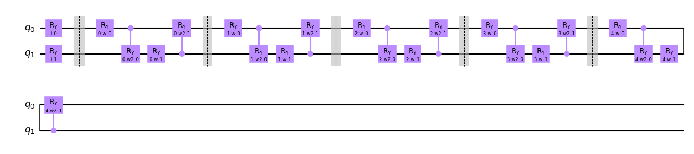](assets/custom-qml_circuit_qiskit_01-5_layers.png)

Score train: 0.5875
Score test: 0.4

[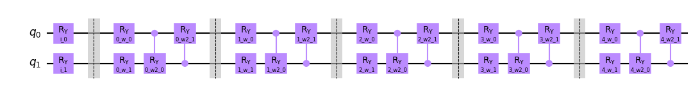](assets/custom-qml_circuit_qiskit_02-5_layers.png)

Score train: 0.6125
Score test: 0.35

[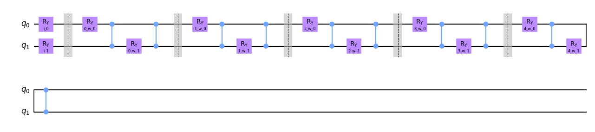](assets/custom-qml_circuit_qiskit_03-5_layers.png)

Score train: 0.625
Score test: 0.4

## iris (id: 14)

[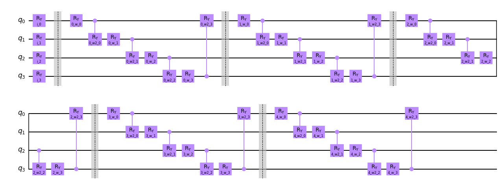](assets/iris-qml_circuit_qiskit_01-5_layers.png)

Score train: 1.0
Score test: 1.0

[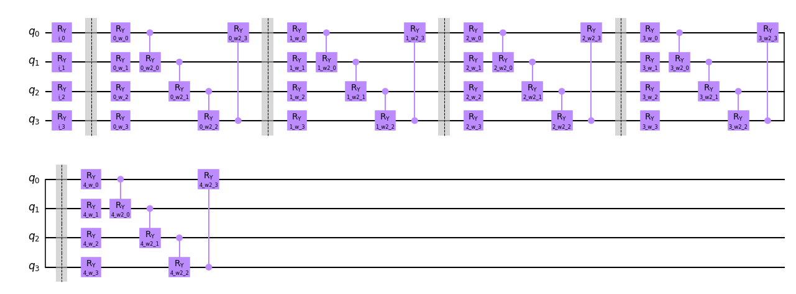](assets/iris-qml_circuit_qiskit_02-5_layers.png)

Score train: 1.0
Score test: 1.0

[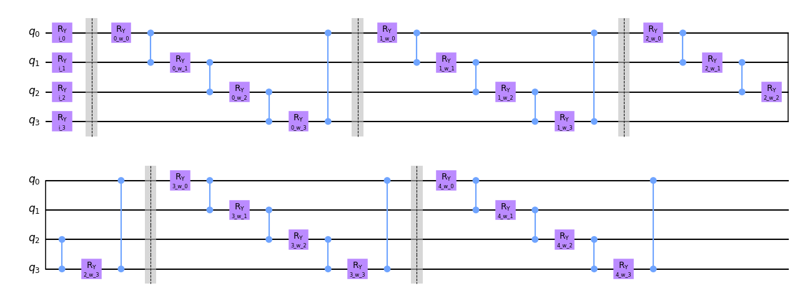](assets/iris-qml_circuit_qiskit_03-5_layers.png)

Score train: 1.0
Score test: 1.0

## adhoc (id: 27)

[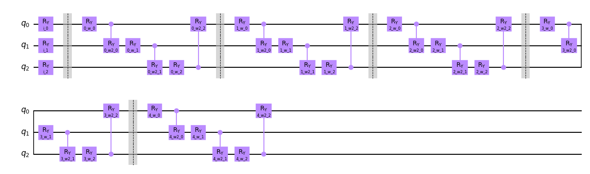](assets/adhoc-qml_circuit_qiskit_01-5_layers.png)

Score train: 0.5375
Score test: 0.45

[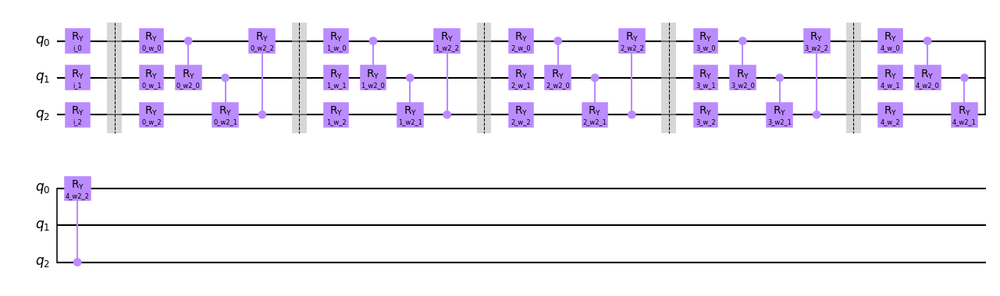](assets/adhoc-qml_circuit_qiskit_02-5_layers.png)

Score train: 0.575
Score test: 0.45

[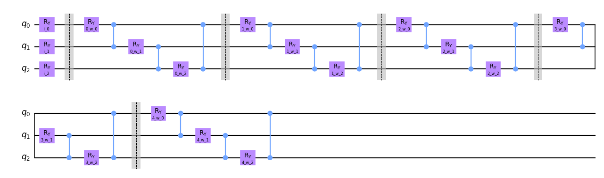](assets/adhoc-qml_circuit_qiskit_03-5_layers.png)

Score train: 0.5
Score test: 0.6

## rain (id: 40)

[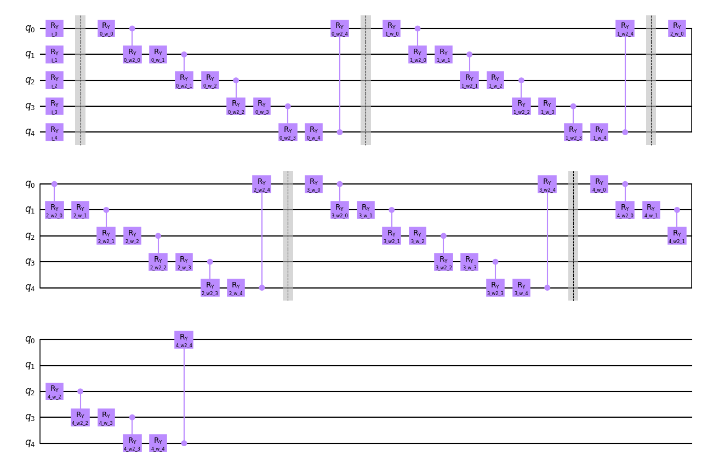](assets/rain-qml_circuit_qiskit_01-5_layers.png)

Score train: 0.6875
Score test: 0.5

[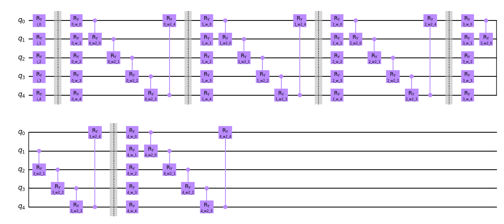](assets/rain-qml_circuit_qiskit_02-5_layers.png)

Score train: 0.7125
Score test: 0.65

[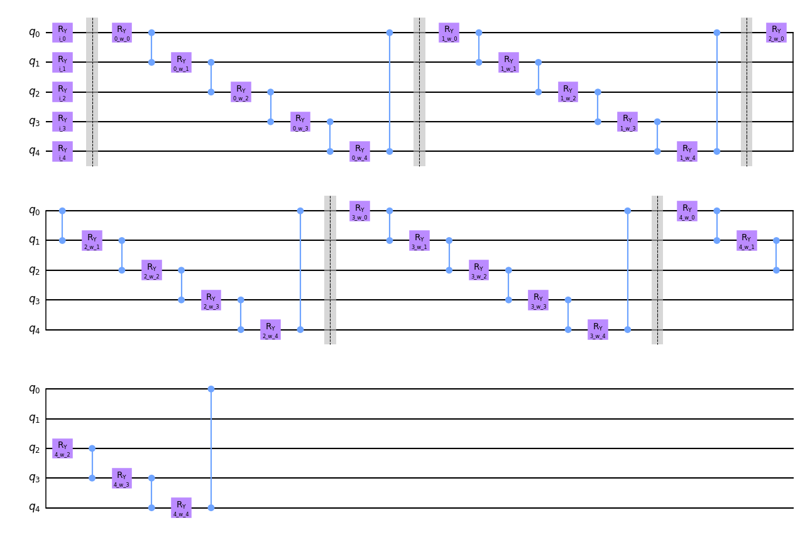](assets/rain-qml_circuit_qiskit_03-5_layers.png)

Score train: 0.75
Score test: 0.75

## vlds (id: 53)

Score train: 0.75
Score test: 0.8

Score train: 0.8
Score test: 0.75

Score train: 0.7
Score test: 0.75

EOF
