# Quantum Neural Network Classifier run

**Settings:**
Used Optimizer for Neural Network Classifier: `COBYLA`
Layer count: `2`

## Quantum Circuits
Quantum Circuits plots for each dataset
| dataset | circuit | plot |
| :-----: | :-----: | :--: |
| adhoc | qml_circuit_qiskit_01 | 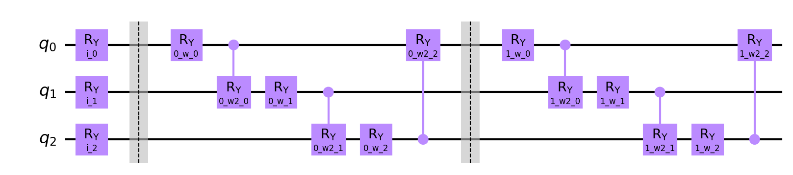 |
| adhoc | qml_circuit_qiskit_02 |  |
| adhoc | qml_circuit_qiskit_03 | 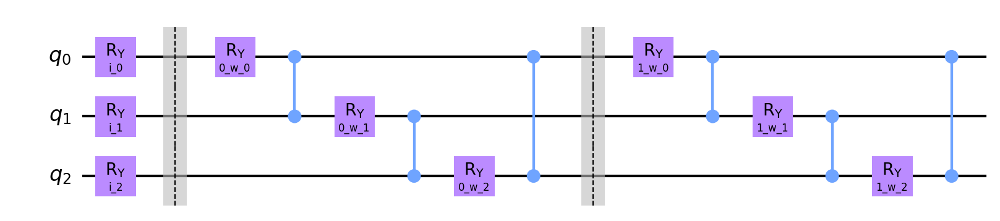 |
| adhoc | qml_circuit_qiskit_04 | 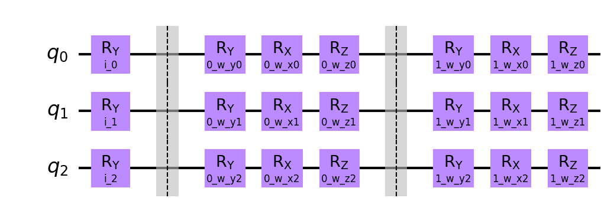 |
| adhoc | qml_circuit_qiskit_05 | 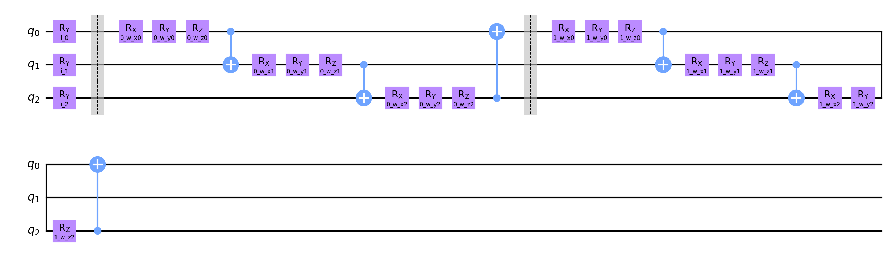 |
| custom | qml_circuit_qiskit_01 | 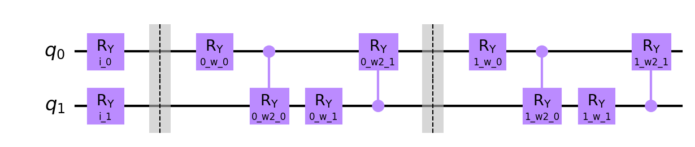 |
| custom | qml_circuit_qiskit_02 | 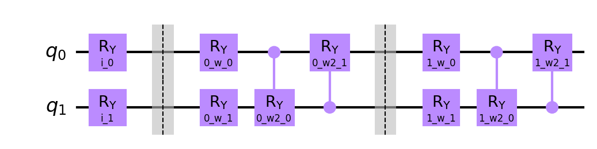 |
| custom | qml_circuit_qiskit_03 | 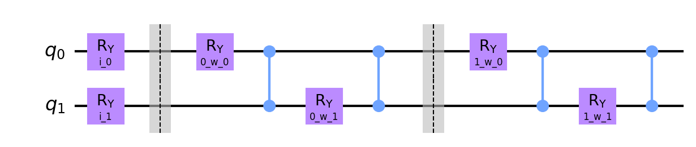 |
| custom | qml_circuit_qiskit_04 | 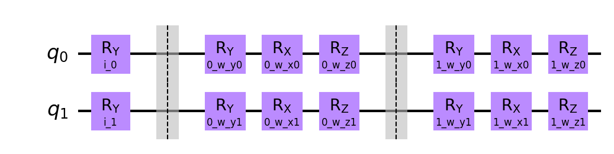 |
| custom | qml_circuit_qiskit_05 | 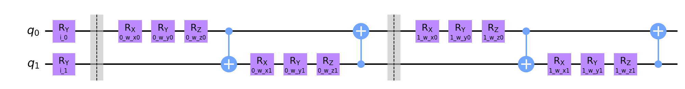 |
| iris | qml_circuit_qiskit_01 | 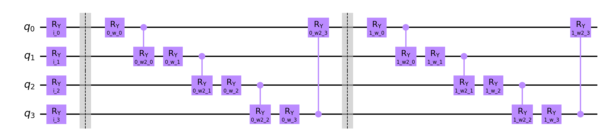 |
| iris | qml_circuit_qiskit_02 | 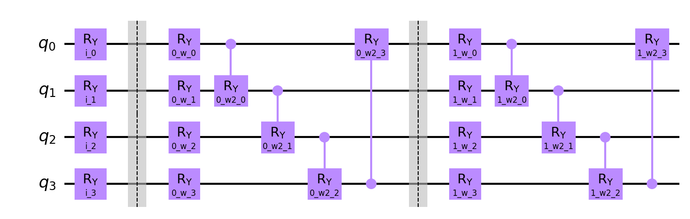 |
| iris | qml_circuit_qiskit_03 | 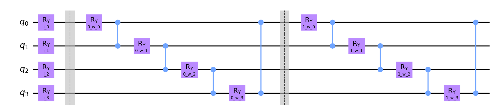 |
| iris | qml_circuit_qiskit_04 | 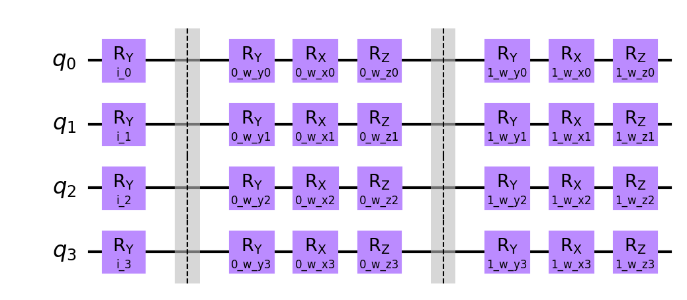 |
| iris | qml_circuit_qiskit_05 | 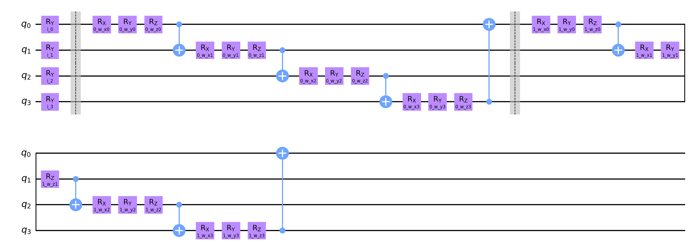 |
| rain | qml_circuit_qiskit_01 |  |
| rain | qml_circuit_qiskit_02 | 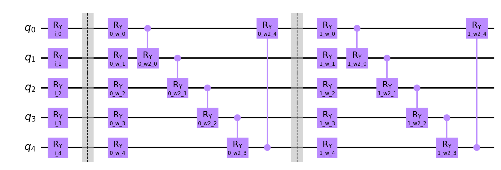 |
| rain | qml_circuit_qiskit_03 |  |
| rain | qml_circuit_qiskit_04 |  |
| rain | qml_circuit_qiskit_05 |  |
| vlds | qml_circuit_qiskit_01 | 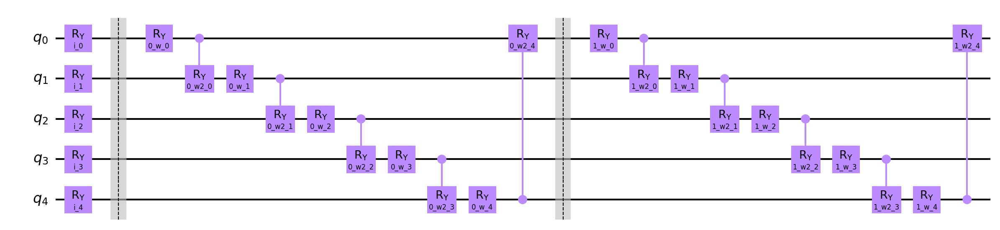 |
| vlds | qml_circuit_qiskit_02 |  |
| vlds | qml_circuit_qiskit_03 | 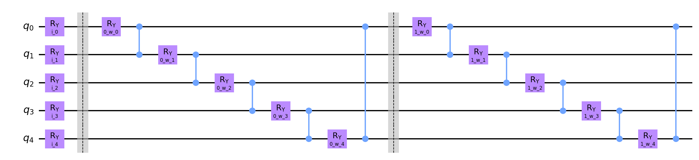 |
| vlds | qml_circuit_qiskit_04 |  |
| vlds | qml_circuit_qiskit_05 |  |

## adhoc
#### Average
| circuit | ø score train | ø score test | ø weights |
| ------: | :-----------: | :----------: | :-------: |
| circuit-00 | `0.59875` | `0.465` | `[0.6906254,0.98425992,1.18416758,0.69466579,0.83674604,0.48877802,0.22340723,1.34191265,0.59393401,0.61076196,0.37990625,0.44372398]` |
| circuit-01 | `0.595` | `0.48500000000000004` | `[0.92622987,1.03665154,0.76478255,0.73566896,1.1885049,0.55703442,0.45826835,0.88869236,0.54806325,0.22169205,0.5029636,0.42693125]` |
| circuit-02 | `0.57625` | `0.51` | `[0.92790133,0.58566658,-0.18625811,0.64606397,0.20240735,0.22246152]` |
| circuit-03 | `0.565` | `0.495` | `[0.52545269,0.61703661,0.75238184,0.66618697,0.77940171,0.53372471,0.67374763,0.79323707,0.7383329,0.5176443,0.37552368,0.83477897,0.59978253,0.43691038,0.56015295,0.61513341,1.09763872,0.91802761]` |
| circuit-04 | `0.5725` | `0.55` | `[1.47952655,0.24226368,0.68026081,1.35090415,0.37187903,1.13179612,0.80342629,0.99218208,0.36234969,0.68239438,0.17041444,1.14016464,0.98195242,0.15561563,0.40198384,0.6348018,0.71506468,0.35053014]` |

#### Per run data
| dataset name and run | circuit-00: score (train, test) and weights  | circuit-01: score (train, test) and weights  | circuit-02: score (train, test) and weights  | circuit-03: score (train, test) and weights  | circuit-04: score (train, test) and weights  |
| :----------: | :--------: | :--------: | :--------: | :--------: | :--------: |
| `adhoc_20` | `[0.675,0.35]`, `[0.07653059,0.30119931,1.31244973,0.97872482,0.12952819,0.79337974,0.09807356,1.62483873,0.37780904,1.12127897,0.20133234,0.4805781]` | `[0.65,0.35]`, `[0.66954969,0.52988102,1.72440915,1.31516085,0.39237704,0.56252064,-0.14229117,1.85193784,0.37153095,0.74145593,0.12202444,0.55768918]` | `[0.5875,0.3]`, `[2.51952439,3.06269509,-0.53373163,-0.95790499,0.08932355,2.84221053]` | `[0.6,0.45]`, `[1.35427045,0.22595055,0.6040077,0.19625939,2.56754404,0.80553736,0.9461839,0.36499727,-0.85391642,-1.15605263,-0.17114429,2.08471828,0.2676385,0.89612177,-0.35849395,1.39049255,1.00338821,1.16177928]` | `[0.625,0.35]`, `[1.38179531,0.25624426,0.58066973,1.48840671,0.11864189,0.53332836,-0.19430341,1.87066234,-0.16197528,-0.01706741,0.22434503,1.82270244,1.45283342,0.25986696,0.5531854,0.90823032,1.55889958,0.89887204]` |
| `adhoc_21` | `[0.575,0.45]`, `[0.98974157,0.67813549,0.84323908,0.19761759,0.17618553,0.76459887,-0.04417362,0.8745111,0.51983451,0.65812201,1.01741575,0.17207086]` | `[0.55,0.45]`, `[0.64448305,1.26906791,1.3197617,-0.15582912,0.70948547,0.45298739,0.63304397,0.4595103,0.09528884,0.53103992,0.78394098,0.26787554]` | `[0.55,0.7]`, `[0.41108058,0.90005491,-0.74320882,0.53926062,-0.16071711,0.05032031]` | `[0.5125,0.45]`, `[-0.05686767,0.19145004,0.03099048,0.19364097,0.75835467,0.18009521,0.05934275,0.18572891,0.19754828,-0.00563449,-0.09048103,0.31057087,0.02540563,0.49528321,0.59986033,0.11971275,0.64327128,1.41168655]` | `[0.5625,0.75]`, `[1.69630567,0.5924622,1.86281391,1.23758323,0.70209068,1.82015981,0.12294481,1.34782367,0.04950074,0.36947841,0.36985917,0.69265725,0.38555297,0.05560714,0.59945472,0.84523958,0.38899252,0.55151542]` |
| `adhoc_22` | `[0.6125,0.5]`, `[-0.85876095,0.85239014,2.1947205,0.99871947,0.7277227,0.94946807,0.22375961,2.1906904,0.79968285,0.99792588,0.60426193,1.12228398]` | `[0.6375,0.4]`, `[0.09243376,0.83818581,1.6619002,1.14296575,0.31346494,0.11791577,0.48798688,2.32490659,1.02639293,0.24684893,0.46021741,0.6070588]` | `[0.6375,0.4]`, `[0.40496692,-0.04762955,-0.35897581,0.62164934,0.19505092,-0.29349174]` | `[0.55,0.45]`, `[1.67778944,0.06058263,1.82467314,1.50585569,0.57525614,-0.25740267,-0.48399712,2.09571956,0.13231025,1.94066066,0.55458667,1.60001967,1.24018244,0.26326611,1.42627679,0.4555369,1.66261669,0.47299688]` | `[0.6,0.5]`, `[1.391409,0.08602452,1.33791648,1.75590022,0.16766794,1.6740113,0.82427281,0.824679,0.33274337,0.56594113,0.34160543,0.84448743,0.81872667,0.45850732,0.48031286,0.36493867,1.05306485,0.82038035]` |
| `adhoc_23` | `[0.6,0.35]`, `[1.78360682,0.59098406,0.79903432,0.10288339,0.74713292,0.62695491,0.14019162,-0.11142206,0.06509103,-0.37390965,0.43250745,-0.12591374]` | `[0.5625,0.4]`, `[1.79458357,0.86901661,-0.13088015,0.20943415,1.65772342,0.45419633,0.5949961,0.74286765,0.1611228,0.71215244,0.29724337,0.43280524]` | `[0.5875,0.65]`, `[-0.13643349,-0.26627883,-0.72597931,1.58101404,0.64962963,-0.1973593]` | `[0.525,0.35]`, `[-0.09153167,-0.20003471,0.17575308,0.5581419,0.79293076,0.40929571,1.23508908,0.38045859,0.1410739,0.10359796,0.11559577,-0.160111,0.25476406,0.02839266,0.20006269,0.13903812,1.07924666,-0.09912758]` | `[0.5875,0.65]`, `[-0.05275545,0.70375485,0.96184445,1.22728887,0.63467103,1.35548251,1.32545189,0.74220246,0.20808713,1.0346464,0.0034954,0.94500958,0.52660244,0.16123755,0.15417773,0.49838271,0.65934501,0.05547209]` |
| `adhoc_24` | `[0.575,0.6]`, `[0.82611292,0.94756199,1.60533174,0.34520471,0.58669581,0.51365365,0.2498446,1.93398505,1.13121295,0.96450029,1.53680606,0.75237265]` | `[0.5875,0.7]`, `[0.55355174,1.67710748,0.22927521,0.61535915,1.37785151,0.67360864,0.09344761,0.84106408,0.67735692,0.7890548,0.10219419,0.08234263]` | `[0.5375,0.4]`, `[1.28943258,1.19269086,0.16087827,0.42473389,0.83979752,0.4832283]` | `[0.525,0.5]`, `[0.44941091,1.6619128,1.77708751,0.49906009,0.38859502,0.03702173,0.32384827,0.84958915,1.9794876,0.59675868,1.48091769,1.27807197,0.82369737,0.34075452,0.92915086,0.44766047,0.45168111,0.56791169]` | `[0.525,0.55]`, `[2.44208966,0.30972139,-0.01830121,1.14391256,0.82438958,1.11458481,1.21644994,0.45364902,0.01310064,1.66602814,-0.03207645,0.63026585,0.92215352,0.10517515,0.45632818,0.69091111,1.85315034,0.41144767]` |
| `adhoc_25` | `[0.6,0.5]`, `[-0.01075296,0.79256805,-0.48686773,1.84731211,1.66132364,-0.24529723,-0.12556388,2.25065862,0.16245684,-0.37500445,-0.19254497,-0.3552398]` | `[0.6375,0.45]`, `[0.55488641,0.32560374,-0.11909605,0.61854762,1.89307161,0.71907081,0.73162659,0.54076108,0.63192559,0.38819908,0.95083408,0.86404768]` | `[0.55,0.5]`, `[0.83543937,0.35401786,-0.10481643,1.08018352,0.49951466,-0.07946245]` | `[0.6125,0.65]`, `[0.81775925,0.7101509,1.29496423,0.42685693,-0.14554342,2.05716907,1.45126306,1.67835362,0.38928783,1.80478905,-0.3917575,-0.95417021,0.57250099,-0.50176027,0.69935124,0.50634517,0.46107294,0.66871446]` | `[0.6,0.6]`, `[0.49572301,0.01157077,0.22843626,1.86965154,0.28555606,0.88458257,0.01576606,0.94388138,0.09094524,0.52025954,0.42401807,0.53324161,1.9599996,-0.03919626,0.51284252,1.23039852,0.5525374,-0.04829697]` |
| `adhoc_26` | `[0.55,0.35]`, `[0.74293786,1.40136968,-0.07964279,0.83319978,1.42439399,0.6097394,1.11008439,0.43036549,0.31082121,0.90871527,-0.10823978,0.91637143]` | `[0.6,0.45]`, `[1.99898665,1.37699868,0.08382651,1.70135241,1.22135096,0.73563522,0.27771524,0.44606152,0.99961413,-0.39108165,0.18745151,0.22127408]` | `[0.5625,0.45]`, `[1.28028454,0.3287184,0.60452449,0.70337862,-0.05451064,0.32272806]` | `[0.5875,0.55]`, `[0.58168537,0.19572154,0.08056935,0.05766873,0.18147826,1.07071188,-0.0822929,0.13100314,1.92269844,0.50355456,-0.11841735,1.03892003,2.26440204,-0.56794949,0.35643107,1.35136502,1.46342979,0.85179826]` | `[0.5625,0.5]`, `[2.51418093,0.10766174,0.14540066,0.47044712,0.88458563,0.51690109,1.27691756,1.48294197,1.25896283,0.22558174,-0.17008713,1.04502749,1.22349977,-0.05865475,0.13220602,0.69269526,0.54713344,0.04153798]` |
| `adhoc_27` | `[0.6125,0.4]`, `[1.52582792,1.58935388,1.01696733,0.32809791,2.07529718,0.31844037,-0.27984582,-0.02809987,0.47150673,-0.2784038,0.37790691,0.50819319]` | `[0.6375,0.5]`, `[1.37385683,1.44122174,1.29732658,0.1735162,1.48678283,0.36106071,0.34503017,0.2160898,0.08556796,-0.32923574,0.60178703,0.21815972]` | `[0.6125,0.45]`, `[0.42068432,0.12536446,-0.17041171,0.97010604,0.11271428,-0.21934397]` | `[0.5875,0.4]`, `[0.53755248,0.59259176,1.53440659,1.4677398,1.92143468,0.11653395,1.69850768,0.28738909,-0.15381244,-0.0159246,-0.48659735,1.68856975,-0.27705118,1.73704018,1.5283028,0.33082618,1.75129719,1.52345954]` | `[0.5875,0.35]`, `[1.46742424,0.07402118,0.50013843,1.31407589,0.14983134,0.16636616,1.05451613,0.96303551,0.7804585,0.63829131,0.31445646,0.96517387,1.31284721,0.20873642,-0.00670144,0.31492951,0.10998457,-0.11201486]` |
| `adhoc_28` | `[0.6375,0.45]`, `[1.93612554,2.03949169,2.7022397,1.8238893,0.36985433,0.77060258,0.49796245,2.74977113,0.36221601,0.23920482,0.60397552,0.12404865]` | `[0.575,0.4]`, `[-0.42012334,0.33619009,0.54388647,0.910319,1.36204106,1.26919941,1.65777932,0.65744602,1.22865865,-0.22582891,0.89643601,1.06473745]` | `[0.55,0.6]`, `[1.55411249,0.31335252,-0.07300895,0.42413874,0.07709023,-0.4866875]` | `[0.6,0.4]`, `[-0.02411889,1.94993112,0.12835618,0.51485223,-0.05103146,0.91844459,1.20714586,0.02766044,1.89082677,1.37790916,1.3504105,0.26221526,1.0941763,1.33890732,0.30531232,0.26263844,1.92087841,1.78333107]` | `[0.575,0.55]`, `[1.66084471,0.05756288,-0.22962173,1.63197963,-0.02655134,2.31214303,0.92122867,-0.47599891,0.55162223,1.75336183,0.13115942,2.12222886,0.77476618,0.3853865,0.55748532,0.04963061,0.38924989,0.21953559]` |
| `adhoc_29` | `[0.55,0.7]`, `[-0.10511535,0.64954487,1.93420391,-0.50899113,0.46932607,-0.21376011,0.36373938,1.5038279,1.73870895,2.24519027,-0.6743587,0.84247449]` | `[0.5125,0.75]`, `[2.00009029,1.70324229,1.03741584,0.82586359,1.4709002,0.22414925,-0.09665123,0.80627877,0.2031737,-0.24568435,0.62750693,-0.04667787]` | `[0.5875,0.65]`, `[0.69992156,-0.10631994,0.08214879,1.07407991,-0.22381953,-0.19752708]` | `[0.55,0.75]`, `[]` | `[0.5,0.7]`, `[1.79824843,0.22361301,1.43331111,1.36979574,-0.02209254,0.94040153,1.47101846,1.76894433,0.50005151,0.06742275,0.09736903,1.80085203,0.44254246,0.01949032,0.58054712,0.75266167,0.03828921,0.66685208]` |

## custom
#### Average
| circuit | ø score train | ø score test | ø weights |
| ------: | :-----------: | :----------: | :-------: |
| circuit-00 | `0.53125` | `0.43` | `[1.09937604,0.99342096,1.12378014,0.70676677,0.6976361,0.30826066,1.27169897,0.73927696]` |
| circuit-01 | `0.5549999999999999` | `0.38` | `[1.06795116,1.59758164,1.43789975,0.13542378,0.63805103,0.68736555,1.58078927,0.37464414]` |
| circuit-02 | `0.5250000000000001` | `0.445` | `[1.02432152,1.55261884,1.43802375,0.72730286]` |
| circuit-03 | `0.5337500000000001` | `0.45499999999999996` | `[1.38218615,0.36935164,0.80268964,0.75931283,0.7414856,1.12637421,1.12139949,0.13399572,0.966941,0.29172017,0.7871736,0.72916099]` |
| circuit-04 | `0.53625` | `0.47000000000000003` | `[1.7499224,1.02743264,1.04235751,0.82326874,0.33756902,0.68734073,0.80016899,0.77921015,0.94270171,0.85461422,0.8707288,0.34396277]` |

#### Per run data
| dataset name and run | circuit-00: score (train, test) and weights  | circuit-01: score (train, test) and weights  | circuit-02: score (train, test) and weights  | circuit-03: score (train, test) and weights  | circuit-04: score (train, test) and weights  |
| :----------: | :--------: | :--------: | :--------: | :--------: | :--------: |
| `custom_0` | `[0.5125,0.55]`, `[0.60974173,0.18812525,2.0543214,1.12660604,0.09488009,0.09163906,1.68862572,0.26024275]` | `[0.575,0.55]`, `[2.04356937,0.92033486,2.49160599,-0.56749987,2.33979387,0.15833252,1.70969177,-1.31126183]` | `[0.425,0.55]`, `[2.02906388,0.25628008,2.71521143,-0.50691368]` | `[0.4875,0.55]`, `[]` | `[0.575,0.55]`, `[1.45007627,1.52449813,0.50015693,1.33173163,-1.07303739,1.05567563,-0.9246599,0.82838798,2.64194235,2.11232735,0.85987668,0.48639935]` |
| `custom_1` | `[0.5375,0.6]`, `[2.93026589,-0.13799654,2.58055967,-0.13396331,1.40695619,0.16534963,0.62812168,-1.276996]` | `[0.5375,0.5]`, `[0.33838775,2.46615895,0.5616972,0.81199344,0.14217632,0.07657286,1.22554523,2.24913398]` | `[0.5375,0.5]`, `[-0.44445037,-1.22040495,-0.11488805,0.71511323]` | `[0.4875,0.4]`, `[0.96123391,0.36870736,0.46898783,1.03628107,1.9583814,1.42252076,1.41080746,0.89660311,0.15243015,0.09519533,0.01218474,0.66816209]` | `[0.5125,0.5]`, `[1.82338315,0.0906893,-0.1236464,0.68871821,-0.46488781,0.14275285,0.78050106,0.3297951,0.66678855,0.87813058,0.37997213,0.39856053]` |
| `custom_2` | `[0.5625,0.4]`, `[0.74729606,1.50032355,1.09279831,0.73719065,0.52612194,0.25823076,1.01782869,0.63149552]` | `[0.5875,0.3]`, `[0.96413982,1.06637727,1.12669795,0.91184008,0.36503763,0.2353227,0.84781922,0.06998137]` | `[0.6125,0.45]`, `[0.88751298,2.93385999,0.27555698,2.36225145]` | `[0.5875,0.5]`, `[0.23825505,0.37447001,1.00224488,0.14182845,1.56317835,2.02865897,0.96985776,0.8833629,0.08755632,0.54341199,1.33571007,0.65605716]` | `[0.6,0.55]`, `[1.28226741,0.22664609,1.8938072,0.34150098,1.33806173,0.33751265,-0.80088941,0.61386194,-0.92430898,-0.32126651,2.18265344,0.37294541]` |
| `custom_3` | `[0.525,0.4]`, `[1.19045433,1.78838,1.11939478,0.48676801,0.43468916,0.10818456,2.50594354,-0.00314807]` | `[0.525,0.4]`, `[1.15696408,1.33978226,1.80517923,0.93161366,0.06034909,1.65392617,1.97346571,0.4805462]` | `[0.4375,0.5]`, `[0.12102351,2.56131131,1.38956308,2.1764731]` | `[0.5,0.5]`, `[1.41538539,-0.14363491,1.06535047,0.27976352,0.15605358,0.92082114,1.14978933,-0.77872724,1.62805743,0.81360369,1.12973511,1.10524856]` | `[0.55,0.55]`, `[2.81261991,1.15042228,0.14962937,1.99341692,-0.4373323,0.03699992,0.21652324,1.7972615,0.82568517,0.33024462,0.37603085,0.63868928]` |
| `custom_4` | `[0.55,0.4]`, `[2.23561813,-0.18928806,-0.07507507,1.98262837,0.48967494,-0.38878017,0.23619421,1.95796319]` | `[0.575,0.2]`, `[0.74205233,0.42148213,1.66350329,-0.40899476,0.80198731,2.51766817,2.3842394,-0.7638822]` | `[0.5375,0.4]`, `[1.94971521,2.10938282,2.32392689,0.67760192]` | `[0.575,0.3]`, `[]` | `[0.4875,0.4]`, `[2.45011591,0.6851553,1.91357363,0.73231695,2.60494812,1.77453754,2.83417839,-0.27229104,-0.71115628,0.2056197,2.16902908,-0.71025838]` |
| `custom_5` | `[0.525,0.5]`, `[0.61433596,-0.0381306,1.49519007,0.01934865,0.81946438,0.67306252,1.51328779,0.37185351]` | `[0.5625,0.4]`, `[0.19985935,2.58610315,2.12037788,-0.14799022,1.7355499,0.03073584,1.88788781,-1.25770314]` | `[0.5125,0.45]`, `[0.53368702,3.00577415,0.96540211,1.72002911]` | `[0.5375,0.55]`, `[1.70549494,0.13357619,0.56771067,0.46511415,0.80021018,0.21888939,0.88326411,-0.01199858,1.49540172,0.78362521,1.37277093,0.84064152]` | `[0.5375,0.55]`, `[1.8665189,2.86424651,1.35941026,-0.65888288,-1.10928039,-0.23705814,0.52310585,0.56600893,1.23919189,0.61592337,-0.11573712,1.10656637]` |
| `custom_6` | `[0.525,0.35]`, `[0.95984628,1.72941443,-0.14508516,1.32166401,1.37907906,1.31918654,-0.93632284,2.70121086]` | `[0.5625,0.3]`, `[1.40380254,2.24028162,1.41318807,-0.01830068,0.38120499,-0.46722821,1.77105544,0.57091634]` | `[0.5125,0.4]`, `[2.09367877,2.21606283,2.42395023,0.3549151]` | `[0.525,0.45]`, `[1.4686088,0.37355375,1.32261393,-0.00254597,0.39345416,0.66869413,0.49044344,-1.00907996,1.52076997,0.74168146,0.49148996,0.9475867]` | `[0.525,0.5]`, `[3.10209997,1.89338868,-0.0805716,-1.43598246,0.33897317,0.10733022,-0.1213568,0.40837251,2.47647116,0.61346384,1.30117827,-0.46435664]` |
| `custom_7` | `[0.5,0.35]`, `[0.20389243,0.92333019,0.64920872,0.8044435,0.74127573,0.21677042,2.29680825,-0.06936743]` | `[0.5625,0.4]`, `[1.83685058,1.4200865,1.06484306,-0.32046157,-0.06337146,0.8285963,1.64066591,1.60017059]` | `[0.5875,0.35]`, `[2.93820286,0.06719943,1.91753353,-1.68980963]` | `[0.5875,0.35]`, `[]` | `[0.5125,0.3]`, `[-0.74987869,1.39567996,1.74710323,1.60817529,2.47721552,0.55898046,2.45348899,1.96239235,1.11003598,2.46280411,0.15688003,0.57863668]` |
| `custom_8` | `[0.5625,0.3]`, `[0.91011562,2.17165716,0.53417705,-0.07873181,1.13892853,-0.14724611,2.02246268,2.04141533]` | `[0.55,0.3]`, `[1.5867525,1.45086504,0.58316703,0.04106357,0.21272431,1.45753664,0.48818169,2.07487538]` | `[0.575,0.3]`, `[-0.55573116,0.16506594,-0.12720234,-0.53773194]` | `[0.5375,0.3]`, `[1.68058297,0.42095005,1.69652751,0.65493204,0.64274096,1.25808018,1.87727008,0.36322244,0.2910294,-0.45081552,0.7051458,0.94509866]` | `[0.55,0.3]`, `[1.88185601,-0.81461527,2.38206656,2.09517106,0.214553,1.4688937,2.41923026,1.22468834,-0.04566793,0.93832554,0.15942443,0.62878044]` |
| `custom_9` | `[0.5125,0.45]`, `[0.59219399,1.99839426,1.93231166,0.80171354,-0.05470902,0.78620943,1.74403995,0.77809994]` | `[0.5125,0.45]`, `[0.40713328,2.0643446,1.54873778,0.12097412,0.40505836,0.38219245,1.87934054,0.03366469]` | `[0.5125,0.55]`, `[0.69051246,3.43165677,2.61118366,2.00109993]` | `[0.5125,0.65]`, `[1.82012461,1.09280073,-0.13518414,1.43318841,0.43484337,1.63410337,1.7844002,-0.26071661,0.87996905,-0.79705781,1.59088807,0.44245441]` | `[0.5125,0.5]`, `[1.58016515,1.25821539,0.68204596,1.53652166,-0.51352343,1.62778244,0.62156823,0.33362385,2.14803521,0.71056962,1.23798017,0.40366464]` |

## iris
#### Average
| circuit | ø score train | ø score test | ø weights |
| ------: | :-----------: | :----------: | :-------: |
| circuit-00 | `1.0` | `1.0` | `[0.22266187,1.20861867,0.58957502,1.31534024,0.81908528,0.5165895,1.46846778,1.20178428,0.23527384,1.43443561,0.74083626,0.93802815,0.22061288,0.43400135,0.23007263,0.46637435]` |
| circuit-01 | `1.0` | `1.0` | `[0.33923146,1.3948385,0.50683372,0.99990158,1.12816696,0.15178649,1.49778374,0.51275426,0.6973632,1.10015034,0.92906167,1.55778309,0.40011508,0.56940577,0.35852762,0.56170142]` |
| circuit-02 | `1.0` | `1.0` | `[0.11269114,0.0721902,0.65474529,0.59623474,0.18369875,-0.02658326,0.68728531,0.63124283]` |
| circuit-03 | `0.78375` | `0.825` | `[0.63408074,0.60103488,0.54839675,0.55195296,0.75559481,0.35632423,0.78304039,0.69446182,0.77772442,1.02598734,0.89453915,0.71976155,0.76231957,0.0077565,0.82646033,0.43382806,0.29304699,0.6412323,0.55192284,0.61248972,0.94572191,0.63359928,0.71182712,0.65634169]` |
| circuit-04 | `0.99875` | `0.99` | `[0.97184225,0.34222493,0.64238344,1.02754773,0.76468155,0.7238317,0.552401,1.03224144,0.8325089,1.10794927,0.84591609,0.86399521,0.33486078,0.47867824,1.04025657,1.14392888,0.19641129,0.21701651,0.95988843,0.92515976,0.75848913,0.62075697,0.78091407,0.66798284]` |

#### Per run data
| dataset name and run | circuit-00: score (train, test) and weights  | circuit-01: score (train, test) and weights  | circuit-02: score (train, test) and weights  | circuit-03: score (train, test) and weights  | circuit-04: score (train, test) and weights  |
| :----------: | :--------: | :--------: | :--------: | :--------: | :--------: |
| `iris_10` | `[1.0,1.0]`, `[-0.09898316,1.74897376,-0.46439489,1.02942002,0.77953636,0.33634305,2.20890076,0.94690743,-0.05457106,1.53124472,0.98390529,1.79660384,0.04646611,0.24559922,-0.31920505,0.75765239]` | `[1.0,1.0]`, `[1.18800314,1.63337846,0.11947462,1.19799049,1.55218949,0.22865552,0.43570794,0.17382832,1.57451782,1.16705643,0.4120376,1.46276484,1.91102876,1.0280016,-0.06505436,0.86205097]` | `[1.0,1.0]`, `[-0.0210473,0.15781341,0.62605555,0.57114445,0.30889828,-0.03382333,0.78392793,0.62963702]` | `[0.7375,0.85]`, `[1.76437345,0.04240777,1.58523879,-0.1218745,1.89274108,0.25656416,1.11731275,1.35670602,0.39386927,2.06255565,0.44561927,1.47257468,-0.12671137,0.3699781,0.7427408,0.36102483,1.60513083,0.10093175,1.46758992,-0.03844252,1.38597954,0.7241886,0.72154759,0.95536215]` | `[1.0,1.0]`, `[1.78567188,0.05314013,0.64068811,0.09382247,1.55175664,0.04568261,0.71927702,1.09050887,0.54693368,-0.12551973,1.34378939,1.96917342,-0.15457489,0.08989036,0.20813985,2.63142653,-0.14264395,-0.19975485,0.59985466,0.6961409,1.7548533,0.71920877,1.70492606,0.08463522]` |
| `iris_11` | `[1.0,1.0]`, `[-0.10046139,1.68123977,0.15152334,0.45247632,0.10197917,0.6504461,1.35793211,0.42761141,-0.21322559,1.13550443,0.86649677,1.99462524,0.58500611,0.02400503,0.34333735,0.2661118]` | `[1.0,1.0]`, `[0.29555991,1.34570079,0.93242431,1.67533872,0.69741806,-0.2233015,1.14976711,-0.01833908,0.00200909,1.19953698,1.00531187,1.04401298,0.10913826,0.39070863,0.49970148,0.03035641]` | `[1.0,1.0]`, `[0.08127781,0.06713398,0.60479464,0.50462286,0.24495578,-0.19747135,0.77630386,0.55264889]` | `[0.7,0.9]`, `[0.00199183,0.64957131,-0.0129538,1.49148897,1.05094382,1.34688577,1.15761544,0.34314372,0.70090782,0.69666874,1.91056693,0.53634221,0.2360435,-0.68796708,0.12617494,1.6221618,-0.42659416,1.62085335,-0.02657002,0.22409137,1.65208719,0.46593337,0.47511128,1.16397656]` | `[1.0,1.0]`, `[0.75056901,0.49625593,0.61015943,1.62521131,-0.34187034,0.79497153,1.51623561,0.81752263,2.27266143,1.87038791,0.87585637,0.47650167,1.19613007,0.11604988,1.16522429,1.37029788,0.61196408,-0.23178302,1.71293535,1.82597252,1.80408845,0.81826075,0.37147459,0.37215231]` |
| `iris_12` | `[1.0,1.0]`, `[0.15787264,1.27285193,0.20833002,1.45569831,1.2369973,0.60702928,0.84845477,1.96778378,1.13937195,1.3161859,1.88329692,2.16022063,0.33576952,1.42124226,0.85134851,0.51495537]` | `[1.0,1.0]`, `[0.1921933,1.89020865,1.50108669,0.33826128,1.09042722,-0.02565343,1.97703739,0.11663498,-0.12680579,1.12315756,0.55256485,1.57609046,-0.31561871,0.20761785,-0.13849316,0.56981985]` | `[1.0,1.0]`, `[0.15589316,0.18327216,0.99339501,0.82301414,0.19152976,-0.03746085,0.41838264,0.50465931]` | `[0.7875,0.8]`, `[]` | `[1.0,1.0]`, `[1.62866417,0.36717709,1.47012155,0.12714223,1.56334467,-0.15304826,0.22625353,0.24148689,0.55776488,0.98786754,1.9380234,1.45452205,-0.32363969,0.04684781,0.52640036,0.08225185,0.07587679,-0.05114107,1.09858974,1.20059076,0.18106756,0.69592599,1.68946318,1.76308903]` |
| `iris_13` | `[1.0,1.0]`, `[1.13872767,1.38702182,2.51847309,1.60091071,2.01317761,2.04960367,2.10112552,1.73211519,0.15600591,0.38147813,0.01358006,-0.35063965,0.43901355,0.09200899,0.03536029,0.45830782]` | `[1.0,1.0]`, `[0.96011588,0.86207021,1.77031538,0.40743356,2.08871263,0.91646923,2.2396041,1.47660373,0.93196385,-0.01123651,0.9367352,0.83459308,0.27513934,0.57823404,0.64456944,0.73852268]` | `[1.0,1.0]`, `[-0.17661417,0.11959912,0.75345829,0.68166978,0.29380853,-0.09621808,0.58322835,0.70121168]` | `[0.7125,0.75]`, `[1.11380684,1.42408151,0.48206287,-0.0589204,0.19178233,0.56826985,1.51400669,0.55978646,0.43805374,0.4129395,1.35934117,0.71471881,1.97758801,0.51595114,0.54050797,-0.2165812,0.21892913,1.71009476,-0.53183488,0.34558976,1.47425097,0.24874198,1.95216814,-0.38167517]` | `[1.0,1.0]`, `[-0.01469576,0.41704479,-0.15052564,1.46120742,0.20723587,1.20079861,0.40870233,1.14852887,0.47306035,1.30921534,0.76578743,0.68426569,-0.12473669,1.28185107,1.05784501,0.4050034,-0.01071191,-0.21689828,0.65959282,-0.58037759,0.17488375,0.35977579,-0.50861436,0.71015051]` |
| `iris_14` | `[1.0,1.0]`, `[-0.04763946,1.19017285,0.41846939,2.00912641,0.75542182,0.17252435,0.9030029,0.66965484,-0.39534906,1.83642655,1.00951475,0.86148666,0.08161878,0.4950884,0.80840281,-0.1342787]` | `[1.0,1.0]`, `[-0.16603005,0.11197796,0.36588658,-0.48104127,1.16909071,0.56641194,2.32592641,0.65642611,0.45743729,1.80254041,0.86280099,1.86257935,0.42282873,2.08300271,0.49883168,1.85680053]` | `[1.0,1.0]`, `[0.17749744,0.12385049,0.65312596,0.5513479,0.13742331,-0.18584736,0.57966799,0.60947152]` | `[1.0,1.0]`, `[1.58137422,0.72248275,0.03534374,1.76563398,-0.42431983,0.13113089,1.39355934,0.49517529,0.46527711,1.89986475,1.6074255,1.38766447,1.5552398,0.06116213,1.4885863,1.82020478,-0.02068819,-0.68024622,1.57925691,0.71074102,0.46163198,0.72210243,0.68679198,0.27574688]` | `[1.0,1.0]`, `[-0.08708145,0.41469827,0.96506234,1.82556742,0.34213396,1.74769641,0.14290531,1.57452525,0.39890759,2.0179138,0.14773715,1.05620341,1.55641916,1.19749964,1.54784841,1.69642835,-0.12936487,0.53185366,1.41871766,1.99267158,0.19311518,0.19358354,-0.02817463,0.69980026]` |
| `iris_15` | `[1.0,1.0]`, `[0.33653491,1.66382693,0.0406761,2.09810893,1.37699367,0.37156612,2.07474252,1.59490172,0.02986626,1.78509536,0.26783136,0.0094843,-0.45010839,0.2923146,-0.08384382,0.28570316]` | `[1.0,1.0]`, `[0.13118636,1.03895679,-1.15415937,2.91090857,1.20449649,-1.11249823,0.81398459,0.93028463,1.43528958,1.85138949,2.07025233,1.83654716,-0.62046221,0.64986824,0.61606881,0.06157625]` | `[1.0,1.0]`, `[0.10082676,0.17084573,0.53243058,0.57066486,0.1742308,-0.10369546,0.8765528,0.73861743]` | `[0.7875,0.95]`, `[0.59018802,0.26113526,0.01465768,0.27006872,0.60016726,0.03023508,1.45630483,0.48708126,0.00815404,2.21152922,1.70604402,0.26984456,-0.43037727,0.18958619,0.67000448,-0.39838878,0.03912576,-0.20723912,0.15218342,0.58299478,-0.04409511,0.38546514,-0.00758001,0.54115572]` | `[1.0,1.0]`, `[]` |
| `iris_16` | `[1.0,1.0]`, `[0.45856802,-0.97511663,0.38832105,1.26276543,0.47860909,1.04891596,0.35299455,1.88869912,1.12232038,1.23359822,1.19515213,-1.08016205,1.15399134,1.47182703,0.32842391,2.26658707]` | `[1.0,1.0]`, `[0.4905225,1.64649797,0.51686007,0.69970104,0.36725818,0.28443411,1.3143817,0.07420954,-0.39864241,1.00232293,1.07409626,1.9975831,0.21253823,0.1313063,0.51381351,0.54129661]` | `[1.0,1.0]`, `[0.29285402,0.00183754,0.52042723,0.42425032,0.11997527,0.01821222,0.85458988,0.72237054]` | `[0.8375,0.8]`, `[0.26326213,0.90572682,-0.25049677,1.25446362,0.4857211,0.07462447,-0.32201763,0.1585807,2.84695025,0.49604134,0.39978019,-0.21531126,0.36728335,-0.98731343,0.25505441,0.80872609,0.60727707,-0.10645719,-0.18761488,2.00952379,2.22233134,-0.61993773,0.98845435,0.32612408]` | `[1.0,1.0]`, `[1.10256467,0.63284398,1.1136345,1.26478595,-0.47747209,1.51132172,-0.0156371,1.67761695,0.49129106,2.07551437,0.24086922,0.8575886,0.58891727,1.12001321,1.95839235,0.22647327,1.24556952,1.25016177,1.40152869,0.37089376,0.94170525,1.72390324,0.47851156,0.49742867]` |
| `iris_17` | `[1.0,1.0]`, `[-0.10112385,1.16190484,1.43823612,0.03357564,0.86161583,0.42201499,1.78952578,0.49415391,0.12929566,1.49036066,0.30784478,1.96891517,-0.13504204,-0.08857689,-0.00790785,0.40155789]` | `[1.0,1.0]`, `[-0.34540724,1.5187635,1.71825138,0.78155899,0.92683295,-0.26021288,1.55395631,0.47033077,0.58200039,2.2372512,0.2421982,1.22553201,-0.08640007,-0.27118346,0.18245533,0.01090238]` | `[1.0,1.0]`, `[0.21157091,-0.05005217,0.42358228,0.46842115,0.12556858,0.17251813,0.80735625,0.64851407]` | `[0.725,0.8]`, `[-0.01183377,0.02968199,0.41322261,0.52826393,1.07302594,0.83524128,-0.51349035,0.9214675,0.5407602,-0.35247498,1.14941062,1.08324884,0.28290995,0.27973155,1.99543529,-0.28693176,-0.21644644,2.184834,0.89459551,-0.27071476,0.18589401,1.99852219,1.08690266,1.08498285]` | `[1.0,1.0]`, `[-0.084032,0.35022746,0.9346722,1.53817131,0.06874068,0.34019454,0.29238103,1.23956843,0.43201287,1.01910676,1.57572144,0.48473117,-0.15099394,0.22600776,1.09259407,0.23717649,-0.07658144,0.35130448,0.51950649,1.06864536,0.7083839,0.5496066,2.38640294,0.12406989]` |
| `iris_18` | `[1.0,1.0]`, `[-0.27552971,1.1682205,0.78303161,1.9009263,0.28054598,-0.22815972,1.79495001,1.89997852,0.31346219,1.73516802,0.64782392,0.50785948,-0.03866161,0.20378859,-0.06407253,-0.59975508]` | `[1.0,1.0]`, `[0.31405668,1.89357464,-0.22948176,1.14445176,0.22875024,-0.11940172,1.71237715,0.4790995,0.02573842,1.23579794,1.58354409,1.98037172,0.36068754,0.19665936,-0.05062431,0.05179995]` | `[1.0,1.0]`, `[0.22468928,0.00325878,0.89794191,0.80866483,0.10910025,0.02386078,0.30512981,0.46875242]` | `[0.7875,0.75]`, `[-0.40725901,-0.12829479,-0.50751487,1.32908609,0.56922789,0.17292894,1.12374638,0.41592642,-0.1117407,1.45901265,1.13786058,-0.27422999,0.43963707,0.36374569,0.57588482,-0.62253563,-0.01321703,0.11617736,0.25684279,1.32292314,1.21392882,0.58451117,0.4349874,1.06452388]` | `[0.9875,0.9]`, `[0.92509987,0.13149141,-0.25387268,-0.07211633,1.35500337,0.24666391,0.70965046,0.99583591,0.88129112,0.9781752,-0.47357479,1.07267912,0.00981082,0.39271463,-0.17202858,1.71764002,-0.02006164,0.42979639,0.2273076,0.28049551,0.08908788,0.08551316,0.48293015,-0.0100606]` |
| `iris_19` | `[1.0,1.0]`, `[0.75865308,1.7870909,0.41308439,1.31039435,0.30597598,-0.26438877,1.25304892,0.39603686,0.12556173,1.8992941,0.23291658,1.5118879,0.18807544,0.18271628,0.40888273,0.44690178]` | `[1.0,1.0]`, `[0.33211414,2.00725606,-0.47232071,1.32441269,1.95649367,1.26296183,1.45509473,0.7684641,2.49012374,-0.60631301,0.55107535,1.75775623,1.73227095,0.69984241,0.88400779,0.89388853]` | `[1.0,1.0]`, `[0.07996352,-0.0556571,0.54224141,0.55854713,0.13149697,0.17409272,0.88771363,0.73654542]` | `[0.7625,0.65]`, `[0.37708008,0.56601966,2.11251828,-0.07183836,0.58158245,-0.06038943,0.90277041,0.29982361,1.94533925,0.46178379,-0.27758897,1.92108169,0.88448926,-0.65110521,0.4245491,0.855733,-0.03527565,0.03536369,1.55779331,0.54783356,0.29000389,0.1705098,0.68564857,0.78258508]` | `[1.0,1.0]`, `[3.15351236,0.37677977,0.9059105,0.77720168,2.76204551,0.17893858,0.16944972,1.52719301,2.3724757,0.47122479,1.76537552,-0.01256516,0.0279082,0.31767879,1.16522945,1.37586915,-0.10332479,0.07521983,0.64680273,0.87113874,1.55563793,0.77950425,0.76605361,0.8021542]` |

## rain
#### Average
| circuit | ø score train | ø score test | ø weights |
| ------: | :-----------: | :----------: | :-------: |
| circuit-00 | `0.615` | `0.615` | `[1.47265719,0.60167903,1.05384151,0.93353613,0.96407683,0.82439915,1.08575459,0.90567153,1.08266119,0.91841259,0.97854864,0.41403684,0.9252351,0.99702881,1.23095135,0.47401426,0.42485113,0.44383077,0.60735403,0.03859916]` |
| circuit-01 | `0.62875` | `0.6200000000000001` | `[1.7114723,0.3711267,0.89865447,0.79424101,1.10920386,0.30755102,0.75667647,0.52170258,0.70795555,0.99862758,0.88303312,0.27963034,1.43323953,0.92302378,1.51438435,0.28086606,0.6071458,0.45924803,-0.10198049,0.48208431]` |
| circuit-02 | `0.58` | `0.5700000000000001` | `[0.65202676,1.43928887,0.37394864,0.36193878,0.21040417,0.16453843,0.7358966,0.20463319,0.51961947,0.43879811]` |
| circuit-03 | `0.52625` | `0.49000000000000005` | `[0.56301665,0.70856956,0.55081893,0.26357328,0.19946729,0.40754624,0.53045438,0.29747768,0.49439522,0.5830766,0.51884839,0.45891275,0.58529656,0.75654792,0.53513719,0.40811321,0.16601236,0.27070253,0.44420716,0.42969177,0.11805798,0.63831587,0.52479746,0.38547758,0.22724387,0.4562204,0.39605111,0.36289251,0.75516348,0.52726568]` |
| circuit-04 | `0.5812499999999999` | `0.5799999999999998` | `[1.00532711,0.77719584,1.19036907,0.62247438,1.09495841,0.85189907,0.84133461,0.83283129,0.90122137,1.16252495,0.36679521,0.92377177,0.58152907,0.67317834,0.68697029,0.99913508,0.57583064,0.36112053,0.24227143,0.47447281,0.39176571,0.39854047,0.53029328,0.7772577,0.47743257,0.89216605,0.34420701,0.64455934,0.37634469,0.84253064]` |

#### Per run data
| dataset name and run | circuit-00: score (train, test) and weights  | circuit-01: score (train, test) and weights  | circuit-02: score (train, test) and weights  | circuit-03: score (train, test) and weights  | circuit-04: score (train, test) and weights  |
| :----------: | :--------: | :--------: | :--------: | :--------: | :--------: |
| `rain_30` | `[0.6,0.65]`, `[0.83823996,1.02131494,1.10609517,1.55239053,0.23741597,1.43152494,1.04299785,1.48647772,0.40106404,1.40552506,1.34577498,0.17215038,0.89481422,0.95103752,0.7923225,0.2511137,-0.64697145,0.04109119,0.70325195,0.76343967]` | `[0.6875,0.8]`, `[]` | `[0.5375,0.65]`, `[-0.42609363,1.34012585,0.59275518,0.36865384,0.10390098,0.14618379,0.29036089,0.20241496,0.11574624,0.18004742]` | `[0.55,0.55]`, `[-0.18685493,2.11052554,2.4074967,-0.54964557,1.85740193,0.23348354,-0.1165656,0.02937356,1.22973485,0.47422135,0.26951992,0.21904387,0.67696073,0.6289099,0.14195042,0.12569979,0.03639053,0.21965342,0.71992617,0.83008323,-0.17573551,1.02337387,0.71366589,-0.38386944,0.10623221,0.20072147,0.57826363,0.17985234,0.42419823,0.48094491]` | `[0.6375,0.75]`, `[0.63991306,0.39321718,1.28443569,-0.00806348,1.82428762,0.7242088,-0.32917209,0.44912371,-0.48498048,2.06094769,-0.1968633,0.32593043,0.18335531,0.94412749,-0.15885689,1.23182762,0.98774463,0.58544064,0.11515227,0.22795597,0.85019837,-0.27700023,1.84458643,0.54038327,0.72485927,2.25363484,0.24331255,-0.18635315,0.18185679,1.8663782]` |
| `rain_31` | `[0.625,0.5]`, `[1.14257689,1.02242632,0.91183348,1.64714742,1.61603505,0.87257584,1.52371123,0.06106909,1.53041503,0.22773434,0.38440159,0.86917618,0.76757392,1.11523007,0.75919524,0.70184533,0.78747687,0.5192716,0.17491927,0.39564198]` | `[0.5625,0.35]`, `[1.94568498,0.05366095,1.30100344,0.53173851,1.57556223,0.19900205,1.67317217,0.70331902,1.97958069,1.97998127,-0.04374556,0.37645951,1.56339101,0.85358007,0.43618815,1.27851394,0.45749954,1.23842687,-0.60700064,0.09009418]` | `[0.575,0.5]`, `[2.14969705,0.77462289,-0.34428681,-0.40310364,0.852048,0.49522142,-0.17270998,-0.22120692,0.22034221,0.16143432]` | `[0.4625,0.4]`, `[1.22669187,0.30869533,0.224967,1.89346091,0.06281749,0.63400268,0.77709871,0.95973497,0.68422685,0.47691072,0.8681714,0.93170806,0.94572967,0.69802823,0.19499041,1.23359589,0.76501696,0.0860472,0.79657832,0.66210373,0.00781902,0.91732407,0.35351724,0.04878454,0.57853029,0.41499361,0.29153189,0.31637983,0.72807481,0.25106666]` | `[0.5625,0.35]`, `[1.47053723,1.38824273,0.5719821,0.96909755,0.82266208,0.16155854,1.90044187,1.70501324,1.82333595,1.44483918,-0.20544531,0.13377563,1.04877869,0.6750796,0.14939244,1.61881911,0.015151,0.1294745,0.04640854,0.34034207,0.20130583,1.44488539,0.13760409,1.55324629,-0.48928738,1.66563363,-0.21886678,-0.08526559,0.57763164,0.41442369]` |
| `rain_32` | `[0.6125,0.6]`, `[1.78175979,0.17932904,0.29731305,0.54917524,1.37546224,1.43019776,2.10166487,0.30116504,-0.23467553,0.6081008,1.92219432,0.17816556,2.15672198,1.52060551,2.27221207,0.75688445,-1.1157961,-0.49530164,0.31522254,-0.86918786]` | `[0.625,0.5]`, `[1.49953357,-0.68227059,0.08321504,1.88973455,1.0916768,0.16217154,0.02208961,0.60668472,-0.40055525,1.51304799,1.46511811,-0.13099857,0.82620292,0.93031968,2.20738054,-0.22352476,0.46890103,0.18162041,0.26742963,0.33895269]` | `[0.6375,0.6]`, `[1.85887596,0.78397348,0.55028122,1.30987339,-0.19826042,0.49892638,2.16354301,0.06678064,1.53263586,0.01966638]` | `[0.55,0.35]`, `[-0.54630202,-0.47323928,-0.49362639,-0.96222734,-0.26391509,0.52384378,0.3585312,0.50018355,0.66431846,0.64976537,0.35648946,0.51580918,0.08805104,1.56221062,0.082503,0.27914526,0.27105395,0.16773105,0.69554762,0.34811062,0.00473965,0.46200098,0.79739947,0.76338102,-0.27850877,0.59022051,0.80741913,0.23561437,0.57409974,0.16300542]` | `[0.65,0.55]`, `[]` |
| `rain_33` | `[0.5875,0.65]`, `[0.6336675,1.02900617,0.75310383,0.52456002,1.51459819,0.78531957,1.04868161,0.02431239,1.08981028,1.3029173,0.07462348,0.31563826,0.18515602,1.69740042,0.55934061,1.80687471,1.23290029,1.51476418,1.83082094,1.00693877]` | `[0.65,0.55]`, `[2.28980897,1.49747312,0.42703767,1.17022648,0.44591933,0.32894042,2.20733739,1.32722591,-0.35962869,0.6213578,1.76241286,1.87595547,0.69402074,1.40434067,1.9890397,-0.06265605,0.3553295,0.3529869,-0.39759267,0.94770495]` | `[0.5375,0.6]`, `[-0.01355242,0.79206503,0.21339458,-0.3628992,-0.80190201,0.15514211,0.95069078,0.42358856,0.85498541,1.16621895]` | `[0.5625,0.5]`, `[0.2261819,0.31723101,-0.48333024,0.05334458,-0.27945091,0.2534989,0.39714248,-0.05165235,-0.351147,1.38014616,0.31531305,0.78963955,0.06320066,0.01971442,1.1285627,-0.29300438,-0.69152295,0.40655486,-0.02551626,0.91367504,-0.40762557,1.55518823,0.15701867,0.59221118,-0.21370083,0.33747014,0.99989927,0.92198554,0.96702883,0.74239074]` | `[0.5125,0.6]`, `[1.31380427,1.21619848,1.24289419,0.42461108,2.00325072,1.43676574,1.54713817,0.00215261,1.72779423,1.60774542,-0.17842901,1.30848203,0.54190761,0.519781,1.50722069,1.50364933,-0.06340218,-0.14840873,0.43835171,0.51278475,0.14367868,0.30154949,-0.12672896,1.20378414,1.22063531,1.32378165,0.46509464,0.90923929,-0.10865915,0.68339173]` |
| `rain_34` | `[0.65,0.7]`, `[2.45344033,0.46223849,1.70468342,0.85183966,1.2662916,0.93241542,1.13916224,1.92497848,0.91639343,1.84686167,2.05775916,-0.15784207,0.7733704,0.84776127,1.87903744,0.3519675,-0.30600281,0.5080556,0.05457312,0.21506332]` | `[0.6625,0.75]`, `[1.23545356,0.26849199,1.28538257,0.18919874,0.83471632,-0.19976802,0.50545796,-0.00971686,-0.08140649,0.07202807,1.18735926,0.06559073,1.87447819,0.61298351,1.14864299,-0.11742157,0.56400081,0.16720991,0.02840437,-0.11106541]` | `[0.6125,0.5]`, `[0.34093025,1.95704069,0.6736683,0.39826138,0.02990109,-0.01523296,0.07091036,0.28141236,-0.42369247,0.46746612]` | `[0.5875,0.6]`, `[-0.36846565,2.31730694,1.21659822,0.69522388,-0.45018251,-0.15753543,-0.22603733,0.33975813,1.68765864,0.43351013,0.46154453,0.51791605,0.42647284,1.08553303,2.25348024,0.32309926,-0.03903491,0.79629699,-1.12400119,-0.36019512,0.00894818,1.14000224,1.92212838,0.71248401,0.21443316,0.68145084,-0.65155723,0.31443528,1.26730596,0.98546681]` | `[0.55,0.6]`, `[0.93132976,0.14726869,0.96559298,1.05546941,0.94041677,0.20296413,1.17564222,0.45807999,0.7955011,0.49620745,0.58778151,1.20369243,0.89724018,0.22960282,1.58636163,0.40332421,0.80545495,0.82712041,0.16530147,0.46598306,0.13143626,0.75974883,0.72375721,0.51421108,0.30598984,0.77116152,0.51008202,0.48926552,0.45466164,0.31721042]` |
| `rain_35` | `[0.675,0.75]`, `[2.37008064,0.68371603,1.09644058,0.73453884,1.06139417,0.87515763,-0.47043454,2.05566729,1.18078587,1.04188606,1.57329505,-0.11715183,0.04183426,1.8965166,1.42781606,0.3313715,0.81781485,0.95841921,1.12254038,0.02979711]` | `[0.5875,0.65]`, `[0.52076164,0.74668747,0.8554289,1.06935641,1.30189884,-0.16631643,0.00983352,-0.00993195,1.09870171,1.66712362,0.35949183,0.2477688,1.74439991,-0.19481526,2.05598187,0.41823527,2.12048245,0.96532288,0.36494062,0.76058927]` | `[0.525,0.65]`, `[-0.15484938,1.77486747,0.3571086,0.00748058,-0.07420982,0.09203274,0.13493568,0.09715966,0.69832086,0.43067913]` | `[0.55,0.6]`, `[1.48978572,0.12147392,0.28686614,-0.05740164,0.37518853,-0.05015358,-0.02990341,0.52552376,-0.12854472,0.22768202,0.36355619,0.80400846,0.43928776,0.00563214,0.46407796,0.90247889,-0.08565883,0.42356856,0.58554959,-0.05693897,0.18114892,-0.12395104,0.13207243,0.63199451,0.7178122,0.25694203,0.54043786,0.21285478,0.66113885,0.82371415]` | `[0.5875,0.6]`, `[1.14675338,1.15830077,1.66910597,0.97072941,0.1382226,1.20627021,1.17646163,1.36180924,1.37152721,1.7662241,0.16415929,1.8397818,0.19842939,0.33853355,0.86020014,0.58719407,0.02411329,0.20844314,0.60239158,0.96080101,0.84164072,0.2417942,0.10459484,0.52973024,0.19890668,1.24037886,0.16158058,0.9193016,0.70967652,0.27097589]` |
| `rain_36` | `[0.6,0.65]`, `[1.71612256,0.44525758,0.0043769,0.09078091,0.54280411,-0.08931597,2.28163035,-0.30322274,2.43811841,0.58381783,0.91069065,2.09666694,1.86101786,0.93667636,1.77573594,-0.33206428,1.5029209,-0.00269818,0.78429177,-1.41142643]` | `[0.5625,0.8]`, `[2.60377164,0.04004236,1.36788682,0.22173002,1.11003256,0.64908566,0.89697038,1.71636384,0.45850314,0.74611331,1.19393247,0.04159991,1.44644931,1.39069568,1.98101157,0.67165039,0.21933787,0.03229366,0.14853478,1.31871608]` | `[0.5875,0.5]`, `[0.1945056,0.61952255,0.01506425,0.42128644,0.40321078,0.11477895,1.65792356,0.16400919,0.68786739,0.30207742]` | `[0.4875,0.35]`, `[1.32848585,0.44715777,0.29767183,1.65242998,0.03857011,1.11099755,1.75079344,0.36944342,0.60838843,0.31068595,0.22821946,0.3032452,0.51964274,0.81622284,0.09144353,0.11969943,0.65368328,0.223602,0.66680185,0.50134,0.20966561,0.00695406,0.44296329,0.31077396,0.09225794,0.9544644,0.4760175,0.88449312,0.32630568,0.29037032]` | `[0.525,0.6]`, `[0.59767553,2.34074582,1.17891418,0.34925814,1.07675484,0.38763297,0.06354916,0.45386685,0.52023591,0.90314531,1.32580533,1.02850979,1.09444579,0.54312315,0.413581,1.10091804,0.59066653,0.27492517,0.71156126,0.26088506,0.42269793,0.43147721,1.41963497,1.23424783,0.81489865,0.32994217,0.91856183,0.21048493,0.15804625,0.64692994]` |
| `rain_37` | `[0.675,0.7]`, `[0.92827802,0.25390788,1.96059914,1.2589882,1.70404849,0.04635843,-0.0193949,2.04023654,0.78140401,1.41411034,0.42974119,0.05497763,0.68190147,0.44591614,0.49131143,0.64332199,0.87750449,0.35506492,0.18040424,-0.09913313]` | `[0.7,0.65]`, `[2.04013106,0.45713422,1.61521009,0.69596796,1.10744646,-0.11889841,0.22650902,0.01681747,0.57175557,1.65700962,0.18173856,0.06041684,1.11151698,1.75259635,1.84464359,0.16296521,0.80310562,-0.31022204,-0.27091337,-0.00343281]` | `[0.575,0.65]`, `[2.20350404,3.09893694,0.13794222,1.13093134,1.5410509,-0.01353714,1.80026362,0.40098341,1.6097892,1.54367705]` | `[0.45,0.55]`, `[]` | `[0.6125,0.6]`, `[0.54948057,-0.00583836,0.63884438,0.25504474,2.04991491,0.03505712,-0.01315999,1.67507417,-0.06344416,1.38728801,-0.10667699,1.58230626,0.66080075,0.8379165,-0.0295665,0.99477055,1.14105333,0.7211338,0.08410031,1.07648487,0.04377841,0.10317203,0.13225485,0.53395408,0.4162029,1.02328627,0.09022912,0.88972399,0.71828615,1.96757693]` |
| `rain_38` | `[0.5625,0.5]`, `[1.12786864,0.03317609,1.62472519,0.47847084,-0.0237236,0.30667383,2.03985717,0.15345399,0.58020046,0.07946405,0.89012234,0.66485933,1.72558866,-0.35198184,1.74024309,-0.02642874,0.30561046,0.41799922,0.76452566,0.02083042]` | `[0.6375,0.65]`, `[1.99233996,-0.16722485,0.75778634,1.08387112,1.42786296,1.63422519,0.80573823,1.01590245,1.27094585,0.31918029,0.37681438,0.64632951,1.01720753,2.0143933,0.98135896,0.24512759,0.4253838,0.56854033,0.16054464,0.56044084]` | `[0.6375,0.6]`, `[0.1082607,1.97455653,0.92675062,0.24441681,-0.05241065,0.20877161,-0.19285067,0.2458602,0.0148012,0.15561622]` | `[0.5,0.6]`, `[1.81417856,0.74009647,1.39116469,0.14098174,0.6100064,0.37513563,0.74255609,0.27306197,0.17533068,0.65987657,0.95583939,0.31026298,0.23214315,0.35443755,0.01604732,0.69067183,0.06003843,0.09523032,0.82542107,0.30966865,0.03742282,0.77085689,0.17785932,0.15182073,0.94879805,0.0164995,0.46360774,0.25362004,0.41744842,0.27235431]` | `[0.6,0.55]`, `[]` |
| `rain_39` | `[0.5625,0.45]`, `[1.73453757,0.88641779,1.07924434,1.64746968,0.34644209,1.65308402,0.16967001,1.31257745,2.14309586,0.67370842,0.19688367,0.06372804,0.16437223,0.91112602,0.61229909,0.25525644,0.79305384,0.62164163,0.14299046,0.33402773]` | `[0.6125,0.5]`, `[1.78040758,1.39161167,0.85482214,0.92223129,1.27912755,0.82653346,0.03329769,0.32591614,1.41190658,1.56559971,1.03137392,0.09064263,1.57012499,0.46625561,0.42588568,0.73495181,0.65013408,1.84588299,0.26488564,1.05935344]` | `[0.575,0.45]`, `[0.25898946,1.27717729,0.61680819,0.50448688,0.30071286,-0.03690259,0.65589874,0.38532989,-0.1146012,-0.03890194]` | `[0.5625,0.4]`, `[-0.29341317,-0.15922892,0.25733813,-0.45332589,-0.1233837,-0.54522413,1.26155816,-0.28475889,0.36177916,0.48968055,1.31025613,-0.19492153,1.67682287,0.93529082,0.86880219,-0.30823417,0.39497419,-0.19634224,0.39563639,0.26344534,0.57556769,0.63238898,-0.21433738,0.36839524,-0.0687469,0.42212008,0.12413701,0.07893602,1.82879086,0.70716126]` | `[0.575,0.6]`, `[1.65615301,0.49296941,1.82414647,1.61513355,1.47583834,1.20374808,0.82988876,1.61456855,1.42211658,0.45690917,0.04458552,0.80899764,1.08408462,0.70395937,0.7010211,1.32621722,1.00841902,-0.31056746,0.19630303,1.02862649,0.03820156,-0.04136872,-0.10457402,1.35936682,0.06010857,0.11414564,-0.11142382,1.64991207,0.48546285,1.18724325]` |

## vlds
#### Average
| circuit | ø score train | ø score test | ø weights |
| ------: | :-----------: | :----------: | :-------: |
| circuit-00 | `0.7024999999999999` | `0.665` | `[1.68058195,0.53068292,0.96849942,1.19394331,1.04295489,0.87696716,1.56243808,0.84098655,1.05756432,0.78924321,0.93351868,0.07938181,1.24894723,0.43751654,1.07858571,0.76130749,0.96068089,0.48586493,0.7402174,0.81459652]` |
| circuit-01 | `0.7224999999999999` | `0.6599999999999999` | `[1.46360406,0.57502967,1.18722418,0.72024029,1.13647784,1.03140738,1.54740888,0.97474159,0.90875013,1.27294062,1.21498921,0.70178707,1.41168092,0.36581375,1.34831558,0.67819163,0.97968817,0.21493249,0.45796374,0.28001244]` |
| circuit-02 | `0.68875` | `0.6300000000000001` | `[1.45501266,1.08362841,0.06800308,0.13898687,0.27623939,0.79882099,0.9369209,0.36670584,0.8691989,0.16595396]` |
| circuit-03 | `0.5725` | `0.53` | `[1.26830776,0.3725618,0.65202679,1.07455783,0.90564303,0.38756652,0.57171759,0.58426937,0.90534854,0.85272067,0.72501545,0.94348376,0.49883679,0.72770292,0.74938693,0.70061972,0.35957043,0.55928668,0.3357667,0.68521359,0.40636635,0.74168581,0.7203738,0.54519903,0.22828102,0.53507529,0.55666156,0.52288728,0.68185684,0.60268045]` |
| circuit-04 | `0.7249999999999999` | `0.6700000000000002` | `[1.75951516,0.90929418,1.13859207,0.33623565,0.98105666,0.84237182,0.61724498,0.60804335,-0.038362,1.25287684,0.53176262,0.95406077,0.70742742,0.66269877,0.64587904,1.07183583,1.42625189,0.7833176,0.14472777,0.78751949,0.28052668,0.36767965,0.27418056,1.00463289,0.99714974,1.03711038,0.72585047,0.84982249,0.65229161,0.62152812]` |

#### Per run data
| dataset name and run | circuit-00: score (train, test) and weights  | circuit-01: score (train, test) and weights  | circuit-02: score (train, test) and weights  | circuit-03: score (train, test) and weights  | circuit-04: score (train, test) and weights  |
| :----------: | :--------: | :--------: | :--------: | :--------: | :--------: |
| `vlds_40` | `[0.625,0.8]`, `[-0.14973757,1.48051492,1.40446088,0.69711691,1.36753568,1.68752184,1.30181564,1.41596041,1.0494482,1.30875729,1.32686386,-0.14180799,0.20148571,0.5252047,0.29912699,0.99749824,0.64609684,1.2667463,1.91316838,1.24240837]` | `[0.65,0.9]`, `[1.62255023,1.01086926,2.29745519,1.71264788,2.14794341,0.83132625,2.24535488,0.69487866,1.95281066,1.99015459,0.3402451,0.43056126,0.53089931,0.16400514,0.72266315,0.0111672,0.55807857,0.30155666,-0.2159586,-0.13625248]` | `[0.625,0.8]`, `[2.05770039,1.84027849,-0.02326394,-0.4911997,-0.03579296,-0.09511107,1.23755272,0.32191456,1.40210872,0.10282161]` | `[0.6125,0.75]`, `[]` | `[0.8625,0.95]`, `[2.1757937,0.21107943,3.00853504,0.15256345,1.04130114,1.00974814,1.93258607,-0.05920488,-0.55609945,1.59724005,0.5192294,1.17477322,1.94371445,3.01607841,0.11681354,1.81570892,0.33591057,0.31692087,-0.40311638,1.31414895,0.00338578,0.71733383,0.2198135,1.28430436,0.7220373,0.38397171,0.94530138,-0.067014,0.54862097,0.02691167]` |
| `vlds_41` | `[0.6625,0.65]`, `[]` | `[0.7,0.65]`, `[2.70023297,0.6451097,1.65383435,1.6856327,-0.2624467,0.30094425,1.25572362,1.27271054,-0.38223291,1.66134936,1.48153093,0.53220547,1.44261076,1.03515675,1.2892879,2.11312938,0.94833061,0.62013136,2.16931579,0.25946419]` | `[0.7125,0.65]`, `[1.42682836,0.82502357,0.11955098,0.56267249,0.00878854,1.700977,1.01143753,-0.18551356,0.58245811,0.02866919]` | `[0.525,0.4]`, `[0.72344668,0.05021321,0.47584755,1.51731266,0.45000816,0.00991915,0.54796881,0.80942979,0.96347856,0.7632097,0.27370786,0.17895785,0.06318863,0.803883,0.31880029,0.4022523,0.03058152,0.65470466,0.61653666,0.89405124,0.50053415,0.89376589,0.42787498,0.4424748,0.56659401,0.95484923,0.60934773,0.36167409,0.05870297,0.0584528]` | `[0.6375,0.6]`, `[2.54297968,0.92113179,2.28894885,-0.060361,-0.02613834,1.1670678,0.47204656,1.70305319,-0.0072407,1.44616062,0.08649127,2.30366335,0.76699149,-0.09967738,0.68689768,0.98847769,1.52257045,1.41693551,-0.38725433,0.92947375,-0.12129079,0.03758663,-0.11876757,1.1718639,1.93461845,1.85836664,0.33882537,0.88696753,1.11322406,0.80618186]` |
| `vlds_42` | `[0.7875,0.6]`, `[1.59960126,-0.15139837,-0.1393664,1.45483871,1.91878946,1.50470091,1.67033144,1.91116778,1.57314811,-0.15993664,0.67564241,0.3748454,0.17073618,1.36717122,1.54436632,1.90764728,0.29233035,1.34075039,-0.45076195,0.13899758]` | `[0.7,0.6]`, `[0.65972803,0.48873464,1.6461691,-0.09061308,0.97604287,0.58669252,1.8500831,0.96750479,1.03622048,-0.09019456,2.47380383,1.14660426,1.35127801,0.16466928,0.75512457,0.15891378,1.17082422,-0.18495885,0.67709403,0.09319719]` | `[0.7375,0.6]`, `[1.15902966,1.2541219,0.1492261,0.4107845,-0.27236103,1.75777667,1.31036153,-0.1031601,0.72248896,0.25521639]` | `[0.675,0.6]`, `[2.73286879,-0.43206495,0.53559326,2.44218218,0.75021264,0.26351687,0.85005294,0.45862451,0.43190496,0.64926069,2.13797139,1.31111937,0.44633928,1.90977006,0.90455614,0.02411134,1.07225958,0.32953698,0.28609518,0.12618285,0.38694756,-0.05876004,2.58726496,0.7900341,-0.86410893,-0.67748291,0.82130998,0.08008363,1.41938047,1.13625222]` | `[0.65,0.55]`, `[]` |
| `vlds_43` | `[0.675,0.65]`, `[1.78881727,0.37291988,1.35276771,0.48258964,0.83104424,1.14311993,1.2450364,1.6479821,2.57453511,0.49274081,0.82854584,0.54603993,0.8404557,0.28345783,2.2019415,0.15009169,1.5950914,0.54567697,-0.26248172,0.74854101]` | `[0.8125,0.7]`, `[0.92214764,0.53598972,1.14190504,1.11418471,1.38729124,1.13430305,1.93991407,0.92813892,1.37458939,1.95982905,0.72443388,1.08837862,1.99766408,0.16670238,0.71261801,0.31208339,0.59701975,0.16975557,0.38122183,0.13372919]` | `[0.675,0.65]`, `[1.97477065,0.0614587,0.08351637,-0.12481768,1.9373808,1.48530653,-0.19949582,0.45867383,1.30334442,0.22356489]` | `[0.4625,0.6]`, `[0.80837157,0.926111,1.2749469,1.22036113,0.97841575,0.72273069,0.26814714,0.56002908,0.82209403,1.81493712,0.24146029,1.61493356,0.38526976,0.77229562,0.89107405,0.56999181,0.93215183,0.82043017,0.09477841,0.82341951,0.06508771,0.17998689,0.17633062,0.65895423,0.10034675,0.93481565,0.08233421,0.3012354,0.49932355,0.36682873]` | `[0.675,0.65]`, `[2.23459511,1.97818865,1.74614109,-0.00244424,1.56078942,1.82752416,-0.21873919,0.84557028,-0.19346107,-0.48699382,1.87808398,1.56694113,0.47540417,0.73068357,0.3061035,1.1279494,1.52581387,1.83748458,0.20963166,0.2589034,0.15123478,-0.1540954,0.05012752,0.63151477,0.14801035,1.23521418,0.28594457,1.15411468,0.85536289,0.89961513]` |
| `vlds_44` | `[0.6875,0.65]`, `[1.37108938,0.42210377,1.73835207,1.57945076,0.71255578,2.4660797,1.29122304,0.8338503,1.32061235,1.97548956,-0.12739788,0.45981985,1.58498762,-0.08619346,0.25181944,-0.04075887,0.62149477,0.47789988,0.3071622,0.78785189]` | `[0.675,0.55]`, `[1.32335747,0.16660749,0.52267247,0.82251949,0.47060119,0.85074042,1.42514598,0.18416559,0.08571851,1.90988592,1.9409357,0.3369713,1.57771984,0.7033574,1.98774806,0.6917983,0.89396151,-0.13082619,0.85346339,0.5575409]` | `[0.6625,0.6]`, `[1.34180509,1.36782152,0.02677146,-0.49154031,-0.14277458,-0.42944256,1.62964941,0.76059421,1.35647399,0.10654307]` | `[0.425,0.5]`, `[1.97874791,0.90584083,0.54777531,0.66668447,0.97405294,0.5931305,0.31066236,1.19585954,0.44684417,0.65009267,0.90620885,1.10786623,1.43319144,0.8219519,0.37538105,0.55032761,0.43505207,0.65026756,0.64701603,0.25542426,0.54890598,0.688796,0.44764888,0.76776082,0.06373688,0.43340358,0.18957623,0.33106477,0.76234444,0.7789874]` | `[0.65,0.55]`, `[1.95443411,0.16068935,0.47449604,-0.19799774,0.89186608,1.290838,0.06597909,0.35694658,-0.02894012,1.45473435,-0.71842714,0.0874192,-0.47637305,-0.13320067,0.03866998,0.27434006,2.55229584,0.58668162,-0.13956821,0.01042134,-0.01297681,0.00790167,-0.03477411,1.18350736,0.7928113,1.66646354,0.58329812,1.53486953,2.03081242,-0.06404654]` |
| `vlds_45` | `[0.8,0.85]`, `[2.50331517,0.48455175,1.69116164,0.70267755,0.57453885,0.23415703,1.6157566,0.67857785,0.3607229,1.31148922,0.83900531,0.58801218,1.6634368,0.06060186,1.40743482,1.47148634,1.1717598,0.58545273,1.57743834,1.41212693]` | `[0.7375,0.7]`, `[2.02704771,0.13632861,0.21977805,-0.10746486,1.48144837,0.89371798,1.2490185,-0.27231611,0.51992034,1.77087699,0.55140838,0.47248178,2.40665807,0.74934851,1.57315033,-0.11271411,1.65258697,0.09102655,0.6067429,-0.1235776]` | `[0.7375,0.8]`, `[0.98460495,1.5949544,0.23718724,-0.42449432,-0.03010883,0.21367228,1.45450993,1.61929435,1.39444474,0.015649]` | `[0.65,0.6]`, `[1.3910311,1.44223761,1.47694977,0.15225594,0.19149365,0.76653057,-0.6767565,-0.04964778,1.04469789,0.71922846,0.62348264,0.92018469,0.26064165,0.71666605,0.9977474,0.63201368,1.22365912,1.60321062,0.07097642,0.54496038,1.77302279,2.13728862,1.36323042,-0.18964793,-0.48267671,1.58816697,-0.14543152,0.8027856,-0.55027134,0.91830603]` | `[0.8875,0.95]`, `[1.69992118,2.35485067,-0.04557659,1.77903031,0.17614534,0.82789606,1.23238106,0.12644933,-0.21651387,1.53658634,0.20887391,0.18405065,0.29590544,0.55031849,1.34660588,1.76353429,0.21439358,-0.07867524,1.18377182,1.20082001,0.10194546,0.42018341,0.05230939,1.57018328,1.90968125,0.19474203,0.10593794,1.04129346,-0.07416381,0.47178083]` |
| `vlds_46` | `[0.7,0.65]`, `[2.64686039,1.62806414,0.06248839,1.05304892,1.07825841,0.20852268,0.58654956,-0.23220673,0.1343206,1.14882729,1.11620399,0.14770738,-0.47657458,0.21650594,0.93566793,1.70806833,1.60922601,0.03408999,0.78551545,1.50706359]` | `[0.6875,0.55]`, `[1.74025066,2.24785215,0.52612934,0.18933373,2.24875147,1.26726192,0.21481694,2.50113758,0.38081015,-0.23660044,2.45397551,0.04622346,0.06401354,-0.14378554,1.60581241,1.37440236,0.15636506,0.62977713,0.08958617,0.24399016]` | `[0.6875,0.55]`, `[0.70974782,1.61623749,0.00727819,0.03610914,0.12018841,0.33849107,1.34444585,0.36327248,0.87473328,-0.15728594]` | `[0.575,0.3]`, `[1.28292122,1.30372189,1.18500413,1.86878072,0.90944757,0.92161688,0.41775777,0.37353255,0.5323828,1.15985715,0.55142574,0.70306853,0.71537733,0.79890236,1.0940774,0.49929952,0.02045802,0.46720305,0.03412869,0.4235131,0.00542909,0.17575917,0.95881558,0.79331964,0.63027776,0.92544731,0.32587274,0.45927239,0.50040182,0.69082541]` | `[0.6625,0.5]`, `[1.72366462,-0.01497361,0.29806996,0.09332823,1.9222624,0.15561007,0.36951963,1.42319814,0.5667483,0.93091866,0.91530481,1.22165904,-0.24671634,1.19758434,0.65279925,1.04570296,1.80566193,1.17418754,-0.12134849,0.5955541,1.47779172,1.22370179,1.07199146,-0.02163934,0.33715891,0.22795378,0.87459819,0.99042533,0.65663399,1.27271023]` |
| `vlds_47` | `[0.6625,0.65]`, `[1.63661942,0.18937097,1.15429406,1.58229829,1.57540332,0.40077458,0.97812539,0.23812345,0.58361786,0.28049689,1.65907158,-0.05735155,2.24876005,0.25557848,0.36097645,0.08666036,1.71439156,0.33555015,0.38725173,-0.11394425]` | `[0.8125,0.85]`, `[0.89348304,-0.33284155,1.4046005,0.55960505,0.71499012,1.32755633,2.80787487,2.10121415,1.32478092,0.81860804,1.39722773,1.5890898,1.19225566,-0.11634175,2.32480909,1.79594673,1.31599731,0.0574459,0.037034,-0.05764493]` | `[0.675,0.65]`, `[1.34242002,1.45960498,0.13131009,0.8027462,-0.14903234,0.27346444,1.45711346,0.2338051,0.22047421,0.13313461]` | `[0.45,0.55]`, `[1.06708583,0.26688814,0.82810095,0.81305366,0.79228252,0.32795232,0.84329722,0.88408373,0.75927195,0.77257848,0.44438313,1.76493317,0.19704932,0.23870096,0.90606867,0.67199551,0.38825151,0.88490116,0.55360733,0.74951611,0.18062587,0.73606984,0.99241195,0.63331407,0.66944091,0.38820837,0.83046182,0.70665347,0.07804604,0.49254862]` | `[0.6625,0.65]`, `[1.1241961,-0.15876593,0.01363333,0.15570717,1.59987857,0.16644387,0.21060934,-0.01396776,-0.0775919,1.81235814,0.83658818,-0.33815929,1.80729221,0.13936644,0.21532974,0.11313827,2.85912604,0.13534847,-0.22153248,2.12787222,-0.02578999,-0.02856166,0.15405865,1.10004226,1.41522359,0.76863661,0.80869331,1.48234698,0.1638111,1.29252146]` |
| `vlds_48` | `[0.75,0.6]`, `[2.83723221,0.71807065,1.8207789,0.81728645,0.81790545,1.1817616,2.3865945,0.09202705,0.09564053,1.48060292,0.08967786,0.86485841,1.90606934,0.93113982,1.48913906,0.88616707,0.68616669,0.0928705,1.08413362,0.41993872]` | `[0.75,0.5]`, `[1.4628667,-0.10717488,0.87740357,0.99804767,1.80683233,2.08739345,2.19851537,1.01221471,1.99772605,1.15342665,0.0772158,1.46374076,2.03120436,0.35021935,0.71403029,-0.22547279,0.25376053,0.21521072,-0.25420215,0.75503288]` | `[0.7125,0.45]`, `[1.59367111,0.63578277,0.10871815,0.66481904,-0.22002413,1.90865837,0.57632635,0.0172023,0.28797207,0.15378046]` | `[0.6875,0.45]`, `[1.73542965,0.11466204,0.4457199,0.63101992,0.30182913,-0.29382015,0.12575972,0.24668062,0.27963404,1.19464834,0.77639857,0.95726106,-0.23023799,0.07205448,1.63963515,1.40744395,0.13669429,-0.47472743,-0.5500872,1.17249969,0.05666954,-0.28170835,0.04484611,0.54438939,-0.11906736,0.34887326,1.2138439,0.33507837,2.38220328,0.86593327]` | `[0.6875,0.4]`, `[2.45140775,0.2335968,1.35335791,0.16613021,0.60023957,0.71421795,0.66490359,1.16464966,-0.07194475,1.48843419,0.84318636,0.97509693,-0.18665815,-0.1897673,2.34969386,1.02983221,1.24236133,1.63611318,-0.0921651,0.62183934,0.00639123,1.60882453,0.42110672,1.53898569,0.96261879,0.10703225,0.11972385,0.52422413,0.15934086,0.59601639]` |
| `vlds_49` | `[0.675,0.55]`, `[2.0389003,-0.01135659,0.59875173,1.50198038,0.42438748,0.2471352,2.19750824,0.16810714,1.99479344,0.37767306,0.31342345,-0.05164543,2.05262988,0.76197257,0.20146645,-0.18681539,0.76713142,-0.01191433,1.95030876,1.58321909]` | `[0.7,0.6]`, `[1.28437618,0.95882151,1.58229421,0.3185096,0.39332409,1.03413758,0.28764151,0.35776707,0.79715768,1.79207059,0.70911528,-0.08838602,1.52250556,0.58480596,1.79791203,0.66266206,2.24995715,0.38020601,0.23534008,1.07464491]` | `[0.6625,0.55]`, `[1.95954857,0.18100032,-0.16026379,0.44478931,1.54613005,0.83441714,-0.45269194,0.18097523,0.54749055,0.79744628]` | `[0.6625,0.55]`, `[-0.0479135,-0.08290725,-0.25422999,1.59152347,2.06140356,0.5235797,1.43823667,1.02413851,1.79437952,0.44890718,1.0076753,0.44504841,1.66247775,-0.02912794,0.36559522,0.03569535,-0.39015647,0.66764747,0.5316115,0.63944348,-0.00843073,1.44402579,0.34895939,1.51480624,0.89380999,0.30397748,-0.07509055,0.04552684,0.28839926,0.18800933]` | `[0.875,0.9]`, `[1.75214375,1.42931836,0.23584628,1.1966995,1.38521491,0.89110715,1.52228067,0.39147528,-0.02440785,1.81167609,0.27586539,1.35122273,1.87408279,0.64491472,0.17444826,1.61220629,1.24414464,-0.57325319,1.39623446,0.60256517,-0.0800771,-0.15671181,0.08720831,1.57932683,1.07630764,2.52370303,2.59402182,0.74680823,0.56528995,-0.02956794]` |

