# Quantum Neural Network Classifier run

**Settings:**
Used Optimizer for Neural Network Classifier: `SLSQP`
Layer count: `2`

## Quantum Circuits
Quantum Circuits plots for each dataset
| dataset | circuit | plot |
| :-----: | :-----: | :--: |
| adhoc | qml_circuit_qiskit_01 | 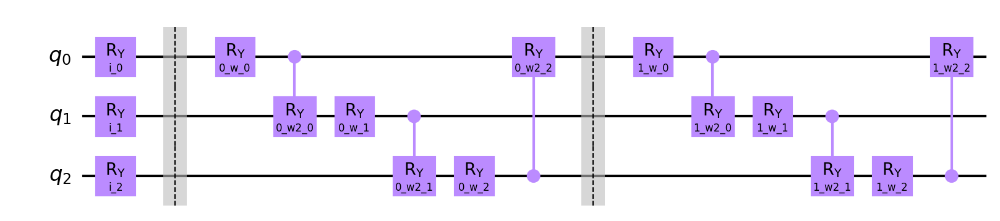 |
| adhoc | qml_circuit_qiskit_02 | 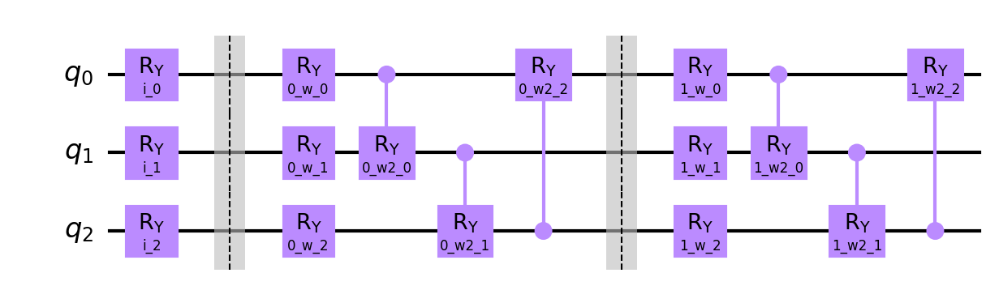 |
| adhoc | qml_circuit_qiskit_03 |  |
| adhoc | qml_circuit_qiskit_04 |  |
| adhoc | qml_circuit_qiskit_05 | 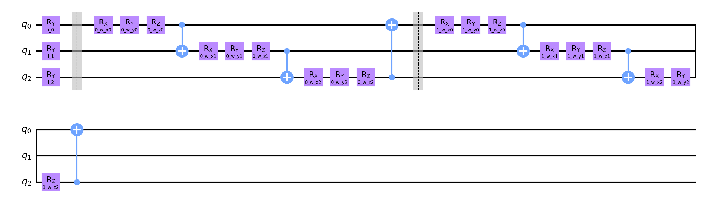 |
| custom | qml_circuit_qiskit_01 | 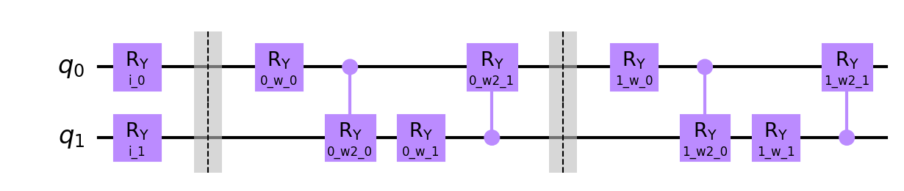 |
| custom | qml_circuit_qiskit_02 |  |
| custom | qml_circuit_qiskit_03 | 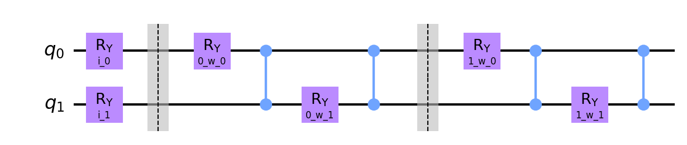 |
| custom | qml_circuit_qiskit_04 | 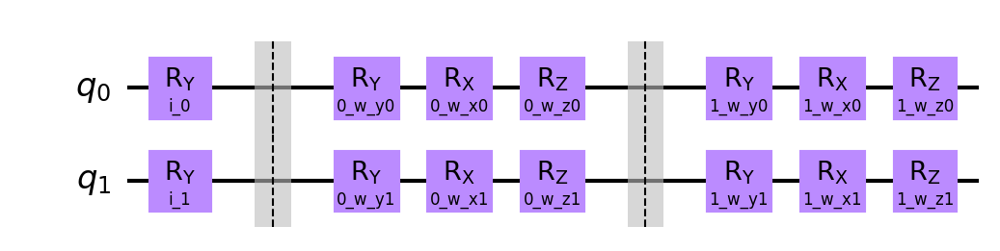 |
| custom | qml_circuit_qiskit_05 |  |
| iris | qml_circuit_qiskit_01 | 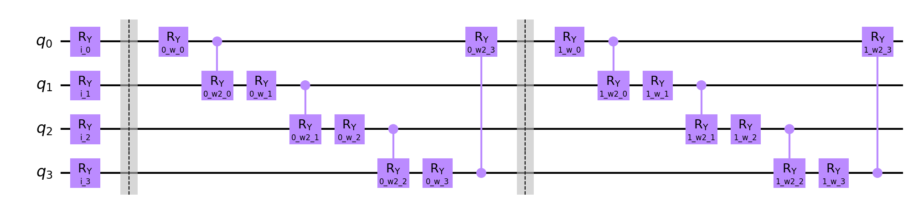 |
| iris | qml_circuit_qiskit_02 | 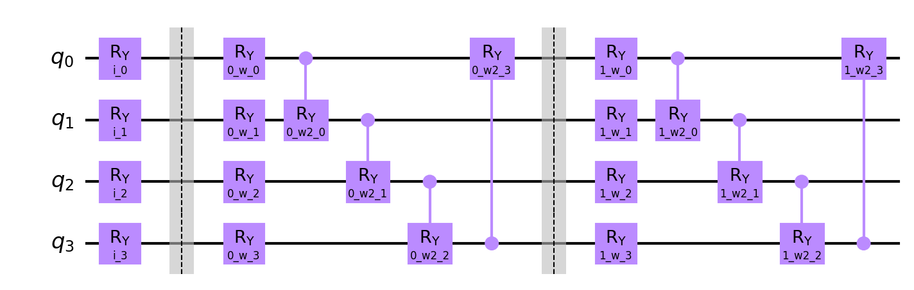 |
| iris | qml_circuit_qiskit_03 | 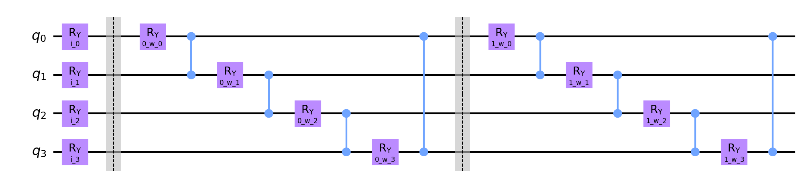 |
| iris | qml_circuit_qiskit_04 | 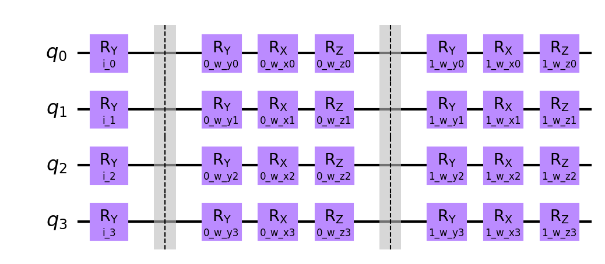 |
| iris | qml_circuit_qiskit_05 |  |
| rain | qml_circuit_qiskit_01 |  |
| rain | qml_circuit_qiskit_02 |  |
| rain | qml_circuit_qiskit_03 |  |
| rain | qml_circuit_qiskit_04 | 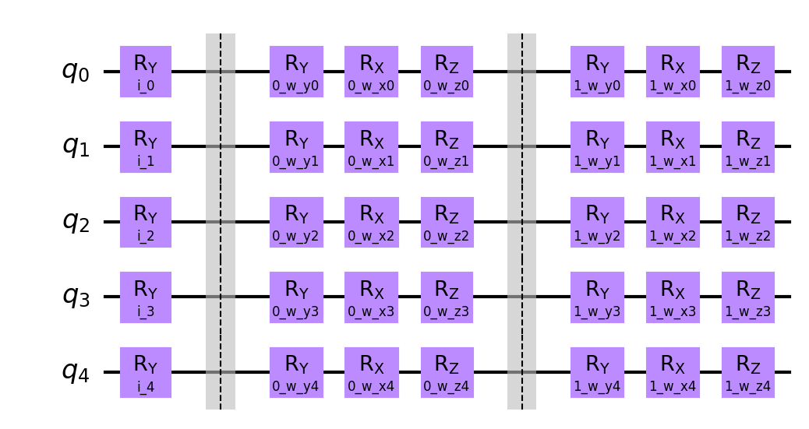 |
| rain | qml_circuit_qiskit_05 |  |
| vlds | qml_circuit_qiskit_01 |  |
| vlds | qml_circuit_qiskit_02 | 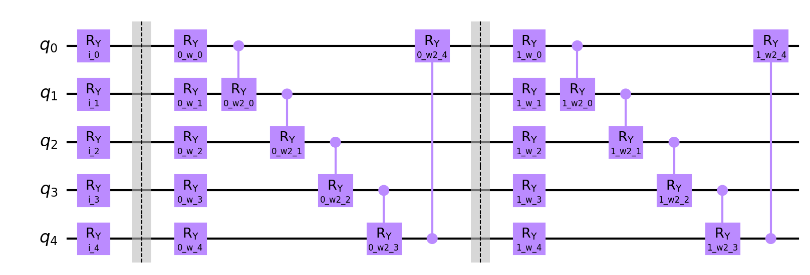 |
| vlds | qml_circuit_qiskit_03 | 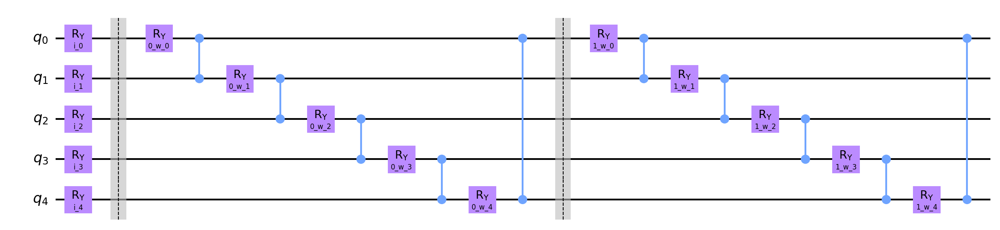 |
| vlds | qml_circuit_qiskit_04 |  |
| vlds | qml_circuit_qiskit_05 | 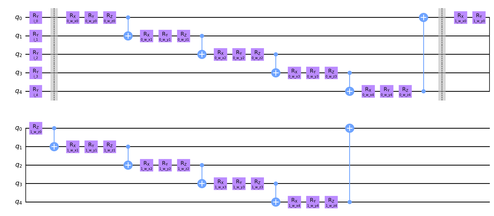 |

## adhoc
#### Average
| circuit | ø score train | ø score test | ø weights |
| ------: | :-----------: | :----------: | :-------: |
| circuit-00 | `0.6012500000000001` | `0.5000000000000001` | `[0.50393692,0.65726173,0.24314287,0.26785905,1.5185855,0.26075806,0.05343028,1.09876647,1.25336616,0.2235164,0.93395752,0.28981458]` |
| circuit-01 | `0.615` | `0.51` | `[0.13005711,0.66803722,0.56032703,0.40891544,0.54199905,0.2892494,-0.48971675,1.60017135,0.75696841,0.65364499,0.39170356,0.40327335]` |
| circuit-02 | `0.5974999999999999` | `0.505` | `[0.24884159,0.15665165,-0.09831509,1.67217318,0.59936549,0.11138272]` |
| circuit-03 | `0.56` | `0.44000000000000006` | `[0.41361875,-0.02722533,0.36573098,0.39099451,0.59930522,0.58748571,0.21654347,0.45286307,0.88828349,-0.2390826,-0.072835,0.63473086,0.57458419,0.29537553,0.47373312,0.38310887,0.29090552,0.40535248]` |
| circuit-04 | `0.5925` | `0.515` | `[0.71802141,-0.00899122,0.33437263,1.71885502,0.28490029,0.58708891,0.21101333,0.71365601,0.34179182,0.12533947,0.14438306,0.4628679,0.93373082,0.02531441,0.6768039,0.52817753,0.33647253,0.61213357]` |

#### Per run data
| dataset name and run | circuit-00: score (train, test) and weights  | circuit-01: score (train, test) and weights  | circuit-02: score (train, test) and weights  | circuit-03: score (train, test) and weights  | circuit-04: score (train, test) and weights  |
| :----------: | :--------: | :--------: | :--------: | :--------: | :--------: |
| `adhoc_20` | `[0.6375,0.35]`, `[]` | `[0.6375,0.3]`, `[0.38869226,0.90566772,3.17300464,0.46776592,1.2430029,-0.34683583,-1.4811027,2.74753758,0.62753932,0.78462813,0.601089,0.49029755]` | `[0.6625,0.3]`, `[-0.24205545,-0.14656939,0.53145044,2.10522435,0.24844958,0.25858286]` | `[0.575,0.3]`, `[1.06239813,0.12394239,-0.44316989,0.69807279,-0.39589705,0.55711942,-0.87166712,0.22191158,0.87881435,0.30787066,-0.2930985,0.71126743,1.23504591,0.57282248,-0.04582769,-0.00243966,-0.08085032,0.3690124]` | `[0.6875,0.35]`, `[0.80666348,-0.11254512,0.85587515,1.57990595,0.24540095,0.65775018,0.38443392,0.31301287,0.27226861,-0.76799635,-0.06596547,1.07073623,1.37520448,0.42095863,0.67730828,0.49464049,0.13812405,0.43713056]` |
| `adhoc_21` | `[0.6625,0.65]`, `[1.19050574,0.70669325,0.2168878,0.36221615,1.60406242,-0.31785532,0.38252197,1.22628496,1.82461101,-0.41073868,0.10169706,0.546434]` | `[0.65,0.65]`, `[0.95067169,0.49153412,0.48227274,-0.2525936,1.53401613,0.43563629,0.12160163,1.18970162,1.45127365,0.17546487,0.32248141,-0.02451413]` | `[0.5875,0.7]`, `[0.22609495,0.21849893,-0.4216921,1.0569698,0.38857023,-0.0858635]` | `[0.525,0.5]`, `[0.18824326,0.03015881,-0.43937932,0.69446897,0.67753566,-0.04404273,0.67559364,0.01372503,0.48778902,0.02199269,0.00152083,0.05355192,-0.17774178,0.32737532,0.55127934,0.71208573,0.08241979,0.47254722]` | `[0.55,0.7]`, `[0.40030284,-0.12749587,0.34151681,1.80697096,0.66479033,0.16421807,0.70639442,0.73424583,0.71927028,0.55584536,0.04527596,0.45996632,0.36727761,0.02977272,0.74420263,0.94909407,0.45651113,0.52157826]` |
| `adhoc_22` | `[0.6,0.5]`, `[1.0496916,0.47738235,-0.34762496,-0.49436384,2.06925443,0.0021647,-0.68592732,1.96686969,1.59528124,0.23101076,0.41785062,0.00627275]` | `[0.6375,0.5]`, `[-0.04789417,0.91251804,2.34115382,0.17703515,-0.13561988,0.5362977,-0.54573187,2.93647464,0.46856131,1.60195599,0.95421829,0.64739102]` | `[0.575,0.4]`, `[-0.03786503,-0.10777717,-0.56152836,1.30048155,0.23971042,0.04774167]` | `[0.6125,0.4]`, `[1.00868727,-3.70598471,-0.25650114,-1.39971433,0.33831473,-0.39302459,-0.48323466,2.1111081,0.08213246,-2.06104504,-2.49963362,0.09362486,2.76691672,-2.74885531,0.24903328,0.63326513,-0.12438814,1.49620025]` | `[0.625,0.5]`, `[0.70730508,0.01481331,0.571725,1.49315951,0.18061738,-0.09358378,0.28295741,0.38803538,0.82219914,0.10672839,0.085819,0.84739409,1.58290231,0.42396624,0.95478724,0.53500524,0.84211981,1.14886773]` |
| `adhoc_23` | `[0.6,0.45]`, `[1.17023282,0.49292193,0.47898528,-0.08302009,0.73631978,0.6007084,0.89263183,0.79340642,1.15178366,-0.04552415,0.79761032,0.04187691]` | `[0.6125,0.5]`, `[1.03490213,0.43283661,0.12320222,0.10029903,1.12470064,0.60345281,1.32181921,0.63528353,1.29781775,-0.1152227,0.46416282,0.38350697]` | `[0.575,0.6]`, `[0.01216532,-0.04492467,-0.12536212,1.15919266,0.38831462,-0.07927543]` | `[0.55,0.25]`, `[0.17004251,0.35586831,0.7608921,0.45006016,0.6197199,1.10462016,-0.07656324,0.14621228,1.79427269,-0.10188015,-0.5022155,0.47063708,-0.33807177,0.51400257,-0.63184471,0.47777142,0.51273001,0.25408562]` | `[0.6,0.55]`, `[0.57455057,0.11432085,0.59742383,1.12352407,0.43230755,1.05545725,1.24513275,1.55823273,0.28406383,0.05219195,0.56707418,0.78712371,0.48091738,0.15292797,0.26626699,0.4353607,0.58684928,0.98076019]` |
| `adhoc_24` | `[0.5875,0.5]`, `[-0.10368643,0.60379773,0.7348363,0.63242353,1.32547853,0.4998261,-0.63093729,1.4391731,1.24640346,0.50820388,0.99830561,0.67278961]` | `[0.5875,0.55]`, `[0.69655805,0.74623353,1.15261781,0.21094004,1.46182948,0.7293985,-0.50809031,0.97370639,1.14581045,0.84526313,1.17675457,1.03762581]` | `[0.5875,0.45]`, `[0.53201648,0.52018903,0.32730311,1.65680023,0.76359818,0.07057655]` | `[0.5125,0.4]`, `[-0.68114858,1.80579811,-0.20911334,0.2458038,1.43231431,0.31237236,-0.65504073,-0.90468501,0.04036419,-0.08954998,0.39121597,0.05114734,-0.95996402,1.66265904,0.18995676,0.33830903,0.71685738,-1.21719296]` | `[0.5625,0.6]`, `[0.10006536,-0.09098678,0.55478253,2.09281389,0.49944702,0.48326138,0.52201107,0.45865121,0.21606897,-0.10095709,0.14907019,0.22170868,0.5642505,0.12955872,0.14821092,0.24893977,0.12611295,0.26840361]` |
| `adhoc_25` | `[0.55,0.5]`, `[1.34852476,-0.15912404,0.99681556,0.30077062,1.58911656,0.80590843,0.24570538,0.75743574,1.39852847,-0.94243541,1.13895145,-0.14951296]` | `[0.6125,0.5]`, `[-0.21297308,0.3220185,-0.93243033,0.58729829,1.12276168,-0.11308622,-1.34357019,1.35115961,-0.2934112,1.16545456,0.67983422,0.17371232]` | `[0.6125,0.5]`, `[0.94517079,0.29126075,-0.70836367,3.91050541,2.76393858,0.33324349]` | `[0.5125,0.6]`, `[0.29886879,0.27582069,0.37198569,0.73288155,0.65138986,0.26065779,0.89830538,-0.78214285,0.49263188,-0.66603955,-0.43889775,0.03113374,0.55699193,-0.0342487,-0.69742243,0.2164987,0.17359944,0.47811891]` | `[0.575,0.45]`, `[3.22557153,0.04201313,-0.16128396,1.12145719,0.2120544,1.33456386,-0.04039769,0.09491998,0.47799222,0.14040381,0.03199264,-0.24921941,1.17558204,-0.70936386,1.35478241,0.1121675,-0.3866542,0.6358038]` |
| `adhoc_26` | `[0.55,0.45]`, `[-0.48393913,0.61556021,0.02761142,0.18315239,2.17549242,1.06197477,0.64846732,1.29645892,2.15983662,0.17268078,0.06678581,0.31062023]` | `[0.575,0.4]`, `[-1.15531677,1.34420612,0.99524606,-1.31723627,-1.02176394,1.46670422,-2.27452017,1.23204838,-0.56811628,-1.1702391,-0.80645343,1.59588128]` | `[0.5625,0.5]`, `[0.43330978,0.86308688,0.23228825,0.86122936,1.0613639,0.42472725]` | `[0.525,0.45]`, `[0.3084144,1.2894772,1.7221159,-0.26528904,0.50166514,0.28117752,0.62863652,1.77580471,-0.00759639,-0.06399179,1.82972393,1.30452355,-0.40805703,1.08397935,1.30818347,-0.12367059,0.62229358,0.82617756]` | `[0.55,0.45]`, `[0.05811185,0.05010121,-0.3087122,2.48329302,0.47644764,0.72365388,0.22449223,1.55373634,0.36511985,0.41224748,0.36442823,0.02570402,0.46611745,0.01878616,0.80416606,0.79949157,0.23011027,1.06296298]` |
| `adhoc_27` | `[0.65,0.4]`, `[0.96291711,1.40532723,-1.0250429,0.37686604,2.61537235,-1.33173944,0.94328739,-1.34133413,-0.79486291,0.84553407,2.87148942,-0.71195171]` | `[0.625,0.5]`, `[-0.4123767,0.52054144,-0.71163094,0.45067412,-2.2095259,-0.18550263,0.77722561,2.51901611,1.43444484,-0.34519571,-1.2405989,-0.07688522]` | `[0.5875,0.4]`, `[0.24535189,-0.05973819,-0.67546243,1.08127798,0.11321305,-0.07954275]` | `[0.5875,0.35]`, `[-0.27960428,-0.41820852,-0.39977932,0.51050707,0.59159181,0.67845272,0.36397207,1.06293256,1.51365801,-0.36528234,0.62810014,0.67238231,0.70798187,-0.11988362,0.08061706,0.96773036,0.48663218,0.79057311]` | `[0.575,0.4]`, `[1.20336521,-0.01933106,0.42730431,1.58545491,0.11998181,0.46411701,0.52004942,1.99398162,0.35148292,-0.29589603,0.17372418,0.89673649,0.4461806,0.05922538,0.89754759,0.43228565,0.67837427,0.30089921]` |
| `adhoc_28` | `[0.625,0.5]`, `[-0.22461665,1.31655551,0.27869732,0.46972894,1.1167546,0.21305137,-0.86879908,1.7847776,0.36120372,1.38876131,1.35155261,0.4949534]` | `[0.6375,0.55]`, `[0.32234844,-0.10601285,0.30019359,2.58534913,1.58403334,-0.17947656,0.38122921,1.31373604,2.27723647,2.95725378,0.9749945,-0.46665431]` | `[0.625,0.5]`, `[-0.03609987,0.01002061,0.22188384,2.13372338,0.11198318,0.15086287]` | `[0.5875,0.45]`, `[1.1870959,-0.07168364,2.67342048,0.5674104,-0.20763641,1.16850393,1.80367005,0.95714546,3.1954841,1.36237144,-0.0151556,3.38922448,1.93705462,0.13596328,2.45287597,0.25020554,-0.72634832,-0.18051006]` | `[0.6125,0.5]`, `[0.1329954,-0.05090498,0.06833023,2.08413361,0.12985351,1.49140334,-1.90684381,-0.94142242,0.02354977,1.31007406,-0.13514012,0.07865388,1.40472264,-0.32827946,0.35324124,0.78402228,0.11093109,0.99029441]` |
| `adhoc_29` | `[0.55,0.7]`, `[0.32957837,-0.54552727,-0.61073413,0.20838853,1.70539149,1.07270219,-0.40917358,1.24431194,2.06390489,-0.47018602,1.5114598,0.91327379]` | `[0.575,0.65]`, `[-0.26404079,1.110829,-1.32035935,1.07962261,0.71655606,-0.05409426,-1.34602787,1.10304961,-0.27147224,0.63708696,0.79055315,0.27237223]` | `[0.6,0.7]`, `[0.41032699,0.02246972,0.1963322,1.45632712,-0.08548682,0.07277416]` | `[0.6125,0.7]`, `[0.87319014,0.0425581,-0.12316133,1.67574376,1.7840543,1.94902049,-0.11823724,-0.07338118,0.40528462,-0.73527194,0.17009007,-0.43018414,0.42568542,1.55994094,1.28048011,0.36133309,1.24610958,0.76451275]` | `[0.5875,0.65]`, `[-0.02871719,0.09010312,0.3967646,1.81783711,-0.11189767,-0.4099521,0.17190354,0.98316652,-0.11409738,-0.15924685,0.22755184,0.48987501,1.47415321,0.05559159,0.5675256,0.49076806,0.58224667,-0.22536503]` |

## custom
#### Average
| circuit | ø score train | ø score test | ø weights |
| ------: | :-----------: | :----------: | :-------: |
| circuit-00 | `0.5525` | `0.42000000000000004` | `[0.93319798,0.86013916,0.61009966,0.70174448,0.79313144,1.83524762,0.45290857,1.28217114]` |
| circuit-01 | `0.545` | `0.4149999999999999` | `[0.44613566,1.00910071,1.3737652,0.38574068,0.14496025,0.39406726,2.04318433,0.75417262]` |
| circuit-02 | `0.5537500000000001` | `0.485` | `[-0.12135304,0.05863109,-0.03483235,-0.8785193]` |
| circuit-03 | `0.5449999999999999` | `0.43999999999999995` | `[-1.74833933,5.39541002,0.28454108,1.1688735,0.27798032,3.21365667,-2.78109776,4.82597559,0.42432491,3.48308464,1.46841883,0.40882918]` |
| circuit-04 | `0.5549999999999999` | `0.445` | `[0.19596486,0.55739421,-0.32680943,-1.02570219,-0.10893407,0.63803442,0.75299294,0.463429,1.08758219,0.4115695,0.26738786,0.56279602]` |

#### Per run data
| dataset name and run | circuit-00: score (train, test) and weights  | circuit-01: score (train, test) and weights  | circuit-02: score (train, test) and weights  | circuit-03: score (train, test) and weights  | circuit-04: score (train, test) and weights  |
| :----------: | :--------: | :--------: | :--------: | :--------: | :--------: |
| `custom_0` | `[0.575,0.55]`, `[5.56463851,3.48521735,-0.17089359,2.23999231,6.25949334,10.49221173,-3.6690396,2.47877977]` | `[0.5875,0.65]`, `[1.29112718,1.90594985,0.1351,1.02709437,-0.67013673,0.00274689,1.4329454,2.36819526]` | `[0.5875,0.65]`, `[-1.0062184,-2.51051956,0.64639605,-4.76485498]` | `[0.4625,0.5]`, `[0.23351041,1.72334021,0.44709551,0.97566677,-0.01629712,0.57293386,-0.20598515,1.32668708,0.7139729,1.40086215,0.3373741,0.8496322]` | `[0.575,0.55]`, `[0.19911369,0.61894307,0.49820476,-1.15818722,-1.00615484,-0.0237204,-0.70193159,0.06212415,0.38873366,0.48484765,-0.19681923,0.64318051]` |
| `custom_1` | `[0.5375,0.55]`, `[0.6000439,0.92221258,-1.34375956,2.49661726,-0.05108197,2.27575414,0.18167121,1.99652337]` | `[0.475,0.4]`, `[0.79602422,0.79325078,0.70207941,0.93811049,0.91201176,0.53934483,0.56084793,0.60726747]` | `[0.5375,0.5]`, `[-0.48368659,-0.2710791,-0.03651518,-0.15354649]` | `[0.5,0.45]`, `[1.3905643,1.52196582,0.82289052,0.79691138,0.0139728,-0.93062634,0.64277446,1.23937165,1.78939099,1.84332953,0.7269575,0.90905846]` | `[0.525,0.5]`, `[0.54058903,-0.01719535,-0.21197593,-0.21982834,-0.26579286,0.93741956,-0.14439041,0.13564405,0.80649466,0.73975564,0.54250952,0.59684546]` |
| `custom_2` | `[0.5875,0.5]`, `[0.17530549,-0.02539217,1.77973664,0.07302854,1.09368731,0.23444749,0.91225491,0.55895042]` | `[0.625,0.45]`, `[0.15139919,0.99830619,0.92765662,0.29854407,0.64381496,0.64414692,1.20477778,0.66780359]` | `[0.6,0.5]`, `[0.5225478,-3.76543669,-0.00732087,-3.5528636]` | `[0.5875,0.55]`, `[0.01884919,1.01009726,0.65901167,0.5834267,1.37719497,1.62797029,0.56039219,1.55081941,-0.17138686,-0.49215771,0.42936556,0.06390693]` | `[0.5875,0.55]`, `[0.64347562,0.42165282,-1.20784175,-0.47961168,-0.76285398,0.13346464,0.42819551,0.67065151,0.97649765,0.99649005,0.86404631,0.53595855]` |
| `custom_3` | `[0.525,0.4]`, `[1.25873957,1.3801293,2.19753163,0.36165121,-0.13394558,1.23541593,1.8119983,0.97554853]` | `[0.5125,0.4]`, `[0.23435414,0.72654014,2.36606761,0.40618151,0.52389609,0.8236219,1.95263139,-0.2072202]` | `[0.5,0.6]`, `[-0.3445922,3.07801097,-3.98117388,1.70732694]` | `[0.5625,0.55]`, `[0.16612181,-0.69118946,-0.81487489,1.06558275,1.46024472,1.36335706,1.75324237,-0.0752951,0.51088602,0.71232832,0.13835445,0.84665197]` | `[0.5,0.5]`, `[1.60027465,0.89934767,-0.57370967,-0.91220707,-1.26579486,0.42790229,1.07529271,0.82623684,2.19977804,0.47611758,-0.02719825,0.11165847]` |
| `custom_4` | `[0.5625,0.2]`, `[0.34113074,-1.66210445,-0.377016,0.97213709,-0.01072435,0.95786526,-0.00912212,3.28153616]` | `[0.5,0.4]`, `[0.02698887,0.57965197,-0.1243397,1.45276847,-1.52069213,-0.61967254,1.75234548,2.24231588]` | `[0.5375,0.35]`, `[0.60903954,1.90405289,0.27474126,1.99778617]` | `[0.575,0.4]`, `[0.0083292,1.57016097,-0.07158832,0.39896065,0.12968143,0.56400294,-0.12866193,1.30003301,0.62071786,1.58433621,-0.01747674,0.82567175]` | `[0.6,0.2]`, `[1.4687705,1.36861049,-0.10809356,-1.50755054,-2.27600297,1.38300802,1.6208519,0.72585924,2.89822924,0.32316056,-0.13387191,0.59946454]` |
| `custom_5` | `[0.5375,0.55]`, `[-1.01834177,0.2426804,2.7422694,-0.08042462,0.73162061,0.24808573,2.79821827,-0.29873353]` | `[0.525,0.45]`, `[1.46974947,3.12555709,3.82244709,-0.14012959,-1.76359385,1.2618752,7.02480107,2.45030129]` | `[0.525,0.55]`, `[0.51439184,-0.33148698,0.33281723,-1.53656723]` | `[0.5375,0.5]`, `[1.55120287,0.47814289,0.70123034,-0.09002369,0.56178956,-0.17642691,0.54075791,-0.14295206,1.45577028,1.42581601,0.781566,0.78257998]` | `[0.525,0.4]`, `[0.84213275,-0.23202869,-0.01652983,-2.2116812,1.4048077,1.12969287,0.60416987,0.2975325,-0.82746657,0.03027087,0.62795472,1.11155619]` |
| `custom_6` | `[0.575,0.4]`, `[0.30891873,0.1958443,-0.92714137,0.63183823,-0.32270126,0.28042274,-1.41789211,0.87931563]` | `[0.5625,0.3]`, `[1.29292222,1.10377465,1.54959236,-0.27887127,-0.53062207,0.47302039,1.98799445,1.74274591]` | `[0.5375,0.55]`, `[1.55750594,0.03147804,1.18388571,-1.46391358]` | `[0.5625,0.35]`, `[-0.62436807,1.4736751,0.61700477,-0.07998399,0.9974246,1.28630083,0.285316,1.36356648,0.49281151,0.22541557,0.95658983,0.73163141]` | `[0.5375,0.5]`, `[-0.83116626,0.53835297,-0.85250164,0.31172114,0.52770311,0.83596248,2.03573507,0.42800556,1.51209283,0.44350545,0.16159239,0.44793272]` |
| `custom_7` | `[0.525,0.35]`, `[0.43801456,0.08069023,1.80805705,-0.33533937,0.81048147,-0.33207868,1.57592567,0.74875689]` | `[0.5875,0.35]`, `[-1.31431993,0.09087334,2.74518216,0.79502564,1.51797181,0.11540087,3.33198518,-1.26008634]` | `[0.575,0.35]`, `[0.61885397,0.71587295,3.07868075,-0.79837439]` | `[0.5625,0.35]`, `[-20.26829133,45.32860728,-0.90089459,7.95359312,-4.14301409,24.95217765,-32.81485732,39.03701651,-1.00629739,27.78055092,10.47803748,-1.69081324]` | `[0.575,0.4]`, `[-1.29265966,0.85244574,-0.6522861,-1.23364318,1.16819693,0.15679295,2.02932548,0.29456121,1.46192852,-0.14013314,0.06769687,0.68086723]` |
| `custom_8` | `[0.55,0.3]`, `[0.81449056,2.67412337,-1.36214338,0.84315966,-1.10152173,2.18089286,0.74746396,1.43090956]` | `[0.55,0.3]`, `[-0.21645749,1.04255211,0.01051041,-0.02582147,0.01775788,1.07596109,-0.57451298,-0.30706337]` | `[0.575,0.3]`, `[-3.73093429,-1.14546267,-3.00265438,-1.73166567]` | `[0.55,0.3]`, `[0.21744815,-0.35249206,0.8976181,0.5345145,1.60041233,1.27667782,1.36753114,0.68010799,-0.12062886,0.17718122,0.84972851,0.73536033]` | `[0.5875,0.3]`, `[-0.71989373,-0.05301749,0.68802656,-1.15145655,0.99172355,1.01557107,0.95079795,0.48864151,0.17417112,-0.15032983,0.48919488,0.66366408]` |
| `custom_9` | `[0.55,0.4]`, `[0.84903952,1.30799066,1.75435577,-0.18521555,0.65600652,0.77945901,1.59760721,0.77012459]` | `[0.525,0.45]`, `[0.72956876,-0.27544901,1.60335602,-0.61549544,2.31919478,-0.37577293,1.75802762,-0.76253331]` | `[0.5625,0.5]`, `[0.52956197,2.88088105,1.16281984,1.51147981]` | `[0.55,0.45]`, `[-0.17675983,1.89179219,0.4879177,-0.44991316,0.79839398,1.60019948,0.18851276,1.9804009,-0.04198734,0.17318416,0.00369159,0.03461204]` | `[0.5375,0.55]`, `[-0.49098793,1.17683089,-0.83138715,-1.69457727,0.39482754,0.38425068,-0.36811707,0.70503344,1.28536273,0.91201013,0.27877325,0.23683246]` |

## iris
#### Average
| circuit | ø score train | ø score test | ø weights |
| ------: | :-----------: | :----------: | :-------: |
| circuit-00 | `1.0` | `1.0` | `[-0.28807282,1.48185546,-0.20679242,0.58682436,-0.11328562,-0.55814931,0.18524728,0.58918575,2.13657287,1.52098093,0.94750978,0.34273158,0.72509625,-0.48680831,0.63436888,0.85632501]` |
| circuit-01 | `1.0` | `1.0` | `[0.26719665,1.97724923,-0.22832879,1.40182148,1.06497958,-1.43603963,1.29147592,0.74633338,2.38995473,1.282667,0.6874367,1.59835398,-0.44210096,-0.28557816,-0.02543041,0.18140668]` |
| circuit-02 | `1.0` | `1.0` | `[0.08400086,0.08452273,0.47539899,0.42659361,0.11940924,-0.08929175,0.98426403,0.70360989]` |
| circuit-03 | `0.73125` | `0.7849999999999999` | `[-0.5119825,-0.37641275,0.21329459,0.50204511,0.48167327,0.20069645,0.34789483,1.10123223,0.86389571,0.61457966,0.5287255,-0.0746794,0.51348243,0.40981713,0.17502996,0.08564168,-0.14931369,-0.41770408,-0.28148372,0.41997388,0.68900132,0.55458435,0.3171272,0.14366096]` |
| circuit-04 | `1.0` | `1.0` | `[0.95316372,0.03545038,0.64282901,1.12141356,0.89652767,0.01497577,0.88131767,1.6234867,0.97552688,1.01810165,1.15283428,0.57879236,-0.257169,-0.1685267,0.8266511,0.40808265,0.18444808,-0.02869986,0.78970095,0.77594267,0.64743181,0.51044877,0.3940414,0.68734661]` |

#### Per run data
| dataset name and run | circuit-00: score (train, test) and weights  | circuit-01: score (train, test) and weights  | circuit-02: score (train, test) and weights  | circuit-03: score (train, test) and weights  | circuit-04: score (train, test) and weights  |
| :----------: | :--------: | :--------: | :--------: | :--------: | :--------: |
| `iris_10` | `[1.0,1.0]`, `[-0.75721134,0.59865308,-0.95870215,1.34549794,-0.95165557,0.53939241,-1.19555776,-1.02762557,1.09541941,1.97435057,-2.80798934,0.1773292,0.65072212,-0.09682475,2.35494588,3.01447116]` | `[1.0,1.0]`, `[-0.25551204,3.56843695,0.20684582,1.47896358,2.54628451,-1.01578607,3.22123849,1.21259556,4.22197838,0.30475422,0.83826669,2.61627029,-1.87898009,-0.52864146,-1.87722302,0.52774684]` | `[1.0,1.0]`, `[0.11265144,0.0662991,0.58323517,0.55195827,0.16440271,-0.05300981,0.7659521,0.64310464]` | `[0.775,0.8]`, `[-4.5035854,1.49754219,-0.60100676,2.29300489,0.28677377,0.26629499,1.12085602,2.48835181,3.48316528,2.80293266,-0.07913086,0.06916146,4.58046912,1.57584843,-0.52747196,3.21959536,-3.54439583,-2.35794945,-3.62820767,1.45131533,2.44773355,0.66038213,-1.07138377,-1.9044655]` | `[1.0,1.0]`, `[0.03402359,0.07220836,1.49677242,1.43871478,0.28416788,0.62068338,0.07370151,1.3226726,1.26124821,0.8836946,1.79011981,0.88893021,-0.10055914,-0.1063394,1.52868422,0.20931678,-0.03486096,0.09145237,0.71619273,0.97730633,0.82802385,0.00686753,0.42553977,0.6620215]` |
| `iris_11` | `[1.0,1.0]`, `[-0.18436817,-0.23771713,2.12741576,-2.15561978,-1.16594074,-0.02513331,-0.09580317,0.56653739,0.19602493,3.3578633,1.15005815,-0.17885539,2.43820812,0.06250937,-0.60354829,1.05347754]` | `[1.0,1.0]`, `[0.43738193,1.10327891,-0.38666124,-1.8737047,0.96109587,-0.21717009,0.76441836,0.86083245,0.03467817,2.20625205,-2.20023877,0.77429703,-0.20539092,0.14464501,0.85981669,0.22040055]` | `[1.0,1.0]`, `[0.05834936,0.07893883,0.39606452,0.32198242,0.08740696,-0.07162864,1.14656791,0.70929685]` | `[0.7375,0.9]`, `[-0.31174697,-0.00798188,0.36138351,0.02599785,0.28907055,-0.07193293,0.9405255,0.75945128,0.71043618,0.28888379,0.66105707,-0.01806276,-0.01513529,-0.00364405,-0.12692189,-0.10026441,0.46767958,-0.0595493,-0.32059076,0.25488839,0.79924472,0.71972288,0.08317225,0.0397217]` | `[1.0,1.0]`, `[0.01269456,-0.25686228,0.08456916,1.15055726,0.25238319,0.1483924,0.2439651,1.58525108,1.11572956,1.7199711,1.62897992,0.76914423,-0.11077287,-1.18954833,0.89953839,0.68647541,-0.08246262,0.95057231,0.25088388,0.48571164,0.66804909,0.83422021,0.14627361,0.5606489]` |
| `iris_12` | `[1.0,1.0]`, `[-0.47311883,0.66154512,1.71891352,-1.04035694,1.02372528,-1.58718741,1.42414613,0.85749032,2.63597118,3.06524023,2.23264243,-3.34404919,-0.33454006,-2.04788677,0.06079213,2.1141827]` | `[1.0,1.0]`, `[-2.91449966,3.37018088,-0.04926609,1.95338427,0.48216563,-1.21345151,0.86225759,1.68865,2.99559677,0.47204271,0.03084107,1.86663575,-0.7680227,-0.28295833,0.34631765,-0.20488757]` | `[1.0,1.0]`, `[0.10419914,0.09507273,0.54201056,0.47595168,0.12723519,-0.06339249,0.89748191,0.69306901]` | `[0.7875,0.9]`, `[-0.09822209,-0.23785752,-0.09878361,0.56847887,0.328311,0.13721501,0.20432557,0.98993865,1.36822924,0.83340394,0.20563571,0.07850041,-0.22347253,0.33870555,0.03245049,-0.51047096,0.12821612,0.02124517,0.57156569,0.05410268,0.57196737,1.10843396,0.2530033,0.23166381]` | `[1.0,1.0]`, `[0.00613567,-0.20096805,-0.66458684,1.3508319,0.26594529,0.39800301,0.3113843,1.69523253,0.88843407,2.35403829,1.47242828,0.37627743,-0.0997333,0.34666386,1.00037171,0.32505572,-0.06928929,-0.3772775,-0.47382268,0.40013984,-0.00907062,0.53938577,0.79324073,0.31810922]` |
| `iris_13` | `[1.0,1.0]`, `[-0.50505125,0.37711465,-1.75684261,2.47502669,-0.77952646,-0.17858518,0.68994576,-0.01111626,-0.05480614,2.87629108,1.448453,-0.70598659,0.07356776,-2.69251376,0.84500107,0.55371875]` | `[1.0,1.0]`, `[]` | `[1.0,1.0]`, `[0.08334956,0.10349159,0.42092939,0.40408632,0.06984814,-0.11145409,1.049816,0.71875074]` | `[0.7,0.75]`, `[0.04074291,0.01197461,0.87406376,0.48559207,-0.3644896,0.88243097,-0.99734444,1.11896092,-0.03374532,-1.25499259,2.96425122,-0.49048181,0.02268289,0.97767264,2.83589189,-0.37861099,0.96627387,2.70717812,-1.71205082,0.1038929,0.5720097,0.97979324,0.94571847,0.54599355]` | `[1.0,1.0]`, `[1.51562692,-0.61033054,0.83380855,1.81559451,0.14439011,-0.00455707,3.01610556,1.79774792,-1.30719092,3.06596806,0.12897253,0.61662214,-1.6379529,0.01237571,0.6858078,0.33590966,2.19659994,-1.43095181,1.64185941,1.91737643,0.63301938,-0.14169748,0.22243206,1.95587136]` |
| `iris_14` | `[1.0,1.0]`, `[-2.2820563,3.02251846,-0.12943179,1.40960461,-0.55618253,-1.05854649,-0.62761214,1.38334308,4.00056413,0.16287333,0.67170105,2.47192247,0.79179307,-0.17979835,2.01212756,0.29261058]` | `[1.0,1.0]`, `[1.51531274,-0.18411359,1.22943813,0.75867494,1.88915273,-3.07295971,1.65502012,-1.63800675,1.57234576,3.31093962,2.59946268,-0.06668703,-0.15103368,0.15242461,-0.88847246,-0.09413537]` | `[1.0,1.0]`, `[0.08121299,0.01217728,0.48234851,0.47990979,0.21643104,-0.05234459,0.918879,0.65848344]` | `[0.775,0.75]`, `[0.35784432,-3.96233829,0.71912661,0.72954903,-0.00752142,-0.90990876,0.56405893,0.14118267,0.06759329,1.01680985,1.90322252,-0.76331161,-0.31441546,-1.20833036,-1.93595097,-1.06929211,-0.32104832,-4.11017964,-0.07954401,-0.51552586,0.99537935,0.51926913,-0.16153979,0.07838417]` | `[1.0,1.0]`, `[1.92814583,-0.1405731,1.84447398,-0.01162655,1.49525351,-0.09873927,1.31790094,0.4840073,0.26232991,0.31861801,1.94341492,0.23199585,-0.48445389,0.01303164,0.05531602,0.49661788,-0.01018188,-0.01473249,0.99056169,0.49284081,0.70079982,0.77225031,0.29150495,0.94985145]` |
| `iris_15` | `[1.0,1.0]`, `[0.50404989,0.55724269,0.27955555,-0.06735358,0.02863677,-0.05781352,-1.38119701,0.5841379,3.06834588,0.72350593,1.60630468,-0.28701941,1.40933397,-0.03131745,-0.24268555,1.74862761]` | `[1.0,1.0]`, `[-1.03935574,3.70913884,-0.29742474,1.45239727,2.01571591,-0.48018213,0.67553458,1.61350204,4.0424828,0.36635194,1.0457171,2.55651805,-1.53605495,-0.36506556,0.54235578,0.07769923]` | `[1.0,1.0]`, `[0.0369228,0.10847,0.43724309,0.35800693,0.07885782,-0.04765176,1.12294377,0.78161142]` | `[0.7,0.85]`, `[-0.18872657,-0.86154047,-0.38795867,1.15586922,0.91564468,0.81301684,0.42918345,2.44946598,-0.05967961,0.46178667,0.52937538,-1.5140986,0.10648052,0.81097676,0.05960937,-1.57811394,-0.36378624,-0.91110945,0.53163064,1.10401607,0.5343091,0.80499347,0.20407517,0.93143596]` | `[1.0,1.0]`, `[0.01575562,0.44706805,1.49301315,-0.90278007,3.42754281,-1.02745494,-0.07601128,1.50386066,2.20124573,0.82964441,1.22872499,0.71773211,-0.17512707,0.34559278,1.64302521,0.54646314,0.06499097,0.03943805,2.45169072,0.68822243,0.43470971,0.76197408,0.94266018,0.61327493]` |
| `iris_16` | `[1.0,1.0]`, `[-2.04071243,3.67330811,-0.06584383,1.75282074,0.70455942,-1.06364943,0.54660492,1.3486935,3.65628503,0.43882349,-0.00390817,2.22797125,-0.47281693,-0.43124441,0.70988711,0.52045932]` | `[1.0,1.0]`, `[1.78605452,0.14446831,-0.3688411,0.60461181,1.6361969,-3.24580992,2.30731143,-0.19446852,1.46108748,0.74129191,-1.50833727,-0.05033708,-0.06200913,-2.96647363,-0.82810172,1.24321697]` | `[1.0,1.0]`, `[0.07277863,0.10697201,0.58719569,0.524879,0.11258611,-0.09910868,0.78306573,0.68533186]` | `[0.6,0.6]`, `[0.23526071,0.94767227,0.7867899,0.50067231,0.90169041,0.57591123,0.36533367,0.09150605,0.52372378,0.59250954,0.13018584,0.44073272,0.17213999,0.0551298,0.77396777,0.42888587,0.9875235,0.29949722,0.15975892,0.62490036,0.01387754,0.50722713,0.62771042,0.14734133]` | `[1.0,1.0]`, `[]` |
| `iris_17` | `[1.0,1.0]`, `[0.04730605,2.60198671,-1.90210045,-1.10150176,0.62375277,0.04737533,0.5898432,0.98272634,3.16529281,1.0233914,-0.43863009,0.00531264,0.31813288,0.11234752,0.47814238,0.32694856]` | `[1.0,1.0]`, `[1.65115295,1.72088884,-1.05232831,3.48084273,-0.17976846,-1.99312889,1.1990341,0.38881159,2.50148409,1.7792258,2.02589958,2.04552038,0.36235843,0.27405561,0.40687526,0.35115063]` | `[1.0,1.0]`, `[0.02826756,0.0885078,0.37692766,0.40661346,0.11444137,-0.03700359,1.08713934,0.71115562]` | `[0.825,0.95]`, `[0.09874199,-0.76476838,-0.28814794,-0.09532275,0.67450932,0.46254215,0.28028227,0.47520505,0.67517895,0.71040739,-0.38990821,0.37497711,-0.02942934,0.87754587,0.4495584,-0.10660734,-0.13512912,0.04270905,0.35173191,0.62766178,0.34548154,0.03441186,0.72533509,0.30721321]` | `[1.0,1.0]`, `[0.2313609,-0.26449449,1.39734886,-0.05354922,1.68936609,-0.45924936,1.80157768,0.56213134,1.7864456,0.7453476,1.32860913,0.80168557,0.37118307,0.01624964,-0.11265709,0.66435519,-0.14107941,-0.05699449,1.01833435,0.86295801,0.97171784,0.66237374,-0.32386455,0.40969251]` |
| `iris_18` | `[1.0,1.0]`, `[1.22229338,0.20923907,-0.60102527,2.18136712,1.01257115,-0.71394486,1.1788591,-0.16719423,0.08741964,0.94993785,4.15032545,0.97940418,0.81301819,0.50434976,0.39524464,-1.20619403]` | `[1.0,1.0]`, `[0.09299695,0.72351738,-1.45614384,3.13020343,0.47759031,-0.52273725,1.16164658,0.63773758,0.38675626,2.64802621,3.69308736,1.7997804,0.39507419,0.32338232,0.25730635,-0.71024427]` | `[1.0,1.0]`, `[0.0886102,0.04947775,0.50629152,0.46515881,0.18127516,-0.15863576,0.8462106,0.65576987]` | `[0.7375,0.6]`, `[-0.05596535,-0.2762271,0.06623302,0.10619255,0.94364585,-0.48500548,0.64813009,0.58788931,0.72727896,-0.11866046,0.20767616,-0.02393146,0.29854031,0.29547113,-0.11686681,-0.1174723,-0.23577874,0.31746771,0.22644983,0.38692933,0.19285853,0.22483156,0.5656889,0.53988698]` | `[1.0,1.0]`, `[3.14782124,-0.93493838,0.12135464,1.5723312,-0.26379532,1.25946578,0.4859834,2.98984662,1.42763252,0.70823601,-0.06141229,0.1374288,0.30710416,-0.99325996,1.52202911,0.50038415,0.01352554,0.22973941,0.98918456,0.50584424,0.38347883,0.24886571,0.3646459,0.37598753]` |
| `iris_19` | `[1.0,1.0]`, `[1.58814081,3.35466381,-0.77986291,1.06875857,-1.07279625,-1.48340069,0.72324374,1.37486502,3.51521181,0.63753212,1.46614063,2.08128661,1.56354338,-0.06770429,0.33378185,0.14494792]` | `[1.0,1.0]`, `[1.08278739,2.11429356,-0.20491645,1.00097661,0.82047008,-1.34141459,0.05364504,1.41833699,3.76259941,0.98504724,0.37897728,2.36280046,0.09034189,0.2938899,0.80542989,0.25920922]` | `[1.0,1.0]`, `[0.17366695,0.13582022,0.42174381,0.27738947,0.0416079,-0.19868814,1.22458392,0.7795255]` | `[0.675,0.75]`, `[-0.69416859,-0.11060297,0.70124607,-0.74958294,0.84909816,0.3364005,-0.07640277,1.91037061,1.17677639,0.81271579,-0.8451098,1.09972057,0.53696407,0.37879554,0.30603328,1.0687676,0.55730831,-0.12635029,1.08441903,0.10755786,0.41715185,-0.01322181,0.99949194,0.5194344]` | `[1.0,1.0]`, `[0.0355329,-0.13829494,-0.85080675,1.77032664,0.32381274,0.22188169,0.17569732,1.66351643,1.03514037,-0.87914099,1.38144807,1.07245076,-0.0587546,-0.15008392,1.03700698,0.30375117,-0.06601549,0.28464437,-0.56285742,0.95012011,0.83019672,0.84041968,0.06262082,0.85269895]` |

## rain
#### Average
| circuit | ø score train | ø score test | ø weights |
| ------: | :-----------: | :----------: | :-------: |
| circuit-00 | `0.64625` | `0.675` | `[1.38419999,-0.85051191,0.42285073,0.94026571,1.06330754,-0.35210118,0.86062855,0.73490429,-0.04464241,0.13083675,0.9934079,-0.22976404,1.28712199,1.31065582,1.71206247,-0.05092173,0.63667268,0.53843744,-0.03309405,0.00882976]` |
| circuit-01 | `0.65` | `0.655` | `[0.89162646,-0.24966801,1.17924602,0.5723439,0.94566064,0.01148984,0.23639542,0.73267414,0.12143202,0.5929289,1.35262794,-0.01339236,1.37301318,0.67564452,1.98407001,0.16217884,0.58284722,0.25554737,0.40443151,0.10043186]` |
| circuit-02 | `0.60125` | `0.6150000000000001` | `[-0.1851202,0.87771141,0.50233837,-0.33669848,0.20878713,-0.02479695,0.96115855,0.58047808,0.39438679,0.10194848]` |
| circuit-03 | `0.51375` | `0.55` | `[0.11094418,1.02681306,-1.33502852,0.54332282,1.07432666,0.55833575,0.73590517,0.0569215,1.03307646,0.60261599,0.35509331,0.73121433,-0.16078658,0.62887502,0.55312239,1.07750206,1.33331135,0.94973236,-0.4468084,1.9980713,-0.57929633,0.17187019,-0.48156826,0.13314956,-0.15038177,0.38110072,-0.23627401,0.0838932,0.26793111,0.75519019]` |
| circuit-04 | `0.6337499999999999` | `0.6650000000000001` | `[0.12991199,0.47488975,1.07461784,-0.03545484,0.25295329,0.0229507,0.29834256,1.33521327,0.27072848,0.29361539,0.65435855,1.18108437,0.72933382,0.53994118,0.4310567,0.37574536,1.03529337,0.24952099,0.03807016,0.52017456,0.13148382,0.21656927,0.88951544,0.24811093,0.47147264,0.72263617,0.68579211,0.36709009,0.37436751,0.63396264]` |

#### Per run data
| dataset name and run | circuit-00: score (train, test) and weights  | circuit-01: score (train, test) and weights  | circuit-02: score (train, test) and weights  | circuit-03: score (train, test) and weights  | circuit-04: score (train, test) and weights  |
| :----------: | :--------: | :--------: | :--------: | :--------: | :--------: |
| `rain_30` | `[0.675,0.7]`, `[2.03457447,-1.36309899,-0.20795876,1.23103024,2.0212215,0.9627953,0.34398445,0.24295852,0.09134762,0.71432761,1.67347779,-0.30139153,0.0186873,1.71997009,2.84572528,-0.2063386,0.61875826,0.78799562,0.05170763,0.39831242]` | `[0.6625,0.7]`, `[1.28744155,-0.80412358,0.72745601,0.82536353,0.37363626,-1.1222647,1.01452633,0.58424621,-0.2163715,0.7521587,1.20650901,-0.17999566,0.61960496,1.45516814,1.21602646,-0.43872363,0.79829477,0.27742494,-0.01089051,-0.17575886]` | `[0.6,0.6]`, `[-0.43270302,0.39569389,0.36042028,-0.29738681,-1.07789729,0.03082622,1.12729274,0.59981031,0.94264208,1.31721077]` | `[0.525,0.55]`, `[0.05843926,0.62649641,0.73297271,-0.02912314,0.73742601,0.73894807,0.98134345,0.43363188,0.9469004,0.36337459,0.26070639,0.46439569,0.72343598,0.83979815,0.34334478,0.68342361,0.65598937,0.35572769,0.5850977,0.85654994,0.52252659,0.60880574,0.98633971,0.43213051,0.39194966,0.60692961,0.46150177,0.04645205,0.8943032,0.54388794]` | `[0.675,0.65]`, `[0.10525744,0.0979193,1.13131646,0.02204063,-0.1490127,0.45532959,-0.39670406,1.52112421,-0.12174707,0.86841262,0.3398505,1.49025172,1.10422639,0.5805143,0.7867058,0.52145178,1.11462591,-0.19000363,0.03051857,0.68355849,1.17380444,-0.03516742,1.47104848,0.02404675,0.34990048,0.70889746,0.56324009,0.71111763,-0.0259214,0.34398017]` |
| `rain_31` | `[0.5875,0.45]`, `[1.18068119,-0.09082036,1.06256989,-0.12820437,1.52958415,0.15980926,1.6026977,1.6978911,-0.2224003,0.87896747,0.92367935,-0.17169179,2.63104019,0.26232194,2.46347796,-0.29757514,0.17348862,0.2257358,0.16597177,0.08524827]` | `[0.6625,0.7]`, `[1.33101271,-0.81742383,0.29175599,1.20195036,0.1700539,-1.04273418,0.64175308,0.34280078,0.06233203,0.21476437,1.64234803,-0.65163907,-0.09867521,0.66241635,1.50676208,-0.0024675,1.0474302,0.56846561,0.01946783,0.28766673]` | `[0.5875,0.45]`, `[-0.19970922,0.91780083,0.46370284,-0.45155556,0.29786083,-0.08711946,0.85596606,0.62253035,0.75392956,-0.13364444]` | `[0.425,0.4]`, `[0.15077342,0.86305169,0.47972821,-0.23565004,1.26612226,0.33183973,0.38327776,0.4307721,0.26025194,0.33650292,-0.06807393,0.52722904,0.72040905,0.46142839,0.94773734,0.56674108,0.65976834,0.54608167,0.95613803,0.17196408,0.45547946,1.22314766,0.55509701,0.66517638,-0.13794102,0.37260803,0.41646032,0.33643413,0.34749031,0.87683087]` | `[0.6,0.45]`, `[-0.18725149,-0.7862249,2.2310586,0.03011725,0.12268609,-0.55575013,0.16213082,1.46844138,-0.07300051,0.04594749,0.65767257,1.43559106,0.83062017,0.34635918,0.2980953,0.32626543,1.36401781,0.44051548,-0.02519072,0.5663866,0.5307153,-0.18623988,0.76581404,0.07881807,0.96994004,0.5828992,0.20301856,0.36738014,0.91173742,0.03360217]` |
| `rain_32` | `[0.6625,0.75]`, `[-0.63870058,-1.63537394,-0.08096234,1.66506873,2.25179573,-1.35048546,2.24418508,0.23096517,0.03498869,-2.56071137,-1.08089752,-0.02516347,0.23738201,2.84216296,0.16616096,-1.19938869,2.30276608,0.97666218,-0.55139593,0.19168156]` | `[0.6625,0.55]`, `[-0.83076696,3.13408593,2.35302382,0.02576438,1.15716514,-0.50665151,-0.64057494,-0.12639658,-1.280557,0.18757163,3.04972154,0.4608834,0.86314807,0.83220301,3.33997422,0.65682847,-1.05472851,1.43455607,-0.33223143,-0.74806456]` | `[0.7,0.6]`, `[-0.82870528,1.96665938,0.25011381,-1.91123965,0.11703763,-0.07354392,2.15392884,-0.08989655,-1.34080339,0.07615385]` | `[0.45,0.5]`, `[]` | `[0.6875,0.6]`, `[0.18995112,1.20947442,-0.36939814,0.05089175,0.09808881,0.65919071,0.02056561,1.41199658,-0.0154059,0.18245303,1.33535408,0.8593159,0.71900366,0.21405726,0.16326267,0.1831797,1.37991327,0.06461642,0.14266431,0.53969902,0.07611291,0.42408451,1.09675781,0.4449888,0.5903496,0.51091443,1.08056244,0.64832576,0.65497681,0.91092742]` |
| `rain_33` | `[0.6875,0.8]`, `[]` | `[0.6875,0.7]`, `[1.34769131,-0.51803829,0.79622148,0.24448986,1.14071911,1.26045733,0.45588483,2.02061885,0.43353115,0.48244378,2.01416304,-0.18253075,1.89427929,2.71385197,2.09179393,0.30711581,0.47006177,0.88342429,0.43208488,0.35592146]` | `[0.55,0.6]`, `[-0.04537028,1.38927617,0.88775057,0.29536471,0.15673711,-0.01626354,0.3573066,0.52300725,-0.02955806,0.25021592]` | `[0.475,0.55]`, `[0.04464384,0.01967836,0.79309955,0.92416551,0.73412772,0.72116379,0.79619679,0.15762626,0.01086177,0.67328951,0.91005325,0.21475766,0.69057557,0.4908292,0.55528431,0.16118884,0.25936648,0.69256731,0.4914418,0.88643464,0.6370905,0.62955066,0.45137364,0.92957271,0.43669209,0.30172253,0.99294018,0.80016427,0.31098939,0.78887237]` | `[0.6625,0.85]`, `[-0.05572974,1.44331391,-0.20240188,-0.02449598,0.06678238,0.11456252,0.0303735,1.56621393,0.00582712,-0.27959557,1.19905889,1.46605803,0.61547997,0.64846106,0.80170072,-0.08443764,1.53842249,-0.40870533,-0.01679701,1.05542623,-0.02318698,0.56672886,1.60354868,0.28793791,0.23070958,0.43193521,0.32262508,-0.16760757,0.379562,-0.02012998]` |
| `rain_34` | `[0.6375,0.75]`, `[2.13029623,-0.45138893,1.44534443,0.89025861,0.70926117,-1.02710854,0.79840801,0.53127157,-0.09787229,0.72159291,-0.09363846,-0.35878917,2.31217672,1.14748486,1.43557273,0.32802769,0.54049964,-0.28677895,0.15081819,0.12140249]` | `[0.6875,0.75]`, `[1.46683704,-0.24973119,1.21537509,0.22349892,1.88440196,1.35360963,0.70163902,0.1155746,0.35643446,0.39835464,1.71335229,0.75358024,2.27616929,0.82662041,2.72014442,-0.25651178,0.3936084,-0.78058268,-0.11330822,-1.40671785]` | `[0.6125,0.65]`, `[-0.11896068,0.53761938,0.45948802,-0.49451699,2.06817339,0.03055431,0.90433015,0.57030251,0.71358083,-1.72222305]` | `[0.5375,0.6]`, `[0.3517569,0.58728613,0.70484471,0.75772705,0.24754397,0.39385677,0.69078059,0.46414634,0.76522696,0.76928184,0.18294989,0.10400108,0.66095048,0.61570034,1.07924138,0.42851289,0.64718847,0.24060359,0.10971122,0.62325133,0.53886887,1.01570867,0.48218512,0.28781733,0.5090794,1.08240907,0.48825649,0.70024041,0.57133703,0.2314453]` | `[0.6,0.8]`, `[-0.02010664,0.67916855,1.54725895,-0.00377849,0.71165407,0.3407902,-0.15556062,1.40400098,-0.02785142,-0.72673671,0.61874972,1.25356451,0.69976678,1.4066432,0.61049057,0.00294055,1.24234852,0.80932976,0.03276998,0.22508417,-0.05634502,0.27984811,1.03385577,0.11273291,0.89549494,0.65316233,0.35182941,-0.04036464,0.80437812,0.19655305]` |
| `rain_35` | `[0.6,0.7]`, `[1.99423584,-0.09738768,0.54266305,1.20871757,0.91492247,0.90889856,0.88482396,0.89024717,0.66182308,-0.08096484,1.2897027,-0.52982434,2.47298034,0.63325773,2.49136802,-0.27073365,0.39239917,0.54384314,-0.18274544,-0.53828898]` | `[0.6375,0.75]`, `[2.2057891,-0.98854671,-0.67092478,2.59304897,1.12639183,2.02593489,-0.55440279,2.03514673,0.05490736,0.69271263,1.88752808,0.6107456,1.50462165,1.69249699,3.06509167,-0.42439312,0.85935351,1.69781365,1.63514262,1.40226969]` | `[0.5875,0.75]`, `[0.06742726,0.34439625,0.43637559,-0.30071988,-0.6509144,0.02976479,1.32697718,0.85059055,0.85880678,1.07021232]` | `[0.5125,0.5]`, `[-1.21113008,4.8757336,-16.1570468,1.58540308,5.26247212,3.44070646,6.11991494,-1.21324501,4.76236572,0.52230822,-1.98111087,9.03473186,-9.09650328,0.8432077,-2.76820068,-0.06079792,8.05013686,2.92302888,-4.86798894,11.44902811,-10.68864163,0.96392544,-4.17536045,-4.83376011,0.3800854,-1.63026506,-1.70251346,-3.66032484,3.4899205,-0.17906312]` | `[0.5625,0.6]`, `[0.13976334,0.15140063,1.29196419,-0.63888011,0.02771544,0.61262597,2.52001526,1.23005423,2.21960963,-0.02671461,-0.04992261,0.82721348,-0.37461584,0.54445098,0.10063631,0.33025493,0.30229063,-0.18594794,0.19620597,0.44421286,0.23355924,0.42079414,1.36404281,0.25210707,0.23815443,1.11859778,0.79789065,0.28462459,0.66185643,-0.01591348]` |
| `rain_36` | `[0.675,0.7]`, `[1.34210601,-2.00946812,0.00339316,0.9055651,0.85127593,-1.74535148,0.11663788,0.53470059,-0.45248814,0.43946288,2.04801031,-0.1271215,0.27475895,1.99698612,1.10345077,0.21270926,0.58395583,0.83045747,-0.23246388,0.06172489]` | `[0.6875,0.7]`, `[1.70676171,-1.97580089,2.67399778,-0.19929308,1.36658876,-2.50321799,0.08141804,0.98174253,0.78526467,0.95814836,2.08445409,-0.21127082,1.9317455,-1.83233683,1.38454294,0.15587299,0.81256519,0.08534449,-0.3004035,-0.4963842]` | `[0.625,0.75]`, `[-0.02152354,0.57940139,0.54842793,-0.37858758,-0.78821139,-0.10800401,0.78437301,0.73420257,1.16274777,1.06391767]` | `[0.5375,0.65]`, `[-2.35330638,-0.53112882,-2.31069916,1.08493598,-1.08480959,-0.32711637,0.76951924,-0.43549794,-0.33966074,-0.08726821,3.0463414,-1.87955466,0.05707825,1.23805828,0.68123805,0.77846225,-1.02698017,-0.83361566,-1.05056901,-0.4939412,0.47166679,2.47572674,-0.69072325,-0.9633849,-2.04665719,2.01897619,0.18775152,-1.35752558,-0.4720794,1.06852483]` | `[0.625,0.8]`, `[]` |
| `rain_37` | `[0.675,0.7]`, `[1.49284283,-0.1749665,0.05959549,1.46227652,0.68101764,-1.43090816,0.47442989,0.82076102,-0.28414443,0.21674479,1.27807773,-0.52098769,2.26323855,0.65029048,1.56444335,-0.22628578,0.76894076,0.23046724,0.09944209,0.02646249]` | `[0.7,0.7]`, `[-0.66980478,-0.14835572,1.84069976,-0.15631777,0.68444869,0.04505797,-0.27044591,0.6073332,-0.23591877,-0.49552534,-2.71040426,0.43916514,2.67515676,0.8680111,2.14996782,1.07435262,1.14639177,-0.62337203,0.23134068,0.58588333]` | `[0.5625,0.65]`, `[-0.02764959,0.83741887,0.54066282,-0.19940659,0.28190337,0.16600883,0.4977365,0.62148303,0.51198819,0.02701042]` | `[0.6375,0.65]`, `[-1.50490207,0.64840073,1.30388664,-0.14324513,0.39307203,-0.95904967,-0.68034039,1.13886343,0.92825688,-0.11857443,-0.60555745,0.42571474,1.97888971,0.15330516,2.15274165,1.04507295,0.08413555,1.29904978,-0.2455215,0.21272374,1.32243846,-1.32794928,-1.04825502,2.60211632,-0.43020627,1.15565961,1.29988892,0.00928571,1.6831566,0.19053546]` | `[0.7,0.65]`, `[-0.26786966,1.0582044,0.04735865,0.00194863,0.6062186,0.24309056,0.04412895,1.83132912,-0.26270666,1.02349843,0.67473146,1.12658511,0.89699454,0.39101958,-0.0029558,0.33771698,1.3109076,1.13381095,-0.03348357,0.18977217,-0.0352683,0.41204191,1.1861672,0.63553475,0.13691118,0.57117072,0.67186408,0.7244929,0.55937102,0.96324128]` |
| `rain_38` | `[0.6625,0.65]`, `[1.63070984,-2.31847035,0.86946012,0.07328103,0.79727524,0.8294437,0.03910619,0.8273425,-0.10561104,-1.21460613,2.3344455,0.43312886,-0.02006481,0.99780765,2.56516794,0.07893031,0.30872979,0.50813976,-0.15485729,-1.09798937]` | `[0.55,0.6]`, `[-0.3104117,0.16858779,1.6936799,0.71619768,0.51600673,0.70466365,0.30488729,0.97372824,-0.18174917,2.12377837,2.30958068,0.2374829,1.06645507,-0.38262744,1.06028338,0.59097069,0.02595016,0.47958222,1.44207916,1.29944319]` | `[0.6,0.65]`, `[]` | `[0.525,0.6]`, `[4.29582176,2.46998352,-0.10967968,0.55589812,2.22971885,0.30549993,-2.7695776,-0.47333662,2.55493019,2.26600647,0.54344694,-1.98600553,1.33082067,0.68981872,2.31217416,5.17335233,2.11860187,3.22227247,-0.8873438,5.88904352,-0.45274422,-4.57912817,-3.05286485,0.63673577,-1.85907455,-0.78168221,-5.92950031,2.93280161,-4.55459853,2.92971725]` | `[0.6875,0.65]`, `[-0.05505609,0.16435356,2.0769605,0.03771193,0.0314677,0.21818897,-0.22910837,1.49087245,-0.37762468,0.50797775,0.1336481,1.48156483,0.48937236,0.34500445,0.73276434,0.10456106,0.86226337,-0.19179141,0.00825911,0.02529094,-0.25242768,0.0249801,0.13475858,0.09034766,0.52296518,0.63021974,0.84850991,0.02581712,-0.17219536,1.4104726]` |
| `rain_39` | `[0.6,0.55]`, `[1.0265052,0.242075,0.44585802,0.96820282,0.38373907,-0.17574312,1.58636379,1.15852776,0.02892514,1.69144192,1.05011626,0.18189363,2.48242101,0.66886578,1.87047514,0.9220972,-0.24622197,0.8760421,0.61073013,0.83950316]` | `[0.5625,0.4]`, `[1.38171462,-0.29733363,0.87117514,0.24873611,1.03719399,-0.09995673,0.62926926,-0.20805317,1.43644695,0.6148819,0.32902693,-1.41034464,0.99762639,-0.07935849,1.30611313,-0.04125613,1.32954491,-1.46718288,1.04103362,-0.09994027]` | `[0.5875,0.45]`, `[-0.24329861,1.19241976,0.48147811,0.53541097,1.1754,-0.13190257,0.69766757,0.54250512,-0.05043442,-0.87289309]` | `[0.5125,0.5]`, `[0.87160226,0.66062447,0.73679921,0.95736651,0.31511483,0.62351019,0.28792204,0.01197601,0.44152823,0.3415236,0.86102562,0.21942917,0.78758649,0.5898577,0.14344648,0.96895643,0.99739297,0.21444427,-0.16447234,0.38870991,0.61129021,0.65388058,0.91000805,0.80005241,0.65735658,0.37972648,0.69018316,0.52113031,0.1829719,0.19322058]` | `[0.5375,0.6]`, `[0.41029206,0.68591537,2.48392901,-0.03464635,0.57847789,-0.08547448,0.03692504,1.37358848,0.01115897,-0.1353715,1.22632212,1.53617597,1.1785569,0.98399301,0.56224292,0.38170716,1.28441582,1.06138089,0.0183557,0.41800935,-0.20642858,0.25860697,0.15060854,-0.18675148,0.52419557,0.85527658,0.44748688,1.00353162,0.22094531,0.81035025]` |

## vlds
#### Average
| circuit | ø score train | ø score test | ø weights |
| ------: | :-----------: | :----------: | :-------: |
| circuit-00 | `0.7325` | `0.65` | `[1.07100725,-0.17246411,0.40492008,0.25784552,0.35862219,0.92790502,0.83537372,1.94223544,0.66822274,2.2536342,1.7672965,-0.76891684,1.468135,1.07621652,-0.31651141,0.26168282,1.15229356,1.49925464,0.41325514,2.24258783]` |
| circuit-01 | `0.7275` | `0.6499999999999999` | `[1.64139157,0.06568537,1.08185392,0.42214359,0.03404534,-0.10811146,1.34639161,2.36520148,-0.26085598,1.40918322,1.4642054,-0.24135517,1.13755537,1.06291398,-0.12807442,0.35585413,2.67356447,2.21920294,0.37518596,1.81583221]` |
| circuit-02 | `0.66625` | `0.6100000000000001` | `[1.78973463,1.90486494,0.64077886,-0.03990174,1.11815021,0.8009318,1.41607573,0.40209731,0.38379373,1.07087474]` |
| circuit-03 | `0.62` | `0.5650000000000001` | `[-0.47009211,-0.16931102,-0.25889502,-0.12093083,0.93410143,0.262747,-0.0112224,0.45047216,0.71492217,1.40358738,0.15975923,0.03538935,0.25820493,2.5584104,1.20717941,-0.53911085,-0.73231642,0.47517451,0.48314315,1.17290717,-0.42278026,0.64996943,-1.05557915,-0.54440215,0.26655266,2.1220756,0.52926273,0.57572498,0.65941998,0.93762139]` |
| circuit-04 | `0.68875` | `0.615` | `[0.5728363,0.00408772,1.22943331,0.13844724,0.2726802,0.194499,0.74456454,1.22117214,-0.88560694,1.32135936,0.45576733,1.38189925,0.25799658,-0.4568254,0.36333999,0.42726965,1.79162345,0.33837057,0.75650768,0.42858611,0.13960817,1.34335481,0.15303678,1.20260266,0.47440422,0.72203171,0.38221128,0.29791689,0.35766481,0.60738551]` |

#### Per run data
| dataset name and run | circuit-00: score (train, test) and weights  | circuit-01: score (train, test) and weights  | circuit-02: score (train, test) and weights  | circuit-03: score (train, test) and weights  | circuit-04: score (train, test) and weights  |
| :----------: | :--------: | :--------: | :--------: | :--------: | :--------: |
| `vlds_40` | `[0.7875,0.9]`, `[]` | `[0.775,0.85]`, `[1.59825701,-0.50861324,0.83086891,1.57984983,0.52435108,1.21472317,2.33049233,3.71694507,0.38341359,1.41567506,1.08534956,-0.319686,1.33772047,1.3359709,-1.25416338,0.81418852,3.09994951,3.43658818,0.016175,1.99156471]` | `[0.6125,0.85]`, `[5.18821185,1.45107056,-0.0291714,2.64478807,6.26266911,6.09645028,1.28675753,0.82487543,1.3467902,3.09885864]` | `[0.6125,0.75]`, `[-0.20516163,1.77147935,-0.28632754,-0.44327215,0.33905851,0.49591092,1.34050657,0.21268027,1.07738615,0.6592754,0.44369948,-1.19458988,0.69331498,0.80054858,0.56432441,0.17242999,1.18651364,0.20982352,0.43870558,0.08016693,0.09263831,1.49808706,0.18650614,0.20848083,-0.66734558,0.959155,-0.22278723,0.52149391,-0.02260828,0.05605918]` | `[0.6875,0.85]`, `[-0.08656631,-0.04936098,-0.02059987,-0.02174483,0.16602707,0.0642226,-0.16064887,0.71472274,0.21539476,1.59999358,0.28320439,1.33906248,1.45867671,0.01095234,0.46397688,0.00628171,2.6813829,-0.68923793,-0.05315355,0.82330558,0.05857476,-0.01420294,-0.00305198,0.93872191,0.94747705,1.14046017,0.62548242,0.05177476,0.31193668,1.17128897]` |
| `vlds_41` | `[0.6875,0.65]`, `[-0.14901584,1.11368816,-0.08329467,1.05811014,0.09883424,-1.03124775,-0.84217348,0.16009201,1.52819049,4.27465024,1.94741125,0.62263313,0.94122158,0.55335613,-0.0618154,-1.7917216,-1.42664478,-0.05884827,2.54598147,4.55914033]` | `[0.825,0.65]`, `[-3.08016611,0.39024399,2.07453156,1.93527006,-3.0742992,-2.73409246,-0.21917269,2.12889089,0.76929048,-0.771772,1.64117024,2.52615334,-0.56290569,3.01484149,3.03494164,0.08340972,0.66744566,0.71782665,2.07383097,1.10967584]` | `[0.6625,0.65]`, `[1.63123652,4.91465158,0.03718081,-0.66915896,-0.00870251,-0.92672088,1.2976127,-0.72682242,-1.44349753,-0.02308843]` | `[0.425,0.5]`, `[0.69389912,0.62405328,0.13764842,0.99060328,0.4576536,0.79183998,0.82757197,0.17346519,0.15782083,0.47732357,0.05822346,0.75296241,0.68545951,0.68206104,0.93792793,0.19315469,0.33295976,0.40037912,0.61089465,0.62025605,0.1175033,0.45143492,0.56690926,0.83241905,0.93022743,0.91631719,0.07987786,0.29919492,0.6127727,0.0412355]` | `[0.75,0.6]`, `[0.05506658,-0.00658267,3.25448108,2.7405751,0.65420108,0.57993682,-0.03010182,2.49342173,-2.68051905,1.61146986,1.00191007,1.61755419,1.85184784,0.16415207,0.44036103,0.01618957,0.74289607,0.4955166,-0.01248976,0.53062649,0.00359559,-0.06452581,0.00636545,-1.45299742,1.32661283,0.1564496,1.02780358,0.93667395,0.39894176,0.78369856]` |
| `vlds_42` | `[0.8,0.65]`, `[0.9631034,-0.98437652,1.92028941,0.04774242,0.69261059,0.01720214,-0.68135195,1.12542595,2.26561478,3.10754154,1.57882999,-2.48256941,1.14911283,-0.32889881,-1.97933488,-0.35901114,0.02974241,0.02961093,1.8788328,3.32663649]` | `[0.6875,0.55]`, `[1.2355156,-0.72546304,1.53863208,1.18112236,0.20841495,0.04277363,-0.31652436,0.02543393,-0.6465865,1.22829568,2.62750119,-0.15769597,1.47770441,0.25437177,-0.33491732,-1.25304213,0.63533689,0.38800099,1.38750071,1.44595676]` | `[0.7125,0.6]`, `[0.21030322,1.54177349,0.06410155,-0.56429861,0.03281704,0.31192753,1.39784269,1.75167798,1.45556018,0.02109699]` | `[0.675,0.55]`, `[-8.0437886,-4.68837146,-3.49738695,-3.11078737,8.74014212,-2.7417331,-4.12717785,2.6678071,8.71714965,8.3179931,-5.16716344,0.73053384,-0.99525468,13.91294923,4.89432032,-9.04161006,-7.95409987,2.70482688,7.60972772,8.37105518,-4.4841488,5.04269668,-13.30709948,-1.98701251,-0.95914742,11.36632817,2.77487355,-5.07457355,0.85033779,7.10948155]` | `[0.675,0.55]`, `[]` |
| `vlds_43` | `[0.7875,0.7]`, `[0.78734005,-1.94591415,-0.36931537,0.08043922,1.16201605,0.11587313,2.22480067,2.33933459,0.31759741,0.27011006,2.98377263,-0.61174392,1.37533732,-0.37564654,3.05287524,0.27187001,0.15398497,0.51052609,0.61393018,0.25863375]` | `[0.6625,0.65]`, `[1.17502326,0.04323327,1.6564288,0.28055712,0.71439191,-0.58100742,1.33424867,0.69382159,0.52143362,-0.28527958,2.14533876,-0.25305588,2.137351,0.29355188,2.70085689,-0.023001,1.55710862,0.71096857,0.48205852,0.09879513]` | `[0.6375,0.6]`, `[3.89453884,2.69224077,-0.15334242,-0.6003672,1.55851395,3.09562018,0.88179905,-0.17431842,0.50729249,1.45315089]` | `[0.65,0.65]`, `[0.11507067,0.65991152,-0.98346546,1.44820529,0.47380087,1.1026769,0.99252924,0.66356202,-0.41163817,0.04570647,0.52840152,-1.36659239,-0.07459186,0.69240066,3.0031057,0.26492064,-1.36349265,0.81845874,0.96033943,0.51016054,-0.57742129,0.04593839,-0.67623007,-1.67836337,-0.09080328,1.14794555,0.52778557,1.44872076,0.83613122,-0.45284864]` | `[0.6375,0.6]`, `[2.01502207,0.15851356,1.73160719,0.01988004,0.38197846,1.30097012,0.18983199,1.52115458,0.02861005,1.57216654,-0.32271383,1.62772704,0.09523465,0.05807854,0.61429968,0.16976638,1.74417407,1.56712275,0.03957253,0.22207041,0.01652527,-0.03805251,-0.0118205,0.96869312,0.37253591,0.04871244,0.33105246,0.1157839,0.63208304,0.98373936]` |
| `vlds_44` | `[0.7,0.6]`, `[0.72770625,1.13283915,-0.01795078,-0.06446521,1.09075141,2.1080839,0.66153002,2.6521521,0.81924077,1.52841951,0.7710542,0.1795042,-0.38926363,0.52077724,-0.51895688,1.34794986,1.24099037,3.24615203,0.22162419,1.74061427]` | `[0.7375,0.7]`, `[3.59326398,-0.25016419,-0.3026719,2.08518335,-0.0275663,1.16427656,2.28908751,3.35390761,-1.79473138,3.63941219,1.17007213,0.10444818,3.01263149,0.74371316,-2.16310957,2.11456337,5.94104905,3.55267695,-0.01016571,3.08874414]` | `[0.6625,0.7]`, `[-2.93319033,1.54229068,3.13852149,0.64647593,3.14052658,-3.10790608,1.81716778,1.40507384,-1.4583262,3.11529038]` | `[0.6625,0.55]`, `[1.18356367,1.528943,-0.32097329,0.24329733,0.18927611,0.78303289,-0.85971287,0.56131366,-0.66738229,-0.6890988,2.42648434,-2.1038076,1.53270688,1.69693719,0.45412177,1.09081139,-1.99063332,0.37267711,-1.70277413,-0.47234519,-0.71803081,1.475019,0.30132251,-4.60417992,0.65433051,0.87321095,1.18372275,1.74431963,-0.21288541,1.08928902]` | `[0.7375,0.65]`, `[]` |
| `vlds_45` | `[0.6875,0.65]`, `[0.30191592,0.26543168,0.02575886,-0.09304084,0.66501302,0.85791947,-0.07780614,1.72162017,-0.46995237,0.41780846,2.34336029,0.73111278,2.22413138,0.74269755,2.92489632,-0.40906523,0.09011791,1.2701301,-0.75613457,-0.22464113]` | `[0.7125,0.65]`, `[2.72185977,1.24555842,1.88835742,-0.88431246,0.39061647,0.37256344,5.91070094,3.55488536,-0.85890951,2.20500402,-0.09135831,-0.88539825,-0.5905571,2.46958279,2.68491473,3.18375088,6.49763778,2.90265269,-0.02313978,-0.59024085]` | `[0.6875,0.6]`, `[]` | `[0.65,0.6]`, `[-0.44320105,-0.48026983,0.84049529,2.0339922,0.25867321,0.00885527,0.42078942,-0.15036064,-1.07638822,0.80804084,0.70980184,0.8692996,0.2842628,2.48788109,0.36876048,-0.03748983,0.792213,-0.85359959,2.20318629,0.07920364,0.60652875,-0.25014571,0.19083492,-1.17896395,-0.71455644,0.83258954,0.7254648,0.85719504,0.74318552,1.32444569]` | `[0.675,0.65]`, `[-0.0222233,-0.16666339,0.17719413,0.92289475,-1.70094612,0.39376323,0.51115187,0.27852244,-0.283581,1.79783719,0.31989512,0.45721671,-0.65410017,-0.49543069,0.906164,0.01638293,1.72676495,0.21916555,-0.6668164,1.01993199,-0.01189014,1.55797129,-0.61252895,1.59127143,0.59631457,0.82674846,0.79781952,-0.01061704,0.7499183,0.735751]` |
| `vlds_46` | `[0.6875,0.55]`, `[2.87977452,-0.15493176,0.09139124,-0.07281518,-0.53660193,2.81254241,2.70335276,5.3648656,3.7643866,7.91852515,0.51106949,-2.69144095,2.96826436,6.36955851,-4.20327097,1.22360846,3.24029189,3.75426764,0.35595511,8.27422283]` | `[0.6875,0.55]`, `[1.08371731,0.23098753,0.30861459,0.3329269,-0.02645945,-0.59743443,2.61733048,1.46075363,0.29517222,3.27936348,2.14947621,-0.09127433,0.63215339,1.47829549,-2.87897784,-1.16551612,3.93890873,1.72148368,-0.16147023,4.48592299]` | `[0.6625,0.5]`, `[3.21733789,-0.25055947,0.1820747,0.26583138,1.61053289,0.02874942,-0.60523221,-0.12918383,-0.07807455,1.55918879]` | `[0.675,0.55]`, `[3.1506239,0.51094968,0.34181796,0.02308673,-2.1090944,0.93105822,1.54805093,0.49781222,-0.64061878,1.61756399,0.91417476,1.42856622,-2.21233275,1.48529835,1.58885412,-0.44647667,1.3851446,0.01917172,-1.51149307,1.53964111,0.32075898,-2.44964816,0.4326275,1.36736655,1.50262988,1.24735888,-0.12662595,3.0064436,1.33814992,1.59399407]` | `[0.6875,0.5]`, `[]` |
| `vlds_47` | `[0.8,0.8]`, `[0.92769568,-0.66142322,1.10082637,0.14442358,0.26718036,0.89880151,0.91533139,0.71015743,-1.63221077,-0.04976739,1.86434979,-0.42648613,1.91916249,2.70250051,-1.70986305,1.23811311,0.65524737,0.61184458,-0.26909323,0.4883793]` | `[0.7875,0.85]`, `[4.05522431,0.09653263,0.33182609,-3.27406748,0.05125318,-0.92269551,-3.16144066,4.27681321,-2.29857676,-0.27939589,1.47522875,-0.66966556,3.10418197,0.21942423,2.13654623,-2.19765273,-1.4209671,3.18351445,-0.01969876,0.36225967]` | `[0.6625,0.65]`, `[0.73103109,1.54081683,0.24963477,-0.33611373,-0.02761875,-0.0117444,1.44007835,1.01007983,1.1305768,-0.01832683]` | `[0.475,0.5]`, `[0.69363824,0.27055968,0.29644216,0.71761907,0.76433776,0.38784395,0.17112222,0.758909,0.65737033,0.79443874,0.61770905,0.40245566,0.21672077,0.48867558,0.44913023,0.65277082,0.62744548,0.79298778,0.26275856,0.63469365,0.33356802,0.34325087,0.66516966,-0.02210415,0.75632873,0.46083273,0.9191093,0.14433898,0.2189539,0.30171536]` | `[0.65,0.7]`, `[0.78766955,0.01006983,1.34125348,0.03049287,0.17757534,-1.42906839,2.60728521,1.65052242,0.27432145,1.25355115,0.8619855,1.58902802,-0.55461493,-0.65427081,0.25485878,0.60237476,1.62006957,0.35680661,3.12386927,0.09600001,1.56866906,2.42771068,0.77971712,3.11337041,0.04734206,1.04669214,0.24291681,0.47104059,0.06116056,0.41209884]` |
| `vlds_48` | `[0.7,0.45]`, `[1.39362708,-0.60191697,-0.18831837,0.99420108,-0.04139337,0.64295357,0.06334602,2.02761319,-0.16031349,1.68484764,1.58012548,-0.92875128,1.44448835,0.13889497,0.25868882,-0.24935566,2.93539326,2.25033815,-0.37352404,1.170109]` | `[0.7125,0.5]`, `[2.95210196,0.47563358,0.84250422,0.78309236,1.33800187,0.90396696,-0.44294495,3.44110085,0.17836259,0.38319646,0.73598134,-0.32348926,-0.93059,1.04642874,-1.94303542,1.97821306,-0.16087982,2.96997926,-0.13277707,3.23313213]` | `[0.6875,0.4]`, `[0.82098969,0.38831648,0.12228514,-0.72742478,-1.63843619,-0.00950062,2.47320494,0.08466383,0.348353,1.60808397]` | `[0.7125,0.45]`, `[-1.70959136,-1.17594583,1.63530606,-4.46993306,-0.9667064,1.02769162,-1.03988694,-0.09509867,-0.93752006,-0.25840307,0.82754951,1.13983333,0.30466871,2.83414726,-0.33929123,1.81548958,-0.50252791,1.44033587,-2.53201883,0.96010509,-0.59492079,1.36920404,1.39420237,1.56966997,0.02391918,2.05961846,0.70584991,1.32738672,1.1062121,-2.15151407]` | `[0.7125,0.5]`, `[0.01791686,-0.07764846,0.20377676,0.08247755,-1.41724716,0.3329011,0.59234722,0.5447911,-0.40217312,1.56499136,1.05432744,0.98195634,-1.02685273,-0.02892657,0.23221523,-0.02635094,2.34123416,0.30705644,0.55730091,0.25296019,0.00590686,1.54405562,-0.63014428,1.5531589,0.90622355,0.14410435,-0.23402537,0.34348162,0.32115487,0.10706321]` |
| `vlds_49` | `[0.6875,0.55]`, `[1.84425328,0.07006669,-0.05116014,0.03747244,0.18651583,0.17817131,1.01119783,1.99232833,-0.13382274,1.6847363,1.37798721,-0.25082062,1.80950517,0.29794087,-0.46572985,0.61154251,1.78949956,1.53846272,-0.76692195,1.47789913]` | `[0.6875,0.55]`, `[1.07911863,-0.34109528,1.64944743,0.20181382,0.24174893,0.05581151,3.1221388,0.99946264,0.84257181,3.27733278,1.70329418,-2.34388793,1.75786378,-0.22704065,-3.2638002,0.02362772,5.98005535,2.60833799,0.13954597,2.93251157]` | `[0.675,0.55]`, `[]` | `[0.6625,0.55]`, `[-0.13597402,-0.71441957,-0.75250688,1.35788042,1.1938729,-0.1597066,0.61398327,-0.78536859,0.27304229,2.26303354,0.23871174,-0.30476771,2.14709493,0.50320507,0.1505404,-0.05510901,0.16331303,-1.15331604,-1.50789473,-0.59386531,0.67572175,-1.02614274,-0.31003436,0.04866597,1.2299436,1.35739951,-1.27464325,1.48272978,1.12395039,0.46435628]` | `[0.675,0.55]`, `[3.07921829,-3.16654062,0.07102018,-3.02564545,1.86214214,-0.34891383,-0.05673252,0.15438661,-0.98860602,2.24136189,-0.41011386,1.75430207,0.42940999,-3.7757449,-0.1468084,0.30917289,-0.041017,-0.44811873,3.05129114,0.3287396,-0.28429249,3.14687125,-0.37529833,-0.03288229,-0.0355331,0.65673418,0.41186654,1.25996583,0.07670989,0.9194727]` |

